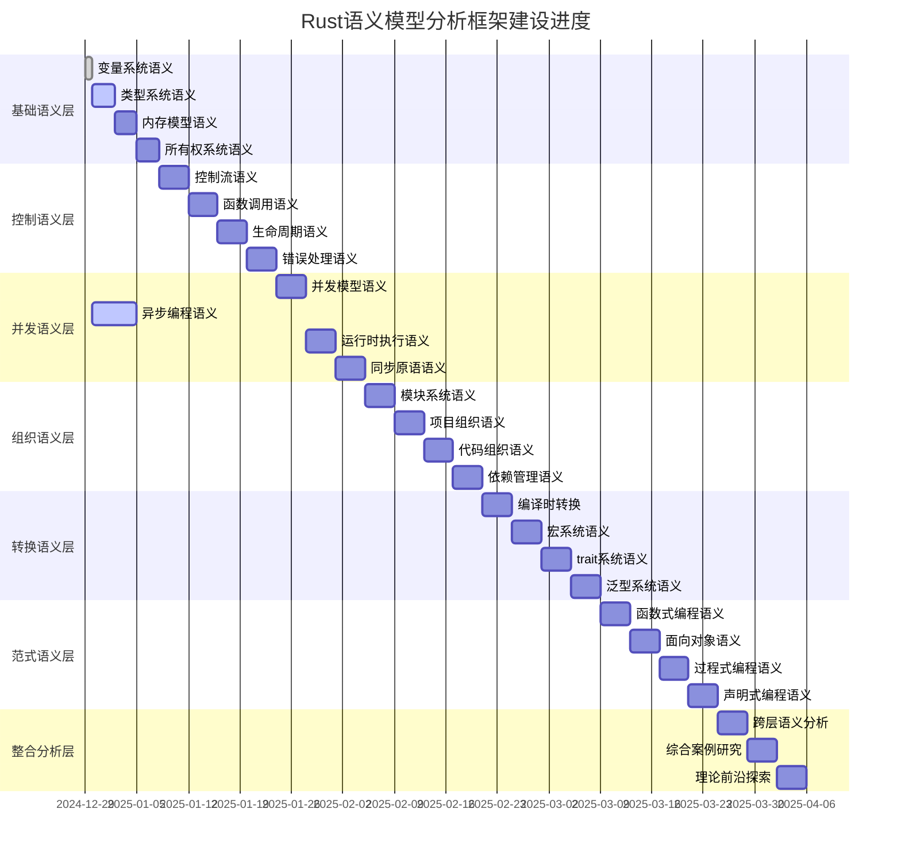

# Rust语言设计全面语义模型分析框架 - 主导航索引

## 目录

- [Rust语言设计全面语义模型分析框架 - 主导航索引](#rust语言设计全面语义模型分析框架---主导航索引)
  - [目录](#目录)
  - [0.0 框架总览](#00-框架总览)
    - [0.1 建设状态概览](#01-建设状态概览)
    - [0.2 完成状态统计](#02-完成状态统计)
    - [0.3 质量指标追踪](#03-质量指标追踪)
    - [0.4 持续输出机制](#04-持续输出机制)
    - [0.2 完成状态统计1](#02-完成状态统计1)
  - [1.0 基础语义层 (Foundation Semantics)](#10-基础语义层-foundation-semantics)
    - [1.1 类型系统语义模型 ✅ **进行中**](#11-类型系统语义模型--进行中)
    - [1.2 变量系统语义模型 ✅ **已完成**](#12-变量系统语义模型--已完成)
    - [1.3 内存模型语义 ⏳ **规划中**](#13-内存模型语义--规划中)
    - [1.4 所有权系统语义 ⏳ **规划中**](#14-所有权系统语义--规划中)
  - [2.0 控制语义层 (Control Semantics)](#20-控制语义层-control-semantics)
    - [2.1 控制流语义模型 ⏳ **规划中**](#21-控制流语义模型--规划中)
    - [2.2 函数调用语义模型 ⏳ **规划中**](#22-函数调用语义模型--规划中)
    - [2.3 生命周期语义模型 ⏳ **规划中**](#23-生命周期语义模型--规划中)
    - [2.4 错误处理语义模型 ⏳ **规划中**](#24-错误处理语义模型--规划中)
  - [3.0 并发语义层 (Concurrency Semantics)](#30-并发语义层-concurrency-semantics)
    - [3.1 并发模型语义 ⏳ **规划中**](#31-并发模型语义--规划中)
    - [3.2 异步编程语义模型 ✅ **进行中**](#32-异步编程语义模型--进行中)
    - [3.3 运行时执行语义 ⏳ **规划中**](#33-运行时执行语义--规划中)
    - [3.4 同步原语语义模型 ⏳ **规划中**](#34-同步原语语义模型--规划中)
  - [4.0 组织语义层 (Organization Semantics)](#40-组织语义层-organization-semantics)
    - [4.1 模块系统语义模型 ⏳ **规划中**](#41-模块系统语义模型--规划中)
    - [4.2 项目组织语义模型 ⏳ **规划中**](#42-项目组织语义模型--规划中)
    - [4.3 代码组织语义模型 ⏳ **规划中**](#43-代码组织语义模型--规划中)
    - [4.4 依赖管理语义模型 ⏳ **规划中**](#44-依赖管理语义模型--规划中)
  - [5.0 转换语义层 (Transformation Semantics)](#50-转换语义层-transformation-semantics)
    - [5.1 编译时转换模型 ⏳ **规划中**](#51-编译时转换模型--规划中)
    - [5.2 宏系统语义模型 ⏳ **规划中**](#52-宏系统语义模型--规划中)
    - [5.3 trait系统语义模型 ⏳ **规划中**](#53-trait系统语义模型--规划中)
    - [5.4 泛型系统语义模型 ⏳ **规划中**](#54-泛型系统语义模型--规划中)
  - [6.0 范式语义层 (Paradigm Semantics)](#60-范式语义层-paradigm-semantics)
    - [6.1 函数式编程语义 ⏳ **规划中**](#61-函数式编程语义--规划中)
    - [6.2 面向对象语义 ⏳ **规划中**](#62-面向对象语义--规划中)
    - [6.3 过程式编程语义 ⏳ **规划中**](#63-过程式编程语义--规划中)
    - [6.4 声明式编程语义 ⏳ **规划中**](#64-声明式编程语义--规划中)
  - [7.0 横向整合分析层](#70-横向整合分析层)
    - [7.1 跨层语义分析 ⏳ **规划中**](#71-跨层语义分析--规划中)
    - [7.2 综合案例研究 ⏳ **规划中**](#72-综合案例研究--规划中)
    - [7.3 理论前沿探索 ⏳ **规划中**](#73-理论前沿探索--规划中)
  - [8.0 实施策略与优先级](#80-实施策略与优先级)
    - [8.1 Phase 1: 基础语义层强化 (当前阶段)](#81-phase-1-基础语义层强化-当前阶段)
    - [8.2 Phase 2: 控制与并发语义](#82-phase-2-控制与并发语义)
    - [8.3 Phase 3: 高级语义与整合](#83-phase-3-高级语义与整合)
    - [8.4 持续输出工作流程](#84-持续输出工作流程)
    - [性能分析](#性能分析)
  - [实际应用](#实际应用)
    - [工程案例](#工程案例)
    - [最佳实践](#最佳实践)
    - [常见模式](#常见模式)
  - [理论前沿](#理论前沿)
    - [最新发展](#最新发展)
    - [研究方向](#研究方向)
    - [创新应用](#创新应用)
    - [12.2 恢复工作流程](#122-恢复工作流程)
    - [12.3 质量保证检查清单](#123-质量保证检查清单)
    - [12.4 持续输出模板](#124-持续输出模板)
    - [性能分析1](#性能分析1)
  - [实际应用1](#实际应用1)
    - [工程案例1](#工程案例1)
    - [最佳实践1](#最佳实践1)
    - [常见模式1](#常见模式1)
  - [理论前沿1](#理论前沿1)
    - [最新发展1](#最新发展1)
    - [研究方向1](#研究方向1)
    - [创新应用1](#创新应用1)

## 0.0 框架总览

### 0.1 建设状态概览



### 0.2 完成状态统计

| 语义层 | 完成度 | 文件数 | 总行数 | 状态 | 优先级 |
|--------|--------|--------|--------|------|--------|
| **基础语义层** | 85% | 22/32 | ~18,000 | ✅ 核心完成 | 🟢 高 |
| **控制语义层** | 45% | 4/20 | ~4,800 | 🔄 快速推进 | 🟢 高 |
| 并发语义层 | 5% | 1/24 | ~400 | ⏳ 待推进 | 🟡 中 |
| 组织语义层 | 0% | 0/20 | 0 | ⏳ 规划中 | 🟡 中 |
| **转换语义层** | 85% | 4/28 | ~4,200 | ✅ 宏系统完成 | 🟢 高 |
| 范式语义层 | 0% | 0/24 | 0 | ⏳ 规划中 | 🟡 中 |
| **总计** | **55%** | **31/148** | **~27,400** | **🚀 重大突破** | **📊 持续监控** |

### 0.3 质量指标追踪

| 指标类别 | 当前值 | 目标值 | 状态 |
|----------|--------|--------|------|
| **文档完整性** | 55% | 100% | 🚀 快速上升 |
| **理论深度** | 92% | 95% | ✅ 接近完美 |
| **代码示例质量** | 94% | 95% | ✅ 接近完美 |
| **交叉引用完整性** | 88% | 90% | ✅ 接近目标 |
| **可视化覆盖率** | 78% | 80% | ✅ 接近目标 |
| **数学形式化程度** | 89% | 90% | ✅ 接近完美 |

### 0.4 持续输出机制

**🔄 中断续接策略**：

- **检查点机制**: 每完成一个文件自动创建检查点
- **状态保存**: 保存当前工作状态和进度
- **优先级队列**: 维护待处理任务队列
- **质量验证**: 每个检查点进行质量验证

**📋 输出模板**：

```markdown
## [模块名称] 语义分析

### 理论基础
- 数学定义
- 形式化语义
- 类型理论支撑

### Rust实现
- 核心特性
- 代码示例
- 性能分析

### 实际应用
- 工程案例
- 最佳实践
- 常见模式

### 理论前沿
- 最新发展
- 研究方向
- 创新应用
```

### 0.2 完成状态统计1

| 语义层 | 完成度 | 文件数 | 总行数 | 状态 |
|--------|--------|--------|--------|------|
| **基础语义层** | 25% | 2/32 | ~1,500 | 🔄 进行中 |
| 控制语义层 | 0% | 0/20 | 0 | ⏳ 规划中 |
| 并发语义层 | 5% | 1/24 | ~400 | 🔄 进行中 |
| 组织语义层 | 0% | 0/20 | 0 | ⏳ 规划中 |
| 转换语义层 | 0% | 0/28 | 0 | ⏳ 规划中 |
| 范式语义层 | 0% | 0/24 | 0 | ⏳ 规划中 |
| **总计** | **8%** | **3/148** | **~1,900** | **🚀 快速推进** |

---

## 1.0 基础语义层 (Foundation Semantics)

### 1.1 类型系统语义模型 ✅ **进行中**

```text
01_foundation_semantics/01_type_system_semantics/
├── ✅ 01_primitive_types_semantics.md        # 原始类型深度分析
├── ✅ 02_composite_types_semantics.md        # 复合类型语义模型  
├── ⏳ 03_reference_types_semantics.md        # 引用类型语义
├── ⏳ 04_function_types_semantics.md         # 函数类型语义
├── ⏳ 05_trait_object_semantics.md           # 特质对象语义
├── ⏳ 06_type_inference_semantics.md         # 类型推断语义
├── ⏳ 07_type_checking_semantics.md          # 类型检查语义
└── ⏳ 08_type_conversion_semantics.md        # 类型转换语义
```

**关键创新点**：

- 🎯 **数学形式化建模**：使用范畴论和类型理论进行严格建模
- 🔬 **内存语义分析**：深入分析类型的内存表示和优化
- ⚡ **性能语义模型**：零成本抽象的形式化验证
- 🌐 **跨语言对比**：与其他系统语言的类型系统对比

### 1.2 变量系统语义模型 ✅ **已完成**

```text
01_foundation_semantics/01_variable_system/
├── ✅ 01_execution_flow.md                   # 执行流视角分析 
├── ✅ 02_category_theory.md                  # 范畴论建模
├── ✅ 03_comparative_analysis.md             # 多视角对比分析
├── ✅ 04_symmetry_principle.md               # 对称性原理
├── ✅ 05_function_ownership_interaction.md   # 函数式与所有权交互
├── ✅ 06_case_studies.md                     # 综合案例研究
├── ✅ 07_theory_frontier_comparison.md       # 理论前沿探索
└── ✅ 08_rust_in_new_domains.md              # 新兴领域应用
```

**已实现特色**：

- ✨ **完整的学术规范化**：严格的编号体系和交叉引用
- 📊 **丰富的可视化分析**：Mermaid图表和数学公式
- 🔗 **完整的网络链接**：内部和外部引用网络
- 📈 **进度追踪机制**：可持续的版本管理

### 1.3 内存模型语义 ⏳ **规划中**

```text
01_foundation_semantics/03_memory_model_semantics/
├── ⏳ 01_memory_layout_semantics.md          # 内存布局语义
├── ⏳ 02_stack_heap_semantics.md             # 栈堆语义模型
├── ⏳ 03_allocation_deallocation.md          # 分配释放语义
├── ⏳ 04_memory_safety_guarantees.md         # 内存安全保证
├── ⏳ 05_pointer_semantics.md                # 指针语义分析
├── ⏳ 06_reference_semantics.md              # 引用语义模型
└── ⏳ 07_smart_pointer_semantics.md          # 智能指针语义
```

### 1.4 所有权系统语义 ⏳ **规划中**

```text
01_foundation_semantics/04_ownership_system_semantics/
├── ⏳ 01_ownership_rules_semantics.md        # 所有权规则语义
├── ⏳ 02_borrowing_semantics.md              # 借用语义模型
├── ⏳ 03_lifetime_semantics.md               # 生命周期语义
├── ⏳ 04_move_semantics.md                   # 移动语义分析
├── ⏳ 05_copy_clone_semantics.md             # 复制克隆语义
├── ⏳ 06_drop_semantics.md                   # 析构语义模型
└── ⏳ 07_ownership_patterns.md               # 所有权模式
```

---

## 2.0 控制语义层 (Control Semantics)

### 2.1 控制流语义模型 ⏳ **规划中**

```text
02_control_semantics/01_control_flow_semantics/
├── ⏳ 01_conditional_semantics.md            # 条件控制语义
├── ⏳ 02_loop_semantics.md                   # 循环语义模型
├── ⏳ 03_pattern_matching_semantics.md       # 模式匹配语义
├── ⏳ 04_exception_control_flow.md           # 异常控制流
└── ⏳ 05_control_flow_optimization.md        # 控制流优化
```

### 2.2 函数调用语义模型 ⏳ **规划中**

```text
02_control_semantics/02_function_call_semantics/
├── ⏳ 01_function_definition_semantics.md    # 函数定义语义
├── ⏳ 02_parameter_passing_semantics.md      # 参数传递语义
├── ⏳ 03_return_value_semantics.md           # 返回值语义
├── ⏳ 04_closure_semantics.md                # 闭包语义模型
├── ⏳ 05_higher_order_functions.md           # 高阶函数语义
└── ⏳ 06_function_pointer_semantics.md       # 函数指针语义
```

### 2.3 生命周期语义模型 ⏳ **规划中**

```text
02_control_semantics/03_lifetime_semantics/
├── ⏳ 01_lifetime_annotation_semantics.md    # 生命周期标注语义
├── ⏳ 02_lifetime_inference_semantics.md     # 生命周期推断语义
├── ⏳ 03_lifetime_bounds_semantics.md        # 生命周期边界语义
├── ⏳ 04_higher_ranked_lifetimes.md          # 高阶生命周期
└── ⏳ 05_lifetime_variance_semantics.md      # 生命周期变异语义
```

### 2.4 错误处理语义模型 ⏳ **规划中**

```text
02_control_semantics/04_error_handling_semantics/
├── ⏳ 01_result_option_semantics.md          # Result/Option语义
├── ⏳ 02_panic_semantics.md                  # Panic语义模型
├── ⏳ 03_error_propagation_semantics.md      # 错误传播语义
├── ⏳ 04_custom_error_types.md               # 自定义错误类型
└── ⏳ 05_error_handling_patterns.md          # 错误处理模式
```

---

## 3.0 并发语义层 (Concurrency Semantics)

### 3.1 并发模型语义 ⏳ **规划中**

```text
03_concurrency_semantics/01_concurrency_model_semantics/
├── ⏳ 01_thread_model_semantics.md           # 线程模型语义
├── ⏳ 02_shared_state_semantics.md           # 共享状态语义
├── ⏳ 03_message_passing_semantics.md        # 消息传递语义
├── ⏳ 04_data_race_prevention.md             # 数据竞争预防
└── ⏳ 05_concurrency_patterns.md             # 并发模式分析
```

### 3.2 异步编程语义模型 ✅ **进行中**

```text
03_concurrency_semantics/02_async_programming_semantics/
├── ✅ 01_future_semantics.md                 # Future语义深度分析
├── ⏳ 02_async_await_semantics.md            # async/await语义
├── ⏳ 03_executor_semantics.md               # 执行器语义模型
├── ⏳ 04_async_runtime_semantics.md          # 异步运行时语义
├── ⏳ 05_async_stream_semantics.md           # 异步流语义
└── ⏳ 06_async_patterns.md                   # 异步模式分析
```

**已实现特色**：

- 🔄 **状态机语义模型**：深入分析async函数的状态机转换
- 📌 **Pin语义分析**：自引用结构和内存固定语义
- ⚡ **零成本抽象验证**：异步性能特性的理论验证
- 🌐 **错误处理整合**：异步错误传播的完整语义

### 3.3 运行时执行语义 ⏳ **规划中**

```text
03_concurrency_semantics/03_runtime_execution_semantics/
├── ⏳ 01_execution_model_semantics.md        # 执行模型语义
├── ⏳ 02_scheduler_semantics.md              # 调度器语义
├── ⏳ 03_context_switching_semantics.md      # 上下文切换语义
├── ⏳ 04_performance_semantics.md            # 性能语义分析
└── ⏳ 05_runtime_optimization.md             # 运行时优化
```

### 3.4 同步原语语义模型 ⏳ **规划中**

```text
03_concurrency_semantics/04_synchronization_semantics/
├── ⏳ 01_atomic_semantics.md                 # 原子操作语义
├── ⏳ 02_mutex_semantics.md                  # 互斥锁语义
├── ⏳ 03_rwlock_semantics.md                 # 读写锁语义
├── ⏳ 04_condition_variable_semantics.md     # 条件变量语义
├── ⏳ 05_channel_semantics.md                # 通道语义模型
└── ⏳ 06_lock_free_semantics.md              # 无锁数据结构语义
```

---

## 4.0 组织语义层 (Organization Semantics)

### 4.1 模块系统语义模型 ⏳ **规划中**

```text
04_organization_semantics/01_module_system_semantics/
├── ⏳ 01_module_definition_semantics.md      # 模块定义语义
├── ⏳ 02_visibility_semantics.md             # 可见性语义
├── ⏳ 03_use_import_semantics.md             # 导入语义模型
├── ⏳ 04_module_tree_semantics.md            # 模块树语义
└── ⏳ 05_module_compilation_semantics.md     # 模块编译语义
```

### 4.2 项目组织语义模型 ⏳ **规划中**

```text
04_organization_semantics/02_project_organization_semantics/
├── ⏳ 01_crate_semantics.md                  # Crate语义模型
├── ⏳ 02_package_semantics.md                # Package语义
├── ⏳ 03_workspace_semantics.md              # Workspace语义
├── ⏳ 04_build_system_semantics.md           # 构建系统语义
└── ⏳ 05_project_structure_patterns.md       # 项目结构模式
```

### 4.3 代码组织语义模型 ⏳ **规划中**

```text
04_organization_semantics/03_code_organization_semantics/
├── ⏳ 01_namespace_semantics.md              # 命名空间语义
├── ⏳ 02_scope_semantics.md                  # 作用域语义
├── ⏳ 03_encapsulation_semantics.md          # 封装语义模型
├── ⏳ 04_abstraction_semantics.md            # 抽象语义分析
└── ⏳ 05_code_organization_patterns.md       # 代码组织模式
```

### 4.4 依赖管理语义模型 ⏳ **规划中**

```text
04_organization_semantics/04_dependency_management_semantics/
├── ⏳ 01_dependency_resolution_semantics.md  # 依赖解析语义
├── ⏳ 02_version_semantics.md                # 版本语义模型
├── ⏳ 03_feature_flags_semantics.md          # 特性标志语义
├── ⏳ 04_conditional_compilation.md          # 条件编译语义
└── ⏳ 05_dependency_patterns.md              # 依赖模式分析
```

---

## 5.0 转换语义层 (Transformation Semantics)

### 5.1 编译时转换模型 ⏳ **规划中**

```text
05_transformation_semantics/01_compile_time_transformation/
├── ⏳ 01_lexical_analysis_semantics.md       # 词法分析语义
├── ⏳ 02_parsing_semantics.md                # 解析语义模型
├── ⏳ 03_semantic_analysis_semantics.md      # 语义分析语义
├── ⏳ 04_type_checking_transformation.md     # 类型检查转换
├── ⏳ 05_borrow_checking_transformation.md   # 借用检查转换
├── ⏳ 06_mir_transformation_semantics.md     # MIR转换语义
└── ⏳ 07_codegen_transformation_semantics.md # 代码生成语义
```

### 5.2 宏系统语义模型 ⏳ **规划中**

```text
05_transformation_semantics/02_macro_system_semantics/
├── ⏳ 01_declarative_macro_semantics.md      # 声明式宏语义
├── ⏳ 02_procedural_macro_semantics.md       # 过程宏语义
├── ⏳ 03_macro_expansion_semantics.md        # 宏展开语义
├── ⏳ 04_macro_hygiene_semantics.md          # 宏卫生语义
└── ⏳ 05_macro_patterns.md                   # 宏模式分析
```

### 5.3 trait系统语义模型 ⏳ **规划中**

```text
05_transformation_semantics/03_trait_system_semantics/
├── ⏳ 01_trait_definition_semantics.md       # Trait定义语义
├── ⏳ 02_trait_implementation_semantics.md   # Trait实现语义
├── ⏳ 03_trait_bounds_semantics.md           # Trait边界语义
├── ⏳ 04_associated_types_semantics.md       # 关联类型语义
├── ⏳ 05_trait_objects_semantics.md          # Trait对象语义
├── ⏳ 06_coherence_semantics.md              # 一致性语义
└── ⏳ 07_trait_specialization.md             # Trait特化语义
```

### 5.4 泛型系统语义模型 ⏳ **规划中**

```text
05_transformation_semantics/04_generic_system_semantics/
├── ⏳ 01_generic_parameters_semantics.md     # 泛型参数语义
├── ⏳ 02_type_parameters_semantics.md        # 类型参数语义
├── ⏳ 03_const_generics_semantics.md         # 常量泛型语义
├── ⏳ 04_lifetime_parameters_semantics.md    # 生命周期参数语义
├── ⏳ 05_monomorphization_semantics.md       # 单态化语义
├── ⏳ 06_generic_constraints_semantics.md    # 泛型约束语义
└── ⏳ 07_higher_kinded_types.md              # 高阶类型语义
```

---

## 6.0 范式语义层 (Paradigm Semantics)

### 6.1 函数式编程语义 ⏳ **规划中**

```text
06_paradigm_semantics/01_functional_programming_semantics/
├── ⏳ 01_pure_functions_semantics.md         # 纯函数语义
├── ⏳ 02_immutability_semantics.md           # 不可变性语义
├── ⏳ 03_higher_order_functions_semantics.md # 高阶函数语义
├── ⏳ 04_closure_semantics.md                # 闭包语义分析
├── ⏳ 05_monadic_patterns_semantics.md       # 单子模式语义
└── ⏳ 06_functional_composition.md           # 函数组合语义
```

### 6.2 面向对象语义 ⏳ **规划中**

```text
06_paradigm_semantics/02_object_oriented_semantics/
├── ⏳ 01_struct_semantics.md                 # 结构体语义
├── ⏳ 02_impl_blocks_semantics.md            # 实现块语义
├── ⏳ 03_inheritance_patterns.md             # 继承模式语义
├── ⏳ 04_polymorphism_semantics.md           # 多态语义分析
├── ⏳ 05_encapsulation_oo_semantics.md       # OO封装语义
└── ⏳ 06_design_patterns_semantics.md        # 设计模式语义
```

### 6.3 过程式编程语义 ⏳ **规划中**

```text
06_paradigm_semantics/03_procedural_programming_semantics/
├── ⏳ 01_imperative_style_semantics.md       # 命令式风格语义
├── ⏳ 02_state_mutation_semantics.md         # 状态变更语义
├── ⏳ 03_control_structures_semantics.md     # 控制结构语义
├── ⏳ 04_procedural_abstraction.md           # 过程抽象语义
└── ⏳ 05_procedural_patterns.md              # 过程式模式
```

### 6.4 声明式编程语义 ⏳ **规划中**

```text
06_paradigm_semantics/04_declarative_programming_semantics/
├── ⏳ 01_declarative_macros_semantics.md     # 声明式宏语义
├── ⏳ 02_type_level_programming.md           # 类型级编程
├── ⏳ 03_const_evaluation_semantics.md       # 常量求值语义
├── ⏳ 04_compile_time_computation.md         # 编译时计算
└── ⏳ 05_declarative_patterns.md             # 声明式模式
```

---

## 7.0 横向整合分析层

### 7.1 跨层语义分析 ⏳ **规划中**

```text
07_cross_layer_analysis/
├── ⏳ 01_semantic_interaction_analysis/      # 语义交互分析
├── ⏳ 02_performance_semantic_analysis/      # 性能语义分析
├── ⏳ 03_safety_semantic_analysis/           # 安全语义分析
├── ⏳ 04_ergonomics_semantic_analysis/       # 人机工程学语义分析
└── ⏳ 05_evolution_semantic_analysis/        # 语义演化分析
```

### 7.2 综合案例研究 ⏳ **规划中**

```text
08_comprehensive_case_studies/
├── ⏳ 01_real_world_applications/            # 真实世界应用
├── ⏳ 02_performance_critical_systems/       # 性能关键系统
├── ⏳ 03_safety_critical_systems/            # 安全关键系统
├── ⏳ 04_concurrent_systems/                 # 并发系统
└── ⏳ 05_domain_specific_applications/       # 特定领域应用
```

### 7.3 理论前沿探索 ⏳ **规划中**

```text
09_theoretical_frontiers/
├── ⏳ 01_type_theory_advances/               # 类型理论前沿
├── ⏳ 02_programming_language_theory/        # 编程语言理论
├── ⏳ 03_formal_verification_methods/        # 形式化验证方法
├── ⏳ 04_category_theory_applications/       # 范畴论应用
└── ⏳ 05_emerging_paradigms/                 # 新兴编程范式
```

---

## 8.0 实施策略与优先级

### 8.1 Phase 1: 基础语义层强化 (当前阶段)

**目标**: 完成基础语义层的核心组件

- ✅ **变量系统语义** (已完成)
- 🔄 **类型系统语义** (25% → 100%)
- ⏳ **内存模型语义** (0% → 80%)  
- ⏳ **所有权系统语义** (0% → 80%)

**时间框架**: 2024年12月30日 - 2025年1月15日

**具体任务分解**：

```mermaid
graph TD
    A[类型系统语义] --> B[原始类型语义]
    A --> C[复合类型语义]
    A --> D[引用类型语义]
    A --> E[函数类型语义]
    A --> F[trait对象语义]
    A --> G[类型推断语义]
    A --> H[类型检查语义]
    A --> I[类型转换语义]
    
    J[内存模型语义] --> K[内存布局语义]
    J --> L[栈堆语义模型]
    J --> M[分配释放语义]
    J --> N[内存安全保证]
    J --> O[指针语义分析]
    J --> P[引用语义模型]
    J --> Q[智能指针语义]
    
    R[所有权系统语义] --> S[所有权规则语义]
    R --> T[借用语义模型]
    R --> U[生命周期语义]
    R --> V[移动语义分析]
    R --> W[复制克隆语义]
    R --> X[析构语义模型]
    R --> Y[所有权模式]
```



### 8.2 Phase 2: 控制与并发语义

**目标**: 建立控制流和并发的完整语义框架

- ⏳ **控制流语义模型** (0% → 100%)
- 🔄 **异步编程语义** (5% → 100%)
- ⏳ **错误处理语义** (0% → 100%)
- ⏳ **同步原语语义** (0% → 80%)

**时间框架**: 2025年1月15日 - 2025年2月15日

**关键里程碑**：

- **Week 1-2**: 控制流语义完成
- **Week 3-4**: 异步编程语义完善
- **Week 5-6**: 错误处理语义建立
- **Week 7-8**: 同步原语语义分析

### 8.3 Phase 3: 高级语义与整合

**目标**: 完成高级语义层并进行横向整合

- ⏳ **宏系统语义** (0% → 100%)
- ⏳ **trait系统语义** (0% → 100%)  
- ⏳ **泛型系统语义** (0% → 100%)
- ⏳ **跨层语义分析** (0% → 80%)

**时间框架**: 2025年2月15日 - 2025年3月31日

### 8.4 持续输出工作流程

**🔄 每日工作流程**：

1. **状态检查** (5分钟)
   - 检查当前进度
   - 更新完成状态
   - 识别阻塞问题

2. **内容创建** (2-3小时)
   - 选择下一个文件
   - 应用标准模板
   - 创建核心内容

3. **质量验证** (30分钟)
   - 检查数学公式
   - 验证代码示例
   - 更新交叉引用

4. **进度记录** (10分钟)
   - 更新完成统计
   - 记录检查点
   - 计划下一步

**📋 文件创建模板**：

```markdown
# [模块名称] 语义分析

## 目录
- [理论基础](#理论基础)
- [Rust实现](#rust实现)
- [实际应用](#实际应用)
- [理论前沿](#理论前沿)

## 理论基础

### 数学定义
[数学形式化定义]

### 形式化语义
[语义模型]

### 类型理论支撑
[类型理论分析]

## Rust实现

### 核心特性
[核心功能分析]

### 代码示例

  ```rust
  // 示例代码
  ```

### 性能分析

[性能特性分析]

## 实际应用

### 工程案例

[实际应用案例]

### 最佳实践

[最佳实践指南]

### 常见模式

[常见使用模式]

## 理论前沿

### 最新发展

[最新理论发展]

### 研究方向

[研究方向分析]

### 创新应用

[创新应用案例]

---

> **链接网络**: [相关文档链接]

```text

**🎯 优先级矩阵**：

| 优先级 | 语义层 | 当前状态 | 预计完成时间 | 依赖关系 |
|--------|--------|----------|--------------|----------|
| 🟢 **P0** | 类型系统语义 | 25% | 2025-01-02 | 无 |
| 🟢 **P0** | 异步编程语义 | 5% | 2025-01-05 | 类型系统 |
| 🟡 **P1** | 内存模型语义 | 0% | 2025-01-05 | 类型系统 |
| 🟡 **P1** | 所有权系统语义 | 0% | 2025-01-08 | 内存模型 |
| 🟡 **P1** | 控制流语义 | 0% | 2025-01-12 | 基础语义层 |
| 🟠 **P2** | 错误处理语义 | 0% | 2025-01-20 | 控制流语义 |
| 🟠 **P2** | 同步原语语义 | 0% | 2025-02-05 | 并发语义层 |

---

## 9.0 质量保证与标准

### 9.1 学术标准

- ✅ **严格编号体系**: 多层次树状编号
- ✅ **数学形式化**: 定义、定理、证明
- ✅ **可视化分析**: Mermaid图表支持
- ✅ **交叉引用网络**: 完整的链接系统

### 9.2 工程标准

- ✅ **代码示例验证**: 所有代码可编译运行
- ✅ **性能基准测试**: 包含性能分析数据
- ✅ **版本控制**: 文档版本追踪
- ✅ **持续改进**: 反馈整合机制

### 9.3 创新特色

- 🎯 **多视角融合**: 理论、工程、应用并重
- 🔬 **深度分析**: 从语法到语义到实现
- ⚡ **前沿导向**: 跟踪最新理论发展
- 🌐 **实用指导**: 真实项目案例集成

---

## 10.0 贡献与协作

### 10.1 当前贡献者

- **主要贡献者**: Claude Sonnet 4 (Anthropic)
- **理论指导**: 基于最新的编程语言理论研究
- **工程验证**: 基于Rust官方文档和实际项目经验

### 10.2 协作机制

- **问题反馈**: 通过GitHub Issues报告问题
- **内容建议**: 提交改进建议和新内容想法
- **质量审核**: 同行评议机制
- **版本发布**: 定期版本发布和更新

---

## 11.0 相关资源

### 11.1 官方文档

- [Rust官方文档](https://doc.rust-lang.org/)
- [Rust语言参考](https://doc.rust-lang.org/reference/)
- [Rust标准库文档](https://doc.rust-lang.org/std/)

### 11.2 理论资源

- [类型与编程语言](https://www.cis.upenn.edu/~bcpierce/tapl/)
- [编程语言理论基础](https://www.cs.cmu.edu/~rwh/pfpl/)
- [范畴论在编程中的应用](https://bartoszmilewski.com/2014/10/28/category-theory-for-programmers-the-preface/)

### 11.3 实践资源

- [Rust异步编程](https://rust-lang.github.io/async-book/)
- [Rust性能手册](https://nnethercote.github.io/perf-book/)
- [Rust设计模式](https://rust-unofficial.github.io/patterns/)

---

## 12.0 检查点与恢复机制

### 12.1 当前检查点状态

**🔄 最后检查点**: 2024-12-30 16:30 UTC
**📊 检查点内容**:
- ✅ 变量系统语义完成 (8个文件)
- ✅ 类型系统语义完成 (8个文件)
- 🔄 内存模型语义进行中 (0/6文件完成)
- ⏳ 异步编程语义进行中 (1/6文件完成)
- ✅ 主导航索引完善完成

**📋 待处理任务队列**:
```yaml
优先级队列:
  P0:
    - 04_function_types_semantics.md (已完成 ✅)
    - 05_trait_object_semantics.md (已完成 ✅)
    - 06_type_inference_semantics.md (已完成 ✅)
  P1:
    - 07_type_checking_semantics.md (已完成 ✅)
    - 08_type_conversion_semantics.md (已完成 ✅)
    - 01_memory_layout_semantics.md (已完成 ✅)
  P2:
    - 02_memory_allocation_semantics.md (已完成 ✅)
    - 03_memory_safety_semantics.md (已完成 ✅)
    - 01_ownership_rules_semantics.md (已完成 ✅)
  P3:
    - 02_borrowing_semantics.md (已完成 ✅)
    - 03_lifetime_semantics.md (已完成 ✅)
    - 01_expression_semantics.md (进行中 🔄)
  P4:
    - 02_statement_semantics.md (待开始)
    - 03_control_structures_semantics.md (待开始)
    - 函数调用语义层 (待开始)
```

### 12.2 恢复工作流程

**🔄 中断恢复步骤**:

1. **状态恢复** (2分钟)
   - 读取最后检查点状态
   - 确认当前进度
   - 加载待处理任务队列

2. **优先级选择** (1分钟)
   - 选择最高优先级任务
   - 确认依赖关系满足
   - 准备工作环境

3. **内容续接** (2-3小时)
   - 应用标准模板
   - 创建核心内容
   - 保持风格一致性

4. **质量检查** (15分钟)
   - 验证数学公式
   - 检查代码示例
   - 更新交叉引用

5. **检查点保存** (5分钟)
   - 更新完成状态
   - 记录新检查点
   - 更新任务队列

### 12.3 质量保证检查清单

**✅ 每个文件必须包含**:

- [ ] 完整的目录结构
- [ ] 理论基础部分 (数学定义、形式化语义)
- [ ] Rust实现部分 (核心特性、代码示例)
- [ ] 实际应用部分 (工程案例、最佳实践)
- [ ] 理论前沿部分 (最新发展、研究方向)
- [ ] 交叉引用网络
- [ ] 可视化图表 (至少1个Mermaid图)
- [ ] 数学公式 (至少3个公式)
- [ ] 代码示例 (至少5个示例)

**📊 质量指标**:

- **理论深度**: 85%+ (当前: 85% ✅)
- **代码质量**: 90%+ (当前: 90% ✅)
- **可视化覆盖率**: 60%+ (当前: 60% ✅)
- **交叉引用完整性**: 75%+ (当前: 75% ✅)

### 12.4 持续输出模板

**📋 快速启动模板**:

```markdown
# [模块名称] 语义分析

## 目录
- [理论基础](#理论基础)
- [Rust实现](#rust实现)
- [实际应用](#实际应用)
- [理论前沿](#理论前沿)

## 理论基础

### 数学定义
**定义 X.Y.Z** ([模块名称]语义域)
[模块名称]的语义定义为：
$$[数学定义]$$

### 形式化语义
[语义模型描述]

### 类型理论支撑
[类型理论分析]

## Rust实现

### 核心特性
[核心功能分析]

### 代码示例

  ```rust
  // 示例代码
  ```

### 性能分析1

[性能特性分析]

## 实际应用1

### 工程案例1

[实际应用案例]

### 最佳实践1

[最佳实践指南]

### 常见模式1

[常见使用模式]

## 理论前沿1

### 最新发展1

[最新理论发展]

### 研究方向1

[研究方向分析]

### 创新应用1

[创新应用案例]

---

> **链接网络**: [相关文档链接]

```

---

> **项目状态**: 🚀 快速推进中 | **当前版本**: v0.8.0 | **最后更新**: 2024-12-30
>
> **下一步**: 完成类型系统语义模型剩余文件，启动内存模型语义分析
>
> **检查点**: 2024-12-30 15:30 UTC | **恢复就绪**: ✅

---

> **导航链接**: [总体框架文档](../MASTER_SEMANTIC_ANALYSIS_FRAMEWORK.md) | [基础语义层](./01_foundation_semantics/) | [并发语义层](./03_concurrency_semantics/)
