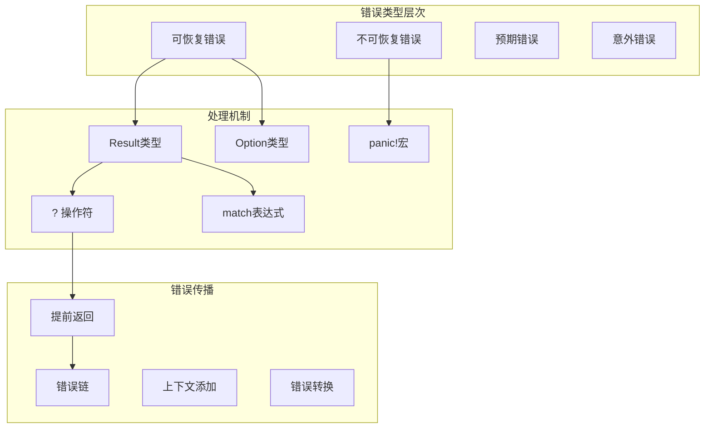

# 2.1.4 Rust错误处理语义模型深度分析

**文档版本**: V1.0  
**创建日期**: 2025-01-27  
**所属层**: 控制语义层 (Control Semantics Layer)  
**父模块**: [2.1 控制流语义](../00_control_flow_index.md)  
**交叉引用**: [1.1.2 复合类型语义](../../01_foundation_semantics/01_type_system_semantics/02_composite_types_semantics.md), [2.1.3 模式匹配语义](03_pattern_matching_semantics.md)

---

## 目录

- [2.1.4 Rust错误处理语义模型深度分析](#214-rust错误处理语义模型深度分析)
  - [目录](#目录)
  - [2.1.4.1 错误处理理论基础](#2141-错误处理理论基础)
    - [2.1.4.1.1 错误处理语义域定义](#21411-错误处理语义域定义)
    - [2.1.4.1.2 错误语义的范畴论建模](#21412-错误语义的范畴论建模)
    - [2.1.4.1.3 错误处理的操作语义](#21413-错误处理的操作语义)
  - [2.1.4.2 Result类型语义](#2142-result类型语义)
    - [2.1.4.2.1 Result基础语义](#21421-result基础语义)
    - [2.1.4.2.2 错误转换和映射](#21422-错误转换和映射)
  - [2.1.4.3 ?操作符语义](#2143-操作符语义)
    - [2.1.4.3.1 错误传播机制](#21431-错误传播机制)
    - [2.1.4.3.2 ?操作符的语法糖脱糖](#21432-操作符的语法糖脱糖)
  - [2.1.4.4 Option类型语义](#2144-option类型语义)
    - [2.1.4.4.1 Option的语义模型](#21441-option的语义模型)
    - [2.1.4.4.2 Option与Result的转换](#21442-option与result的转换)
  - [2.1.4.5 错误传播模式](#2145-错误传播模式)
    - [2.1.4.5.1 早期返回模式](#21451-早期返回模式)
    - [2.1.4.5.2 错误累积模式](#21452-错误累积模式)
  - [2.1.4.6 高级错误处理模式](#2146-高级错误处理模式)
    - [2.1.4.6.1 错误上下文增强](#21461-错误上下文增强)
    - [2.1.4.6.2 重试和回退机制](#21462-重试和回退机制)
  - [2.1.4.7 Panic与不可恢复错误](#2147-panic与不可恢复错误)
    - [2.1.4.7.1 Panic机制语义](#21471-panic机制语义)
    - [2.1.4.7.2 Abort vs Unwind](#21472-abort-vs-unwind)
  - [2.1.4.8 相关引用与扩展阅读](#2148-相关引用与扩展阅读)
    - [2.1.4.8.1 内部交叉引用](#21481-内部交叉引用)
    - [2.1.4.8.2 外部参考文献](#21482-外部参考文献)
    - [2.1.4.8.3 实现参考](#21483-实现参考)

## 2.1.4.1 错误处理理论基础

### 2.1.4.1.1 错误处理语义域定义

**定义 2.1.4.1** (错误处理语义域)
$$\text{ErrorHandling} = \langle \text{Result}, \text{Option}, \text{Propagation}, \text{Recovery}, \text{Termination} \rangle$$

其中：

- $\text{Result}\langle T, E \rangle : \text{Success}(T) \cup \text{Error}(E)$ - 结果类型
- $\text{Option}\langle T \rangle : \text{Some}(T) \cup \text{None}$ - 可选类型
- $\text{Propagation} : \text{Error} \rightarrow \text{CallerContext}$ - 错误传播
- $\text{Recovery} : \text{Error} \rightarrow \text{HandledResult}$ - 错误恢复
- $\text{Termination} : \text{FatalError} \rightarrow \text{ProcessExit}$ - 程序终止

### 2.1.4.1.2 错误语义的范畴论建模



### 2.1.4.1.3 错误处理的操作语义

**Result操作规则**：
$$\frac{\text{operation} \rightarrow \text{Success}(v)}{\text{Result::Ok}(v)} \text{[SUCCESS]}$$

$$\frac{\text{operation} \rightarrow \text{Failure}(e)}{\text{Result::Err}(e)} \text{[FAILURE]}$$

**错误传播规则**：
$$\frac{\text{expr} : \text{Result}\langle T, E \rangle \quad \text{expr} = \text{Err}(e)}{\text{expr}? \rightarrow \text{return Err}(e)} \text{[ERROR-PROPAGATION]}$$

---

## 2.1.4.2 Result类型语义

### 2.1.4.2.1 Result基础语义

```rust
// Result类型的基本定义和使用
fn basic_result_semantics() {
    // 成功和失败的表示
    let success: Result<i32, String> = Ok(42);
    let failure: Result<i32, String> = Err("Something went wrong".to_string());
    
    // 基本操作
    match success {
        Ok(value) => println!("Success: {}", value),
        Err(error) => println!("Error: {}", error),
    }
    
    // 链式操作
    let result = Ok(5)
        .map(|x| x * 2)
        .and_then(|x| if x > 5 { Ok(x) } else { Err("Too small") });
    
    println!("Chained result: {:?}", result);
}

// Result的函数式操作语义
fn functional_result_operations() {
    fn divide(x: f64, y: f64) -> Result<f64, &'static str> {
        if y == 0.0 {
            Err("Division by zero")
        } else {
            Ok(x / y)
        }
    }
    
    fn sqrt(x: f64) -> Result<f64, &'static str> {
        if x < 0.0 {
            Err("Square root of negative number")
        } else {
            Ok(x.sqrt())
        }
    }
    
    // 函数组合
    let result = divide(16.0, 4.0)
        .and_then(|x| sqrt(x))
        .map(|x| x * 2.0);
    
    match result {
        Ok(value) => println!("Final result: {}", value),
        Err(error) => println!("Error in computation: {}", error),
    }
}
```

### 2.1.4.2.2 错误转换和映射

```rust
// 错误类型转换
#[derive(Debug)]
enum MathError {
    DivisionByZero,
    NegativeSquareRoot,
    Overflow,
}

impl std::fmt::Display for MathError {
    fn fmt(&self, f: &mut std::fmt::Formatter) -> std::fmt::Result {
        match self {
            MathError::DivisionByZero => write!(f, "Division by zero"),
            MathError::NegativeSquareRoot => write!(f, "Square root of negative number"),
            MathError::Overflow => write!(f, "Arithmetic overflow"),
        }
    }
}

impl std::error::Error for MathError {}

fn error_conversion_semantics() {
    fn safe_divide(x: f64, y: f64) -> Result<f64, MathError> {
        if y == 0.0 {
            Err(MathError::DivisionByZero)
        } else {
            Ok(x / y)
        }
    }
    
    fn safe_sqrt(x: f64) -> Result<f64, MathError> {
        if x < 0.0 {
            Err(MathError::NegativeSquareRoot)
        } else {
            Ok(x.sqrt())
        }
    }
    
    // 错误映射
    let result = safe_divide(16.0, 4.0)
        .and_then(safe_sqrt)
        .map_err(|e| format!("Math operation failed: {}", e));
    
    println!("Result with error mapping: {:?}", result);
}

// 多种错误类型的统一处理
fn unified_error_handling() {
    use std::num::ParseIntError;
    use std::io::Error as IoError;
    
    #[derive(Debug)]
    enum AppError {
        Parse(ParseIntError),
        Io(IoError),
        Custom(String),
    }
    
    impl From<ParseIntError> for AppError {
        fn from(error: ParseIntError) -> Self {
            AppError::Parse(error)
        }
    }
    
    impl From<IoError> for AppError {
        fn from(error: IoError) -> Self {
            AppError::Io(error)
        }
    }
    
    fn process_input(input: &str) -> Result<i32, AppError> {
        let number: i32 = input.parse()?;  // 自动转换ParseIntError
        
        if number < 0 {
            return Err(AppError::Custom("Negative numbers not allowed".to_string()));
        }
        
        Ok(number * 2)
    }
    
    let inputs = ["42", "-5", "not_a_number", "100"];
    for input in inputs {
        match process_input(input) {
            Ok(result) => println!("Processed '{}' -> {}", input, result),
            Err(error) => println!("Error processing '{}': {:?}", input, error),
        }
    }
}
```

---

## 2.1.4.3 ?操作符语义

### 2.1.4.3.1 错误传播机制

```rust
// ?操作符的基础使用
fn try_operator_basics() -> Result<i32, Box<dyn std::error::Error>> {
    fn might_fail() -> Result<i32, &'static str> {
        if rand::random::<bool>() {
            Ok(42)
        } else {
            Err("Random failure")
        }
    }
    
    // 使用?操作符进行错误传播
    let value1 = might_fail()?;  // 如果失败，提前返回错误
    let value2 = might_fail()?;  // 如果失败，提前返回错误
    
    Ok(value1 + value2)
}

// 复杂的错误传播链
fn complex_error_propagation() -> Result<String, Box<dyn std::error::Error>> {
    use std::fs::File;
    use std::io::Read;
    
    fn read_file_content(path: &str) -> Result<String, std::io::Error> {
        let mut file = File::open(path)?;  // 可能的IO错误
        let mut content = String::new();
        file.read_to_string(&mut content)?;  // 可能的IO错误
        Ok(content)
    }
    
    fn parse_number_from_file(path: &str) -> Result<i32, Box<dyn std::error::Error>> {
        let content = read_file_content(path)?;  // IO错误传播
        let number = content.trim().parse::<i32>()?;  // 解析错误传播
        Ok(number)
    }
    
    // 多层错误传播
    let number = parse_number_from_file("number.txt")?;
    let result = format!("The number is: {}", number);
    
    Ok(result)
}
```

### 2.1.4.3.2 ?操作符的语法糖脱糖

```rust
// ?操作符的等价展开
fn try_operator_desugaring() {
    // 原始代码：
    // let result = some_function()?;
    
    // 等价于：
    fn manual_try_expansion() -> Result<i32, String> {
        fn some_function() -> Result<i32, String> {
            Ok(42)
        }
        
        let result = match some_function() {
            Ok(val) => val,
            Err(err) => return Err(err),
        };
        
        Ok(result)
    }
    
    // 对于Option：
    fn option_try_expansion() -> Option<i32> {
        fn some_option() -> Option<i32> {
            Some(42)
        }
        
        let result = match some_option() {
            Some(val) => val,
            None => return None,
        };
        
        Some(result)
    }
}

// 自定义类型的Try trait实现
fn custom_try_implementation() {
    use std::ops::{Try, ControlFlow};
    
    // 自定义的Maybe类型
    #[derive(Debug)]
    enum Maybe<T> {
        Just(T),
        Nothing,
    }
    
    impl<T> Try for Maybe<T> {
        type Output = T;
        type Residual = Maybe<std::convert::Infallible>;
        
        fn from_output(output: Self::Output) -> Self {
            Maybe::Just(output)
        }
        
        fn branch(self) -> ControlFlow<Self::Residual, Self::Output> {
            match self {
                Maybe::Just(value) => ControlFlow::Continue(value),
                Maybe::Nothing => ControlFlow::Break(Maybe::Nothing),
            }
        }
    }
    
    impl<T> std::ops::FromResidual for Maybe<T> {
        fn from_residual(residual: Maybe<std::convert::Infallible>) -> Self {
            match residual {
                Maybe::Nothing => Maybe::Nothing,
                Maybe::Just(never) => match never {},
            }
        }
    }
    
    // 现在可以对Maybe使用?操作符
    fn use_custom_maybe() -> Maybe<i32> {
        fn get_maybe() -> Maybe<i32> {
            Maybe::Just(42)
        }
        
        let value = get_maybe()?;  // 使用?操作符
        Maybe::Just(value * 2)
    }
}
```

---

## 2.1.4.4 Option类型语义

### 2.1.4.4.1 Option的语义模型

```rust
// Option类型的基础语义
fn option_basic_semantics() {
    // Option表示可能存在的值
    let some_value: Option<i32> = Some(42);
    let no_value: Option<i32> = None;
    
    // 基本模式匹配
    match some_value {
        Some(value) => println!("Found value: {}", value),
        None => println!("No value found"),
    }
    
    // 链式操作
    let result = Some(5)
        .map(|x| x * 2)
        .filter(|&x| x > 5)
        .or(Some(0));
    
    println!("Option chain result: {:?}", result);
}

// Option的组合操作
fn option_combinators() {
    fn find_even(numbers: &[i32]) -> Option<i32> {
        numbers.iter().find(|&&x| x % 2 == 0).copied()
    }
    
    fn find_positive(numbers: &[i32]) -> Option<i32> {
        numbers.iter().find(|&&x| x > 0).copied()
    }
    
    let numbers = vec![-2, -1, 0, 1, 2, 3, 4];
    
    // 组合多个Option操作
    let result = find_even(&numbers)
        .and_then(|x| if x > 0 { Some(x) } else { None })
        .or_else(|| find_positive(&numbers))
        .map(|x| x * 10);
    
    println!("Combined option result: {:?}", result);
}

// Option与迭代器的集成
fn option_iterator_integration() {
    let words = vec![
        Some("hello"),
        None,
        Some("world"),
        Some("rust"),
        None,
    ];
    
    // 过滤和收集Some值
    let valid_words: Vec<&str> = words.into_iter().flatten().collect();
    println!("Valid words: {:?}", valid_words);
    
    // 转换和过滤
    let numbers: Vec<Option<i32>> = vec![
        Some(1), Some(2), None, Some(4), None, Some(6)
    ];
    
    let doubled_evens: Vec<i32> = numbers
        .into_iter()
        .flatten()                    // 过滤掉None
        .filter(|&x| x % 2 == 0)     // 只保留偶数
        .map(|x| x * 2)              // 翻倍
        .collect();
    
    println!("Doubled evens: {:?}", doubled_evens);
}
```

### 2.1.4.4.2 Option与Result的转换

```rust
// Option和Result之间的转换
fn option_result_conversion() {
    // Option转Result
    let maybe_number: Option<i32> = Some(42);
    let result: Result<i32, &str> = maybe_number.ok_or("No value provided");
    
    // Result转Option
    let result: Result<i32, String> = Ok(42);
    let maybe: Option<i32> = result.ok();
    
    // 复杂转换场景
    fn parse_optional_number(input: Option<&str>) -> Result<Option<i32>, std::num::ParseIntError> {
        match input {
            Some(s) => s.parse().map(Some),  // Some(Ok(n)) -> Ok(Some(n)), Some(Err(e)) -> Err(e)
            None => Ok(None),                // None -> Ok(None)
        }
    }
    
    let inputs = vec![Some("42"), Some("invalid"), None];
    for input in inputs {
        match parse_optional_number(input) {
            Ok(Some(number)) => println!("Parsed number: {}", number),
            Ok(None) => println!("No input provided"),
            Err(error) => println!("Parse error: {}", error),
        }
    }
}

// Option的错误上下文
fn option_error_context() {
    use std::collections::HashMap;
    
    fn get_config_value(config: &HashMap<String, String>, key: &str) -> Result<i32, String> {
        config
            .get(key)                                    // Option<&String>
            .ok_or_else(|| format!("Missing key: {}", key))?  // Result<&String, String>
            .parse()                                     // Result<i32, ParseIntError>
            .map_err(|e| format!("Invalid value for {}: {}", key, e))  // Result<i32, String>
    }
    
    let mut config = HashMap::new();
    config.insert("port".to_string(), "8080".to_string());
    config.insert("timeout".to_string(), "invalid".to_string());
    
    match get_config_value(&config, "port") {
        Ok(port) => println!("Port: {}", port),
        Err(error) => println!("Config error: {}", error),
    }
    
    match get_config_value(&config, "timeout") {
        Ok(timeout) => println!("Timeout: {}", timeout),
        Err(error) => println!("Config error: {}", error),
    }
}
```

---

## 2.1.4.5 错误传播模式

### 2.1.4.5.1 早期返回模式

```rust
// 早期返回错误处理模式
fn early_return_pattern() -> Result<String, Box<dyn std::error::Error>> {
    // 传统的嵌套错误处理
    fn nested_error_handling() -> Result<String, Box<dyn std::error::Error>> {
        match std::env::var("HOME") {
            Ok(home_dir) => {
                let config_path = format!("{}/config.txt", home_dir);
                match std::fs::read_to_string(&config_path) {
                    Ok(content) => {
                        match content.lines().next() {
                            Some(first_line) => {
                                match first_line.parse::<i32>() {
                                    Ok(number) => Ok(format!("Config number: {}", number)),
                                    Err(e) => Err(Box::new(e)),
                                }
                            }
                            None => Err("Empty config file".into()),
                        }
                    }
                    Err(e) => Err(Box::new(e)),
                }
            }
            Err(e) => Err(Box::new(e)),
        }
    }
    
    // 使用?操作符的扁平化处理
    fn flat_error_handling() -> Result<String, Box<dyn std::error::Error>> {
        let home_dir = std::env::var("HOME")?;
        let config_path = format!("{}/config.txt", home_dir);
        let content = std::fs::read_to_string(&config_path)?;
        let first_line = content.lines().next().ok_or("Empty config file")?;
        let number: i32 = first_line.parse()?;
        Ok(format!("Config number: {}", number))
    }
    
    flat_error_handling()
}

// 条件早期返回
fn conditional_early_return() -> Result<Vec<i32>, String> {
    fn validate_and_process_numbers(input: &[&str]) -> Result<Vec<i32>, String> {
        let mut results = Vec::new();
        
        for &s in input {
            // 空字符串检查
            if s.is_empty() {
                return Err("Empty string found".to_string());
            }
            
            // 解析数字
            let number = s.parse::<i32>()
                .map_err(|_| format!("Invalid number: {}", s))?;
            
            // 范围检查
            if number < 0 {
                return Err(format!("Negative number not allowed: {}", number));
            }
            
            results.push(number);
        }
        
        Ok(results)
    }
    
    let input = ["42", "0", "100"];
    validate_and_process_numbers(&input)
}
```

### 2.1.4.5.2 错误累积模式

```rust
// 收集所有错误而不是在第一个错误时停止
fn error_accumulation_pattern() {
    #[derive(Debug)]
    struct ValidationErrors {
        errors: Vec<String>,
    }
    
    impl ValidationErrors {
        fn new() -> Self {
            ValidationErrors { errors: Vec::new() }
        }
        
        fn add_error(&mut self, error: String) {
            self.errors.push(error);
        }
        
        fn has_errors(&self) -> bool {
            !self.errors.is_empty()
        }
        
        fn into_result<T>(self, value: T) -> Result<T, Self> {
            if self.has_errors() {
                Err(self)
            } else {
                Ok(value)
            }
        }
    }
    
    fn validate_user_input(
        name: &str,
        email: &str,
        age: &str,
    ) -> Result<(String, String, u32), ValidationErrors> {
        let mut errors = ValidationErrors::new();
        
        // 验证姓名
        if name.is_empty() {
            errors.add_error("Name cannot be empty".to_string());
        } else if name.len() < 2 {
            errors.add_error("Name must be at least 2 characters".to_string());
        }
        
        // 验证邮箱
        if email.is_empty() {
            errors.add_error("Email cannot be empty".to_string());
        } else if !email.contains('@') {
            errors.add_error("Email must contain @ symbol".to_string());
        }
        
        // 验证年龄
        let parsed_age = match age.parse::<u32>() {
            Ok(a) if a > 0 && a < 150 => a,
            Ok(_) => {
                errors.add_error("Age must be between 1 and 149".to_string());
                0 // 默认值，但会有错误
            }
            Err(_) => {
                errors.add_error("Age must be a valid number".to_string());
                0 // 默认值，但会有错误
            }
        };
        
        // 返回结果或所有错误
        errors.into_result((name.to_string(), email.to_string(), parsed_age))
    }
    
    let test_cases = [
        ("John", "john@example.com", "25"),
        ("", "invalid-email", "200"),
        ("A", "", "not-a-number"),
    ];
    
    for (name, email, age) in test_cases {
        match validate_user_input(name, email, age) {
            Ok((n, e, a)) => println!("Valid user: {} <{}> age {}", n, e, a),
            Err(errors) => println!("Validation errors: {:?}", errors.errors),
        }
    }
}
```

---

## 2.1.4.6 高级错误处理模式

### 2.1.4.6.1 错误上下文增强

```rust
// 错误上下文增强模式
use std::fmt;

#[derive(Debug)]
struct ContextualError {
    message: String,
    context: Vec<String>,
    source: Option<Box<dyn std::error::Error + Send + Sync>>,
}

impl ContextualError {
    fn new(message: impl Into<String>) -> Self {
        ContextualError {
            message: message.into(),
            context: Vec::new(),
            source: None,
        }
    }
    
    fn with_context(mut self, context: impl Into<String>) -> Self {
        self.context.push(context.into());
        self
    }
    
    fn with_source(mut self, source: impl std::error::Error + Send + Sync + 'static) -> Self {
        self.source = Some(Box::new(source));
        self
    }
}

impl fmt::Display for ContextualError {
    fn fmt(&self, f: &mut fmt::Formatter) -> fmt::Result {
        write!(f, "{}", self.message)?;
        for ctx in &self.context {
            write!(f, "\n  Context: {}", ctx)?;
        }
        Ok(())
    }
}

impl std::error::Error for ContextualError {
    fn source(&self) -> Option<&(dyn std::error::Error + 'static)> {
        self.source.as_ref().map(|e| e.as_ref())
    }
}

fn contextual_error_handling() -> Result<String, ContextualError> {
    fn read_config_file(path: &str) -> Result<String, ContextualError> {
        std::fs::read_to_string(path)
            .map_err(|e| {
                ContextualError::new("Failed to read configuration file")
                    .with_context(format!("File path: {}", path))
                    .with_context("During application initialization")
                    .with_source(e)
            })
    }
    
    fn parse_config(content: &str) -> Result<i32, ContextualError> {
        content.trim().parse()
            .map_err(|e| {
                ContextualError::new("Failed to parse configuration value")
                    .with_context("Expected integer value")
                    .with_context("While parsing port number")
                    .with_source(e)
            })
    }
    
    let content = read_config_file("config.txt")?;
    let port = parse_config(&content)?;
    
    Ok(format!("Server will run on port {}", port))
}
```

### 2.1.4.6.2 重试和回退机制

```rust
// 重试机制实现
fn retry_mechanism() {
    use std::time::{Duration, Instant};
    use std::thread;
    
    #[derive(Debug)]
    enum RetryableError {
        Temporary(String),
        Permanent(String),
    }
    
    impl fmt::Display for RetryableError {
        fn fmt(&self, f: &mut fmt::Formatter) -> fmt::Result {
            match self {
                RetryableError::Temporary(msg) => write!(f, "Temporary error: {}", msg),
                RetryableError::Permanent(msg) => write!(f, "Permanent error: {}", msg),
            }
        }
    }
    
    impl std::error::Error for RetryableError {}
    
    struct RetryConfig {
        max_attempts: usize,
        initial_delay: Duration,
        max_delay: Duration,
        backoff_factor: f64,
    }
    
    impl Default for RetryConfig {
        fn default() -> Self {
            RetryConfig {
                max_attempts: 3,
                initial_delay: Duration::from_millis(100),
                max_delay: Duration::from_secs(5),
                backoff_factor: 2.0,
            }
        }
    }
    
    fn retry_with_backoff<T, F>(
        operation: F,
        config: RetryConfig,
    ) -> Result<T, RetryableError>
    where
        F: Fn() -> Result<T, RetryableError>,
    {
        let mut delay = config.initial_delay;
        
        for attempt in 1..=config.max_attempts {
            match operation() {
                Ok(result) => return Ok(result),
                Err(RetryableError::Permanent(e)) => {
                    return Err(RetryableError::Permanent(e));
                }
                Err(RetryableError::Temporary(e)) => {
                    if attempt == config.max_attempts {
                        return Err(RetryableError::Temporary(format!(
                            "Failed after {} attempts: {}",
                            config.max_attempts, e
                        )));
                    }
                    
                    println!("Attempt {} failed: {}. Retrying in {:?}...", 
                             attempt, e, delay);
                    
                    thread::sleep(delay);
                    
                    // 指数退避
                    delay = std::cmp::min(
                        Duration::from_millis(
                            (delay.as_millis() as f64 * config.backoff_factor) as u64
                        ),
                        config.max_delay,
                    );
                }
            }
        }
        
        unreachable!()
    }
    
    // 模拟网络请求
    fn simulated_network_request() -> Result<String, RetryableError> {
        use rand::Rng;
        let mut rng = rand::thread_rng();
        
        match rng.gen_range(0..10) {
            0..=2 => Ok("Success".to_string()),
            3..=7 => Err(RetryableError::Temporary("Network timeout".to_string())),
            _ => Err(RetryableError::Permanent("Invalid credentials".to_string())),
        }
    }
    
    match retry_with_backoff(simulated_network_request, RetryConfig::default()) {
        Ok(result) => println!("Operation succeeded: {}", result),
        Err(error) => println!("Operation failed: {}", error),
    }
}
```

---

## 2.1.4.7 Panic与不可恢复错误

### 2.1.4.7.1 Panic机制语义

```rust
// Panic的基本语义
fn panic_semantics() {
    // 显式panic
    fn explicit_panic() {
        panic!("This is an explicit panic");
    }
    
    // 条件panic
    fn conditional_panic(value: i32) {
        if value < 0 {
            panic!("Negative values not allowed: {}", value);
        }
        println!("Value is valid: {}", value);
    }
    
    // assert宏
    fn assertion_panic() {
        let x = 5;
        let y = 10;
        assert!(x < y, "x should be less than y, but {} >= {}", x, y);
        assert_eq!(x + 5, y, "x + 5 should equal y");
        assert_ne!(x, y, "x should not equal y");
    }
    
    // 数组越界引发的panic
    fn bounds_check_panic() {
        let arr = [1, 2, 3];
        // let _value = arr[5];  // 这会引发panic
        
        // 安全的访问方式
        match arr.get(5) {
            Some(value) => println!("Value: {}", value),
            None => println!("Index out of bounds"),
        }
    }
}

// Panic的捕获和恢复
fn panic_recovery() {
    use std::panic;
    
    fn potentially_panicking_function() -> i32 {
        if rand::random::<bool>() {
            panic!("Random panic occurred!");
        }
        42
    }
    
    // 捕获panic
    let result = panic::catch_unwind(|| {
        potentially_panicking_function()
    });
    
    match result {
        Ok(value) => println!("Function returned: {}", value),
        Err(_) => println!("Function panicked and was caught"),
    }
    
    // 设置panic hook
    panic::set_hook(Box::new(|panic_info| {
        if let Some(location) = panic_info.location() {
            println!("Panic occurred in file '{}' at line {}", 
                     location.file(), location.line());
        }
        
        if let Some(message) = panic_info.payload().downcast_ref::<&str>() {
            println!("Panic message: {}", message);
        }
    }));
}
```

### 2.1.4.7.2 Abort vs Unwind

```rust
// 不同的panic处理策略
fn panic_strategies() {
    // 在Cargo.toml中可以设置：
    // [profile.release]
    // panic = "abort"  # 或 "unwind"
    
    use std::panic;
    
    // Unwind策略：允许捕获和清理
    fn unwind_demonstration() {
        struct CleanupOnDrop;
        
        impl Drop for CleanupOnDrop {
            fn drop(&mut self) {
                println!("Cleanup performed during unwind");
            }
        }
        
        let _cleanup = CleanupOnDrop;
        
        let result = panic::catch_unwind(|| {
            let _local_cleanup = CleanupOnDrop;
            panic!("Demonstrating unwind");
        });
        
        match result {
            Ok(_) => println!("No panic occurred"),
            Err(_) => println!("Panic was caught and unwound"),
        }
    }
    
    // Abort策略：立即终止程序
    fn abort_demonstration() {
        // 当设置为abort时，panic会立即终止程序
        // 不会执行栈展开，也不会调用Drop
        // 适用于对性能要求极高或不希望有恢复可能的场景
        
        println!("In abort mode, this would terminate immediately on panic");
    }
    
    unwind_demonstration();
    abort_demonstration();
}

// 自定义panic处理
fn custom_panic_handling() {
    use std::panic;
    use std::sync::atomic::{AtomicBool, Ordering};
    use std::sync::Arc;
    
    let panic_occurred = Arc::new(AtomicBool::new(false));
    let panic_flag = panic_occurred.clone();
    
    // 设置自定义panic hook
    panic::set_hook(Box::new(move |panic_info| {
        panic_flag.store(true, Ordering::SeqCst);
        
        // 记录panic信息
        eprintln!("PANIC DETECTED!");
        if let Some(location) = panic_info.location() {
            eprintln!("Location: {}:{}", location.file(), location.line());
        }
        
        // 可以发送通知、记录日志等
        eprintln!("Notifying monitoring systems...");
    }));
    
    // 在另一个线程中触发panic
    let handle = std::thread::spawn(|| {
        panic!("Thread panic for demonstration");
    });
    
    // 等待线程完成
    let _ = handle.join();
    
    if panic_occurred.load(Ordering::SeqCst) {
        println!("Detected that a panic occurred in the application");
    }
}
```

---

## 2.1.4.8 相关引用与扩展阅读

### 2.1.4.8.1 内部交叉引用

- [1.1.2 复合类型语义](../../01_foundation_semantics/01_type_system_semantics/02_composite_types_semantics.md) - Result和Option类型定义
- [2.1.3 模式匹配语义](03_pattern_matching_semantics.md) - 错误处理中的模式匹配
- [2.2.1 函数定义语义](../02_function_call_semantics/01_function_definition_semantics.md) - 函数签名中的错误类型

### 2.1.4.8.2 外部参考文献

1. Cardelli, L. & Wegner, P. *On understanding types, data abstraction, and polymorphism*. ACM Computing Surveys, 1985.
2. Wadler, P. *The Expression Problem*. Java Generics Mailing List, 1998.
3. Rust Book: [Error Handling](https://doc.rust-lang.org/book/ch09-00-error-handling.html)

### 2.1.4.8.3 实现参考

- [std::error](https://doc.rust-lang.org/std/error/index.html) - 标准错误处理
- [anyhow](https://crates.io/crates/anyhow) - 灵活的错误处理库
- [thiserror](https://crates.io/crates/thiserror) - 派生式错误类型

---

**文档元数据**:

- **复杂度级别**: ⭐⭐⭐⭐ (高级)
- **前置知识**: Rust基础语法、Option和Result类型、模式匹配
- **相关工具**: cargo, rustc, rust-analyzer
- **更新频率**: 与Rust错误处理机制演进同步
- **维护者**: Rust控制语义分析工作组
