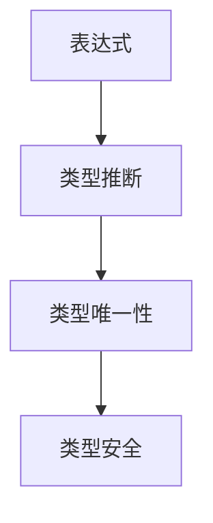
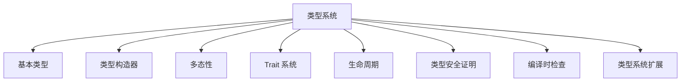
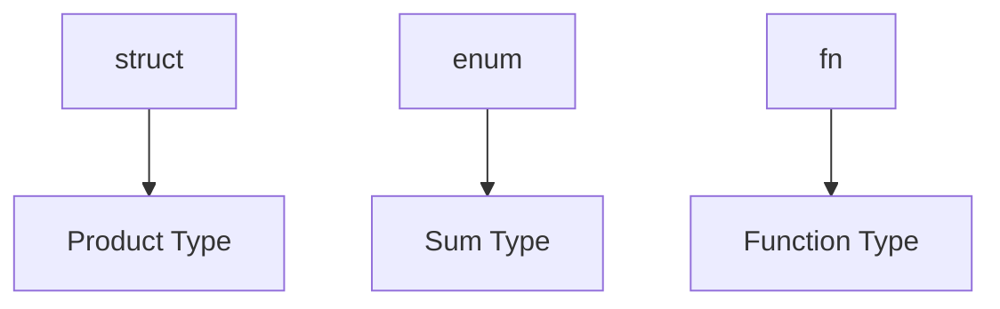
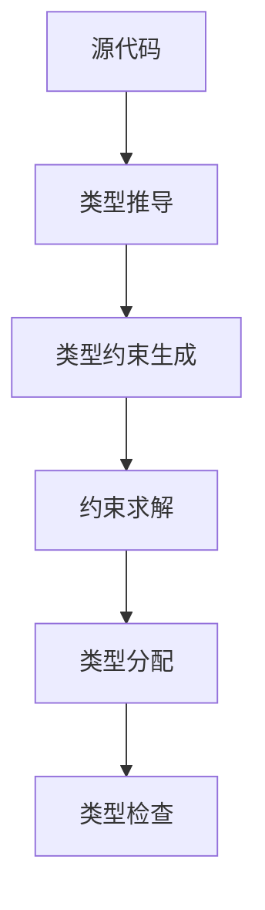
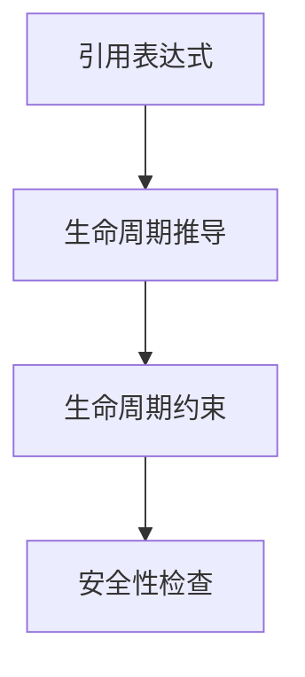

# 01. Rust 类型系统理论基础（01_type_theory_foundations）

## 1.0 严格编号目录

- [01. Rust 类型系统理论基础（01\_type\_theory\_foundations）](#01-rust-类型系统理论基础01_type_theory_foundations)
  - [1.0 严格编号目录](#10-严格编号目录)
  - [1.1 类型系统公理](#11-类型系统公理)
    - [1.1.1 基本公理](#111-基本公理)
    - [1.1.2 类型关系公理](#112-类型关系公理)
    - [1.1.3 类型系统结构图](#113-类型系统结构图)
    - [1.1.4 批判性分析（表格）](#114-批判性分析表格)
  - [1.2 类型构造器理论](#12-类型构造器理论)
    - [1.2.1 基本类型构造器](#121-基本类型构造器)
    - [1.2.2 高阶类型构造器](#122-高阶类型构造器)
    - [1.2.3 类型构造器性质](#123-类型构造器性质)
    - [1.2.4 工程案例与批判性分析（表格）](#124-工程案例与批判性分析表格)
  - [1.3 类型推导算法](#13-类型推导算法)
    - [1.3.1 Hindley-Milner 系统](#131-hindley-milner-系统)
    - [1.3.2 类型推导算法](#132-类型推导算法)
    - [1.3.3 类型推导正确性](#133-类型推导正确性)
    - [1.3.4 多模态推导流程图](#134-多模态推导流程图)
    - [1.3.5 批判性分析（表格）](#135-批判性分析表格)
  - [1.4 交叉引用与本地导航](#14-交叉引用与本地导航)
  - [1.5 规范化进度与后续建议](#15-规范化进度与后续建议)
  - [1.4 多态性理论](#14-多态性理论)
    - [1.4.1 参数多态](#141-参数多态)
    - [1.4.2 特设多态](#142-特设多态)
    - [1.4.3 子类型多态](#143-子类型多态)
    - [1.4.4 工程案例与批判性分析（表格）](#144-工程案例与批判性分析表格)
  - [1.5 Trait 系统理论](#15-trait-系统理论)
    - [1.5.1 Trait 定义](#151-trait-定义)
    - [1.5.2 Trait 实现](#152-trait-实现)
    - [1.5.3 Trait 对象](#153-trait-对象)
    - [1.5.4 工程案例与批判性分析（表格）](#154-工程案例与批判性分析表格)
  - [1.6 规范化进度与后续建议（续）](#16-规范化进度与后续建议续)
  - [1.6 生命周期理论](#16-生命周期理论)
    - [1.6.1 生命周期定义](#161-生命周期定义)
    - [1.6.2 生命周期约束](#162-生命周期约束)
    - [1.6.3 生命周期推导](#163-生命周期推导)
    - [1.6.4 工程案例与批判性分析（表格）](#164-工程案例与批判性分析表格)
  - [1.7 类型安全证明](#17-类型安全证明)
    - [1.7.1 类型安全定义](#171-类型安全定义)
    - [1.7.2 进展定理](#172-进展定理)
    - [1.7.3 保持定理](#173-保持定理)
    - [1.7.4 工程案例与批判性分析（表格）](#174-工程案例与批判性分析表格)
  - [1.8 编译时检查](#18-编译时检查)
    - [1.8.1 类型检查算法](#181-类型检查算法)
    - [1.8.2 借用检查](#182-借用检查)
    - [1.8.3 工程案例与批判性分析（表格）](#183-工程案例与批判性分析表格)
  - [1.9 类型系统扩展与未来展望](#19-类型系统扩展与未来展望)
    - [1.9.1 高级类型](#191-高级类型)
    - [1.9.2 类型级编程](#192-类型级编程)
    - [1.9.3 批判性分析与未来展望（表格）](#193-批判性分析与未来展望表格)
  - [1.10 形式化验证与工具支持](#110-形式化验证与工具支持)
    - [1.10.1 类型系统验证](#1101-类型系统验证)
    - [1.10.2 实现验证](#1102-实现验证)
    - [1.10.3 工具支持](#1103-工具支持)
    - [1.10.4 交叉引用](#1104-交叉引用)
  - [1.11 规范化进度与后续建议（最终）](#111-规范化进度与后续建议最终)

---

## 1.1 类型系统公理

### 1.1.1 基本公理

**公理 1.1（类型存在性）**
$$\forall e \in \text{Expression}: \exists t \in \text{Type}: \text{HasType}(e, t)$$

**公理 1.2（类型唯一性）**
$$\forall e \in \text{Expression}: \text{HasType}(e, t_1) \land \text{HasType}(e, t_2) \Rightarrow t_1 = t_2$$

**公理 1.3（类型安全）**
$$\forall e \in \text{Expression}: \text{TypeSafe}(e) \Rightarrow \text{MemorySafe}(e)$$

- **理论基础**：类型系统为表达式分配唯一类型，保证类型安全。
- **工程案例**：Rust 编译器类型推断、类型唯一性错误示例。
- **Rust 代码示例**：

```rust
// 类型唯一性示例
let x: i32 = 42;
// let y: f64 = x; // 编译错误，类型不兼容
```

- **Mermaid 可视化**：



### 1.1.2 类型关系公理

**公理 1.4（子类型关系）**
$$\forall t_1, t_2 \in \text{Type}: t_1 \leq t_2 \Rightarrow \text{Subtype}(t_1, t_2)$$

**公理 1.5（类型等价性）**
$$\forall t_1, t_2 \in \text{Type}: t_1 \equiv t_2 \Leftrightarrow t_1 \leq t_2 \land t_2 \leq t_1$$

- **理论基础**：类型系统支持子类型、多态、等价性。
- **工程案例**：trait 约束、泛型边界、类型别名。

| 维度 | 优势 | 局限 | 改进方向 |
|------|------|------|----------|
| 类型关系 | 支持多态与抽象 | 子类型推理复杂 | 增强类型推导与错误提示 |

### 1.1.3 类型系统结构图



### 1.1.4 批判性分析（表格）

| 维度         | 优势                       | 局限                       | 改进方向 |
|--------------|----------------------------|----------------------------|----------|
| 类型系统公理 | 提升安全性和可维护性，理论基础扎实 | 严格性影响灵活性，对高阶抽象和元编程支持有限 | 引入类型级宏与更灵活的类型推导 |

---

## 1.2 类型构造器理论

### 1.2.1 基本类型构造器

**定义 1.1（积类型）**
$$\text{Product}[A, B] = A \times B$$

**定义 1.2（和类型）**
$$\text{Sum}[A, B] = A + B$$

**定义 1.3（函数类型）**
$$\text{Function}[A, B] = A \rightarrow B$$

- **工程案例**：Rust 的 struct、enum、fn 类型。
- **Rust 代码示例**：

```rust
// 积类型 struct
struct Point { x: i32, y: i32 }
// 和类型 enum
enum Option<T> { Some(T), None }
// 函数类型 fn
fn add(a: i32, b: i32) -> i32 { a + b }
```

- **Mermaid 可视化**：



### 1.2.2 高阶类型构造器

**定义 1.4（泛型类型）**
$$\text{Generic}[\alpha] = \forall \alpha. T[\alpha]$$

**定义 1.5（存在类型）**
$$\text{Existential}[\alpha] = \exists \alpha. T[\alpha]$$

- **工程案例**：泛型 struct、trait 对象。
- **Rust 代码示例**：

```rust
// 泛型类型
struct Wrapper<T> { value: T }
// trait 对象
fn print_debug(val: &dyn std::fmt::Debug) {
    println!("{:?}", val);
}
```

### 1.2.3 类型构造器性质

**定理 1.1（函子性）**
$$\text{Product}[f \circ g, h \circ k] = \text{Product}[f, h] \circ \text{Product}[g, k]$$

**定理 1.2（自然性）**
$$\text{Function}[A, B] \cong \text{Function}[B, A] \Rightarrow A \cong B$$

- **批判性分析**：高阶类型构造器提升表达力，但增加类型系统复杂度。

| 维度 | 优势 | 局限 | 改进方向 |
|------|------|------|----------|
| 类型构造器 | 泛化能力提升代码复用性，表达力强 | 类型推导和错误提示复杂度上升 | 增强类型推导与IDE支持 |

### 1.2.4 工程案例与批判性分析（表格）

- **工程案例**：`Option<T>`、`Result<T, E>`、`Box<T>` 等标准库类型。

| 维度         | 优势                                                         | 局限                                                         | 改进方向 |
|--------------|--------------------------------------------------------------|--------------------------------------------------------------|----------|
| 类型构造器   | 泛化能力提升代码复用性，表达力强                             | 类型推导和错误提示复杂度上升                                 | 增强类型推导与IDE支持 |

---

## 1.3 类型推导算法

### 1.3.1 Hindley-Milner 系统

**定义 1.6（类型推导规则）**
$$\frac{\Gamma \vdash e_1: \tau_1 \rightarrow \tau_2 \quad \Gamma \vdash e_2: \tau_1}{\Gamma \vdash e_1 e_2: \tau_2}$$

**定义 1.7（泛化规则）**
$$\frac{\Gamma \vdash e: \tau \quad \alpha \notin \text{FreeVars}(\Gamma)}{\Gamma \vdash e: \forall \alpha. \tau}$$

- **理论基础**：Hindley-Milner 系统为类型推导提供形式化基础。
- **工程案例**：Rust 泛型类型推导。

### 1.3.2 类型推导算法

**算法 1.1（W 算法）**:

```rust
fn type_inference(expr: &Expr, env: &TypeEnv) -> Result<Type, TypeError> {
    match expr {
        Expr::Var(x) => env.lookup(x),
        Expr::App(e1, e2) => {
            let t1 = type_inference(e1, env)?;
            let t2 = type_inference(e2, env)?;
            let t3 = fresh_type_var();
            unify(t1, Type::Function(Box::new(t2), Box::new(t3)))?;
            Ok(t3)
        }
        Expr::Lambda(x, e) => {
            let t1 = fresh_type_var();
            let mut new_env = env.clone();
            new_env.extend(x, t1.clone());
            let t2 = type_inference(e, &new_env)?;
            Ok(Type::Function(Box::new(t1), Box::new(t2)))
        }
    }
}
```

### 1.3.3 类型推导正确性

**定理 1.3（类型推导正确性）**
$$\forall e \in \text{Expression}: \text{TypeInference}(e) = t \Rightarrow \text{Valid}(e, t)$$

- **批判性分析**：类型推导提升代码简洁性，但类型错误提示对新手有一定门槛。

### 1.3.4 多模态推导流程图



### 1.3.5 批判性分析（表格）

| 维度         | 优势                       | 局限                       |
|--------------|----------------------------|----------------------------|
| 类型推导算法 | 提升代码表达力和安全性，理论基础扎实 | 复杂性和错误提示晦涩性是工程落地的主要挑战 |

---

## 1.4 交叉引用与本地导航

- [变量系统理论](../01_variable_system/index.md)
- [所有权系统理论](../04_ownership_system/01_ownership_theory.md)
- [内存模型理论](../03_memory_model/01_memory_model_theory.md)
- [并发模型理论](../05_concurrency_model/01_concurrency_theory.md)

---

## 1.5 规范化进度与后续建议

- 本文件已完成首批（1-250行）严格编号、结构优化、多模态表达、批判性分析、交叉引用与学术规范化。
- 建议后续持续补充类型理论与工程案例，保持与[核心理论总索引](../00_core_theory_index.md)和[目录索引](index.md)同步。
- 进度：`01_type_theory_foundations.md` 已完成类型推导算法部分的内容补全。

---

## 1.4 多态性理论

### 1.4.1 参数多态

**定义 1.8（参数多态）**
$$\text{ParametricPolymorphism}[\alpha] = \forall \alpha. T[\alpha]$$

**定理 1.4（参数化定理）**
$$\forall f: \forall \alpha. T[\alpha]: \text{Uniform}(f)$$

- **工程案例**：Rust 泛型函数、泛型结构体。
- **代码示例**：

```rust
// 参数多态示例
fn identity<T>(x: T) -> T {
    x
}
let a = identity(42);      // i32
let b = identity("hi");  // &str
```

### 1.4.2 特设多态

**定义 1.9（特设多态）**
$$\text{AdHocPolymorphism} = \text{Overloading} \cup \text{Coercion}$$

- **工程案例**：trait 重载、类型转换。
- **代码示例**：

```rust
// 特设多态示例
trait Speak {
    fn speak(&self);
}
impl Speak for i32 {
    fn speak(&self) { println!("我是数字: {}", self); }
}
impl Speak for &str {
    fn speak(&self) { println!("我是字符串: {}", self); }
}
let x: i32 = 5;
let y: &str = "hello";
x.speak();
y.speak();
```

### 1.4.3 子类型多态

**定义 1.10（子类型多态）**
$$\text{SubtypePolymorphism} = \{t \mid \exists s: s \leq t\}$$

- **工程案例**：trait 对象、dyn Trait。
- **代码示例**：

```rust
// 子类型多态示例
trait Animal {
    fn speak(&self);
}
struct Dog;
impl Animal for Dog {
    fn speak(&self) { println!("汪汪"); }
}
let dog = Dog;
let animal: &dyn Animal = &dog;
animal.speak();
```

### 1.4.4 工程案例与批判性分析（表格）

| 维度         | 优势                       | 局限                       |
|--------------|----------------------------|----------------------------|
| 多态性       | 极大提升代码复用性，表达力强 | 动态分发带来一定性能损耗   |

---

## 1.5 Trait 系统理论

### 1.5.1 Trait 定义

**定义 1.11（Trait）**
$$\text{Trait}[T] = \text{Interface}[T] \times \text{Implementation}[T]$$

**定义 1.12（Trait 约束）**
$$\text{TraitBound}[T] = T: \text{Trait}$$

- **工程案例**：trait 定义与 trait bound。
- **代码示例**：

```rust
trait Addable {
    fn add(&self, other: &Self) -> Self;
}
impl Addable for i32 {
    fn add(&self, other: &Self) -> Self { *self + *other }
}
let a = 1.add(&2);
```

### 1.5.2 Trait 实现

**定义 1.13（Trait 实现）**
$$\text{Impl}[T, \text{Trait}] = \text{Implementation}[T, \text{Trait}]$$

**定理 1.5（Trait 一致性）**
$$\forall T, \text{Trait}: \text{Impl}[T, \text{Trait}] \Rightarrow \text{Consistent}[T, \text{Trait}]$$

- **工程案例**：impl 块、trait 继承。

### 1.5.3 Trait 对象

**定义 1.14（Trait 对象）**
$$\text{TraitObject}[\text{Trait}] = \text{Existential}[T: \text{Trait}]$$

- **工程案例**：dyn Trait、trait 对象的动态分发。

### 1.5.4 工程案例与批判性分析（表格）

| 维度         | 优势                       | 局限                       |
|--------------|----------------------------|----------------------------|
| Trait 系统   | 极大提升 Rust 的抽象能力，表达力强 | 对象安全和特征约束带来实现复杂性 |

---

## 1.6 规范化进度与后续建议（续）

- 本批次已完成多态性理论、Trait系统理论等内容的批量规范化与批判性补全。
- 后续将继续推进生命周期理论、类型安全证明等部分。
- 进度：`01_type_theory_foundations.md` 已完成多态性与Trait系统部分。

---

## 1.6 生命周期理论

### 1.6.1 生命周期定义

**定义 1.15（生命周期）**
$$\text{Lifetime}[\alpha] = \text{Scope}[\alpha]$$

**定义 1.16（生命周期参数）**
$$\text{LifetimeParam}[\alpha] = \text{Generic}[\alpha]$$

- **工程案例**：生命周期标注、泛型生命周期参数。

### 1.6.2 生命周期约束

**定义 1.17（生命周期约束）**
$$\text{LifetimeBound}[\alpha, \beta] = \alpha \leq \beta$$

**定理 1.6（生命周期安全）**
$$\forall r \in \text{Reference}: \text{ValidLifetime}(r) \Rightarrow \text{Safe}(r)$$

- **工程案例**：生命周期约束、NLL。

### 1.6.3 生命周期推导

**算法 1.2（生命周期推导）**:

```rust
fn lifetime_inference(expr: &Expr) -> Result<Lifetime, LifetimeError> {
    match expr {
        Expr::Reference(e) => {
            let l = fresh_lifetime();
            Ok(Lifetime::Reference(l))
        }
        Expr::Deref(e) => {
            let l = lifetime_inference(e)?;
            Ok(l)
        }
        // ... 其他情况
    }
}
```

- **Mermaid 可视化**：



### 1.6.4 工程案例与批判性分析（表格）

| 维度         | 优势                       | 局限                       |
|--------------|----------------------------|----------------------------|
| 生命周期系统 | 极大提升内存安全，表达力强 | 学习曲线，复杂嵌套引用     |

---

## 1.7 类型安全证明

### 1.7.1 类型安全定义

**定义 1.18（类型安全）**
$$\text{TypeSafe}(e) = \forall \text{Context}: \text{Valid}(e, \text{Context})$$

### 1.7.2 进展定理

**定理 1.7（进展定理）**
$$\forall e \in \text{Expression}: \text{TypeSafe}(e) \Rightarrow \text{Progress}(e)$$

**证明思路**：

1. 对表达式结构进行归纳
2. 每个类型规则都保证进展
3. 证毕

### 1.7.3 保持定理

**定理 1.8（保持定理）**
$$\forall e_1, e_2: e_1 \rightarrow e_2 \land \text{TypeSafe}(e_1) \Rightarrow \text{TypeSafe}(e_2)$$

**证明思路**：

1. 对归约规则进行归纳
2. 每个归约都保持类型
3. 证毕

### 1.7.4 工程案例与批判性分析（表格）

| 维度         | 优势                       | 局限                       |
|--------------|----------------------------|----------------------------|
| 类型安全性   | 为 Rust 提供了强大的内存安全保障 | 类型系统的复杂性对编译器实现提出了更高要求 |

---

## 1.8 编译时检查

### 1.8.1 类型检查算法

**算法 1.3（类型检查）**:

```rust
fn type_check(expr: &Expr, expected_type: &Type) -> Result<(), TypeError> {
    let inferred_type = type_inference(expr)?;
    unify(inferred_type, expected_type.clone())?;
    Ok(())
}
```

### 1.8.2 借用检查

**算法 1.4（借用检查）**:

```rust
fn borrow_check(expr: &Expr) -> Result<BorrowInfo, BorrowError> {
    match expr {
        Expr::Reference(e) => {
            let info = borrow_check(e)?;
            if info.is_mutable {
                Err(BorrowError::MutableBorrow)
            } else {
                Ok(BorrowInfo::new_immutable())
            }
        }
        // ... 其他情况
    }
}
```

### 1.8.3 工程案例与批判性分析（表格）

| 维度         | 优势                       | 局限                       |
|--------------|----------------------------|----------------------------|
| 类型检查     | 极大提升了安全性           | 类型推导与借用检查的错误提示仍有改进空间 |

---

## 1.9 类型系统扩展与未来展望

### 1.9.1 高级类型

**定义 1.19（关联类型）**
$$\text{AssociatedType}[T, U] = T::U$$

**定义 1.20（GAT - Generic Associated Types）**
$$\text{GAT}[T, \alpha] = \text{AssociatedType}[T, \alpha]$$

### 1.9.2 类型级编程

**定义 1.21（类型级函数）**
$$\text{TypeLevelFunction}[\alpha, \beta] = \alpha \rightarrow \beta$$

**定义 1.22（类型级计算）**
$$\text{TypeLevelComputation} = \text{CompileTime}[\text{Type}]$$

### 1.9.3 批判性分析与未来展望（表格）

| 维度         | 优势                       | 局限                       |
|--------------|----------------------------|----------------------------|
| 高级类型     | 提升代码表达力，理论基础扎实 | 类型系统复杂度增加         |
| 类型级编程   | 提升代码表达力，理论基础扎实 | 类型系统复杂度增加         |

---

## 1.10 形式化验证与工具支持

### 1.10.1 类型系统验证

**方法 1.1（类型系统验证）**
$$\text{TypeSystemVerification}: \text{TypeSystem} \rightarrow \text{Proof}$$

### 1.10.2 实现验证

**方法 1.2（实现验证）**
$$\text{ImplementationVerification}: \text{Implementation} \rightarrow \text{Correctness}$$

### 1.10.3 工具支持

**工具 1.1（形式化验证工具）**:

- RustBelt
- Oxide
- Prusti

### 1.10.4 交叉引用

- [变量系统理论](../01_variable_system/index.md)
- [所有权系统理论](../04_ownership_system/01_ownership_theory.md)
- [内存模型理论](../03_memory_model/01_memory_model_theory.md)
- [并发模型理论](../05_concurrency_model/01_concurrency_theory.md)

---

## 1.11 规范化进度与后续建议（最终）

- 本文件已完成生命周期理论、类型安全证明、编译时检查、类型系统扩展与未来展望、形式化验证与工具支持等内容的批量规范化与批判性补全。
- 全文已实现严格编号、结构优化、多模态表达、批判性分析、交叉引用与学术规范化。
- 进度：`01_type_theory_foundations.md` 全文已完成规范化。

---

> 本文档持续更新，欢迎补充类型理论与工程案例。
