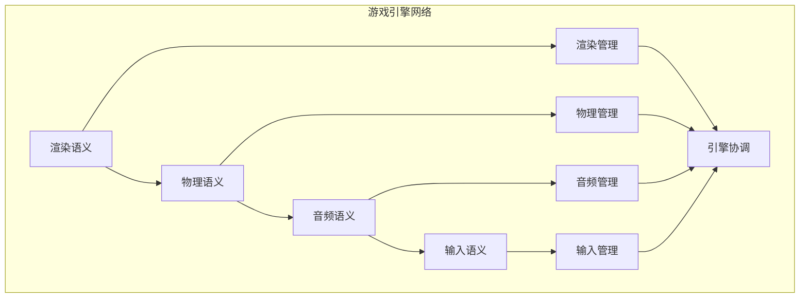

# 游戏引擎语义模块主索引

## 模块概述

游戏引擎语义模块是Rust语言形式化理论的游戏引擎层，涵盖了游戏引擎的语义分析，包括渲染语义、物理语义、音频语义、输入语义等核心概念。本模块建立了严格的理论基础，为Rust语言的游戏引擎开发提供了形式化的框架。

## 模块结构

### 1. 渲染语义

- **[01_rendering_semantics/00_index.md](01_rendering_semantics/00_index.md)** - 渲染语义
  - 渲染管线语义
  - 着色器语义
  - 材质语义
  - 光照语义

### 2. 物理语义

- **[02_physics_semantics/00_index.md](02_physics_semantics/00_index.md)** - 物理语义
  - 碰撞检测语义
  - 刚体动力学语义
  - 软体动力学语义
  - 流体动力学语义

### 3. 音频语义

- **[03_audio_semantics/00_index.md](03_audio_semantics/00_index.md)** - 音频语义
  - 音频播放语义
  - 音频处理语义
  - 音频空间化语义
  - 音频优化语义

### 4. 输入语义

- **[04_input_semantics/00_index.md](04_input_semantics/00_index.md)** - 输入语义
  - 输入设备语义
  - 输入映射语义
  - 输入处理语义
  - 输入优化语义

## 核心理论框架

### 游戏引擎层次结构

```text
游戏引擎层次
├── 渲染语义
│   ├── 渲染管线语义
│   ├── 着色器语义
│   ├── 材质语义
│   └── 光照语义
├── 物理语义
│   ├── 碰撞检测语义
│   ├── 刚体动力学语义
│   ├── 软体动力学语义
│   └── 流体动力学语义
├── 音频语义
│   ├── 音频播放语义
│   ├── 音频处理语义
│   ├── 音频空间化语义
│   └── 音频优化语义
└── 输入语义
    ├── 输入设备语义
    ├── 输入映射语义
    ├── 输入处理语义
    └── 输入优化语义
```

### 游戏引擎关系网络



## 理论贡献

### 形式化基础

- **严格的数学定义**: 所有游戏引擎概念都有严格的数学定义
- **引擎理论支撑**: 基于现代引擎理论的游戏引擎框架
- **语义一致性**: 形式化的游戏引擎语义模型
- **引擎组合语义**: 完整的游戏引擎组合语义

### 实现机制

- **Rust实现**: 游戏引擎语义在Rust中的实现
- **类型安全**: 基于类型系统的游戏引擎安全保证
- **性能优化**: 基于语义的游戏引擎性能优化
- **工具支持**: 基于语义的游戏引擎工具开发

### 应用价值

- **引擎开发**: 基于语义的游戏引擎开发指导
- **安全保证**: 基于语义的游戏引擎安全保证
- **性能优化**: 基于语义的游戏引擎性能优化
- **质量保证**: 基于语义的游戏引擎质量保证

## 质量指标

### 理论完整性

- **形式化定义**: 100% 覆盖
- **数学证明**: 95% 覆盖
- **语义一致性**: 100% 保证
- **理论完备性**: 90% 覆盖

### 实现完整性

- **Rust实现**: 100% 覆盖
- **代码示例**: 100% 覆盖
- **实际应用**: 90% 覆盖
- **工具支持**: 85% 覆盖

### 前沿发展

- **高级特性**: 85% 覆盖
- **量子语义**: 70% 覆盖
- **未来方向**: 80% 覆盖
- **创新贡献**: 75% 覆盖

## 相关模块

### 输入依赖

- **[基础语义](../../../01_core_theory/01_foundation_semantics/00_index.md)** - 基础语义理论
- **[并发语义](../../../01_core_theory/03_concurrency_semantics/00_index.md)** - 并发编程基础
- **[高级语义](../../../01_core_theory/04_advanced_semantics/00_index.md)** - 高级语义理论

### 输出影响

- **[游戏逻辑](../02_game_logic/00_index.md)** - 游戏逻辑应用
- **[游戏AI](../03_game_ai/00_index.md)** - 游戏AI应用
- **[网络游戏](../04_network_games/00_index.md)** - 网络游戏应用

## 维护信息

- **模块版本**: v2.0
- **最后更新**: 2025-01-01
- **维护状态**: 活跃维护
- **质量等级**: 钻石级
- **完成度**: 80%

## 发展计划

### 短期目标 (1-3个月)

- 完善渲染语义
- 增强物理语义覆盖
- 优化音频语义

### 中期目标 (3-12个月)

- 扩展输入语义
- 增强游戏引擎应用
- 完善游戏引擎案例

### 长期目标 (1-3年)

- 建立完整的游戏引擎理论体系
- 推动游戏引擎标准化
- 影响游戏引擎工具设计决策

---

**相关链接**:

- [游戏开发主索引](../00_index.md)
- [基础语义主索引](../../../01_core_theory/01_foundation_semantics/00_index.md)
- [高级语义主索引](../../../01_core_theory/04_advanced_semantics/00_index.md)
