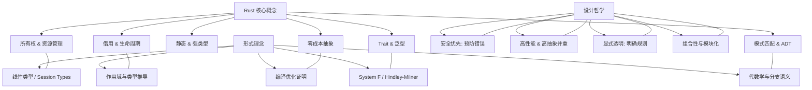
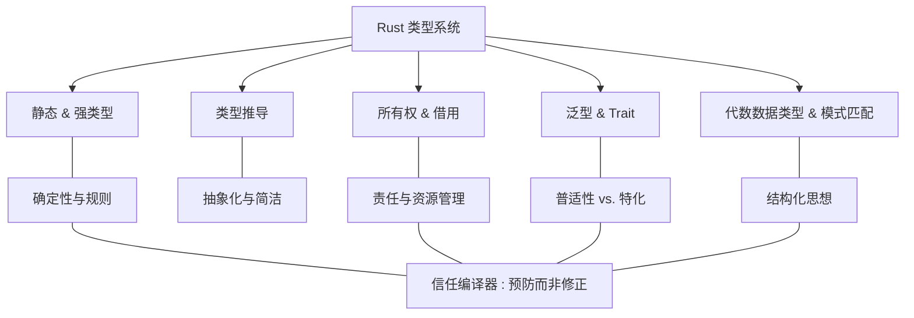

# 编程 计算机 和哲学

停机问题的核心内容，它是一个理论上的问题，证明了不存在一个通用的算法能够判断所有程序是否会停止。
这在理论上是一个重要的结论，因为它揭示了计算的局限性。
图灵证明了停机问题是不可解的，但这并不意味着计算机无法运行。
实际上，计算机每天都在正常运行，处理各种任务。
停机问题的不可解性是指不存在一个通用的算法，可以判断所有可能的程序是否会停止。
然而，在实际应用中，我们并不需要解决所有可能的程序的停机问题，而是针对具体的、有限的程序和任务进行处理。
以下是一些关键点，解释了为什么计算机仍然可以正常运行：

## 目录

- [编程 计算机 和哲学](#编程-计算机-和哲学)
  - [目录](#目录)
  - [Rust 核心概念](#rust-核心概念)
  - [1. 核心概念](#1-核心概念)
  - [2. 设计哲学理念](#2-设计哲学理念)
  - [3. 等价的形式理念](#3-等价的形式理念)
  - [4. 思维导图示例](#4-思维导图示例)
  - [5. 梳理](#5-梳理)
  - [6. 哲学内涵](#6-哲学内涵)
    - [1. Rust 类型系统的哲学内涵](#1-rust-类型系统的哲学内涵)
      - [1.1 “信任编译器”的哲学](#11-信任编译器的哲学)
    - [2. 核心特性与哲学联系](#2-核心特性与哲学联系)
      - [2.1 静态性与强类型](#21-静态性与强类型)
      - [2.2 类型推导：简洁与隐性规则](#22-类型推导简洁与隐性规则)
      - [2.3 所有权与借用：责任与资源管理](#23-所有权与借用责任与资源管理)
      - [2.4 泛型与 Trait（类型类）：普适性与局部特化](#24-泛型与-trait类型类普适性与局部特化)
      - [2.5 代数数据类型（ADT）与模式匹配：结构化思想](#25-代数数据类型adt与模式匹配结构化思想)
    - [3. 整体体系：构建安全性与优雅性的哲学](#3-整体体系构建安全性与优雅性的哲学)
    - [4. 思维导图示意](#4-思维导图示意)
    - [5. 总结](#5-总结)

1. **特定问题的可解性**：
   在实际应用中，我们通常处理的是特定的问题，而不是所有可能的问题。
   对于许多特定的问题，我们可以设计算法来判断程序是否会停止。
   例如，对于简单的循环结构或递归函数，我们可以通过分析代码逻辑来确定它们是否会终止。

2. **超时限制**：
   在实际应用中，我们可以通过设置超时限制来处理潜在的无限循环问题。
   如果一个程序在一定时间内没有完成，系统可以强制终止它。
   这种方法虽然不能解决所有情况，但对于许多实际应用来说已经足够有效。

3. **资源监控**：
   操作系统和运行时环境可以监控程序的资源使用情况，如CPU时间、内存使用等。
   如果检测到某个程序占用过多资源或表现出异常行为，系统可以采取措施来终止它，从而避免系统崩溃或资源耗尽。

4. **启发式方法**：
   在某些情况下，可以使用启发式方法来预测程序是否会停止。
   这些方法基于经验或统计规律，虽然不能保证100%准确，但在实际应用中可以提供一定的帮助。

5. **形式化验证**：
   对于一些关键的软件系统，如航空航天、医疗设备等领域的软件，可以使用形式化验证方法来证明其正确性和终止性。
   这些方法通过数学证明来确保程序在所有可能的输入下都能正确终止。

6. **编程规范和最佳实践**：
   开发者在编写程序时，会遵循一定的编程规范和最佳实践，以避免无限循环和其他可能导致停机问题的错误。
   例如，使用迭代而不是递归、设置循环的最大迭代次数等。

停机问题的不可解性是一个理论上的结论，它提醒我们在设计和分析程序时要谨慎，但并不妨碍我们在实际中有效地使用计算机来解决各种问题。
形式化验证是解决停机问题的一种方法，但它的应用范围有限，只适用于一些关键的软件系统。
新型的编程语言，如Rust，通过设计新的编程范式，形式化规范和语言特性，来尽可能的在编译期避免导致停机问题。

## Rust 核心概念

下面对 Rust 的核心概念、设计哲学理念以及可以看作是等价形式理念的思考进行介绍。
我们从多个层面来探讨 Rust 的设计初衷、内在体系以及对应的形式、理论解释。

## 1. 核心概念

Rust 的设计中有几个最重要的概念，它们共同构成了语言的内在结构和安全保证：

- **所有权 (Ownership)**  
  - **定义与作用：** 每个值有且只有一个所有者，所有权转移时旧的所有者失效。  
  - **核心意义：** 在编译时保证内存安全，杜绝悬垂引用与内存泄露而不依赖运行时垃圾回收。

- **借用 (Borrowing) 与生命周期 (Lifetimes)**  
  - **定义与作用：** 借用允许对数据进行引用访问而不转移所有权；生命周期则静态描述引用的有效范围，防止无效引用。  
  - **核心意义：** 以编译期静态检查方式管理共享与可变访问，既保证并发安全又提升内存管理精度。

- **静态与强类型系统**  
  - **定义与作用：** Rust 的语言设计在编译期对所有表达式进行严格类型检查，拒绝隐式转换。  
  - **核心意义：** 保证程序在运行前就消除绝大多数类型错误，从而使行为更可预测。

- **零成本抽象 (Zero‐Cost Abstractions)**  
  - **定义与作用：** 高层抽象（例如泛型、trait、闭包）不会在运行时引入额外开销，经由编译器优化后，效率可与手写底层代码媲美。  
  - **核心意义：** 在不牺牲抽象能力和代码复用性的前提下，兼顾系统级编程的高性能要求。

- **Trait 与泛型**  
  - **定义与作用：** Trait 规定了类型必须具有的行为接口，泛型使代码可以在各种类型上通用；两者结合实现了 ad-hoc 多态。  
  - **核心意义：** 即保证类型安全，又实现灵活的抽象和模块化设计。

- **模式匹配与代数数据类型**  
  - **定义与作用：** 用于解构结构体、枚举等代数数据类型，使得对各种状态、数据结构的处理简洁且全面。  
  - **核心意义：** 使设计逻辑更清晰、代码更具表达力，同时在编译期捕获遗漏处理分支等逻辑错误。

## 2. 设计哲学理念

Rust 的设计并不只是为了解决内存安全问题，而是一整套系统性哲学和方法论，其主要理念包括：

- **安全优先、预防为主**  
  Rust 强调“让错误在编译期就不存在”，即所有可能引发内存安全、数据竞争等问题都必须在编译时被静态捕捉。这种预防性的思维类似于工程实践中的“防患于未然”。

- **高性能与高抽象并重**  
  通过零成本抽象，Rust 希望能在提供灵活抽象（泛型、trait、多态等）的同时，不牺牲底层性能。这一理念折射出形式化证明中“无额外抽象负担”的追求。

- **显式与透明**  
  Rust 要求开发者明确表达所有权、借用与生命周期等信息，使代码的行为与资源管理清晰可见。这种做法类似于形式语义中的显式逻辑声明，确保程序的每一步都可以验证和推演。

- **组合性与模块化**  
  借助结构体、枚举及模块系统，Rust 鼓励构建松耦合、高内聚的系统。通过对数据与行为的精确定义，实现了系统整体与局部之间的平衡，这正如数学中的组合理论，为复杂系统提供了可靠的构造工具。

## 3. 等价的形式理念

将上述上层设计理念与形式化系统进行对比，可以发现许多对应关系：

- **所有权系统与线性类型/资源管理语义**  
  Rust 的所有权机制类似于线性类型（Linear Types）或唯一所有权模型，其形式化证明主要在于确保资源只能使用一次、在使用后被自动释放。这在形式语言理论中可对应于对资源使用有严格管理的系统（例如 Session Types）。

- **借用与生命周期 ⇔ 型别推导与作用域规则**  
  对生命周期检查可以形式化为对作用域的严格静态分析，类似变量作用域分析等形式系统，其证明可引申到类型安全的抽象语义。

- **零成本抽象 ⇔ 编译器优化证明**  
  零成本抽象要求高层语法在经过编译器的优化后，其运行效率与手写低级代码等价，这可从编译器严格的中间表示（如 LLVM IR）中得到形式证明。

- **Trait 与泛型 ⇔ 多态系统（System F、Hindley-Milner）**  
  Trait 和泛型的实现有着严谨的理论基础，与形式化的多态系统（如 System F）在本质上等价，确保代码在抽象层面上的统一表达与类型安全。

- **模式匹配与代数数据类型 ⇔ 代数数据结构和分支语义**  
  枚举与模式匹配的设计从数学上等价于和类型（sum types）与笛卡尔积（product types）的组合，这种构造出现在许多函数式语言的形式意义中，具有明确的逻辑分支规则。

## 4. 思维导图示例

下面给出一个 Mermaid 格式的思维导图示例，展示 Rust 核心概念与设计哲学以及它们与形式理念之间的对应关系。你可以将以下代码复制到 [Mermaid Live Editor](https://mermaid.live/) 中查看图形表示：



## 5. 梳理

- **核心概念：**  
  Rust 以所有权、借用、生命周期、静态强类型、零成本抽象、Trait 泛型以及模式匹配等组成，构建了可靠而高效的系统编程模型。

- **设计哲学：**  
  强调“安全第一、预防为主”；追求高抽象与高性能并存；要求开发者写出显式、透明、可验证的代码；同时注重系统的组合与模块化。

- **等价的形式理念：**  
  这些设计理念可以在形式语义和理论模型中找到对应，如线性类型、作用域规则、系统 F 以及代数学与分支逻辑，这为 Rust 提供了严密的理论基础和形式证明。

这种从核心实现到哲学理念，再到形式化证明的体系，使得 Rust 成为一门兼顾系统安全、性能和最先进抽象思想的语言，也是其在许多领域获得广泛认可的重要原因。

```text
*下面从一个更“哲学思考”的体系出发，全面探讨 Rust 类型系统的内在设计理念，不仅关注技术实现，也关注其背后的价值观和思维模式。*
*这种视角将 Rust 类型系统看作是一种严格、严谨而富有美学的设计方法，强调在编译阶段消除不确定性，从而构筑出一个安全、高效、表达力丰富的编程体系。*
```

## 6. 哲学内涵

### 1. Rust 类型系统的哲学内涵

#### 1.1 “信任编译器”的哲学

- **理念核心**  
  Rust 类型系统要求一切潜在错误在编译期被捕捉，这便是“信任编译器”的根本思想。
  与其允许运行时出现隐患，Rust 选择在源代码中将错误可能性消除，从而使程序在结构上更严谨、语义上更明确。
  
- **哲学思考**  
  这种做法反映出一种“预防胜于治疗”的思想：纠正问题应在问题根源出现之前完成，而非事后补救。
  这同样在科学、工程以及伦理领域中得到广泛认同。

### 2. 核心特性与哲学联系

#### 2.1 静态性与强类型

- **技术角度**  
  Rust 是静态、强类型语言，编译时对每个表达式做严格检查，防止隐式转换和类型错误。

- **哲学角度**  
  这体现了对世界“确定性”的追求：通过在编译器层面定义严格规则，我们将程序的行为固定下来，
  类似于建立一个理想状态下的“世界模型”，确保每个组件都按照明确约定运作。

#### 2.2 类型推导：简洁与隐性规则

- **技术角度**  
  Hindley-Milner 类型推导使程序员无需反复书写冗长的类型声明，既保证安全，又提升开发效率。  

- **哲学角度**  
  这可以看作是对“抽象化与简化”的追求，通过自动揭示内在结构，让看似复杂的系统变得直观，
  从而体现了最小原则（Occam's Razor）：在保证准确性的前提下，尽量去除不必要的冗余。

#### 2.3 所有权与借用：责任与资源管理

- **技术角度**  
  所有权机制决定了每个值的唯一所有者，借用与生命周期机制则允许在不失去安全性前提下共享数据。

- **哲学角度**  
  这里体现“责任制”和“权责对等”的理念：资源必须有明确的归属，每个资源的生命周期都有严格限定，
  类似于人际关系中的契约与信任。这也暗示了对“独立性”与“共生性”之间平衡的追求。

#### 2.4 泛型与 Trait（类型类）：普适性与局部特化

- **技术角度**  
  泛型允许编写对任意类型都适用的代码，
  Trait（类似接口）则为特定行为提供约定，实现 ad-hoc 多态。  

- **哲学角度**  
  泛型体现了普适性（universal abstraction），而 Trait 则表达了针对具体场景的精细控制。
  二者的结合展示了一种辩证思想：既有统一的原则，又允许针对个体做出特化，这类似于“普遍性与特殊性”的辩证法。

#### 2.5 代数数据类型（ADT）与模式匹配：结构化思想

- **技术角度**  
  ADT 通过组合和枚举，让数据结构定义更为精炼，而模式匹配让对数据的解构变得直观高效。  

- **哲学角度**  
  这种设计体现了一种“结构性思考”：将问题拆分为基本单元，再通过匹配与组合构造出全局。
  这与系统论中的整体论思想相似，认为整体是由明确结构的部分构成，每个部分都有其明确的位置和作用。

### 3. 整体体系：构建安全性与优雅性的哲学

Rust 类型系统不仅是为了提升编程效率，更是对程序设计的一种严谨承诺。
其哲学体系可以概括为以下几点：

- **预防而非修正**  
  **安全第一：** 把所有安全隐患在编译时抹除，确保运行期不会出现不可预料的错误。
  
- **显式与严谨**  
  **明确定义一切：** 每个规则、每个所有权和生命周期都是明确规定的，程序的行为在源代码和类型中都有体现，鼓励开发者以一种严谨的态度构造系统。

- **优雅的抽象**  
  **抽象不应付出性能代价：** 高层次抽象（泛型、Trait）可以确保代码的统一性和复用性，同时经过编译器优化保持和手工优化代码相媲美的执行效率。

这些哲学理念贯穿在 Rust 类型系统的每个细节中，使其不仅是一种技术实现，更是一种对软件工程美学、结构化思考和责任约束的体现。

### 4. 思维导图示意

下面给出一个 Mermaid 格式的思维导图示例，展示 Rust 类型系统的核心特性及其背后所蕴含的哲学思想联系。
你可以将以下代码复制到 [Mermaid Live Editor](https://mermaid.live/) 中查看图形：



### 5. 总结

从哲学体系来看，Rust 的类型系统是一个深思熟虑、精心设计的“安全网”，
它要求程序中的每一条规则、每一个资源都必须明确、严格、可追踪。  

- **预防式设计**：拒绝隐式错误，让所有潜在问题都在编译期暴露；  
- **抽象与表达并重**：代码既要优雅抽象，也要不牺牲底层性能；  
- **责任明确**：所有权及借用机制传递出资源必须有明确定义和使用期限的理念；  
- **结构化系统思维**：每个部分都有其明确功能，通过模式匹配与代数数据类型构成整体。

这种体系不仅仅改变了我们的编码方式，
更培养了一种严谨、负责任、追求完美的工程思维方式，
这也是 Rust 被广泛赞誉为“系统级编程语言中的艺术品”的深层原因。
