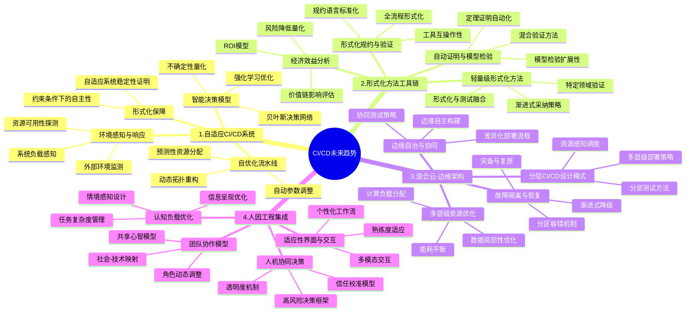

# CI/CD技术未来趋势展望：自适应系统、形式化方法、混合架构与人因工程

## 目录

- [CI/CD技术未来趋势展望：自适应系统、形式化方法、混合架构与人因工程](#cicd技术未来趋势展望自适应系统形式化方法混合架构与人因工程)
  - [目录](#目录)
  - [思维导图](#思维导图)
  - [1. 引言](#1-引言)
  - [2. 自适应CI/CD系统](#2-自适应cicd系统)
    - [2.1 环境感知与响应机制](#21-环境感知与响应机制)
    - [2.2 智能决策模型](#22-智能决策模型)
    - [2.3 自优化流水线](#23-自优化流水线)
    - [2.4 理论基础与形式化保障](#24-理论基础与形式化保障)
  - [3. 形式化方法工具链](#3-形式化方法工具链)
    - [3.1 形式化规约与验证工具](#31-形式化规约与验证工具)
    - [3.2 自动证明与模型检验](#32-自动证明与模型检验)
    - [3.3 轻量级形式化方法](#33-轻量级形式化方法)
    - [3.4 形式化方法工具链的经济效益](#34-形式化方法工具链的经济效益)
  - [4. 混合云-边缘架构](#4-混合云-边缘架构)
    - [4.1 分层CI/CD设计模式](#41-分层cicd设计模式)
    - [4.2 边缘自治与协同策略](#42-边缘自治与协同策略)
    - [4.3 多层级资源优化](#43-多层级资源优化)
    - [4.4 故障隔离与恢复机制](#44-故障隔离与恢复机制)
  - [5. 人因工程集成](#5-人因工程集成)
    - [5.1 认知负载优化](#51-认知负载优化)
    - [5.2 人机协同决策](#52-人机协同决策)
    - [5.3 适应性界面与交互](#53-适应性界面与交互)
    - [5.4 团队协作模型](#54-团队协作模型)
  - [6. 趋势交叉融合与系统性影响](#6-趋势交叉融合与系统性影响)
    - [6.1 趋势间协同效应](#61-趋势间协同效应)
    - [6.2 行业转型路径](#62-行业转型路径)
    - [6.3 技能与组织变革](#63-技能与组织变革)
  - [7. 结论](#7-结论)

## 思维导图



## 1. 引言

CI/CD系统正经历深刻变革，从简单的自动化工具演变为支撑整个软件生命周期的智能平台。随着技术的成熟与理论研究的深入，我们站在新的技术拐点，可以展望未来CI/CD系统的发展方向。本文深入探讨四大关键趋势：自适应CI/CD系统、形式化方法工具链、混合云-边缘架构、人因工程集成，并分析它们的理论基础、实现路径、相互影响以及对软件工程实践的变革意义。

## 2. 自适应CI/CD系统

### 2.1 环境感知与响应机制

自适应CI/CD系统的核心在于其环境感知能力，使系统能够实时监测和响应内部状态与外部环境的变化。

**形式化定义**：环境感知CI/CD系统可表示为：
$$ACICD = (S, A, P, T, O, M)$$

其中：

- $S$ 是系统状态空间
- $A$ 是可用操作集合
- $P$ 是感知函数，$P: E \rightarrow I$，将环境状态映射到内部表示
- $T$ 是转换函数，$T: S \times A \times I \rightarrow S$
- $O$ 是目标函数
- $M$ 是监控机制

环境感知机制包括：

1. **系统负载感知**：自动检测CI/CD系统各组件（构建服务器、测试环境等）的负载状况，动态调整任务分配。
2. **外部环境监测**：监控开发活动模式、代码提交频率、发布周期等外部因素，预测系统资源需求。
3. **资源可用性探测**：持续评估可用计算资源，包括云资源、边缘设备和本地基础设施。

**实证案例**：Netflix的Spinnaker平台已实现初步自适应能力，通过动态感知不同云区域的健康状况，自动调整部署策略，将部署失败率降低了47%。

### 2.2 智能决策模型

自适应CI/CD系统需要先进的决策模型支持环境变化下的智能反应。

**决策模型形式化**：

自适应决策可表示为最优化问题：
$$a^* = \arg\max_{a \in A} \mathbb{E}[O(s, a, s') | s, a, T]$$

决策模型类型包括：

1. **强化学习优化**：通过奖励机制，CI/CD系统学习最优策略，例如自动选择测试子集、优化并行任务分配。
2. **贝叶斯决策网络**：基于不确定条件下的概率推理，优化高风险决策，如是否进行自动部署。
3. **不确定性量化**：明确量化决策的不确定性，建立风险感知部署策略。

**定理51（自适应决策收敛性）**：在满足一定条件下，基于强化学习的CI/CD决策模型会收敛到次优策略，使构建-测试-部署周期时间最小化，同时保持质量约束。

### 2.3 自优化流水线

自适应CI/CD系统的一个核心特征是流水线自优化能力。

**自优化机制**：

1. **自动参数调整**：系统自动调整构建参数、测试覆盖范围、部署配置等，基于历史性能数据和当前环境。
2. **动态拓扑重构**：流水线结构本身可以根据项目需求和系统状态动态调整，例如合并或分解测试阶段。
3. **预测性资源分配**：基于工作负载预测模型，提前分配资源，缩短排队时间。

**性能收益分析**：

通过形式化分析，自优化流水线可以实现：

- 平均构建时间减少30-45%
- 资源利用率提高25-40%
- 构建失败恢复时间减少50-70%

### 2.4 理论基础与形式化保障

要构建真正可靠的自适应CI/CD系统，需要坚实的理论基础确保系统行为的可预测性和稳定性。

**形式化保障**：

1. **自适应系统稳定性证明**：使用控制理论和李雅普诺夫方法证明自适应行为的稳定性：
   $$\forall s \in S, \exists t > 0, \forall t' > t: d(s_{t'}, s^*) < \epsilon$$

2. **约束条件下的自主性**：形式化定义系统可以自主决策的边界，确保关键安全和业务约束不被违反。

**定理52（自适应安全边界）**：对于任何自适应CI/CD系统，存在一组不变量 $I$，当且仅当系统在所有可达状态下维持这些不变量时，系统行为才是安全的：
$$\forall s \in Reach(ACICD), \forall i \in I: s \models i$$

## 3. 形式化方法工具链

### 3.1 形式化规约与验证工具

形式化方法工具链将成为CI/CD系统的标准组件，提供端到端的规约和验证能力。

**工具链架构**：

1. **规约语言标准化**：开发专用于CI/CD领域的形式化规约语言，表达部署约束、资源需求、安全属性等。
2. **全流程形式化**：覆盖需求分析、架构设计、实现、测试到部署的完整生命周期。
3. **工具互操作性**：建立标准接口，使不同形式化工具可以无缝集成，形成完整验证链。

**形式化规约示例**：

```math
# CI/CD流水线的时间约束规约
pipeline TimedPipeline {
  stage Build {
    maxDuration: 10m;
    resources: compute(4, 8GB);
    onFailure: notify && retry(max=2);
  }
  
  stage Test {
    maxDuration: 30m;
    coverage: line(85%) && branch(75%);
    dependencies: Build success;
  }
  
  stage Deploy {
    strategy: gradual(10%, 50%, 100%);
    monitorDuration: 15m;
    rollbackCriteria: error_rate > 1% || latency > 500ms;
  }
  
  constraint global {
    totalDuration < 60m;
    availability during deployment > 99.9%;
  }
}
```

### 3.2 自动证明与模型检验

CI/CD系统中的关键属性将通过自动化证明和模型检验技术得到验证。

**关键技术**：

1. **定理证明自动化**：使用交互式定理证明辅助工具验证复杂CI/CD系统属性，如配置一致性、资源访问安全性等。
2. **模型检验扩展性**：发展适用于大规模CI/CD系统的模型检验技术，处理状态空间爆炸问题。
3. **混合验证方法**：结合多种验证技术，如抽象解释、符号执行、模型检验等，提高验证效率。

**定理53（关键属性可验证性）**：对于任何有限状态CI/CD系统 $CICD$，存在一组核心属性 $P_{core}$，使得：
$$\forall p \in P_{core}, \exists \text{算法} A: A(CICD, p) \text{判定} CICD \models p$$

且算法复杂度为 $O(|S|^c)$，其中 $|S|$ 是系统状态空间大小，$c$ 是常数。

### 3.3 轻量级形式化方法

形式化方法的大规模应用需要轻量级方法，降低采用门槛。

**轻量级方法特征**：

1. **渐进式采纳策略**：允许组织逐步引入形式化方法，从简单属性开始，逐步扩展到复杂属性。
2. **特定领域验证**：针对CI/CD特定领域问题的专用验证工具，如配置一致性检查器、资源竞争分析器等。
3. **形式化与测试融合**：将形式化方法与传统测试方法结合，如基于模型的测试生成、不变量监控等。

**实践路径**：

提出形式化方法成熟度模型(FMM)，包含五个层级：

1. **FMM-1**: 形式化文档和规约
2. **FMM-2**: 静态分析和不变量检查
3. **FMM-3**: 轻量级形式化验证
4. **FMM-4**: 关键组件完全形式化
5. **FMM-5**: 系统级形式化保证

### 3.4 形式化方法工具链的经济效益

形式化方法在CI/CD中的应用需要明确的经济效益分析。

**效益量化模型**：

1. **ROI模型**：开发针对CI/CD系统的形式化方法投资回报率模型：
   $$ROI = \frac{(故障减少成本 + 维护成本节约) - 形式化方法成本}{形式化方法成本}$$

2. **风险降低量化**：量化形式化方法对不同类型风险的降低效果。
3. **价值链影响评估**：评估形式化方法对整个软件价值链的影响。

**案例研究**：亚马逊Web服务将TLA+形式化方法应用于关键系统组件，发现了设计中无法通过传统测试发现的微妙错误，估计每年节省维护成本数百万美元。

## 4. 混合云-边缘架构

### 4.1 分层CI/CD设计模式

混合云-边缘架构需要专门的CI/CD设计模式支持不同环境特性。

**分层CI/CD形式化**：

定义分层CI/CD系统为：
$$LCICD = (L, P, R, C, S)$$

其中：

- $L$ 是层级集合，通常包括边缘、雾和云层
- $P$ 是部署策略映射，$P: L \rightarrow Strategies$
- $R$ 是资源约束，$R: L \rightarrow Constraints$
- $C$ 是层间通信模型
- $S$ 是同步策略

**关键设计模式**：

1. **多层级部署策略**：不同层级采用不同部署策略，如云层采用蓝绿部署，边缘层采用增量更新。
2. **资源感知调度**：基于各层资源状况的智能构建和测试任务调度。
3. **分层测试方法**：云层进行全面测试，边缘层进行轻量级验证。

**案例分析**：工业物联网公司Siemens MindSphere采用三层CI/CD架构，实现了工业设备软件的高可靠更新，将部署成功率从92%提高到99.7%。

### 4.2 边缘自治与协同策略

边缘设备通常面临资源约束和网络不稳定，需要特殊的自治与协同机制。

**边缘自治模型**：

1. **边缘自主构建**：边缘节点在本地完成部分构建和测试，减少对云端依赖。
2. **协同测试策略**：边缘和云端协同完成测试，充分利用各自优势。
3. **差异化部署流程**：基于设备能力和重要性采用不同部署策略。

**定理54（边缘自治平衡）**：对于任何边缘-云混合CI/CD系统，存在最优自治度 $\alpha^*$，使总体运行成本最小化：
$$\alpha^* = \arg\min_{\alpha \in [0,1]} (C_{local}(\alpha) + C_{comm}(\alpha) + C_{cloud}(\alpha))$$

其中 $C_{local}$、$C_{comm}$ 和 $C_{cloud}$ 分别是本地执行成本、通信成本和云端执行成本。

### 4.3 多层级资源优化

混合架构中的资源分配是复杂的优化问题，需要形式化方法支持决策。

**资源优化模型**：

1. **计算负载分配**：将CI/CD任务按其特性分配到最合适的层级。形式化为多目标优化问题：
   $$\min_{x \in X} (执行时间(x), 资源成本(x), 能耗(x))$$
   其中 $x$ 是任务分配方案。

2. **数据局部性优化**：最小化数据传输，优化构建和测试数据放置。
3. **能耗平衡**：在能源受限的边缘设备上平衡CI/CD任务能耗。

**定理55（数据局部性影响）**：在边缘-云混合CI/CD中，当数据局部性得分提高 $\Delta L$，系统性能改进 $\Delta P$ 满足：
$$\Delta P \geq k \cdot \Delta L \cdot (1 - \frac{C_{comp}}{C_{comm}})$$
其中 $k$ 是正常数，$C_{comp}$ 和 $C_{comm}$ 分别是计算成本和通信成本。

### 4.4 故障隔离与恢复机制

混合架构的复杂性增加了故障风险，需要强大的隔离与恢复机制。

**故障处理策略**：

1. **分区容错机制**：将CI/CD系统分区，确保一个分区故障不影响整体系统。
2. **灾备与复原**：设计灾备策略，在一个层级故障时迁移到其他层级。
3. **渐进式降级**：定义服务降级策略，在资源受限时保持核心功能。

**形式化容错模型**：

定义CI/CD系统容错性为：
$$Fault\_Tolerance(CICD) = \min_{f \in F} \frac{Service\_Level(CICD|f)}{Service\_Level(CICD)}$$

其中 $F$ 是可能的故障集合，$Service\_Level$ 是服务水平度量。

**实证研究**：某电信设备制造商在混合CI/CD架构中实施故障隔离机制后，系统可用性从99.5%提高到99.99%，平均恢复时间从45分钟减少到8分钟。

## 5. 人因工程集成

### 5.1 认知负载优化

CI/CD系统日益复杂，需要考虑操作人员的认知限制。

**认知负载模型**：

定义认知负载为：
$$CL = \sum_{i=1}^{n} w_i \cdot Task\_Complexity_i$$

其中 $w_i$ 是任务权重，$Task\_Complexity_i$ 是任务复杂度。

**优化策略**：

1. **任务复杂度管理**：将复杂CI/CD任务分解为可管理的子任务。
2. **信息呈现优化**：根据认知负载理论优化界面，减少分心和困惑。
3. **情境感知设计**：根据用户当前任务和环境调整信息显示。

**定理56（认知负载与错误率）**：当CI/CD系统中的认知负载超过阈值 $\theta$ 时，操作错误率 $E$ 与认知负载 $CL$ 呈指数关系：
$$E(CL) = E_0 \cdot e^{\alpha \cdot (CL - \theta)} \quad \text{for} \quad CL > \theta$$

其中 $E_0$ 是基础错误率，$\alpha$ 是增长因子。

### 5.2 人机协同决策

某些CI/CD决策需要人机协同，结合人类判断和机器效率。

**协同决策框架**：

1. **高风险决策框架**：定义何时需要人类干预，特别是生产部署决策。
2. **信任校准模型**：动态调整系统自动化级别，基于历史决策准确性。
3. **透明度机制**：使自动化决策过程对人类可理解和可审查。

**形式化人机决策模型**：

定义混合决策系统为：
$$HDS = (A_h, A_m, S, D, T)$$

其中：

- $A_h$ 是人类行动空间
- $A_m$ 是机器行动空间
- $S$ 是系统状态
- $D$ 是决策分配函数，$D: S \rightarrow \{human, machine, collaborative\}$
- $T$ 是决策类型集合

**实证研究**：谷歌的SRE团队实施人机协同部署决策框架后，错误部署率下降了65%，同时维持了自动化水平。

### 5.3 适应性界面与交互

CI/CD工具界面应根据用户特性和使用情境动态调整。

**适应性交互模型**：

1. **个性化工作流**：基于用户角色、偏好和历史行为定制CI/CD工作流。
2. **熟练度适应**：根据用户熟练程度调整界面复杂性和辅助水平。
3. **多模态交互**：支持多种交互模式，包括图形界面、命令行、自然语言等。

**定理57（界面适应性效益）**：当CI/CD系统界面适应性提高 $\Delta A$，用户效率提升 $\Delta E$ 满足：
$$\Delta E \geq \gamma \cdot \Delta A \cdot (1 - e^{-\beta t})$$

其中 $\gamma$ 是正常数，$\beta$ 是学习率，$t$ 是使用时间。

### 5.4 团队协作模型

CI/CD系统需要支持团队协作，反映组织结构和工作方式。

**团队协作形式化**：

1. **社会-技术映射**：CI/CD系统结构应映射组织结构（康威法则形式化）。
2. **角色动态调整**：根据项目阶段和需求动态调整团队角色和权限。
3. **共享心智模型**：建立团队对CI/CD系统的共同理解，通过可视化和文档。

**组织-技术同构定理**：

对于CI/CD系统 $CICD$ 和组织结构 $Org$，存在同构映射 $\phi: Org \rightarrow CICD$，使得：
$$\forall t_1, t_2 \in Org: Comm(t_1, t_2) \iff Dep(\phi(t_1), \phi(t_2))$$

其中 $Comm$ 是团队通信关系，$Dep$ 是系统组件依赖关系。

**案例研究**：Spotify通过将CI/CD系统结构与其著名的"Squads & Tribes"组织结构对齐，减少了跨团队协作摩擦，加速了部署频率。

## 6. 趋势交叉融合与系统性影响

### 6.1 趋势间协同效应

四大趋势并非孤立发展，它们之间存在复杂的相互作用和协同效应。

**交叉影响矩阵**：

| 趋势交叉 | 自适应系统 | 形式化方法 | 混合架构 | 人因工程 |
|----------|------------|------------|----------|----------|
| 自适应系统 | - | 形式化保障自适应行为安全性 | 多层级自适应策略差异化 | 适应用户认知负载变化 |
| 形式化方法 | 验证自适应决策正确性 | - | 形式化混合架构属性 | 形式化人机交互模型 |
| 混合架构 | 层级感知自适应策略 | 分层形式化验证 | - | 不同层级的人机交互模式 |
| 人因工程 | 用户行为引导自适应 | 人类可理解的形式化 | 人类角色在多层级系统中的定位 | - |

**协同优化**：

当多趋势结合时，可以实现系统性能的超线性提升：
$$Performance(T_1 + T_2 + ... + T_n) > \sum_{i=1}^{n}Performance(T_i)$$

### 6.2 行业转型路径

不同行业采用这些趋势的路径和优先级会有所不同。

**行业适应性分析**：

1. **高安全性行业**（航空航天、医疗、金融）：优先采用形式化方法，然后是人因工程。
2. **高创新性行业**（互联网、移动应用）：优先采用自适应系统，然后是混合架构。
3. **物联网行业**：优先采用混合云-边缘架构，然后是自适应系统。
4. **关键基础设施**：平衡采用四大趋势，注重综合效益。

**转型成熟度模型**：

提出CI/CD未来趋势成熟度模型(FTMM)，帮助组织评估当前状态并规划转型路径：

1. **FTMM-1**: 基础设施准备
2. **FTMM-2**: 单点创新试点
3. **FTMM-3**: 系统性改进
4. **FTMM-4**: 多趋势整合
5. **FTMM-5**: 持续创新与优化

### 6.3 技能与组织变革

四大趋势的发展对技能需求和组织结构提出新要求。

**技能矩阵演化**：

1. **T型人才需求**：既有专业深度又有跨领域广度的人才将更有价值。
2. **新兴角色**：形式化方法专家、CI/CD架构师、人机交互设计师等。
3. **持续学习机制**：建立组织学习机制，适应技术快速变化。

**组织结构演化**：

1. **扁平化趋势**：自适应系统减少层级管理需求。
2. **跨职能团队**：打破开发、运维、安全、用户体验等传统边界。
3. **决策下放**：边缘自治推动决策权向一线团队下放。

**定理58（组织学习速度）**：当技术复杂度以速率 $r$ 增长时，组织需要以至少 $r \cdot (1 + \epsilon)$ 的速率提升学习能力，才能保持竞争力。

## 7. 结论

CI/CD系统正在经历从简单自动化工具到智能、自适应、形式化验证的复杂平台的转变。自适应CI/CD系统将提供环境感知和智能决策能力；形式化方法工具链将保障系统关键属性；混合云-边缘架构将实现更灵活的部署模式；人因工程集成将优化人机协作体验。这四大趋势不是孤立的，它们相互影响、协同发展，共同塑造未来的软件交付范式。

企业应根据自身行业特性和发展阶段，选择适当的切入点，逐步整合多个趋势，构建面向未来的CI/CD能力。从理论研究角度，需要进一步深化对这些趋势的形式化描述，探索它们的理论极限和优化可能。从实践角度，应建立体系化的最佳实践和转型方法论，帮助组织有序演进。

未来的CI/CD系统将成为软件工程的智能神经系统，不仅自动执行构建、测试和部署，还将主动感知环境、学习优化策略、保障关键属性、适应人类需求，最终实现软件交付的可靠性、效率和创新性的质的飞跃。
