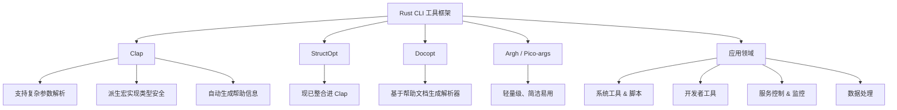

# CLI 工具框架

下面介绍 Rust 生态中最著名且广泛使用的 CLI 工具框架，以及各自的特点和应用场景。

---

## 1. 主要 CLI 框架

### 1.1 **Clap**

- **简介**：  
  Clap（Command Line Argument Parser）是目前 Rust 中使用最广泛、功能最强大的命令行参数解析库。  
- **特点**：  
  - **灵活高效**：支持复杂的命令行参数结构、子命令、标志以及选项解析。  
  - **派生宏支持**：通过 `#[derive(Parser)]`（在 clap 3+ 中内置）使得 CLI 参数与结构体定义结合，实现类型安全的参数配置。  
  - **自动生成帮助信息**：可以根据定义自动生成命令行使用提示和帮助信息。  
- **应用场景**：  
  用于构建各类 CLI 工具、命令行应用、脚本以及自动化工具。

---

### 1.2 **StructOpt（现已整合到 Clap 中）**

- **简介**：  
  StructOpt 曾经是一个独立的库，通过派生宏让结构体直接与命令行参数形成映射。  
- **说明**：  
  从 Clap 3 版本开始，StructOpt 的功能和 API 已经集成到 clap 中，开发者可直接使用 clap 的衍生宏来实现相同的功能。
- **应用场景**：  
  和 Clap 类似，用于构造类型安全、易于维护的 CLI 工具。

---

### 1.3 **Docopt**

- **简介**：  
  Docopt 根据命令行帮助文档自动生成参数解析规则。  
- **特点**：  
  - **声明式风格**：开发者只需编写清晰的帮助文档，解析库根据描述生成对应的参数解析器。  
  - **适用性**：适合具有良好文档结构的 CLI 应用。  
- **局限性**：  
  随着 Clap 的不断发展，目前在 Rust 生态中使用 Docopt 的案例相对较少，更多开发者倾向于使用 Clap。

---

### 1.4 **其他轻量级选项**

- **Argh**：  
  一个注重简洁和易用性的属性标注 CLI 解析库，适合简单场景。  
- **Pico-args**：  
  超轻量级命令行参数解析库，适用于对性能和体积要求极高的场景。

---

## 2. 应用领域

Rust 的 CLI 框架被广泛应用于各种领域，主要包括：

- **系统工具与脚本**：  
  利用类型安全和静态检查，构建高可靠性的命令行工具，如文件处理、数据转换、自动化运维工具等。

- **开发者工具**：  
  包括构建自动化构建工具、测试框架以及与其他系统交互的接口工具。

- **服务控制与监控**：  
  构造集成系统的命令行接口，用于远程控制、实时监控或调度任务。

- **数据处理**：  
  利用 CLI 工具构建数据抓取、清洗与转换流水线，方便与其他数据处理系统集成。

---

## 3. 总结与思维导图

当前，**Clap** 是最具代表性且应用最广泛的 Rust CLI 框架，它不仅提供丰富的参数解析功能，还通过派生宏实现了类型安全、易维护的开发方式。其他如 Docopt、Argh、Pico-args 等也各自满足了不同场景下“轻量”或“声明式”的需求。

下面利用 Mermaid 语法绘制思维导图，展示各主要 CLI 框架及其应用领域：

---

## 小结

Rust 生态中构建 CLI 工具的主要框架中，以 **Clap** 最为著名和全面，它支持从简单的命令行参数到复杂的子命令结构解析，兼顾开发效率和类型安全；同时，Docopt、Argh 和 Pico-args 等也为特定场景提供了轻量级的选择。开发者可以根据应用需求选用合适的框架，构建稳定高效的命令行工具。
