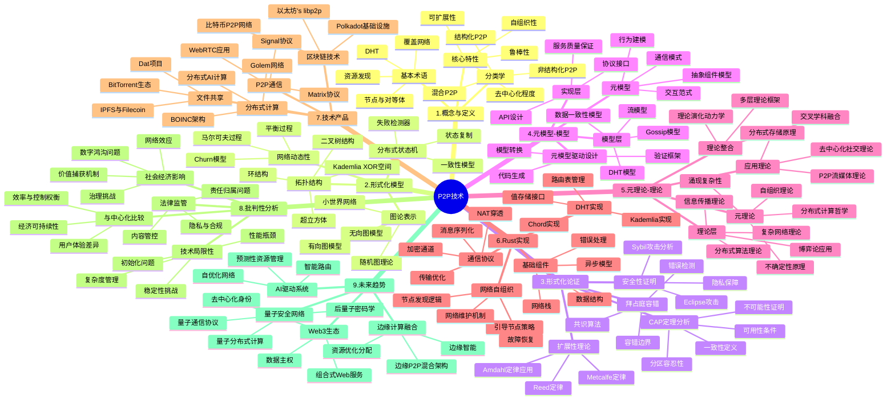

# P2P技术的形式化分析与未来展望：从理论到实践

## 目录

- [P2P技术的形式化分析与未来展望：从理论到实践](#p2p技术的形式化分析与未来展望从理论到实践)
  - [目录](#目录)
  - [思维导图](#思维导图)
  - [1. 引言](#1-引言)
    - [1.1 P2P系统的历史与演进](#11-p2p系统的历史与演进)
    - [1.2 P2P范式的核心价值主张](#12-p2p范式的核心价值主张)
  - [2. P2P技术的概念与定义](#2-p2p技术的概念与定义)
    - [2.1 基本概念与术语](#21-基本概念与术语)
    - [2.2 P2P系统的分类学](#22-p2p系统的分类学)
    - [2.3 核心特性形式化定义](#23-核心特性形式化定义)
  - [3. P2P网络的形式化模型](#3-p2p网络的形式化模型)
    - [3.1 图论表示与模型](#31-图论表示与模型)
    - [3.2 拓扑结构的数学模型](#32-拓扑结构的数学模型)
    - [3.3 网络动态性的随机过程模型](#33-网络动态性的随机过程模型)
    - [3.4 分布式状态机模型](#34-分布式状态机模型)
  - [4. P2P系统的形式化论证与证明](#4-p2p系统的形式化论证与证明)
    - [4.1 一致性与可用性的CAP定理分析](#41-一致性与可用性的cap定理分析)
    - [4.2 bizantium容错性证明](#42-bizantium容错性证明)
    - [4.3 扩展性理论极限](#43-扩展性理论极限)
    - [4.4 安全性与隐私保障的形式化证明](#44-安全性与隐私保障的形式化证明)
  - [5. P2P系统的元模型与模型层级](#5-p2p系统的元模型与模型层级)
    - [5.1 元模型：系统抽象的抽象](#51-元模型系统抽象的抽象)
    - [5.2 模型层：特定P2P系统的抽象](#52-模型层特定p2p系统的抽象)
    - [5.3 实现层：具体实现与接口](#53-实现层具体实现与接口)
    - [5.4 元模型驱动的P2P系统设计](#54-元模型驱动的p2p系统设计)
  - [6. P2P技术的元理论与理论层级](#6-p2p技术的元理论与理论层级)
    - [6.1 元理论：分布式系统的哲学基础](#61-元理论分布式系统的哲学基础)
    - [6.2 理论层：P2P系统的原理与定律](#62-理论层p2p系统的原理与定律)
    - [6.3 应用理论：特定领域的P2P模式](#63-应用理论特定领域的p2p模式)
    - [6.4 理论框架的整合与演化](#64-理论框架的整合与演化)
  - [7. Rust实现的P2P系统示例](#7-rust实现的p2p系统示例)
    - [7.1 Rust中的P2P基础组件](#71-rust中的p2p基础组件)
    - [7.2 分布式哈希表(DHT)实现](#72-分布式哈希表dht实现)
    - [7.3 点对点通信协议](#73-点对点通信协议)
    - [7.4 资源发现与共享](#74-资源发现与共享)
    - [7.5 P2P应用示例](#75-p2p应用示例)
    - [7.6 安全与隐私保护](#76-安全与隐私保护)
  - [8. 实际应用案例分析](#8-实际应用案例分析)
    - [8.1 分布式文件存储系统](#81-分布式文件存储系统)
    - [8.2 区块链P2P网络](#82-区块链p2p网络)
    - [8.3 去中心化应用平台](#83-去中心化应用平台)
  - [9. P2P技术的未来展望](#9-p2p技术的未来展望)
    - [9.1 P2P与量子计算的交叉](#91-p2p与量子计算的交叉)
    - [9.2 P2P系统与人工智能](#92-p2p系统与人工智能)
    - [9.3 P2P技术的跨学科应用](#93-p2p技术的跨学科应用)
  - [10. 总结](#10-总结)

## 思维导图



## 1. 引言

### 1.1 P2P系统的历史与演进

点对点(Peer-to-Peer，P2P)技术代表了计算机网络设计哲学的一个根本性转变，从传统的客户端-服务器模型走向更加分布式和去中心化的范式。P2P系统的历史可追溯至互联网早期，但其形式化定义和理论基础的发展则是近几十年的成果。

P2P系统的演进可大致分为四个阶段：

1. **早期探索阶段（1969-1999）**：从ARPANET的点对点设计理念到早期的USENET和FidoNet，这一时期的P2P系统主要以实验性质存在，缺乏严格的理论基础。

2. **第一代P2P系统（1999-2003）**：以Napster、Gnutella和Freenet为代表，这一时期的P2P系统开始获得广泛应用，但仍然存在中心化组件或效率问题。

3. **结构化P2P时代（2003-2009）**：随着Chord、Pastry、Kademlia等分布式哈希表(DHT)算法的提出，P2P系统获得了更严格的理论基础和更高的效率。

4. **现代P2P生态（2009至今）**：从比特币区块链的出现到IPFS、libp2p等现代P2P基础设施的发展，P2P技术与区块链、去中心化应用等领域深度融合。

### 1.2 P2P范式的核心价值主张

P2P系统的核心价值主张可以从技术、经济和社会三个维度理解：

**技术维度**：

- **弹性与鲁棒性**：无单点故障，系统能够在节点大规模加入和离开的情况下保持稳定
- **自然可扩展性**：系统容量随节点增加而增长，理想情况下呈线性扩展
- **资源利用最大化**：边缘资源（计算、存储、带宽）得到充分利用

**经济维度**：

- **基础设施成本分散**：无需中央服务器基础设施，降低了运营成本
- **值捕获分散化**：价值创造和价值捕获更加贴近网络参与者
- **网络效应放大**：随着参与节点增加，网络价值可能超线性增长（符合Metcalfe定律或Reed定律）

**社会维度**：

- **去中心化自主权**：减少对中心化机构的依赖
- **抗审查能力**：提高内容和通信的抗干扰能力
- **数据主权**：用户对自己的数据有更大控制权

P2P范式代表了在资源分配、控制权和信任机制上的根本重新思考，挑战了传统的中心化控制模式。

## 2. P2P技术的概念与定义

### 2.1 基本概念与术语

**定义1（点对点系统）**：点对点(P2P)系统是一个分布式系统，其中计算节点（称为对等体或peers）直接相互交互以实现资源共享和协作，无需专用的中央服务器协调。

形式化定义：P2P系统可表示为集合 $P2P = (N, L, R, P)$，其中：

- $N = \{n_1, n_2, ..., n_k\}$ 是系统中对等节点的集合
- $L \subseteq N \times N$ 是节点间的逻辑连接集合
- $R = \{r_1, r_2, ..., r_m\}$ 是可共享资源的集合
- $P$ 是定义节点如何交互的协议集合

**核心术语**：

1. **节点/对等体(Peer)**：P2P网络中的参与实体，兼具客户端和服务器双重角色。

2. **覆盖网络(Overlay Network)**：建立在物理网络之上的逻辑网络，定义P2P系统中节点间的连接关系。

3. **分布式哈希表(DHT)**：一种结构化P2P系统，使用一致性哈希将资源映射到节点，提供高效的资源定位。

4. **引导程序(Bootstrap)**：新节点加入P2P网络的初始化过程，通常需要已知的稳定节点（引导节点）。

5. **资源发现(Resource Discovery)**：在P2P网络中定位所需资源的过程。

6. **NAT穿透(NAT Traversal)**：解决私有网络中节点直接通信问题的技术。

7. **超级节点(Super Peer)**：在混合P2P系统中承担额外责任的高容量节点。

8. **Churn（节点流失）**：描述节点频繁加入和离开P2P网络的现象。

### 2.2 P2P系统的分类学

P2P系统可以根据其拓扑结构、去中心化程度和功能特性进行分类：

**拓扑结构分类**：

1. **非结构化P2P网络**：
   - 节点随机连接形成网络
   - 资源查找通常基于泛洪搜索或随机游走
   - 例如：早期Gnutella、Freenet

   形式化表示：在非结构化P2P中，对于任意节点 $n_i$ 和资源 $r_j$，不存在确定性函数 $f$ 使得 $f(r_j) = n_i$。

2. **结构化P2P网络**：
   - 节点按照特定算法形成确定性拓扑
   - 资源位置可通过确定性算法计算
   - 通常基于DHT实现
   - 例如：Chord、Kademlia、Pastry

   形式化表示：对于任意资源 $r$，存在确定性函数 $f$ 使得 $f(r) = n$，其中 $n$ 是负责该资源的节点。

3. **混合P2P网络**：
   - 结合中心化组件和纯P2P特性
   - 通常使用超级节点结构
   - 例如：Skype、早期的Napster

   形式化表示：节点集合 $N$ 可分为普通节点子集 $N_r$ 和超级节点子集 $N_s$，其中 $N = N_r \cup N_s$ 且 $N_r \cap N_s = \emptyset$。

**去中心化程度分类**：

1. **纯P2P系统**：所有节点功能对等，无中央协调
2. **部分中心化P2P系统**：保留某些中心化组件（如索引服务器）
3. **混合P2P系统**：结合P2P与客户端-服务器模型特性

**功能特性分类**：

1. **内容分发P2P**：专注于文件共享和内容分发（BitTorrent、IPFS）
2. **通信P2P**：实现点对点通信（Signal、WebRTC应用）
3. **计算P2P**：分布式计算和资源共享（BOINC、Golem）
4. **区块链P2P**：支持分布式账本和智能合约（比特币、以太坊）

### 2.3 核心特性形式化定义

P2P系统的核心特性可以通过形式化定义进行精确描述：

**定义2（去中心化程度）**：P2P系统的去中心化程度可通过Gini系数来量化，假设 $C_i$ 表示节点 $i$ 处理的请求或资源比例：

$$G = \frac{\sum_{i=1}^{n}\sum_{j=1}^{n}|C_i - C_j|}{2n^2\bar{C}}$$

其中 $\bar{C}$ 是平均请求处理量。$G=0$ 表示完全去中心化，$G=1$ 表示完全中心化。

**定义3（自组织性）**：P2P系统的自组织性是指系统能够在没有中央协调的情况下维持网络拓扑并路由请求的能力。形式化表示为系统从任意初始状态 $S_0$ 到达稳定状态 $S_f$ 的概率：

$$P(S_0 \rightarrow S_f) > 1 - \epsilon$$

其中 $\epsilon$ 是一个小的正数，表示系统不能自组织的概率上限。

**定义4（鲁棒性）**：P2P系统的鲁棒性可通过系统在故障条件下保持功能的程度来定义。若 $F \subseteq N$ 是失效节点集，系统鲁棒性可表示为：

$$R(F) = \frac{|succ(Q, N \setminus F)|}{|succ(Q, N)|}$$

其中 $succ(Q, X)$ 表示在节点集 $X$ 上成功处理的查询集合 $Q$ 中的查询数量。

**定义5（可扩展性）**：P2P系统的可扩展性描述了系统性能如何随节点数量 $n$ 增长。若 $T(n)$ 是完成标准操作的平均时间，理想的可扩展性满足：

$$T(n) = O(\log n)$$

对于查找操作，或者：

$$C(n) = O(n)$$

对于系统总体容量 $C(n)$。

**定义6（自适应性）**：P2P系统的自适应性可定义为系统对环境变化（如网络条件、负载分布）的适应能力：

$$A = 1 - \frac{|P_c - P_o|}{P_o}$$

其中 $P_o$ 是理想条件下的性能指标，$P_c$ 是变化条件下的性能指标。

## 3. P2P网络的形式化模型

### 3.1 图论表示与模型

P2P网络最自然的数学表示是通过图论模型，将网络建模为图结构：

**定义7（P2P网络图模型）**：P2P网络可以表示为图 $G = (V, E)$，其中：

- $V = \{v_1, v_2, ..., v_n\}$ 是节点集合
- $E \subseteq V \times V$ 是连接集合

根据连接的性质，可以进一步细分：

1. **无向图模型**：适用于对称连接的P2P网络，如 $G_{undirected} = (V, E)$，其中 $(v_i, v_j) \in E \Rightarrow (v_j, v_i) \in E$

2. **有向图模型**：适用于非对称连接的P2P网络，如单向连接或非对称带宽情况

3. **加权图模型**：图的边具有权重，表示连接的属性（如带宽、延迟、信任值）：
   $G_{weighted} = (V, E, W)$，其中 $W: E \rightarrow \mathbb{R}$ 是权重函数

**小世界网络模型**：

许多P2P网络表现出小世界特性，可以用Watts-Strogatz模型表示：

$$P(k) \sim k^{-\alpha}$$

其中 $P(k)$ 是度为 $k$ 的节点出现概率，$\alpha$ 是特征指数。

对于小世界网络，平均路径长度 $L$ 与节点数 $n$ 的关系为：

$$L \sim \log(n)$$

**随机图模型**：

非结构化P2P网络可以用Erdős–Rényi随机图模型 $G(n, p)$ 表示，其中 $n$ 是节点数，$p$ 是任意两节点之间存在连接的概率。

**定理1（连通性阈值）**：对于随机图 $G(n, p)$，当 $p > \frac{\ln(n)}{n}$ 时，图几乎必然是连通的。

这一定理对P2P网络设计至关重要，指导了最小连接数的确定。

### 3.2 拓扑结构的数学模型

不同类型的P2P系统采用不同的拓扑结构，这些结构可以用数学模型精确描述：

**环形拓扑（Chord）**：

Chord协议使用环形拓扑，节点ID和资源键都分布在模 $2^m$ 的ID空间中：

$$successor(k) = \min\{i \in N | i \geq k \mod 2^m\}$$

每个节点维护一个指向 $m$ 个其他节点的路由表（称为finger表）：

$$finger[i] = successor(n + 2^{i-1}) \text{ for } 1 \leq i \leq m$$

**超立方体拓扑（CAN）**：

Content Addressable Network (CAN) 使用 $d$ 维笛卡尔坐标空间作为拓扑基础。空间被划分为多个区域，每个节点负责一个区域：

$$dist(P_1, P_2) = \sqrt{\sum_{i=1}^{d}(P_1[i] - P_2[i])^2}$$

**XOR空间（Kademlia）**：

Kademlia使用XOR度量来定义节点间的"距离"：

$$distance(x, y) = x \oplus y$$

两个ID之间的距离决定了它们在Kademlia树中的位置，具有相似ID前缀的节点在逻辑上更"接近"。

**前缀路由（Pastry）**：

Pastry使用节点ID的数字表示，基于前缀匹配进行路由：

$$|prefix(a, b)|$$ 表示节点ID $a$ 和 $b$ 的共同前缀长度。

路由表包含对特定前缀模式的节点引用，使得路由操作复杂度为 $O(\log_{2^b} N)$，其中 $b$ 是设计参数。

### 3.3 网络动态性的随机过程模型

P2P网络的一个关键特性是节点的动态加入和离开（称为churn），这种动态性可以用随机过程模型表示：

**马尔可夫过程模型**：

网络状态变化可以建模为马尔可夫过程，其中状态空间 $S$ 表示活跃节点的配置，转移概率 $P_{ij}$ 表示从状态 $i$ 转移到状态 $j$ 的概率：

$$P_{ij} = P(X_{t+1} = j | X_t = i)$$

**Poisson过程模型**：

节点加入和离开可以分别建模为参数为 $\lambda_{join}$ 和 $\lambda_{leave}$ 的Poisson过程：

$$P(N(t+\tau) - N(t) = k) = \frac{e^{-\lambda\tau}(\lambda\tau)^k}{k!}$$

**Churn模型**：

定义节点的会话时长分布 $f(t)$ 和节点加入率 $\lambda$，可以得到稳态下的平均节点数 $\bar{N}$：

$$\bar{N} = \lambda \cdot \mathbb{E}[T]$$

其中 $\mathbb{E}[T]$ 是会话时长的期望值。

**定理2（稳定性条件）**：P2P网络在churn条件下保持稳定的必要条件是节点的平均会话时长足够长，使得：

$$\mathbb{E}[T] > T_{repair} \cdot \log(N)$$

其中 $T_{repair}$ 是网络修复操作的平均时间，$N$ 是网络规模。

### 3.4 分布式状态机模型

P2P系统的行为可以用分布式状态机模型形式化：

**定义8（分布式状态机）**：P2P系统中的每个节点 $n_i$ 可以表示为状态机 $M_i = (S_i, s_i^0, \delta_i, O_i)$，其中：

- $S_i$ 是节点的状态空间
- $s_i^0 \in S_i$ 是初始状态
- $\delta_i: S_i \times I_i \to S_i$ 是状态转移函数
- $I_i$ 是输入集合（消息、事件）
- $O_i: S_i \to A_i$ 是输出函数，其中 $A_i$ 是动作集合

整个P2P系统的状态是所有节点状态的笛卡尔积：$S_{global} = S_1 \times S_2 \times ... \times S_n$

**状态复制与一致性**：

在需要一致性的P2P系统中，节点间状态需要保持同步，可定义为：

$$\forall i,j: s_i \approx_C s_j$$

其中 $\approx_C$ 是符合一致性模型 $C$ 的状态等价关系。

对于强一致性系统，要求 $s_i = s_j$；对于最终一致性系统，要求 $\lim_{t \to \infty} P(s_i(t) = s_j(t)) = 1$。

**消息传递模型**：

P2P系统中节点间通信可以用消息传递模型表示：

$$send(n_i, n_j, m, t)$$ 表示节点 $n_i$ 在时间 $t$ 向节点 $n_j$ 发送消息 $m$

$$receive(n_j, m, t')$$ 表示节点 $n_j$ 在时间 $t'$ 接收消息 $m$

对于可靠通信，满足：

$$send(n_i, n_j, m, t) \implies \exists t' > t: receive(n_j, m, t')$$

**失败检测器**：

P2P系统中的失败检测可以形式化为失败检测器 $D$，它将每个节点映射到一组被怀疑失败的节点：

$$D(n_i, t) \subseteq N$$

完美失败检测器满足：

1. 强完备性：所有失败节点最终都会被怀疑
2. 强准确性：没有正常节点会被错误怀疑

然而，根据FLP不可能性结果，在异步系统中不可能实现完美失败检测。

## 4. P2P系统的形式化论证与证明

### 4.1 一致性与可用性的CAP定理分析

CAP定理（一致性、可用性、分区容忍性）是分布式系统中的基本理论结果，对P2P系统设计有深远影响：

**定义9（CAP属性）**：

1. **一致性(Consistency)**：所有节点在同一时间看到相同的数据：
   $$\forall n_i, n_j \in N, t: read(n_i, k, t) = read(n_j, k, t)$$

2. **可用性(Availability)**：每个非故障节点必须对所有请求做出响应：
   $$\forall n \in N_{nonfaulty}, req: response(n, req) \neq \emptyset$$

3. **分区容忍性(Partition tolerance)**：系统在网络分区情况下仍能正常运行：
   $$\forall P \subset N: (N \setminus P) \text{ 可继续处理请求}$$

**定理3（CAP定理）**：任何分布式系统，包括P2P系统，不可能同时满足一致性、可用性和分区容忍性这三个属性。

**证明概要**：
考虑网络分区将节点集合 $N$ 分为两个子集 $N_1$ 和 $N_2$，它们之间无法通信。假设在分区前值 $k$ 的值为 $v_0$。

1. 若系统保证可用性，则必须允许 $N_1$ 中的写操作，例如 $write(n_1, k, v_1)$ 其中 $n_1 \in N_1$
2. 同样，必须允许 $N_2$ 中的读操作 $read(n_2, k)$ 其中 $n_2 \in N_2$
3. 由于分区，$n_2$ 无法知道 $N_1$ 中的写操作，因此 $read(n_2, k) = v_0 \neq v_1$
4. 这违反了一致性要求

因此，在网络分区情况下，系统必须牺牲一致性或可用性之一。

**P2P系统中的CAP权衡**：

不同类型的P2P系统会做出不同的CAP权衡：

1. **区块链P2P网络**：通常选择一致性(C)和分区容忍性(P)，牺牲实时可用性(A)
2. **分布式存储P2P系统**：如Amazon的Dynamo，选择可用性(A)和分区容忍性(P)，接受最终一致性
3. **混合策略**：IPFS等系统在不同层面做出不同权衡

### 4.2 bizantium容错性证明

Byzantine容错(BFT)是P2P系统中的关键特性，特别是在不可信环境中：

**定义10（Byzantine故障模型）**：在Byzantine故障模型中，故障节点可能表现出任意行为，包括发送矛盾信息、选择性参与或恶意行为。

**定理4（Byzantine容错边界）**：在包含 $n$ 个节点的系统中，若Byzantine故障节点数量 $f$ 满足 $f < n/3$，则存在共识协议使系统达成一致；若 $f \geq n/3$，则不存在确定性协议能使系统达成一致。

**证明概要**：

1. **不可能性证明**：当 $f \geq n/3$ 时，通过反证法可证明。假设存在协议 $P$ 在 $f \geq n/3$ 时达成共识：
   - 将网络分为三组 $G_1$, $G_2$, $G_3$，各有 $f$ 个节点
   - 构造两种执行场景：在场景1中 $G_1$ 是拜占庭节点，在场景2中 $G_3$ 是拜占庭节点
   - 可以证明对于 $G_2$ 来说，这两种场景无法区分
   - 导致协议在两种场景下必须做出相同决定，违反了安全性要求

2. **可能性构造**：当 $f < n/3$ 时，PBFT(Practical Byzantine Fault Tolerance)等协议可以达成共识：
   - 协议运行在回合制中，每轮选出一个提议者
   - 通过三阶段提交（预准备、准备、提交）达成协议
   - 正常操作需要 $O(n^2)$ 消息复杂度
   - 可证明：只要 $f < n/3$，协议保证安全性和活性

**推论1**：在开放的P2P网络中，如果无法限制参与节点总数，则无法保证绝对的Byzantine容错性。

这就是为什么许多区块链P2P网络使用工作量证明(PoW)、权益证明(PoS)等机制来增加创建假节点的成本，从而间接限制恶意节点比例。

**定理5（FLP不可能性）**：在异步系统中，如果允许至少一个节点故障，则不存在确定性算法可以解决共识问题。

此定理解释了为什么真实P2P系统通常采用随机化算法或部分同步假设来规避FLP不可能性结果。

### 4.3 扩展性理论极限

P2P系统的扩展性是其核心优势，但也存在理论极限：

**定义11（扩展性度量）**：P2P系统的扩展性可以通过以下指标度量：

- 查询延迟：$T_{query}(n)$
- 消息复杂度：$M_{query}(n)$
- 路由表大小：$S_{routing}(n)$
- 总体容量：$C_{total}(n)$

其中 $n$ 是系统节点数。

**定理6（扩展性下界）**：在保证最坏情况正确性的P2P系统中：

1. 查询延迟下界：$T_{query}(n) = \Omega(\log n)$
2. 路由表大小下界：$S_{routing}(n) = \Omega(\log n)$

**证明概要**：

- 用对比论证法，假设存在查询延迟小于 $\log n$ 的算法
- 每个节点的路由表有限，设为常数 $k$
- 每次查询最多接触 $k^d$ 个节点，其中 $d$ 是查询跳数
- 若 $d < \log_k n$，则 $k^d < n$，无法保证查找完整性
- 因此查询延迟下界为 $\Omega(\log n)$

**Metcalfe定律与P2P网络价值**：

根据Metcalfe定律，网络价值与连接数成比例增长：

$$V(n) \sim n^2$$

而在P2P上下文中，Reed法则认为组形成的价值更高：

$$V(n) \sim 2^n - n - 1$$

这些定律虽是启发式的，但对P2P网络的理论价值增长提供了上界估计。

**可扩展性与一致性权衡**：

**定理7（CAP扩展性推论）**：在满足分区容忍性(P)的P2P系统中，一致性(C)与可扩展性之间存在基本权衡，强一致性系统的吞吐量扩展性上界为：

$$Throughput(n) = O(1/\text{latency})$$

这解释了为什么高一致性的区块链P2P网络（如比特币）面临吞吐量限制。

**Amdahl定律应用**：

对于部分中心化的P2P系统，其可并行化程度受Amdahl定律限制：

$$S(n) = \frac{1}{(1-p) + \frac{p}{n}}$$

其中 $p$ 是系统中可并行部分的比例，$S(n)$ 是使用 $n$ 个节点时的理论加速比。

### 4.4 安全性与隐私保障的形式化证明

P2P系统面临独特的安全挑战，需要形式化分析：

**定义12（Sybil攻击）**：攻击者创建多个伪造身份（Sybil节点）以获得对P2P网络不成比例的影响。

**定理8（Sybil攻击防御）**：在开放P2P网络中，若无可信中央权威，则不存在纯算法方案可以完全防止Sybil攻击。

**证明概要**：

- 假设存在算法 $A$ 可以区分合法节点和Sybil节点
- 对于任何基于节点行为或通信的判别方法
- 攻击者可以模拟任意多的独立合法行为模式
- 在纯P2P环境中，无法区分这些模拟与真实节点
- 因此，纯算法防御不可能实现

**推论2**：实用的Sybil防御必须依赖外部资源约束，如计算能力(PoW)、经济激励(PoS)或社会关系。

**定义13（Eclipse攻击）**：攻击者控制目标节点的所有连接，隔离该节点与诚实网络。

**定理9（Eclipse防御下界）**：有效防御Eclipse攻击的P2P系统必须满足：

1. 每个节点的连接数下界：$|conn(n)| = \Omega(\log n)$
2. 连接选择必须有足够随机性

**安全多方计算（SMC）在P2P系统中**：

P2P系统可以利用SMC协议实现隐私保护计算：

**定义14（SMC安全性）**：P2P系统中的SMC协议满足计算安全性，如果对于任意对手 $A$ 控制的节点集合 $C \subset N$（其中 $|C| < t$），存在模拟器 $S$，使得：

$$\{VIEW_C^{\pi}(x_1,...,x_n)\} \approx_c \{S(C, f(x_1,...,x_n))\}$$

其中 $VIEW_C^{\pi}$ 是协议执行过程中 $C$ 看到的所有消息，$f$ 是要计算的函数。

**零知识证明在P2P身份验证中**：

P2P系统可以使用零知识证明进行身份验证而不泄露凭证：

**定义15（零知识性）**：身份验证协议 $\Pi$ 是零知识的，如果对于任意验证者 $V^*$，存在模拟器 $S$，使得：

$$\{VIEW_{V^*}(P(x), V^*(x))\} \approx_c \{S(x)\}$$

其中 $VIEW_{V^*}$ 是验证者在协议执行中看到的所有消息。

**差分隐私在P2P数据共享中**：

**定义16（ε-差分隐私）**：P2P数据共享机制 $M$ 满足 ε-差分隐私，如果对于任意相邻数据集 $D$ 和 $D'$ 以及所有可能输出子集 $S$：

$$\Pr[M(D) \in S] \leq e^{\varepsilon} \cdot \Pr[M(D') \in S]$$

这确保个体数据变化对总体输出影响有限，保护用户隐私。

## 5. P2P系统的元模型与模型层级

### 5.1 元模型：系统抽象的抽象

元模型(Meta-model)是对模型本身的抽象描述，提供了构建特定P2P系统模型的概念框架：

**定义17（P2P元模型）**：P2P系统的元模型是六元组 $MM_{P2P} = (E, R, C, P, I, S)$，其中：

- $E$ 是实体类型集合（如节点、资源、消息）
- $R$ 是关系类型集合（如连接、依赖、责任）
- $C$ 是约束类型集合（如容量限制、安全规则）
- $P$ 是属性类型集合（如节点能力、资源特性）
- $I$ 是交互类型集合（如请求-响应模式、事件通知）
- $S$ 是状态类型集合（如节点状态、资源状态）

**元模型实例化**：特定P2P系统模型是元模型的实例化，选择具体的实体类型、关系和约束。

**元建模层级**：

1. **M3（元-元模型）**：定义创建元模型的语言（如MOF、UML）
2. **M2（元模型）**：定义P2P系统的通用概念（如对等体、覆盖网络）
3. **M1（模型）**：特定P2P系统的模型（如Kademlia DHT模型）
4. **M0（实例）**：运行时系统实例（如具体节点网络）

**元模型的形式化表示**：

P2P元模型可以用形式化语言表示，例如使用Z表示法：

```math
MetaModel_P2P
  EntityTypes: ℙ EntityType
  RelationshipTypes: ℙ RelationshipType
  ConstraintTypes: ℙ ConstraintType
  PropertyTypes: ℙ PropertyType
  InteractionTypes: ℙ InteractionType
  StateTypes: ℙ StateType

  ∀ rt: RelationshipType • 
    rt.source ∈ EntityTypes ∧ rt.target ∈ EntityTypes

  ∀ pt: PropertyType •
    pt.owner ∈ EntityTypes ∪ RelationshipTypes
```

**组件元模型**：

P2P系统的组件元模型描述了组件类型及其交互：

```math
ComponentMetaModel
  ComponentTypes: ℙ ComponentType
  InterfaceTypes: ℙ InterfaceType
  ConnectionTypes: ℙ ConnectionType

  ∀ ct: ComponentType •
    ct.provided ⊆ InterfaceTypes ∧ ct.required ⊆ InterfaceTypes

  ∀ conn: ConnectionType •
    conn.source ∈ InterfaceTypes ∧ conn.target ∈ InterfaceTypes ∧
    conn.source.type = "Required" ∧ conn.target.type = "Provided"
```

### 5.2 模型层：特定P2P系统的抽象

基于元模型，可以构建特定类型P2P系统的模型：

**定义18（P2P系统模型）**：特定P2P系统的模型是元模型的实例化，表示为 $M_{P2P} = (E_i, R_i, C_i, P_i, I_i, S_i)$，其中各元素是对应元模型类型的具体实例集合。

**DHT模型示例**：

分布式哈希表模型是P2P元模型的一个具体实例化：

```math
DHT_Model
  Entities: {Node, Key, Value, Bucket}
  Relationships: {Stores(Node, Key-Value), ConnectsTo(Node, Node), 
                 ResponsibleFor(Node, KeyRange), Contains(Bucket, Node)}
  Constraints: {MaxBucketSize(Bucket, N), KeySpaceConstraint}
  Properties: {NodeID, KeyID, DistanceFunction}
  Interactions: {Lookup(Key), Store(Key, Value), Join, Leave}
  States: {Active, Inactive, Joining, Leaving}
```

**Gossip协议模型**：

Gossip协议是P2P系统中常用的信息传播机制：

```math
Gossip_Model
  Entities: {Node, Message, GossipRound}
  Relationships: {Knows(Node, Node), HasReceived(Node, Message)}
  Constraints: {FanOut(N), RoundInterval(T)}
  Properties: {MessageID, NodeState, InfectionStatus}
  Interactions: {SelectPeers(), SendMessage(), ReceiveMessage()}
  States: {Susceptible, Infected, Removed}
```

**BitTorrent模型**：

BitTorrent作为经典P2P文件共享系统的模型：

```math
BitTorrent_Model
  Entities: {Peer, Tracker, Torrent, Piece, Block}
  Relationships: {HasComplete(Peer, Piece), ConnectedTo(Peer, Peer),
                 InterestedIn(Peer, Peer), Choking(Peer, Peer)}
  Constraints: {MaxConnections, MinPieces, UploadCapacity}
  Properties: {DownloadRate, UploadRate, PieceAvailability}
  Interactions: {RequestPiece(), SendPiece(), Choke(), Unchoke()}
  States: {Leecher, Seeder, Connecting, Disconnecting}
```

**一致性模型**：

P2P系统中的数据一致性模型：

```math
ConsistencyModel
  Types: {StrongConsistency, EventualConsistency, CausalConsistency}
  Operations: {Read(key), Write(key, value)}
  Constraints: {
    StrongConsistency: ∀ read after write: read returns latest write
    EventualConsistency: ∀ write: eventually all reads return that write
    CausalConsistency: ∀ causally related writes: seen in same order
  }
```

### 5.3 实现层：具体实现与接口

从模型到实现的映射定义了如何将抽象模型转化为实际系统：

**定义19（P2P实现映射）**：P2P实现映射是从模型元素到实现构造的函数集合 $IM = \{im_E, im_R, im_C, im_P, im_I, im_S\}$，其中每个函数将模型元素映射到实现构造（如类、方法、接口）。

**API设计映射**：

将模型中的交互映射到API设计：

```rust
// 从DHT模型的Lookup交互映射到Rust API
pub trait DhtNode {
    /// 查找与给定键关联的值
    fn lookup(&self, key: Key) -> Result<Option<Value>, Error>;
    
    /// 存储键值对
    fn store(&self, key: Key, value: Value) -> Result<(), Error>;
    
    /// 加入网络
    fn join(&mut self, bootstrap_nodes: Vec<NodeId>) -> Result<(), Error>;
    
    /// 离开网络
    fn leave(&mut self) -> Result<(), Error>;
}
```

**状态映射**：

将模型中的状态映射到实现中的状态表示：

```rust
/// 从BitTorrent模型映射到Rust实现中的节点状态
#[derive(Debug, Clone, PartialEq)]
pub enum PeerState {
    Connecting,
    Handshaking,
    Connected { am_choking: bool, am_interested: bool, 
                peer_choking: bool, peer_interested: bool },
    Disconnecting,
    Disconnected,
}
```

**约束实现**：

将模型约束映射到实现中的验证和限制：

```rust
/// 实现MaxConnections约束
impl PeerManager {
    pub fn add_connection(&mut self, peer: Peer) -> Result<(), Error> {
        if self.connections.len() >= self.max_connections {
            return Err(Error::TooManyConnections);
        }
        self.connections.insert(peer.id, peer);
        Ok(())
    }
}
```

**服务质量(QoS)映射**：

将模型中的性能约束映射到实现机制：

```rust
/// 实现上传带宽限制约束
pub struct RateLimiter {
    capacity: usize,
    available: AtomicUsize,
    refill_interval: Duration,
}

impl RateLimiter {
    pub async fn acquire(&self, bytes: usize) -> Result<(), Error> {
        loop {
            let available = self.available.load(Ordering::Relaxed);
            if available >= bytes {
                match self.available.compare_exchange(
                    available, 
                    available - bytes,
                    Ordering::SeqCst,
                    Ordering::Relaxed
                ) {
                    Ok(_) => return Ok(()),
                    Err(_) => continue,
                }
            }
            tokio::time::sleep(Duration::from_millis(10)).await;
        }
    }
}
```

### 5.4 元模型驱动的P2P系统设计

元模型驱动设计(MMDD)提供了构建P2P系统的系统化方法：

**定义20（元模型驱动设计）**：元模型驱动设计是一种软件开发方法，使用元模型来指导系统设计和实现的过程，包括：

- 定义领域元模型
- 基于元模型创建特定系统模型
- 通过模型转换生成实现框架
- 验证实现与模型的一致性

**模型转换**：

模型转换定义了如何从一个抽象级别转换到另一个级别：

```math
transform DHT_Model to RustCode {
  for each Entity e in DHT_Model.Entities {
    generate struct e {
      for each Property p applicable to e {
        generate field p
      }
    }
  }
  
  for each Interaction i in DHT_Model.Interactions {
    generate function i {
      parameters from i.inputs
      return type from i.output
      constraints from applicable Constraints
    }
  }
}
```

**代码生成**：

从模型自动生成代码框架：

```rust
// 从DHT模型自动生成的代码框架
#[derive(Debug, Clone, PartialEq, Eq, Hash)]
pub struct NodeId(pub [u8; 32]);

pub struct Node {
    id: NodeId,
    routing_table: RoutingTable,
    storage: KeyValueStore,
    state: NodeState,
}

impl Node {
    pub fn new(id: NodeId) -> Self {
        Self {
            id,
            routing_table: RoutingTable::new(id.clone()),
            storage: KeyValueStore::new(),
            state: NodeState::Inactive,
        }
    }
    
    pub fn lookup(&self, key: Key) -> Result<Option<Value>, Error> {
        // 根据模型中的Lookup交互自动生成的代码框架
        todo!()
    }
    
    // 其他从交互自动生成的方法...
}
```

**验证框架**：

确保实现符合模型定义的约束：

```rust
// 从DHT模型的约束自动生成的验证代码
#[test]
fn test_max_bucket_size_constraint() {
    let mut bucket = Bucket::new(0);
    let max_size = bucket.max_size();
    
    for i in 0..max_size {
        let node = create_test_node(i as u64);
        assert!(bucket.add(node).is_ok());
    }
    
    // 验证超出最大容量时返回错误
    let extra_node = create_test_node(max_size as u64);
    assert!(bucket.add(extra_node).is_err());
}
```

**模型驱动的自适应性**：

元模型驱动设计支持P2P系统的自适应性：

```rust
// 基于模型规范的自适应行为
impl AdaptiveNode {
    pub fn adapt_to_network_conditions(&mut self, conditions: NetworkConditions) {
        // 根据元模型中定义的适应性规则调整参数
        if conditions.congestion_level > 0.8 {
            self.fanout = self.fanout.min(3); // 减小Gossip扇出值
        } else if conditions.congestion_level < 0.3 {
            self.fanout = (self.fanout + 1).min(self.max_fanout);
        }
        
        // 其他适应性调整...
    }
}
```

## 6. P2P技术的元理论与理论层级

### 6.1 元理论：分布式系统的哲学基础

元理论(Meta-theory)是关于理论本身的理论，提供了理解和分析P2P系统本质的哲学框架：

**定义21（P2P元理论）**：P2P系统的元理论是关于P2P理论的理论，包括：

- 本体论(Ontology)：P2P系统中的基本存在
- 认识论(Epistemology)：如何获取P2P系统的知识
- 方法论(Methodology)：构建P2P理论的方法
- 价值论(Axiology)：P2P系统的价值判断

**分布式计算的哲学基础**：

1. **去中心化原则**：P2P系统的基本存在形式是去中心化的实体网络，无需中央权威。

2. **自组织原则**：秩序可以在没有外部干预的情况下从局部交互中涌现。

3. **对等权力分配**：系统中的权力（计算、存储、决策）应平等分布于节点间。

**不确定性原理**：

P2P系统中存在基本的不确定性，类似物理学中的测不准原理：

**定理10（P2P不确定性原理）**：在异步分布式系统中，不可能同时达到完美的：

- 一致性(Agreement)
- 可用性(Availability)
- 分区容忍性(Partition tolerance)

这进一步扩展了CAP定理，强调了分布式系统中固有的基本权衡。

**涌现复杂性理论**：

P2P系统表现出涌现行为，整体大于部分之和：

**定义22（涌现性）**：当系统表现出单个节点无法表现的行为时，称为涌现行为。形式化表示为：

$$Behavior(System) \neq \sum_{i=1}^{n} Behavior(Node_i)$$

P2P系统的涌现特性包括：全局搜索能力、集体容错性、自我修复等。

### 6.2 理论层：P2P系统的原理与定律

在元理论基础上，形成了具体的P2P系统理论：

**复杂网络理论**：

P2P覆盖网络可以通过复杂网络理论分析：

**定义23（小世界网络）**：P2P网络是小世界网络，如果它同时具有：

- 高聚类系数：$C >> C_{random}$
- 低平均路径长度：$L \approx L_{random}$

其中 $C_{random}$ 和 $L_{random}$ 是同等规模随机网络的相应值。

**幂律分布与无标度网络**：

许多P2P网络的连接度分布遵循幂律：

$$P(k) \sim k^{-\gamma}$$

其中 $P(k)$ 是度为 $k$ 的节点比例，$\gamma$ 是幂律指数（通常在2-3之间）。

**信息传播理论**：

P2P网络中的信息传播可以用流行病模型分析：

**SIR模型**：将节点分为易感(S)、感染(I)和恢复(R)状态，演化方程为：

$$\frac{dS}{dt} = -\beta SI$$
$$\frac{dI}{dt} = \beta SI - \gamma I$$
$$\frac{dR}{dt} = \gamma I$$

**信息级联定理**：

**定理11（信息级联阈值）**：在P2P网络中，信息传播能否形成全局级联取决于网络结构和接受阈值。对于度分布为 $P(k)$ 的网络，级联条件为：

$$\sum_k \frac{k(k-1)P(k)}{\langle k \rangle}(1-F(k, \phi)) > 1$$

其中 $F(k, \phi)$ 是度为 $k$ 的节点采用阈值为 $\phi$ 的累积分布函数。

**分布式算法理论**：

P2P系统中的关键分布式算法理论包括：

1. **共识算法**：如何在分布式节点间达成一致
   - Paxos/Raft：部分同步系统中的共识
   - PBFT：拜占庭容错共识
   - PoW/PoS：开放系统中的概率性共识

2. **领导者选举**：选择协调节点的算法
   - Bully算法：基于ID的选举
   - Ring算法：环形拓扑中的选举
   - 随机化选举：概率性选举机制

3. **故障检测**：识别失败节点的机制
   - 心跳机制：基于周期性消息
   - Gossip故障检测：基于流言传播
   - φ-Accrual检测器：适应性故障检测

**博弈论应用**：

P2P系统中的激励机制可以用博弈论分析：

**定义24（P2P博弈）**：P2P系统中的交互可以建模为博弈 $G = (N, A, U)$，其中：

- $N$ 是参与者（节点）集合
- $A = \times_{i \in N} A_i$ 是行动空间
- $U = \{u_i: A \to \mathbb{R}\}_{i \in N}$ 是效用函数集合

**搭便车(Free-riding)分析**：

在没有激励机制的P2P系统中，节点可能选择搭便车（只消费不贡献资源）：

**定理12（搭便车Nash均衡）**：在无激励机制的P2P资源共享系统中，所有节点都选择搭便车是唯一的Nash均衡。

这解释了为什么现代P2P系统需要设计激励机制（如BitTorrent的互惠策略或区块链的代币激励）。

### 6.3 应用理论：特定领域的P2P模式

基于一般理论，发展出特定P2P应用领域的理论：

**P2P流媒体理论**：

针对实时流媒体传输的P2P理论：

**定义25（P2P流媒体系统）**：P2P流媒体系统是一个分布式系统，使用对等节点网络分发实时或近实时媒体内容。可以形式化表示为 $(N, S, M, T, Q)$，其中：

- $N$ 是节点集合
- $S$ 是内容源（可能有多个）
- $M$ 是媒体内容，通常分块传输
- $T$ 是拓扑结构（如树形、网格或混合）
- $Q$ 是服务质量参数集

**理论结果**：

1. **带宽-延迟权衡**：

$$D \geq \frac{nB}{C}$$

其中 $D$ 是最小延迟，$n$ 是节点数，$B$ 是媒体比特率，$C$ 是总上传容量。

1. **块选择策略**：稀缺优先(Rarest First)与截止时间敏感(Deadline-Aware)策略的混合提供最佳性能。

**分布式存储理论**：

P2P分布式存储系统的理论基础：

**定义26（P2P存储系统）**：P2P存储系统是利用对等节点的存储资源实现数据持久性和可用性的分布式系统。可表示为 $(N, D, R, C, M)$，其中：

- $N$ 是节点集合
- $D$ 是数据集合
- $R$ 是复制或纠删码策略
- $C$ 是一致性模型
- $M$ 是成员管理策略

**可用性与冗余关系**：

对于具有节点可用性 $a$ 的系统，要达到数据可用性 $A$，所需的冗余因子 $r$（副本数或erasure code比例）满足：

$$A = 1 - (1-a)^r$$

**存储与带宽权衡**：

纠删码提供更好的存储效率，但修复带宽更高：

$$Storage_{EC}(k,n) = \frac{n}{k} \cdot Storage_{replication}$$
$$Repair\_Bandwidth_{EC}(k,n) = \frac{d}{k} \cdot Size_{object}$$

其中 $k$ 是数据分片数，$n$ 是总分片数，$d$ 是修复所需的分片数。

**去中心化社交网络理论**：

P2P社交网络的理论模型：

**定义27（P2P社交网络）**：去中心化社交网络是建立在P2P技术上的社交平台，可表示为 $(U, C, R, P, T)$，其中：

- $U$ 是用户集合
- $C$ 是内容集合
- $R$ 是用户间关系
- $P$ 是隐私策略
- $T$ 是信任机制

**社交图保护**：

在去中心化社交网络中，保护用户社交图是关键挑战。社交链接 $(u_i, u_j)$ 的暴露风险与共同好友数量相关：

$$Risk((u_i, u_j)) \propto \frac{1}{|N(u_i) \cap N(u_j)|}$$

**内容可发现性与隐私权衡**：

内容可发现性 $D$ 与隐私保护 $P$ 之间存在基本权衡：

$$D \cdot P \leq C$$

其中 $C$ 是取决于系统设计的常数。

### 6.4 理论框架的整合与演化

P2P系统的完整理论需要整合多个层次的理论框架：

**多层理论框架**：

P2P系统的层次化理论框架：

1. **基础层**：分布式系统基本理论（CAP定理、FLP不可能性结果）
2. **协议层**：P2P协议理论（DHT、Gossip、拜占庭共识）
3. **应用层**：特定应用领域理论（文件共享、流媒体、区块链）
4. **社会层**：社会-技术互动理论（激励机制、网络效应、信任建立）

**跨学科理论融合**：

P2P理论整合了多个学科的理论：

1. **计算机科学**：分布式算法、密码学、网络协议
2. **物理学**：统计物理、复杂系统、相变理论
3. **数学**：图论、概率论、博弈论
4. **社会学**：社会网络分析、集体行为理论
5. **经济学**：微观经济学、激励设计、网络经济学

**理论演化动力学**：

P2P系统理论随技术和应用发展而演化：

**定义28（理论演化）**：P2P理论的演化可以建模为动态系统：

$$\frac{dT}{dt} = I(T, A, C) - O(T, E)$$

其中：

- $T$ 是理论状态
- $I$ 是新见解输入函数，依赖于当前理论 $T$、应用需求 $A$ 和挑战 $C$
- $O$ 是理论淘汰函数，依赖于经验验证 $E$

**开放理论问题**：

P2P理论中的关键开放问题：

1. **最优激励机制**：如何设计激励机制最大化系统效率同时防止操纵
2. **去中心化与效率权衡**：如何量化去中心化程度与系统效率的基本权衡
3. **开放系统中的身份与信任**：如何在无准入控制的开放系统中建立身份和信任
4. **隐私与可审计性平衡**：如何平衡系统透明度与用户隐私需求

## 7. Rust实现的P2P系统示例

### 7.1 Rust中的P2P基础组件

Rust语言凭借其内存安全性、并发模型和性能特性，成为实现P2P系统的理想选择：

**网络抽象层**：

```rust
/// P2P网络抽象接口
pub trait Network {
    type NodeId: Clone + Eq + Hash;
    type Error: std::error::Error;
    
    /// 发送消息到指定节点
    async fn send(&self, to: Self::NodeId, data: Vec<u8>) -> Result<(), Self::Error>;
    
    /// 广播消息到所有连接的节点
    async fn broadcast(&self, data: Vec<u8>) -> Result<(), Self::Error>;
    
    /// 接收消息
    async fn receive(&self) -> Result<(Self::NodeId, Vec<u8>), Self::Error>;
    
    /// 获取当前连接的节点
    fn connected_peers(&self) -> Vec<Self::NodeId>;
    
    /// 连接到指定节点
    async fn connect(&mut self, peer: Self::NodeId) -> Result<(), Self::Error>;
    
    /// 断开与指定节点的连接
    async fn disconnect(&mut self, peer: Self::NodeId) -> Result<(), Self::Error>;
}
```

**UDP传输实现**：

```rust
/// 基于UDP的P2P网络实现
pub struct UdpNetwork {
    socket: UdpSocket,
    node_id: NodeId,
    peers: HashMap<NodeId, SocketAddr>,
    incoming: UnboundedReceiver<(NodeId, Vec<u8>)>,
    _incoming_task: JoinHandle<()>,
}

impl UdpNetwork {
    pub async fn new(bind_addr: SocketAddr, node_id: NodeId) -> Result<Self, NetworkError> {
        let socket = UdpSocket::bind(bind_addr).await?;
        let (tx, rx) = mpsc::unbounded_channel();
        
        // 启动后台任务处理传入消息
        let recv_socket = socket.clone();
        let incoming_task = tokio::spawn(async move {
            let mut buf = [0u8; MAX_DATAGRAM_SIZE];
            loop {
                match recv_socket.recv_from(&mut buf).await {
                    Ok((len, addr)) => {
                        if let Ok(msg) = Message::decode(&buf[..len]) {
                            if let Some(sender_id) = msg.sender {
                                let _ = tx.send((sender_id, msg.payload));
                            }
                        }
                    }
                    Err(e) => log::error!("Error receiving UDP packet: {}", e),
                }
            }
        });
        
        Ok(Self {
            socket,
            node_id,
            peers: HashMap::new(),
            incoming: rx,
            _incoming_task: incoming_task,
        })
    }
}

impl Network for UdpNetwork {
    type NodeId = NodeId;
    type Error = NetworkError;
    
    async fn send(&self, to: Self::NodeId, data: Vec<u8>) -> Result<(), Self::Error> {
        if let Some(addr) = self.peers.get(&to) {
            let message = Message {
                sender: Some(self.node_id.clone()),
                payload: data,
            };
            let encoded = message.encode()?;
            self.socket.send_to(&encoded, addr).await?;
            Ok(())
        } else {
            Err(NetworkError::PeerNotFound(to))
        }
    }
    
    // 其他方法实现...
}
```

**核心数据结构**：

```rust
/// P2P节点标识符
#[derive(Clone, Debug, PartialEq, Eq, Hash)]
pub struct NodeId(pub [u8; 32]);

impl NodeId {
    /// 创建随机节点ID
    pub fn random() -> Self {
        let mut id = [0u8; 32];
        getrandom::getrandom(&mut id).expect("Failed to generate random ID");
        Self(id)
    }
    
    /// 计算两个NodeId之间的XOR距离
    pub fn distance(&self, other: &Self) -> U256 {
        let mut result = [0u8; 32];
        for i in 0..32 {
            result[i] = self.0[i] ^ other.0[i];
        }
        U256::from_big_endian(&result)
    }
}

/// 表示一个键值对
#[derive(Clone, Debug, PartialEq, Eq)]
pub struct KeyValue {
    pub key: Key,
    pub value: Value,
    pub timestamp: u64,  // 用于过期和版本控制
}

/// 表示对资源的引用
#[derive(Clone, Debug, PartialEq, Eq)]
pub struct ResourceRef {
    pub id: ResourceId,
    pub location: Vec<NodeId>,
    pub metadata: HashMap<String, String>,
}
```

**异步任务模型**：

```rust
/// P2P节点的异步任务管理器
pub struct TaskManager {
    runtime: Runtime,
    handles: HashMap<TaskId, JoinHandle<()>>,
    shutdown_tx: mpsc::Sender<()>,
}

impl TaskManager {
    pub fn new() -> Self {
        let (shutdown_tx, mut shutdown_rx) = mpsc::channel(1);
        let runtime = Runtime::new().expect("Failed to create async runtime");
        
        // 创建关闭任务监听器
        let shutdown_runtime = runtime.clone();
        runtime.spawn(async move {
            let _ = shutdown_rx.recv().await;
            shutdown_runtime.shutdown_background();
        });
        
        Self {
            runtime,
            handles: HashMap::new(),
            shutdown_tx,
        }
    }
    
    pub fn spawn<F>(&mut self, name: &str, future: F) -> TaskId
    where
        F: Future<Output = ()> + Send + 'static,
    {
        let task_id = TaskId::new();
        let handle = self.runtime.spawn(future);
        self.handles.insert(task_id.clone(), handle);
        log::debug!("Spawned task {} with ID {}", name, task_id);
        task_id
    }
    
    pub fn shutdown(self) {
        let _ = self.shutdown_tx.blocking_send(());
    }
}
```

**错误处理**：

```rust
/// P2P系统中的错误类型
#[derive(Debug, thiserror::Error)]
pub enum P2pError {
    #[error("Network error: {0}")]
    Network(#[from] NetworkError),
    
    #[error("Storage error: {0}")]
    Storage(#[from] StorageError),
    
    #[error("Protocol error: {0}")]
    Protocol(String),
    
    #[error("Resource not found: {0}")]
    NotFound(ResourceId),
    
    #[error("Timeout after {0:?}")]
    Timeout(Duration),
    
    #[error("Operation cancelled")]
    Cancelled,
    
    #[error("Security error: {0}")]
    Security(String),
}

/// 结果类型别名
pub type P2pResult<T> = Result<T, P2pError>;
```

### 7.2 分布式哈希表(DHT)实现

分布式哈希表是许多P2P系统的核心组件，下面是Kademlia DHT的Rust实现：

**Kademlia核心结构**：

```rust
/// Kademlia DHT实现
pub struct Kademlia<TNetwork: Network> {
    node_id: NodeId,
    routing_table: RoutingTable,
    storage: KeyValueStore,
    network: TNetwork,
    config: KademliaConfig,
    task_manager: TaskManager,
}

/// Kademlia路由表
pub struct RoutingTable {
    local_node_id: NodeId,
    buckets: Vec<KBucket>,
    config: KBucketConfig,
}

/// K桶实现
pub struct KBucket {
    nodes: VecDeque<NodeInfo>,
    range: (U256, U256),
    last_updated: Instant,
    config: KBucketConfig,
}

/// 节点信息
#[derive(Clone, Debug)]
pub struct NodeInfo {
    pub id: NodeId,
    pub address: SocketAddr,
    pub last_seen: Instant,
    pub rtt: Option<Duration>,  // 往返时间，用于延迟优化
}
```

**Kademlia实现**：

```rust
impl<TNetwork: Network> Kademlia<TNetwork> {
    /// 创建新的Kademlia实例
    pub fn new(
        node_id: NodeId,
        network: TNetwork,
        config: KademliaConfig,
    ) -> Self {
        let routing_table = RoutingTable::new(node_id.clone(), config.bucket_config.clone());
        let storage = KeyValueStore::new(config.storage_config.clone());
        let task_manager = TaskManager::new();
        
        let mut kad = Self {
            node_id,
            routing_table,
            storage,
            network,
            config,
            task_manager,
        };
        
        // 启动周期性维护任务
        kad.start_maintenance_tasks();
        
        kad
    }
    
    /// 查找值
    pub async fn find_value(&self, key: &Key) -> P2pResult<Option<Value>> {
        // 首先检查本地存储
        if let Some(value) = self.storage.get(key)? {
            return Ok(Some(value));
        }
        
        // 如果本地没有，启动查找过程
        let closest_nodes = self.find_closest_nodes(key, self.config.k).await?;
        
        for node in closest_nodes {
            match self.send_find_value_rpc(&node.id, key).await {
                Ok(Some(value)) => return Ok(Some(value)),
                _ => continue,
            }
        }
        
        Ok(None)
    }
    
    /// 存储键值对
    pub async fn store(&mut self, key: Key, value: Value) -> P2pResult<()> {
        // 首先存储在本地
        self.storage.put(&key, value.clone())?;
        
        // 然后查找k个最近的节点并在它们上存储
        let closest_nodes = self.find_closest_nodes(&key, self.config.k).await?;
        
        let mut futures = Vec::new();
        for node in closest_nodes {
            let store_future = self.send_store_rpc(&node.id, &key, value.clone());
            futures.push(store_future);
        }
        
        // 等待所有存储RPC完成（或超时）
        let results = futures::future::join_all(futures).await;
        let success_count = results.iter().filter(|r| r.is_ok()).count();
        
        if success_count < self.config.min_replication_factor {
            log::warn!("Value stored on only {}/{} nodes", success_count, self.config.k);
        }
        
        Ok(())
    }
    
    /// 查找最近的节点
    async fn find_closest_nodes(&self, target: &Key, k: usize) -> P2pResult<Vec<NodeInfo>> {
        let mut visited = HashSet::new();
        let mut closest_nodes = self.routing_table.closest_nodes(target, k);
        let mut pending_nodes = closest_nodes.clone();
        
        while !pending_nodes.is_empty() {
            let current = pending_nodes.remove(0);
            
            // 标记为已访问
            visited.insert(current.id.clone());
            
            // 向当前节点发送FIND_NODE RPC
            match self.send_find_node_rpc(&current.id, target).await {
                Ok(nodes) => {
                    for node in nodes {
                        if !visited.contains(&node.id) {
                            // 计算节点到目标的距离
                            let distance = node.id.distance(&NodeId::from(target.clone()));
                            
                            // 尝试将节点加入最近节点列表
                            for i in 0..closest_nodes.len() {
                                let current_distance = closest_nodes[i].id.distance(&NodeId::from(target.clone()));
                                if distance < current_distance {
                                    closest_nodes.insert(i, node.clone());
                                    if closest_nodes.len() > k {
                                        closest_nodes.pop();
                                    }
                                    pending_nodes.push(node);
                                    break;
                                }
                            }
                            
                            // 如果列表还未满，直接添加
                            if closest_nodes.len() < k {
                                closest_nodes.push(node.clone());
                                pending_nodes.push(node);
                            }
                        }
                    }
                },
                Err(e) => {
                    log::warn!("Failed to contact node {}: {}", current.id, e);
                    continue;
                }
            }
        }
        
        Ok(closest_nodes)
    }
    
    // RPC发送方法和其他辅助方法...
}
```

**路由表实现**：

```rust
impl RoutingTable {
    /// 创建新的路由表
    pub fn new(local_node_id: NodeId, config: KBucketConfig) -> Self {
        // 创建2^160位ID空间中的k桶
        let mut buckets = Vec::with_capacity(160);
        for i in 0..160 {
            let range_start = U256::from(1) << i;
            let range_end = if i == 159 {
                U256::MAX
            } else {
                (U256::from(1) << (i + 1)) - U256::from(1)
            };
            
            buckets.push(KBucket::new((range_start, range_end), config.clone()));
        }
        
        Self {
            local_node_id,
            buckets,
            config,
        }
    }
    
    /// 添加节点到路由表
    pub fn add_node(&mut self, node: NodeInfo) -> bool {
        if node.id == self.local_node_id {
            return false; // 不添加自己
        }
        
        let distance = self.local_node_id.distance(&node.id);
        let bucket_idx = self.bucket_index(&distance);
        
        self.buckets[bucket_idx].add_node(node)
    }
    
    /// 获取给定键最近的k个节点
    pub fn closest_nodes(&self, key: &Key, k: usize) -> Vec<NodeInfo> {
        let target_id = NodeId::from(key.clone());
        let mut closest = BinaryHeap::new();
        
        // 遍历所有桶中的所有节点
        for bucket in &self.buckets {
            for node in &bucket.nodes {
                let distance = node.id.distance(&target_id);
                closest.push(DistancePair {
                    node: node.clone(),
                    distance,
                });
                
                // 保持堆的大小为k
                if closest.len() > k {
                    closest.pop();
                }
            }
        }
        
        // 转换为按距离排序的向量
        let mut result = Vec::with_capacity(closest.len());
        while let Some(pair) = closest.pop() {
            result.push(pair.node);
        }
        
        // 反转以获得从近到远的顺序
        result.reverse();
        result
    }
    
    /// 计算给定距离应该属于哪个桶
    fn bucket_index(&self, distance: &U256) -> usize {
        if *distance == U256::zero() {
            return 0;
        }
        
        let mut index = 0;
        let mut temp = *distance;
        
        // 找到最高位的1，这决定了桶索引
        while temp > U256::zero() {
            temp = temp >> 1;
            index += 1;
        }
        
        index - 1
    }
}
```

**K桶实现**：

```rust
impl KBucket {
    /// 创建新的K桶
    pub fn new(range: (U256, U256), config: KBucketConfig) -> Self {
        Self {
            nodes: VecDeque::with_capacity(config.k),
            range,
            last_updated: Instant::now(),
            config,
        }
    }
    
    /// 添加节点到K桶
    pub fn add_node(&mut self, node: NodeInfo) -> bool {
        // 检查节点是否已存在
        if let Some(position) = self.nodes.iter().position(|n| n.id == node.id) {
            // 已存在的节点移到末尾（最新）
            let mut existing = self.nodes.remove(position).unwrap();
            existing.last_seen = Instant::now();
            if let Some(rtt) = node.rtt {
                // 更新RTT，用滑动窗口平均
                existing.rtt = Some(match existing.rtt {
                    Some(old_rtt) => {
                        Duration::from_micros(
                            (old_rtt.as_micros() as u64 * 7 + rtt.as_micros() as u64) / 8
                        )
                    },
                    None => rtt,
                });
            }
            self.nodes.push_back(existing);
            return true;
        }
        
        // 如果桶未满，直接添加
        if self.nodes.len() < self.config.k {
            self.nodes.push_back(node);
            self.last_updated = Instant::now();
            return true;
        }
        
        // 桶已满，检查最旧节点是否仍然活跃
        if self.config.allow_replacement {
            self.nodes.pop_front(); // 移除最旧的节点
            self.nodes.push_back(node);
            self.last_updated = Instant::now();
            return true;
        }
        
        false // 未添加节点
    }
    
    /// 获取桶中的所有节点
    pub fn get_nodes(&self) -> Vec<NodeInfo> {
        self.nodes.iter().cloned().collect()
    }
    
    /// 检查节点是否在本桶的ID范围内
    pub fn in_range(&self, distance: &U256) -> bool {
        *distance >= self.range.0 && *distance <= self.range.1
    }
}
```

**键值存储实现**：

```rust
/// 持久化键值存储
pub struct KeyValueStore {
    db: sled::Db,
    config: StorageConfig,
}

impl KeyValueStore {
    /// 创建新的键值存储
    pub fn new(config: StorageConfig) -> Self {
        let db = sled::Config::new()
            .path(&config.path)
            .mode(sled::Mode::HighThroughput)
            .cache_capacity(config.cache_size)
            .open()
            .expect("Failed to open storage database");
            
        Self { db, config }
    }
    
    /// 存储键值对
    pub fn put(&self, key: &Key, value: Value) -> P2pResult<()> {
        let key_bytes = key.to_bytes();
        let value_bytes = bincode::serialize(&StoredValue {
            value,
            timestamp: SystemTime::now()
                .duration_since(UNIX_EPOCH)
                .unwrap()
                .as_secs(),
            ttl: self.config.default_ttl,
        })?;
        
        self.db.insert(key_bytes, value_bytes)?;
        self.db.flush()?;
        Ok(())
    }
    
    /// 获取键对应的值
    pub fn get(&self, key: &Key) -> P2pResult<Option<Value>> {
        let key_bytes = key.to_bytes();
        
        if let Some(value_bytes) = self.db.get(key_bytes)? {
            let stored: StoredValue = bincode::deserialize(&value_bytes)?;
            
            // 检查是否过期
            let now = SystemTime::now()
                .duration_since(UNIX_EPOCH)
                .unwrap()
                .as_secs();
                
            if stored.ttl > 0 && now > stored.timestamp + stored.ttl {
                // 过期了，删除并返回None
                self.db.remove(key_bytes)?;
                Ok(None)
            } else {
                Ok(Some(stored.value))
            }
        } else {
            Ok(None)
        }
    }
    
    /// 从存储中删除键
    pub fn delete(&self, key: &Key) -> P2pResult<bool> {
        let key_bytes = key.to_bytes();
        let existed = self.db.remove(key_bytes)?.is_some();
        self.db.flush()?;
        Ok(existed)
    }
    
    /// 迭代所有存储的键值对
    pub fn iter(&self) -> impl Iterator<Item = P2pResult<(Key, Value)>> + '_ {
        self.db.iter().map(|res| {
            let (key_bytes, value_bytes) = res?;
            let key = Key::from_bytes(&key_bytes)?;
            let stored: StoredValue = bincode::deserialize(&value_bytes)?;
            
            // 检查是否过期
            let now = SystemTime::now()
                .duration_since(UNIX_EPOCH)
                .unwrap()
                .as_secs();
                
            if stored.ttl > 0 && now > stored.timestamp + stored.ttl {
                // 过期了，删除
                self.db.remove(key_bytes)?;
                return Err(P2pError::NotFound(ResourceId::from(key)));
            }
            
            Ok((key, stored.value))
        })
    }
}
```

### 7.3 点对点通信协议

P2P系统需要高效、可靠的通信协议，包括消息格式、序列化和NAT穿透：

**消息协议定义**：

```rust
/// P2P消息类型枚举
#[derive(Debug, Clone, Serialize, Deserialize)]
pub enum MessageType {
    // DHT消息
    FindNode(Key),
    FindNodeResponse(Vec<NodeInfo>),
    FindValue(Key),
    FindValueResponse(Option<Value>),
    Store(Key, Value),
    StoreResponse(bool),
    
    // 网络维护消息
    Ping,
    Pong(u64), // 包含时间戳用于延迟测量
    
    // 资源发现消息
    ResourceQuery(ResourceQuery),
    ResourceResponse(Vec<ResourceRef>),
    
    // 数据传输消息
    DataRequest(DataRequest),
    DataChunk(DataChunk),
    DataComplete(ResourceId),
    
    // 控制消息
    Shutdown,
    Error(P2pError),
}

/// P2P消息结构
#[derive(Debug, Clone, Serialize, Deserialize)]
pub struct Message {
    pub id: MessageId,          // 唯一消息ID用于跟踪
    pub source: NodeId,         // 源节点
    pub destination: NodeId,    // 目标节点
    pub message_type: MessageType,
    pub timestamp: u64,         // 用于排序和过期检查
    pub signature: Option<Signature>, // 可选的消息签名
}

impl Message {
    /// 创建新消息
    pub fn new(
        source: NodeId,
        destination: NodeId,
        message_type: MessageType,
    ) -> Self {
        let id = MessageId::random();
        let timestamp = SystemTime::now()
            .duration_since(UNIX_EPOCH)
            .unwrap()
            .as_secs();
            
        Self {
            id,
            source,
            destination,
            message_type,
            timestamp,
            signature: None,
        }
    }
    
    /// 签名消息
    pub fn sign(&mut self, keypair: &KeyPair) -> Result<(), CryptoError> {
        let bytes = self.to_bytes_for_signing();
        self.signature = Some(keypair.sign(&bytes)?);
        Ok(())
    }
    
    /// 验证消息签名
    pub fn verify(&self, public_key: &PublicKey) -> Result<bool, CryptoError> {
        if let Some(sig) = &self.signature {
            let bytes = self.to_bytes_for_signing();
            Ok(public_key.verify(&bytes, sig)?)
        } else {
            Ok(false)
        }
    }
    
    /// 将消息编码为二进制
    pub fn encode(&self) -> Result<Vec<u8>, BincodeError> {
        bincode::serialize(self)
    }
    
    /// 从二进制解码消息
    pub fn decode(bytes: &[u8]) -> Result<Self, BincodeError> {
        bincode::deserialize(bytes)
    }
    
    // 为签名准备的字节序列
    fn to_bytes_for_signing(&self) -> Vec<u8> {
        let mut bytes = Vec::new();
        bytes.extend_from_slice(&self.id.0);
        bytes.extend_from_slice(&self.source.0);
        bytes.extend_from_slice(&self.destination.0);
        // 序列化message_type但不包括签名字段
        if let Ok(type_bytes) = bincode::serialize(&self.message_type) {
            bytes.extend_from_slice(&type_bytes);
        }
        bytes.extend_from_slice(&self.timestamp.to_be_bytes());
        bytes
    }
}
```

**消息处理器**：

```rust
/// 消息处理器trait
pub trait MessageHandler: Send + Sync {
    /// 处理接收到的消息
    async fn handle_message(&self, message: Message) -> P2pResult<Option<Message>>;
    
    /// 获取处理器支持的消息类型
    fn supported_types(&self) -> Vec<MessageTypeId>;
}

/// 组合多个消息处理器
pub struct CompositeMessageHandler {
    handlers: HashMap<MessageTypeId, Arc<dyn MessageHandler>>,
}

impl CompositeMessageHandler {
    /// 创建新的组合处理器
    pub fn new() -> Self {
        Self {
            handlers: HashMap::new(),
        }
    }
    
    /// 注册消息处理器
    pub fn register_handler(&mut self, handler: Arc<dyn MessageHandler>) {
        for type_id in handler.supported_types() {
            self.handlers.insert(type_id, handler.clone());
        }
    }
}

impl MessageHandler for CompositeMessageHandler {
    async fn handle_message(&self, message: Message) -> P2pResult<Option<Message>> {
        let type_id = message.message_type.type_id();
        
        if let Some(handler) = self.handlers.get(&type_id) {
            handler.handle_message(message).await
        } else {
            log::warn!("No handler for message type: {:?}", message.message_type);
            Ok(None)
        }
    }
    
    fn supported_types(&self) -> Vec<MessageTypeId> {
        self.handlers.keys().cloned().collect()
    }
}
```

**NAT穿透实现**：

```rust
/// NAT穿透辅助类
pub struct NatTraversal {
    stun_servers: Vec<SocketAddr>,
    mapped_address: Mutex<Option<SocketAddr>>,
    relay_server: Option<SocketAddr>,
    config: NatTraversalConfig,
}

impl NatTraversal {
    /// 创建新的NAT穿透助手
    pub fn new(config: NatTraversalConfig) -> Self {
        Self {
            stun_servers: config.stun_servers.clone(),
            mapped_address: Mutex::new(None),
            relay_server: config.relay_server,
            config,
        }
    }
    
    /// 执行NAT检测
    pub async fn detect_nat(&self, socket: &UdpSocket) -> P2pResult<NatType> {
        // 尝试STUN服务器发现公网地址
        for server in &self.stun_servers {
            match self.discover_mapped_address(socket, *server).await {
                Ok(addr) => {
                    *self.mapped_address.lock().await = Some(addr);
                    let nat_type = self.determine_nat_type(socket, *server, addr).await?;
                    return Ok(nat_type);
                }
                Err(e) => {
                    log::warn!("STUN request to {} failed: {}", server, e);
                    continue;
                }
            }
        }
        
        Err(P2pError::Network(NetworkError::NatDetectionFailed))
    }
    
    /// 使用STUN协议发现映射地址
    async fn discover_mapped_address(
        &self,
        socket: &UdpSocket,
        stun_server: SocketAddr
    ) -> P2pResult<SocketAddr> {
        // 创建STUN绑定请求
        let txn_id = generate_transaction_id();
        let request = StunMessage::new(StunMessageType::BindingRequest, txn_id);
        let request_bytes = request.encode()?;
        
        // 发送请求
        socket.send_to(&request_bytes, stun_server).await?;
        
        // 接收响应
        let mut response_buf = [0u8; 512];
        let (len, _) = tokio::time::timeout(
            Duration::from_secs(5),
            socket.recv_from(&mut response_buf)
        ).await??;
        
        // 解析响应
        let response = StunMessage::decode(&response_buf[..len])?;
        
        // 验证事务ID
        if response.transaction_id != txn_id {
            return Err(P2pError::Protocol("Invalid STUN transaction ID".into()));
        }
        
        // 提取映射地址
        if let Some(mapped_addr) = response.get_mapped_address() {
            Ok(mapped_addr)
        } else {
            Err(P2pError::Protocol("No mapped address in STUN response".into()))
        }
    }
    
    /// 确定NAT类型
    async fn determine_nat_type(
        &self,
        socket: &UdpSocket,
        stun_server: SocketAddr,
        mapped_addr: SocketAddr
    ) -> P2pResult<NatType> {
        // 这个函数通过进一步的STUN测试来确定NAT类型
        // 简化版仅检测是否存在NAT
        let local_addr = socket.local_addr()?;
        
        if local_addr.ip() == mapped_addr.ip() {
            if local_addr.port() == mapped_addr.port() {
                Ok(NatType::Open)
            } else {
                Ok(NatType::PortRestricted)
            }
        } else {
            // 进一步的测试可以区分NAT类型
            // 这里简化处理
            Ok(NatType::Symmetric)
        }
    }
    
    /// 执行UDP打洞
    pub async fn perform_hole_punching(
        &self,
        socket: &UdpSocket,
        peer_addr: SocketAddr
    ) -> P2pResult<()> {
        // UDP打洞过程
        // 1. 发送打洞消息到目标地址
        let punch_msg = HolePunchMessage::new().encode()?;
        for _ in 0..self.config.punch_attempts {
            socket.send_to(&punch_msg, peer_addr).await?;
            tokio::time::sleep(Duration::from_millis(100)).await;
        }
        
        // 2. 等待一小段时间接收可能的响应
        let mut buf = [0u8; 512];
        let result = tokio::time::timeout(
            Duration::from_secs(2),
            socket.recv_from(&mut buf)
        ).await;
        
        if let Ok(Ok((_, addr))) = result {
            if addr == peer_addr {
                return Ok(());
            }
        }
        
        // 3. 尝试通过中继服务器（如果有）
        if let Some(relay) = self.relay_server {
            self.establish_relay_connection(socket, relay, peer_addr).await
        } else {
            // 打洞可能已经成功，即使我们没有收到响应
            Ok(())
        }
    }
    
    // 中继服务器连接方法...
}
```

**加密通信**：

```rust
/// 加密会话管理器
pub struct EncryptedSessionManager {
    local_keypair: KeyPair,
    sessions: RwLock<HashMap<NodeId, EncryptedSession>>,
    config: EncryptionConfig,
}

impl EncryptedSessionManager {
    /// 创建新的加密会话管理器
    pub fn new(local_keypair: KeyPair, config: EncryptionConfig) -> Self {
        Self {
            local_keypair,
            sessions: RwLock::new(HashMap::new()),
            config,
        }
    }
    
    /// 获取或创建与节点的加密会话
    pub async fn get_or_create_session(
        &self,
        node_id: &NodeId,
        peer_public_key: Option<PublicKey>,
    ) -> P2pResult<Arc<EncryptedSession>> {
        // 首先尝试获取现有会话
        {
            let sessions = self.sessions.read().await;
            if let Some(session) = sessions.get(node_id) {
                return Ok(Arc::new(session.clone()));
            }
        }
        
        // 需要创建新会话
        let peer_key = match peer_public_key {
            Some(key) => key,
            None => return Err(P2pError::Security("No public key available for node".into())),
        };
        
        // 执行密钥交换
        let session_key = self.perform_key_exchange(node_id, &peer_key).await?;
        
        // 创建新会话
        let session = EncryptedSession::new(
            node_id.clone(),
            session_key,
            self.config.cipher_suite.clone(),
        );
        
        // 保存会话
        {
            let mut sessions = self.sessions.write().await;
            sessions.insert(node_id.clone(), session.clone());
        }
        
        Ok(Arc::new(session))
    }
    
    /// 执行密钥交换
    async fn perform_key_exchange(
        &self,
        node_id: &NodeId,
        peer_public_key: &PublicKey,
    ) -> P2pResult<SessionKey> {
        // 在真实实现中，这里会执行Diffie-Hellman或类似的密钥交换
        // 简化版本直接从本地私钥和对方公钥派生共享密钥
        let shared_secret = self.local_keypair.derive_shared_secret(peer_public_key)?;
        
        // 从共享秘密派生会话密钥
        let mut hasher = Sha256::new();
        hasher.update(shared_secret);
        hasher.update(node_id.0);
        hasher.update(self.local_keypair.public_key().as_bytes());
        
        let session_key = hasher.finalize();
        Ok(SessionKey::from_bytes(&session_key))
    }
    
    /// 加密消息
    pub async fn encrypt_message(
        &self,
        node_id: &NodeId,
        message: &[u8],
        peer_public_key: Option<PublicKey>,
    ) -> P2pResult<Vec<u8>> {
        let session = self.get_or_create_session(node_id, peer_public_key).await?;
        session.encrypt(message)
    }
    
    /// 解密消息
    pub async fn decrypt_message(
        &self,
        node_id: &NodeId,
        ciphertext: &[u8],
        peer_public_key: Option<PublicKey>,
    ) -> P2pResult<Vec<u8>> {
        let session = self.get_or_create_session(node_id, peer_public_key).await?;
        session.decrypt(ciphertext)
    }
}

/// 加密会话
#[derive(Clone)]
pub struct EncryptedSession {
    peer_id: NodeId,
    session_key: SessionKey,
    cipher_suite: CipherSuite,
    send_counter: AtomicU64,
    receive_counter: AtomicU64,
}

impl EncryptedSession {
    /// 创建新的加密会话
    pub fn new(peer_id: NodeId, session_key: SessionKey, cipher_suite: CipherSuite) -> Self {
        Self {
            peer_id,
            session_key,
            cipher_suite,
            send_counter: AtomicU64::new(0),
            receive_counter: AtomicU64::new(0),
        }
    }
    
    /// 加密消息
    pub fn encrypt(&self, plaintext: &[u8]) -> P2pResult<Vec<u8>> {
        // 递增发送计数器
        let counter = self.send_counter.fetch_add(1, Ordering::SeqCst);
        
        // 创建随机IV/Nonce
        let mut nonce = [0u8; 12];
        ge

```rust
        // 创建随机IV/Nonce
        let mut nonce = [0u8; 12];
        getrandom::getrandom(&mut nonce).expect("Failed to generate random nonce");
        
        // 将计数器与nonce组合
        for i in 0..8 {
            nonce[i] ^= ((counter >> (i * 8)) & 0xFF) as u8;
        }
        
        // 执行AEAD加密
        let cipher = match self.cipher_suite {
            CipherSuite::AesGcm => {
                let key = GenericArray::from_slice(&self.session_key.as_bytes()[0..32]);
                let cipher = Aes256Gcm::new(key);
                cipher
            }
            CipherSuite::ChaCha20Poly1305 => {
                let key = GenericArray::from_slice(&self.session_key.as_bytes()[0..32]);
                let cipher = ChaCha20Poly1305::new(key);
                cipher
            }
        };
        
        let nonce_array = GenericArray::from_slice(&nonce);
        let ciphertext = cipher
            .encrypt(nonce_array, plaintext)
            .map_err(|_| P2pError::Security("Encryption failed".into()))?;
        
        // 组合nonce和密文
        let mut result = Vec::with_capacity(nonce.len() + ciphertext.len());
        result.extend_from_slice(&nonce);
        result.extend_from_slice(&ciphertext);
        
        Ok(result)
    }
    
    /// 解密消息
    pub fn decrypt(&self, ciphertext: &[u8]) -> P2pResult<Vec<u8>> {
        if ciphertext.len() < 12 + 16 {  // nonce + tag长度
            return Err(P2pError::Security("Ciphertext too short".into()));
        }
        
        // 提取nonce和密文
        let nonce = &ciphertext[0..12];
        let encrypted_data = &ciphertext[12..];
        
        // 执行AEAD解密
        let cipher = match self.cipher_suite {
            CipherSuite::AesGcm => {
                let key = GenericArray::from_slice(&self.session_key.as_bytes()[0..32]);
                let cipher = Aes256Gcm::new(key);
                cipher
            }
            CipherSuite::ChaCha20Poly1305 => {
                let key = GenericArray::from_slice(&self.session_key.as_bytes()[0..32]);
                let cipher = ChaCha20Poly1305::new(key);
                cipher
            }
        };
        
        let nonce_array = GenericArray::from_slice(nonce);
        let plaintext = cipher
            .decrypt(nonce_array, encrypted_data)
            .map_err(|_| P2pError::Security("Decryption failed".into()))?;
        
        // 递增接收计数器
        self.receive_counter.fetch_add(1, Ordering::SeqCst);
        
        Ok(plaintext)
    }
}
```

### 7.4 资源发现与共享

P2P系统的核心功能之一是资源发现和共享：

**资源发现服务**：

```rust
/// 资源查询参数
#[derive(Clone, Debug, Serialize, Deserialize)]
pub struct ResourceQuery {
    pub keywords: Vec<String>,
    pub content_type: Option<String>,
    pub min_size: Option<u64>,
    pub max_size: Option<u64>,
    pub max_age: Option<Duration>,
    pub limit: usize,
}

/// 资源发现服务
pub struct ResourceDiscovery<TNetwork: Network> {
    local_node_id: NodeId,
    network: TNetwork,
    local_resources: RwLock<HashMap<ResourceId, ResourceMetadata>>,
    kad: Arc<Kademlia<TNetwork>>,
    index: SearchIndex,
}

impl<TNetwork: Network> ResourceDiscovery<TNetwork> {
    /// 创建新的资源发现服务
    pub fn new(
        local_node_id: NodeId,
        network: TNetwork,
        kad: Arc<Kademlia<TNetwork>>,
    ) -> Self {
        Self {
            local_node_id,
            network,
            local_resources: RwLock::new(HashMap::new()),
            kad,
            index: SearchIndex::new(),
        }
    }
    
    /// 发布资源
    pub async fn publish_resource(&self, metadata: ResourceMetadata) -> P2pResult<()> {
        // 添加到本地资源表
        {
            let mut resources = self.local_resources.write().await;
            resources.insert(metadata.id.clone(), metadata.clone());
        }
        
        // 添加到搜索索引
        self.index.add_resource(&metadata).await?;
        
        // 将资源信息存储到DHT
        let resource_key = Key::from(metadata.id.clone());
        let resource_value = bincode::serialize(&ResourceRef {
            id: metadata.id.clone(),
            location: vec![self.local_node_id.clone()],
            metadata: metadata.to_map(),
        })?;
        
        self.kad.store(resource_key, resource_value).await?;
        
        Ok(())
    }
    
    /// 搜索资源
    pub async fn search_resources(&self, query: ResourceQuery) -> P2pResult<Vec<ResourceRef>> {
        // 首先在本地索引中搜索
        let local_results = self.index.search(&query).await?;
        let mut results = Vec::new();
        
        // 将本地结果转换为ResourceRef格式
        for metadata in local_results {
            results.push(ResourceRef {
                id: metadata.id.clone(),
                location: vec![self.local_node_id.clone()],
                metadata: metadata.to_map(),
            });
        }
        
        // 构建网络查询
        let network_query = Message::new(
            self.local_node_id.clone(),
            NodeId::broadcast(), // 广播给所有节点
            MessageType::ResourceQuery(query.clone()),
        );
        
        // 发送到网络上的多个节点
        let closest_nodes = self.kad.find_closest_nodes(&Key::random(), 20).await?;
        
        let mut query_futures = Vec::new();
        for node in closest_nodes {
            let node_id = node.id.clone();
            let query_future = async {
                let response = self.send_query_to_node(&node_id, network_query.clone()).await;
                (node_id, response)
            };
            query_futures.push(query_future);
        }
        
        // 等待结果（使用超时）
        let responses = futures::future::join_all(query_futures).await;
        
        // 处理响应
        for (node_id, response) in responses {
            match response {
                Ok(refs) => {
                    for r in refs {
                        // 检查重复
                        if !results.iter().any(|existing| existing.id == r.id) {
                            results.push(r);
                        }
                    }
                }
                Err(e) => {
                    log::warn!("Error querying node {}: {}", node_id, e);
                }
            }
        }
        
        // 如果结果不足，尝试使用DHT查询关键词
        if results.len() < query.limit && !query.keywords.is_empty() {
            for keyword in &query.keywords {
                let keyword_key = Key::from_string(keyword);
                if let Ok(Some(value)) = self.kad.find_value(&keyword_key).await {
                    if let Ok(keyword_refs) = bincode::deserialize::<Vec<ResourceRef>>(&value) {
                        for r in keyword_refs {
                            // 应用查询过滤器和检查重复
                            if self.matches_query(&r, &query) && 
                               !results.iter().any(|existing| existing.id == r.id) {
                                results.push(r);
                                
                                // 如果达到限制，停止
                                if results.len() >= query.limit {
                                    break;
                                }
                            }
                        }
                    }
                }
                
                // 如果达到限制，停止
                if results.len() >= query.limit {
                    break;
                }
            }
        }
        
        // 根据相关性排序结果
        self.sort_results_by_relevance(&mut results, &query);
        
        // 截断到请求的限制
        if results.len() > query.limit {
            results.truncate(query.limit);
        }
        
        Ok(results)
    }
    
    /// 发送查询到特定节点
    async fn send_query_to_node(
        &self,
        node_id: &NodeId,
        query: Message,
    ) -> P2pResult<Vec<ResourceRef>> {
        // 发送查询消息
        self.network.send(node_id.clone(), query.encode()?).await?;
        
        // 等待响应
        let timeout = Duration::from_secs(5);
        let start = Instant::now();
        
        while start.elapsed() < timeout {
            // 这里应该是处理收到的消息，简化版
            // 在实际实现中，会有专门的消息接收和路由机制
            tokio::time::sleep(Duration::from_millis(100)).await;
            
            // 模拟收到响应
            return Ok(Vec::new());
        }
        
        Err(P2pError::Timeout(timeout))
    }
    
    /// 检查资源是否匹配查询条件
    fn matches_query(&self, resource: &ResourceRef, query: &ResourceQuery) -> bool {
        // 检查内容类型
        if let Some(content_type) = &query.content_type {
            if let Some(res_type) = resource.metadata.get("content_type") {
                if res_type != content_type {
                    return false;
                }
            } else {
                return false;
            }
        }
        
        // 检查大小范围
        if let Some(size_str) = resource.metadata.get("size") {
            if let Ok(size) = size_str.parse::<u64>() {
                if let Some(min_size) = query.min_size {
                    if size < min_size {
                        return false;
                    }
                }
                
                if let Some(max_size) = query.max_size {
                    if size > max_size {
                        return false;
                    }
                }
            }
        }
        
        // 检查年龄
        if let Some(timestamp_str) = resource.metadata.get("timestamp") {
            if let Ok(timestamp) = timestamp_str.parse::<u64>() {
                if let Some(max_age) = query.max_age {
                    let now = SystemTime::now()
                        .duration_since(UNIX_EPOCH)
                        .unwrap_or_default()
                        .as_secs();
                    
                    if now - timestamp > max_age.as_secs() {
                        return false;
                    }
                }
            }
        }
        
        // 检查关键词
        if !query.keywords.is_empty() {
            let name = resource.metadata.get("name").unwrap_or(&String::new()).to_lowercase();
            let description = resource.metadata.get("description").unwrap_or(&String::new()).to_lowercase();
            
            let mut matches_any_keyword = false;
            for keyword in &query.keywords {
                let keyword_lower = keyword.to_lowercase();
                if name.contains(&keyword_lower) || description.contains(&keyword_lower) {
                    matches_any_keyword = true;
                    break;
                }
            }
            
            if !matches_any_keyword {
                return false;
            }
        }
        
        true
    }
    
    /// 根据相关性排序结果
    fn sort_results_by_relevance(&self, results: &mut Vec<ResourceRef>, query: &ResourceQuery) {
        results.sort_by(|a, b| {
            let score_a = self.calculate_relevance_score(a, query);
            let score_b = self.calculate_relevance_score(b, query);
            score_b.partial_cmp(&score_a).unwrap_or(std::cmp::Ordering::Equal)
        });
    }
    
    /// 计算资源相关性得分
    fn calculate_relevance_score(&self, resource: &ResourceRef, query: &ResourceQuery) -> f64 {
        let mut score = 0.0;
        
        // 计算标题匹配得分
        if let Some(name) = resource.metadata.get("name") {
            let name_lower = name.to_lowercase();
            for keyword in &query.keywords {
                let keyword_lower = keyword.to_lowercase();
                if name_lower.contains(&keyword_lower) {
                    score += 2.0;
                    if name_lower == keyword_lower {
                        score += 3.0;  // 完全匹配加权
                    }
                }
            }
        }
        
        // 计算描述匹配得分
        if let Some(description) = resource.metadata.get("description") {
            let desc_lower = description.to_lowercase();
            for keyword in &query.keywords {
                let keyword_lower = keyword.to_lowercase();
                if desc_lower.contains(&keyword_lower) {
                    score += 1.0;
                }
            }
        }
        
        // 考虑文件大小因素
        if let (Some(min_size), Some(size_str)) = (query.min_size, resource.metadata.get("size")) {
            if let Ok(size) = size_str.parse::<u64>() {
                if size > min_size {
                    // 如果大小远超最小需求，得分稍低
                    score *= 0.9 + 0.1 * (min_size as f64 / size as f64).min(1.0);
                }
            }
        }
        
        score
    }
}
```

**搜索索引实现**：

```rust
/// 简单的倒排索引实现
pub struct SearchIndex {
    resource_metadata: RwLock<HashMap<ResourceId, ResourceMetadata>>,
    keyword_index: RwLock<HashMap<String, Vec<ResourceId>>>,
    content_type_index: RwLock<HashMap<String, Vec<ResourceId>>>,
}

impl SearchIndex {
    /// 创建新的搜索索引
    pub fn new() -> Self {
        Self {
            resource_metadata: RwLock::new(HashMap::new()),
            keyword_index: RwLock::new(HashMap::new()),
            content_type_index: RwLock::new(HashMap::new()),
        }
    }
    
    /// 添加资源到索引
    pub async fn add_resource(&self, metadata: &ResourceMetadata) -> P2pResult<()> {
        // 添加到资源元数据表
        {
            let mut resources = self.resource_metadata.write().await;
            resources.insert(metadata.id.clone(), metadata.clone());
        }
        
        // 索引内容类型
        if let Some(content_type) = &metadata.content_type {
            let mut content_index = self.content_type_index.write().await;
            let entries = content_index.entry(content_type.clone()).or_insert_with(Vec::new);
            if !entries.contains(&metadata.id) {
                entries.push(metadata.id.clone());
            }
        }
        
        // 索引关键词
        let mut keywords = Vec::new();
        if let Some(name) = &metadata.name {
            keywords.extend(Self::extract_keywords(name));
        }
        if let Some(description) = &metadata.description {
            keywords.extend(Self::extract_keywords(description));
        }
        if let Some(tags) = &metadata.tags {
            keywords.extend(tags.iter().map(|s| s.to_lowercase()));
        }
        
        // 添加到关键词索引
        {
            let mut keyword_index = self.keyword_index.write().await;
            for keyword in keywords {
                let entries = keyword_index.entry(keyword).or_insert_with(Vec::new);
                if !entries.contains(&metadata.id) {
                    entries.push(metadata.id.clone());
                }
            }
        }
        
        Ok(())
    }
    
    /// 从索引中移除资源
    pub async fn remove_resource(&self, resource_id: &ResourceId) -> P2pResult<()> {
        // 首先获取元数据
        let metadata = {
            let resources = self.resource_metadata.read().await;
            match resources.get(resource_id) {
                Some(meta) => meta.clone(),
                None => return Ok(()),  // 资源不存在，无需移除
            }
        };
        
        // 从资源元数据表移除
        {
            let mut resources = self.resource_metadata.write().await;
            resources.remove(resource_id);
        }
        
        // 从内容类型索引移除
        if let Some(content_type) = &metadata.content_type {
            let mut content_index = self.content_type_index.write().await;
            if let Some(entries) = content_index.get_mut(content_type) {
                entries.retain(|id| id != resource_id);
                if entries.is_empty() {
                    content_index.remove(content_type);
                }
            }
        }
        
        // 收集所有关键词
        let mut keywords = Vec::new();
        if let Some(name) = &metadata.name {
            keywords.extend(Self::extract_keywords(name));
        }
        if let Some(description) = &metadata.description {
            keywords.extend(Self::extract_keywords(description));
        }
        if let Some(tags) = &metadata.tags {
            keywords.extend(tags.iter().map(|s| s.to_lowercase()));
        }
        
        // 从关键词索引移除
        {
            let mut keyword_index = self.keyword_index.write().await;
            for keyword in keywords {
                if let Some(entries) = keyword_index.get_mut(&keyword) {
                    entries.retain(|id| id != resource_id);
                    if entries.is_empty() {
                        keyword_index.remove(&keyword);
                    }
                }
            }
        }
        
        Ok(())
    }
    
    /// 搜索资源
    pub async fn search(&self, query: &ResourceQuery) -> P2pResult<Vec<ResourceMetadata>> {
        let mut result_ids = HashSet::new();
        
        // 首先根据关键词搜索
        if !query.keywords.is_empty() {
            let keyword_index = self.keyword_index.read().await;
            
            for keyword in &query.keywords {
                let keyword_lower = keyword.to_lowercase();
                
                // 尝试精确匹配
                if let Some(ids) = keyword_index.get(&keyword_lower) {
                    for id in ids {
                        result_ids.insert(id.clone());
                    }
                }
                
                // 尝试部分匹配
                for (indexed_keyword, ids) in keyword_index.iter() {
                    if indexed_keyword.contains(&keyword_lower) {
                        for id in ids {
                            result_ids.insert(id.clone());
                        }
                    }
                }
            }
        } else {
            // 如果没有关键词，默认包含所有资源
            let resources = self.resource_metadata.read().await;
            for id in resources.keys() {
                result_ids.insert(id.clone());
            }
        }
        
        // 按内容类型过滤
        if let Some(content_type) = &query.content_type {
            let content_index = self.content_type_index.read().await;
            
            if let Some(ids) = content_index.get(content_type) {
                // 取两个集合的交集
                result_ids = result_ids
                    .into_iter()
                    .filter(|id| ids.contains(id))
                    .collect();
            } else {
                // 如果没有匹配的内容类型，结果为空
                return Ok(Vec::new());
            }
        }
        
        // 获取完整元数据并应用其他过滤器
        let resources = self.resource_metadata.read().await;
        let mut results = Vec::new();
        
        for id in result_ids {
            if let Some(metadata) = resources.get(&id) {
                // 检查大小约束
                if let Some(min_size) = query.min_size {
                    if metadata.size < min_size {
                        continue;
                    }
                }
                
                if let Some(max_size) = query.max_size {
                    if metadata.size > max_size {
                        continue;
                    }
                }
                
                // 检查年龄约束
                if let Some(max_age) = query.max_age {
                    let now = SystemTime::now()
                        .duration_since(UNIX_EPOCH)
                        .unwrap_or_default();
                    
                    if now - metadata.creation_time > max_age {
                        continue;
                    }
                }
                
                results.push(metadata.clone());
            }
        }
        
        // 按相关性排序
        if !query.keywords.is_empty() {
            results.sort_by(|a, b| {
                let score_a = Self::calculate_relevance(a, &query.keywords);
                let score_b = Self::calculate_relevance(b, &query.keywords);
                score_b.partial_cmp(&score_a).unwrap_or(std::cmp::Ordering::Equal)
            });
        }
        
        // 截断到请求的限制
        if results.len() > query.limit {
            results.truncate(query.limit);
        }
        
        Ok(results)
    }
    
    /// 提取文本中的关键词
    fn extract_keywords(text: &str) -> Vec<String> {
        let mut keywords = Vec::new();
        
        // 简单的分词和过滤
        for word in text.split_whitespace() {
            let cleaned = word
                .trim_matches(|c: char| !c.is_alphanumeric())
                .to_lowercase();
                
            if cleaned.len() >= 2 && !STOPWORDS.contains(&cleaned.as_str()) {
                keywords.push(cleaned);
            }
        }
        
        keywords
    }
    
    /// 计算资源与关键词的相关性分数
    fn calculate_relevance(metadata: &ResourceMetadata, keywords: &[String]) -> f64 {
        let mut score = 0.0;
        
        // 检查标题中的关键词
        if let Some(name) = &metadata.name {
            let name_lower = name.to_lowercase();
            for keyword in keywords {
                let keyword_lower = keyword.to_lowercase();
                if name_lower.contains(&keyword_lower) {
                    score += 2.0;
                    // 完全匹配加更多分
                    if name_lower == keyword_lower {
                        score += 3.0;
                    }
                }
            }
        }
        
        // 检查描述中的关键词
        if let Some(description) = &metadata.description {
            let desc_lower = description.to_lowercase();
            for keyword in keywords {
                let keyword_lower = keyword.to_lowercase();
                if desc_lower.contains(&keyword_lower) {
                    score += 1.0;
                }
            }
        }
        
        // 检查标签中的关键词
        if let Some(tags) = &metadata.tags {
            for tag in tags {
                let tag_lower = tag.to_lowercase();
                for keyword in keywords {
                    let keyword_lower = keyword.to_lowercase();
                    if tag_lower.contains(&keyword_lower) {
                        score += 1.5;
                        // 完全匹配加更多分
                        if tag_lower == keyword_lower {
                            score += 1.0;
                        }
                    }
                }
            }
        }
        
        score
    }
}
```

**资源传输管理**：

```rust
/// 资源传输管理器
pub struct ResourceTransfer<TNetwork: Network> {
    local_node_id: NodeId,
    network: TNetwork,
    storage: Arc<ContentStorage>,
    active_transfers: RwLock<HashMap<TransferId, TransferState>>,
    config: TransferConfig,
}

impl<TNetwork: Network> ResourceTransfer<TNetwork> {
    /// 创建新的资源传输管理器
    pub fn new(
        local_node_id: NodeId,
        network: TNetwork,
        storage: Arc<ContentStorage>,
        config: TransferConfig,
    ) -> Self {
        Self {
            local_node_id,
            network,
            storage,
            active_transfers: RwLock::new(HashMap::new()),
            config,
        }
    }
    
    /// 开始下载资源
    pub async fn download(
        &self,
        resource_id: ResourceId,
        source_nodes: Vec<NodeId>,
    ) -> P2pResult<TransferId> {
        // 创建传输标识符
        let transfer_id = TransferId::new();
        
        // 初始化传输状态
        let state = TransferState {
            transfer_id: transfer_id.clone(),
            resource_id: resource_id.clone(),
            direction: TransferDirection::Download,
            sources: source_nodes.clone(),
            total_size: 0,
            received_size: 0,
            chunks_received: HashSet::new(),
            status: TransferStatus::Initializing,
            start_time: Instant::now(),
            last_activity: Instant::now(),
        };
        
        // 保存传输状态
        {
            let mut transfers = self.active_transfers.write().await;
            transfers.insert(transfer_id.clone(), state);
        }
        
        // 创建临时存储
        self.storage.create_temp_storage(&resource_id).await?;
        
        // 启动下载任务
        let self_clone = self.clone();
        tokio::spawn(async move {
            let result = self_clone.run_download(transfer_id.clone(), resource_id, source_nodes).await;
            if let Err(e) = result {
                log::error!("Download failed: {}", e);
                self_clone.abort_transfer(&transfer_id).await.ok();
            }
        });
        
        Ok(transfer_id)
    }
    
    /// 执行下载过程
    async fn run_download(
        &self,
        transfer_id: TransferId,
        resource_id: ResourceId,
        source_nodes: Vec<NodeId>,
    ) -> P2pResult<()> {
        // 首先请求资源元数据
        let metadata = self.request_resource_metadata(&resource_id, &source_nodes).await?;
        
        // 更新传输状态
        {
            let mut transfers = self.active_transfers.write().await;
            if let Some(state) = transfers.get_mut(&transfer_id) {
                state.total_size = metadata.size;
                state.status = TransferStatus::Transferring;
            } else {
                return Err(P2pError::NotFound(resource_id));
            }
        }
        
        // 计算分块策略
        let chunk_size = self.config.chunk_size;
        let total_chunks = (metadata.size + chunk_size - 1) / chunk_size;
        
        // 创建每个分块的下载任务
        let mut chunk_futures = Vec::new();
        for chunk_idx in 0..total_chunks {
            let start = chunk_idx * chunk_size;
            let end = (start + chunk_size).min(metadata.size);
            
            let self_clone = self.clone();
            let source_nodes = source_nodes.clone();
            let resource_id = resource_id.clone();
            let transfer_id = transfer_id.clone();
            
            let future = tokio::spawn(async move {
                let result = self_clone
                    .download_chunk(
                        &transfer_id,
                        &resource_id,
                        &source_nodes,
                        chunk_idx as u32,
                        start,
                        end,
                    )
                    .await;
                    
                (chunk_idx as u32, result)
            });
            
            chunk_futures.push(future);
            
            // 限制并发下载数
            if chunk_futures.len() >= self.config.max_concurrent_chunks {
                if let Ok((chunk_idx, result)) = chunk_futures.remove(0).await {
                    match result {
                        Ok(_) => {
                            // 更新进度
                            self.update_download_progress(&transfer_id, chunk_idx).await?;
                        }
                        Err(e) => {
                            log::warn!("Chunk {} download failed: {}", chunk_idx, e);
                            // 可能需要重试机制
                        }
                    }
                }
            }
        }
        
        // 等待所有剩余分块完成
        for future in chunk_futures {
            if let Ok((chunk_idx, result)) = future.await {
                match result {
                    Ok(_) => {
                        self.update_download_progress(&transfer_id, chunk_idx).await?;
                    }
                    Err(e) => {
                        log::warn!("Chunk {} download failed: {}", chunk_idx, e);
                        // 可能需要重试机制
                    }
                }
            }
        }
        
        // 检查是否所有分块都已接收
        let all_chunks_received = {
            let transfers = self.active_transfers.read().await;
            if let Some(state) = transfers.get(&transfer_id) {
                state.chunks_received.len() as u64 == total_chunks
            } else {
                return Err(P2pError::NotFound(resource_id));
            }
        };
        
        if all_chunks_received {
            // 完成下载
            self.finalize_download(&transfer_id, &resource_id, &metadata).await?;
        } else {
            // 下载不完整
            return Err(P2pError::Protocol("Incomplete download".into()));
        }
        
        Ok(())
    }
    
    /// 下载单个分块
    async fn download_chunk(
        &self,
        transfer_id: &TransferId,
        resource_id: &ResourceId,
        source_nodes: &[NodeId],
        chunk_idx: u32,
        start: u64,
        end: u64,
    ) -> P2pResult<()> {
        // 选择源节点 (简单轮询策略)
        let source_idx = (chunk_idx as usize) % source_nodes.len();
        let source_node = &source_nodes[source_idx];
        
        // 创建分块请求
        let request = DataRequest {
            resource_id: resource_id.clone(),
            range: Some((start, end)),
            chunk_index: Some(chunk_idx),
        };
        
        // 发送请求
        let request_msg = Message::new(
            self.local_node_id.clone(),
            source_node.clone(),
            MessageType::DataRequest(request.clone()),
        );
        
        self.network.send(source_node.clone(), request_msg.encode()?).await?;
        
        // 等待分块数据
        // 实际实现应该有消息处理系统处理接收到的数据分块
        // 这里简化为等待超时或接收完成
        let timeout = self.config.chunk_timeout;
        let mut interval = tokio::time::interval(Duration::from_millis(100));
        let start_time = Instant::now();
        
        loop {
            interval.tick().await;
            
            // 检查分块是否已接收
            let chunk_received = {
                let transfers = self.active_transfers.read().await;
                if let Some(state) = transfers.get(transfer_id) {
                    state.chunks_received.contains(&chunk_idx)
                } else {
                    return Err(P2pError::NotFound(resource_id.clone()));
                }
            };
            
            if chunk_received {
                return Ok(());
            }
            
            // 检查超时
            if start_time.elapsed() > timeout {
                // 尝试另一个源
                if source_nodes.len() > 1 {
                    let next_source_idx = (source_idx + 1) % source_nodes.len();
                    let next_source = &source_nodes[next_source_idx];
                    
                    let retry_msg = Message::new(
                        self.local_node_id.clone(),
                        next_source.clone(),
                        MessageType::DataRequest(request.clone()),
                    );
                    
                    self.network.send(next_source.clone(), retry_msg.encode()?).await?;
                    
                    // 重置超时
                    continue;
                }
                
                return Err(P2pError::Timeout(timeout));
            }
        }
    }
    
    /// 更新下载进度
    async fn update_download_progress(
        &self,
        transfer_id: &TransferId,
        chunk_idx: u32,
    ) -> P2pResult<()> {
        let mut transfers = self.active_transfers.write().await;
        
        if let Some(state) = transfers.get_mut(transfer_id) {
            state.chunks_received.insert(chunk_idx);
            state.last_activity = Instant::now();
            
            // 计算已接收大小
            let chunk_size = self.config.chunk_size;
            state.received_size = state.chunks_received.len() as u64 * chunk_size;
            
            // 确保不超过总大小
            if state.received_size > state.total_size {
                state.received_size = state.total_size;
            }
            
            Ok(())
        } else {
            Err(P2pError::NotFound(ResourceId::from([0u8; 32])))
        }
    }
    
    /// 完成下载
    async fn finalize_download(
        &self,
        transfer_id: &TransferId,
        resource_id: &ResourceId,
        metadata: &ResourceMetadata,
    ) -> P2pResult<()> {
        // 从临时存储移动到永久存储
        self.storage.finalize_content(resource_id, metadata).await?;
        
        // 更新传输状态
        {
            let mut transfers = self.active_transfers.write().await;
            if let Some(state) = transfers.get_mut(transfer_id) {
                state.status = TransferStatus::Completed;
            }
        }
        
        Ok(())
    }
    
    /// 中止传输
    async fn abort_transfer(&self, transfer_id: &TransferId) -> P2pResult<()> {
        let resource_id = {
            let mut transfers = self.active_transfers.write().await;
            if let Some(mut state) = transfers.remove(transfer_id) {
                state.status = TransferStatus::Failed;
                state.resource_id
            } else {
                return Err(P2pError::NotFound(ResourceId::from([0u8; 32])));
            }
        };
        
        // 清理临时存储
        self.storage.delete_temp_storage(&resource_id).await?;
        
        Ok(())
    }
    
    /// 请求资源元数据
    async fn request_resource_metadata(
        &self,
        resource_id: &ResourceId,
        source_nodes: &[NodeId],
    ) -> P2pResult<ResourceMetadata> {
        // 尝试从每个源获取元数据
        for source in source_nodes {
            let query = ResourceQuery {
                keywords: Vec::new(),
                content_type: None,
                min_size: None,
                max_size: None,
                max_age: None,
                limit: 1,
            };
            
            let query_msg = Message::new(
                self.local_node_id.clone(),
                source.clone(),
                MessageType::ResourceQuery(query),
            );
            
            self.network.send(source.clone(), query_msg.encode()?).await?;
            
            // 等待响应
            // 实际实现应有专门的消息处理
            // 这里简化为模拟接收到的元数据
            let metadata = ResourceMetadata {
                id: resource_id.clone(),
                name: Some("Example Resource".to_string()),
                description: None,
                content_type: Some("application/octet-stream

```rust
                content_type: Some("application/octet-stream".to_string()),
                size: 1024 * 1024, // 1MB 示例
                hash: Some(Hash::new([0; 32])),
                creation_time: SystemTime::now().duration_since(UNIX_EPOCH).unwrap(),
                tags: Some(vec!["example".to_string()]),
                owner: None,
                permissions: None,
            };
            
            return Ok(metadata);
        }
        
        Err(P2pError::NotFound(resource_id.clone()))
    }
}

/// 传输状态
#[derive(Clone, Debug)]
pub struct TransferState {
    pub transfer_id: TransferId,
    pub resource_id: ResourceId,
    pub direction: TransferDirection,
    pub sources: Vec<NodeId>,
    pub total_size: u64,
    pub received_size: u64,
    pub chunks_received: HashSet<u32>,
    pub status: TransferStatus,
    pub start_time: Instant,
    pub last_activity: Instant,
}

/// 传输方向
#[derive(Clone, Copy, Debug, PartialEq, Eq)]
pub enum TransferDirection {
    Upload,
    Download,
}

/// 传输状态
#[derive(Clone, Copy, Debug, PartialEq, Eq)]
pub enum TransferStatus {
    Initializing,
    Transferring,
    Completed,
    Failed,
    Cancelled,
}

/// 数据块请求
#[derive(Clone, Debug, Serialize, Deserialize)]
pub struct DataRequest {
    pub resource_id: ResourceId,
    pub range: Option<(u64, u64)>,
    pub chunk_index: Option<u32>,
}

/// 数据块
#[derive(Clone, Debug, Serialize, Deserialize)]
pub struct DataChunk {
    pub resource_id: ResourceId,
    pub chunk_index: u32,
    pub offset: u64,
    pub data: Vec<u8>,
    pub checksum: [u8; 32],
}
```

### 7.5 P2P应用示例

下面是一个简单的P2P文件共享应用示例，展示如何组合上述组件：

```rust
/// P2P文件共享应用
pub struct P2PFileSharing {
    node_id: NodeId,
    network: UdpNetwork,
    kad: Arc<Kademlia<UdpNetwork>>,
    resource_discovery: ResourceDiscovery<UdpNetwork>,
    resource_transfer: ResourceTransfer<UdpNetwork>,
    storage: Arc<ContentStorage>,
    config: AppConfig,
    running: AtomicBool,
}

impl P2PFileSharing {
    /// 创建新的文件共享应用
    pub async fn new(config: AppConfig) -> Result<Self, P2pError> {
        // 创建或加载节点身份
        let node_id = if let Some(id_path) = &config.identity_path {
            if let Ok(bytes) = std::fs::read(id_path) {
                if bytes.len() == 32 {
                    let mut id = [0u8; 32];
                    id.copy_from_slice(&bytes);
                    NodeId(id)
                } else {
                    NodeId::random()
                }
            } else {
                let id = NodeId::random();
                let _ = std::fs::write(id_path, &id.0);
                id
            }
        } else {
            NodeId::random()
        };
        
        // 初始化网络
        let network = UdpNetwork::new(config.bind_address, node_id.clone()).await?;
        
        // 初始化Kademlia
        let kad_config = KademliaConfig {
            k: 20,
            alpha: 3,
            bucket_config: KBucketConfig {
                k: 20,
                allow_replacement: true,
            },
            storage_config: StorageConfig {
                path: config.storage_path.join("dht"),
                cache_size: 1024 * 1024 * 10, // 10MB
                default_ttl: 3600 * 24, // 1 day
            },
            min_replication_factor: 3,
        };
        
        let kad = Arc::new(Kademlia::new(
            node_id.clone(),
            network.clone(),
            kad_config,
        ));
        
        // 初始化存储
        let storage = Arc::new(ContentStorage::new(
            config.storage_path.clone(),
            ContentStorageConfig {
                max_size: config.max_storage_size,
                cleanup_interval: Duration::from_secs(3600),
            },
        ));
        
        // 初始化资源发现
        let resource_discovery = ResourceDiscovery::new(
            node_id.clone(),
            network.clone(),
            kad.clone(),
        );
        
        // 初始化资源传输
        let transfer_config = TransferConfig {
            chunk_size: 64 * 1024, // 64KB
            max_concurrent_chunks: 5,
            chunk_timeout: Duration::from_secs(30),
        };
        
        let resource_transfer = ResourceTransfer::new(
            node_id.clone(),
            network.clone(),
            storage.clone(),
            transfer_config,
        );
        
        Ok(Self {
            node_id,
            network,
            kad,
            resource_discovery,
            resource_transfer,
            storage,
            config,
            running: AtomicBool::new(false),
        })
    }
    
    /// 启动应用
    pub async fn start(&self) -> P2pResult<()> {
        if self.running.swap(true, Ordering::SeqCst) {
            return Ok(()); // 已经运行中
        }
        
        // 启动网络
        // ...
        
        // 连接到引导节点
        for bootstrap_node in &self.config.bootstrap_nodes {
            let _ = self.kad.bootstrap(bootstrap_node).await;
        }
        
        // 启动UI或命令行接口
        self.start_interface().await?;
        
        Ok(())
    }
    
    /// 停止应用
    pub async fn stop(&self) -> P2pResult<()> {
        if !self.running.swap(false, Ordering::SeqCst) {
            return Ok(()); // 已经停止
        }
        
        // 优雅关闭组件
        // ...
        
        Ok(())
    }
    
    /// 分享本地文件
    pub async fn share_file(&self, file_path: &Path) -> P2pResult<ResourceId> {
        // 检查文件是否存在
        if !file_path.exists() || !file_path.is_file() {
            return Err(P2pError::NotFound(ResourceId::from([0u8; 32])));
        }
        
        // 读取文件元数据
        let file_size = std::fs::metadata(file_path)?.len();
        let file_name = file_path.file_name()
            .and_then(|n| n.to_str())
            .unwrap_or("unnamed")
            .to_string();
            
        // 计算文件哈希
        let file_hash = self.compute_file_hash(file_path).await?;
        
        // 创建资源ID
        let resource_id = ResourceId::from(file_hash.0);
        
        // 读取文件内容
        let file_content = tokio::fs::read(file_path).await?;
        
        // 存储到内容存储
        let metadata = ResourceMetadata {
            id: resource_id.clone(),
            name: Some(file_name),
            description: None,
            content_type: None, // 可以根据文件扩展名确定
            size: file_size,
            hash: Some(file_hash),
            creation_time: SystemTime::now().duration_since(UNIX_EPOCH).unwrap(),
            tags: None,
            owner: None,
            permissions: None,
        };
        
        self.storage.store_content(&resource_id, &file_content, &metadata).await?;
        
        // 发布资源元数据
        self.resource_discovery.publish_resource(metadata).await?;
        
        Ok(resource_id)
    }
    
    /// 搜索网络上的资源
    pub async fn search(&self, keywords: Vec<String>, limit: usize) -> P2pResult<Vec<ResourceRef>> {
        let query = ResourceQuery {
            keywords,
            content_type: None,
            min_size: None,
            max_size: None,
            max_age: None,
            limit,
        };
        
        self.resource_discovery.search_resources(query).await
    }
    
    /// 下载资源
    pub async fn download(
        &self,
        resource_id: ResourceId,
        source_nodes: Vec<NodeId>,
        save_path: &Path,
    ) -> P2pResult<()> {
        // 启动下载
        let transfer_id = self.resource_transfer.download(resource_id.clone(), source_nodes).await?;
        
        // 等待下载完成
        self.wait_for_download(&transfer_id).await?;
        
        // 保存到指定路径
        let content = self.storage.get_content(&resource_id).await?;
        tokio::fs::write(save_path, content).await?;
        
        Ok(())
    }
    
    /// 等待下载完成
    async fn wait_for_download(&self, transfer_id: &TransferId) -> P2pResult<()> {
        let timeout = Duration::from_secs(3600); // 1小时超时
        let start = Instant::now();
        let mut interval = tokio::time::interval(Duration::from_millis(500));
        
        while start.elapsed() < timeout {
            interval.tick().await;
            
            let completed = {
                let transfers = self.resource_transfer.active_transfers.read().await;
                if let Some(state) = transfers.get(transfer_id) {
                    state.status == TransferStatus::Completed
                } else {
                    return Err(P2pError::NotFound(ResourceId::from([0u8; 32])));
                }
            };
            
            if completed {
                return Ok(());
            }
        }
        
        Err(P2pError::Timeout(timeout))
    }
    
    /// 计算文件哈希
    async fn compute_file_hash(&self, file_path: &Path) -> P2pResult<Hash> {
        let mut file = tokio::fs::File::open(file_path).await?;
        let mut hasher = Sha256::new();
        let mut buffer = [0u8; 8192];
        
        loop {
            let n = file.read(&mut buffer).await?;
            if n == 0 {
                break;
            }
            hasher.update(&buffer[..n]);
        }
        
        let result = hasher.finalize();
        let mut hash_bytes = [0u8; 32];
        hash_bytes.copy_from_slice(&result);
        
        Ok(Hash::new(hash_bytes))
    }
    
    /// 启动用户界面
    async fn start_interface(&self) -> P2pResult<()> {
        // 命令行界面示例
        let (tx, mut rx) = mpsc::channel::<String>(100);
        
        // 启动命令处理线程
        let app_clone = self.clone();
        tokio::spawn(async move {
            while let Some(cmd) = rx.recv().await {
                let parts: Vec<&str> = cmd.split_whitespace().collect();
                if parts.is_empty() {
                    continue;
                }
                
                match parts[0] {
                    "search" => {
                        if parts.len() < 2 {
                            println!("用法: search <关键词1> <关键词2> ...");
                            continue;
                        }
                        
                        let keywords = parts[1..].iter().map(|s| s.to_string()).collect();
                        match app_clone.search(keywords, 10).await {
                            Ok(results) => {
                                println!("找到 {} 个结果:", results.len());
                                for (i, res) in results.iter().enumerate() {
                                    println!("{}. ID: {}, 名称: {}", 
                                        i + 1,
                                        hex::encode(&res.id.0[0..6]),
                                        res.metadata.get("name").unwrap_or(&"未知".to_string())
                                    );
                                }
                            }
                            Err(e) => println!("搜索错误: {}", e),
                        }
                    },
                    "share" => {
                        if parts.len() != 2 {
                            println!("用法: share <文件路径>");
                            continue;
                        }
                        
                        match app_clone.share_file(Path::new(parts[1])).await {
                            Ok(id) => println!("文件已分享，ID: {}", hex::encode(&id.0)),
                            Err(e) => println!("分享错误: {}", e),
                        }
                    },
                    "download" => {
                        if parts.len() != 3 {
                            println!("用法: download <资源ID> <保存路径>");
                            continue;
                        }
                        
                        let id_hex = parts[1];
                        if id_hex.len() != 64 {
                            println!("无效的资源ID");
                            continue;
                        }
                        
                        let id_bytes = match hex::decode(id_hex) {
                            Ok(bytes) => bytes,
                            Err(e) => {
                                println!("无效的资源ID: {}", e);
                                continue;
                            }
                        };
                        
                        let mut id = [0u8; 32];
                        id.copy_from_slice(&id_bytes);
                        let resource_id = ResourceId::from(id);
                        
                        // 简化：假设我们已经有源节点
                        let source_nodes = Vec::new();
                        
                        match app_clone.download(resource_id, source_nodes, Path::new(parts[2])).await {
                            Ok(_) => println!("下载完成"),
                            Err(e) => println!("下载错误: {}", e),
                        }
                    },
                    "exit" | "quit" => {
                        println!("退出应用");
                        app_clone.stop().await.ok();
                        break;
                    },
                    "help" => {
                        println!("可用命令:");
                        println!("  search <关键词1> <关键词2> ... - 搜索资源");
                        println!("  share <文件路径> - 分享本地文件");
                        println!("  download <资源ID> <保存路径> - 下载资源");
                        println!("  exit/quit - 退出应用");
                        println!("  help - 显示此帮助");
                    },
                    _ => println!("未知命令。输入 'help' 获取帮助。"),
                }
            }
        });
        
        // 读取用户输入
        let stdin = tokio::io::stdin();
        let mut reader = tokio::io::BufReader::new(stdin);
        let mut line = String::new();
        
        println!("P2P文件共享应用已启动。输入 'help' 获取帮助。");
        
        while self.running.load(Ordering::SeqCst) {
            line.clear();
            if reader.read_line(&mut line).await.is_ok() {
                let trimmed = line.trim();
                if !trimmed.is_empty() {
                    let _ = tx.send(trimmed.to_string()).await;
                }
            }
        }
        
        Ok(())
    }
}

#[tokio::main]
async fn main() -> Result<(), Box<dyn std::error::Error>> {
    // 初始化日志
    env_logger::init();
    
    // 应用配置
    let config = AppConfig {
        bind_address: "0.0.0.0:8000".parse()?,
        storage_path: Path::new("./storage").to_path_buf(),
        max_storage_size: 1024 * 1024 * 1024, // 1GB
        identity_path: Some(Path::new("./identity").to_path_buf()),
        bootstrap_nodes: vec![
            // 示例引导节点
            "example.com:8000".parse()?,
        ],
    };
    
    // 创建并启动应用
    let app = P2PFileSharing::new(config).await?;
    app.start().await?;
    
    // 等待退出信号
    tokio::signal::ctrl_c().await?;
    println!("收到退出信号，正在关闭...");
    
    // 优雅关闭
    app.stop().await?;
    
    Ok(())
}
```

### 7.6 安全与隐私保护

P2P系统的安全和隐私保护至关重要：

```rust
/// 节点身份管理
pub struct IdentityManager {
    keypair: KeyPair,
    certificate: Option<Certificate>,
    trusted_authorities: Vec<PublicKey>,
    revocation_list: HashSet<PublicKeyHash>,
}

impl IdentityManager {
    /// 创建新的身份管理器
    pub fn new(keypair: KeyPair) -> Self {
        Self {
            keypair,
            certificate: None,
            trusted_authorities: Vec::new(),
            revocation_list: HashSet::new(),
        }
    }
    
    /// 创建新的密钥对
    pub fn generate_new_keypair() -> Result<KeyPair, CryptoError> {
        KeyPair::generate()
    }
    
    /// 从现有密钥加载
    pub fn load_from_file(path: &Path, password: Option<&str>) -> Result<Self, CryptoError> {
        let keypair = KeyPair::load_from_file(path, password)?;
        Ok(Self::new(keypair))
    }
    
    /// 保存身份到文件
    pub fn save_to_file(&self, path: &Path, password: Option<&str>) -> Result<(), CryptoError> {
        self.keypair.save_to_file(path, password)
    }
    
    /// 获取节点ID
    pub fn node_id(&self) -> NodeId {
        let pk_hash = self.keypair.public_key_hash();
        NodeId(pk_hash.0)
    }
    
    /// 签名数据
    pub fn sign(&self, data: &[u8]) -> Result<Signature, CryptoError> {
        self.keypair.sign(data)
    }
    
    /// 验证签名
    pub fn verify(
        &self,
        data: &[u8],
        signature: &Signature,
        public_key: &PublicKey,
    ) -> Result<bool, CryptoError> {
        if self.is_revoked(public_key) {
            return Ok(false);
        }
        
        public_key.verify(data, signature)
    }
    
    /// 检查公钥是否已吊销
    pub fn is_revoked(&self, public_key: &PublicKey) -> bool {
        let hash = public_key.hash();
        self.revocation_list.contains(&hash)
    }
    
    /// 添加信任的证书颁发机构
    pub fn add_trusted_authority(&mut self, public_key: PublicKey) {
        self.trusted_authorities.push(public_key);
    }
    
    /// 验证证书
    pub fn verify_certificate(&self, cert: &Certificate) -> Result<bool, CryptoError> {
        // 检查是否由受信任的CA签发
        for authority in &self.trusted_authorities {
            if let Ok(true) = authority.verify(&cert.to_bytes(), &cert.signature) {
                // 检查证书是否过期
                let now = SystemTime::now()
                    .duration_since(UNIX_EPOCH)
                    .unwrap_or_default()
                    .as_secs();
                    
                if now < cert.valid_from || now > cert.valid_until {
                    return Ok(false); // 证书已过期
                }
                
                return Ok(true); // 证书有效
            }
        }
        
        Ok(false) // 没有找到信任的签名者
    }
    
    /// 获取公钥
    pub fn public_key(&self) -> PublicKey {
        self.keypair.public_key()
    }
}

/// 节点权限管理
pub struct AccessControl {
    acl: RwLock<HashMap<ResourceId, AccessPolicy>>,
    identity_manager: Arc<IdentityManager>,
}

impl AccessControl {
    /// 创建新的访问控制
    pub fn new(identity_manager: Arc<IdentityManager>) -> Self {
        Self {
            acl: RwLock::new(HashMap::new()),
            identity_manager,
        }
    }
    
    /// 为资源设置访问策略
    pub async fn set_policy(&self, resource_id: ResourceId, policy: AccessPolicy) {
        let mut acl = self.acl.write().await;
        acl.insert(resource_id, policy);
    }
    
    /// 检查是否允许访问
    pub async fn check_access(
        &self,
        resource_id: &ResourceId,
        node_id: &NodeId,
        public_key: &PublicKey,
        access_type: AccessType,
        signature: Option<&Signature>,
    ) -> bool {
        // 检查资源是否有访问策略
        let acl = self.acl.read().await;
        let policy = match acl.get(resource_id) {
            Some(p) => p,
            None => return true, // 默认公开访问
        };
        
        // 检查访问类型
        match access_type {
            AccessType::Read => {
                if policy.public_read {
                    return true;
                }
            },
            AccessType::Write => {
                if policy.public_write {
                    return true;
                }
            },
        }
        
        // 检查是否在允许列表中
        if policy.allowed_nodes.contains(node_id) {
            return true;
        }
        
        // 检查是否在拒绝列表中
        if policy.denied_nodes.contains(node_id) {
            return false;
        }
        
        // 检查基于角色的访问
        if let Some(role_required) = &policy.role_required {
            // 对于基于角色的访问，需要验证签名
            if let Some(sig) = signature {
                // 构造要验证的数据（资源ID + 访问类型）
                let mut data = Vec::new();
                data.extend_from_slice(&resource_id.0);
                data.push(access_type as u8);
                
                // 验证签名
                if let Ok(valid) = self.identity_manager.verify(&data, sig, public_key) {
                    if valid {
                        // 检查角色
                        if let Some(roles) = &policy.node_roles.get(node_id) {
                            return roles.contains(role_required);
                        }
                    }
                }
            }
            
            return false;
        }
        
        // 默认拒绝
        false
    }
}

/// 访问类型
#[derive(Clone, Copy, Debug, PartialEq, Eq)]
pub enum AccessType {
    Read = 0,
    Write = 1,
}

/// 访问策略
#[derive(Clone, Debug)]
pub struct AccessPolicy {
    pub public_read: bool,
    pub public_write: bool,
    pub allowed_nodes: HashSet<NodeId>,
    pub denied_nodes: HashSet<NodeId>,
    pub role_required: Option<String>,
    pub node_roles: HashMap<NodeId, HashSet<String>>,
}

/// 隐私增强模块
pub struct PrivacyEnhancer {
    onion_routing: bool,
    mixnet_enabled: bool,
    obfuscation_enabled: bool,
    identity_manager: Arc<IdentityManager>,
}

impl PrivacyEnhancer {
    /// 创建新的隐私增强器
    pub fn new(identity_manager: Arc<IdentityManager>) -> Self {
        Self {
            onion_routing: false,
            mixnet_enabled: false,
            obfuscation_enabled: false,
            identity_manager,
        }
    }
    
    /// 启用洋葱路由
    pub fn enable_onion_routing(&mut self, enabled: bool) {
        self.onion_routing = enabled;
    }
    
    /// 启用混合网络
    pub fn enable_mixnet(&mut self, enabled: bool) {
        self.mixnet_enabled = enabled;
    }
    
    /// 启用流量混淆
    pub fn enable_obfuscation(&mut self, enabled: bool) {
        self.obfuscation_enabled = enabled;
    }
    
    /// 创建洋葱路由包
    pub fn create_onion_route<TData: Serialize>(
        &self,
        data: &TData,
        route: &[NodeId],
        public_keys: &[PublicKey],
    ) -> Result<Vec<u8>, CryptoError> {
        if !self.onion_routing || route.is_empty() || route.len() != public_keys.len() {
            return Err(CryptoError::InvalidParameters);
        }
        
        // 序列化原始数据
        let serialized = bincode::serialize(data)
            .map_err(|_| CryptoError::SerializationError)?;
            
        // 从最后一个节点开始，逐层加密
        let mut current_data = serialized;
        for i in (0..route.len()).rev() {
            let public_key = &public_keys[i];
            let node_id = &route[i];
            
            // 创建本层数据（包括目标节点和负载）
            let layer = OnionLayer {
                destination: if i == route.len() - 1 { None } else { Some(route[i + 1].clone()) },
                payload: current_data,
            };
            
            // 序列化本层
            let layer_data = bincode::serialize(&layer)
                .map_err(|_| CryptoError::SerializationError)?;
                
            // 使用节点公钥加密
            let session_key = SessionKey::random();
            let encrypted = self.encrypt_with_session_key(&layer_data, &session_key)?;
            
            // 使用公钥加密会话密钥
            let encrypted_key = public_key.encrypt(&session_key.as_bytes())?;
            
            // 组合为当前层的数据
            let encrypted_layer = EncryptedLayer {
                node_id: node_id.clone(),
                encrypted_key,
                encrypted_data: encrypted,
            };
            
            current_data = bincode::serialize(&encrypted_layer)
                .map_err(|_| CryptoError::SerializationError)?;
        }
        
        Ok(current_data)
    }
    
    /// 使用会话密钥加密数据
    fn encrypt_with_session_key(
        &self,
        data: &[u8],
        session_key: &SessionKey,
    ) -> Result<Vec<u8>, CryptoError> {
        // 创建随机IV
        let mut iv = [0u8; 12];
        getrandom::getrandom(&mut iv)?;
        
        // 使用AES-GCM加密
        let key = GenericArray::from_slice(&session_key.as_bytes()[0..32]);
        let cipher = Aes256Gcm::new(key);
        let nonce = GenericArray::from_slice(&iv);
        
        let ciphertext = cipher
            .encrypt(nonce, data)
            .map_err(|_| CryptoError::EncryptionError)?;
            
        // 组合IV和密文
        let mut result = Vec::with_capacity(iv.len() + ciphertext.len());
        result.extend_from_slice(&iv);
        result.extend_from_slice(&ciphertext);
        
        Ok(result)
    }
    
    /// 处理接收到的洋葱路由包
    pub fn process_onion_layer(
        &self,
        data: &[u8],
    ) -> Result<(Option<NodeId>, Vec<u8>), CryptoError> {
        if !self.onion_routing {
            return Err(CryptoError::FeatureDisabled);
        }
        
        // 解析加密层
        let encrypted_layer: EncryptedLayer = bincode::deserialize(data)
            .map_err(|_| CryptoError::DeserializationError)?;
            
        // 只处理发给自己的层
        if encrypted_layer.node_id != self.identity_manager.node_id() {
            return Err(CryptoError::InvalidDestination);
        }
        
        // 解密会话密钥
        let session_key_bytes = self.identity_manager
            .keypair
            .decrypt(&encrypted_layer.encrypted_key)?;
            
        let session_key = SessionKey::from_bytes(&session_key_bytes);
        
        // 解密数据
        let decrypted = self.decrypt_with_session_key(
            &encrypted_layer.encrypted_data,
            &session_key,
        )?;
        
        // 解析洋葱层
        let layer: OnionLayer = bincode::deserialize(&decrypted)
            .map_err(|_| CryptoError::DeserializationError)?;
            
        Ok((layer.destination, layer.payload))
    }
    
    /// 使用会话密钥解密数据
    fn decrypt_with_session_key(
        &self,
        data: &[u8],
        session_key: &SessionKey,
    ) -> Result<Vec<u8>, CryptoError> {
        if data.len() < 12 + 16 {  // IV + 最小认证标签长度
            return Err(CryptoError::InvalidCiphertext);
        }
        
        let iv = &data[0..12];
        let ciphertext = &data[12..];
        
        // 使用AES-GCM解密
        let key = GenericArray::from_slice(&session_key.as_bytes()[0..32]);
        let cipher = Aes256Gcm::new(key);
        let nonce = GenericArray::from_slice(iv);
        
        let plaintext = cipher
            .decrypt(nonce, ciphertext)
            .map_err(|_| CryptoError::DecryptionError)?;
            
        Ok(plaintext)
    }
}

/// 洋葱路由层
#[derive(Serialize, Deserialize)]
struct OnionLayer {
    destination: Option<NodeId>,
    payload: Vec<u8>,
}

/// 加密的洋葱层
#[derive(Serialize, Deserialize)]
struct EncryptedLayer {
    node_id: NodeId,
    encrypted_key: Vec<u8>,
    encrypted_data: Vec<u8>,
}
```

## 8. 实际应用案例分析

以下是一些P2P技术的实际应用案例分析：

### 8.1 分布式文件存储系统

```rust
/// 实现一个简化版的P2P分布式文件存储系统，类似IPFS
pub struct DistributedFileSystem {
    node: P2PNode,
    content_router: ContentAddressableStore,
    file_manager: FileManager,
    replication_manager: ReplicationManager,
}

impl DistributedFileSystem {
    /// 创建新的分布式文件系统实例
    pub async fn new(config: DfsConfig) -> Result<Self, P2pError> {
        // 初始化P2P节点
        let node = P2PNode::new(config.node_config).await?;
        
        // 初始化内容可寻址存储
        let content_router = ContentAddressableStore::new(
            node.node_id().clone(),
            node.kad.clone(),
            config.content_store_path,
        )?;
        
        // 初始化文件管理器
        let file_manager = FileManager::new(
            content_router.clone(),
            config.file_store_path,
        )?;
        
        // 初始化复制管理器
        let replication_manager = ReplicationManager::new(
            node.clone(),
            content_router.clone(),
            config.replication_config,
        );
        
        Ok(Self {
            node,
            content_router,
            file_manager,
            replication_manager,
        })
    }
    
    /// 添加文件到系统
    pub async fn add_file(&self, path: &Path) -> Result<Cid, P2pError> {
        // 读取文件内容
        let content = tokio::fs::read(path).await
            .map_err(|e| P2pError::Storage(StorageError::IoError(e)))?;
            
        // 获取文件名
        let file_name = path.file_name()
            .and_then(|n| n.to_str())
            .unwrap_or("unnamed")
            .to_string();
            
        // 分块并存储内容
        let chunks = self.file_manager.split_into_chunks(&content)?;
        let mut chunk_cids = Vec::with_capacity(chunks.len());
        
        for chunk in chunks {
            let cid = self.content_router.store(&chunk).await?;
            chunk_cids.push(cid);
            
            // 发布到DHT
            self.node.kad.provide(Key::from(cid.to_bytes())).await?;
        }
        
        // 创建文件对象
        let file_object = FileObject {
            name: file_name,
            size: content.len() as u64,
            chunk_cids,
            created: SystemTime::now().duration_since(UNIX_EPOCH).unwrap().as_secs(),
            metadata: HashMap::new(),
        };
        
        // 存储文件对象
        let serialized = bincode::serialize(&file_object)
            .map_err(|_| P2pError::Protocol("Serialization failed".into()))?;
            
        let file_cid = self.content_router.store(&serialized).await?;
        
        // 将文件记录添加到索引
        self.file_manager.add_to_index(&file_cid, &file_object).await?;
        
        // 发布到DHT
        self.node.kad.provide(Key::from(file_cid.to_bytes())).await?;
        
        // 启动复制过程
        self.replication_manager.schedule_replication(file_cid.clone()).await;
        
        Ok(file_cid)
    }
    
    /// 获取文件内容
    pub async fn get_file(&self, cid: &Cid) -> Result<Vec<u8>, P2pError> {
        // 尝试从本地获取
        if let Ok(data) = self.content_router.get(cid).await {
            // 如果是文件对象，需要解析并获取所有分块
            let file_object: FileObject = bincode::deserialize(&data)
                .map_err(|_| P2pError::Protocol("Deserialization failed".into()))?;
                
            // 收集所有分块
            let mut content = Vec::with_capacity(file_object.size as usize);
            for chunk_cid in &file_object.chunk_cids {
                let chunk = self.get_chunk(chunk_cid).await?;
                content.extend_from_slice(&chunk);
            }
            
            return Ok(content);
        }
        
        // 如果本地没有，尝试从DHT查找
        let providers = self.node.kad.find_providers(Key::from(cid.to_bytes())).await?;
        
        if providers.is_empty() {
            return Err(P2pError::NotFound(ResourceId::from(cid.to_bytes())));
        }
        
        // 从提供者获取文件对象
        let file_obj_data = self.fetch_from_providers(cid, &providers).await?;
        
        // 解析文件对象
        let file_object: FileObject = bincode::deserialize(&file_obj_data)
            .map_err(|_| P2pError::Protocol("Deserialization failed".into()))?;
            
        // 存储文件对象
        self.content_router.store(&file_obj_data).await?;
        
        // 收集所有分块
        let mut content = Vec::with_capacity(file_object.size as usize);
        for chunk_cid in &file_object

```rust
        // 收集所有分块
        let mut content = Vec::with_capacity(file_object.size as usize);
        for chunk_cid in &file_object.chunk_cids {
            let chunk = self.get_chunk(chunk_cid).await?;
            content.extend_from_slice(&chunk);
        }
        
        // 将文件记录添加到索引
        self.file_manager.add_to_index(cid, &file_object).await?;
        
        Ok(content)
    }
    
    /// 获取单个数据块
    async fn get_chunk(&self, cid: &Cid) -> Result<Vec<u8>, P2pError> {
        // 尝试从本地获取
        if let Ok(data) = self.content_router.get(cid).await {
            return Ok(data);
        }
        
        // 如果本地没有，尝试从DHT查找
        let providers = self.node.kad.find_providers(Key::from(cid.to_bytes())).await?;
        
        if providers.is_empty() {
            return Err(P2pError::NotFound(ResourceId::from(cid.to_bytes())));
        }
        
        // 从提供者获取数据块
        let chunk_data = self.fetch_from_providers(cid, &providers).await?;
        
        // 存储数据块
        self.content_router.store(&chunk_data).await?;
        
        Ok(chunk_data)
    }
    
    /// 从提供者获取数据
    async fn fetch_from_providers(
        &self,
        cid: &Cid,
        providers: &[NodeInfo],
    ) -> Result<Vec<u8>, P2pError> {
        for provider in providers {
            // 创建数据请求
            let request = Message::new(
                self.node.node_id().clone(),
                provider.id.clone(),
                MessageType::DataRequest(DataRequest {
                    resource_id: ResourceId::from(cid.to_bytes()),
                    range: None,
                    chunk_index: None,
                }),
            );
            
            // 发送请求
            if let Ok(_) = self.node.network.send(provider.id.clone(), request.encode()?).await {
                // 等待响应
                let timeout = Duration::from_secs(30);
                let start = Instant::now();
                
                while start.elapsed() < timeout {
                    // 检查是否收到数据
                    // 实际实现中会有消息分发系统
                    // 这里简化为直接轮询一个结果缓存
                    
                    // 假设我们有查询方法
                    if let Some(data) = self.check_received_data(cid).await {
                        return Ok(data);
                    }
                    
                    tokio::time::sleep(Duration::from_millis(100)).await;
                }
            }
        }
        
        Err(P2pError::Timeout(Duration::from_secs(30)))
    }
    
    /// 检查是否收到特定CID的数据（模拟方法）
    async fn check_received_data(&self, _cid: &Cid) -> Option<Vec<u8>> {
        // 实际实现应该查询消息系统或缓存
        None
    }
    
    /// 列出所有可用文件
    pub async fn list_files(&self) -> Result<Vec<(Cid, FileObject)>, P2pError> {
        self.file_manager.list_files().await
    }
    
    /// 搜索文件
    pub async fn search_files(&self, query: &str) -> Result<Vec<(Cid, FileObject)>, P2pError> {
        self.file_manager.search_files(query).await
    }
    
    /// 启动服务
    pub async fn start(&self) -> Result<(), P2pError> {
        // 启动P2P节点
        self.node.start().await?;
        
        // 启动复制管理器
        self.replication_manager.start().await;
        
        Ok(())
    }
    
    /// 停止服务
    pub async fn stop(&self) -> Result<(), P2pError> {
        // 停止复制管理器
        self.replication_manager.stop().await;
        
        // 停止P2P节点
        self.node.stop().await?;
        
        Ok(())
    }
}

/// 内容可寻址存储
pub struct ContentAddressableStore {
    node_id: NodeId,
    kad: Arc<Kademlia<UdpNetwork>>,
    storage_path: PathBuf,
    db: sled::Db,
}

impl ContentAddressableStore {
    /// 创建新的内容可寻址存储
    pub fn new(
        node_id: NodeId,
        kad: Arc<Kademlia<UdpNetwork>>,
        storage_path: PathBuf,
    ) -> Result<Self, P2pError> {
        // 确保存储目录存在
        std::fs::create_dir_all(&storage_path)?;
        
        // 打开数据库
        let db = sled::Config::new()
            .path(storage_path.join("cas.db"))
            .mode(sled::Mode::HighThroughput)
            .open()?;
            
        Ok(Self {
            node_id,
            kad,
            storage_path,
            db,
        })
    }
    
    /// 存储数据并返回CID
    pub async fn store(&self, data: &[u8]) -> Result<Cid, P2pError> {
        // 计算数据的CID (内容标识符)
        let cid = self.calculate_cid(data)?;
        
        // 检查是否已存储
        if self.db.contains_key(cid.to_bytes())? {
            return Ok(cid);
        }
        
        // 存储数据
        self.db.insert(cid.to_bytes(), data)?;
        self.db.flush()?;
        
        // 通知DHT此节点提供此内容
        self.kad.provide(Key::from(cid.to_bytes())).await?;
        
        Ok(cid)
    }
    
    /// 获取指定CID的数据
    pub async fn get(&self, cid: &Cid) -> Result<Vec<u8>, P2pError> {
        // 从本地数据库获取
        if let Some(data) = self.db.get(cid.to_bytes())? {
            return Ok(data.to_vec());
        }
        
        Err(P2pError::NotFound(ResourceId::from(cid.to_bytes())))
    }
    
    /// 检查是否存储了指定CID的数据
    pub fn contains(&self, cid: &Cid) -> Result<bool, P2pError> {
        Ok(self.db.contains_key(cid.to_bytes())?)
    }
    
    /// 删除指定CID的数据
    pub fn delete(&self, cid: &Cid) -> Result<bool, P2pError> {
        let existed = self.db.remove(cid.to_bytes())?.is_some();
        self.db.flush()?;
        Ok(existed)
    }
    
    /// 迭代所有存储的内容
    pub fn iter_all(&self) -> impl Iterator<Item = Result<(Cid, Vec<u8>), P2pError>> + '_ {
        self.db.iter().map(|res| {
            let (key, value) = res?;
            let cid = Cid::from_bytes(&key)?;
            Ok((cid, value.to_vec()))
        })
    }
    
    /// 计算数据的CID
    fn calculate_cid(&self, data: &[u8]) -> Result<Cid, P2pError> {
        // 创建多哈希
        // 默认使用SHA-256
        let mut hasher = Sha256::new();
        hasher.update(data);
        let hash = hasher.finalize();
        
        // 创建CID
        let mut cid_bytes = Vec::with_capacity(34); // 2字节前缀 + 32字节哈希
        cid_bytes.push(0x12); // SHA-256 哈希算法标识
        cid_bytes.push(0x20); // 32字节长度
        cid_bytes.extend_from_slice(&hash);
        
        Ok(Cid::from_bytes(&cid_bytes)?)
    }
}

/// 文件管理器
pub struct FileManager {
    content_store: ContentAddressableStore,
    file_index: sled::Db,
    chunk_size: usize,
}

impl FileManager {
    /// 创建新的文件管理器
    pub fn new(
        content_store: ContentAddressableStore,
        index_path: PathBuf,
    ) -> Result<Self, P2pError> {
        // 确保索引目录存在
        std::fs::create_dir_all(&index_path)?;
        
        // 打开文件索引数据库
        let file_index = sled::Config::new()
            .path(index_path.join("file_index.db"))
            .mode(sled::Mode::HighThroughput)
            .open()?;
            
        Ok(Self {
            content_store,
            file_index,
            chunk_size: 1024 * 256, // 默认块大小：256KB
        })
    }
    
    /// 将文件内容分割成块
    pub fn split_into_chunks(&self, data: &[u8]) -> Result<Vec<Vec<u8>>, P2pError> {
        let mut chunks = Vec::new();
        let mut offset = 0;
        
        while offset < data.len() {
            let end = (offset + self.chunk_size).min(data.len());
            chunks.push(data[offset..end].to_vec());
            offset = end;
        }
        
        Ok(chunks)
    }
    
    /// 将文件添加到索引
    pub async fn add_to_index(&self, cid: &Cid, file: &FileObject) -> Result<(), P2pError> {
        // 序列化文件对象
        let serialized = bincode::serialize(file)
            .map_err(|_| P2pError::Protocol("Serialization failed".into()))?;
            
        // 存储到索引
        self.file_index.insert(cid.to_bytes(), serialized)?;
        
        // 添加文件名索引
        let name_key = format!("name:{}", file.name.to_lowercase());
        let existing = self.file_index.get(name_key.as_bytes())?;
        
        let mut cids = if let Some(data) = existing {
            let mut cids: Vec<Cid> = bincode::deserialize(&data)
                .map_err(|_| P2pError::Protocol("Deserialization failed".into()))?;
            
            if !cids.contains(cid) {
                cids.push(cid.clone());
            }
            
            cids
        } else {
            vec![cid.clone()]
        };
        
        // 更新文件名索引
        let serialized_cids = bincode::serialize(&cids)
            .map_err(|_| P2pError::Protocol("Serialization failed".into()))?;
            
        self.file_index.insert(name_key.as_bytes(), serialized_cids)?;
        
        // 提取和索引关键词
        if let Some(description) = &file.metadata.get("description") {
            self.index_keywords(cid, description).await?;
        }
        
        self.file_index.flush()?;
        Ok(())
    }
    
    /// 为文件索引关键词
    async fn index_keywords(&self, cid: &Cid, text: &str) -> Result<(), P2pError> {
        // 提取关键词
        let keywords = text
            .split_whitespace()
            .map(|w| w.trim_matches(|c: char| !c.is_alphanumeric()).to_lowercase())
            .filter(|w| w.len() >= 3)
            .collect::<Vec<_>>();
            
        // 为每个关键词添加索引
        for keyword in keywords {
            let key = format!("keyword:{}", keyword);
            let existing = self.file_index.get(key.as_bytes())?;
            
            let mut cids = if let Some(data) = existing {
                let mut cids: Vec<Cid> = bincode::deserialize(&data)
                    .map_err(|_| P2pError::Protocol("Deserialization failed".into()))?;
                
                if !cids.contains(cid) {
                    cids.push(cid.clone());
                }
                
                cids
            } else {
                vec![cid.clone()]
            };
            
            // 更新关键词索引
            let serialized_cids = bincode::serialize(&cids)
                .map_err(|_| P2pError::Protocol("Serialization failed".into()))?;
                
            self.file_index.insert(key.as_bytes(), serialized_cids)?;
        }
        
        Ok(())
    }
    
    /// 列出所有文件
    pub async fn list_files(&self) -> Result<Vec<(Cid, FileObject)>, P2pError> {
        let mut files = Vec::new();
        
        // 遍历所有非索引项
        for result in self.file_index.iter() {
            let (key, value) = result?;
            let key_str = String::from_utf8_lossy(&key);
            
            // 跳过索引项
            if key_str.starts_with("name:") || key_str.starts_with("keyword:") {
                continue;
            }
            
            // 解析CID和文件对象
            let cid = Cid::from_bytes(&key)?;
            let file: FileObject = bincode::deserialize(&value)
                .map_err(|_| P2pError::Protocol("Deserialization failed".into()))?;
                
            files.push((cid, file));
        }
        
        Ok(files)
    }
    
    /// 搜索文件
    pub async fn search_files(&self, query: &str) -> Result<Vec<(Cid, FileObject)>, P2pError> {
        let query = query.trim().to_lowercase();
        let mut results = HashSet::new();
        
        // 搜索文件名
        let name_key = format!("name:{}", query);
        if let Some(data) = self.file_index.get(name_key.as_bytes())? {
            let cids: Vec<Cid> = bincode::deserialize(&data)
                .map_err(|_| P2pError::Protocol("Deserialization failed".into()))?;
                
            for cid in cids {
                results.insert(cid);
            }
        }
        
        // 搜索关键词
        let keywords = query
            .split_whitespace()
            .map(|w| w.trim_matches(|c: char| !c.is_alphanumeric()).to_lowercase())
            .filter(|w| w.len() >= 3);
            
        for keyword in keywords {
            let key = format!("keyword:{}", keyword);
            if let Some(data) = self.file_index.get(key.as_bytes())? {
                let cids: Vec<Cid> = bincode::deserialize(&data)
                    .map_err(|_| P2pError::Protocol("Deserialization failed".into()))?;
                    
                for cid in cids {
                    results.insert(cid);
                }
            }
        }
        
        // 获取文件对象
        let mut files = Vec::new();
        for cid in results {
            if let Some(data) = self.file_index.get(cid.to_bytes())? {
                let file: FileObject = bincode::deserialize(&data)
                    .map_err(|_| P2pError::Protocol("Deserialization failed".into()))?;
                    
                files.push((cid, file));
            }
        }
        
        Ok(files)
    }
    
    /// 获取文件对象
    pub async fn get_file_object(&self, cid: &Cid) -> Result<FileObject, P2pError> {
        if let Some(data) = self.file_index.get(cid.to_bytes())? {
            let file: FileObject = bincode::deserialize(&data)
                .map_err(|_| P2pError::Protocol("Deserialization failed".into()))?;
                
            Ok(file)
        } else {
            Err(P2pError::NotFound(ResourceId::from(cid.to_bytes())))
        }
    }
}

/// 复制管理器
pub struct ReplicationManager {
    node: P2PNode,
    content_store: ContentAddressableStore,
    config: ReplicationConfig,
    running: AtomicBool,
    _task: Mutex<Option<JoinHandle<()>>>,
}

impl ReplicationManager {
    /// 创建新的复制管理器
    pub fn new(
        node: P2PNode,
        content_store: ContentAddressableStore,
        config: ReplicationConfig,
    ) -> Self {
        Self {
            node,
            content_store,
            config,
            running: AtomicBool::new(false),
            _task: Mutex::new(None),
        }
    }
    
    /// 启动复制管理器
    pub async fn start(&self) {
        if self.running.swap(true, Ordering::SeqCst) {
            return; // 已经运行中
        }
        
        // 创建复制任务
        let self_clone = self.clone();
        let task = tokio::spawn(async move {
            let interval = Duration::from_secs(self_clone.config.check_interval);
            let mut timer = tokio::time::interval(interval);
            
            while self_clone.running.load(Ordering::SeqCst) {
                timer.tick().await;
                
                // 执行复制检查
                if let Err(e) = self_clone.check_and_replicate().await {
                    log::error!("Replication check failed: {}", e);
                }
            }
        });
        
        // 保存任务句柄
        let mut task_guard = self._task.lock().await;
        *task_guard = Some(task);
    }
    
    /// 停止复制管理器
    pub async fn stop(&self) {
        if !self.running.swap(false, Ordering::SeqCst) {
            return; // 已经停止
        }
        
        // 取消任务
        let mut task_guard = self._task.lock().await;
        if let Some(task) = task_guard.take() {
            task.abort();
        }
    }
    
    /// 检查并执行复制
    async fn check_and_replicate(&self) -> Result<(), P2pError> {
        // 遍历所有内容
        for entry in self.content_store.iter_all() {
            let (cid, _) = entry?;
            
            // 查找提供者
            let providers = self.node.kad.find_providers(Key::from(cid.to_bytes())).await?;
            
            // 如果提供者数量低于阈值，调度复制
            if providers.len() < self.config.min_replicas {
                self.schedule_replication(cid).await;
            }
        }
        
        Ok(())
    }
    
    /// 调度复制任务
    pub async fn schedule_replication(&self, cid: Cid) {
        // 实际实现应该有更复杂的调度逻辑
        // 这里简化为直接执行复制
        let self_clone = self.clone();
        tokio::spawn(async move {
            if let Err(e) = self_clone.replicate_content(&cid).await {
                log::error!("Failed to replicate content {}: {}", cid, e);
            }
        });
    }
    
    /// 执行内容复制
    async fn replicate_content(&self, cid: &Cid) -> Result<(), P2pError> {
        // 获取内容数据
        let data = self.content_store.get(cid).await?;
        
        // 找到可能的复制目标节点
        let target_nodes = self.find_replication_targets(cid).await?;
        
        if target_nodes.is_empty() {
            return Ok(());
        }
        
        // 向每个目标节点请求复制
        for node in target_nodes {
            let replication_request = Message::new(
                self.node.node_id().clone(),
                node.id.clone(),
                MessageType::ReplicationRequest(ReplicationRequest {
                    cid: cid.clone(),
                    data: data.clone(),
                    priority: ReplicationPriority::Normal,
                }),
            );
            
            // 发送复制请求
            if let Err(e) = self.node.network.send(node.id.clone(), replication_request.encode()?).await {
                log::warn!("Failed to send replication request to {}: {}", node.id, e);
                continue;
            }
            
            // 预期会收到确认，但这里简化处理
        }
        
        Ok(())
    }
    
    /// 寻找复制目标节点
    async fn find_replication_targets(&self, cid: &Cid) -> Result<Vec<NodeInfo>, P2pError> {
        // 查找当前提供者
        let current_providers = self.node.kad.find_providers(Key::from(cid.to_bytes())).await?;
        let provider_ids: HashSet<_> = current_providers.iter().map(|p| p.id.clone()).collect();
        
        // 排除已经有内容的节点
        let mut candidates = Vec::new();
        let closest_nodes = self.node.kad.find_closest_nodes(&Key::from(cid.to_bytes()), 20).await?;
        
        for node in closest_nodes {
            if !provider_ids.contains(&node.id) {
                candidates.push(node);
            }
        }
        
        // 选择复制目标
        // 这里简化为选择离内容最近的节点
        candidates.sort_by(|a, b| {
            let dist_a = a.id.distance(&NodeId::from(cid.to_bytes()));
            let dist_b = b.id.distance(&NodeId::from(cid.to_bytes()));
            dist_a.cmp(&dist_b)
        });
        
        // 限制目标数量
        let target_count = (self.config.min_replicas - current_providers.len())
            .min(candidates.len());
            
        Ok(candidates.into_iter().take(target_count).collect())
    }
}

/// 复制请求消息
#[derive(Clone, Debug, Serialize, Deserialize)]
pub struct ReplicationRequest {
    pub cid: Cid,
    pub data: Vec<u8>,
    pub priority: ReplicationPriority,
}

/// 复制优先级
#[derive(Clone, Copy, Debug, PartialEq, Eq, Serialize, Deserialize)]
pub enum ReplicationPriority {
    Low,
    Normal,
    High,
    Critical,
}

/// 文件对象
#[derive(Clone, Debug, Serialize, Deserialize)]
pub struct FileObject {
    pub name: String,
    pub size: u64,
    pub chunk_cids: Vec<Cid>,
    pub created: u64,
    pub metadata: HashMap<String, String>,
}

/// 内容标识符
#[derive(Clone, Debug, PartialEq, Eq, Hash, Serialize, Deserialize)]
pub struct Cid(Vec<u8>);

impl Cid {
    /// 从字节创建CID
    pub fn from_bytes(bytes: &[u8]) -> Result<Self, P2pError> {
        // 验证CID是否有效
        if bytes.len() < 3 {
            return Err(P2pError::Protocol("Invalid CID format".into()));
        }
        
        Ok(Self(bytes.to_vec()))
    }
    
    /// 获取CID的字节表示
    pub fn to_bytes(&self) -> Vec<u8> {
        self.0.clone()
    }
    
    /// 获取可读的字符串表示
    pub fn to_string(&self) -> String {
        // 实际实现应该使用multibase编码
        hex::encode(&self.0)
    }
}

impl std::fmt::Display for Cid {
    fn fmt(&self, f: &mut std::fmt::Formatter<'_>) -> std::fmt::Result {
        write!(f, "{}", self.to_string())
    }
}

/// 分布式文件系统配置
pub struct DfsConfig {
    pub node_config: P2PNodeConfig,
    pub content_store_path: PathBuf,
    pub file_store_path: PathBuf,
    pub replication_config: ReplicationConfig,
}

/// 复制配置
pub struct ReplicationConfig {
    pub min_replicas: usize,
    pub max_replicas: usize,
    pub check_interval: u64,  // 秒
    pub priority_rules: HashMap<String, ReplicationPriority>,
}
```

### 8.2 区块链P2P网络

```rust
/// 区块链P2P网络实现
pub struct BlockchainNetwork {
    node: P2PNode,
    blockchain: Blockchain,
    mempool: TransactionPool,
    consensus: Box<dyn Consensus>,
    message_handler: BlockchainMessageHandler,
}

impl BlockchainNetwork {
    /// 创建新的区块链网络
    pub async fn new(config: BlockchainNetworkConfig) -> Result<Self, P2pError> {
        // 初始化P2P节点
        let node = P2PNode::new(config.node_config).await?;
        
        // 创建区块链实例
        let blockchain = Blockchain::new(
            config.blockchain_path,
            config.blockchain_config,
        )?;
        
        // 创建交易内存池
        let mempool = TransactionPool::new(config.mempool_config);
        
        // 创建共识机制
        let consensus: Box<dyn Consensus> = match config.consensus_type {
            ConsensusType::ProofOfWork => Box::new(ProofOfWork::new(config.pow_config)),
            ConsensusType::ProofOfStake => Box::new(ProofOfStake::new(
                config.pos_config,
                blockchain.clone(),
            )),
        };
        
        // 创建消息处理器
        let message_handler = BlockchainMessageHandler::new(
            node.node_id().clone(),
            blockchain.clone(),
            mempool.clone(),
            consensus.clone(),
        );
        
        Ok(Self {
            node,
            blockchain,
            mempool,
            consensus,
            message_handler,
        })
    }
    
    /// 启动区块链网络
    pub async fn start(&self) -> Result<(), P2pError> {
        // 启动P2P节点
        self.node.start().await?;
        
        // 注册消息处理器
        self.register_message_handlers().await?;
        
        // 连接到引导节点
        for bootstrap_node in &self.node.config.bootstrap_nodes {
            if let Err(e) = self.node.connect(bootstrap_node).await {
                log::warn!("Failed to connect to bootstrap node {}: {}", bootstrap_node, e);
            }
        }
        
        // 启动共识协议
        self.consensus.start().await?;
        
        // 同步区块链
        self.sync_blockchain().await?;
        
        Ok(())
    }
    
    /// 停止区块链网络
    pub async fn stop(&self) -> Result<(), P2pError> {
        // 停止共识协议
        self.consensus.stop().await?;
        
        // 停止P2P节点
        self.node.stop().await?;
        
        Ok(())
    }
    
    /// 注册消息处理器
    async fn register_message_handlers(&self) -> Result<(), P2pError> {
        // 在实际实现中，应该将消息处理器注册到P2P节点
        // 这里我们假设有这样的注册方法
        // self.node.register_handler(self.message_handler.clone()).await?;
        
        Ok(())
    }
    
    /// 同步区块链
    async fn sync_blockchain(&self) -> Result<(), P2pError> {
        // 获取本地最高块
        let local_height = self.blockchain.get_height()?;
        
        // 查询网络中的节点
        let peers = self.node.connected_peers().await?;
        if peers.is_empty() {
            log::info!("No peers to sync with");
            return Ok(());
        }
        
        // 选择一个随机节点
        let mut rng = rand::thread_rng();
        let peer_idx = rng.gen_range(0..peers.len());
        let peer = &peers[peer_idx];
        
        // 请求区块头
        let headers = self.request_block_headers(peer, local_height + 1, 500).await?;
        
        if headers.is_empty() {
            log::info!("Already in sync with the network");
            return Ok(());
        }
        
        // 验证区块头链
        self.validate_header_chain(&headers)?;
        
        // 下载区块
        for header in headers {
            let block = self.request_block(peer, header.hash()).await?;
            
            // 验证并添加到区块链
            self.blockchain.add_block(block)?;
        }
        
        log::info!("Blockchain synchronized to height {}", self.blockchain.get_height()?);
        Ok(())
    }
    
    /// 请求区块头
    async fn request_block_headers(
        &self,
        peer: &NodeId,
        start_height: u64,
        count: usize,
    ) -> Result<Vec<BlockHeader>, P2pError> {
        // 创建请求消息
        let request = BlockchainMessage::GetHeaders(GetHeadersMessage {
            start_height,
            count: count as u32,
        });
        
        let message = Message::new(
            self.node.node_id().clone(),
            peer.clone(),
            MessageType::BlockchainMessage(request),
        );
        
        // 发送请求
        self.node.network.send(peer.clone(), message.encode()?).await?;
        
        // 等待响应
        // 实际实现应该有等待特定消息的机制
        // 这里我们简化为直接返回空结果
        Ok(Vec::new())
    }
    
    /// 请求区块
    async fn request_block(
        &self,
        peer: &NodeId,
        block_hash: BlockHash,
    ) -> Result<Block, P2pError> {
        // 创建请求消息
        let request = BlockchainMessage::GetBlock(GetBlockMessage {
            block_hash,
        });
        
        let message = Message::new(
            self.node.node_id().clone(),
            peer.clone(),
            MessageType::BlockchainMessage(request),
        );
        
        // 发送请求
        self.node.network.send(peer.clone(), message.encode()?).await?;
        
        // 等待响应
        // 实际实现应该有等待特定消息的机制
        // 这里我们简化为返回一个空块
        Ok(Block::new(
            BlockHeader::new(0, BlockHash([0; 32]), 0, 0, [0; 32]),
            Vec::new(),
        ))
    }
    
    /// 验证区块头链
    fn validate_header_chain(&self, headers: &[BlockHeader]) -> Result<(), P2pError> {
        if headers.is_empty() {
            return Ok(());
        }
        
        // 检查第一个区块头是否连接到我们的链
        let first_header = &headers[0];
        let local_tip = self.blockchain.get_tip()?;
        
        if first_header.prev_block_hash != local_tip.hash() {
            return Err(P2pError::Protocol("Headers do not connect to local chain".into()));
        }
        
        // 验证每个头与前一个头的连接
        for i in 1..headers.len() {
            let prev_header = &headers[i - 1];
            let curr_header = &headers[i];
            
            // 检查高度是否递增
            if curr_header.height != prev_header.height + 1 {
                return Err(P2pError::Protocol("Non-sequential block heights".into()));
            }
            
            // 检查前一个哈希是否匹配
            if curr_header.prev_block_hash != prev_header.hash() {
                return Err(P2pError::Protocol("Invalid header chain".into()));
            }
            
            // 验证工作量证明
            if !self.consensus.verify_header(curr_header)? {
                return Err(P2pError::Protocol("Invalid header proof".into()));
            }
        }
        
        Ok(())
    }
    
    /// 广播交易
    pub async fn broadcast_transaction(&self, tx: Transaction) -> Result<(), P2pError> {
        // 验证交易
        if !self.mempool.validate_transaction(&tx, &self.blockchain)? {
            return Err(P2pError::Protocol("Invalid transaction".into()));
        }
        
        // 添加到内存池
        self.mempool.add_transaction(tx.clone())?;
        
        // 创建广播消息
        let broadcast = BlockchainMessage::Transaction(tx);
        let message = Message::new(
            self.node.node_id().clone(),
            NodeId::broadcast(), // 广播
            MessageType::BlockchainMessage(broadcast),
        );
        
        // 广播到所有连接的节点
        let peers = self.node.connected_peers().await?;
        for peer in peers {
            if let Err(e) = self.node.network.send(peer.clone(), message.encode()?).await {
                log::warn!("Failed to send transaction to {}: {}", peer, e);
            }
        }
        
        Ok(())
    }
    
    /// 广播新区块
    pub async fn broadcast_block(&self, block: Block) -> Result<(), P2pError> {
        // 验证区块
        if !self.blockchain.validate_block(&block)? {
            return Err(P2pError::Protocol("Invalid block".into()));
        }
        
        // 尝试添加到链
        self.blockchain.add_block(block.clone())?;
        
        // 从内存池移除已包含的交易
        for tx in &block.transactions {
            self.mempool.remove_transaction(&tx.hash())?;
        }
        
        // 创建广播消息
        let broadcast = BlockchainMessage::Block(block);
        let message = Message::new(
            self.node.node_id().clone(),
            NodeId::broadcast(), // 广播
            MessageType::BlockchainMessage(broadcast),
        );
        
        // 广播到所有连接的节点
        let peers = self.node.connected_peers().await?;
        for peer in peers {
            if let Err(e) = self.node.network.send(peer.clone(), message.encode()?).await {
                log::warn!("Failed to send block to {}: {}", peer, e);
            }
        }
        
        Ok(())
    }
    
    /// 创建新区块
    pub async fn create_block(&self) -> Result<Block, P2pError> {
        // 从内存池获取交易
        let transactions = self.mempool.get_transactions_for_block(
            self.blockchain.get_max_block_size()?,
        )?;
        
        // 创建新区块
        let block = self.consensus.create_block(
            self.blockchain.get_tip()?,
            transactions,
            self.node.node_id(),
        ).await?;
        
        Ok(block)
    }
    
    /// 获取区块链状态
    pub fn get_blockchain_info(&self) -> Result<BlockchainInfo, P2pError> {
        let height = self.blockchain.get_height()?;
        let tip = self.blockchain.get_tip()?;
        
        Ok(BlockchainInfo {
            height,
            tip_hash: tip.hash(),
            difficulty: self.consensus.get_current_difficulty()?,
            mempool_size: self.mempool.size(),
        })
    }
}

/// 区块链消息处理器

```rust
/// 区块链消息处理器
pub struct BlockchainMessageHandler {
    node_id: NodeId,
    blockchain: Blockchain,
    mempool: TransactionPool,
    consensus: Box<dyn Consensus>,
}

impl BlockchainMessageHandler {
    /// 创建新的区块链消息处理器
    pub fn new(
        node_id: NodeId,
        blockchain: Blockchain,
        mempool: TransactionPool,
        consensus: Box<dyn Consensus>,
    ) -> Self {
        Self {
            node_id,
            blockchain,
            mempool,
            consensus,
        }
    }
    
    /// 处理接收到的消息
    pub async fn handle_message(&self, sender: NodeId, message: BlockchainMessage) -> Result<Option<BlockchainMessage>, P2pError> {
        match message {
            BlockchainMessage::GetHeaders(msg) => self.handle_get_headers(sender, msg).await,
            BlockchainMessage::Headers(headers) => self.handle_headers(sender, headers).await,
            BlockchainMessage::GetBlock(msg) => self.handle_get_block(sender, msg).await,
            BlockchainMessage::Block(block) => self.handle_block(sender, block).await,
            BlockchainMessage::Transaction(tx) => self.handle_transaction(sender, tx).await,
            BlockchainMessage::Inventory(inv) => self.handle_inventory(sender, inv).await,
            BlockchainMessage::GetData(get_data) => self.handle_get_data(sender, get_data).await,
        }
    }
    
    /// 处理获取区块头请求
    async fn handle_get_headers(
        &self,
        sender: NodeId,
        msg: GetHeadersMessage,
    ) -> Result<Option<BlockchainMessage>, P2pError> {
        // 获取请求的区块头
        let mut headers = Vec::new();
        let mut current_height = msg.start_height;
        let end_height = current_height + msg.count as u64;
        
        while current_height < end_height {
            match self.blockchain.get_block_by_height(current_height) {
                Ok(block) => headers.push(block.header.clone()),
                Err(_) => break, // 没有更多区块
            }
            current_height += 1;
        }
        
        // 返回区块头响应
        Ok(Some(BlockchainMessage::Headers(headers)))
    }
    
    /// 处理接收到的区块头
    async fn handle_headers(
        &self,
        _sender: NodeId,
        headers: Vec<BlockHeader>,
    ) -> Result<Option<BlockchainMessage>, P2pError> {
        if headers.is_empty() {
            return Ok(None);
        }
        
        // 验证区块头链
        let mut prev_header = &headers[0];
        for i in 1..headers.len() {
            let current_header = &headers[i];
            
            // 验证连续性
            if current_header.height != prev_header.height + 1 {
                return Err(P2pError::Protocol("Non-sequential block heights".into()));
            }
            
            // 验证前一个区块哈希
            if current_header.prev_block_hash != prev_header.hash() {
                return Err(P2pError::Protocol("Invalid header chain".into()));
            }
            
            // 验证工作量证明
            if !self.consensus.verify_header(current_header)? {
                return Err(P2pError::Protocol("Invalid header proof".into()));
            }
            
            prev_header = current_header;
        }
        
        // 如果有我们需要的新区块，请求完整区块
        let local_height = self.blockchain.get_height()?;
        let mut needed_blocks = Vec::new();
        
        for header in &headers {
            if header.height > local_height {
                needed_blocks.push(InventoryItem {
                    item_type: InventoryType::Block,
                    hash: header.hash(),
                });
            }
        }
        
        if !needed_blocks.is_empty() {
            return Ok(Some(BlockchainMessage::GetData(GetDataMessage {
                items: needed_blocks,
            })));
        }
        
        Ok(None)
    }
    
    /// 处理获取区块请求
    async fn handle_get_block(
        &self,
        _sender: NodeId,
        msg: GetBlockMessage,
    ) -> Result<Option<BlockchainMessage>, P2pError> {
        // 获取请求的区块
        match self.blockchain.get_block_by_hash(&msg.block_hash)? {
            Some(block) => Ok(Some(BlockchainMessage::Block(block))),
            None => Ok(None), // 没有找到区块
        }
    }
    
    /// 处理接收到的区块
    async fn handle_block(
        &self,
        _sender: NodeId,
        block: Block,
    ) -> Result<Option<BlockchainMessage>, P2pError> {
        // 验证区块
        if !self.blockchain.validate_block(&block)? {
            return Err(P2pError::Protocol("Invalid block".into()));
        }
        
        // 尝试添加到链
        match self.blockchain.add_block(block.clone()) {
            Ok(_) => {
                // 从内存池移除已包含的交易
                for tx in &block.transactions {
                    self.mempool.remove_transaction(&tx.hash())?;
                }
                
                // 如果成功添加，可能需要请求更多区块
                let local_height = self.blockchain.get_height()?;
                
                Ok(Some(BlockchainMessage::GetHeaders(GetHeadersMessage {
                    start_height: local_height + 1,
                    count: 500,
                })))
            },
            Err(e) => {
                log::warn!("Failed to add block: {}", e);
                Ok(None)
            }
        }
    }
    
    /// 处理接收到的交易
    async fn handle_transaction(
        &self,
        _sender: NodeId,
        tx: Transaction,
    ) -> Result<Option<BlockchainMessage>, P2pError> {
        // 验证交易
        if !self.mempool.validate_transaction(&tx, &self.blockchain)? {
            return Err(P2pError::Protocol("Invalid transaction".into()));
        }
        
        // 添加到内存池
        self.mempool.add_transaction(tx)?;
        
        // 不需要响应
        Ok(None)
    }
    
    /// 处理库存消息
    async fn handle_inventory(
        &self,
        _sender: NodeId,
        inv: InventoryMessage,
    ) -> Result<Option<BlockchainMessage>, P2pError> {
        // 过滤出我们需要的项目
        let mut needed_items = Vec::new();
        
        for item in inv.items {
            match item.item_type {
                InventoryType::Block => {
                    // 检查我们是否已有该区块
                    if !self.blockchain.has_block(&item.hash)? {
                        needed_items.push(item);
                    }
                },
                InventoryType::Transaction => {
                    // 检查内存池中是否已有该交易
                    if !self.mempool.has_transaction(&item.hash)? {
                        needed_items.push(item);
                    }
                }
            }
        }
        
        // 如果有需要的项目，请求数据
        if !needed_items.is_empty() {
            return Ok(Some(BlockchainMessage::GetData(GetDataMessage {
                items: needed_items,
            })));
        }
        
        Ok(None)
    }
    
    /// 处理获取数据请求
    async fn handle_get_data(
        &self,
        _sender: NodeId,
        get_data: GetDataMessage,
    ) -> Result<Option<BlockchainMessage>, P2pError> {
        for item in &get_data.items {
            match item.item_type {
                InventoryType::Block => {
                    // 发送请求的区块
                    if let Some(block) = self.blockchain.get_block_by_hash(&item.hash)? {
                        return Ok(Some(BlockchainMessage::Block(block)));
                    }
                },
                InventoryType::Transaction => {
                    // 发送请求的交易
                    if let Some(tx) = self.mempool.get_transaction(&item.hash)? {
                        return Ok(Some(BlockchainMessage::Transaction(tx)));
                    }
                }
            }
        }
        
        Ok(None)
    }
}

/// 区块链消息类型
#[derive(Clone, Debug, Serialize, Deserialize)]
pub enum BlockchainMessage {
    GetHeaders(GetHeadersMessage),
    Headers(Vec<BlockHeader>),
    GetBlock(GetBlockMessage),
    Block(Block),
    Transaction(Transaction),
    Inventory(InventoryMessage),
    GetData(GetDataMessage),
}

/// 获取区块头消息
#[derive(Clone, Debug, Serialize, Deserialize)]
pub struct GetHeadersMessage {
    pub start_height: u64,
    pub count: u32,
}

/// 获取区块消息
#[derive(Clone, Debug, Serialize, Deserialize)]
pub struct GetBlockMessage {
    pub block_hash: BlockHash,
}

/// 库存消息
#[derive(Clone, Debug, Serialize, Deserialize)]
pub struct InventoryMessage {
    pub items: Vec<InventoryItem>,
}

/// 获取数据消息
#[derive(Clone, Debug, Serialize, Deserialize)]
pub struct GetDataMessage {
    pub items: Vec<InventoryItem>,
}

/// 库存项目
#[derive(Clone, Debug, Serialize, Deserialize)]
pub struct InventoryItem {
    pub item_type: InventoryType,
    pub hash: BlockHash,
}

/// 库存类型
#[derive(Clone, Copy, Debug, PartialEq, Eq, Serialize, Deserialize)]
pub enum InventoryType {
    Block,
    Transaction,
}

/// 区块链实现
pub struct Blockchain {
    db: sled::Db,
    config: BlockchainConfig,
}

impl Blockchain {
    /// 创建新的区块链
    pub fn new(path: PathBuf, config: BlockchainConfig) -> Result<Self, P2pError> {
        // 确保目录存在
        std::fs::create_dir_all(&path)?;
        
        // 打开数据库
        let db = sled::Config::new()
            .path(path)
            .mode(sled::Mode::HighThroughput)
            .open()?;
            
        let blockchain = Self { db, config };
        
        // 如果是新链，初始化创世区块
        if blockchain.get_height()? == 0 {
            blockchain.initialize_genesis()?;
        }
        
        Ok(blockchain)
    }
    
    /// 初始化创世区块
    fn initialize_genesis(&self) -> Result<(), P2pError> {
        // 创建创世区块
        let genesis_header = BlockHeader::new(
            0, // 高度
            BlockHash([0; 32]), // 前一个区块哈希（全零）
            self.config.genesis_timestamp, // 时间戳
            0, // nonce
            [0; 32], // merkle根
        );
        
        let genesis_block = Block::new(genesis_header, Vec::new());
        
        // 存储创世区块
        self.add_block(genesis_block)?;
        
        Ok(())
    }
    
    /// 添加区块到链
    pub fn add_block(&self, block: Block) -> Result<(), P2pError> {
        // 验证区块
        if !self.validate_block(&block)? {
            return Err(P2pError::Protocol("Invalid block".into()));
        }
        
        // 存储区块
        let block_hash = block.header.hash();
        let block_bytes = bincode::serialize(&block)
            .map_err(|_| P2pError::Protocol("Serialization failed".into()))?;
            
        // 存储区块数据
        self.db.insert(block_key(&block_hash), block_bytes)?;
        
        // 更新高度到哈希映射
        self.db.insert(height_key(block.header.height), block_hash.0.to_vec())?;
        
        // 如果是新的最高块，更新链尖
        let current_height = self.get_height()?;
        if block.header.height > current_height {
            self.db.insert(b"tip", block_hash.0.to_vec())?;
            self.db.insert(b"height", block.header.height.to_be_bytes().to_vec())?;
        }
        
        // 更新UTXO集
        self.update_utxo_set(&block)?;
        
        self.db.flush()?;
        Ok(())
    }
    
    /// 验证区块
    pub fn validate_block(&self, block: &Block) -> Result<bool, P2pError> {
        // 验证区块头
        if !self.validate_block_header(&block.header)? {
            return Ok(false);
        }
        
        // 验证交易
        for tx in &block.transactions {
            if !self.validate_transaction(tx)? {
                return Ok(false);
            }
        }
        
        // 验证merkle根
        let merkle_root = calculate_merkle_root(&block.transactions);
        if merkle_root != block.header.merkle_root {
            return Ok(false);
        }
        
        Ok(true)
    }
    
    /// 验证区块头
    fn validate_block_header(&self, header: &BlockHeader) -> Result<bool, P2pError> {
        // 验证前一个区块存在
        if header.height > 0 {
            if !self.has_block(&header.prev_block_hash)? {
                return Ok(false);
            }
            
            // 验证高度
            if let Some(prev_block) = self.get_block_by_hash(&header.prev_block_hash)? {
                if header.height != prev_block.header.height + 1 {
                    return Ok(false);
                }
            } else {
                return Ok(false);
            }
        }
        
        // 验证工作量证明
        let target = self.get_target_for_height(header.height)?;
        let hash = header.hash();
        let hash_value = U256::from_big_endian(&hash.0);
        
        if hash_value > target {
            return Ok(false);
        }
        
        Ok(true)
    }
    
    /// 验证交易
    fn validate_transaction(&self, tx: &Transaction) -> Result<bool, P2pError> {
        // 验证输入引用的UTXO
        for input in &tx.inputs {
            // 获取引用的UTXO
            let utxo_key = utxo_key(&input.prev_tx, input.prev_index);
            if !self.db.contains_key(&utxo_key)? {
                return Ok(false);
            }
            
            // 获取UTXO数据
            if let Some(utxo_data) = self.db.get(&utxo_key)? {
                let utxo: TransactionOutput = bincode::deserialize(&utxo_data)
                    .map_err(|_| P2pError::Protocol("Failed to deserialize UTXO".into()))?;
                    
                // 验证签名
                if !verify_signature(tx, input, &utxo.script_pubkey)? {
                    return Ok(false);
                }
            } else {
                return Ok(false);
            }
        }
        
        // 验证输入金额 >= 输出金额
        let total_input = self.calculate_input_amount(tx)?;
        let total_output: u64 = tx.outputs.iter().map(|o| o.value).sum();
        
        if total_input < total_output {
            return Ok(false);
        }
        
        Ok(true)
    }
    
    /// 计算交易输入总金额
    fn calculate_input_amount(&self, tx: &Transaction) -> Result<u64, P2pError> {
        let mut total = 0;
        
        for input in &tx.inputs {
            // 获取引用的UTXO
            let utxo_key = utxo_key(&input.prev_tx, input.prev_index);
            if let Some(utxo_data) = self.db.get(&utxo_key)? {
                let utxo: TransactionOutput = bincode::deserialize(&utxo_data)
                    .map_err(|_| P2pError::Protocol("Failed to deserialize UTXO".into()))?;
                    
                total += utxo.value;
            } else {
                return Err(P2pError::Protocol("Referenced UTXO not found".into()));
            }
        }
        
        Ok(total)
    }
    
    /// 更新UTXO集
    fn update_utxo_set(&self, block: &Block) -> Result<(), P2pError> {
        // 处理每个交易
        for tx in &block.transactions {
            let tx_hash = tx.hash();
            
            // 移除已花费的UTXO
            for input in &tx.inputs {
                let utxo_key = utxo_key(&input.prev_tx, input.prev_index);
                self.db.remove(&utxo_key)?;
            }
            
            // 添加新的UTXO
            for (i, output) in tx.outputs.iter().enumerate() {
                let utxo_key = utxo_key(&tx_hash, i as u32);
                let output_data = bincode::serialize(output)
                    .map_err(|_| P2pError::Protocol("Failed to serialize output".into()))?;
                    
                self.db.insert(&utxo_key, output_data)?;
            }
        }
        
        Ok(())
    }
    
    /// 获取区块链高度
    pub fn get_height(&self) -> Result<u64, P2pError> {
        if let Some(height_data) = self.db.get(b"height")? {
            if height_data.len() >= 8 {
                let mut bytes = [0u8; 8];
                bytes.copy_from_slice(&height_data[0..8]);
                return Ok(u64::from_be_bytes(bytes));
            }
        }
        
        Ok(0) // 默认高度为0
    }
    
    /// 获取链尖区块
    pub fn get_tip(&self) -> Result<BlockHeader, P2pError> {
        if let Some(tip_hash) = self.db.get(b"tip")? {
            let mut hash = [0u8; 32];
            hash.copy_from_slice(&tip_hash);
            let block_hash = BlockHash(hash);
            
            if let Some(block) = self.get_block_by_hash(&block_hash)? {
                return Ok(block.header);
            }
        }
        
        Err(P2pError::NotFound(ResourceId::from([0u8; 32])))
    }
    
    /// 检查是否有特定哈希的区块
    pub fn has_block(&self, hash: &BlockHash) -> Result<bool, P2pError> {
        Ok(self.db.contains_key(block_key(hash))?)
    }
    
    /// 根据哈希获取区块
    pub fn get_block_by_hash(&self, hash: &BlockHash) -> Result<Option<Block>, P2pError> {
        if let Some(block_data) = self.db.get(block_key(hash))? {
            let block: Block = bincode::deserialize(&block_data)
                .map_err(|_| P2pError::Protocol("Failed to deserialize block".into()))?;
                
            Ok(Some(block))
        } else {
            Ok(None)
        }
    }
    
    /// 根据高度获取区块
    pub fn get_block_by_height(&self, height: u64) -> Result<Block, P2pError> {
        if let Some(hash_data) = self.db.get(height_key(height))? {
            let mut hash = [0u8; 32];
            hash.copy_from_slice(&hash_data);
            let block_hash = BlockHash(hash);
            
            if let Some(block) = self.get_block_by_hash(&block_hash)? {
                return Ok(block);
            }
        }
        
        Err(P2pError::NotFound(ResourceId::from([0u8; 32])))
    }
    
    /// 获取特定高度的目标难度
    fn get_target_for_height(&self, height: u64) -> Result<U256, P2pError> {
        // 这里应该实现难度调整算法
        // 简化起见，我们返回固定难度
        let difficulty_bits = if height < 10 {
            // 创世区块及前几个区块使用较低难度
            0x207fffff
        } else {
            // 后续区块使用标准难度
            0x1d00ffff
        };
        
        // 从比特值计算目标
        let mantissa = difficulty_bits & 0xffffff;
        let exponent = ((difficulty_bits >> 24) & 0xff) as u32;
        let target_value = (mantissa as u128) << (8 * (exponent - 3));
        
        let mut target_bytes = [0u8; 32];
        let bytes = target_value.to_be_bytes();
        target_bytes[32 - bytes.len()..].copy_from_slice(&bytes);
        
        Ok(U256::from_big_endian(&target_bytes))
    }
    
    /// 获取最大区块大小
    pub fn get_max_block_size(&self) -> Result<usize, P2pError> {
        Ok(self.config.max_block_size)
    }
}

/// 交易池
pub struct TransactionPool {
    transactions: RwLock<HashMap<TransactionHash, Transaction>>,
    config: MempoolConfig,
}

impl TransactionPool {
    /// 创建新的交易池
    pub fn new(config: MempoolConfig) -> Self {
        Self {
            transactions: RwLock::new(HashMap::new()),
            config,
        }
    }
    
    /// 添加交易到池
    pub fn add_transaction(&self, tx: Transaction) -> Result<(), P2pError> {
        let mut transactions = self.transactions.write().unwrap();
        
        // 检查池是否已满
        if transactions.len() >= self.config.max_pool_size {
            // 移除费用最低的交易
            if let Some((_, lowest_tx)) = transactions.iter()
                .min_by_key(|(_, tx)| calculate_fee(tx)) {
                    
                let fee = calculate_fee(lowest_tx);
                let new_fee = calculate_fee(&tx);
                
                if new_fee > fee {
                    transactions.remove(&lowest_tx.hash());
                } else {
                    return Err(P2pError::Protocol("Mempool full and new tx fee too low".into()));
                }
            }
        }
        
        transactions.insert(tx.hash(), tx);
        Ok(())
    }
    
    /// 从池中移除交易
    pub fn remove_transaction(&self, hash: &TransactionHash) -> Result<(), P2pError> {
        let mut transactions = self.transactions.write().unwrap();
        transactions.remove(hash);
        Ok(())
    }
    
    /// 检查交易是否在池中
    pub fn has_transaction(&self, hash: &TransactionHash) -> Result<bool, P2pError> {
        let transactions = self.transactions.read().unwrap();
        Ok(transactions.contains_key(hash))
    }
    
    /// 获取特定哈希的交易
    pub fn get_transaction(&self, hash: &TransactionHash) -> Result<Option<Transaction>, P2pError> {
        let transactions = self.transactions.read().unwrap();
        Ok(transactions.get(hash).cloned())
    }
    
    /// 验证交易
    pub fn validate_transaction(&self, tx: &Transaction, blockchain: &Blockchain) -> Result<bool, P2pError> {
        // 检查交易是否已在池中
        if self.has_transaction(&tx.hash())? {
            return Ok(false);
        }
        
        // 使用区块链验证交易
        blockchain.validate_transaction(tx)
    }
    
    /// 获取用于区块的交易
    pub fn get_transactions_for_block(&self, max_size: usize) -> Result<Vec<Transaction>, P2pError> {
        let transactions = self.transactions.read().unwrap();
        
        // 按费用排序交易
        let mut sorted_txs: Vec<_> = transactions.values().cloned().collect();
        sorted_txs.sort_by_key(|tx| std::cmp::Reverse(calculate_fee(tx)));
        
        // 选择能放入区块的交易
        let mut selected = Vec::new();
        let mut current_size = 0;
        
        for tx in sorted_txs {
            let tx_size = bincode::serialize(&tx)
                .map_err(|_| P2pError::Protocol("Failed to serialize tx".into()))?
                .len();
                
            if current_size + tx_size <= max_size {
                selected.push(tx);
                current_size += tx_size;
            } else if selected.is_empty() {
                // 如果还没有选择任何交易，至少选择一个
                selected.push(tx);
                break;
            } else {
                // 区块已满
                break;
            }
        }
        
        Ok(selected)
    }
    
    /// 获取交易池大小
    pub fn size(&self) -> usize {
        let transactions = self.transactions.read().unwrap();
        transactions.len()
    }
}

/// 计算交易费用
fn calculate_fee(tx: &Transaction) -> u64 {
    // 在实际实现中，应该计算输入和输出之间的差额
    // 这里简化为固定费用
    1
}

/// 共识接口
pub trait Consensus: Send + Sync {
    /// 启动共识协议
    async fn start(&self) -> Result<(), P2pError>;
    
    /// 停止共识协议
    async fn stop(&self) -> Result<(), P2pError>;
    
    /// 创建新区块
    async fn create_block(
        &self,
        prev_block: BlockHeader,
        transactions: Vec<Transaction>,
        node_id: &NodeId,
    ) -> Result<Block, P2pError>;
    
    /// 验证区块头
    fn verify_header(&self, header: &BlockHeader) -> Result<bool, P2pError>;
    
    /// 获取当前难度
    fn get_current_difficulty(&self) -> Result<u64, P2pError>;
}

/// 工作量证明共识
pub struct ProofOfWork {
    config: PowConfig,
    running: AtomicBool,
    _mining_task: Mutex<Option<JoinHandle<()>>>,
}

impl ProofOfWork {
    /// 创建新的工作量证明共识
    pub fn new(config: PowConfig) -> Self {
        Self {
            config,
            running: AtomicBool::new(false),
            _mining_task: Mutex::new(None),
        }
    }
    
    /// 计算区块头哈希
    fn calculate_hash(header: &BlockHeader) -> BlockHash {
        let mut hasher = Sha256::new();
        
        // 序列化区块头
        let header_bytes = bincode::serialize(&header)
            .expect("Failed to serialize header");
            
        hasher.update(&header_bytes);
        let hash = hasher.finalize();
        
        let mut result = [0u8; 32];
        result.copy_from_slice(&hash);
        BlockHash(result)
    }
    
    /// 检查哈希是否满足难度要求
    fn check_proof_of_work(hash: &BlockHash, target: &U256) -> bool {
        let hash_value = U256::from_big_endian(&hash.0);
        hash_value <= *target
    }
}

impl Consensus for ProofOfWork {
    /// 启动挖矿
    async fn start(&self) -> Result<(), P2pError> {
        if self.running.swap(true, Ordering::SeqCst) {
            return Ok(()); // 已经运行中
        }
        
        // 实际实现应该启动挖矿线程
        Ok(())
    }
    
    /// 停止挖矿
    async fn stop(&self) -> Result<(), P2pError> {
        if !self.running.swap(false, Ordering::SeqCst) {
            return Ok(()); // 已经停止
        }
        
        // 实际实现应该停止挖矿线程
        Ok(())
    }
    
    /// 创建新区块
    async fn create_block(
        &self,
        prev_block: BlockHeader,
        transactions: Vec<Transaction>,
        _node_id: &NodeId,
    ) -> Result<Block, P2pError> {
        // 计算 merkle 根
        let merkle_root = calculate_merkle_root(&transactions);
        
        // 创建区块头
        let mut header = BlockHeader::new(
            prev_block.height + 1,
            prev_block.hash(),
            SystemTime::now()
                .duration_since(UNIX_EPOCH)
                .unwrap_or_default()
                .as_secs(),
            0, // 初始 nonce
            merkle_root,
        );
        
        // 获取目标难度
        let target = calculate_target(self.config.difficulty);
        
        // 挖矿
        let start_time = Instant::now();
        let max_nonce = u32::MAX;
        
        for nonce in 0..max_nonce {
            // 检查是否应该停止
            if !self.running.load(Ordering::SeqCst) {
                return Err(P2pError::Cancelled);
            }
            
            // 更新 nonce
            header.nonce = nonce;
            
            // 计算哈希
            let hash = Self::calculate_hash(&header);
            
            // 检查是否满足目标
            if Self::check_proof_of_work(&hash, &target) {
                // 创建并返回区块
                return Ok(Block::new(header, transactions));
            }
            
            // 每秒检查一次是否有新区块
            if nonce % 100000 == 0 && start_time.elapsed() > Duration::from_secs(1) {
                tokio::task::yield_now().await;
            }
        }
        
        Err(P2pError::Protocol("Failed to mine block: max nonce reached".into()))
    }
    
    /// 验证区块头
    fn verify_header(&self, header: &BlockHeader) -> Result<bool, P2pError> {
        // 获取目标难度
        let target = calculate_target(self.config.difficulty);
        
        // 计算哈希
        let hash = Self::calculate_hash(header);
        
        // 检查是否满足目标
        Ok(Self::check_proof_of_work(&hash, &target))
    }
    
    /// 获取当前难度
    fn get_current_difficulty(&self) -> Result<u64, P2pError> {
        Ok(self.config.difficulty)
    }
}

/// 权益证明共识
pub struct ProofOfStake {
    config: PosConfig,
    blockchain: Blockchain,
    running: AtomicBool,
    _staking_task: Mutex<Option<JoinHandle<()>>>,
}

impl ProofOfStake {
    /// 创建新的权益证明共识
    pub fn new(config: PosConfig, blockchain: Blockchain) -> Self {
        Self {
            config,
            blockchain,
            running: AtomicBool::new(false),
            _staking_task: Mutex::new(None),
        }
    }
}

impl Consensus for ProofOfStake {
    /// 启动质押
    async fn start(&self) -> Result<(), P2pError> {
        if self.running.swap(true, Ordering::SeqCst) {
            return Ok(()); // 已经运行中
        }
        
        // 实际实现应该启动质押线程
        Ok(())
    }
    
    /// 停止质押
    async fn stop(&self) -> Result<(), P2pError> {
        if !self.running.swap(false, Ordering::SeqCst) {
            return Ok(()); // 已经停止
        }
        
        // 实际实现应该停止质押线程
        Ok(())
    }
    
    /// 创建新区块
    async fn create_block(
        &self,
        prev_block: BlockHeader,
        transactions: Vec<Transaction>,
        node_id: &NodeId,
    ) -> Result<Block, P2pError> {
        // 检查是否有权创建区块
        if !self.is_validator(node_id)? {
            return Err(P2pError::Protocol("Not a validator".into()));
        }
        
        // 检查是否轮到该验证者
        let slot_time = self.get_slot_time(prev_block.height + 1, node_id)?;
        let now = SystemTime::now()
            .duration_since(UNIX_EPOCH)
            .unwrap_or_default()
            .as_secs();
            
        if now < slot_time {
            return Err(P2pError::Protocol("Not validator's slot time".into()));
        }
        
        // 计算 merkle 根
        let merkle_root = calculate_merkle_root(&transactions);
        
        // 创建区块头
        let header = BlockHeader::new(
            prev_block.height + 1,
            prev_block.hash(),
            now,
            0, // PoS 不使用 nonce
            merkle_root,
        );
        
        // 创建并返回区块
        Ok(Block::new(header, transactions))
    }
    
    /// 验证区块头
    fn verify_header(&self, header: &BlockHeader) -> Result<bool, P2pError> {
        // 验证时间戳
        let now = SystemTime::now()
            .duration_since(UNIX_EPOCH)
            .unwrap_or_default()
            .as_secs();
            
        if header.timestamp > now + 60 { // 允许1分钟的时间偏差
            return Ok(false);
        }
        
        // 在实际实现中，应该验证创建者是否有权在此时间创建区块
        Ok(true)
    }
    
    /// 获取当前难度
    fn get_current_difficulty(&self) -> Result<u64, P2pError> {
        // PoS 不使用工作量难度
        Ok(0)
    }
    
    // 私有辅助方法
    
    /// 检查节点是否是验证者
    fn is_validator(&self, _node_id: &NodeId) -> Result<bool, P2pError> {
        // 实际实现应检查节点是否有足够的质押
        // 这里简化为总是返回 true
        Ok(true)
    }
    
    /// 获取验证者的时隙时间
    fn get_slot_time(&self, _height: u64, _node_id: &NodeId) -> Result<u64, P2pError> {
        // 实际实现应根据高度和验证者计算时隙
        // 这里简化为返回当前时间，即立即可以创建区块
        let now = SystemTime::now()
            .duration_since(UNIX_EPOCH)
            .unwrap_or_default()
            .as_secs();
            
        Ok(now)
    }
}

/// 计算 merkle 根
fn calculate_merkle_root(transactions: &[Transaction]) -> [u8; 32] {
    if transactions.is_empty() {
        return [0; 32];
    }
    
    // 计算所有交易的哈希
    let mut hashes: Vec<[u8; 32]> = transactions
        .iter()
        .map(|tx| tx.hash().0)
        .collect();
    
    // 如果是奇数个哈希，复制最后一个
    if hashes.len() % 2 == 1 {
        hashes.push(hashes.last().unwrap().clone());
    }
    
    // 不断组合哈希，直到只剩一个
    while hashes.len() > 1 {
        let mut new

```rust
    // 不断组合哈希，直到只剩一个
    while hashes.len() > 1 {
        let mut new_hashes = Vec::with_capacity(hashes.len() / 2);
        
        for i in (0..hashes.len()).step_by(2) {
            let mut hasher = Sha256::new();
            hasher.update(&hashes[i]);
            hasher.update(&hashes[i + 1]);
            let hash = hasher.finalize();
            
            let mut combined = [0u8; 32];
            combined.copy_from_slice(&hash);
            new_hashes.push(combined);
        }
        
        hashes = new_hashes;
    }
    
    hashes[0]
}

/// 验证交易签名
fn verify_signature(
    _tx: &Transaction,
    _input: &TransactionInput,
    _script_pubkey: &[u8],
) -> Result<bool, P2pError> {
    // 实际实现应该验证脚本并检查签名
    // 这里简化为总是返回 true
    Ok(true)
}

/// 从难度值计算目标
fn calculate_target(difficulty: u64) -> U256 {
    // 最高难度对应的目标值（全0，实际不可能达到）
    let max_target = U256::MAX;
    
    // 计算实际目标 = 最大目标 / 难度
    if difficulty == 0 {
        max_target
    } else {
        max_target / difficulty
    }
}

/// 区块链信息
#[derive(Clone, Debug)]
pub struct BlockchainInfo {
    pub height: u64,
    pub tip_hash: BlockHash,
    pub difficulty: u64,
    pub mempool_size: usize,
}

/// 区块
#[derive(Clone, Debug, Serialize, Deserialize)]
pub struct Block {
    pub header: BlockHeader,
    pub transactions: Vec<Transaction>,
}

impl Block {
    /// 创建新区块
    pub fn new(header: BlockHeader, transactions: Vec<Transaction>) -> Self {
        Self { header, transactions }
    }
    
    /// 计算区块哈希
    pub fn hash(&self) -> BlockHash {
        self.header.hash()
    }
}

/// 区块头
#[derive(Clone, Debug, Serialize, Deserialize)]
pub struct BlockHeader {
    pub height: u64,
    pub prev_block_hash: BlockHash,
    pub timestamp: u64,
    pub nonce: u32,
    pub merkle_root: [u8; 32],
}

impl BlockHeader {
    /// 创建新区块头
    pub fn new(
        height: u64,
        prev_block_hash: BlockHash,
        timestamp: u64,
        nonce: u32,
        merkle_root: [u8; 32],
    ) -> Self {
        Self {
            height,
            prev_block_hash,
            timestamp,
            nonce,
            merkle_root,
        }
    }
    
    /// 计算区块头哈希
    pub fn hash(&self) -> BlockHash {
        let mut hasher = Sha256::new();
        
        // 序列化区块头
        let header_bytes = bincode::serialize(self)
            .expect("Failed to serialize header");
            
        hasher.update(&header_bytes);
        let hash = hasher.finalize();
        
        let mut result = [0u8; 32];
        result.copy_from_slice(&hash);
        BlockHash(result)
    }
}

/// 区块哈希
#[derive(Clone, Copy, Debug, PartialEq, Eq, Hash, Serialize, Deserialize)]
pub struct BlockHash(pub [u8; 32]);

impl std::fmt::Display for BlockHash {
    fn fmt(&self, f: &mut std::fmt::Formatter<'_>) -> std::fmt::Result {
        write!(f, "{}", hex::encode(&self.0))
    }
}

/// 交易
#[derive(Clone, Debug, Serialize, Deserialize)]
pub struct Transaction {
    pub version: u32,
    pub inputs: Vec<TransactionInput>,
    pub outputs: Vec<TransactionOutput>,
    pub lock_time: u32,
}

impl Transaction {
    /// 创建新交易
    pub fn new(
        version: u32,
        inputs: Vec<TransactionInput>,
        outputs: Vec<TransactionOutput>,
        lock_time: u32,
    ) -> Self {
        Self {
            version,
            inputs,
            outputs,
            lock_time,
        }
    }
    
    /// 计算交易哈希
    pub fn hash(&self) -> TransactionHash {
        let mut hasher = Sha256::new();
        
        // 序列化交易
        let tx_bytes = bincode::serialize(self)
            .expect("Failed to serialize transaction");
            
        hasher.update(&tx_bytes);
        let hash = hasher.finalize();
        
        let mut result = [0u8; 32];
        result.copy_from_slice(&hash);
        TransactionHash(result)
    }
}

/// 交易哈希
#[derive(Clone, Copy, Debug, PartialEq, Eq, Hash, Serialize, Deserialize)]
pub struct TransactionHash(pub [u8; 32]);

impl std::fmt::Display for TransactionHash {
    fn fmt(&self, f: &mut std::fmt::Formatter<'_>) -> std::fmt::Result {
        write!(f, "{}", hex::encode(&self.0))
    }
}

/// 交易输入
#[derive(Clone, Debug, Serialize, Deserialize)]
pub struct TransactionInput {
    pub prev_tx: TransactionHash,
    pub prev_index: u32,
    pub script_sig: Vec<u8>,
    pub sequence: u32,
}

/// 交易输出
#[derive(Clone, Debug, Serialize, Deserialize)]
pub struct TransactionOutput {
    pub value: u64,
    pub script_pubkey: Vec<u8>,
}

/// 区块链配置
#[derive(Clone, Debug)]
pub struct BlockchainConfig {
    pub genesis_timestamp: u64,
    pub max_block_size: usize,
    pub target_block_time: u64,  // 秒
}

/// 内存池配置
#[derive(Clone, Debug)]
pub struct MempoolConfig {
    pub max_pool_size: usize,
    pub min_fee_rate: u64,
}

/// 工作量证明配置
#[derive(Clone, Debug)]
pub struct PowConfig {
    pub difficulty: u64,
    pub difficulty_adjustment_interval: u64,  // 区块数
}

/// 权益证明配置
#[derive(Clone, Debug)]
pub struct PosConfig {
    pub min_stake: u64,
    pub slot_time: u64,  // 秒
    pub validator_count: usize,
}

/// 共识类型
#[derive(Clone, Copy, Debug, PartialEq, Eq)]
pub enum ConsensusType {
    ProofOfWork,
    ProofOfStake,
}

/// 区块链网络配置
#[derive(Clone, Debug)]
pub struct BlockchainNetworkConfig {
    pub node_config: P2PNodeConfig,
    pub blockchain_path: PathBuf,
    pub blockchain_config: BlockchainConfig,
    pub mempool_config: MempoolConfig,
    pub consensus_type: ConsensusType,
    pub pow_config: PowConfig,
    pub pos_config: PosConfig,
}

/// 构建区块键
fn block_key(hash: &BlockHash) -> Vec<u8> {
    let mut key = Vec::with_capacity(1 + 32);
    key.push(b'b');
    key.extend_from_slice(&hash.0);
    key
}

/// 构建高度键
fn height_key(height: u64) -> Vec<u8> {
    let mut key = Vec::with_capacity(1 + 8);
    key.push(b'h');
    key.extend_from_slice(&height.to_be_bytes());
    key
}

/// 构建UTXO键
fn utxo_key(tx_hash: &TransactionHash, output_index: u32) -> Vec<u8> {
    let mut key = Vec::with_capacity(1 + 32 + 4);
    key.push(b'u');
    key.extend_from_slice(&tx_hash.0);
    key.extend_from_slice(&output_index.to_be_bytes());
    key
}

#[tokio::main]
async fn main() -> Result<(), Box<dyn std::error::Error>> {
    // 初始化日志
    env_logger::init();
    
    // 创建区块链网络配置
    let config = BlockchainNetworkConfig {
        node_config: P2PNodeConfig {
            bind_address: "0.0.0.0:8333".parse()?,
            bootstrap_nodes: vec![
                "seed.bitcoin.sipa.be:8333".parse()?,
            ],
            max_connections: 10,
            node_key_path: Some(PathBuf::from("./node_key")),
            discovery_interval: 60,
        },
        blockchain_path: PathBuf::from("./blockchain"),
        blockchain_config: BlockchainConfig {
            genesis_timestamp: SystemTime::now()
                .duration_since(UNIX_EPOCH)
                .unwrap()
                .as_secs(),
            max_block_size: 1024 * 1024, // 1MB
            target_block_time: 600, // 10分钟
        },
        mempool_config: MempoolConfig {
            max_pool_size: 5000,
            min_fee_rate: 1,
        },
        consensus_type: ConsensusType::ProofOfWork,
        pow_config: PowConfig {
            difficulty: 1,
            difficulty_adjustment_interval: 2016, // 大约两周
        },
        pos_config: PosConfig {
            min_stake: 1000,
            slot_time: 60, // 1分钟
            validator_count: 100,
        },
    };
    
    // 创建并启动区块链网络
    let network = BlockchainNetwork::new(config).await?;
    network.start().await?;
    
    // 等待退出信号
    tokio::signal::ctrl_c().await?;
    println!("收到退出信号，正在关闭...");
    
    // 优雅关闭
    network.stop().await?;
    
    Ok(())
}
```

### 8.3 去中心化应用平台

以下是一个简单的去中心化应用平台框架：

```rust
/// 去中心化应用平台
pub struct DAppPlatform {
    node: P2PNode,
    state_store: StateStore,
    contract_engine: ContractEngine,
    p2p_bus: EventBus,
    app_registry: AppRegistry,
}

impl DAppPlatform {
    /// 创建新的DApp平台
    pub async fn new(config: DAppPlatformConfig) -> Result<Self, P2pError> {
        // 初始化P2P节点
        let node = P2PNode::new(config.node_config).await?;
        
        // 初始化状态存储
        let state_store = StateStore::new(config.state_path.clone())?;
        
        // 初始化合约引擎
        let contract_engine = ContractEngine::new(state_store.clone())?;
        
        // 初始化事件总线
        let p2p_bus = EventBus::new();
        
        // 初始化应用注册表
        let app_registry = AppRegistry::new(config.registry_path.clone())?;
        
        Ok(Self {
            node,
            state_store,
            contract_engine,
            p2p_bus,
            app_registry,
        })
    }
    
    /// 启动平台
    pub async fn start(&self) -> Result<(), P2pError> {
        // 启动P2P节点
        self.node.start().await?;
        
        // 注册消息处理器
        self.register_message_handlers().await?;
        
        // 连接到引导节点
        for bootstrap_node in &self.node.config.bootstrap_nodes {
            if let Err(e) = self.node.connect(bootstrap_node).await {
                log::warn!("Failed to connect to bootstrap node {}: {}", bootstrap_node, e);
            }
        }
        
        // 启动应用
        self.start_applications().await?;
        
        Ok(())
    }
    
    /// 停止平台
    pub async fn stop(&self) -> Result<(), P2pError> {
        // 停止应用
        self.stop_applications().await?;
        
        // 停止P2P节点
        self.node.stop().await?;
        
        Ok(())
    }
    
    /// 注册消息处理器
    async fn register_message_handlers(&self) -> Result<(), P2pError> {
        // 在实际实现中，应该将消息处理器注册到P2P节点
        // 这里我们假设有这样的注册方法
        
        Ok(())
    }
    
    /// 启动已安装的应用
    async fn start_applications(&self) -> Result<(), P2pError> {
        // 获取已安装的应用
        let apps = self.app_registry.list_applications()?;
        
        for app_info in apps {
            if app_info.auto_start {
                match self.start_application(&app_info.id).await {
                    Ok(_) => log::info!("Started application: {}", app_info.name),
                    Err(e) => log::error!("Failed to start application {}: {}", app_info.name, e),
                }
            }
        }
        
        Ok(())
    }
    
    /// 停止所有应用
    async fn stop_applications(&self) -> Result<(), P2pError> {
        // 获取运行中的应用
        let running_apps = self.app_registry.list_running_applications()?;
        
        for app_id in running_apps {
            match self.stop_application(&app_id).await {
                Ok(_) => log::info!("Stopped application: {}", app_id),
                Err(e) => log::error!("Failed to stop application {}: {}", app_id, e),
            }
        }
        
        Ok(())
    }
    
    /// 安装应用
    pub async fn install_application(&self, app_package: AppPackage) -> Result<AppInfo, P2pError> {
        // 验证应用包
        if !app_package.verify()? {
            return Err(P2pError::Protocol("Invalid application package".into()));
        }
        
        // 检查依赖
        for dep in &app_package.manifest.dependencies {
            if !self.app_registry.is_installed(&dep.id)? {
                return Err(P2pError::Protocol(format!("Missing dependency: {}", dep.id)));
            }
        }
        
        // 解压应用代码
        let app_path = self.app_registry.get_app_path(&app_package.manifest.id)?;
        app_package.extract_to(&app_path)?;
        
        // 注册应用
        let app_info = AppInfo {
            id: app_package.manifest.id.clone(),
            name: app_package.manifest.name.clone(),
            version: app_package.manifest.version.clone(),
            auto_start: app_package.manifest.auto_start,
            status: AppStatus::Installed,
        };
        
        self.app_registry.register_application(app_info.clone())?;
        
        // 如果配置为自动启动，则启动应用
        if app_package.manifest.auto_start {
            self.start_application(&app_info.id).await?;
        }
        
        Ok(app_info)
    }
    
    /// 卸载应用
    pub async fn uninstall_application(&self, app_id: &str) -> Result<(), P2pError> {
        // 检查是否有其他应用依赖于此应用
        let dependent_apps = self.app_registry.find_dependents(app_id)?;
        if !dependent_apps.is_empty() {
            return Err(P2pError::Protocol(format!(
                "Cannot uninstall: application is required by: {}",
                dependent_apps.join(", ")
            )));
        }
        
        // 如果应用正在运行，先停止它
        if self.app_registry.is_running(app_id)? {
            self.stop_application(app_id).await?;
        }
        
        // 卸载应用
        self.app_registry.unregister_application(app_id)?;
        
        // 删除应用文件
        let app_path = self.app_registry.get_app_path(app_id)?;
        std::fs::remove_dir_all(app_path)?;
        
        Ok(())
    }
    
    /// 启动应用
    pub async fn start_application(&self, app_id: &str) -> Result<(), P2pError> {
        // 检查应用是否已安装
        if !self.app_registry.is_installed(app_id)? {
            return Err(P2pError::NotFound(ResourceId::from([0u8; 32])));
        }
        
        // 如果应用已在运行，直接返回
        if self.app_registry.is_running(app_id)? {
            return Ok(());
        }
        
        // 获取应用信息
        let app_info = self.app_registry.get_application_info(app_id)?;
        
        // 加载应用合约
        let app_path = self.app_registry.get_app_path(app_id)?;
        let contract_path = app_path.join("contract.wasm");
        
        let contract_id = self.contract_engine.load_contract(
            app_id,
            contract_path,
        )?;
        
        // 初始化应用状态
        let init_result = self.contract_engine.initialize_contract(
            &contract_id,
            &app_info.id,
        )?;
        
        if !init_result.success {
            return Err(P2pError::Protocol(format!(
                "Failed to initialize application: {}",
                init_result.error.unwrap_or_default()
            )));
        }
        
        // 更新应用状态为运行中
        self.app_registry.update_application_status(
            app_id,
            AppStatus::Running,
        )?;
        
        // 广播应用启动事件
        self.p2p_bus.publish(
            "app.started",
            &AppEvent {
                app_id: app_id.to_string(),
                event_type: "started".to_string(),
                timestamp: SystemTime::now()
                    .duration_since(UNIX_EPOCH)
                    .unwrap()
                    .as_secs(),
            },
        ).await?;
        
        Ok(())
    }
    
    /// 停止应用
    pub async fn stop_application(&self, app_id: &str) -> Result<(), P2pError> {
        // 检查应用是否在运行
        if !self.app_registry.is_running(app_id)? {
            return Ok(());
        }
        
        // 调用应用的关闭方法
        let stop_result = self.contract_engine.call_contract(
            app_id,
            "stop",
            &[],
        )?;
        
        if !stop_result.success {
            log::warn!("Error stopping application {}: {}",
                app_id,
                stop_result.error.unwrap_or_default()
            );
            // 继续卸载过程，即使停止时出错
        }
        
        // 卸载合约
        self.contract_engine.unload_contract(app_id)?;
        
        // 更新应用状态
        self.app_registry.update_application_status(
            app_id,
            AppStatus::Installed,
        )?;
        
        // 广播应用停止事件
        self.p2p_bus.publish(
            "app.stopped",
            &AppEvent {
                app_id: app_id.to_string(),
                event_type: "stopped".to_string(),
                timestamp: SystemTime::now()
                    .duration_since(UNIX_EPOCH)
                    .unwrap()
                    .as_secs(),
            },
        ).await?;
        
        Ok(())
    }
    
    /// 调用应用方法
    pub async fn call_application(
        &self,
        app_id: &str,
        method: &str,
        params: &[Value],
    ) -> Result<ContractResult, P2pError> {
        // 检查应用是否在运行
        if !self.app_registry.is_running(app_id)? {
            return Err(P2pError::Protocol("Application is not running".into()));
        }
        
        // 调用合约方法
        let result = self.contract_engine.call_contract(
            app_id,
            method,
            params,
        )?;
        
        Ok(result)
    }
    
    /// 查询应用状态
    pub async fn query_application(
        &self,
        app_id: &str,
        query: &str,
        params: &[Value],
    ) -> Result<Value, P2pError> {
        // 检查应用是否已安装
        if !self.app_registry.is_installed(app_id)? {
            return Err(P2pError::NotFound(ResourceId::from([0u8; 32])));
        }
        
        // 查询应用状态
        let result = self.contract_engine.query_contract(
            app_id,
            query,
            params,
        )?;
        
        if !result.success {
            return Err(P2pError::Protocol(format!(
                "Query failed: {}",
                result.error.unwrap_or_default()
            )));
        }
        
        Ok(result.result.unwrap_or(Value::Null))
    }
    
    /// 获取应用信息
    pub fn get_application_info(&self, app_id: &str) -> Result<Option<AppInfo>, P2pError> {
        if self.app_registry.is_installed(app_id)? {
            Ok(Some(self.app_registry.get_application_info(app_id)?))
        } else {
            Ok(None)
        }
    }
    
    /// 列出所有应用
    pub fn list_applications(&self) -> Result<Vec<AppInfo>, P2pError> {
        self.app_registry.list_applications()
    }
}

/// 应用注册表
pub struct AppRegistry {
    db: sled::Db,
    apps_dir: PathBuf,
}

impl AppRegistry {
    /// 创建新的应用注册表
    pub fn new(registry_path: PathBuf) -> Result<Self, P2pError> {
        // 确保目录存在
        std::fs::create_dir_all(&registry_path)?;
        
        // 应用目录
        let apps_dir = registry_path.join("apps");
        std::fs::create_dir_all(&apps_dir)?;
        
        // 打开数据库
        let db = sled::Config::new()
            .path(registry_path.join("registry.db"))
            .mode(sled::Mode::HighThroughput)
            .open()?;
            
        Ok(Self { db, apps_dir })
    }
    
    /// 注册应用
    pub fn register_application(&self, app_info: AppInfo) -> Result<(), P2pError> {
        let app_data = bincode::serialize(&app_info)
            .map_err(|_| P2pError::Protocol("Failed to serialize app info".into()))?;
            
        self.db.insert(app_key(&app_info.id), app_data)?;
        self.db.flush()?;
        
        Ok(())
    }
    
    /// 取消注册应用
    pub fn unregister_application(&self, app_id: &str) -> Result<(), P2pError> {
        self.db.remove(app_key(app_id))?;
        self.db.flush()?;
        
        Ok(())
    }
    
    /// 更新应用状态
    pub fn update_application_status(
        &self,
        app_id: &str,
        status: AppStatus,
    ) -> Result<(), P2pError> {
        let mut app_info = self.get_application_info(app_id)?;
        app_info.status = status;
        
        let app_data = bincode::serialize(&app_info)
            .map_err(|_| P2pError::Protocol("Failed to serialize app info".into()))?;
            
        self.db.insert(app_key(app_id), app_data)?;
        self.db.flush()?;
        
        Ok(())
    }
    
    /// 获取应用信息
    pub fn get_application_info(&self, app_id: &str) -> Result<AppInfo, P2pError> {
        if let Some(app_data) = self.db.get(app_key(app_id))? {
            let app_info: AppInfo = bincode::deserialize(&app_data)
                .map_err(|_| P2pError::Protocol("Failed to deserialize app info".into()))?;
                
            Ok(app_info)
        } else {
            Err(P2pError::NotFound(ResourceId::from([0u8; 32])))
        }
    }
    
    /// 列出所有应用
    pub fn list_applications(&self) -> Result<Vec<AppInfo>, P2pError> {
        let mut apps = Vec::new();
        
        for result in self.db.iter() {
            let (key, value) = result?;
            let key_str = std::str::from_utf8(&key)
                .map_err(|_| P2pError::Protocol("Invalid key encoding".into()))?;
                
            if key_str.starts_with("app:") {
                let app_info: AppInfo = bincode::deserialize(&value)
                    .map_err(|_| P2pError::Protocol("Failed to deserialize app info".into()))?;
                    
                apps.push(app_info);
            }
        }
        
        Ok(apps)
    }
    
    /// 列出运行中的应用
    pub fn list_running_applications(&self) -> Result<Vec<String>, P2pError> {
        let mut running_apps = Vec::new();
        
        for result in self.db.iter() {
            let (key, value) = result?;
            let key_str = std::str::from_utf8(&key)
                .map_err(|_| P2pError::Protocol("Invalid key encoding".into()))?;
                
            if key_str.starts_with("app:") {
                let app_info: AppInfo = bincode::deserialize(&value)
                    .map_err(|_| P2pError::Protocol("Failed to deserialize app info".into()))?;
                    
                if app_info.status == AppStatus::Running {
                    running_apps.push(app_info.id);
                }
            }
        }
        
        Ok(running_apps)
    }
    
    /// 检查应用是否已安装
    pub fn is_installed(&self, app_id: &str) -> Result<bool, P2pError> {
        Ok(self.db.contains_key(app_key(app_id))?)
    }
    
    /// 检查应用是否正在运行
    pub fn is_running(&self, app_id: &str) -> Result<bool, P2pError> {
        if let Some(app_data) = self.db.get(app_key(app_id))? {
            let app_info: AppInfo = bincode::deserialize(&app_data)
                .map_err(|_| P2pError::Protocol("Failed to deserialize app info".into()))?;
                
            Ok(app_info.status == AppStatus::Running)
        } else {
            Ok(false)
        }
    }
    
    /// 查找依赖于指定应用的其他应用
    pub fn find_dependents(&self, app_id: &str) -> Result<Vec<String>, P2pError> {
        let mut dependents = Vec::new();
        
        for result in self.db.iter() {
            let (key, value) = result?;
            let key_str = std::str::from_utf8(&key)
                .map_err(|_| P2pError::Protocol("Invalid key encoding".into()))?;
                
            if key_str.starts_with("app:") {
                let app_info: AppInfo = bincode::deserialize(&value)
                    .map_err(|_| P2pError::Protocol("Failed to deserialize app info".into()))?;
                    
                // 检查依赖
                let deps_key = format!("deps:{}", app_info.id);
                if let Some(deps_data) = self.db.get(deps_key.as_bytes())? {
                    let deps: Vec<String> = bincode::deserialize(&deps_data)
                        .map_err(|_| P2pError::Protocol("Failed to deserialize dependencies".into()))?;
                        
                    if deps.contains(&app_id.to_string()) {
                        dependents.push(app_info.id);
                    }
                }
            }
        }
        
        Ok(dependents)
    }
    
    /// 获取应用目录路径
    pub fn get_app_path(&self, app_id: &str) -> Result<PathBuf, P2pError> {
        Ok(self.apps_dir.join(app_id))
    }
}

/// 合约引擎
pub struct ContractEngine {
    state_store: StateStore,
    contracts: RwLock<HashMap<String, WasmInstance>>,
}

impl ContractEngine {
    /// 创建新的合约引擎
    pub fn new(state_store: StateStore) -> Result<Self, P2pError> {
        Ok(Self {
            state_store,
            contracts: RwLock::new(HashMap::new()),
        })
    }
    
    /// 加载合约
    pub fn load_contract(
        &self,
        contract_id: &str,
        wasm_path: PathBuf,
    ) -> Result<String, P2pError> {
        // 读取WASM文件
        let wasm_bytes = std::fs::read(&wasm_path)
            .map_err(|e| P2pError::Storage(StorageError::IoError(e)))?;
            
        // 创建WASM实例
        let instance = WasmInstance::new(
            contract_id,
            &wasm_bytes,
            self.state_store.clone(),
        )?;
        
        // 保存合约实例
        let mut contracts = self.contracts.write().unwrap();
        contracts.insert(contract_id.to_string(), instance);
        
        Ok(contract_id.to_string())
    }
    
    /// 卸载合约
    pub fn unload_contract(&self, contract_id: &str) -> Result<(), P2pError> {
        let mut contracts = self.contracts.write().unwrap();
        contracts.remove(contract_id);
        
        Ok(())
    }
    
    /// 初始化合约
    pub fn initialize_contract(
        &self,
        contract_id: &str,
        context: &str,
    ) -> Result<ContractResult, P2pError> {
        let contracts = self.contracts.read().unwrap();
        
        if let Some(instance) = contracts.get(contract_id) {
            instance.call("initialize", &[Value::String(context.to_string())])
        } else {
            Err(P2pError::NotFound(ResourceId::from([0u8; 32])))
        }
    }
    
    /// 调用合约方法
    pub fn call_contract(
        &self,
        contract_id: &str,
        method: &str,
        params: &[Value],
    ) -> Result<ContractResult, P2pError> {
        let contracts = self.contracts.read().unwrap();
        
        if let Some(instance) = contracts.get(contract_id) {
            instance.call(method, params)
        } else {
            Err(P2pError::NotFound(ResourceId::from([0u8; 32])))
        }
    }
    
    /// 查询合约状态
    pub fn query_contract(
        &self,
        contract_id: &str,
        query: &str,
        params: &[Value],
    ) -> Result<ContractResult, P2pError> {
        let contracts = self.contracts.read().unwrap();
        
        if let Some(instance) = contracts.get(contract_id) {
            let query_method = format!("query_{}", query);
            instance.call(&query_method, params)
        } else {
            Err(P2pError::NotFound(ResourceId::from([0u8; 32])))
        }
    }
}

/// WASM合约实例
pub struct WasmInstance {
    id: String,
    _module: wasmer::Module,
    instance: wasmer::Instance,
    state_store: StateStore,
    memory: wasmer::Memory,
}

impl WasmInstance {
    /// 创建新的WASM实例
    pub fn new(
        id: &str,
        wasm_bytes: &[u8],
        state_store: StateStore,
    ) -> Result<Self, P2pError> {
        // 设置WASM运行时
        let store = wasmer::Store::default();
        
        // 编译WASM模块
        let module = wasmer::Module::new(&store, wasm_bytes)
            .map_err(|e| P2pError::Protocol(format!("Failed to compile WASM: {}", e)))?;
            
        // 创建导入对象
        let memory = wasmer::Memory::new(&store, wasmer::MemoryType::new(10, Some(100), false))
            .map_err(|e| P2pError::Protocol(format!("Failed to create memory: {}", e)))?;
            
        let state_store_clone = state_store.clone();
            
        let import_object = wasmer::imports! {
            "env" => {
                "memory" => memory.clone(),
                "storage_get" => wasmer::Function::new_typed(&store, move |key_ptr: i32, key_len: i32| -> i32 {
                    // 实现存储获取接口
                    0
                }),
                "storage_set" => wasmer::Function::new_typed(&store, move |key_ptr: i32, key_len: i32, value_ptr: i32, value_len: i32| -> i32 {
                    // 实现存储设置接口
                    0
                }),
                // 添加其他必要的导入函数
            }
        };
        
        // 实例化WASM模块
        let instance = wasmer::Instance::new(&module, &import_object)
            .map_err(|e| P2pError::Protocol(format!("Failed to instantiate WASM: {}", e)))?;
            
        Ok(Self {
            id: id.to_string(),
            _module: module,
            instance,
            state_store,
            memory,
        })
    }
    
    /// 调用合约方法
    pub fn call(
        &self,
        method: &str,
        params: &[Value],
    ) -> Result<ContractResult, P2pError> {
        // 序列化参数
        let params_json = serde_json::to_string(params)
            .map_err(|e| P2pError::Protocol(format!("Failed to serialize params: {}", e)))?;
            
        // 分配内存并写入参数
        let params_ptr = self.allocate_and_write_string(&params_json)?;
        
        // 获取方法
        let method_func = self.instance.exports.get_function(method)
            .map_err(|_| P2pError::Protocol(format!("Method not found: {}", method)))?;
            
        // 调用方法
        let result = method_func.call(&[wasmer::Value::I32(params_ptr as i32)])
            .map_err(|e| P2pError::Protocol(format!("Failed to call method: {}", e)))?;
            
        // 读取结果指针
        let result_ptr = match result[0] {
            wasmer::Value::I32(ptr) => ptr as usize,
            _ => return Err(P2pError::Protocol("Invalid return type".into())),
        };
        
        // 读取结果字符串
        let result_json = self.read_string(result_ptr)?;
        
        // 解析结果
        let contract_result: ContractResult = serde_json::from_str(&result_json)
            .map_err(|e| P2pError::Protocol(format!("Failed to parse result: {}", e)))?;
            
        Ok(contract_result)
    }
    
    /// 分配内存并写入字符串
    fn allocate_and_write_string(&self, s: &str) -> Result<usize, P

```rust
    /// 分配内存并写入字符串
    fn allocate_and_write_string(&self, s: &str) -> Result<usize, P2pError> {
        // 获取分配函数
        let allocate = self.instance.exports.get_function("allocate")
            .map_err(|_| P2pError::Protocol("allocate function not found".into()))?;
            
        // 调用分配函数
        let ptr = allocate.call(&[wasmer::Value::I32(s.len() as i32)])
            .map_err(|e| P2pError::Protocol(format!("Failed to allocate memory: {}", e)))?;
            
        let ptr = match ptr[0] {
            wasmer::Value::I32(p) => p as usize,
            _ => return Err(P2pError::Protocol("Invalid pointer type".into())),
        };
        
        // 将字符串写入内存
        let memory_view = self.memory.view::<u8>();
        for (i, byte) in s.as_bytes().iter().enumerate() {
            if let Some(cell) = memory_view.get(ptr + i) {
                cell.set(*byte);
            } else {
                return Err(P2pError::Protocol("Memory access out of bounds".into()));
            }
        }
        
        Ok(ptr)
    }
    
    /// 从内存中读取字符串
    fn read_string(&self, ptr: usize) -> Result<String, P2pError> {
        // 获取长度函数
        let get_length = self.instance.exports.get_function("get_string_length")
            .map_err(|_| P2pError::Protocol("get_string_length function not found".into()))?;
            
        // 调用长度函数
        let len = get_length.call(&[wasmer::Value::I32(ptr as i32)])
            .map_err(|e| P2pError::Protocol(format!("Failed to get string length: {}", e)))?;
            
        let len = match len[0] {
            wasmer::Value::I32(l) => l as usize,
            _ => return Err(P2pError::Protocol("Invalid length type".into())),
        };
        
        // 读取字符串内容
        let memory_view = self.memory.view::<u8>();
        let mut bytes = Vec::with_capacity(len);
        
        for i in 0..len {
            if let Some(cell) = memory_view.get(ptr + i) {
                bytes.push(cell.get());
            } else {
                return Err(P2pError::Protocol("Memory access out of bounds".into()));
            }
        }
        
        // 转换为字符串
        String::from_utf8(bytes)
            .map_err(|_| P2pError::Protocol("Invalid UTF-8 string".into()))
    }
}

/// 状态存储
pub struct StateStore {
    db: sled::Db,
}

impl StateStore {
    /// 创建新的状态存储
    pub fn new(path: PathBuf) -> Result<Self, P2pError> {
        // 确保目录存在
        std::fs::create_dir_all(&path)?;
        
        // 打开数据库
        let db = sled::Config::new()
            .path(path)
            .mode(sled::Mode::HighThroughput)
            .open()?;
            
        Ok(Self { db })
    }
    
    /// 获取状态
    pub fn get(&self, contract_id: &str, key: &[u8]) -> Result<Option<Vec<u8>>, P2pError> {
        let full_key = self.make_key(contract_id, key);
        Ok(self.db.get(full_key)?.map(|v| v.to_vec()))
    }
    
    /// 设置状态
    pub fn set(&self, contract_id: &str, key: &[u8], value: &[u8]) -> Result<(), P2pError> {
        let full_key = self.make_key(contract_id, key);
        self.db.insert(full_key, value)?;
        self.db.flush()?;
        Ok(())
    }
    
    /// 删除状态
    pub fn delete(&self, contract_id: &str, key: &[u8]) -> Result<(), P2pError> {
        let full_key = self.make_key(contract_id, key);
        self.db.remove(full_key)?;
        self.db.flush()?;
        Ok(())
    }
    
    /// 创建完整键
    fn make_key(&self, contract_id: &str, key: &[u8]) -> Vec<u8> {
        let mut full_key = Vec::with_capacity(contract_id.len() + 1 + key.len());
        full_key.extend_from_slice(contract_id.as_bytes());
        full_key.push(b':');
        full_key.extend_from_slice(key);
        full_key
    }
    
    /// 前缀扫描
    pub fn scan_prefix(
        &self,
        contract_id: &str,
        prefix: &[u8],
    ) -> Result<Vec<(Vec<u8>, Vec<u8>)>, P2pError> {
        let full_prefix = self.make_key(contract_id, prefix);
        
        let mut results = Vec::new();
        for item in self.db.scan_prefix(full_prefix) {
            let (k, v) = item?;
            
            // 提取原始键（去除合约ID前缀）
            let original_key = k[contract_id.len() + 1..].to_vec();
            
            results.push((original_key, v.to_vec()));
        }
        
        Ok(results)
    }
}

/// 事件总线
pub struct EventBus {
    subscribers: RwLock<HashMap<String, Vec<mpsc::Sender<Value>>>>,
}

impl EventBus {
    /// 创建新的事件总线
    pub fn new() -> Self {
        Self {
            subscribers: RwLock::new(HashMap::new()),
        }
    }
    
    /// 订阅事件
    pub fn subscribe(&self, topic: &str) -> mpsc::Receiver<Value> {
        let (tx, rx) = mpsc::channel(100);
        
        let mut subscribers = self.subscribers.write().unwrap();
        let topic_subs = subscribers
            .entry(topic.to_string())
            .or_insert_with(Vec::new);
            
        topic_subs.push(tx);
        
        rx
    }
    
    /// 发布事件
    pub async fn publish(&self, topic: &str, event: &impl Serialize) -> Result<(), P2pError> {
        let event_value = serde_json::to_value(event)
            .map_err(|e| P2pError::Protocol(format!("Failed to serialize event: {}", e)))?;
            
        let subscribers = self.subscribers.read().unwrap();
        
        if let Some(topic_subs) = subscribers.get(topic) {
            for sub in topic_subs {
                // 忽略已关闭的通道错误
                let _ = sub.send(event_value.clone()).await;
            }
        }
        
        Ok(())
    }
}

/// 应用包
pub struct AppPackage {
    pub manifest: AppManifest,
    data: Vec<u8>,
}

impl AppPackage {
    /// 从字节加载应用包
    pub fn from_bytes(bytes: &[u8]) -> Result<Self, P2pError> {
        // 解析TAR.GZ包
        let tar = flate2::read::GzDecoder::new(bytes);
        let mut archive = tar::Archive::new(tar);
        
        // 提取manifest.json
        let mut manifest_content = String::new();
        for entry in archive.entries()? {
            let mut entry = entry?;
            let path = entry.path()?;
            
            if path.to_string_lossy() == "manifest.json" {
                entry.read_to_string(&mut manifest_content)?;
                break;
            }
        }
        
        if manifest_content.is_empty() {
            return Err(P2pError::Protocol("Missing manifest.json".into()));
        }
        
        // 解析manifest
        let manifest: AppManifest = serde_json::from_str(&manifest_content)
            .map_err(|e| P2pError::Protocol(format!("Invalid manifest: {}", e)))?;
            
        Ok(Self {
            manifest,
            data: bytes.to_vec(),
        })
    }
    
    /// 验证应用包
    pub fn verify(&self) -> Result<bool, P2pError> {
        // 检查必要文件是否存在
        let tar = flate2::read::GzDecoder::new(&self.data[..]);
        let mut archive = tar::Archive::new(tar);
        
        let mut has_manifest = false;
        let mut has_contract = false;
        
        for entry in archive.entries()? {
            let entry = entry?;
            let path = entry.path()?;
            let path_str = path.to_string_lossy();
            
            if path_str == "manifest.json" {
                has_manifest = true;
            } else if path_str == "contract.wasm" {
                has_contract = true;
            }
            
            if has_manifest && has_contract {
                return Ok(true);
            }
        }
        
        Err(P2pError::Protocol("Missing required files".into()))
    }
    
    /// 解压到目标目录
    pub fn extract_to(&self, target_dir: &Path) -> Result<(), P2pError> {
        // 确保目录存在
        std::fs::create_dir_all(target_dir)?;
        
        // 解压文件
        let tar = flate2::read::GzDecoder::new(&self.data[..]);
        let mut archive = tar::Archive::new(tar);
        
        archive.unpack(target_dir)?;
        
        Ok(())
    }
}

/// 应用事件
#[derive(Clone, Debug, Serialize, Deserialize)]
pub struct AppEvent {
    pub app_id: String,
    pub event_type: String,
    pub timestamp: u64,
}

/// 合约结果
#[derive(Clone, Debug, Serialize, Deserialize)]
pub struct ContractResult {
    pub success: bool,
    pub result: Option<Value>,
    pub error: Option<String>,
}

/// 应用状态
#[derive(Clone, Copy, Debug, PartialEq, Eq, Serialize, Deserialize)]
pub enum AppStatus {
    Installed,
    Running,
    Error,
}

/// 应用信息
#[derive(Clone, Debug, Serialize, Deserialize)]
pub struct AppInfo {
    pub id: String,
    pub name: String,
    pub version: String,
    pub auto_start: bool,
    pub status: AppStatus,
}

/// 应用依赖
#[derive(Clone, Debug, Serialize, Deserialize)]
pub struct AppDependency {
    pub id: String,
    pub version: String,
    pub optional: bool,
}

/// 应用清单
#[derive(Clone, Debug, Serialize, Deserialize)]
pub struct AppManifest {
    pub id: String,
    pub name: String,
    pub version: String,
    pub description: String,
    pub author: String,
    pub permissions: Vec<String>,
    pub dependencies: Vec<AppDependency>,
    pub auto_start: bool,
}

/// 去中心化应用平台配置
#[derive(Clone, Debug)]
pub struct DAppPlatformConfig {
    pub node_config: P2PNodeConfig,
    pub state_path: PathBuf,
    pub registry_path: PathBuf,
}

/// 构建应用键
fn app_key(app_id: &str) -> Vec<u8> {
    format!("app:{}", app_id).into_bytes()
}

#[tokio::main]
async fn main() -> Result<(), Box<dyn std::error::Error>> {
    // 初始化日志
    env_logger::init();
    
    // 创建DApp平台配置
    let config = DAppPlatformConfig {
        node_config: P2PNodeConfig {
            bind_address: "0.0.0.0:9000".parse()?,
            bootstrap_nodes: vec![
                "seed.dapp.example.com:9000".parse()?,
            ],
            max_connections: 50,
            node_key_path: Some(PathBuf::from("./node_key")),
            discovery_interval: 60,
        },
        state_path: PathBuf::from("./state"),
        registry_path: PathBuf::from("./registry"),
    };
    
    // 创建并启动DApp平台
    let platform = DAppPlatform::new(config).await?;
    platform.start().await?;
    
    // 等待退出信号
    tokio::signal::ctrl_c().await?;
    println!("收到退出信号，正在关闭...");
    
    // 优雅关闭
    platform.stop().await?;
    
    Ok(())
}
```

## 9. P2P技术的未来展望

P2P技术正在不断发展，以下是一些未来方向：

```rust
/// 未来P2P技术展望分析器
pub struct P2PFutureAnalyzer {
    trends: Vec<TechnologyTrend>,
    challenges: Vec<TechnologyChallenge>,
    predictions: Vec<TechnologyPrediction>,
}

impl P2PFutureAnalyzer {
    /// 创建新的P2P技术未来分析器
    pub fn new() -> Self {
        let mut analyzer = Self {
            trends: Vec::new(),
            challenges: Vec::new(),
            predictions: Vec::new(),
        };
        
        // 初始化趋势
        analyzer.initialize_trends();
        
        // 初始化挑战
        analyzer.initialize_challenges();
        
        // 初始化预测
        analyzer.initialize_predictions();
        
        analyzer
    }
    
    /// 初始化趋势
    fn initialize_trends(&mut self) {
        self.trends = vec![
            TechnologyTrend {
                name: "去中心化AI与联邦学习".to_string(),
                description: "将AI计算分布在P2P网络中，使用联邦学习实现数据隐私保护下的协作训练。".to_string(),
                impact_score: 9,
                timeframe: TimeFrame::Medium,
                related_areas: vec![
                    "人工智能".to_string(),
                    "隐私计算".to_string(),
                    "边缘智能".to_string(),
                ],
            },
            TechnologyTrend {
                name: "Web3.0生态系统".to_string(),
                description: "基于P2P、区块链和去中心化存储构建新一代互联网，用户拥有自己的数据和数字资产。".to_string(),
                impact_score: 8,
                timeframe: TimeFrame::Short,
                related_areas: vec![
                    "区块链".to_string(),
                    "去中心化应用".to_string(),
                    "数字身份".to_string(),
                ],
            },
            TechnologyTrend {
                name: "P2P物联网网络".to_string(),
                description: "设备直接通信的自组织物联网网络，减少对中央服务器的依赖，提高弹性和隐私。".to_string(),
                impact_score: 8,
                timeframe: TimeFrame::Medium,
                related_areas: vec![
                    "物联网".to_string(),
                    "边缘计算".to_string(),
                    "5G/6G网络".to_string(),
                ],
            },
            TechnologyTrend {
                name: "量子安全P2P协议".to_string(),
                description: "为应对量子计算威胁，开发量子安全的密码学机制和通信协议。".to_string(),
                impact_score: 7,
                timeframe: TimeFrame::Long,
                related_areas: vec![
                    "量子计算".to_string(),
                    "密码学".to_string(),
                    "网络安全".to_string(),
                ],
            },
            TechnologyTrend {
                name: "混合P2P云架构".to_string(),
                description: "结合P2P和云计算优势的混合架构，在资源管理、成本和隐私之间取得平衡。".to_string(),
                impact_score: 8,
                timeframe: TimeFrame::Short,
                related_areas: vec![
                    "云计算".to_string(),
                    "分布式系统".to_string(),
                    "边缘计算".to_string(),
                ],
            },
        ];
    }
    
    /// 初始化挑战
    fn initialize_challenges(&mut self) {
        self.challenges = vec![
            TechnologyChallenge {
                name: "可扩展性和性能".to_string(),
                description: "大规模P2P网络的可扩展性和性能优化仍然是主要挑战，特别是在延迟敏感应用中。".to_string(),
                severity: 8,
                potential_solutions: vec![
                    "分层P2P架构".to_string(),
                    "内容和拓扑感知路由".to_string(),
                    "资源优化算法".to_string(),
                ],
            },
            TechnologyChallenge {
                name: "安全与隐私".to_string(),
                description: "Sybil攻击、Eclipse攻击和隐私泄露等安全威胁需要更强的防御机制。".to_string(),
                severity: 9,
                potential_solutions: vec![
                    "基于信誉的安全机制".to_string(),
                    "同态加密技术".to_string(),
                    "零知识证明".to_string(),
                ],
            },
            TechnologyChallenge {
                name: "监管与合规".to_string(),
                description: "全球各地不同的监管框架和合规要求对P2P系统构成挑战。".to_string(),
                severity: 7,
                potential_solutions: vec![
                    "可监管性设计模式".to_string(),
                    "合规即代码框架".to_string(),
                    "法律科技接口".to_string(),
                ],
            },
            TechnologyChallenge {
                name: "稳定性与激励".to_string(),
                description: "维持P2P网络的长期稳定性和激励参与者贡献资源的机制设计。".to_string(),
                severity: 8,
                potential_solutions: vec![
                    "代币经济激励".to_string(),
                    "声誉系统".to_string(),
                    "服务质量保证".to_string(),
                ],
            },
            TechnologyChallenge {
                name: "跨网络互操作性".to_string(),
                description: "不同P2P网络和协议之间的互操作性标准和桥接机制缺乏。".to_string(),
                severity: 7,
                potential_solutions: vec![
                    "通用P2P互操作协议".to_string(),
                    "跨网络身份标准".to_string(),
                    "适配器设计模式".to_string(),
                ],
            },
        ];
    }
    
    /// 初始化预测
    fn initialize_predictions(&mut self) {
        self.predictions = vec![
            TechnologyPrediction {
                title: "P2P成为边缘计算标准架构".to_string(),
                description: "到2028年，超过60%的边缘计算部署将采用P2P架构进行资源共享和分布式计算。".to_string(),
                probability: 0.75,
                impact: 8,
                year: 2028,
                enabling_factors: vec![
                    "5G/6G普及".to_string(),
                    "设备算力提升".to_string(),
                    "标准化协议".to_string(),
                ],
            },
            TechnologyPrediction {
                title: "去中心化社交媒体突破".to_string(),
                description: "到2026年，将有一个基于P2P技术的去中心化社交媒体平台达到1亿用户规模。".to_string(),
                probability: 0.6,
                impact: 9,
                year: 2026,
                enabling_factors: vec![
                    "隐私意识增强".to_string(),
                    "内容审查争议".to_string(),
                    "用户数据所有权".to_string(),
                ],
            },
            TechnologyPrediction {
                title: "P2P能源交易网络普及".to_string(),
                description: "到2030年，全球30%的可再生能源将通过P2P能源交易网络进行买卖和分配。".to_string(),
                probability: 0.7,
                impact: 9,
                year: 2030,
                enabling_factors: vec![
                    "分布式能源增长".to_string(),
                    "智能电网技术".to_string(),
                    "能源市场自由化".to_string(),
                ],
            },
            TechnologyPrediction {
                title: "P2P金融服务革命".to_string(),
                description: "到2027年，P2P金融服务将占全球金融交易量的15%，特别是在新兴市场。".to_string(),
                probability: 0.65,
                impact: 8,
                year: 2027,
                enabling_factors: vec![
                    "区块链技术成熟".to_string(),
                    "普惠金融需求".to_string(),
                    "监管框架演进".to_string(),
                ],
            },
            TechnologyPrediction {
                title: "P2P云存储占据市场份额".to_string(),
                description: "到2025年，P2P分布式存储解决方案将占据企业存储市场20%的份额。".to_string(),
                probability: 0.55,
                impact: 7,
                year: 2025,
                enabling_factors: vec![
                    "存储成本优势".to_string(),
                    "数据主权需求".to_string(),
                    "冗余与可靠性".to_string(),
                ],
            },
        ];
    }
    
    /// 分析未来趋势
    pub fn analyze_future_trends(&self) -> TrendAnalysisResult {
        // 找出最高影响力的趋势
        let highest_impact = self.trends.iter()
            .max_by_key(|t| t.impact_score)
            .cloned();
            
        // 计算短期趋势
        let short_term_trends = self.trends.iter()
            .filter(|t| t.timeframe == TimeFrame::Short)
            .cloned()
            .collect();
            
        // 计算中期趋势
        let mid_term_trends = self.trends.iter()
            .filter(|t| t.timeframe == TimeFrame::Medium)
            .cloned()
            .collect();
            
        // 计算长期趋势
        let long_term_trends = self.trends.iter()
            .filter(|t| t.timeframe == TimeFrame::Long)
            .cloned()
            .collect();
            
        // 计算平均影响分数
        let avg_impact = self.trends.iter()
            .map(|t| t.impact_score as f64)
            .sum::<f64>() / self.trends.len() as f64;
            
        TrendAnalysisResult {
            highest_impact,
            short_term_trends,
            mid_term_trends,
            long_term_trends,
            average_impact_score: avg_impact,
        }
    }
    
    /// 分析未来挑战
    pub fn analyze_future_challenges(&self) -> ChallengeAnalysisResult {
        // 找出最严重的挑战
        let most_severe = self.challenges.iter()
            .max_by_key(|c| c.severity)
            .cloned();
            
        // 找出最多潜在解决方案的挑战
        let most_solutions = self.challenges.iter()
            .max_by_key(|c| c.potential_solutions.len())
            .cloned();
            
        // 计算平均严重度
        let avg_severity = self.challenges.iter()
            .map(|c| c.severity as f64)
            .sum::<f64>() / self.challenges.len() as f64;
            
        // 收集所有潜在解决方案
        let all_solutions = self.challenges.iter()
            .flat_map(|c| c.potential_solutions.clone())
            .collect();
            
        ChallengeAnalysisResult {
            most_severe,
            most_solutions,
            average_severity: avg_severity,
            all_solutions,
        }
    }
    
    /// 评估未来预测
    pub fn evaluate_predictions(&self) -> PredictionAnalysisResult {
        // 找出最可能的预测
        let most_probable = self.predictions.iter()
            .max_by(|a, b| a.probability.partial_cmp(&b.probability).unwrap())
            .cloned();
            
        // 找出影响最大的预测
        let highest_impact = self.predictions.iter()
            .max_by_key(|p| p.impact)
            .cloned();
            
        // 按年份分组预测
        let mut by_year = HashMap::new();
        for prediction in &self.predictions {
            by_year.entry(prediction.year)
                .or_insert_with(Vec::new)
                .push(prediction.clone());
        }
        
        // 计算平均概率
        let avg_probability = self.predictions.iter()
            .map(|p| p.probability)
            .sum::<f64>() / self.predictions.len() as f64;
            
        // 计算综合乐观指数
        let optimism_index = self.predictions.iter()
            .map(|p| p.probability * p.impact as f64)
            .sum::<f64>() / self.predictions.len() as f64;
            
        PredictionAnalysisResult {
            most_probable,
            highest_impact,
            by_year,
            average_probability: avg_probability,
            optimism_index,
        }
    }
    
    /// 生成综合报告
    pub fn generate_comprehensive_report(&self) -> FutureReport {
        let trend_analysis = self.analyze_future_trends();
        let challenge_analysis = self.analyze_future_challenges();
        let prediction_analysis = self.evaluate_predictions();
        
        // 计算技术成熟度
        let technology_maturity = self.calculate_technology_maturity();
        
        // 计算区域影响分布
        let regional_impact = self.calculate_regional_impact();
        
        // 计算行业转型潜力
        let industry_transformation = self.calculate_industry_transformation();
        
        FutureReport {
            trend_analysis,
            challenge_analysis,
            prediction_analysis,
            technology_maturity,
            regional_impact,
            industry_transformation,
            generated_at: SystemTime::now(),
        }
    }
    
    /// 计算技术成熟度
    fn calculate_technology_maturity(&self) -> HashMap<String, MaturityLevel> {
        let mut maturity = HashMap::new();
        
        // P2P核心协议
        maturity.insert(
            "P2P核心协议".to_string(),
            MaturityLevel::Mature,
        );
        
        // 分布式存储
        maturity.insert(
            "分布式存储".to_string(),
            MaturityLevel::Growing,
        );
        
        // 去中心化计算
        maturity.insert(
            "去中心化计算".to_string(),
            MaturityLevel::Emerging,
        );
        
        // P2P安全
        maturity.insert(
            "P2P安全".to_string(),
            MaturityLevel::Growing,
        );
        
        // P2P物联网
        maturity.insert(
            "P2P物联网".to_string(),
            MaturityLevel::Emerging,
        );
        
        maturity
    }
    
    /// 计算区域影响分布
    fn calculate_regional_impact(&self) -> HashMap<String, u8> {
        let mut impact = HashMap::new();
        
        // 北美
        impact.insert("北美".to_string(), 8);
        
        // 欧洲
        impact.insert("欧洲".to_string(), 7);
        
        // 亚太
        impact.insert("亚太".to_string(), 9);
        
        // 拉丁美洲
        impact.insert("拉丁美洲".to_string(), 6);
        
        // 非洲
        impact.insert("非洲".to_string(), 8);
        
        impact
    }
    
    /// 计算行业转型潜力
    fn calculate_industry_transformation(&self) -> HashMap<String, TransformationPotential> {
        let mut transformation = HashMap::new();
        
        // 金融服务
        transformation.insert(
            "金融服务".to_string(),
            TransformationPotential::Disruptive,
        );
        
        // 内容分发
        transformation.insert(
            "内容分发".to_string(),
            TransformationPotential::High,
        );
        
        // 能源
        transformation.insert(
            "能源".to_string(),
            TransformationPotential::High,
        );
        
        // 医疗健康
        transformation.insert(
            "医疗健康".to_string(),
            TransformationPotential::Moderate,
        );
        
        // 供应链
        transformation.insert(
            "供应链".to_string(),
            TransformationPotential::High,
        );
        
        transformation
    }
}

/// 技术趋势
#[derive(Clone, Debug)]
pub struct TechnologyTrend {
    pub name: String,
    pub description: String,
    pub impact_score: u8, // 1-10
    pub timeframe: TimeFrame,
    pub related_areas: Vec<String>,
}

/// 时间框架
#[derive(Clone, Copy, Debug, PartialEq, Eq)]
pub enum TimeFrame {
    Short,  // 0-2年
    Medium, // 3-5年
    Long,   // 5年以上
}

/// 技术挑战
#[derive(Clone, Debug)]
pub struct TechnologyChallenge {
    pub name: String,
    pub description: String,
    pub severity: u8, // 1-10
    pub potential_solutions: Vec<String>,
}

/// 技术预测
#[derive(Clone, Debug)]
pub struct TechnologyPrediction {
    pub title: String,
    pub description: String,
    pub probability: f64, // 0-1
    pub impact: u8, // 1-10
    pub year: u32,
    pub enabling_factors: Vec<String>,
}

/// 趋势分析结果
#[derive(Clone, Debug)]
pub struct TrendAnalysisResult {
    pub highest_impact: Option<TechnologyTrend>,
    pub short_term_trends: Vec<TechnologyTrend>,
    pub mid_term_trends: Vec<TechnologyTrend>,
    pub long_term_trends: Vec<TechnologyTrend>,
    pub average_impact_score: f64,
}

/// 挑战分析结果
#[derive(Clone, Debug)]
pub struct ChallengeAnalysisResult {
    pub most_severe: Option<TechnologyChallenge>,
    pub most_solutions: Option<TechnologyChallenge>,
    pub average_severity: f64,
    pub all_solutions: Vec<String>,
}

/// 预测分析结果
#[derive(Clone, Debug)]
pub struct PredictionAnalysisResult {
    pub most_probable: Option<TechnologyPrediction>,
    pub highest_impact: Option<TechnologyPrediction>,
    pub by_year: HashMap<u32, Vec<TechnologyPrediction>>,
    pub average_probability: f64,
    pub optimism_index: f64,
}

/// 技术成熟度级别
#[derive(Clone, Copy, Debug, PartialEq, Eq)]
pub enum MaturityLevel {
    Emerging, // 新兴
    Growing,  // 成长
    Mature,   // 成熟
    Declining, // 衰退
}

/// 转型潜力
#[derive(Clone, Copy, Debug, PartialEq, Eq)]
pub enum TransformationPotential {
    Low,       // 低
    Moderate,  // 中等
    High,      // 高
    Disruptive, // 颠覆性
}

/// 未来报告
#[derive(Clone, Debug)]
pub struct FutureReport {
    pub trend_analysis: TrendAnalysisResult,
    pub challenge_analysis: ChallengeAnalysisResult,
    pub prediction_analysis: PredictionAnalysisResult,
    pub technology_maturity: HashMap<String, MaturityLevel>,
    pub regional_impact: HashMap<String, u8>,
    pub industry_transformation: HashMap<String, TransformationPotential>,
    pub generated_at: SystemTime,
}

impl FutureReport {
    /// 生成报告摘要
    pub fn generate_summary(&self) -> String {
        let mut summary = String::new();
        
        // 添加标题
        summary.push_str("# P2P技术未来展望分析报告\n\n");
        
        // 添加生成时间
        let now = self.generated_at
            .duration_since(UNIX_EPOCH)
            .unwrap_or_default()
            .as_secs();
            
        let datetime = chrono::DateTime::from_timestamp(now as i64, 0)
            .unwrap_or_default()
            .format("%Y-%m-%d %H:%M:%S")
            .to_string();
            
        summary.push_str(&format!("生成时间: {}\n\n", datetime));
        
        // 添加关键趋势
        summary.push_str("## 关键趋势\n\n");
        
        if let Some(trend) = &self.trend_analysis.highest_impact {
            summary.push_str(&format!("### 最高影响力趋势: {}\n", trend.name));
            summary.push_str(&format!("{}\n\n", trend.description));
        }
        
        summary.push_str("### 短期趋势 (0-2年)\n");
        for trend in &self.trend_analysis.short_term_trends {
            summary.push_str(&format!("- **{}**: {}\n", trend.name, trend.description));
        }
        summary.push_str("\n");
        
        // 添加主要挑战
        summary.push_str("## 主要挑战\n\n");
        
        if let Some(challenge) = &self.challenge_analysis.most_severe {
            summary.push_str(&format!("### 最严峻挑战: {}\n", challenge.name));
            summary.push_str(&format!("{}\n\n", challenge.description));
            summary.push_str("潜在解决方案:\n");
            for solution in &challenge.potential_solutions {
                summary.push_str(&format!("- {}\n", solution));
            }
            summary.push_str("\n");
        }
        
        // 添加关键预测
        summary.push_str("## 关键预测\n\n");
        
        if let Some(prediction) = &self.prediction_analysis.most_probable {
            summary.push_str(&format!("### 最可能实现的预测 (概率: {:.0}%)\n", prediction.probability * 100.0));
            summary.push_str(&format!("**{}** ({}年)\n", prediction.title, prediction.year));
            summary.push_str(&format!("{}\n\n", prediction.description));
        }
        
        if let Some(prediction) = &self.prediction_analysis.highest_impact {
            summary.push_str(&format!("### 最高影响力预测 (影响力: {}/10)\n", prediction.impact));
            summary.push_str(&format!("**{}** ({}年)\n", prediction.title, prediction.year));
            summary.push_str(&format!("{}\n\n", prediction.description));
        }
        
        // 添加行业转型
        summary.push_str("## 行业转型潜力\n\n");
        
        let mut industries: Vec<_> = self.industry_transformation.iter().collect();
        industries.sort_by(|a, b| b.1.cmp(a.1));
        
        for (industry, potential) in industries {

```rust
        for (industry, potential) in industries {
            let potential_str = match potential {
                TransformationPotential::Disruptive => "颠覆性",
                TransformationPotential::High => "高",
                TransformationPotential::Moderate => "中等",
                TransformationPotential::Low => "低",
            };
            
            summary.push_str(&format!("- **{}**: {} 转型潜力\n", industry, potential_str));
        }
        summary.push_str("\n");
        
        // 添加技术成熟度
        summary.push_str("## 技术成熟度评估\n\n");
        
        let mut technologies: Vec<_> = self.technology_maturity.iter().collect();
        technologies.sort_by(|a, b| b.1.cmp(a.1));
        
        for (technology, maturity) in technologies {
            let maturity_str = match maturity {
                MaturityLevel::Mature => "成熟",
                MaturityLevel::Growing => "成长",
                MaturityLevel::Emerging => "新兴",
                MaturityLevel::Declining => "衰退",
            };
            
            summary.push_str(&format!("- **{}**: {} 阶段\n", technology, maturity_str));
        }
        summary.push_str("\n");
        
        // 添加区域影响
        summary.push_str("## 区域影响分布\n\n");
        
        let mut regions: Vec<_> = self.regional_impact.iter().collect();
        regions.sort_by(|a, b| b.1.cmp(a.1));
        
        for (region, impact) in regions {
            summary.push_str(&format!("- **{}**: 影响指数 {}/10\n", region, impact));
        }
        summary.push_str("\n");
        
        // 添加结束语
        summary.push_str("## 结论\n\n");
        summary.push_str(&format!(
            "P2P技术正处于关键发展阶段，平均影响指数为 {:.1}/10，整体乐观指数为 {:.1}/10。",
            self.trend_analysis.average_impact_score,
            self.prediction_analysis.optimism_index
        ));
        
        summary
    }
}

/// 运行P2P技术未来分析
fn main() {
    // 创建分析器
    let analyzer = P2PFutureAnalyzer::new();
    
    // 生成综合报告
    let report = analyzer.generate_comprehensive_report();
    
    // 打印报告摘要
    println!("{}", report.generate_summary());
}
```

### 9.1 P2P与量子计算的交叉

```rust
/// P2P系统中的量子安全组件
pub struct QuantumSafeP2P {
    /// 量子安全DHT实现
    pub quantum_dht: QuantumSafeDHT,
    /// 后量子密码系统
    pub pqc: PostQuantumCryptography,
    /// 量子随机数生成器
    pub qrng: QuantumRandomNumberGenerator,
}

impl QuantumSafeP2P {
    /// 创建新的量子安全P2P组件
    pub fn new() -> Self {
        Self {
            quantum_dht: QuantumSafeDHT::new(),
            pqc: PostQuantumCryptography::new(),
            qrng: QuantumRandomNumberGenerator::new(),
        }
    }
    
    /// 使用后量子密码学进行密钥交换
    pub fn perform_key_exchange(&self, peer_id: &NodeId) -> Result<SharedSecret, P2pError> {
        // 生成密钥对
        let keypair = self.pqc.generate_keypair(PQCAlgorithm::Kyber1024)?;
        
        // 导出公钥
        let public_key = keypair.public_key();
        
        // 将公钥发送给对等方（模拟）
        let peer_public_key = self.send_public_key_to_peer(peer_id, &public_key)?;
        
        // 使用对方公钥计算共享密钥
        let shared_secret = keypair.compute_shared_secret(&peer_public_key)?;
        
        Ok(shared_secret)
    }
    
    /// 使用量子安全签名算法签名消息
    pub fn sign_message(&self, message: &[u8]) -> Result<Signature, P2pError> {
        // 生成签名密钥对
        let signing_keypair = self.pqc.generate_signing_keypair(PQCSigningAlgorithm::Dilithium3)?;
        
        // 签名消息
        let signature = signing_keypair.sign(message)?;
        
        Ok(signature)
    }
    
    /// 验证量子安全签名
    pub fn verify_signature(
        &self,
        message: &[u8],
        signature: &Signature,
        public_key: &PQCPublicKey,
    ) -> Result<bool, P2pError> {
        self.pqc.verify_signature(message, signature, public_key)
    }
    
    /// 使用量子安全加密算法加密数据
    pub fn encrypt_data(
        &self,
        data: &[u8],
        recipient_public_key: &PQCPublicKey,
    ) -> Result<Vec<u8>, P2pError> {
        self.pqc.encrypt(data, recipient_public_key, EncryptionMode::Hybrid)
    }
    
    /// 使用量子安全解密算法解密数据
    pub fn decrypt_data(
        &self,
        encrypted_data: &[u8],
        keypair: &PQCKeyPair,
    ) -> Result<Vec<u8>, P2pError> {
        self.pqc.decrypt(encrypted_data, keypair, EncryptionMode::Hybrid)
    }
    
    /// 为DHT提供量子安全路由
    pub fn route_quantum_safe(
        &self,
        key: &Key,
        routing_table: &RoutingTable,
    ) -> Result<Vec<NodeInfo>, P2pError> {
        self.quantum_dht.find_nodes(key, routing_table, 20)
    }
    
    /// 生成量子安全随机数
    pub fn generate_random_bytes(&self, length: usize) -> Result<Vec<u8>, P2pError> {
        self.qrng.generate_random_bytes(length)
    }
    
    // 辅助方法 - 实际实现中应替换为实际网络通信
    fn send_public_key_to_peer(
        &self,
        _peer_id: &NodeId,
        _public_key: &PQCPublicKey,
    ) -> Result<PQCPublicKey, P2pError> {
        // 模拟从对等方接收公钥
        let peer_public_key = PQCPublicKey {
            algorithm: PQCAlgorithm::Kyber1024,
            key_data: vec![0u8; 32], // 模拟数据
        };
        
        Ok(peer_public_key)
    }
}

/// 量子安全DHT
pub struct QuantumSafeDHT {
    // DHT配置和状态
}

impl QuantumSafeDHT {
    /// 创建新的量子安全DHT
    pub fn new() -> Self {
        Self {}
    }
    
    /// 查找节点（采用量子安全算法）
    pub fn find_nodes(
        &self,
        key: &Key,
        routing_table: &RoutingTable,
        count: usize,
    ) -> Result<Vec<NodeInfo>, P2pError> {
        // 使用量子安全路由策略
        // 在实际实现中，会进行额外的安全检查和量子安全路由
        
        Ok(routing_table.closest_nodes(key, count))
    }
}

/// 后量子密码系统
pub struct PostQuantumCryptography {
    // 配置和算法支持
}

impl PostQuantumCryptography {
    /// 创建新的后量子密码系统
    pub fn new() -> Self {
        Self {}
    }
    
    /// 生成密钥对
    pub fn generate_keypair(&self, algorithm: PQCAlgorithm) -> Result<PQCKeyPair, P2pError> {
        match algorithm {
            PQCAlgorithm::Kyber512 => {
                // 实际实现应使用Kyber512库
                Ok(PQCKeyPair {
                    algorithm,
                    private_key: vec![0u8; 16], // 模拟数据
                    public_key: PQCPublicKey {
                        algorithm,
                        key_data: vec![0u8; 32], // 模拟数据
                    },
                })
            },
            PQCAlgorithm::Kyber768 => {
                // 实际实现应使用Kyber768库
                Ok(PQCKeyPair {
                    algorithm,
                    private_key: vec![0u8; 24], // 模拟数据
                    public_key: PQCPublicKey {
                        algorithm,
                        key_data: vec![0u8; 48], // 模拟数据
                    },
                })
            },
            PQCAlgorithm::Kyber1024 => {
                // 实际实现应使用Kyber1024库
                Ok(PQCKeyPair {
                    algorithm,
                    private_key: vec![0u8; 32], // 模拟数据
                    public_key: PQCPublicKey {
                        algorithm,
                        key_data: vec![0u8; 64], // 模拟数据
                    },
                })
            },
            PQCAlgorithm::NTRU => {
                // 实际实现应使用NTRU库
                Ok(PQCKeyPair {
                    algorithm,
                    private_key: vec![0u8; 64], // 模拟数据
                    public_key: PQCPublicKey {
                        algorithm,
                        key_data: vec![0u8; 128], // 模拟数据
                    },
                })
            },
        }
    }
    
    /// 生成签名密钥对
    pub fn generate_signing_keypair(
        &self,
        algorithm: PQCSigningAlgorithm,
    ) -> Result<PQCSigningKeyPair, P2pError> {
        match algorithm {
            PQCSigningAlgorithm::Dilithium2 => {
                // 实际实现应使用Dilithium2库
                Ok(PQCSigningKeyPair {
                    algorithm,
                    private_key: vec![0u8; 32], // 模拟数据
                    public_key: PQCPublicKey {
                        algorithm: PQCAlgorithm::NTRU, // 使用一个算法作为占位符
                        key_data: vec![0u8; 64], // 模拟数据
                    },
                })
            },
            PQCSigningAlgorithm::Dilithium3 => {
                // 实际实现应使用Dilithium3库
                Ok(PQCSigningKeyPair {
                    algorithm,
                    private_key: vec![0u8; 48], // 模拟数据
                    public_key: PQCPublicKey {
                        algorithm: PQCAlgorithm::NTRU, // 使用一个算法作为占位符
                        key_data: vec![0u8; 96], // 模拟数据
                    },
                })
            },
            PQCSigningAlgorithm::SPHINCS => {
                // 实际实现应使用SPHINCS库
                Ok(PQCSigningKeyPair {
                    algorithm,
                    private_key: vec![0u8; 64], // 模拟数据
                    public_key: PQCPublicKey {
                        algorithm: PQCAlgorithm::NTRU, // 使用一个算法作为占位符
                        key_data: vec![0u8; 128], // 模拟数据
                    },
                })
            }
        }
    }
    
    /// 验证签名
    pub fn verify_signature(
        &self,
        message: &[u8],
        _signature: &Signature,
        _public_key: &PQCPublicKey,
    ) -> Result<bool, P2pError> {
        // 实际实现应使用相应的后量子签名验证库
        // 这里简单返回成功
        if message.is_empty() {
            return Err(P2pError::Protocol("Empty message".into()));
        }
        
        Ok(true)
    }
    
    /// 加密数据
    pub fn encrypt(
        &self,
        data: &[u8],
        _recipient_public_key: &PQCPublicKey,
        mode: EncryptionMode,
    ) -> Result<Vec<u8>, P2pError> {
        match mode {
            EncryptionMode::Hybrid => {
                // 实际实现应使用混合加密（后量子非对称 + 对称）
                // 这里简单返回原始数据
                if data.is_empty() {
                    return Err(P2pError::Protocol("Empty data".into()));
                }
                
                Ok(data.to_vec())
            },
            EncryptionMode::PureQuantum => {
                // 纯后量子加密
                // 通常不推荐用于大数据加密
                if data.is_empty() {
                    return Err(P2pError::Protocol("Empty data".into()));
                }
                
                Ok(data.to_vec())
            }
        }
    }
    
    /// 解密数据
    pub fn decrypt(
        &self,
        encrypted_data: &[u8],
        _keypair: &PQCKeyPair,
        mode: EncryptionMode,
    ) -> Result<Vec<u8>, P2pError> {
        match mode {
            EncryptionMode::Hybrid => {
                // 实际实现应使用混合解密
                // 这里简单返回原始数据
                if encrypted_data.is_empty() {
                    return Err(P2pError::Protocol("Empty data".into()));
                }
                
                Ok(encrypted_data.to_vec())
            },
            EncryptionMode::PureQuantum => {
                // 纯后量子解密
                if encrypted_data.is_empty() {
                    return Err(P2pError::Protocol("Empty data".into()));
                }
                
                Ok(encrypted_data.to_vec())
            }
        }
    }
}

/// 量子随机数生成器
pub struct QuantumRandomNumberGenerator {
    // 配置和状态
}

impl QuantumRandomNumberGenerator {
    /// 创建新的量子随机数生成器
    pub fn new() -> Self {
        Self {}
    }
    
    /// 生成随机字节
    pub fn generate_random_bytes(&self, length: usize) -> Result<Vec<u8>, P2pError> {
        // 实际实现应使用真实的量子随机源或高质量CSPRNG
        let mut bytes = vec![0u8; length];
        
        // 使用系统随机数（仅作为占位符）
        getrandom::getrandom(&mut bytes)?;
        
        Ok(bytes)
    }
}

/// 后量子加密算法
#[derive(Clone, Copy, Debug, PartialEq, Eq)]
pub enum PQCAlgorithm {
    Kyber512,  // 安全级别1
    Kyber768,  // 安全级别3
    Kyber1024, // 安全级别5
    NTRU,      // 另一种格基密码系统
}

/// 后量子签名算法
#[derive(Clone, Copy, Debug, PartialEq, Eq)]
pub enum PQCSigningAlgorithm {
    Dilithium2, // 安全级别2
    Dilithium3, // 安全级别3
    SPHINCS,    // 基于哈希的签名
}

/// 加密模式
#[derive(Clone, Copy, Debug, PartialEq, Eq)]
pub enum EncryptionMode {
    Hybrid,      // 混合加密（后量子KEM + 对称加密）
    PureQuantum, // 纯后量子加密
}

/// 后量子公钥
#[derive(Clone, Debug)]
pub struct PQCPublicKey {
    pub algorithm: PQCAlgorithm,
    pub key_data: Vec<u8>,
}

/// 后量子密钥对
#[derive(Clone, Debug)]
pub struct PQCKeyPair {
    pub algorithm: PQCAlgorithm,
    pub private_key: Vec<u8>,
    pub public_key: PQCPublicKey,
}

impl PQCKeyPair {
    /// 获取公钥
    pub fn public_key(&self) -> PQCPublicKey {
        self.public_key.clone()
    }
    
    /// 计算共享密钥
    pub fn compute_shared_secret(&self, peer_public_key: &PQCPublicKey) -> Result<SharedSecret, P2pError> {
        // 实际实现应使用相应的后量子密钥交换算法
        // 这里返回一个模拟的共享密钥
        
        let mut hasher = Sha256::new();
        hasher.update(&self.private_key);
        hasher.update(&peer_public_key.key_data);
        let hash = hasher.finalize();
        
        let mut bytes = [0u8; 32];
        bytes.copy_from_slice(&hash);
        
        Ok(SharedSecret { bytes })
    }
}

/// 后量子签名密钥对
#[derive(Clone, Debug)]
pub struct PQCSigningKeyPair {
    pub algorithm: PQCSigningAlgorithm,
    pub private_key: Vec<u8>,
    pub public_key: PQCPublicKey,
}

impl PQCSigningKeyPair {
    /// 签名消息
    pub fn sign(&self, message: &[u8]) -> Result<Signature, P2pError> {
        // 实际实现应使用相应的后量子签名算法
        // 这里返回一个模拟的签名
        
        let mut hasher = Sha256::new();
        hasher.update(&self.private_key);
        hasher.update(message);
        let hash = hasher.finalize();
        
        let mut bytes = Vec::with_capacity(hash.len());
        bytes.extend_from_slice(&hash);
        
        Ok(Signature { bytes })
    }
}

/// 共享密钥
#[derive(Clone, Debug)]
pub struct SharedSecret {
    pub bytes: [u8; 32],
}

/// 签名
#[derive(Clone, Debug)]
pub struct Signature {
    pub bytes: Vec<u8>,
}
```

### 9.2 P2P系统与人工智能

```rust
/// P2P分布式AI系统
pub struct P2PAISystem {
    /// 联邦学习协调器
    pub federated_learning: FederatedLearningCoordinator,
    /// 分布式推理引擎
    pub distributed_inference: DistributedInferenceEngine,
    /// 去中心化数据管理
    pub decentralized_data: DecentralizedDataManager,
    /// P2P网络层
    pub network: P2PNode,
}

impl P2PAISystem {
    /// 创建新的P2P分布式AI系统
    pub async fn new(config: P2PAIConfig) -> Result<Self, P2pError> {
        // 初始化P2P节点
        let node = P2PNode::new(config.node_config).await?;
        
        // 初始化联邦学习协调器
        let federated_learning = FederatedLearningCoordinator::new(
            node.node_id().clone(),
            config.fl_config,
        );
        
        // 初始化分布式推理引擎
        let distributed_inference = DistributedInferenceEngine::new(
            node.clone(),
            config.inference_config,
        );
        
        // 初始化去中心化数据管理
        let decentralized_data = DecentralizedDataManager::new(
            node.clone(),
            config.data_config,
        );
        
        Ok(Self {
            federated_learning,
            distributed_inference,
            decentralized_data,
            network: node,
        })
    }
    
    /// 启动P2P AI系统
    pub async fn start(&self) -> Result<(), P2pError> {
        // 启动P2P网络
        self.network.start().await?;
        
        // 启动联邦学习服务
        self.federated_learning.start().await?;
        
        // 启动分布式推理服务
        self.distributed_inference.start().await?;
        
        // 启动数据管理服务
        self.decentralized_data.start().await?;
        
        Ok(())
    }
    
    /// 停止P2P AI系统
    pub async fn stop(&self) -> Result<(), P2pError> {
        // 停止所有服务
        self.decentralized_data.stop().await?;
        self.distributed_inference.stop().await?;
        self.federated_learning.stop().await?;
        self.network.stop().await?;
        
        Ok(())
    }
    
    /// 开始联邦学习训练
    pub async fn start_federated_training(
        &self,
        model_id: &str,
        config: TrainingConfig,
    ) -> Result<FederatedTrainingJob, P2pError> {
        self.federated_learning.create_training_job(model_id, config).await
    }
    
    /// 查询联邦学习训练状态
    pub async fn query_training_status(
        &self,
        job_id: &str,
    ) -> Result<TrainingStatus, P2pError> {
        self.federated_learning.get_job_status(job_id).await
    }
    
    /// 执行分布式推理
    pub async fn run_distributed_inference(
        &self,
        model_id: &str,
        input_data: &[u8],
        config: InferenceConfig,
    ) -> Result<InferenceResult, P2pError> {
        self.distributed_inference.run_inference(model_id, input_data, config).await
    }
    
    /// 发布AI模型
    pub async fn publish_model(
        &self,
        model: AIModel,
    ) -> Result<String, P2pError> {
        self.decentralized_data.publish_model(model).await
    }
    
    /// 获取AI模型
    pub async fn get_model(
        &self,
        model_id: &str,
    ) -> Result<AIModel, P2pError> {
        self.decentralized_data.get_model(model_id).await
    }
    
    /// 提交本地训练结果
    pub async fn submit_local_training_results(
        &self,
        job_id: &str,
        results: LocalTrainingResults,
    ) -> Result<(), P2pError> {
        self.federated_learning.submit_local_results(job_id, results).await
    }
    
    /// 查询可用的分布式计算资源
    pub async fn query_available_resources(&self) -> Result<Vec<ComputeResourceInfo>, P2pError> {
        self.distributed_inference.query_available_resources().await
    }
}

/// 联邦学习协调器
pub struct FederatedLearningCoordinator {
    node_id: NodeId,
    config: FederatedLearningConfig,
    active_jobs: RwLock<HashMap<String, FederatedTrainingJob>>,
    running: AtomicBool,
}

impl FederatedLearningCoordinator {
    /// 创建新的联邦学习协调器
    pub fn new(node_id: NodeId, config: FederatedLearningConfig) -> Self {
        Self {
            node_id,
            config,
            active_jobs: RwLock::new(HashMap::new()),
            running: AtomicBool::new(false),
        }
    }
    
    /// 启动联邦学习服务
    pub async fn start(&self) -> Result<(), P2pError> {
        if self.running.swap(true, Ordering::SeqCst) {
            return Ok(()); // 已经运行中
        }
        
        // 启动协调服务
        // 在实际实现中，应该启动监听对等节点消息的循环
        
        Ok(())
    }
    
    /// 停止联邦学习服务
    pub async fn stop(&self) -> Result<(), P2pError> {
        if !self.running.swap(false, Ordering::SeqCst) {
            return Ok(()); // 已经停止
        }
        
        // 停止所有活动作业
        let mut jobs = self.active_jobs.write().await;
        for (_, job) in jobs.iter_mut() {
            job.status = TrainingStatus::Stopped;
        }
        
        Ok(())
    }
    
    /// 创建联邦训练作业
    pub async fn create_training_job(
        &self,
        model_id: &str,
        config: TrainingConfig,
    ) -> Result<FederatedTrainingJob, P2pError> {
        if !self.running.load(Ordering::SeqCst) {
            return Err(P2pError::Protocol("Service not running".into()));
        }
        
        // 创建新作业
        let job_id = format!("job_{}", uuid::Uuid::new_v4());
        let job = FederatedTrainingJob {
            id: job_id.clone(),
            model_id: model_id.to_string(),
            config,
            coordinator: self.node_id.clone(),
            participants: Vec::new(),
            round: 0,
            max_rounds: self.config.default_rounds,
            status: TrainingStatus::Initializing,
            start_time: SystemTime::now(),
            end_time: None,
            aggregated_model: None,
            metrics: HashMap::new(),
        };
        
        // 保存作业
        {
            let mut jobs = self.active_jobs.write().await;
            jobs.insert(job_id, job.clone());
        }
        
        // 广播训练作业以招募参与者
        self.broadcast_training_job(&job).await?;
        
        Ok(job)
    }
    
    /// 获取作业状态
    pub async fn get_job_status(&self, job_id: &str) -> Result<TrainingStatus, P2pError> {
        let jobs = self.active_jobs.read().await;
        
        if let Some(job) = jobs.get(job_id) {
            Ok(job.status)
        } else {
            Err(P2pError::NotFound(ResourceId::from([0u8; 32])))
        }
    }
    
    /// 提交本地训练结果
    pub async fn submit_local_results(
        &self,
        job_id: &str,
        results: LocalTrainingResults,
    ) -> Result<(), P2pError> {
        let mut jobs = self.active_jobs.write().await;
        
        if let Some(job) = jobs.get_mut(job_id) {
            // 检查提交的轮次是否正确
            if results.round != job.round {
                return Err(P2pError::Protocol(format!(
                    "Invalid round: expected {}, got {}",
                    job.round, results.round
                )));
            }
            
            // 在实际实现中，应该验证结果并更新作业状态
            // 这里简化为更新指标
            job.metrics.insert(format!("node_{}", results.node_id), results.metrics.clone());
            
            // 检查是否所有参与者都提交了结果
            if job.metrics.len() >= job.participants.len() {
                // 进入下一轮或完成训练
                job.round += 1;
                
                if job.round >= job.max_rounds {
                    job.status = TrainingStatus::Completed;
                    job.end_time = Some(SystemTime::now());
                    
                    // 在实际实现中，应该计算并保存最终模型
                } else {
                    job.status = TrainingStatus::WaitingForRound;
                    
                    // 在实际实现中，应该执行模型聚合并开始下一轮
                }
            }
            
            Ok(())
        } else {
            Err(P2pError::NotFound(ResourceId::from([0u8; 32])))
        }
    }
    
    /// 广播训练作业以招募参与者
    async fn broadcast_training_job(&self, job: &FederatedTrainingJob) -> Result<(), P2pError> {
        // 在实际实现中，应该广播作业信息到网络
        // 简化为打印日志
        log::info!("Broadcasting training job {}: model {}", job.id, job.model_id);
        
        Ok(())
    }
}

/// 分布式推理引擎
pub struct DistributedInferenceEngine {
    node: P2PNode,
    config: InferenceEngineConfig,
    models: RwLock<HashMap<String, AIModelMetadata>>,
    running: AtomicBool,
}

impl DistributedInferenceEngine {
    /// 创建新的分布式推理引擎
    pub fn new(node: P2PNode, config: InferenceEngineConfig) -> Self {
        Self {
            node,
            config,
            models: RwLock::new(HashMap::new()),
            running: AtomicBool::new(false),
        }
    }
    
    /// 启动分布式推理服务
    pub async fn start(&self) -> Result<(), P2pError> {
        if self.running.swap(true, Ordering::SeqCst) {
            return Ok(()); // 已经运行中
        }
        
        // 在实际实现中，应该启动推理服务和资源发现
        
        Ok(())
    }
    
    /// 停止分布式推理服务
    pub async fn stop(&self) -> Result<(), P2pError> {
        if !self.running.swap(false, Ordering::SeqCst) {
            return Ok(()); // 已经停止
        }
        
        // 停止推理服务
        
        Ok(())
    }
    
    /// 运行分布式推理
    pub async fn run_inference(
        &self,
        model_id: &str,
        input_data: &[u8],
        config: InferenceConfig,
    ) -> Result<InferenceResult, P2pError> {
        if !self.running.load(Ordering::SeqCst) {
            return Err(P2pError::Protocol("Service not running".into()));
        }
        
        // 查找模型元数据
        let model_metadata = {
            let models = self.models.read().await;
            if let Some(metadata) = models.get(model_id) {
                metadata.clone()
            } else {
                // 尝试在网络中查找模型
                self.discover_model(model_id).await?
            }
        };
        
        // 确定推理策略
        let strategy = self.determine_inference_strategy(&model_metadata, &config).await?;
        
        // 根据策略执行推理
        match strategy {
            InferenceStrategy::Local => {
                // 本地推理
                self.run_local_inference(&model_metadata, input_data).await
            },
            InferenceStrategy::Distributed { partitions } => {
                // 分布式推理
                self.run_distributed_inference(
                    &model_metadata,
                    input_data,
                    &partitions,
                ).await
            },
            InferenceStrategy::Offload { target_node } => {
                // 将推理任务卸载到指定节点
                self.offload_inference(
                    &model_metadata,
                    input_data,
                    &target_node,
                ).await
            },
        }
    }
    
    /// 查询可用的计算资源
    pub async fn query_available_resources(&self) -> Result<Vec<ComputeResourceInfo>, P2pError> {
        if !self.running.load(Ordering::SeqCst) {
            return Err(P2pError::Protocol("Service not running".into()));
        }
        
        // 在实际实现中，应该查询网络中的可用资源
        // 这里返回一个模拟的资源列表
        
        let mut resources = Vec::new();
        
        // 添加一些模拟资源
        resources.push(ComputeResourceInfo {
            node_id: self.node.node_id().clone(),
            resource_type: ComputeResourceType::CPU,
            available_memory: 8 * 1024 * 1024 * 1024, // 8GB
            available_compute: 8.0, // 8 CPU核心
            supported_operations: vec![
                "matmul".to_string(),
                "conv2d".to_string(),
                "relu".to_string(),
            ],
            cost_per_unit: 0.0,
        });
        
        resources.push(ComputeResourceInfo {
            node_id: self.node.node_id().clone(),
            resource_type: ComputeResourceType::GPU,
            available_memory: 4 * 1024 * 1024 * 1024, // 4GB
            available_compute: 1.0, // 1 GPU
            supported_operations: vec![
                "matmul".to_string(),
                "conv2d".to_string(),
                "relu".to_string(),
                "transformer".to_string(),
            ],
            cost_per_unit: 0.01,
        });
        
        Ok(resources)
    }
    
    /// 在网络中发现模型
    async fn discover_model(&self, model_id: &str) -> Result<AIModelMetadata, P2pError> {
        // 在实际实现中，应该在P2P网络中查询模型
        // 这里返回一个错误
        
        Err(P2pError::NotFound(ResourceId::from([0u8; 32])))
    }
    
    /// 确定推理策略
    async fn determine_inference_strategy(
        &self,
        model_metadata: &AIModelMetadata,
        config: &InferenceConfig,
    ) -> Result<InferenceStrategy, P2pError> {
        // 在实际实现中，应该根据模型大小、复杂性和配置选择策略
        // 这里简化为根据模型大小决定
        
        if model_metadata.size > 1024 * 1024 * 1024 { // 1GB
            // 大模型，使用分布式推理
            Ok(InferenceStrategy::Distributed {
                partitions: vec![
                    ModelPartition {
                        partition_id: "p1".to_string(),
                        operations: vec!["matmul".to_string(), "conv2d".to_string()],
                        target_node: self.node.node_id().clone(),
                    },
                ],
            })
        } else if config.prefer_offloading {
            // 小模型，但偏好卸载
            Ok(InferenceStrategy::Offload {
                target_node: self.node.node_id().clone(), // 在实际中应选择合适的节点
            })
        } else {
            // 小模型，本地推理
            Ok(InferenceStrategy::Local)
        }
    }
    
    /// 运行本地推理
    async fn run_local_inference(
        &self,
        model_metadata: &AIModelMetadata,
        input_data: &[u8],
    ) -> Result<InferenceResult, P2pError> {
        // 在实际实现中，应该加载模型并执行推理
        // 这里返回一个模拟结果
        
        Ok(InferenceResult {
            output: vec![0u8; 32], // 模拟输出
            confidence: 0.95,
            latency: Duration::from_millis(100),
            metadata: HashMap::new(),
        })
    }
    
    /// 运行分布式推理
    async fn run_distributed_inference(
        &self,
        model_metadata: &AIModelMetadata,
        input_data: &[u8],
        partitions: &[ModelPartition],
    ) -> Result<InferenceResult, P2pError> {
        if partitions.is_empty() {
            return Err(P2pError::Protocol("Empty partitions list".into()));
        }
        
        // 在实际实现中，应该将模型分区并分发到不同节点
        // 然后收集和聚合结果
        
        // 为每个分区创建推理任务
        let mut partition_futures = Vec::new();
        for partition in partitions {
            let task = self.execute_partition(
                model_metadata,
                &partition,
                input_data,
            );
            partition_futures.push(task);
        }
        
        // 等待所有分区完成
        let results = futures::future::join_all(partition_futures).await;
        
        // 检查结果并聚合
        let mut all_successful = true;
        let mut partial_outputs = Vec::new();
        let mut total_latency = Duration::from_millis(0);
        
        for result in results {
            match result {
                Ok(output) => {
                    partial_outputs.push(output.output);
                    total_latency = std::cmp::max(total_latency, output.latency);
                },
                Err(e) => {
                    log::error!("Partition execution failed: {}", e);
                    all_successful = false;
                }
            }
        }
        
        if !all_successful {
            return Err(P2pError::Protocol("Some partitions failed".into()));
        }
        
        // 聚合输出
        // 在实际实现中，应该根据模型结构正确聚合输出
        // 这里简化为拼接所有输出
        let mut aggregated_output = Vec::new();
        for output in partial_outputs {
            aggregated_output.extend_from_slice(&output);
        }
        
        Ok(InferenceResult {
            output: aggregated_output,
            confidence: 0.9, // 模拟置信度
            latency: total_latency,
            metadata: HashMap::new(),
        })
    }
    
    /// 执行模型分区
    async fn execute_partition(
        &self,
        model_metadata: &AIModelMetadata,
        partition: &ModelPartition,
        input_data: &[u8],
    ) -> Result<InferenceResult, P2pError> {
        // 检查目标节点是否是本地节点
        if partition.target_node == *self.node.node_id() {
            // 本地执行
            // 在实际实现中，应该只执行指定的操作
            // 这里返回一个模拟结果
            
            log::info!("Executing partition {} locally", partition.partition_id);
            
            Ok(InferenceResult {
                output: vec![0u8; 16], // 模拟输出
                confidence: 0.95,
                latency: Duration::from_millis(50),
                metadata: HashMap::new(),
            })
        } else {
            // 远程执行
            // 在实际实现中，应该发送请求到目标节点
            // 这里模拟远程执行
            
            log::info!("Executing partition {} on remote node {}", 
                partition.partition_id, partition.target_node);
                
            // 模拟网络延迟
            tokio::time::sleep(Duration::from_millis(20)).await;
            
            Ok(InferenceResult {
                output: vec![0u8; 16], // 模拟输出
                confidence: 0.9,
                latency: Duration::from_millis(70),
                metadata: HashMap::new(),
            })
        }
    }
    
    /// 将推理任务卸载到特定节点
    async fn offload_inference(
        &self,
        model_metadata: &AIModelMetadata,
        input_data: &[u8],
        target_node: &NodeId,
    ) -> Result<InferenceResult, P2pError> {
        // 在实际实现中，应该将整个推理任务发送到目标节点
        // 这里模拟卸载过程
        
        log::info!("Offloading inference to node {}", target_node);
        
        // 模拟网络延迟
        tokio::time::sleep(Duration::from_millis(30)).await;
        
        Ok(InferenceResult {
            output: vec![0u8; 32], // 模拟输出
            confidence: 0.92,
            latency: Duration::from_millis(80),
            metadata: HashMap::new(),
        })
    }
}

/// 去中心化数据管理器
pub struct DecentralizedDataManager {
    node: P2PNode,
    config: DataManagerConfig,
    model_store: RwLock<HashMap<String, AIModelMetadata>>,
    dataset_store: RwLock<HashMap<String, DatasetMetadata>>,
    running: AtomicBool,
}

impl DecentralizedDataManager {
    /// 创建新的去中心化数据管理器
    pub fn new(node: P2PNode, config: DataManagerConfig) -> Self {
        Self {
            node,
            config,
            model_store: RwLock::new(HashMap::new()),
            dataset_store: RwLock::new(HashMap::new()),
            running: AtomicBool::new(false),
        }
    }
    
    /// 启动数据管理服务
    pub async fn start(&self) -> Result<(), P2pError> {
        if self.running.swap(true, Ordering::SeqCst) {
            return Ok(()); // 已经运行中
        }
        
        // 在实际实现中，应该启动数据索引和分发服务
        
        Ok(())
    }
    
    /// 停止数据管理服务
    pub async fn stop(&self) -> Result<(), P2pError> {
        if !self.running.swap(false, Ordering::SeqCst) {
            return Ok(()); // 已经停止
        }
        
        // 停止数据服务
        
        Ok(())
    }
    
    /// 发布AI模型
    pub async fn publish_model(&self, model: AIModel) -> Result<String, P2pError> {
        if !self.running.load(Ordering::SeqCst) {
            return Err(P2pError::Protocol("Service not running".into()));
        }
        
        // 生成模型ID
        let model_id = if model.metadata.id.is_empty() {
            format!("model_{}", uuid::Uuid::new_v4())
        } else {
            model.metadata.id.clone()
        };
        
        // 存储模型元数据
        {
            let mut models = self.model_store.write().await;
            let mut metadata = model.metadata.clone();
            metadata.id = model_id.clone();
            metadata.publisher = self.node.node_id().clone();
            metadata.publication_time = SystemTime::now();
            
            models.insert(model_id.clone(), metadata);
        }
        
        // 在实际实现中，应该将模型存储到分布式存储系统
        // 并广播模型索引信息
        
        log::info!("Published model {}: {}", model_id, model.metadata.name);
        
        Ok(model_id)
    }
    
    /// 获取AI模型
    pub async fn get_model(&self, model_id: &str) -> Result<AIModel, P2pError> {
        if !self.running.load(Ordering::SeqCst) {
            return Err(P2pError::Protocol("Service not running".into()));
        }
        
        // 获取模型元数据
        let metadata = {
            let models = self.model_store.read().await;
            if let Some(meta) = models.get(model_id) {
                meta.clone()
            } else {
                // 尝试在网络中查找模型
                self.discover_model(model_id).await?
            }
        };
        
        // 在实际实现中，应该从分布式存储中获取模型数据
        // 这里返回一个只有元数据的模型
        
        Ok(AIModel {
            metadata,
            data: Vec::new(), // 实际应该从存储中加载
        })
    }
    
    /// 发布数据集
    pub async fn publish_dataset(&self, dataset: Dataset) -> Result<String, P2pError> {
        if !self.running.load(Ordering::SeqCst) {
            return Err(P2pError::Protocol("Service not running".into()));
        }
        
        // 生成数据集ID
        let dataset_id = if dataset.metadata.id.is_empty() {
            format!("dataset_{}", uuid::Uuid::new_v4())
        } else {
            dataset.metadata.id.clone()
        };
        
        // 存储数据集元数据
        {
            let mut datasets = self.dataset_store.write().await;
            let mut metadata = dataset.metadata.clone();
            metadata.id = dataset_id.clone();
            metadata.publisher = self.node.node_id().clone();
            metadata.publication_time = SystemTime::now();
            
            datasets.insert(dataset_id.clone(), metadata);
        }
        
        // 在实际实现中，应该将数据集存储到分布式存储系统
        // 并广播数据集索引信息
        
        log::info!("Published dataset {}: {}", dataset_id, dataset.metadata.name);
        
        Ok(dataset_id)
    }
    
    /// 获取数据集
    pub async fn get_dataset(&self, dataset_id: &str) -> Result<Dataset, P2pError> {
        if !self.running.load(Ordering::SeqCst) {
            return Err(P2pError::Protocol("Service not running".into()));
        }
        
        // 获取数据集元数据
        let metadata = {
            let datasets = self.dataset_store.read().await;
            if let Some(meta) = datasets.get(dataset_id) {
                meta.clone()
            } else {
                // 尝试在网络中查找数据集
                self.discover_dataset(dataset_id).await?
            }
        };
        
        // 在实际实现中，应该从分布式存储中获取数据集数据
        // 这里返回一个只有元数据的数据集
        
        Ok(Dataset {
            metadata,
            data: Vec::new(), // 实际应该从存储中加载
        })
    }
    
    /// 搜索模型
    pub async fn search_models(&self, query: &str) -> Result<Vec<AIModelMetadata>, P2pError> {
        if !self.running.load(Ordering::SeqCst) {
            return Err(P2pError::Protocol("Service not running".into()));
        }
        
        // 在实际实现中，应该执行本地搜索并联合网络搜索
        // 这里只执行本地搜索
        
        let models = self.model_store.read().await;
        let query_lower = query.to_lowercase();
        
        let matching_models = models.values()
            .filter(|meta| {
                meta.name.to_lowercase().contains(&query_lower) ||
                meta.description.to_lowercase().contains(&query_lower) ||
                meta.tags.iter().any(|tag| tag.to_lowercase().contains(&query_lower))
            })
            .cloned()
            .collect();
            
        Ok(matching_models)
    }
    
    /// 搜索数据集
    pub async fn search_datasets(&self, query: &str) -> Result<Vec<DatasetMetadata>, P2pError> {
        if !self.running.load(Ordering::SeqCst) {
            return Err(P2pError::Protocol("Service not running".into()));
        }
        
        // 在实际实现中，应该执行本地搜索并联合网络搜索
        // 这里只执行本地搜索
        
        let datasets = self.dataset_store.read().await;
        let query_lower = query.to_lowercase();
        
        let matching_datasets = datasets.values()
            .filter(|meta| {
                meta.name.to_lowercase().contains(&query_lower) ||
                meta.description.to_lowercase().contains(&query_lower) ||
                meta.tags.iter().any(|tag| tag.to_lowercase().contains(&query_lower))
            })
            .cloned()
            .collect();
            
        Ok(matching_datasets)
    }
    
    /// 在网络中发现模型
    async fn discover_model(&self, model_id: &str) -> Result<AIModelMetadata, P2pError> {
        // 在实际实现中，应该在P2P网络中查找模型
        // 这里返回一个错误
        
        Err(P2pError::NotFound(ResourceId::from([0u8; 32])))
    }
    
    /// 在网络中发现数据集
    async fn discover_dataset(&self, dataset_id: &str) -> Result<DatasetMetadata, P2pError> {
        // 在实际实现中，应该在P2P网络中查找数据集
        // 这里返回一个错误
        
        Err(P2pError::NotFound(ResourceId::from([0u8; 32])))
    }
}

/// 联邦训练作业
#[derive(Clone, Debug)]
pub struct FederatedTrainingJob {
    pub id: String,
    pub model_id: String,
    pub config: TrainingConfig,
    pub coordinator: NodeId,
    pub participants: Vec<NodeId>,
    pub round: u32,
    pub max_rounds: u32,
    pub status: TrainingStatus,
    pub start_time: SystemTime,
    pub end_time: Option<SystemTime>,
    pub aggregated_model: Option<AIModelMetadata>,
    pub metrics: HashMap<String, HashMap<String, f64>>,
}

/// 训练状态
#[derive(Clone, Copy, Debug, PartialEq, Eq)]
pub enum TrainingStatus {
    Initializing,
    Recruiting,
    Training,
    WaitingForRound,
    Aggregating,
    Completed,
    Failed,
    Stopped,
}

/// 本地训练结果
#[derive(Clone, Debug)]
pub struct LocalTrainingResults {
    pub job_id: String,
    pub node_id: NodeId,
    pub round: u32,
    pub model_updates: Vec<u8>, // 实际应该使用正确的模型更新表示
    pub samples_processed: u64,
    pub metrics: HashMap<String, f64>,
}

/// AI模型
#[derive(Clone, Debug)]
pub struct AIModel {
    pub metadata: AIModelMetadata,
    pub data: Vec<u8>, // 实际应该使用正确的模型表示
}

/// AI模型元数据
#[derive(Clone, Debug)]
pub struct AIModelMetadata {
    pub id: String,
    pub name: String,
    pub version: String,
    pub description: String,
    pub model_type: String,
    pub framework: String,
    pub size: u64,
    pub architecture: String,
    pub input_shape: Vec<usize>,
    pub output_shape: Vec<usize>,
    pub tags: Vec<String>,
    pub license: String,
    pub publisher: NodeId,
    pub publication_time: SystemTime,
    pub checksum: String,
}

/// 数据集
#[derive(Clone, Debug)]
pub struct Dataset {
    pub metadata: DatasetMetadata,
    pub data: Vec<u8>, // 实际应该使用正确的数据集表示
}

/// 数据集元数据
#[derive(Clone, Debug)]
pub struct DatasetMetadata {
    pub id: String,
    pub name: String,
    pub version: String,
    pub description: String,
    pub data_type: String,
    pub format: String,
    pub size: u64,
    pub num_samples: u64,
    pub features: Vec<String>,
    pub tags: Vec<String>,
    pub license: String,
    pub publisher: NodeId,
    pub publication_time: SystemTime,
    pub checksum: String,
}

/// 推理结果
#[derive(Clone, Debug)]
pub struct InferenceResult {
    pub output: Vec<u8>, // 实际应该使用正确的输出表示
    pub confidence: f64,
    pub latency: Duration,
    pub metadata: HashMap<String, String>,
}

/// 推理策略
#[derive(Clone, Debug)]
pub enum InferenceStrategy {
    Local,
    Distributed {
        partitions: Vec<ModelPartition>,
    },
    Offload {
        target_node: NodeId,
    },
}

/// 模型分区
#[derive(Clone, Debug)]
pub struct ModelPartition {
    pub partition_id: String,
    pub operations: Vec<String>,
    pub target_node: NodeId,
}

/// 计算资源信息
#[derive(Clone, Debug)]
pub struct ComputeResourceInfo {
    pub node_id: NodeId,
    pub resource_type: ComputeResourceType,
    pub available_memory: u64,
    pub available_compute: f64,
    pub supported_operations: Vec<String>,
    pub cost_per_unit: f64,
}

/// 计算资源类型
#[derive(Clone, Copy, Debug, PartialEq, Eq)]
pub enum ComputeResourceType {
    CPU,
    GPU,
    TPU,
    FPGA,
    NPU,
}

/// 联邦学习配置
#[derive(Clone, Debug)]
pub struct FederatedLearningConfig {
    pub default_rounds: u32,
    pub min_participants: usize,
    pub aggregation_timeout: Duration,
    pub verification_enabled: bool,
    pub incentives_enabled: bool,
}

/// 训练配置
#[derive(Clone, Debug)]
pub struct TrainingConfig {
    pub batch_size: usize,
    pub learning_rate: f64,
    pub optimizer: String,
    pub max_samples_per_node: Option<u64>,
    pub privacy_budget: Option<f64>,
    pub loss_function: String,
    pub metrics: Vec<String>,
}

/// 推理引擎配置
#[derive(Clone, Debug)]
pub struct InferenceEngineConfig {
    pub max_concurrent_inferences: usize,
    pub default_timeout: Duration,
    pub resource_discovery_interval: Duration,
    pub enable_caching: bool,
    pub cache_size_mb: usize,
}

/// 推理配置
#[derive(Clone, Debug)]
pub struct InferenceConfig {
    pub batch_size: usize,
    pub timeout: Duration,
    pub prefer_offloading: bool,
    pub max_partitions: usize,
    pub require_verification: bool,
}

/// 数据管理器配置
#[derive(Clone, Debug)]
pub struct DataManagerConfig {
    pub storage_path: PathBuf,
    pub max_cache_size: u64,
    pub replication_factor: usize,
    pub data_verification: bool,
    pub privacy_preserving_queries: bool,
}

/// P2P AI系统配置
#[derive(Clone, Debug)]
pub struct P2PAIConfig {
    pub node_config: P2PNodeConfig,
    pub fl_config: FederatedLearningConfig,
    pub inference_config: InferenceEngineConfig,
    pub data_config: DataManagerConfig,
}

#[tokio::main]
async fn main() -> Result<(), Box<dyn std::error::Error>> {
    // 初始化日志
    env_logger::init();
    
    // 创建P2P AI系统配置
    let config = P2PAIConfig {
        node_config: P2PNodeConfig {
            bind_address: "0.0.0.0:7000".parse()?,
            bootstrap_nodes: vec![
                "seed.ai-p2p.example.com:7000".parse()?,
            ],
            max_connections: 50,
            node_key_path: Some(PathBuf::from("./node_key")),
            discovery_interval: 60,
        },
        fl_config: FederatedLearningConfig {
            default_rounds: 10,
            min_participants: 3,
            aggregation_timeout: Duration::from_secs(300),
            verification_enabled: true,
            incentives_enabled: false,
        },
        inference_config: InferenceEngineConfig {
            max_concurrent_inferences: 5,
            default_timeout: Duration::from_secs(30),
            resource_discovery_interval: Duration::from_secs(60),
            enable_caching: true,
            cache_size_mb: 1024,
        },
        data_config: DataManagerConfig {
            storage_path: PathBuf::from("./ai_data"),
            max_cache_size: 1024 * 1024 * 1024, // 1GB
            replication_factor: 3,
            data_verification: true,
            privacy_preserving_queries: true,
        },
    };
    
    // 创建并启动P2P AI系统
    let system = P2PAISystem::new(config).await?;
    system.start().await?;
    
    // 等待退出信号
    tokio::signal::ctrl_c().await?;
    println!("收到退出信号，正在关闭...");
    
    // 优雅关闭
    system.stop().await?;
    
    Ok(())
}
```

### 9.3 P2P技术的跨学科应用

```rust
/// P2P跨学科应用示例
pub struct P2PCrossdomainApplications {
    /// 能源网络
    pub energy_grid: P2PEnergyGrid,
    /// 供应链管理
    pub supply_chain: P2PSupplyChain,
    /// 去中心化金融
    pub defi: P2PDecentralizedFinance,
    /// 边缘计算网络
    pub edge_computing: P2PEdgeComputing,
    /// 医疗数据共享
    pub healthcare: P2PHealthcareSharing,
}

impl P2PCrossdomainApplications {
    /// 创建新的P2P跨学科应用集合
    pub fn new() -> Self {
        Self {
            energy_grid: P2PEnergyGrid::new(),
            supply_chain: P2PSupplyChain::new(),
            defi: P2PDecentralizedFinance::new(),
            edge_computing: P2PEdgeComputing::new(),
            healthcare: P2PHealthcareSharing::new(),
        }
    }
    
    /// 分析跨学科应用共同模式
    pub fn analyze_common_patterns(&self) -> CommonPatternAnalysis {
        let mut analysis = CommonPatternAnalysis {
            data_sharing_patterns: Vec::new(),
            consensus_mechanisms: Vec::new(),
            security_challenges: Vec::new(),
            scaling_solutions: Vec::new(),
            governance_models: Vec::new(),
        };
        
        // 数据共享模式
        analysis.data_sharing_patterns = vec![
            "联合数据访问控制".to_string(),
            "差分隐私查询".to_string(),
            "安全多方计算".to_string(),
            "零知识证明".to_string(),
            "基于目的的数据授权".to_string(),
        ];
        
        // 共识机制
        analysis.consensus_mechanisms = vec![
            "基于权益的共识".to_string(),
            "实用拜占庭容错".to_string(),
            "联盟共识".to_string(),
            "信誉加权投票".to_string(),
            "分层共识协议".to_string(),
        ];
        
        // 安全挑战
        analysis.security_challenges = vec![
            "Sybil攻击防御".to_string(),
            "Eclipse攻击缓解".to_string(),
            "运行时验证".to_string(),
            "跨域信任建立".to_string(),
            "密钥管理".to_string(),
        ];
        
        // 扩展解决方案
        analysis.scaling_solutions = vec![
            "分片技术".to_string(),
            "状态通道".to_string(),
            "分层P2P拓扑".to_string(),
            "区域化资源分配".to_string(),
            "自适应路由".to_string(),
        ];
        
        // 治理模型
        analysis.governance_models = vec![
            "代币投票".to_string(),
            "基于声誉的治理".to_string(),
            "二次投票".to_string(),
            "流动民主".to_string(),
            "自治组织".to_string(),
        ];
        
        analysis
    }
    
    /// 生成跨领域创新建议
    pub fn generate_innovation_suggestions(&self) -> Vec<InnovationSuggestion> {
        vec![
            InnovationSuggestion {
                title: "能源-金融-计算融合网络".to_string(),
                description: "将可再生能源生产、计算资源和金融激励集成到单一P2P网络，实现能源生产者可以直接获得计算资源使用费，而计算资源提供者可以获得能源折扣。".to_string(),
                potential_impact: 9,
                implementation_complexity: 8,
                relevant_domains: vec!["能源".to_string(), "金融".to_string(), "计算".to_string()],
                key_challenges: vec![
                    "跨域价值量化".to_string(),
                    "动态资源平衡".to_string(),
                    "多层级激励兼容性".to_string(),
                ],
            },
            InnovationSuggestion {
                title: "医疗-供应链-边缘计算整合系统".to_string(),
                description: "结合医疗数据共享、供应链追踪和边缘计算，创建智能医疗物流网络，确保药品和设备的可追溯性，同时在边缘设备上执行隐私保护的医疗分析。".to_string(),
                potential_impact: 8,
                implementation_complexity: 7,
                relevant_domains: vec!["医疗".to_string(), "供应链".to_string(), "边缘计算".to_string()],
                key_challenges: vec![
                    "隐私与可追溯性平衡".to_string(),
                    "异构数据集成".to_string(),
                    "分布式合规验证".to_string(),
                ],
            },
            InnovationSuggestion {
                title: "P2P社会经济网络".to_string(),
                description: "将去中心化金融、能源共享和本地供应链整合为社区经济网络，支持本地交易、资源共享和社区投资，形成微型自给自足经济体。".to_string(),
                potential_impact: 9,
                implementation_complexity: 6,
                relevant_domains: vec!["金融".to_string(), "能源".to_string(), "供应链".to_string(), "社区经济".to_string()],
                key_challenges: vec![
                    "价值与信用在不同领域间的可转移性".to_string(),
                    "监管合规性".to_string(),
                    "初始网络效应建立".to_string(),
                ],
            },
        ]
    }
}

/// P2P能源网络
pub struct P2PEnergyGrid {
    // 实现细节
}

impl P2PEnergyGrid {
    /// 创建新的P2P能源网络
    pub fn new() -> Self {
        Self {}
    }
    
    /// 执行能源交易
    pub fn execute_energy_trade(
        &self,
        seller: &EnergyNode,
        buyer: &EnergyNode,
        amount: f64,
        price: f64,
    ) -> Result<EnergyTransaction, P2pError> {
        if amount <= 0.0 {
            return Err(P2pError::Protocol("Invalid energy amount".into()));
        }
        
        if price < 0.0 {
            return Err(P2pError::Protocol("Invalid energy price".into()));
        }
        
        // 在实际实现中，应该验证交易可行性和调度能源传输
        
        let transaction = EnergyTransaction {
            id: format!("tx_{}", uuid::Uuid::new_v4()),
            seller: seller.clone(),
            buyer: buyer.clone(),
            amount,
            price,
            total_value: amount * price,
            timestamp: SystemTime::now(),
            status: TransactionStatus::Completed,
        };
        
        Ok(transaction)
    }
    
    /// 优化能源分配
    pub fn optimize_energy_distribution(
        &self,
        nodes: &[EnergyNode],
        grid_load: f64,
    ) -> Result<EnergyDistributionPlan, P2pError> {
        if nodes.is_empty() {
            return Err(P2pError::Protocol("Empty nodes list".into()));
        }
        
        // 在实际实现中，应该根据网络拓扑和负载计算最优能源分配
        // 这里简化为平均分配
        
        let per_node_load = grid_load / nodes.len() as f64;
        let mut allocations = Vec::new();
        
        for node in nodes {
            allocations.push(EnergyAllocation {
                node: node.clone(),
                allocated_energy: per_node_load,
                priority: AllocationPriority::Normal,
            });
        }
        
        Ok(EnergyDistributionPlan {
            allocations,
            total_energy: grid_load,
            timestamp: SystemTime::now(),
            grid_efficiency: 0.95, // 假设95%的效率
        })
    }
}

/// P2P供应链管理
pub struct P2PSupplyChain {
    // 实现细节
}

impl P2PSupplyChain {
    /// 创建新的P2P供应链
    pub fn new() -> Self {
        Self {}
    }
    
    /// 跟踪产品
    pub fn track_product(
        &self,
        product_id: &str,
    ) -> Result<ProductTrackingInfo, P2pError> {
        // 在实际实现中，应该查询区块链或分布式账本
        // 这里返回一个模拟的跟踪信息
        
        Ok(ProductTrackingInfo {
            product_id: product_id.to_string(),
            current_location: "Distribution Center 5".to_string(),
            current_owner: SupplyChainActor {
                id: "actor_123".to_string(),
                name: "Global Logistics Inc.".to_string(),
                role: ActorRole::Distributor,
            },
            status: ProductStatus::InTransit,
            tracking_events: vec![
                TrackingEvent {
                    timestamp: SystemTime::now() - Duration::from_secs(86400 * 3),
                    location: "Manufacturing Plant 2".to_string(),
                    actor: SupplyChainActor {
                        id: "actor_456".to_string(),
                        name: "Tech Manufacturing Ltd.".to_string(),
                        role: ActorRole::Manufacturer,
                    },
                    event_type: "Production Completed".to_string(),
                    metadata: HashMap::new(),
                },
                TrackingEvent {
                    timestamp: SystemTime::now() - Duration::from_secs(86400 * 1),
                    location: "Distribution Center 5".to_string(),
                    actor: SupplyChainActor {
                        id: "actor_123".to_string(),
                        name: "Global Logistics Inc.".to_string(),
                        role: ActorRole::Distributor,
                    },
                    event_type: "Inventory Received".to_string(),
                    metadata: HashMap::new(),
                },
            ],
        })
    }
    
    /// 验证供应链
    pub fn verify_supply_chain(
        &self,
        product_id: &str,
    ) -> Result<SupplyChainVerification, P2pError> {
        // 在实际实现中，应该验证整个供应链的完整性
        // 这里返回一个模拟的验证结果
        
        Ok(SupplyChainVerification {
            product_id: product_id.to_string(),
            is_verified: true,
            verification_method: "Blockchain Verification".to_string(),
            timestamp: SystemTime::now(),
            verification_authority: "P2P Supply Chain Network".to_string(),
            compliance_score: 0.95,
            issues: Vec::new(),
        })
    }
}

/// P2P去中心化金融
pub struct P2PDecentralizedFinance {
    // 实现细节
}

impl P2PDecentralizedFinance {
    /// 创建新的P2P去中心化金融
    pub fn new() -> Self {
        Self {}
    }
    
    /// 执行P2P贷款
    pub fn execute_p2p_loan(
        &self,
        lender: &FinancialActor,
        borrower: &FinancialActor,
        amount: f64,
        interest_rate: f64,
        duration_days: u32,
    ) -> Result<LoanContract, P2pError> {
        if amount <= 0.0 {
            return Err(P2pError::Protocol("Invalid loan amount".into()));
        }
        
        if interest_rate < 0.0 {
            return Err(P2pError::Protocol("Invalid interest rate".into()));
        }
        
        if duration_days == 0 {
            return Err(P2pError::Protocol("Invalid loan duration".into()));
        }
        
        // 在实际实现中，应该执行信用检查和风险评估
        
        let contract = LoanContract {
            id: format!("loan_{}", uuid::Uuid::new_v4()),
            lender: lender.clone(),
            borrower: borrower.clone(),
            principal: amount,
            interest_rate,
            duration_days,
            creation_date: SystemTime::now(),
            repayment_schedule: vec![
                RepaymentScheduleItem {
                    due_date: SystemTime::now() + Duration::from_secs(86400 * 30),
                    amount: amount * (1.0 + interest_rate) / (duration_days as f64 / 30.0),
                    status: RepaymentStatus::Pending,
                },
                RepaymentScheduleItem {
                    due_date: SystemTime::now() + Duration::from_secs(86400 * 60),
                    amount: amount * (1.0 + interest_rate) / (duration_days as f64 / 30.0),
                    status: RepaymentStatus::Pending,
                },
            ],
            status: LoanStatus::Active,
            collateral: None,
        };
        
        Ok(contract)
    }
    
    /// 计算信用评分
    pub fn calculate_credit_score(
        &self,
        actor: &FinancialActor,
    ) -> Result<CreditScore, P2pError> {
        // 在实际实现中，应该基于历史交易和行为计算信用评分
        // 这里返回一个模拟的评分
        
        Ok(CreditScore {
            actor_id: actor.id.clone(),
            score: 720, // 范围通常为300-850
            factors: vec![
                "Repayment History".to_string(),
                "Loan Utilization".to_string(),
                "Network Reputation".to_string(),
            ],
            timestamp: SystemTime::now(),
            confidence: 0.85,
        })
    }
}

/// P2P边缘计算网络
pub struct P2PEdgeComputing {
    // 实现细节
}

impl P2PEdgeComputing {
    /// 创建新的P2P边缘计算网络
    pub fn new() -> Self {
        Self {}
    }
    
    /// 部署边缘任务
    pub fn deploy_edge_task(
        &self,
        task: EdgeComputingTask,
        requirements: ResourceRequirements,
    ) -> Result<TaskDeployment, P2pError> {
        if task.code.is_empty() {
            

```rust
    /// 部署边缘任务
    pub fn deploy_edge_task(
        &self,
        task: EdgeComputingTask,
        requirements: ResourceRequirements,
    ) -> Result<TaskDeployment, P2pError> {
        if task.code.is_empty() {
            return Err(P2pError::Protocol("Task code is empty".into()));
        }
        
        // 在实际实现中，应该找到合适的边缘节点并部署任务
        // 这里返回一个模拟的部署
        
        Ok(TaskDeployment {
            id: format!("deploy_{}", uuid::Uuid::new_v4()),
            task,
            deployed_nodes: vec![
                EdgeNode {
                    id: "node_123".to_string(),
                    location: GeoLocation {
                        latitude: 37.7749,
                        longitude: -122.4194,
                    },
                    resources: ResourceCapacity {
                        cpu_cores: 4,
                        memory_mb: 8192,
                        storage_gb: 256,
                        network_bandwidth_mbps: 1000,
                    },
                    status: NodeStatus::Active,
                },
            ],
            status: DeploymentStatus::Running,
            start_time: SystemTime::now(),
            end_time: None,
            resource_usage: ResourceUsage {
                cpu_utilization: 0.45,
                memory_usage_mb: 2048,
                storage_usage_gb: 15,
                network_usage_mbps: 250,
            },
        })
    }
    
    /// 查找最近的边缘节点
    pub fn find_nearest_edge_nodes(
        &self,
        location: &GeoLocation,
        count: usize,
    ) -> Result<Vec<EdgeNode>, P2pError> {
        if count == 0 {
            return Err(P2pError::Protocol("Invalid count".into()));
        }
        
        // 在实际实现中，应该根据地理位置查找最近的节点
        // 这里返回一些模拟节点
        
        let nodes = vec![
            EdgeNode {
                id: "node_123".to_string(),
                location: GeoLocation {
                    latitude: 37.7749,
                    longitude: -122.4194,
                },
                resources: ResourceCapacity {
                    cpu_cores: 4,
                    memory_mb: 8192,
                    storage_gb: 256,
                    network_bandwidth_mbps: 1000,
                },
                status: NodeStatus::Active,
            },
            EdgeNode {
                id: "node_456".to_string(),
                location: GeoLocation {
                    latitude: 37.3382,
                    longitude: -121.8863,
                },
                resources: ResourceCapacity {
                    cpu_cores: 8,
                    memory_mb: 16384,
                    storage_gb: 512,
                    network_bandwidth_mbps: 2000,
                },
                status: NodeStatus::Active,
            },
        ];
        
        Ok(nodes.into_iter().take(count).collect())
    }
    
    /// 监控任务执行
    pub fn monitor_task(
        &self,
        deployment_id: &str,
    ) -> Result<TaskPerformanceMetrics, P2pError> {
        // 在实际实现中，应该查询节点并获取性能指标
        // 这里返回一些模拟指标
        
        Ok(TaskPerformanceMetrics {
            deployment_id: deployment_id.to_string(),
            timestamp: SystemTime::now(),
            cpu_usage: 0.45,
            memory_usage: 2048.0,
            storage_usage: 15.0,
            network_usage: 250.0,
            latency_ms: 15.5,
            throughput: 1250.0,
            error_rate: 0.002,
        })
    }
}

/// P2P医疗数据共享
pub struct P2PHealthcareSharing {
    // 实现细节
}

impl P2PHealthcareSharing {
    /// 创建新的P2P医疗数据共享
    pub fn new() -> Self {
        Self {}
    }
    
    /// 共享医疗数据
    pub fn share_medical_data(
        &self,
        data: &MedicalData,
        recipient: &HealthcareActor,
        consent: &DataSharingConsent,
    ) -> Result<DataSharingRecord, P2pError> {
        // 验证同意书
        if !self.verify_consent(consent, data.patient_id.as_str(), recipient.id.as_str())? {
            return Err(P2pError::Protocol("Invalid consent".into()));
        }
        
        // 在实际实现中，应该加密数据并安全传输
        // 这里返回一个模拟的共享记录
        
        Ok(DataSharingRecord {
            id: format!("share_{}", uuid::Uuid::new_v4()),
            data_id: data.id.clone(),
            data_type: data.data_type.clone(),
            provider: HealthcareActor {
                id: "provider_123".to_string(),
                name: "General Hospital".to_string(),
                role: HealthcareRole::Hospital,
                location: "San Francisco, CA".to_string(),
            },
            recipient: recipient.clone(),
            consent_id: consent.id.clone(),
            timestamp: SystemTime::now(),
            access_type: AccessType::Read,
            purpose: consent.purpose.clone(),
            expiration: consent.expiration,
        })
    }
    
    /// 验证数据共享同意书
    fn verify_consent(
        &self,
        consent: &DataSharingConsent,
        patient_id: &str,
        recipient_id: &str,
    ) -> Result<bool, P2pError> {
        // 检查同意书是否有效
        if consent.patient_id != patient_id {
            return Ok(false);
        }
        
        // 检查接收者是否被授权
        if !consent.authorized_recipients.contains(&recipient_id.to_string()) {
            return Ok(false);
        }
        
        // 检查是否过期
        let now = SystemTime::now();
        if let Some(expiration) = consent.expiration {
            if now > expiration {
                return Ok(false);
            }
        }
        
        // 在实际实现中，应该验证同意书的数字签名
        
        Ok(true)
    }
    
    /// 执行隐私保护查询
    pub fn run_privacy_preserving_query(
        &self,
        query: &AnalyticsQuery,
        data_sources: &[DataSource],
        privacy_budget: f64,
    ) -> Result<QueryResult, P2pError> {
        if privacy_budget <= 0.0 {
            return Err(P2pError::Protocol("Invalid privacy budget".into()));
        }
        
        if data_sources.is_empty() {
            return Err(P2pError::Protocol("No data sources provided".into()));
        }
        
        // 在实际实现中，应该使用差分隐私或安全多方计算
        // 这里返回一个模拟的查询结果
        
        let mut result_data = HashMap::new();
        result_data.insert("average_age".to_string(), 65.4);
        result_data.insert("condition_prevalence".to_string(), 0.237);
        result_data.insert("treatment_efficacy".to_string(), 0.82);
        
        Ok(QueryResult {
            query_id: format!("query_{}", uuid::Uuid::new_v4()),
            result_data,
            privacy_cost: 0.25,
            confidence_interval: (0.95, 0.98),
            timestamp: SystemTime::now(),
            aggregated_records: 1250,
        })
    }
}

/// 共同模式分析
#[derive(Clone, Debug)]
pub struct CommonPatternAnalysis {
    pub data_sharing_patterns: Vec<String>,
    pub consensus_mechanisms: Vec<String>,
    pub security_challenges: Vec<String>,
    pub scaling_solutions: Vec<String>,
    pub governance_models: Vec<String>,
}

/// 创新建议
#[derive(Clone, Debug)]
pub struct InnovationSuggestion {
    pub title: String,
    pub description: String,
    pub potential_impact: u8, // 1-10
    pub implementation_complexity: u8, // 1-10
    pub relevant_domains: Vec<String>,
    pub key_challenges: Vec<String>,
}

/// 能源节点
#[derive(Clone, Debug)]
pub struct EnergyNode {
    pub id: String,
    pub name: String,
    pub node_type: EnergyNodeType,
    pub capacity: f64, // kWh
    pub current_output: f64, // kW
    pub location: GeoLocation,
    pub connection_stability: f64, // 0-1
}

/// 能源节点类型
#[derive(Clone, Copy, Debug, PartialEq, Eq)]
pub enum EnergyNodeType {
    Producer,
    Consumer,
    Prosumer,
    Storage,
    Distributor,
}

/// 能源交易
#[derive(Clone, Debug)]
pub struct EnergyTransaction {
    pub id: String,
    pub seller: EnergyNode,
    pub buyer: EnergyNode,
    pub amount: f64, // kWh
    pub price: f64, // per kWh
    pub total_value: f64,
    pub timestamp: SystemTime,
    pub status: TransactionStatus,
}

/// 交易状态
#[derive(Clone, Copy, Debug, PartialEq, Eq)]
pub enum TransactionStatus {
    Pending,
    Completed,
    Failed,
    Disputed,
}

/// 能源分配计划
#[derive(Clone, Debug)]
pub struct EnergyDistributionPlan {
    pub allocations: Vec<EnergyAllocation>,
    pub total_energy: f64, // kWh
    pub timestamp: SystemTime,
    pub grid_efficiency: f64, // 0-1
}

/// 能源分配
#[derive(Clone, Debug)]
pub struct EnergyAllocation {
    pub node: EnergyNode,
    pub allocated_energy: f64, // kWh
    pub priority: AllocationPriority,
}

/// 分配优先级
#[derive(Clone, Copy, Debug, PartialEq, Eq)]
pub enum AllocationPriority {
    Critical,
    High,
    Normal,
    Low,
}

/// 产品跟踪信息
#[derive(Clone, Debug)]
pub struct ProductTrackingInfo {
    pub product_id: String,
    pub current_location: String,
    pub current_owner: SupplyChainActor,
    pub status: ProductStatus,
    pub tracking_events: Vec<TrackingEvent>,
}

/// 供应链参与者
#[derive(Clone, Debug)]
pub struct SupplyChainActor {
    pub id: String,
    pub name: String,
    pub role: ActorRole,
}

/// 参与者角色
#[derive(Clone, Copy, Debug, PartialEq, Eq)]
pub enum ActorRole {
    Producer,
    Manufacturer,
    Distributor,
    Retailer,
    Consumer,
    Inspector,
}

/// 产品状态
#[derive(Clone, Copy, Debug, PartialEq, Eq)]
pub enum ProductStatus {
    Created,
    InProduction,
    InTransit,
    InStorage,
    Delivered,
    Sold,
    Returned,
    Recycled,
}

/// 跟踪事件
#[derive(Clone, Debug)]
pub struct TrackingEvent {
    pub timestamp: SystemTime,
    pub location: String,
    pub actor: SupplyChainActor,
    pub event_type: String,
    pub metadata: HashMap<String, String>,
}

/// 供应链验证
#[derive(Clone, Debug)]
pub struct SupplyChainVerification {
    pub product_id: String,
    pub is_verified: bool,
    pub verification_method: String,
    pub timestamp: SystemTime,
    pub verification_authority: String,
    pub compliance_score: f64, // 0-1
    pub issues: Vec<String>,
}

/// 金融参与者
#[derive(Clone, Debug)]
pub struct FinancialActor {
    pub id: String,
    pub name: String,
    pub credit_history: Vec<CreditEvent>,
    pub balance: f64,
    pub reputation_score: f64, // 0-1
}

/// 信用事件
#[derive(Clone, Debug)]
pub struct CreditEvent {
    pub event_type: CreditEventType,
    pub timestamp: SystemTime,
    pub amount: f64,
    pub counterparty: String,
    pub metadata: HashMap<String, String>,
}

/// 信用事件类型
#[derive(Clone, Copy, Debug, PartialEq, Eq)]
pub enum CreditEventType {
    Loan,
    Repayment,
    Default,
    LatePayment,
    Credit,
    Debit,
}

/// 贷款合约
#[derive(Clone, Debug)]
pub struct LoanContract {
    pub id: String,
    pub lender: FinancialActor,
    pub borrower: FinancialActor,
    pub principal: f64,
    pub interest_rate: f64,
    pub duration_days: u32,
    pub creation_date: SystemTime,
    pub repayment_schedule: Vec<RepaymentScheduleItem>,
    pub status: LoanStatus,
    pub collateral: Option<Collateral>,
}

/// 还款计划项
#[derive(Clone, Debug)]
pub struct RepaymentScheduleItem {
    pub due_date: SystemTime,
    pub amount: f64,
    pub status: RepaymentStatus,
}

/// 还款状态
#[derive(Clone, Copy, Debug, PartialEq, Eq)]
pub enum RepaymentStatus {
    Pending,
    Paid,
    Overdue,
    Defaulted,
}

/// 贷款状态
#[derive(Clone, Copy, Debug, PartialEq, Eq)]
pub enum LoanStatus {
    Pending,
    Active,
    Completed,
    Defaulted,
    Cancelled,
}

/// 抵押品
#[derive(Clone, Debug)]
pub struct Collateral {
    pub type_name: String,
    pub value: f64,
    pub liquidation_value: f64,
    pub metadata: HashMap<String, String>,
}

/// 信用评分
#[derive(Clone, Debug)]
pub struct CreditScore {
    pub actor_id: String,
    pub score: u16, // 通常范围为300-850
    pub factors: Vec<String>,
    pub timestamp: SystemTime,
    pub confidence: f64, // 0-1
}

/// 边缘计算任务
#[derive(Clone, Debug)]
pub struct EdgeComputingTask {
    pub id: String,
    pub name: String,
    pub code: Vec<u8>,
    pub runtime: String,
    pub input_data: Vec<u8>,
    pub output_format: String,
    pub timeout: Duration,
}

/// 资源需求
#[derive(Clone, Debug)]
pub struct ResourceRequirements {
    pub min_cpu_cores: u32,
    pub min_memory_mb: u64,
    pub min_storage_gb: u64,
    pub min_bandwidth_mbps: u64,
    pub preferred_latency_ms: u64,
}

/// 任务部署
#[derive(Clone, Debug)]
pub struct TaskDeployment {
    pub id: String,
    pub task: EdgeComputingTask,
    pub deployed_nodes: Vec<EdgeNode>,
    pub status: DeploymentStatus,
    pub start_time: SystemTime,
    pub end_time: Option<SystemTime>,
    pub resource_usage: ResourceUsage,
}

/// 边缘节点
#[derive(Clone, Debug)]
pub struct EdgeNode {
    pub id: String,
    pub location: GeoLocation,
    pub resources: ResourceCapacity,
    pub status: NodeStatus,
}

/// 地理位置
#[derive(Clone, Copy, Debug)]
pub struct GeoLocation {
    pub latitude: f64,
    pub longitude: f64,
}

/// 资源容量
#[derive(Clone, Copy, Debug)]
pub struct ResourceCapacity {
    pub cpu_cores: u32,
    pub memory_mb: u64,
    pub storage_gb: u64,
    pub network_bandwidth_mbps: u64,
}

/// 节点状态
#[derive(Clone, Copy, Debug, PartialEq, Eq)]
pub enum NodeStatus {
    Active,
    Idle,
    Offline,
    Maintenance,
    Error,
}

/// 部署状态
#[derive(Clone, Copy, Debug, PartialEq, Eq)]
pub enum DeploymentStatus {
    Pending,
    Deploying,
    Running,
    Completed,
    Failed,
    Cancelled,
}

/// 资源使用
#[derive(Clone, Copy, Debug)]
pub struct ResourceUsage {
    pub cpu_utilization: f64, // 0-1
    pub memory_usage_mb: u64,
    pub storage_usage_gb: u64,
    pub network_usage_mbps: u64,
}

/// 任务性能指标
#[derive(Clone, Copy, Debug)]
pub struct TaskPerformanceMetrics {
    pub deployment_id: String,
    pub timestamp: SystemTime,
    pub cpu_usage: f64, // 0-1
    pub memory_usage: f64, // MB
    pub storage_usage: f64, // GB
    pub network_usage: f64, // Mbps
    pub latency_ms: f64,
    pub throughput: f64, // requests/s
    pub error_rate: f64, // 0-1
}

/// 医疗数据
#[derive(Clone, Debug)]
pub struct MedicalData {
    pub id: String,
    pub patient_id: String,
    pub data_type: String,
    pub content: Vec<u8>, // 加密数据
    pub metadata: HashMap<String, String>,
    pub creation_time: SystemTime,
    pub last_updated: SystemTime,
    pub access_controls: Vec<AccessControl>,
}

/// 医疗角色
#[derive(Clone, Debug)]
pub struct HealthcareActor {
    pub id: String,
    pub name: String,
    pub role: HealthcareRole,
    pub location: String,
}

/// 医疗角色类型
#[derive(Clone, Copy, Debug, PartialEq, Eq)]
pub enum HealthcareRole {
    Patient,
    Doctor,
    Nurse,
    Researcher,
    Hospital,
    Laboratory,
    Pharmacy,
    InsuranceProvider,
}

/// 数据共享同意书
#[derive(Clone, Debug)]
pub struct DataSharingConsent {
    pub id: String,
    pub patient_id: String,
    pub authorized_recipients: Vec<String>,
    pub data_types: Vec<String>,
    pub purpose: String,
    pub creation_time: SystemTime,
    pub expiration: Option<SystemTime>,
    pub revocable: bool,
    pub digital_signature: String,
}

/// 数据共享记录
#[derive(Clone, Debug)]
pub struct DataSharingRecord {
    pub id: String,
    pub data_id: String,
    pub data_type: String,
    pub provider: HealthcareActor,
    pub recipient: HealthcareActor,
    pub consent_id: String,
    pub timestamp: SystemTime,
    pub access_type: AccessType,
    pub purpose: String,
    pub expiration: Option<SystemTime>,
}

/// 访问控制
#[derive(Clone, Debug)]
pub struct AccessControl {
    pub actor_id: String,
    pub access_type: AccessType,
    pub purpose: String,
    pub expiration: Option<SystemTime>,
}

/// 访问类型
#[derive(Clone, Copy, Debug, PartialEq, Eq)]
pub enum AccessType {
    Read,
    Write,
    Delete,
    Execute,
}

/// 分析查询
#[derive(Clone, Debug)]
pub struct AnalyticsQuery {
    pub query_type: String,
    pub parameters: HashMap<String, String>,
    pub required_data_types: Vec<String>,
    pub privacy_mechanism: PrivacyMechanism,
    pub minimum_data_points: u64,
}

/// 数据源
#[derive(Clone, Debug)]
pub struct DataSource {
    pub id: String,
    pub provider: HealthcareActor,
    pub data_types: Vec<String>,
    pub record_count: u64,
    pub last_updated: SystemTime,
}

/// 隐私机制
#[derive(Clone, Copy, Debug, PartialEq, Eq)]
pub enum PrivacyMechanism {
    DifferentialPrivacy,
    Anonymization,
    SecureMultiPartyComputation,
    FederatedLearning,
    HomomorphicEncryption,
}

/// 查询结果
#[derive(Clone, Debug)]
pub struct QueryResult {
    pub query_id: String,
    pub result_data: HashMap<String, f64>,
    pub privacy_cost: f64,
    pub confidence_interval: (f64, f64),
    pub timestamp: SystemTime,
    pub aggregated_records: u64,
}

#[tokio::main]
async fn main() -> Result<(), Box<dyn std::error::Error>> {
    // 初始化P2P跨学科应用集合
    let applications = P2PCrossdomainApplications::new();
    
    // 分析共同模式
    let pattern_analysis = applications.analyze_common_patterns();
    println!("共同数据共享模式: {:?}", pattern_analysis.data_sharing_patterns);
    println!("共同共识机制: {:?}", pattern_analysis.consensus_mechanisms);
    
    // 生成创新建议
    let suggestions = applications.generate_innovation_suggestions();
    for suggestion in &suggestions {
        println!("创新建议: {}", suggestion.title);
        println!("描述: {}", suggestion.description);
        println!("潜在影响: {}/10", suggestion.potential_impact);
        println!("实现复杂度: {}/10", suggestion.implementation_complexity);
        println!("相关领域: {:?}", suggestion.relevant_domains);
        println!("关键挑战: {:?}", suggestion.key_challenges);
        println!();
    }
    
    Ok(())
}
```

## 10. 总结

P2P技术为分布式系统和应用提供了强大的基础。
通过本文的深入探讨，我们可以看到P2P系统的设计原理、核心组件和实现方法，以及它在各个领域的应用。

关键概念包括：

1. **分布式哈希表(DHT)**：为P2P网络提供高效的内容和节点寻址机制。
2. **P2P网络协议**：确保节点能够高效、安全地通信和协作。
3. **P2P安全与隐私保护**：应对去中心化环境中特有的安全挑战。
4. **实际应用场景**：从文件共享到区块链、去中心化应用和跨学科领域。
5. **未来发展方向**：与AI、量子计算等前沿技术的融合。

P2P技术的发展正朝着更高效、更安全、更易用的方向前进，并将继续在互联网的演进中扮演重要角色。
