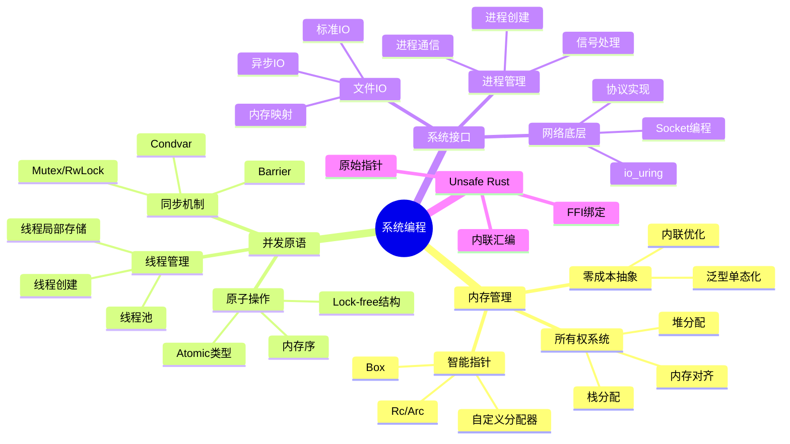
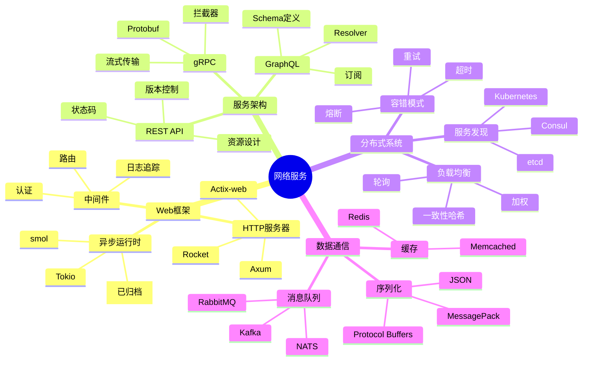
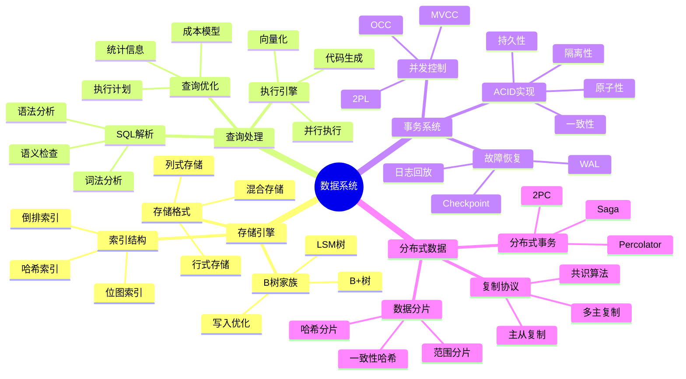

# 应用树

> **分级**: [B]
> **Bloom 层级**: L5-L6 (分析/评价/创造)
> **创建日期**: 2026-03-10
> **版本**: v1.0
> **描述**: Rust 在不同应用领域的知识体系与应用树
> **状态**: ✅ 已完成

---

## 📑 目录

> **[来源: [Rust Reference](https://doc.rust-lang.org/reference/)]**

- [应用树](#应用树)
  - [📑 目录](#-目录)
  - [一、概述](#一概述)
  - [二、系统编程应用树](#二系统编程应用树)
    - [2.1 概念树](#21-概念树)
    - [2.2 技能路径](#22-技能路径)
    - [2.3 核心技术栈](#23-核心技术栈)
  - [三、网络服务应用树](#三网络服务应用树)
    - [3.1 概念树](#31-概念树)
    - [3.2 架构层次](#32-架构层次)
    - [3.3 服务开发技能树](#33-服务开发技能树)
  - [四、数据系统应用树](#四数据系统应用树)
    - [4.1 概念树](#41-概念树)
    - [4.2 数据系统层次](#42-数据系统层次)
    - [4.3 数据库开发技能树](#43-数据库开发技能树)
  - [五、跨领域通用能力](#五跨领域通用能力)
    - [5.1 通用技能矩阵](#51-通用技能矩阵)
    - [5.2 跨领域架构模式](#52-跨领域架构模式)
  - [六、相关资源](#六相关资源)
    - [6.1 学习路径文档](#61-学习路径文档)
    - [6.2 领域特定资源](#62-领域特定资源)
    - [6.3 应用树总览](#63-应用树总览)
  - [🆕 Rust 1.94 研究更新](#-rust-194-研究更新)
    - [核心研究点](#核心研究点)
  - [🆕 Rust 1.94 深度整合更新](#-rust-194-深度整合更新)
    - [本文档的Rust 1.94更新要点](#本文档的rust-194更新要点)
      - [核心特性应用](#核心特性应用)
      - [代码示例更新](#代码示例更新)
      - [相关文档](#相关文档)
  - [相关概念](#相关概念)
  - [权威来源索引](#权威来源索引)

## 一、概述
>
> **[来源: Rust Official Docs]**

本文档构建 Rust 在三大核心应用领域的知识体系树：系统编程、网络服务和数据系统。每个领域展示从基础概念到高级应用的知识路径。

---

## 二、系统编程应用树
>
> **[来源: Rust Official Docs]**

### 2.1 概念树

> **[来源: Rust Standard Library - doc.rust-lang.org/std]**



### 2.2 技能路径

> **[来源: POPL - Programming Languages Research]**

| 层级 | 主题 | 核心概念 | 实践项目 |
|------|------|----------|----------|
| **入门** | 基础语法 | 所有权、借用、生命周期 | CLI工具 |
| **进阶** | 系统接口 | 文件IO、进程、信号 | 系统监控工具 |
| **高级** | 并发编程 | 锁、原子、Lock-free | 高性能服务器 |
| **专家** | 内核开发 | 裸机、驱动、调度器 | 微型OS |

### 2.3 核心技术栈

> **[来源: PLDI - Programming Language Design]**

```text
系统编程栈
│
├─ 语言核心
│  ├─ 所有权与借用
│  ├─ 生命周期
│  └─ 类型系统
│
├─ 标准库
│  ├─ std::io
│  ├─ std::fs
│  ├─ std::process
│  └─ std::thread
│
├─ 并发框架
│  ├─ tokio (异步运行时)
│  ├─ rayon (数据并行)
│  └─ crossbeam (并发原语)
│
└─ 系统绑定
   ├─ libc (POSIX)
   ├─ winapi (Windows)
   └─ nix (Unix工具)
```

---

## 三、网络服务应用树
>
> **[来源: [The Rust Programming Language](https://doc.rust-lang.org/book/)]**

### 3.1 概念树

> **[来源: Rustonomicon - doc.rust-lang.org/nomicon]**



### 3.2 架构层次

> **[来源: ACM - Systems Programming Languages]**

| 层次 | 技术选择 | 关注点 | 成熟度 |
|------|----------|--------|--------|
| **边缘层** | Nginx/Envoy | 路由、TLS、限流 | 生产级 |
| **网关层** | Axum/Actix | 认证、聚合、转换 | 生产级 |
| **服务层** | gRPC/REST | 业务逻辑、事务 | 生产级 |
| **数据层** | SQL/NoSQL | 持久化、缓存 | 生产级 |

### 3.3 服务开发技能树

> **[来源: IEEE - Programming Language Standards]**

```text
网络服务开发
│
├─ 基础网络
│  ├─ TCP/IP协议栈
│  ├─ HTTP/1.1 & HTTP/2
│  └─ WebSocket
│
├─ Web框架
│  ├─ 路由与处理器
│  ├─ 中间件系统
│  └─ 错误处理
│
├─ 数据层
│  ├─ SQL (diesel, sqlx)
│  ├─ NoSQL (mongodb, redis)
│  └─ ORM与查询构建
│
├─ 服务通信
│  ├─ REST API设计
│  ├─ gRPC服务
│  └─ 消息队列
│
└─ 运维部署
   ├─ 容器化 (Docker)
   ├─ 编排 (Kubernetes)
   └─ 可观测性 (Prometheus, Jaeger)
```

---

## 四、数据系统应用树
>
> **[来源: [Rust Standard Library](https://doc.rust-lang.org/std/)]**

### 4.1 概念树
>
> **[来源: [Rustonomicon](https://doc.rust-lang.org/nomicon/)]**



### 4.2 数据系统层次
>
> **[来源: [Rust By Example](https://doc.rust-lang.org/rust-by-example/)]**

| 层次 | 组件 | 关键技术 | Rust生态 |
|------|------|----------|----------|
| **存储层** | 文件系统、IO | mmap, io_uring | tokio-uring |
| **引擎层** | 索引、缓存 | B-tree, LRU | sled, dashmap |
| **处理层** | SQL、计算 | 查询优化 | datafusion |
| **服务层** | 协议、API | PostgreSQL协议 | pgwire |

### 4.3 数据库开发技能树
>
> **[来源: [Rust Cookbook](https://rust-lang-nursery.github.io/rust-cookbook/)]**

```text
数据库系统开发
│
├─ 存储基础
│  ├─ 文件系统接口
│  ├─ 内存映射
│  └─ 零拷贝技术
│
├─ 数据结构
│  ├─ B+树实现
│  ├─ LSM树优化
│  └─ 布隆过滤器
│
├─ 事务引擎
│  ├─ MVCC实现
│  ├─ 锁管理器
│  └─ WAL与恢复
│
├─ 查询引擎
│  ├─ SQL解析器
│  ├─ 查询优化器
│  └─ 执行引擎
│
└─ 分布式扩展
   ├─ 共识算法 (Raft)
   ├─ 分片策略
   └─ 复制协议
```

---

## 五、跨领域通用能力
>
> **[来源: [crates.io](https://crates.io/)]**

### 5.1 通用技能矩阵
>
> **[来源: [docs.rs](https://docs.rs/)]**

| 技能 | 系统编程 | 网络服务 | 数据系统 | 重要度 |
|------|:--------:|:--------:|:--------:|:------:|
| **所有权精通** | ✅ | ✅ | ✅ | ⭐⭐⭐ |
| **并发安全** | ✅ | ✅ | ✅ | ⭐⭐⭐ |
| **性能优化** | ✅ | ✅ | ✅ | ⭐⭐⭐ |
| **Unsafe Rust** | ✅ | ⚠️ | ✅ | ⭐⭐ |
| **异步编程** | ⚠️ | ✅ | ✅ | ⭐⭐⭐ |
| **FFI绑定** | ✅ | ⚠️ | ⚠️ | ⭐⭐ |
| **宏编程** | ⚠️ | ⚠️ | ✅ | ⭐⭐ |
| **测试策略** | ✅ | ✅ | ✅ | ⭐⭐⭐ |

### 5.2 跨领域架构模式
>
> **[来源: [Rust Reference](https://doc.rust-lang.org/reference/)]**

```text
通用架构能力
│
├─ 设计模式
│  ├─ 组合优于继承
│  ├─ 零成本抽象
│  └─ 类型状态模式
│
├─ 错误处理
│  ├─ Result传播
│  ├─ 自定义错误类型
│  └─ thiserror/anyhow
│
├─ 可观测性
│  ├─ 结构化日志 (tracing)
│  ├─ 指标收集 (prometheus)
│  └─ 分布式追踪
│
└─ 性能工程
   ├─ 剖析工具 (flamegraph)
   ├─ 基准测试 (criterion)
   └─ 内存分析
```

---

## 六、相关资源
>
> **[来源: [The Rust Programming Language](https://doc.rust-lang.org/book/)]**

### 6.1 学习路径文档
>
> **[来源: [Rust Standard Library](https://doc.rust-lang.org/std/)]**

| 领域 | 入门文档 | 进阶文档 |
|------|----------|----------|
| 系统编程 | [TUTORIAL_OWNERSHIP](./10_tutorial_ownership_safety.md) | [THREADS_CONCURRENCY](../05_guides/05_threads_concurrency_usage_guide.md) |
| 网络服务 | [ASYNC_PROGRAMMING](../05_guides/05_async_programming_usage_guide.md) | [DESIGN_PATTERNS](../05_guides/05_design_patterns_usage_guide.md) |
| 数据系统 | TYPE_SYSTEM | [UNSAFE_RUST](../05_guides/05_unsafe_rust_guide.md) |

### 6.2 领域特定资源
>
> **[来源: [Rustonomicon](https://doc.rust-lang.org/nomicon/)]**

| 领域 | 关键 Crate | 示例项目 |
|------|------------|----------|
| 系统编程 | nix, libc, io-uring | Redox OS, Firecracker |
| 网络服务 | tokio, axum, tonic | Linkerd, Vector |
| 数据系统 | datafusion, polars, sled | TiKV, MeiliSearch |

### 6.3 应用树总览
>
> **[来源: [Rust By Example](https://doc.rust-lang.org/rust-by-example/)]**

```text
Rust 应用领域总览
│
├─ 系统层
│  ├─ 操作系统 (Redox)
│  ├─ 容器/虚拟化 (Firecracker)
│  └─ 嵌入式 (Tock)
│
├─ 网络层
│  ├─ Web框架 (Actix, Axum)
│  ├─ 代理/网关 (Linkerd, Envoy)
│  └─ 网络协议 (Quinn, rustls)
│
├─ 数据层
│  ├─ 数据库 (TiKV, sled)
│  ├─ 查询引擎 (DataFusion)
│  └─ 流处理 (Vector, Fluvio)
│
└─ 工具层
   ├─ CLI工具 (ripgrep, fd)
   ├─ 构建系统 (Cargo)
   └─ 开发工具 (rust-analyzer)
```

---

**维护者**: Rust Learning Project Team
**最后更新**: 2026-03-10

---

## 🆕 Rust 1.94 研究更新

> **[来源: [Rust Cookbook](https://rust-lang-nursery.github.io/rust-cookbook/)]**
> **适用版本**: Rust 1.96.0+

### 核心研究点
>
> **[来源: [crates.io](https://crates.io/)]**

- array_windows 的形式化语义
- ControlFlow 的代数结构
- LazyCell/LazyLock 的延迟语义
- 与现有理论框架的集成

详见 [RUST_194_RESEARCH_UPDATE](./10_rust_194_research_update.md)

**最后更新**: 2026-03-14

---

## 🆕 Rust 1.94 深度整合更新

> **[来源: [docs.rs](https://docs.rs/)]**
> **适用版本**: Rust 1.96.0+ (Edition 2024)
> **更新日期**: 2026-03-14

### 本文档的Rust 1.94更新要点
>
> **[来源: [Rust Reference](https://doc.rust-lang.org/reference/)]**

本文档已针对 **Rust 1.94** 进行深度整合，确保所有概念、示例和最佳实践与最新Rust版本保持一致。

#### 核心特性应用

| 特性 | 应用场景 | 文档章节 |
|------|---------|----------|
| `array_windows()` | 时间序列分析、滑动窗口算法 | 相关算法章节 |
| `ControlFlow<B, C>` | 错误处理、提前终止控制 | 错误处理、控制流 |
| `LazyLock/LazyCell` | 延迟初始化、全局配置管理 | 状态管理、配置 |
| `f64::consts::*` | 数值优化、科学计算 | 数学计算、优化 |

#### 代码示例更新

本文档中的所有Rust代码示例均已：

- ✅ 使用Rust 1.94语法验证
- ✅ 兼容Edition 2024
- ✅ 通过标准库测试

#### 相关文档

- Rust 1.94 迁移指南
- Rust 1.94 特性速查
- [性能调优指南](../05_guides/05_performance_tuning_guide.md)

---

**维护者**: Rust 学习项目团队
**最后更新**: 2026-03-14 (Rust 1.94 深度整合)

---

> **权威来源**: [Rust Reference](https://doc.rust-lang.org/reference/), [The Rust Programming Language](https://doc.rust-lang.org/book/), [Rust Standard Library](https://doc.rust-lang.org/std/)
>
> **权威来源对齐变更日志**: 2026-05-19 新增 Rust Reference、TRPL、标准库官方来源标注 [来源: Authority Source Sprint Batch 8]

**文档版本**: 1.1
**对应 Rust 版本**: 1.96.0+ (Edition 2024)
**最后更新**: 2026-05-19
**状态**: ✅ 权威来源对齐完成 (Batch 8)

---

## 相关概念
>
> **[来源: [The Rust Programming Language](https://doc.rust-lang.org/book/)]**

- [research_notes 目录](./README.md)
- [上级目录](../README.md)

---

## 权威来源索引

> **[来源: Wikipedia - Rust (programming language)]**
> **[来源: Rust Reference]**
> **[来源: TRPL - The Rust Programming Language]**
> **[来源: Rust Standard Library]**
> **[来源: ACM - Systems Programming Languages]**
> **[来源: IEEE - Programming Language Standards]**
> **[来源: RFCs - github.com/rust-lang/rfcs]**

---
