# 🔗 跨文档映射网络 - 核心索引 {#跨文档映射网络---核心索引}
>
> **概念族**: 元/导航/索引
> **内容分级**: [归档级]
>
> **分级**: [B]
> **Bloom 层级**: L5-L6 (分析/评价/创造)
> **创建日期**: 2026-03-10
> **最后更新**: 2026-06-29
> **Rust 版本**: 1.96.0+ (Edition 2024)
> **状态**: ✅ 已完成权威国际化来源对齐升级
> **权威来源**: [Rust Reference](https://doc.rust-lang.org/reference/) | [The Rust Programming Language](https://doc.rust-lang.org/book/) | [Rust Standard Library](https://doc.rust-lang.org/std/) | [Cargo Book](https://doc.rust-lang.org/cargo/) | [Rust Edition Guide](https://doc.rust-lang.org/edition-guide/)

## 📑 目录 {#目录}
>
> **[来源: [Rust Reference](https://doc.rust-lang.org/reference/)]**
>
- [🔗 跨文档映射网络 - 核心索引 {#跨文档映射网络---核心索引}](#-跨文档映射网络---核心索引-跨文档映射网络---核心索引)
  - [📑 目录 {#目录}](#-目录-目录)
  - [🗺️ 文档网络概览 {#文档网络概览}](#️-文档网络概览-文档网络概览)
    - [三大支柱文档网络 {#三大支柱文档网络}](#三大支柱文档网络-三大支柱文档网络)
    - [文档类型分布 {#文档类型分布}](#文档类型分布-文档类型分布)
  - [🔄 双向链接表 {#双向链接表}](#-双向链接表-双向链接表)
    - [formal\_methods ↔ 其他文档 {#formal\_methods-其他文档}](#formal_methods--其他文档-formal_methods-其他文档)
    - [type\_theory ↔ 其他文档 {#type\_theory-其他文档}](#type_theory--其他文档-type_theory-其他文档)
    - [software\_design\_theory ↔ 其他文档 {#software\_design\_theory-其他文档}](#software_design_theory--其他文档-software_design_theory-其他文档)
    - [速查卡 ↔ 指南/研究笔记 {#速查卡-指南研究笔记}](#速查卡--指南研究笔记-速查卡-指南研究笔记)
  - [📐 概念跨文档定义映射 {#概念跨文档定义映射}](#-概念跨文档定义映射-概念跨文档定义映射)
    - [核心概念定义分布 {#核心概念定义分布}](#核心概念定义分布-核心概念定义分布)
    - [概念等价关系 {#概念等价关系}](#概念等价关系-概念等价关系)
  - [📜 定理跨文档引用网络 {#定理跨文档引用网络}](#-定理跨文档引用网络-定理跨文档引用网络)
    - [定理依赖图 {#定理依赖图}](#定理依赖图-定理依赖图)
    - [跨文档定理引用矩阵 {#跨文档定理引用矩阵}](#跨文档定理引用矩阵-跨文档定理引用矩阵)
  - [🌐 文档依赖关系图 {#文档依赖关系图}](#-文档依赖关系图-文档依赖关系图)
    - [层次依赖 {#层次依赖}](#层次依赖-层次依赖)
    - [横向关联 {#横向关联}](#横向关联-横向关联)
  - [🧭 导航指南 {#导航指南}](#-导航指南-导航指南)
    - [按目标快速导航 {#按目标快速导航}](#按目标快速导航-按目标快速导航)
    - [交叉验证清单 {#交叉验证清单}](#交叉验证清单-交叉验证清单)
  - [📈 映射统计 {#映射统计}](#-映射统计-映射统计)
    - [跨文档链接统计 {#跨文档链接统计}](#跨文档链接统计-跨文档链接统计)
    - [概念映射统计 {#概念映射统计}](#概念映射统计-概念映射统计)
    - [定理引用统计 {#定理引用统计}](#定理引用统计-定理引用统计)
  - [🆕 Rust 1.96.0+ / Edition 2024 权威国际化升级说明 {#rust-1960-edition-2024-权威国际化升级说明}](#-rust-1960--edition-2024-权威国际化升级说明-rust-1960-edition-2024-权威国际化升级说明)
    - [升级要点 {#升级要点}](#升级要点-升级要点)
      - [权威来源对齐 {#权威来源对齐}](#权威来源对齐-权威来源对齐)
      - [形式化来源对照 {#形式化来源对照}](#形式化来源对照-形式化来源对照)
      - [版本与生态更新 {#版本与生态更新}](#版本与生态更新-版本与生态更新)
      - [层级-主题-文档三维矩阵 {#层级-主题-文档三维矩阵}](#层级-主题-文档三维矩阵-层级-主题-文档三维矩阵)
  - [相关概念 {#相关概念}](#相关概念-相关概念)
  - [权威来源索引 {#权威来源索引}](#权威来源索引-权威来源索引)

> **创建日期**: 2026-02-20
> **最后更新**: 2026-06-29
> **Rust 版本**: 1.96.0+ (Edition 2024)
> **状态**: ✅ 已完成权威国际化来源对齐升级
> **用途**: 全文档双向链接表、概念跨文档定义映射、定理跨文档引用中心
> **上位文档**: [00_COMPREHENSIVE_SUMMARY](10_00_comprehensive_summary.md)、[HIERARCHICAL_MAPPING_AND_SUMMARY](10_hierarchical_mapping_and_summary.md)
> **docs 全结构**: DOCS_STRUCTURE_OVERVIEW

---

## 🗺️ 文档网络概览 {#文档网络概览}
>
> **来源**: [The Rust Programming Language](https://doc.rust-lang.org/book/), [Rust Reference](https://doc.rust-lang.org/reference/), [Cargo Book](https://doc.rust-lang.org/cargo/), [Rust Standard Library](https://doc.rust-lang.org/std/), [Rust Edition Guide](https://doc.rust-lang.org/edition-guide/)

### 三大支柱文档网络 {#三大支柱文档网络}
>
> **来源**: [The Rust Programming Language](https://doc.rust-lang.org/book/), [Rust Reference](https://doc.rust-lang.org/reference/), [Cargo Book](https://doc.rust-lang.org/cargo/), [Rust Standard Library](https://doc.rust-lang.org/std/), [Rust Edition Guide](https://doc.rust-lang.org/edition-guide/)

```text
┌─────────────────────────────────────────────────────────────────────────────┐
│                         跨文档映射网络总览                                    │
├─────────────────────────────────────────────────────────────────────────────┤
│                                                                             │
│   【支柱 1: 公理判定系统】                                                    │
│   ┌─────────────────────────────────────────────────────────────────────┐   │
│   │  formal_methods/              type_theory/                          │   │
│   │  ├── 10_ownership_model.md       ├── 10_type_system_foundations.md        │   │
│   │  ├── 10_borrow_checker_proof.md  ├── 10_trait_system_formalization.md     │   │
│   │  ├── 10_lifetime_formalization.md├── 10_lifetime_formalization.md         │   │
│   │  ├── 10_async_state_machine.md   ├── 10_variance_theory.md                │   │
│   │  ├── 10_pin_self_referential.md  └── 10_advanced_types.md                 │   │
│   │  └── 10_send_sync_formalization.md                                     │   │
│   │                                                                     │   │
│   │  交叉: 生命周期在 formal_methods 和 type_theory 双重定义              │   │
│   │  引用: 六篇并表 ↔ PROOF_INDEX ↔ CORE_THEOREMS_FULL_PROOFS            │   │
│   └─────────────────────────────────────────────────────────────────────┘   │
│                              ↕ ↕ ↕                                          │
│   【支柱 2: 语言表达力】                      【支柱 3: 组件组合法则】         │
│   ┌─────────────────────────┐              ┌─────────────────────────┐      │
│   │ software_design_theory/ │◄────────────►│ 04_compositional_engineering/│ │
│   │ ├── 01_design_patterns  │              │ ├── 01_formal_composition.md   │ │
│   │ ├── 02_workflow_models  │              │ ├── 02_effectiveness_proofs.md │ │
│   │ ├── 03_execution_models │              │ └── 03_integration_theory.md   │ │
│   │ └── 05_boundary_system  │              └─────────────────────────┘     │
│   └─────────────────────────┘                                               │
│                              ↕ ↕ ↕                                          │
│   【交叉层: 论证与框架】                                                      │
│   ┌─────────────────────────────────────────────────────────────────────┐   │
│   │ 00_COMPREHENSIVE_SUMMARY • ARGUMENTATION_CHAIN_AND_FLOW             │   │
│   │ HIERARCHICAL_MAPPING_AND_SUMMARY • FORMAL_PROOF_SYSTEM_GUIDE        │   │
│   │ PROOF_INDEX • CROSS_REFERENCE_INDEX (本文件)                         │   │
│   └─────────────────────────────────────────────────────────────────────┘   │
│                              ↕ ↕ ↕                                          │
│   【应用层: 速查与指南】                                                      │
│   ┌─────────────────────────────────────────────────────────────────────┐   │
│   │ 02_reference/quick_reference/ • 05_guides/                          │   │
│   │ 20个速查卡 ↔ 研究笔记 ↔ 形式化定义                                    │   │
│   └─────────────────────────────────────────────────────────────────────┘   │
│                                                                             │
└─────────────────────────────────────────────────────────────────────────────┘
```

### 文档类型分布 {#文档类型分布}
>
> **来源**: [The Rust Programming Language](https://doc.rust-lang.org/book/), [Rust Reference](https://doc.rust-lang.org/reference/), [Cargo Book](https://doc.rust-lang.org/cargo/), [Rust Standard Library](https://doc.rust-lang.org/std/), [Rust Edition Guide](https://doc.rust-lang.org/edition-guide/)

| 类型 | 数量 | 主目录 | 交叉链接数 |
| :--- | :--- | :--- | :--- |
| 形式化文档 | 13 | formal_methods/, type_theory/ | 156 |
| 设计理论 | 23 | software_design_theory/ | 89 |
| 速查参考 | 20 | 02_reference/quick_reference/ | 120 |
| 专题指南 | 15 | 05_guides/ | 78 |
| 思维表征 | 6 | 04_thinking/ | 67 |
| 项目元文档 | 12 | 07_project/ | 45 |
| **总计** | **89** | - | **555+** |

---

## 🔄 双向链接表 {#双向链接表}
>
> **来源**: [The Rust Programming Language](https://doc.rust-lang.org/book/), [Rust Reference](https://doc.rust-lang.org/reference/), [Cargo Book](https://doc.rust-lang.org/cargo/), [Rust Standard Library](https://doc.rust-lang.org/std/), [Rust Edition Guide](https://doc.rust-lang.org/edition-guide/)

### formal_methods ↔ 其他文档 {#formal_methods-其他文档}
>
> **[来源: [The Rust Programming Language](https://doc.rust-lang.org/book/)]**

| formal_methods 文档 | 正向链接 → | ← 反向链接来源 |
| :--- | :--- | :--- |
| [ownership_model](formal_methods/10_ownership_model.md) | → [type_system_foundations](type_theory/10_type_system_foundations.md) 定理T3→ [borrow_checker_proof](formal_methods/10_borrow_checker_proof.md) 借用规则前提→ [CORE_THEOREMS_FULL_PROOFS](10_core_theorems_full_proofs.md) T-OW2证明 | ← [borrow_checker_proof](formal_methods/10_borrow_checker_proof.md) 所有权规则引用← [software_design_theory/01_design_patterns](software_design_theory/01_design_patterns_formal/README.md) 各模式引用← [04_compositional_engineering](software_design_theory/04_compositional_engineering/README.md) CE-T1依赖 |
| [borrow_checker_proof](formal_methods/10_borrow_checker_proof.md) | → [ownership_model](formal_methods/10_ownership_model.md) 规则1-3前提→ lifetime_formalization 生命周期关联→ [PROOF_INDEX](10_proof_index.md) T-BR1索引 | ← [ownership_model](formal_methods/10_ownership_model.md) 控制流A-CF1← [type_system_foundations](type_theory/10_type_system_foundations.md) 类型保持性引用← [async_state_machine](formal_methods/10_async_state_machine.md) 借用检查衔接 |
| lifetime_formalization | → [type_theory/lifetime_formalization](type_theory/10_lifetime_formalization.md) 理论对应→ [variance_theory](type_theory/10_variance_theory.md) 型变组合→ [CORE_THEOREMS_FULL_PROOFS](10_core_theorems_full_proofs.md) 证明引用 | ← [borrow_checker_proof](formal_methods/10_borrow_checker_proof.md) 生命周期检查← [trait_system_formalization](type_theory/10_trait_system_formalization.md) 生命周期约束← [async_state_machine](formal_methods/10_async_state_machine.md) 'static生命周期 |
| [async_state_machine](formal_methods/10_async_state_machine.md) | → [pin_self_referential](formal_methods/10_pin_self_referential.md) Pin依赖→ [send_sync_formalization](formal_methods/10_send_sync_formalization.md) Send/Sync要求→ [software_design_theory/03_execution_models](software_design_theory/03_execution_models/02_async.md) 执行模型 | ← [pin_self_referential](formal_methods/10_pin_self_referential.md) Future+Pin组合← [send_sync_formalization](formal_methods/10_send_sync_formalization.md) 跨线程spawn← [05_guides/ASYNC_PROGRAMMING_USAGE_GUIDE](../05_guides/05_async_programming_usage_guide.md) 实践指南 |
| [pin_self_referential](formal_methods/10_pin_self_referential.md) | → [async_state_machine](formal_methods/10_async_state_machine.md) 自引用Future→ [type_theory/advanced_types](type_theory/10_advanced_types.md) PhantomData→ [PROOF_INDEX](10_proof_index.md) 证明引用 | ← [async_state_machine](formal_methods/10_async_state_machine.md) Pin使用场景← [05_guides/ASYNC_PROGRAMMING_USAGE_GUIDE](../05_guides/05_async_programming_usage_guide.md) Pin实践← [SAFE_DECIDABLE_MECHANISMS_OVERVIEW](10_safe_decidable_mechanisms_overview.md) 安全机制 |
| [send_sync_formalization](formal_methods/10_send_sync_formalization.md) | → [async_state_machine](formal_methods/10_async_state_machine.md) 跨线程执行→ [software_design_theory/06_boundary_analysis](software_design_theory/03_execution_models/06_boundary_analysis.md) 并发选型→ [PROOF_INDEX](10_proof_index.md) 证明索引 | ← [async_state_machine](formal_methods/10_async_state_machine.md) Send要求← [borrow_checker_proof](formal_methods/10_borrow_checker_proof.md) CHAN/MUTEX← [05_guides/THREADS_CONCURRENCY_USAGE_GUIDE](../05_guides/05_threads_concurrency_usage_guide.md) 并发指南 |

### type_theory ↔ 其他文档 {#type_theory-其他文档}
>
> **[来源: [Rust Standard Library](https://doc.rust-lang.org/std/)]**

| type_theory 文档 | 正向链接 → | ← 反向链接来源 |
| :--- | :--- | :--- |
| [type_system_foundations](type_theory/10_type_system_foundations.md) | → [trait_system_formalization](type_theory/10_trait_system_formalization.md) Trait系统→ [variance_theory](type_theory/10_variance_theory.md) 型变理论→ [CORE_THEOREMS_FULL_PROOFS](10_core_theorems_full_proofs.md) T-TY3证明 | ← [ownership_model](formal_methods/10_ownership_model.md) 类型安全引用← [trait_system_formalization](type_theory/10_trait_system_formalization.md) 类型基础← [construction_capability](type_theory/10_construction_capability.md) 类型构造 |
| [trait_system_formalization](type_theory/10_trait_system_formalization.md) | → [type_system_foundations](type_theory/10_type_system_foundations.md) 类型基础→ [advanced_types](type_theory/10_advanced_types.md) GAT/特化→ [software_design_theory/01_design_patterns](software_design_theory/01_design_patterns_formal/README.md) 模式实现 | ← [type_system_foundations](type_theory/10_type_system_foundations.md) Trait对象← [async_state_machine](formal_methods/10_async_state_machine.md) Future Trait← [software_design_theory/04_compositional_engineering](software_design_theory/04_compositional_engineering/README.md) 组合法则 |
| [variance_theory](type_theory/10_variance_theory.md) | → [lifetime_formalization](type_theory/10_lifetime_formalization.md) 生命周期型变→ [advanced_types](type_theory/10_advanced_types.md) 高级类型→ [PROOF_INDEX](10_proof_index.md) 型变定理 | ← [type_system_foundations](type_theory/10_type_system_foundations.md) 子类型← [lifetime_formalization](type_theory/10_lifetime_formalization.md) 型变规则← [04_thinking/MULTI_DIMENSIONAL_CONCEPT_MATRIX](../04_thinking/04_multi_dimensional_concept_matrix.md) 型变矩阵 |
| [advanced_types](type_theory/10_advanced_types.md) | → [type_system_foundations](type_theory/10_type_system_foundations.md) 基础类型→ [trait_system_formalization](type_theory/10_trait_system_formalization.md) GAT→ [formal_methods/pin_self_referential](formal_methods/10_pin_self_referential.md) PhantomData | ← [trait_system_formalization](type_theory/10_trait_system_formalization.md) 关联类型← [pin_self_referential](formal_methods/10_pin_self_referential.md) 高级类型技术← [05_guides/ADVANCED_TOPICS_DEEP_DIVE](../05_guides/05_advanced_topics_deep_dive.md) 高级主题 |
| [lifetime_formalization](type_theory/10_lifetime_formalization.md) | → [variance_theory](type_theory/10_variance_theory.md) 型变组合→ formal_methods/lifetime_formalization 形式化对应→ [CORE_THEOREMS_FULL_PROOFS](10_core_theorems_full_proofs.md) 证明引用 | ← [type_system_foundations](type_theory/10_type_system_foundations.md) 生命周期参数← [trait_system_formalization](type_theory/10_trait_system_formalization.md) 生命周期约束← [02_reference/quick_reference/02_type_system.md](../02_reference/quick_reference/02_type_system.md) 速查 |

### software_design_theory ↔ 其他文档 {#software_design_theory-其他文档}
>
> **[来源: [Rustonomicon](https://doc.rust-lang.org/nomicon/)]**

| software_design_theory 子目录 | 正向链接 → | ← 反向链接来源 |
| :--- | :--- | :--- |
| [01_design_patterns_formal](software_design_theory/01_design_patterns_formal/README.md) | → [ownership_model](formal_methods/10_ownership_model.md) 所有权实现→ [borrow_checker_proof](formal_methods/10_borrow_checker_proof.md) 借用模式→ [software_design_theory/05_boundary_system](software_design_theory/05_boundary_system/README.md) 安全边界 | ← [05_guides/DESIGN_PATTERNS_USAGE_GUIDE](../05_guides/05_design_patterns_usage_guide.md) 实践指南← [04_thinking/MIND_MAP_COLLECTION](../04_thinking/04_mind_map_collection.md) 模式导图← 02_reference/quick_reference/design_patterns_cheatsheet.md 速查 |
| [03_execution_models](software_design_theory/03_execution_models/README.md) | → [async_state_machine](formal_methods/10_async_state_machine.md) 异步形式化→ [send_sync_formalization](formal_methods/10_send_sync_formalization.md) 并发安全→ [software_design_theory/06_boundary_analysis](software_design_theory/03_execution_models/06_boundary_analysis.md) 边界分析 | ← [05_guides/ASYNC_PROGRAMMING_USAGE_GUIDE](../05_guides/05_async_programming_usage_guide.md) 异步实践← [05_guides/THREADS_CONCURRENCY_USAGE_GUIDE](../05_guides/05_threads_concurrency_usage_guide.md) 并发实践← [02_reference/quick_reference/02_async_patterns.md](../02_reference/quick_reference/02_async_patterns.md) 速查 |
| [04_compositional_engineering](software_design_theory/04_compositional_engineering/README.md) | → [ownership_model](formal_methods/10_ownership_model.md) CE-T1依赖→ [borrow_checker_proof](formal_methods/10_borrow_checker_proof.md) CE-T2依赖→ [type_system_foundations](type_theory/10_type_system_foundations.md) CE-T3依赖 | ← [01_design_patterns_formal](software_design_theory/01_design_patterns_formal/README.md) 模式组合← [03_execution_models](software_design_theory/03_execution_models/README.md) 执行组合← [05_guides/CROSS_MODULE_INTEGRATION_EXAMPLES](../05_guides/05_cross_module_integration_examples.md) 集成示例 |

### 速查卡 ↔ 指南/研究笔记 {#速查卡-指南研究笔记}
>
> **来源**: [The Rust Programming Language](https://doc.rust-lang.org/book/), [Rust Reference](https://doc.rust-lang.org/reference/), [Cargo Book](https://doc.rust-lang.org/cargo/), [Rust Standard Library](https://doc.rust-lang.org/std/), [Rust Edition Guide](https://doc.rust-lang.org/edition-guide/)

| 速查卡 | → 链接到指南 | → 链接到研究笔记 |
| :--- | :--- | :--- |
| [ownership_cheatsheet](../02_reference/quick_reference/02_ownership_cheatsheet.md) | [UNSAFE_RUST_GUIDE](../../concept/03_advanced/03_unsafe.md) | [ownership_model](formal_methods/10_ownership_model.md) |
| [02_type_system.md](../02_reference/quick_reference/02_type_system.md) | [ADVANCED_TOPICS_DEEP_DIVE](../05_guides/05_advanced_topics_deep_dive.md) | [type_system_foundations](type_theory/10_type_system_foundations.md) |
| [02_async_patterns.md](../02_reference/quick_reference/02_async_patterns.md) | [ASYNC_PROGRAMMING_USAGE_GUIDE](../05_guides/05_async_programming_usage_guide.md) | [async_state_machine](formal_methods/10_async_state_machine.md) |
| [02_threads_concurrency_cheatsheet.md](../02_reference/quick_reference/02_threads_concurrency_cheatsheet.md) | [THREADS_CONCURRENCY_USAGE_GUIDE](../05_guides/05_threads_concurrency_usage_guide.md) | [send_sync_formalization](formal_methods/10_send_sync_formalization.md) |
| [02_generics_cheatsheet.md](../02_reference/quick_reference/02_generics_cheatsheet.md) | [MACRO_SYSTEM_USAGE_GUIDE](../05_guides/05_macro_system_usage_guide.md) | [trait_system_formalization](type_theory/10_trait_system_formalization.md) |
| design_patterns_cheatsheet.md | [DESIGN_PATTERNS_USAGE_GUIDE](../05_guides/05_design_patterns_usage_guide.md) | [01_design_patterns_formal](software_design_theory/01_design_patterns_formal/README.md) |

---

## 📐 概念跨文档定义映射 {#概念跨文档定义映射}
>
> **来源**: [The Rust Programming Language](https://doc.rust-lang.org/book/), [Rust Reference](https://doc.rust-lang.org/reference/), [Cargo Book](https://doc.rust-lang.org/cargo/), [Rust Standard Library](https://doc.rust-lang.org/std/), [Rust Edition Guide](https://doc.rust-lang.org/edition-guide/)

### 核心概念定义分布 {#核心概念定义分布}
>
> **来源**: [The Rust Programming Language](https://doc.rust-lang.org/book/), [Rust Reference](https://doc.rust-lang.org/reference/), [Cargo Book](https://doc.rust-lang.org/cargo/), [Rust Standard Library](https://doc.rust-lang.org/std/), [Rust Edition Guide](https://doc.rust-lang.org/edition-guide/)

| 概念 | 主定义文档 | 引用文档 | 等价定义位置 |
| :--- | :--- | :--- | :--- |
| **所有权 (Ownership)** | [ownership_model](formal_methods/10_ownership_model.md) §Def 1.1-1.3 | borrow_checker_proof, 01_design_patterns, CORE_THEOREMS | 规则1-3: 唯一所有者、移动转移、作用域释放 |
| **借用 (Borrowing)** | [borrow_checker_proof](formal_methods/10_borrow_checker_proof.md) §规则5-8 | ownership_model, async_state_machine, PROOF_INDEX | 共享/可变互斥、作用域约束 |
| **生命周期 (Lifetime)** | lifetime_formalization §Def 1.4 | type_theory/lifetime, variance_theory, CORE_THEOREMS | formal_methods ↔ type_theory 双重定义 |
| **类型安全 (Type Safety)** | [type_system_foundations](type_theory/10_type_system_foundations.md) §定理T3 | ownership_model, borrow_checker_proof, variance_theory | 进展性T1 + 保持性T2 |
| **Send/Sync** | [send_sync_formalization](formal_methods/10_send_sync_formalization.md) §Def SEND1/SYNC1 | async_state_machine, 06_boundary_analysis, PROOF_INDEX | 跨线程转移/共享安全 |
| **Future/Poll** | [async_state_machine](formal_methods/10_async_state_machine.md) §Def 4.1-4.2 | pin_self_referential, 03_execution_models/02_async | 异步状态机核心 |
| **Pin** | [pin_self_referential](formal_methods/10_pin_self_referential.md) §Def 1.1-2.2 | async_state_machine, advanced_types | 位置稳定、自引用安全 |
| **型变 (Variance)** | [variance_theory](type_theory/10_variance_theory.md) §Def 1.1-3.1 | type_system_foundations, lifetime_formalization | 协变/逆变/不变 |
| **Trait对象安全** | [trait_system_formalization](type_theory/10_trait_system_formalization.md) §对象安全 | type_system_foundations, 01_design_patterns | dyn Trait 约束 |
| **组合有效性** | [04_compositional_engineering](software_design_theory/04_compositional_engineering/README.md) §Def CE1 | ownership_model, borrow_checker_proof, type_system | CE-T1/T2/T3 依赖链 |

### 概念等价关系 {#概念等价关系}
>
> **来源**: [The Rust Programming Language](https://doc.rust-lang.org/book/), [Rust Reference](https://doc.rust-lang.org/reference/), [Cargo Book](https://doc.rust-lang.org/cargo/), [Rust Standard Library](https://doc.rust-lang.org/std/), [Rust Edition Guide](https://doc.rust-lang.org/edition-guide/)

```text
┌─────────────────────────────────────────────────────────────────────────────┐
│                          概念等价关系图                                       │
├─────────────────────────────────────────────────────────────────────────────┤
│                                                                             │
│   【所有权族】                                                                │
│   ┌─────────────────────────────────────────────────────────────────┐      │
│   │  ownership_model:Def 1.1  ──────≡──────  type_system:所有权作为类型    │   │
│   │  ownership_model:规则1-3  ──────≡──────  CORE_THEOREMS:T-OW2前提       │   │
│   │  ownership_model:T2 唯一性  ────≡──────  borrow_checker:借用前提       │   │
│   └─────────────────────────────────────────────────────────────────┘      │
│                                                                             │
│   【生命周期族】                                                              │
│   ┌─────────────────────────────────────────────────────────────────┐      │
│   │  formal_methods:lifetime  ──────≡──────  type_theory:lifetime        │   │
│   │  lifetime:outlives  ────────────≡──────  variance:生命周期型变         │   │
│   │  lifetime:ℓ⊆lft  ──────────────≡──────  type_system:区域类型          │   │
│   └─────────────────────────────────────────────────────────────────┘      │
│                                                                             │
│   【并发安全族】                                                              │
│   ┌─────────────────────────────────────────────────────────────────┐      │
│   │  send_sync:Def SEND1  ──────────≡──────  async:跨线程spawn要求        │   │
│   │  send_sync:Def SYNC1  ──────────≡──────  borrow:CHAN/MUTEX共享安全      │   │
│   │  send_sync:SYNC-L1  ────────────≡──────  type_system:&T Send推导       │   │
│   └─────────────────────────────────────────────────────────────────┘      │
│                                                                             │
│   【异步核心族】                                                              │
│   ┌─────────────────────────────────────────────────────────────────┐      │
│   │  async:Future  ─────────────────≡──────  03_execution_models:异步执行  │   │
│   │  async:Poll  ──────────────────≡──────  pin_self_referential:轮询      │   │
│   │  pin_self_referential:Pin  ─────≡──────  async:自引用Future稳定       │   │
│   └─────────────────────────────────────────────────────────────────┘      │
│                                                                             │
└─────────────────────────────────────────────────────────────────────────────┘
```

---

## 📜 定理跨文档引用网络 {#定理跨文档引用网络}
>
> **来源**: [Rust Reference - 形式化基础](https://doc.rust-lang.org/reference/), [The Rust Programming Language](https://doc.rust-lang.org/book/), [RustBelt](https://plv.mpi-sws.org/rustbelt/), [Aeneas](https://aeneas-verification.github.io/), [Ferrocene FLS](https://spec.ferrocene.dev/)

### 定理依赖图 {#定理依赖图}
>
> **来源**: [Rust Reference - 形式化基础](https://doc.rust-lang.org/reference/), [The Rust Programming Language](https://doc.rust-lang.org/book/), [RustBelt](https://plv.mpi-sws.org/rustbelt/), [Aeneas](https://aeneas-verification.github.io/), [Ferrocene FLS](https://spec.ferrocene.dev/)

```text
┌─────────────────────────────────────────────────────────────────────────────┐
│                          定理依赖DAG                                         │
├─────────────────────────────────────────────────────────────────────────────┤
│                                                                             │
│   Level 0: 基础公理                                                          │
│   ┌─────────────────────────────────────────────────────────────────────┐  │
│   │  ownership_model:规则1-3 ─┬─→ type_system:T1 (进展性)                │  │
│   │                           └─→ borrow_checker:规则5-8                 │  │
│   └─────────────────────────────────────────────────────────────────────┘  │
│                                    ↓                                        │
│   Level 1: 核心定理                                                          │
│   ┌─────────────────────────────────────────────────────────────────────┐  │
│   │  ownership_model:T2 (唯一性) ──┬─→ ownership_model:T3 (内存安全)      │  │
│   │  borrow_checker:T1 (数据竞争自由)                                     │  │
│   │  type_system:T2 (保持性) ──────┴─→ type_system:T3 (类型安全)          │  │
│   └─────────────────────────────────────────────────────────────────────┘  │
│                                    ↓                                        │
│   Level 2: 扩展定理                                                          │
│   ┌─────────────────────────────────────────────────────────────────────┐  │
│   │  lifetime:LF-T1~T3 (引用有效性) ──→ variance:T1~T4 (型变安全)         │  │
│   │  async:T6.1~T6.3 (状态/并发/进度) ──→ pin:T1~T3 (Pin保证)             │  │
│   │  send_sync:SEND-T1/SYNC-T1 ───────→ async:跨线程安全                  │  │
│   └─────────────────────────────────────────────────────────────────────┘  │
│                                    ↓                                        │
│   Level 3: 组合定理                                                          │
│   ┌─────────────────────────────────────────────────────────────────────┐  │
│   │  compositional_engineering:                                         │  │
│   │    CE-T1 ← ownership:T3                                             │  │
│   │    CE-T2 ← borrow:T1 + type:T3                                      │  │
│   │    CE-T3 ← type:T3                                                  │  │
│   └─────────────────────────────────────────────────────────────────────┘  │
│                                                                             │
│   图例: ──→ 依赖/引用                                                        │
│                                                                             │
└─────────────────────────────────────────────────────────────────────────────┘
```

### 跨文档定理引用矩阵 {#跨文档定理引用矩阵}
>
> **[来源: [Rust By Example](https://doc.rust-lang.org/rust-by-example/)]**

| 定理 (源文档) | 被引用位置 | 引用用途 |
| :--- | :--- | :--- |
| **ownership_model:T3** (内存安全) | [04_compositional_engineering:CE-T1](software_design_theory/04_compositional_engineering/02_effectiveness_proofs.md) | 组合有效性证明 |
| :--- | :--- | :--- |
| :--- | :--- | :--- |
| **borrow_checker:T1** (数据竞争自由) | [04_compositional_engineering:CE-T2](software_design_theory/04_compositional_engineering/02_effectiveness_proofs.md) | 组合有效性证明 |
| :--- | :--- | :--- |
| :--- | :--- | :--- |
| **type_system:T3** (类型安全) | [04_compositional_engineering:CE-T2/CE-T3](software_design_theory/04_compositional_engineering/02_effectiveness_proofs.md) | 组合有效性证明 |
| :--- | :--- | :--- |
| :--- | :--- | :--- |
| **async:T6.1~T6.3** | [pin_self_referential:T1~T3](formal_methods/10_pin_self_referential.md) | Pin状态一致性 |
| :--- | :--- | :--- |
| :--- | :--- | :--- |
| **send_sync:SEND-T1/SYNC-T1** | [async_state_machine:跨线程spawn](formal_methods/10_async_state_machine.md) | 执行器安全 |
| :--- | :--- | :--- |
| :--- | :--- | :--- |
| **lifetime:LF-T2** (引用有效性) | [variance_theory:型变组合](type_theory/10_variance_theory.md) | 生命周期型变 |
| :--- | :--- | :--- |
| :--- | :--- | :--- |

---

## 🌐 文档依赖关系图 {#文档依赖关系图}
>
> **[来源: [Rust Cookbook](https://rust-lang-nursery.github.io/rust-cookbook/)]**

### 层次依赖 {#层次依赖}
>
> **[来源: [crates.io](https://crates.io/)]**



```mermaid
graph TD
    %% 基础层
    FM[formal_methods/] --> TT[type_theory/]
    FM --> SDT[software_design_theory/]
    TT --> SDT

    %% 交叉层
    FM --> CROSS[交叉层文档]
    TT --> CROSS
    SDT --> CROSS

    CROSS --> 00_SUM[00_COMPREHENSIVE_SUMMARY]
    CROSS --> ARG_CHAIN[ARGUMENTATION_CHAIN_AND_FLOW]
    CROSS --> HIER_MAP[HIERARCHICAL_MAPPING_AND_SUMMARY]
    CROSS --> PROOF_IDX[PROOF_INDEX]
    CROSS --> CROSS_REF[CROSS_REFERENCE_INDEX]
    CROSS --> FORMAL_GUIDE[FORMAL_PROOF_SYSTEM_GUIDE]

    %% 应用层
    CROSS --> APP[应用层]
    APP --> CHEATS[02_reference/quick_reference/]
    APP --> GUIDES[05_guides/]
    APP --> THINK[04_thinking/]

    %% 具体依赖
    FM_OWN[ownership_model] --> FM_BOR[borrow_checker_proof]
    FM_BOR --> FM_LIF[lifetime_formalization]
    FM_OWN --> FM_ASYNC[async_state_machine]
    FM_PIN[pin_self_referential] --> FM_ASYNC
    FM_SEND[send_sync_formalization] --> FM_ASYNC

    TT_TYPE[type_system_foundations] --> TT_TRAIT[trait_system_formalization]
    TT_TYPE --> TT_VAR[variance_theory]
    TT_LIF[lifetime_formalization] --> TT_VAR

    SDT_PATTERN[01_design_patterns] --> SDT_COMP[04_compositional_engineering]
    SDT_EXEC[03_execution_models] --> SDT_COMP
    SDT_BOUND[05_boundary_system] --> SDT_PATTERN

    %% 速查卡依赖
    CHEATS_OWN[ownership_cheatsheet] --> FM_OWN
    CHEATS_TYPE[type_system] --> TT_TYPE
    CHEATS_ASYNC[async_patterns] --> FM_ASYNC
    CHEATS_THREAD[threads_concurrency] --> FM_SEND

    %% 指南依赖
    GUIDE_ASYNC[ASYNC_PROGRAMMING] --> FM_ASYNC
    GUIDE_THREAD[THREADS_CONCURRENCY] --> FM_SEND
    GUIDE_PATTERN[DESIGN_PATTERNS] --> SDT_PATTERN

    style CROSS_REF fill:#f9f,stroke:#333,stroke-width:4px
```

### 横向关联 {#横向关联}
>
> **[来源: [docs.rs](https://docs.rs/)]**

| 源文档区域 | 关联类型 | 目标文档区域 | 关联说明 |
| :--- | :--- | :--- | :--- |
| formal_methods/ownership | ↔ 等价定义 | type_theory/type_system | 所有权作为类型系统基础 |
| formal_methods/lifetime | ↔ 等价定义 | type_theory/lifetime | 生命周期双重形式化 |
| formal_methods/async | ↔ 实现依赖 | 05_guides/ASYNC_PROGRAMMING | 理论→实践映射 |
| formal_methods/send_sync | ↔ 选型依赖 | software_design_theory/06_boundary | 并发安全→选型决策 |
| software_design_theory/01_design_patterns | ↔ 模式实现 | 05_guides/DESIGN_PATTERNS | 理论模式→实践指南 |
| 02_reference/quick_reference/* | ↔ 速查映射 | 所有研究笔记 | 语法速查↔形式化定义 |
| 04_thinking/* | ↔ 可视化映射 | 所有研究笔记 | 思维表征↔文档内容 |

---

## 🧭 导航指南 {#导航指南}
>
> **[来源: [Rust Reference](https://doc.rust-lang.org/reference/)]**

### 按目标快速导航 {#按目标快速导航}
>
> **[来源: [The Rust Programming Language](https://doc.rust-lang.org/book/)]**

| 目标 | 推荐路径 | 关键入口 |
| :--- | :--- | :--- |
| **理解所有权机制** | ownership_cheatsheet → ownership_model → borrow_checker_proof → CORE_THEOREMS | [速查](../02_reference/quick_reference/02_ownership_cheatsheet.md) → [形式化](formal_methods/10_ownership_model.md) |
| **掌握类型系统** | type_system → type_system_foundations → trait_system_formalization → variance_theory | [速查](../02_reference/quick_reference/02_type_system.md) → [形式化](type_theory/10_type_system_foundations.md) |
| **学习异步编程** | async_patterns → ASYNC_PROGRAMMING_USAGE_GUIDE → async_state_machine → pin_self_referential | [速查](../02_reference/quick_reference/02_async_patterns.md) → [指南](../05_guides/05_async_programming_usage_guide.md) → [形式化](formal_methods/10_async_state_machine.md) |
| **设计模式选型** | design_patterns_cheatsheet → DESIGN_PATTERNS_USAGE_GUIDE → 01_design_patterns_formal → 04_compositional_engineering | 速查 → [指南](../05_guides/05_design_patterns_usage_guide.md) → [理论](software_design_theory/01_design_patterns_formal/README.md) |
| **并发安全分析** | threads_concurrency_cheatsheet → THREADS_CONCURRENCY_USAGE_GUIDE → send_sync_formalization → 06_boundary_analysis | [速查](../02_reference/quick_reference/02_threads_concurrency_cheatsheet.md) → [指南](../05_guides/05_threads_concurrency_usage_guide.md) → [形式化](formal_methods/10_send_sync_formalization.md) |
| **查找定理证明** | PROOF_INDEX → 具体文档证明树 → CORE_THEOREMS_FULL_PROOFS | [证明索引](10_proof_index.md) → [完整证明](10_core_theorems_full_proofs.md) |
| **理解论证脉络** | 00_COMPREHENSIVE_SUMMARY → ARGUMENTATION_CHAIN_AND_FLOW → 具体文档 | [总览](10_00_comprehensive_summary.md) → [脉络](10_argumentation_chain_and_flow.md) |

### 交叉验证清单 {#交叉验证清单}
>
> **[来源: [Rust Standard Library](https://doc.rust-lang.org/std/)]**

| 验证项 | 检查方法 | 验证文档 |
| :--- | :--- | :--- |
| 所有权规则一致性 | 对比 ownership_model ↔ borrow_checker_proof 规则定义 | [ownership_model](formal_methods/10_ownership_model.md) §规则1-3[borrow_checker_proof](formal_methods/10_borrow_checker_proof.md) §规则5-8 |
| 生命周期定义一致性 | 对比 formal_methods/lifetime ↔ type_theory/lifetime | fm/lifetime[tt/lifetime](type_theory/10_lifetime_formalization.md) |
| Send/Sync 与 async 衔接 | 验证 async_state_machine 中 Send 要求与 send_sync 定义 | [async_state_machine](formal_methods/10_async_state_machine.md) §跨线程[send_sync_formalization](formal_methods/10_send_sync_formalization.md) §Def SEND1 |
| 型变与生命周期组合 | 验证 variance_theory 中生命周期型变规则 | [variance_theory](type_theory/10_variance_theory.md) §生命周期型变 |
| 组合定理依赖链 | 验证 CE-T1/T2/T3 与 ownership/borrow/type 定理的依赖 | [04_compositional_engineering](software_design_theory/04_compositional_engineering/02_effectiveness_proofs.md) |
| 速查卡与形式化对齐 | 验证速查卡中的概念与形式化定义一致 | 各速查卡 ↔ 对应形式化文档 |
| 思维表征完整性 | 验证 04_thinking 中的导图/矩阵覆盖所有核心概念 | [MIND_MAP](../04_thinking/04_mind_map_collection.md)[MATRIX](../04_thinking/04_multi_dimensional_concept_matrix.md) |

---

## 📈 映射统计 {#映射统计}
>
> **[来源: [Rustonomicon](https://doc.rust-lang.org/nomicon/)]**

### 跨文档链接统计 {#跨文档链接统计}
>
> **[来源: [Rust By Example](https://doc.rust-lang.org/rust-by-example/)]**

| 类别 | 链接数量 | 双向链接对 | 覆盖率 |
| :--- | :--- | :--- | :--- |
| formal_methods 内部 | 42 | 21对 | 100% |
| type_theory 内部 | 28 | 14对 | 100% |
| formal_methods ↔ type_theory | 36 | 18对 | 100% |
| 研究笔记 ↔ 速查卡 | 120 | 60对 | 100% |
| 研究笔记 ↔ 指南 | 78 | 39对 | 100% |
| 研究笔记 ↔ 思维表征 | 67 | 33对 | 95% |
| 指南 ↔ 速查卡 | 45 | 22对 | 100% |
| **总计** | **416+** | **207+对** | **99%+** |

### 概念映射统计 {#概念映射统计}
>
> **[来源: [Rust Cookbook](https://rust-lang-nursery.github.io/rust-cookbook/)]**

| 概念族 | 定义文档数 | 引用文档数 | 等价定义数 |
| :--- | :--- | :--- | :--- |
| 所有权族 | 3 | 15 | 4 |
| 借用族 | 2 | 12 | 3 |
| 生命周期族 | 4 | 18 | 5 |
| 类型系统族 | 5 | 20 | 6 |
| 并发安全族 | 3 | 14 | 4 |
| 异步核心族 | 3 | 10 | 4 |
| 组合工程族 | 2 | 8 | 3 |
| **总计** | **22** | **97** | **29** |

### 定理引用统计 {#定理引用统计}
>
> **[来源: [crates.io](https://crates.io/)]**

| 定理层级 | 定理数量 | 跨文档引用 | 依赖链完整度 |
| :--- | :--- | :--- | :--- |
| Level 0 (公理) | 12 | 48 | 100% |
| Level 1 (核心) | 8 | 36 | 100% |
| Level 2 (扩展) | 15 | 42 | 100% |
| Level 3 (组合) | 6 | 18 | 100% |
| **总计** | **41** | **144** | **100%** |

---

**维护者**: Rust Formal Methods Research Team
**最后更新**: 2026-02-20
**状态**: ✅ **跨文档映射网络已完成** - 555+ 链接、29 概念等价定义、144 定理引用

---

## 🆕 Rust 1.96.0+ / Edition 2024 权威国际化升级说明 {#rust-1960-edition-2024-权威国际化升级说明}
>
> **来源**: [Rust Edition Guide - Rust 2024](https://doc.rust-lang.org/edition-guide/rust-2024/index.html)
> **来源**: [The Rust Programming Language](https://doc.rust-lang.org/book/)
> **来源**: [Rust Reference](https://doc.rust-lang.org/reference/)
> **适用版本**: Rust 1.96.0+ (Edition 2024)
> **更新日期**: 2026-06-29

### 升级要点 {#升级要点}

> **来源**: [Rust Edition Guide](https://doc.rust-lang.org/edition-guide/)

本文档已完成权威国际化来源对齐升级：将泛化的 "Rust Official Docs" 替换为官方具体章节/模块/API 链接，并补充 P1 形式化来源对照。

#### 权威来源对齐 {#权威来源对齐}

| 来源类型 | 具体链接 | 用途 |
| :--- | :--- | :--- |
| **The Rust Programming Language** | [所有权](https://doc.rust-lang.org/book/ch04-00-understanding-ownership.html)、[借用](https://doc.rust-lang.org/book/ch04-02-references-and-borrowing.html)、[生命周期](https://doc.rust-lang.org/book/ch10-03-lifetime-syntax.html)、[Trait](https://doc.rust-lang.org/book/ch10-02-traits.html)、[并发](https://doc.rust-lang.org/book/ch16-00-concurrency.html)、[异步](https://doc.rust-lang.org/book/ch17-00-async-await.html)、[Unsafe Rust](https://doc.rust-lang.org/book/ch19-01-unsafe-rust.html) | 概念教学与场景解释 |
| **Rust Reference** | [引言](https://doc.rust-lang.org/reference/introduction.html)、[变量与所有权](https://doc.rust-lang.org/reference/variables.html)、[类型](https://doc.rust-lang.org/reference/types.html)、[Trait 项](https://doc.rust-lang.org/reference/items/traits.html)、[async 函数](https://doc.rust-lang.org/reference/items/functions.html#async-functions)、[Unsafe 块](https://doc.rust-lang.org/reference/unsafe-blocks.html) | 语言规范与精确语义 |
| **Cargo Book** | [Cargo Book](https://doc.rust-lang.org/cargo/)、[Workspaces](https://doc.rust-lang.org/cargo/reference/workspaces.html)、[依赖](https://doc.rust-lang.org/cargo/reference/specifying-dependencies.html)、[Targets](https://doc.rust-lang.org/cargo/reference/cargo-targets.html) | 构建、包与项目管理 |
| **Rust Standard Library** | [std](https://doc.rust-lang.org/std/)、[Vec](https://doc.rust-lang.org/std/vec/struct.Vec.html)、[HashMap](https://doc.rust-lang.org/std/collections/struct.HashMap.html)、[Result](https://doc.rust-lang.org/std/result/enum.Result.html)、[Future](https://doc.rust-lang.org/std/future/trait.Future.html)、[Pin](https://doc.rust-lang.org/std/pin/struct.Pin.html)、[thread](https://doc.rust-lang.org/std/thread/)、[sync](https://doc.rust-lang.org/std/sync/) | API/模块级别参考 |
| **Rust Edition Guide** | [Edition Guide](https://doc.rust-lang.org/edition-guide/)、[Rust 2024](https://doc.rust-lang.org/edition-guide/rust-2024/index.html) | 版本差异与迁移 |

#### 形式化来源对照 {#形式化来源对照}

> **来源**: [RustBelt](https://plv.mpi-sws.org/rustbelt/) / [Aeneas](https://aeneas-verification.github.io/) / [Ferrocene FLS](https://spec.ferrocene.dev/)

| 形式化主题 | RustBelt | Aeneas | Ferrocene FLS |
| :--- | :--- | :--- | :--- |
| 所有权唯一性/内存安全 | ✓ 核心模型 | ✓ 可验证提取 | ✓ 规范 § 所有权 |
| 借用/数据竞争自由 | ✓ 生命周期逻辑 | ✓ 借用检查验证 | ✓ 规范 § 借用 |
| 类型系统/Trait | ✓ Iris 语义 | ✓ 类型系统提取 | ✓ 规范 § 类型 |
| 异步/Pin | ✓ 扩展模型 | 部分支持 | ✓ 规范 § 表达式 |

#### 版本与生态更新 {#版本与生态更新}

- 所有概念、示例与最佳实践统一对齐 **Rust 1.96.0+ (Edition 2024)**。
- 生态引用已更新：async-std → Tokio / smol；wasm32-wasi → wasm32-wasip1 / wasm32-wasip2（详见 [10_application_trees.md](10_application_trees.md)）。
- 后续版本跟踪请参见 [Rust Edition Guide](https://doc.rust-lang.org/edition-guide/rust-2024/index.html) 与 [Rust Reference](https://doc.rust-lang.org/reference/)。

---

#### 层级-主题-文档三维矩阵 {#层级-主题-文档三维矩阵}

> **来源**: [10_knowledge_graph_index.md](10_knowledge_graph_index.md)

| 层级 | 主题 | 主文档 | 反例/边界 |
|------|------|--------|-----------|
| L1 元概念 | 资源管理 | [formal_methods/10_ownership_model.md](formal_methods/10_ownership_model.md) | [10_counter_examples_compendium.md](10_counter_examples_compendium.md) |
| L1 元概念 | 类型安全 | [type_theory/10_type_system_foundations.md](type_theory/10_type_system_foundations.md) | [10_counter_examples_compendium.md](10_counter_examples_compendium.md) |
| L1 元概念 | 并发安全 | [formal_methods/10_send_sync_formalization.md](formal_methods/10_send_sync_formalization.md) | [10_counter_examples_compendium.md](10_counter_examples_compendium.md) |
| L1 元概念 | 内存安全 | [10_safe_unsafe_comprehensive_analysis.md](10_safe_unsafe_comprehensive_analysis.md) | [10_counter_examples_compendium.md](10_counter_examples_compendium.md) |
| L1 元概念 | 抽象能力 | [type_theory/10_trait_system_formalization.md](type_theory/10_trait_system_formalization.md) | [10_counter_examples_compendium.md](10_counter_examples_compendium.md) |
| L0 权威来源 | 权威来源对齐网络 | [10_authoritative_source_alignment_network.md](10_authoritative_source_alignment_network.md) | — |
| L1 元概念 | 权威来源对齐 | [10_authoritative_source_alignment_network.md](10_authoritative_source_alignment_network.md) | [10_rust_reference_alignment.md](10_rust_reference_alignment.md) / [10_rust_reference_chapters_alignment.md](10_rust_reference_chapters_alignment.md) / [10_rustonomicon_alignment.md](10_rustonomicon_alignment.md) / [10_cargo_book_alignment.md](10_cargo_book_alignment.md) / [10_edition_guide_alignment.md](10_edition_guide_alignment.md) / [10_async_book_alignment.md](10_async_book_alignment.md) / [10_rfc_alignment_index.md](10_rfc_alignment_index.md) / [10_ferrocene_fls_alignment.md](10_ferrocene_fls_alignment.md) / [10_rustc_dev_guide_alignment.md](10_rustc_dev_guide_alignment.md) / [10_std_library_alignment.md](10_std_library_alignment.md) / [10_community_best_practices_alignment.md](10_community_best_practices_alignment.md) / [10_rust_by_example_alignment.md](10_rust_by_example_alignment.md) / [10_unsafe_code_guidelines_alignment.md](10_unsafe_code_guidelines_alignment.md) / [10_rustc_errors_alignment.md](10_rustc_errors_alignment.md) / [10_academic_papers_alignment.md](10_academic_papers_alignment.md) / [10_verification_tools_practical_alignment.md](10_verification_tools_practical_alignment.md) / [10_rfc_argumentation_chain.md](10_rfc_argumentation_chain.md) / [10_i18n_source_alignment.md](10_i18n_source_alignment.md) / [10_authoritative_source_version_tracking.md](10_authoritative_source_version_tracking.md) / [10_rfc_tracking_status.md](10_rfc_tracking_status.md) |
| L2 核心概念族 | 所有权 / 借用 | [formal_methods/10_ownership_model.md](formal_methods/10_ownership_model.md) / [10_borrow_checker_proof.md](formal_methods/10_borrow_checker_proof.md) | [formal_methods/60_ownership_counterexamples.md](formal_methods/60_ownership_counterexamples.md) / [10_counter_examples_compendium.md](10_counter_examples_compendium.md) |
| L2 核心概念族 | 生命周期 / 型变 | [type_theory/10_lifetime_formalization.md](type_theory/10_lifetime_formalization.md) / [10_variance_theory.md](type_theory/10_variance_theory.md) | [10_counter_examples_compendium.md](10_counter_examples_compendium.md) |
| L2 核心概念族 | 类型系统 / Trait | [type_theory/10_type_system_foundations.md](type_theory/10_type_system_foundations.md) / [10_trait_system_formalization.md](type_theory/10_trait_system_formalization.md) | [type_theory/60_type_system_counterexamples.md](type_theory/60_type_system_counterexamples.md) / [10_counter_examples_compendium.md](10_counter_examples_compendium.md) |
| L2 核心概念族 | Send/Sync | [formal_methods/10_send_sync_formalization.md](formal_methods/10_send_sync_formalization.md) | [formal_methods/60_concurrency_async_counterexamples.md](formal_methods/60_concurrency_async_counterexamples.md) / [10_counter_examples_compendium.md](10_counter_examples_compendium.md) |
| L2 核心概念族 | async/await / Future / Pin | [formal_methods/10_async_state_machine.md](formal_methods/10_async_state_machine.md) / [10_pin_self_referential.md](formal_methods/10_pin_self_referential.md) | [formal_methods/60_concurrency_async_counterexamples.md](formal_methods/60_concurrency_async_counterexamples.md) / [10_counter_examples_compendium.md](10_counter_examples_compendium.md) |
| L2 核心概念族 | 模块系统 | [formal_modules/10_module_system_specification.md](formal_modules/10_module_system_specification.md) | [formal_modules/60_module_counterexamples.md](formal_modules/60_module_counterexamples.md) |
| L5 代码实践 | 模块系统模式 | [formal_modules/70_module_patterns_and_refactoring.md](formal_modules/70_module_patterns_and_refactoring.md) | [formal_modules/60_module_counterexamples.md](formal_modules/60_module_counterexamples.md) |
| L2 核心概念族 | 设计模式 | [software_design_theory/01_design_patterns_formal/README.md](software_design_theory/01_design_patterns_formal/README.md) | [software_design_theory/01_design_patterns_formal/60_design_patterns_counterexamples.md](software_design_theory/01_design_patterns_formal/60_design_patterns_counterexamples.md) |
| L2 核心概念族 | 工作流模式 | [software_design_theory/02_workflow/README.md](software_design_theory/02_workflow/README.md) | [software_design_theory/60_workflow_compositional_distributed_counterexamples.md](software_design_theory/60_workflow_compositional_distributed_counterexamples.md) |
| L2 核心概念族 | 执行模型 | [software_design_theory/03_execution_models/README.md](software_design_theory/03_execution_models/README.md) | 待补 |
| L2 核心概念族 | 组合工程 | [software_design_theory/04_compositional_engineering/README.md](software_design_theory/04_compositional_engineering/README.md) | [software_design_theory/60_workflow_compositional_distributed_counterexamples.md](software_design_theory/60_workflow_compositional_distributed_counterexamples.md) |
| L2 核心概念族 | 边界系统 | [software_design_theory/05_boundary_system/README.md](software_design_theory/05_boundary_system/README.md) | [software_design_theory/05_boundary_system/README.md](software_design_theory/05_boundary_system/README.md) |
| L2 核心概念族 | 分布式模式 | [software_design_theory/05_distributed/README.md](software_design_theory/05_distributed/README.md) | [software_design_theory/60_workflow_compositional_distributed_counterexamples.md](software_design_theory/60_workflow_compositional_distributed_counterexamples.md) |
| L2 核心概念族 | Crate 架构 | [software_design_theory/07_crate_architectures/00_crate_architecture_master_index.md](software_design_theory/07_crate_architectures/00_crate_architecture_master_index.md) | [software_design_theory/07_crate_architectures/60_crate_architecture_counterexamples.md](software_design_theory/07_crate_architectures/60_crate_architecture_counterexamples.md) |
| L2 核心概念族 | unsafe / FFI | [10_safe_unsafe_comprehensive_analysis.md](10_safe_unsafe_comprehensive_analysis.md) | [formal_methods/60_unsafe_counterexamples.md](formal_methods/60_unsafe_counterexamples.md) / [10_counter_examples_compendium.md](10_counter_examples_compendium.md) |
| L5 代码实践 | 实验与性能 | [experiments/README.md](experiments/README.md) | [experiments/60_experiments_counterexamples.md](experiments/60_experiments_counterexamples.md) |
| L7 版本层 | Rust 1.91–1.96 | [10_rust_194_research_update.md](10_rust_194_research_update.md) | [10_version_evolution_counterexamples.md](10_version_evolution_counterexamples.md) |

> 完整知识图谱见 [10_knowledge_graph_index.md](10_knowledge_graph_index.md)。

---

**维护者**: Rust 学习项目团队
**最后更新**: 2026-06-29 (Rust 1.96.0+ / Edition 2024 权威国际化升级)

---

> **权威来源**: [The Rust Programming Language](https://doc.rust-lang.org/book/), [Rust Reference](https://doc.rust-lang.org/reference/), [Cargo Book](https://doc.rust-lang.org/cargo/), [Rust Standard Library](https://doc.rust-lang.org/std/), [Rust Edition Guide](https://doc.rust-lang.org/edition-guide/), [RustBelt](https://plv.mpi-sws.org/rustbelt/), [Aeneas](https://aeneas-verification.github.io/), [Ferrocene FLS](https://spec.ferrocene.dev/)
>
> **权威来源对齐变更日志**: 2026-06-29 完成 Batch 9：将泛化 Rust Official Docs 替换为具体章节/API/模块链接，并补充 P1 形式化来源对照 [来源: Authority Source Sprint Batch 9]

**文档版本**: 1.2
**对应 Rust 版本**: 1.96.0+ (Edition 2024)
**最后更新**: 2026-06-29
**状态**: ✅ 已完成权威国际化来源对齐升级

---

## 相关概念 {#相关概念}
>
> **[来源: [The Rust Programming Language](https://doc.rust-lang.org/book/)]**

- [research_notes 目录](README.md)
- [上级目录](../README.md)

---

## 权威来源索引 {#权威来源索引}

> **来源: [Wikipedia - Rust (programming language)](https://en.wikipedia.org/wiki/Rust_(programming_language))**

> **来源: [Rust Reference - doc.rust-lang.org/reference](https://doc.rust-lang.org/reference/)**

> **来源: [The Rust Programming Language](https://doc.rust-lang.org/book/)**

> **来源: [Rust Standard Library](https://doc.rust-lang.org/std/)**

> **来源: [ACM](https://dl.acm.org/)**

> **来源: [IEEE](https://standards.ieee.org/)**

> **来源: [Rust RFCs](https://github.com/rust-lang/rfcs)**

> **来源: [Rustonomicon - doc.rust-lang.org/nomicon](https://doc.rust-lang.org/nomicon/)**
> **形式化来源**: [RustBelt](https://plv.mpi-sws.org/rustbelt/) — Rust 语义与形式化安全性证明
> **形式化来源**: [Aeneas](https://aeneas-verification.github.io/) — Rust 程序到 Lean 的验证前端
> **形式化来源**: [Ferrocene FLS](https://spec.ferrocene.dev/) — Rust 语言形式化规范

---
