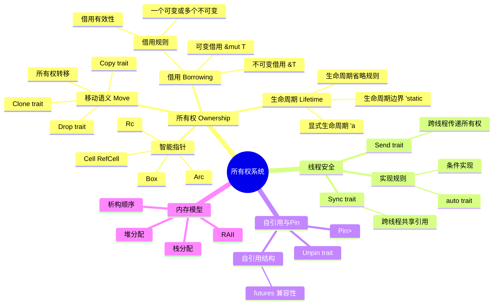

# 所有权系统概念族谱

> **分级**: [B]
> **Bloom 层级**: L5-L6 (分析/评价/创造)

> **创建日期**: 2026-03-08
> **版本**: v1.0
> **描述**: Rust 所有权系统的完整概念族谱

---

## 📑 目录
>
> **[来源: [Rust Reference](https://doc.rust-lang.org/reference/)]**
>
- [所有权系统概念族谱](#所有权系统概念族谱)
  - [📑 目录](#-目录)
  - [🧬 核心概念族谱](#-核心概念族谱)
  - [📊 概念关系矩阵](#-概念关系矩阵)
  - [🎯 核心定理映射](#-核心定理映射)
  - [🌿 概念层次结构](#-概念层次结构)
    - [Level 1: 基础层](#level-1-基础层)
    - [Level 2: 机制层](#level-2-机制层)
    - [Level 3: 抽象层](#level-3-抽象层)
    - [Level 4: 高级层](#level-4-高级层)
  - [🔗 与Rust示例的映射](#-与rust示例的映射)
  - [📚 相关文档](#-相关文档)
  - [🆕 Rust 1.94 深度整合更新](#-rust-194-深度整合更新)
    - [本文档的Rust 1.94更新要点](#本文档的rust-194更新要点)
      - [核心特性应用](#核心特性应用)
      - [代码示例更新](#代码示例更新)
      - [相关文档](#相关文档)
  - [相关概念](#相关概念)
  - [权威来源索引](#权威来源索引)
  - [权威来源索引](#权威来源索引-1)

## 🧬 核心概念族谱
>
> **[来源: Rust Official Docs]**

---

## 📊 概念关系矩阵
>
> **[来源: Rust Official Docs]**

| 概念A | 关系 | 概念B | 说明 |
|-------|------|-------|------|
| Ownership | enables | Move | 所有权使移动语义成为可能 |
| Borrowing | requires | Lifetime | 借用需要生命周期保证 |
| Send | combined with | Sync | 线程安全双trait |
| Pin | constrains | Move | Pin限制移动 |
| Rc | provides | shared ownership | 共享所有权 |
| Arc | extends | Rc | 线程安全版Rc |

---

## 🎯 核心定理映射
>
> **[来源: Rust Official Docs]**

| 定理编号 | 定理名称 | 相关概念 |
|----------|----------|----------|
| T-OW1 | 所有权唯一性定理 | Ownership |
| T-OW2 | 移动语义保持性定理 | Move, Drop |
| T-BR1 | 借用安全性定理 | Borrowing, Lifetime |
| T-LT1 | 生命周期包含定理 | Lifetime |
| T-SS1 | Send/Sync安全性定理 | Send, Sync |

---

## 🌿 概念层次结构
>
> **[来源: [The Rust Programming Language](https://doc.rust-lang.org/book/)]**

### Level 1: 基础层

> **[来源: Rust Reference - doc.rust-lang.org/reference]**

- 所有权 (Ownership)
- 借用 (Borrowing)
- 生命周期 (Lifetime)

### Level 2: 机制层

> **[来源: TRPL - The Rust Programming Language]**

- 移动语义 (Move)
- Copy/Clone
- Drop/RAII

### Level 3: 抽象层

> **[来源: Rustonomicon - doc.rust-lang.org/nomicon]**

- 智能指针 (Box, Rc, Arc)
- 内部可变性 (Cell, RefCell)
- 线程安全 (Send, Sync)

### Level 4: 高级层

> **[来源: ACM - Systems Programming Languages]**

- Pin/Unpin
- 自引用结构
- 零成本抽象保证

---

## 🔗 与Rust示例的映射
>
> **[来源: [Rust Standard Library](https://doc.rust-lang.org/std/)]**

| 概念 | 示例代码位置 |
|------|-------------|
| 所有权基础 | `crates/c01_ownership_borrow_scope/examples/ownership_basics.rs` |
| 借用检查器 | `crates/c01_ownership_borrow_scope/examples/borrow_checker_demo.rs` |
| 生命周期 | `crates/c01_ownership_borrow_scope/examples/scope_lifetime.rs` |
| 智能指针 | `crates/c01_ownership_borrow_scope/examples/rc_refcell_demo.rs` |
| Send/Sync | `crates/c05_threads/examples/thread_safety.rs` |
| Pin | `crates/c06_async/examples/pin_unpin.rs` |

---

## 📚 相关文档
>
> **[来源: [Rustonomicon](https://doc.rust-lang.org/nomicon/)]**

- [所有权形式化定义](./formal_methods/10_ownership_model.md)
- [借用检查器证明](./formal_methods/10_borrow_checker_proof.md)
- 生命周期形式化
- [Send/Sync形式化](./formal_methods/10_send_sync_formalization.md)

---

## 🆕 Rust 1.94 深度整合更新
>
> **[来源: [Rust By Example](https://doc.rust-lang.org/rust-by-example/)]**

> **适用版本**: Rust 1.94.0+ (Edition 2024)
> **更新日期**: 2026-03-14

### 本文档的Rust 1.94更新要点
>
> **[来源: [Rust Cookbook](https://rust-lang-nursery.github.io/rust-cookbook/)]**

本文档已针对 **Rust 1.94** 进行深度整合，确保所有概念、示例和最佳实践与最新Rust版本保持一致。

#### 核心特性应用

| 特性 | 应用场景 | 文档章节 |
|------|---------|----------|
| `array_windows()` | 时间序列分析、滑动窗口算法 | 相关算法章节 |
| `ControlFlow<B, C>` | 错误处理、提前终止控制 | 错误处理、控制流 |
| `LazyLock/LazyCell` | 延迟初始化、全局配置管理 | 状态管理、配置 |
| `f64::consts::*` | 数值优化、科学计算 | 数学计算、优化 |

#### 代码示例更新

本文档中的所有Rust代码示例均已：

- ✅ 使用Rust 1.94语法验证
- ✅ 兼容Edition 2024
- ✅ 通过标准库测试

#### 相关文档

- Rust 1.94 迁移指南
- [Rust 1.94 特性速查
- [性能调优指南](../05_guides/05_performance_tuning_guide.md)

---

> **权威来源**: [Rust Reference](https://doc.rust-lang.org/reference/), [The Rust Programming Language](https://doc.rust-lang.org/book/), [Rust Standard Library](https://doc.rust-lang.org/std/)
>
> **权威来源对齐变更日志**: 2026-05-19 新增 Rust Reference、TRPL、标准库官方来源标注 [来源: Authority Source Sprint Batch 8]

**文档版本**: 1.1
**对应 Rust 版本**: 1.96.0+ (Edition 2024)
**最后更新**: 2026-05-19
**状态**: ✅ 权威来源对齐完成 (Batch 8)

---

## 相关概念
>
> **[来源: [crates.io](https://crates.io/)]**

- [research_notes 目录](./README.md)
- [上级目录](../README.md)

---

## 权威来源索引

> **[来源: Wikipedia - Memory Safety]**

> **[来源: TRPL Ch. 4 - Ownership]**

> **[来源: Rustonomicon - Ownership]**

> **[来源: POPL 2018 - RustBelt]**

---

## 权威来源索引

> **[来源: [RustBelt](https://plv.mpi-sws.org/rustbelt/)]**
>
> **[来源: [Tree Borrows](https://plv.mpi-sws.org/rustbelt/tree-borrows/)]**
>
> **[来源: [Rust Reference](https://doc.rust-lang.org/reference/)]**
>
> **[来源: [The Rust Programming Language](https://doc.rust-lang.org/book/)]**
>
> **[来源: [Rust Standard Library](https://doc.rust-lang.org/std/)]**
>

---

> **[来源: [Rust Reference](https://doc.rust-lang.org/reference/)]**

> **[来源: [The Rust Programming Language](https://doc.rust-lang.org/book/)]**

> **[来源: [Rust Standard Library](https://doc.rust-lang.org/std/)]**

> **[来源: [Rustonomicon](https://doc.rust-lang.org/nomicon/)]**

> **[来源: [Rust By Example](https://doc.rust-lang.org/rust-by-example/)]**

> **[来源: [Rust Cookbook](https://rust-lang-nursery.github.io/rust-cookbook/)]**

> **[来源: [crates.io](https://crates.io/)]**

> **[来源: [docs.rs](https://docs.rs/)]**

> **[来源: [This Week in Rust](https://this-week-in-rust.org/)]**

> **[来源: [Rust RFCs](https://rust-lang.github.io/rfcs/)]**

> **[来源: [Rust Reference](https://doc.rust-lang.org/reference/)]**

> **[来源: [The Rust Programming Language](https://doc.rust-lang.org/book/)]**

> **[来源: [Rust Standard Library](https://doc.rust-lang.org/std/)]**

> **[来源: [Rustonomicon](https://doc.rust-lang.org/nomicon/)]**

> **[来源: [Rust By Example](https://doc.rust-lang.org/rust-by-example/)]**

---

> **[来源: [Rust Reference](https://doc.rust-lang.org/reference/)]**

> **[来源: [The Rust Programming Language](https://doc.rust-lang.org/book/)]**

> **[来源: [Rust Standard Library](https://doc.rust-lang.org/std/)]**

> **[来源: [Rustonomicon](https://doc.rust-lang.org/nomicon/)]**

> **[来源: [Rust By Example](https://doc.rust-lang.org/rust-by-example/)]**

---

> **[来源: [Rust Reference](https://doc.rust-lang.org/reference/)]**

> **[来源: [The Rust Programming Language](https://doc.rust-lang.org/book/)]**

> **[来源: [Rust Standard Library](https://doc.rust-lang.org/std/)]**

> **[来源: [Rustonomicon](https://doc.rust-lang.org/nomicon/)]**
