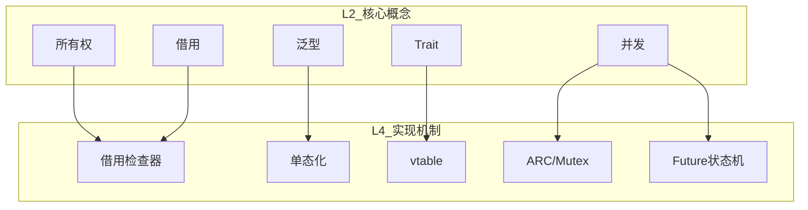
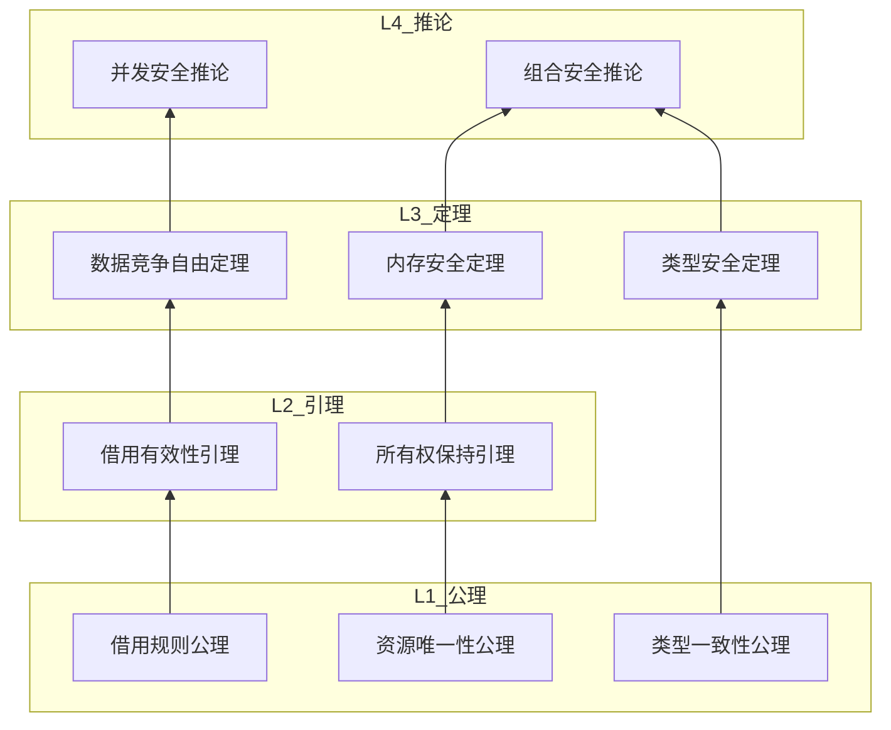

# Rust 概念层次体系框架

> **创建日期**: 2026-02-20
> **最后更新**: 2026-02-28
> **Rust 版本**: 1.93.1+ (Edition 2024)
> **状态**: 🔄 构建中
> **用途**: 建立 Rust 概念的五层体系，支撑层次化检索和双向追溯

---

## 📊 目录 {#-目录}

- [Rust 概念层次体系框架](#rust-概念层次体系框架)
  - [📊 目录 {#-目录}](#-目录--目录)
  - [🎯 概述 {#-概述}](#-概述--概述)
  - [五层概念体系](#五层概念体系)
    - [L1: 元概念层](#l1-元概念层)
    - [L2: 核心概念族](#l2-核心概念族)
      - [L2.1: 所有权概念族](#l21-所有权概念族)
      - [L2.2: 类型概念族](#l22-类型概念族)
      - [L2.3: 并发概念族](#l23-并发概念族)
    - [L3: 具体概念](#l3-具体概念)
      - [L3.1: 所有权具体概念](#l31-所有权具体概念)
      - [L3.2: 借用具体概念](#l32-借用具体概念)
      - [L3.3: 生命周期具体概念](#l33-生命周期具体概念)
    - [L4: 实现机制](#l4-实现机制)
    - [L5: 代码实践](#l5-代码实践)
      - [L5.1: 基础代码模式](#l51-基础代码模式)
      - [L5.2: 高级代码模式](#l52-高级代码模式)
      - [L5.3: 代码-概念追溯](#l53-代码-概念追溯)
  - [层间关系映射](#层间关系映射)
    - [自顶向下映射](#自顶向下映射)
    - [自底向上映射](#自底向上映射)
  - [概念与文档映射](#概念与文档映射)
    - [按层次组织的文档树](#按层次组织的文档树)
    - [文档层次完整性检查表](#文档层次完整性检查表)
  - [概念与定理映射](#概念与定理映射)
    - [概念-定理对应表](#概念-定理对应表)
    - [定理层次 DAG](#定理层次-dag)
  - [📚 相关文档 {#-相关文档}](#-相关文档--相关文档)

---

## 🎯 概述 {#-概述}

本文档建立 Rust 语言的**五层概念体系**，实现：

1. **层次清晰** - 每个概念都有明确的层级定位
2. **双向追溯** - 可以从元概念推导到代码，也可以从代码追溯到原理
3. **映射完整** - 概念↔文档↔定理↔代码的完整映射
4. **学习路径** - 支持从入门到精通的层次化学习

---

## 五层概念体系

### L1: 元概念层

**定义**: 最高层抽象，跨语言/跨领域的通用计算概念

| 元概念 | 定义 | Rust 体现 | 相关文档 |
| :--- | :--- | :--- | :--- |
| **资源管理** | 计算机资源的获取和释放 | 所有权系统 | ownership_model.md |
| **类型安全** | 编译时类型正确性保证 | 类型系统 | type_system_foundations.md |
| **并发安全** | 多线程/异步执行安全 | Send/Sync | send_sync_formalization.md |
| **内存安全** | 无悬垂指针、无数据竞争 | 借用检查器 | borrow_checker_proof.md |
| **抽象能力** | 代码复用和接口定义 | Trait/泛型 | trait_system_formalization.md |

**形式化**:

- 资源管理: $R: \text{Resource} \rightarrow \text{Lifetime} \rightarrow \text{Status}$
- 类型安全: $\Gamma \vdash e : \tau$ (类型判断)
- 并发安全: $T: \text{Send} \land T: \text{Sync}$

---

### L2: 核心概念族

**定义**: 由元概念派生，Rust 特有的核心概念集合

#### L2.1: 所有权概念族

| 概念 | 定义 | 层间关系 | 主文档 |
| :--- | :--- | :--- | :--- |
| **所有权** | 资源唯一控制者 | L1资源管理 → L2所有权 | ownership_model.md |
| **移动语义** | 所有权转移机制 | L2所有权 → L3移动 | ownership_model.md |
| **Copy/Clone** | 值复制语义 | L2所有权 → L3复制 | ownership_model.md |
| **Drop** | 资源释放机制 | L2所有权 → L3析构 | ownership_model.md |

**概念族关系**:

```text
资源管理(L1)
    │
    ├──→ 所有权(L2.1)
    │       ├──→ 移动语义
    │       ├──→ Copy/Clone
    │       └──→ Drop
    │
    ├──→ 借用(L2.2)
    │       ├──→ 共享借用
    │       └──→ 可变借用
    │
    └──→ 生命周期(L2.3)
            ├──→ 生命周期标注
            └──→ 生命周期省略
```

#### L2.2: 类型概念族

| 概念 | 定义 | 层间关系 | 主文档 |
| :--- | :--- | :--- | :--- |
| **类型系统** | 类型判断和推导 | L1类型安全 → L2类型 | type_system_foundations.md |
| **泛型** | 参数化多态 | L2类型 → L3泛型 | type_system_foundations.md |
| **Trait** | 行为抽象接口 | L2类型 → L3Trait | trait_system_formalization.md |
| **型变** | 子类型关系 | L2类型 → L3型变 | variance_theory.md |

#### L2.3: 并发概念族

| 概念 | 定义 | 层间关系 | 主文档 |
| :--- | :--- | :--- | :--- |
| **线程并发** | OS线程并行执行 | L1并发安全 → L2线程 | threads_concurrency_usage_guide.md |
| **异步编程** | 协作式多任务 | L1并发安全 → L2异步 | async_state_machine.md |
| **同步原语** | 线程间同步机制 | L2并发 → L3同步 | send_sync_formalization.md |

---

### L3: 具体概念

**定义**: 可直接教学和应用的具体 Rust 概念

#### L3.1: 所有权具体概念

| 概念 | 定义 | 层间关系 | 示例 |
| :--- | :--- | :--- | :--- |
| **变量绑定** | `let` 绑定值到变量名 | L2所有权 → L3绑定 | `let s = String::from("x");` |
| **所有权转移** | 值移动到新的所有者 | L2移动 → L3转移 | `let s2 = s;` |
| **作用域** | 变量的有效范围 | L2所有权 → L3作用域 | `{ let s = ...; }` |
| **遮蔽(shadowing)** | 同名变量覆盖 | L2所有权 → L3遮蔽 | `let x = 5; let x = x + 1;` |

#### L3.2: 借用具体概念

| 概念 | 定义 | 层间关系 | 示例 |
| :--- | :--- | :--- | :--- |
| **共享借用** | `&T` 只读引用 | L2借用 → L3共享 | `let r = &s;` |
| **可变借用** | `&mut T` 独占引用 | L2借用 → L3可变 | `let r = &mut s;` |
| **解引用** | `*` 操作符解引用 | L2借用 → L3解引用 | `*r = String::from("y");` |
| **重新借用** | 从借用创建新借用 | L2借用 → L3重新借用 | `let r2 = &*r;` |

#### L3.3: 生命周期具体概念

| 概念 | 定义 | 层间关系 | 示例 |
| :--- | :--- | :--- | :--- |
| **生命周期标注** | 显式标注引用有效性 | L2生命周期 → L3标注 | `fn foo<'a>(x: &'a str)` |
| **生命周期省略** | 编译器推断生命周期 | L2生命周期 → L3省略 | `fn foo(x: &str)` |
| **生命周期边界** | `'a: 'b` 约束 | L2生命周期 → L3边界 | `fn foo<'a, 'b>(x: &'a str, y: &'b str) where 'a: 'b` |

---

### L4: 实现机制

**定义**: Rust 编译器和运行时的具体实现机制

| 机制 | 定义 | 层间关系 | 实现细节 |
| :--- | :--- | :--- | :--- |
| **借用检查器** | 编译时借用规则检查 | L2借用 → L4检查器 | MIR borrowck |
| **单态化** | 泛型编译时特化 | L2泛型 → L4单态化 | 为每个类型生成代码 |
| **vtable** | Trait对象动态分发 | L2Trait → L4vtable | 指向方法表的指针 |
| **ARC/Mutex** | 运行时引用计数/锁 | L2并发 → L4运行时 | Atomic Rc / Mutex 实现 |
| **Future状态机** | 异步代码状态转换 | L2异步 → L4状态机 | Poll/await 状态转换 |
| **Drop检查** | 资源释放顺序检查 | L2Drop → L4检查 | 按构建逆序释放 |

**实现机制关系图**:



---

### L5: 代码实践

**定义**: 实际编写和运行的 Rust 代码

#### L5.1: 基础代码模式

| 模式 | 概念来源 | 代码示例 | 适用场景 |
| :--- | :--- | :--- | :--- |
| **RAII** | L3作用域 + L4Drop检查 | `let file = File::open("x.txt")?;` | 资源管理 |
| **借用模式** | L3共享/可变借用 | `fn process(data: &[u8])` | 数据传递 |
| **Builder** | L3方法调用 | `Config::new().port(8080).build()` | 复杂对象构建 |
| **迭代器** | L3迭代 + L4单态化 | `vec.iter().map(...).collect()` | 数据处理 |

#### L5.2: 高级代码模式

| 模式 | 概念来源 | 代码示例 | 适用场景 |
| :--- | :--- | :--- | :--- |
| **类型状态** | L3泛型 + L2类型 | `Builder<Configured>` | 编译时状态检查 |
| **内部可变性** | L2借用 + L4运行时 | `RefCell::borrow_mut()` | 运行时借用检查 |
| **Pin + Unpin** | L2异步 + L4状态机 | `Pin<Box<dyn Future>>` | 自引用结构 |
| **Actor模型** | L2并发 + L4消息队列 | `actor.send(Message).await` | 消息驱动并发 |

#### L5.3: 代码-概念追溯

每个代码片段都可以追溯到概念层次：

```rust
// L5: 代码实践
let s = String::from("hello");  // L4: 堆分配
let r = &s;                      // L3: 共享借用
println!("{}", r);               // L2: 借用规则
                                 // L1: 资源管理
```

---

## 层间关系映射

### 自顶向下映射

```text
问题/需求 (应用层)
    │
    ▼
L1 元概念 → 确定解决思路
    │
    ▼
L2 核心概念族 → 选择概念族
    │
    ▼
L3 具体概念 → 选择具体概念
    │
    ▼
L4 实现机制 → 理解实现原理
    │
    ▼
L5 代码实践 → 编写代码
```

### 自底向上映射

```text
代码问题/现象
    │
    ▼
L5 代码实践 → 定位代码模式
    │
    ▼
L4 实现机制 → 理解实现行为
    │
    ▼
L3 具体概念 → 明确概念定义
    │
    ▼
L2 核心概念族 → 归类概念
    │
    ▼
L1 元概念 → 理解本质原理
```

---

## 概念与文档映射

### 按层次组织的文档树

```text
L1 元概念
├── [未直接对应文档]
└── 通过 L2 文档体现

L2 核心概念族
├── formal_methods/ownership_model.md
├── formal_methods/borrow_checker_proof.md
├── formal_methods/lifetime_formalization.md
├── type_theory/type_system_foundations.md
├── type_theory/trait_system_formalization.md
└── formal_methods/send_sync_formalization.md

L3 具体概念
├── 02_reference/quick_reference/ownership_cheatsheet.md
├── 02_reference/quick_reference/type_system.md
├── 05_guides/ASYNC_PROGRAMMING_USAGE_GUIDE.md
└── [各速查卡]

L4 实现机制
├── 06_toolchain/01_compiler_features.md
├── research_notes/formal_methods/async_state_machine.md
└── [编译器/运行时文档]

L5 代码实践
├── 02_reference/quick_reference/*.md
├── 05_guides/*.md
├── examples/
└── [代码示例]
```

### 文档层次完整性检查表

| 概念 | L2 文档 | L3 文档 | L4 文档 | L5 文档 | 完整 |
| :--- | :--- | :--- | :--- | :--- | :--- |
| 所有权 | ✅ | ✅ | ✅ | ✅ | ✅ |
| 借用 | ✅ | ✅ | ✅ | ✅ | ✅ |
| 生命周期 | ✅ | ✅ | ✅ | ✅ | ✅ |
| 泛型 | ✅ | ✅ | ✅ | ✅ | ✅ |
| Trait | ✅ | ✅ | ⚠️ | ✅ | ⚠️ |
| 异步 | ✅ | ✅ | ✅ | ✅ | ✅ |
| 并发 | ✅ | ✅ | ⚠️ | ✅ | ⚠️ |

---

## 概念与定理映射

### 概念-定理对应表

| 概念 (L3) | 相关定理 | 定理文档 | 证明状态 |
| :--- | :--- | :--- | :--- |
| 所有权唯一性 | T2 | ownership_model.md | ✅ 完整 |
| 内存安全 | T3 | ownership_model.md | ✅ 完整 |
| 数据竞争自由 | T1 | borrow_checker_proof.md | ✅ 完整 |
| 类型安全 | T3 | type_system_foundations.md | ✅ 完整 |
| 生命周期有效性 | LF-T1~T3 | lifetime_formalization.md | ✅ 完整 |
| 异步安全性 | T6.1~T6.3 | async_state_machine.md | ⚠️ 思路 |
| Send/Sync 安全 | SEND-T1, SYNC-T1 | send_sync_formalization.md | ✅ 完整 |

### 定理层次 DAG



---

## 📚 相关文档 {#-相关文档}

| 文档 | 用途 | 层次 |
| :--- | :--- | :--- |
| [ARGUMENTATION_CHAIN_AND_FLOW](ARGUMENTATION_CHAIN_AND_FLOW.md) | 论证脉络关系 | L2-L3 |
| [HIERARCHICAL_MAPPING_AND_SUMMARY](HIERARCHICAL_MAPPING_AND_SUMMARY.md) | 层次化映射 | L2-L4 |
| [FORMAL_FULL_MODEL_OVERVIEW](FORMAL_FULL_MODEL_OVERVIEW.md) | 统一形式系统 | L1-L2 |
| [PROOF_INDEX](PROOF_INDEX.md) | 定理索引 | L3-L4 |

---

**维护者**: Rust Formal Methods Research Team
**最后更新**: 2026-02-20
**状态**: 🔄 构建中
