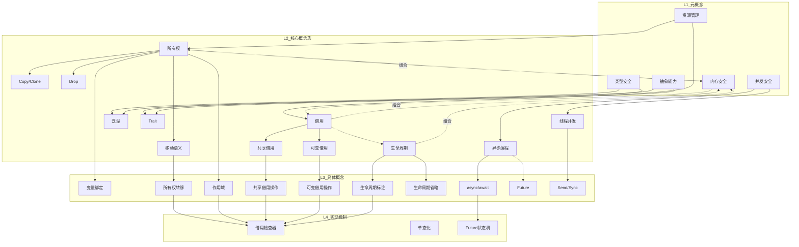

# Rust 概念关联网络

> **创建日期**: 2026-02-20
> **最后更新**: 2026-02-20
> **Rust 版本**: 1.93.0+ (Edition 2024)
> **状态**: 🔄 构建中
> **用途**: 建立 Rust 概念间的关联网络，支持多维导航和关系推理

---

## 📊 目录

- [Rust 概念关联网络](#rust-概念关联网络)
  - [📊 目录](#-目录)
  - [🎯 概述](#-概述)
  - [概念节点定义](#概念节点定义)
    - [L1: 元概念节点](#l1-元概念节点)
    - [L2: 核心概念族节点](#l2-核心概念族节点)
    - [L3: 具体概念节点](#l3-具体概念节点)
    - [L4: 实现机制节点](#l4-实现机制节点)
  - [关系类型定义](#关系类型定义)
    - [等价关系 ≡](#等价关系-)
    - [蕴含关系 ⇒](#蕴含关系-)
    - [互斥关系 ⊥](#互斥关系-)
    - [组合关系 ∘](#组合关系-)
    - [层次关系 ⊂](#层次关系-)
  - [关联矩阵](#关联矩阵)
    - [L1-L2 关联矩阵](#l1-l2-关联矩阵)
    - [L2-L3 关联矩阵](#l2-l3-关联矩阵)
    - [L3-L4 关联矩阵](#l3-l4-关联矩阵)
  - [知识图谱](#知识图谱)
    - [全局概念图谱](#全局概念图谱)
    - [所有权概念子图](#所有权概念子图)
    - [类型系统概念子图](#类型系统概念子图)
    - [并发概念子图](#并发概念子图)
  - [导航索引](#导航索引)
    - [概念到文档映射](#概念到文档映射)
      - [L1 元概念 → 文档](#l1-元概念--文档)
      - [L2 核心概念 → 文档](#l2-核心概念--文档)
      - [L3 具体概念 → 文档](#l3-具体概念--文档)
    - [概念间导航路径](#概念间导航路径)
      - [路径1: 从代码问题到形式化理论](#路径1-从代码问题到形式化理论)
      - [路径2: 从并发需求到实现机制](#路径2-从并发需求到实现机制)
      - [路径3: 从泛型到类型安全](#路径3-从泛型到类型安全)
      - [路径4: 互斥关系处理路径](#路径4-互斥关系处理路径)
  - [📊 关系统计](#-关系统计)
  - [📚 相关文档](#-相关文档)

---

## 🎯 概述

本文档建立 Rust 语言概念的**关联网络**，实现：

1. **关系可视化** - 概念间的等价、蕴含、互斥、组合、层次关系
2. **多维导航** - 支持从不同维度在概念间跳转
3. **推理支持** - 基于关系网络进行概念推导
4. **学习路径** - 发现概念间的隐藏关联

---

## 概念节点定义

### L1: 元概念节点

| 节点ID | 概念名称 | 定义 | 属性 |
| :--- | :--- | :--- | :--- |
| M1 | 资源管理 | 计算机资源的获取和释放 | {抽象度: 高, 跨语言: 是} |
| M2 | 类型安全 | 编译时类型正确性保证 | {抽象度: 高, 跨语言: 是} |
| M3 | 并发安全 | 多线程/异步执行安全 | {抽象度: 高, 跨语言: 是} |
| M4 | 内存安全 | 无悬垂指针、无数据竞争 | {抽象度: 高, 跨语言: 部分} |
| M5 | 抽象能力 | 代码复用和接口定义 | {抽象度: 高, 跨语言: 是} |

### L2: 核心概念族节点

| 节点ID | 概念名称 | 所属概念族 | 定义 | 属性 |
| :--- | :--- | :--- | :--- | :--- |
| C1 | 所有权 | 所有权族 | 资源唯一控制者 | {核心: 是, 独特: 是} |
| C2 | 移动语义 | 所有权族 | 所有权转移机制 | {核心: 是, 独特: 是} |
| C3 | Copy/Clone | 所有权族 | 值复制语义 | {核心: 是, 独特: 否} |
| C4 | Drop | 所有权族 | 资源释放机制 | {核心: 是, 独特: 否} |
| C5 | 借用 | 借用族 | 临时访问资源 | {核心: 是, 独特: 是} |
| C6 | 共享借用 | 借用族 | 只读引用 &T | {核心: 是, 独特: 是} |
| C7 | 可变借用 | 借用族 | 独占引用 &mut T | {核心: 是, 独特: 是} |
| C8 | 生命周期 | 生命周期族 | 引用的有效范围 | {核心: 是, 独特: 是} |
| C9 | 泛型 | 类型族 | 参数化多态 | {核心: 是, 独特: 否} |
| C10 | Trait | 类型族 | 行为抽象接口 | {核心: 是, 独特: 部分} |
| C11 | 型变 | 类型族 | 子类型关系 | {核心: 中, 独特: 否} |
| C12 | 线程并发 | 并发族 | OS线程并行执行 | {核心: 是, 独特: 否} |
| C13 | 异步编程 | 并发族 | 协作式多任务 | {核心: 是, 独特: 部分} |
| C14 | 同步原语 | 并发族 | 线程间同步机制 | {核心: 是, 独特: 否} |

### L3: 具体概念节点

| 节点ID | 概念名称 | 父概念 | 定义 | 属性 |
| :--- | :--- | :--- | :--- | :--- |
| S1 | 变量绑定 | C1 | `let` 绑定值到变量名 | {具体度: 高} |
| S2 | 所有权转移 | C2 | 值移动到新的所有者 | {具体度: 高} |
| S3 | 作用域 | C1 | 变量的有效范围 | {具体度: 高} |
| S4 | 遮蔽(shadowing) | C1 | 同名变量覆盖 | {具体度: 高} |
| S5 | 共享借用操作 | C6 | `&T` 实际使用 | {具体度: 高} |
| S6 | 可变借用操作 | C7 | `&mut T` 实际使用 | {具体度: 高} |
| S7 | 解引用 | C5 | `*` 操作符使用 | {具体度: 高} |
| S8 | 重新借用 | C5 | 从借用创建新借用 | {具体度: 中} |
| S9 | 生命周期标注 | C8 | 显式标注 `'a` | {具体度: 高} |
| S10 | 生命周期省略 | C8 | 编译器推断规则 | {具体度: 高} |
| S11 | 生命周期边界 | C8 | `'a: 'b` 约束 | {具体度: 中} |
| S12 | Trait 实现 | C10 | `impl Trait for Type` | {具体度: 高} |
| S13 | Trait 对象 | C10 | `dyn Trait` 动态分发 | {具体度: 高} |
| S14 | 关联类型 | C10 | Trait 内类型定义 | {具体度: 中} |
| S15 | async/await | C13 | 异步语法糖 | {具体度: 高} |
| S16 | Future | C13 | 异步计算抽象 | {具体度: 高} |
| S17 | Pin/Unpin | C13 | 固定内存位置 | {具体度: 中} |
| S18 | Send/Sync | C12 | 线程安全标记 | {具体度: 高} |

### L4: 实现机制节点

| 节点ID | 机制名称 | 对应概念 | 实现细节 | 属性 |
| :--- | :--- | :--- | :--- | :--- |
| I1 | 借用检查器 | C5, C6, C7 | MIR borrowck 分析 | {编译期: 是} |
| I2 | 单态化 | C9 | 泛型编译时特化 | {编译期: 是} |
| I3 | vtable | C10 | Trait对象方法表 | {运行期: 是} |
| I4 | ARC | C1, C12 | 原子引用计数 | {运行期: 是} |
| I5 | Mutex | C14 | 互斥锁实现 | {运行期: 是} |
| I6 | Future状态机 | C13, S15 | async状态转换 | {运行期: 是} |
| I7 | Drop检查 | C4 | 资源释放顺序 | {编译期: 是} |
| I8 | 生命周期推断 | C8, S10 | 省略规则算法 | {编译期: 是} |
| I9 | 类型推导 | C9 | Hindley-Milner扩展 | {编译期: 是} |

---

## 关系类型定义

### 等价关系 ≡

**定义**: 两个概念在语义上等价，可以互换使用。

| 关系 | 概念A | 概念B | 说明 |
| :--- | :--- | :--- | :--- |
| ≡1 | S16 (Future) | C13 (异步编程) | Future 是异步的核心抽象 |
| ≡2 | C6 (共享借用) | `&T` 只读引用 | 语法与概念等价 |
| ≡3 | C7 (可变借用) | `&mut T` 可变引用 | 语法与概念等价 |
| ≡4 | M4 (内存安全) | C1+C5 (所有权+借用) | Rust 中内存安全的实现方式 |

**形式化**: A ≡ B ⟺ ∀x: x ∈ A ⟺ x ∈ B

### 蕴含关系 ⇒

**定义**: 概念A的存在或成立必然导致概念B的存在或成立。

| 关系 | 前提(A) | 结论(B) | 蕴含说明 |
| :--- | :--- | :--- | :--- |
| ⇒1 | C1 (所有权) | C2 (移动语义) | 所有权 ⇒ 移动语义 |
| ⇒2 | C1 (所有权) | C4 (Drop) | 所有权 ⇒ 资源释放机制 |
| ⇒3 | C5 (借用) | C8 (生命周期) | 借用 ⇒ 需要生命周期 |
| ⇒4 | C6 (共享借用) | ¬C7 (可变借用) | 共享借用 ⇒ 无可变借用 |
| ⇒5 | C7 (可变借用) | ¬C6 (共享借用) | 可变借用 ⇒ 无共享借用 |
| ⇒6 | S15 (async/await) | S16 (Future) | async/await ⇒ Future |
| ⇒7 | C9 (泛型) | I2 (单态化) | 泛型 ⇒ 编译期单态化 |
| ⇒8 | C10 (Trait) | S12 (Trait实现) | Trait定义 ⇒ 可实现 |
| ⇒9 | M3 (并发安全) | S18 (Send/Sync) | Rust中并发安全 ⇒ Send/Sync |
| ⇒10 | S18 (Send) | C12 (线程并发) | Send类型可跨线程 |

**形式化**: A ⇒ B ⟺ A → B (逻辑蕴含)

### 互斥关系 ⊥

**定义**: 两个概念在同一上下文中不能同时成立。

| 关系 | 概念A | 概念B | 互斥条件 | 解决方式 |
| :--- | :--- | :--- | :--- | :--- |
| ⊥1 | C6 (共享借用) | C7 (可变借用) | 同一数据，同一作用域 | 重构代码顺序 |
| ⊥2 | 多个C7 | 多个C7 | 同一数据，同一作用域 | 使用嵌套作用域 |
| ⊥3 | C2 (移动语义) | C3 (Copy) | 类型定义层面 | 只能实现其一 |
| ⊥4 | S17 (Pin) | S3 (作用域移动) | 自引用结构移动 | 使用 Pin::new_unchecked |
| ⊥5 | I4 (ARC) | C7 (可变借用) | ARC只提供共享访问 | 使用 Mutex/RwLock |
| ⊥6 | S10 (生命周期省略) | S9 (显式标注) | 同一函数参数 | 选择其一 |

**形式化**: A ⊥ B ⟺ ¬(A ∧ B) (逻辑互斥)

### 组合关系 ∘

**定义**: 概念A和概念B组合形成概念C。

| 关系 | A ∘ B | 结果C | 组合说明 |
| :--- | :--- | :--- | :--- |
| ∘1 | C1 ∘ C5 | M4 | 所有权 + 借用 = 内存安全 |
| ∘2 | C6 ∘ I5 | 内部可变性 | 共享借用 + 锁 = 内部可变性 |
| ∘3 | C9 ∘ C10 | 泛型Trait约束 | 泛型 + Trait = 约束泛型 |
| ∘4 | C13 ∘ S17 | 安全异步 | 异步 + Pin = 安全自引用 |
| ∘5 | I4 ∘ I5 | 线程安全共享 | ARC + Mutex = 线程安全共享可变 |
| ∘6 | C8 ∘ C9 | 泛型生命周期 | 生命周期 + 泛型 = 泛型生命周期参数 |
| ∘7 | S12 ∘ I2 | 静态分发 | Trait实现 + 单态化 = 零成本抽象 |
| ∘8 | S13 ∘ I3 | 动态分发 | Trait对象 + vtable = 运行时多态 |
| ∘9 | M1 ∘ M2 | 安全资源管理 | 资源管理 + 类型安全 = 编译期安全 |
| ∘10 | C3 ∘ C4 | RAII | 复制语义 + 析构 = 资源管理惯用法 |

**形式化**: A ∘ B = C ⟺ C = f(A, B) (组合函数)

### 层次关系 ⊂

**定义**: 概念A是概念B的子集或特例。

| 关系 | 子概念A | 父概念B | 层次说明 |
| :--- | :--- | :--- | :--- |
| ⊂1 | C1 | M1 | 所有权 ⊂ 资源管理 |
| ⊂2 | C5 | M1 | 借用 ⊂ 资源管理 |
| ⊂3 | C2 | C1 | 移动语义 ⊂ 所有权 |
| ⊂4 | C3 | C1 | Copy/Clone ⊂ 所有权 |
| ⊂5 | C6 | C5 | 共享借用 ⊂ 借用 |
| ⊂6 | C7 | C5 | 可变借用 ⊂ 借用 |
| ⊂7 | S1 | C1 | 变量绑定 ⊂ 所有权 |
| ⊂8 | S9 | C8 | 生命周期标注 ⊂ 生命周期 |
| ⊂9 | S10 | C8 | 生命周期省略 ⊂ 生命周期 |
| ⊂10 | S15 | C13 | async/await ⊂ 异步编程 |
| ⊂11 | I1 | M4 | 借用检查器 ⊂ 内存安全 |
| ⊂12 | I6 | C13 | Future状态机 ⊂ 异步编程 |

**形式化**: A ⊂ B ⟺ ∀x: x ∈ A → x ∈ B (子集关系)

---

## 关联矩阵

### L1-L2 关联矩阵

| L1 \ L2 | C1 | C2 | C3 | C4 | C5 | C6 | C7 | C8 | C9 | C10 | C11 | C12 | C13 | C14 |
| :---: | :---: | :---: | :---: | :---: | :---: | :---: | :---: | :---: | :---: | :---: | :---: | :---: | :---: | :---: |
| **M1 资源管理** | 1 | 1 | 1 | 1 | 1 | 0 | 0 | 0 | 0 | 0 | 0 | 0 | 0 | 0 |
| **M2 类型安全** | 0 | 0 | 0 | 0 | 0 | 0 | 0 | 0 | 1 | 1 | 1 | 0 | 0 | 0 |
| **M3 并发安全** | 0 | 0 | 0 | 0 | 0 | 0 | 0 | 0 | 0 | 0 | 0 | 1 | 1 | 1 |
| **M4 内存安全** | 1 | 1 | 0 | 0 | 1 | 0 | 0 | 1 | 0 | 0 | 0 | 0 | 0 | 0 |
| **M5 抽象能力** | 0 | 0 | 0 | 0 | 0 | 0 | 0 | 0 | 1 | 1 | 0 | 0 | 0 | 0 |

**矩阵说明**:

- 1 = 直接关联（层次包含或等价关系）
- 0 = 无直接关联

### L2-L3 关联矩阵

| L2 \ L3 | S1 | S2 | S3 | S4 | S5 | S6 | S7 | S8 | S9 | S10 | S11 | S12 | S13 | S14 | S15 | S16 | S17 | S18 |
| :---: | :---: | :---: | :---: | :---: | :---: | :---: | :---: | :---: | :---: | :---: | :---: | :---: | :---: | :---: | :---: | :---: | :---: | :---: |
| **C1 所有权** | 1 | 0 | 1 | 1 | 0 | 0 | 0 | 0 | 0 | 0 | 0 | 0 | 0 | 0 | 0 | 0 | 0 | 0 |
| **C2 移动语义** | 0 | 1 | 0 | 0 | 0 | 0 | 0 | 0 | 0 | 0 | 0 | 0 | 0 | 0 | 0 | 0 | 0 | 0 |
| **C3 Copy/Clone** | 0 | 0 | 0 | 0 | 0 | 0 | 0 | 0 | 0 | 0 | 0 | 0 | 0 | 0 | 0 | 0 | 0 | 0 |
| **C4 Drop** | 0 | 0 | 0 | 0 | 0 | 0 | 0 | 0 | 0 | 0 | 0 | 0 | 0 | 0 | 0 | 0 | 0 | 0 |
| **C5 借用** | 0 | 0 | 0 | 0 | 0 | 0 | 1 | 1 | 0 | 0 | 0 | 0 | 0 | 0 | 0 | 0 | 0 | 0 |
| **C6 共享借用** | 0 | 0 | 0 | 0 | 1 | 0 | 0 | 0 | 0 | 0 | 0 | 0 | 0 | 0 | 0 | 0 | 0 | 0 |
| **C7 可变借用** | 0 | 0 | 0 | 0 | 0 | 1 | 0 | 0 | 0 | 0 | 0 | 0 | 0 | 0 | 0 | 0 | 0 | 0 |
| **C8 生命周期** | 0 | 0 | 0 | 0 | 0 | 0 | 0 | 0 | 1 | 1 | 1 | 0 | 0 | 0 | 0 | 0 | 0 | 0 |
| **C9 泛型** | 0 | 0 | 0 | 0 | 0 | 0 | 0 | 0 | 0 | 0 | 0 | 0 | 0 | 0 | 0 | 0 | 0 | 0 |
| **C10 Trait** | 0 | 0 | 0 | 0 | 0 | 0 | 0 | 0 | 0 | 0 | 0 | 1 | 1 | 1 | 0 | 0 | 0 | 0 |
| **C11 型变** | 0 | 0 | 0 | 0 | 0 | 0 | 0 | 0 | 0 | 0 | 0 | 0 | 0 | 0 | 0 | 0 | 0 | 0 |
| **C12 线程并发** | 0 | 0 | 0 | 0 | 0 | 0 | 0 | 0 | 0 | 0 | 0 | 0 | 0 | 0 | 0 | 0 | 0 | 1 |
| **C13 异步编程** | 0 | 0 | 0 | 0 | 0 | 0 | 0 | 0 | 0 | 0 | 0 | 0 | 0 | 0 | 1 | 1 | 1 | 0 |
| **C14 同步原语** | 0 | 0 | 0 | 0 | 0 | 0 | 0 | 0 | 0 | 0 | 0 | 0 | 0 | 0 | 0 | 0 | 0 | 0 |

### L3-L4 关联矩阵

| L3 \ L4 | I1 | I2 | I3 | I4 | I5 | I6 | I7 | I8 | I9 |
| :---: | :---: | :---: | :---: | :---: | :---: | :---: | :---: | :---: | :---: |
| **S1 变量绑定** | 0 | 0 | 0 | 0 | 0 | 0 | 0 | 0 | 1 |
| **S2 所有权转移** | 1 | 0 | 0 | 0 | 0 | 0 | 0 | 0 | 0 |
| **S3 作用域** | 1 | 0 | 0 | 0 | 0 | 0 | 1 | 0 | 0 |
| **S4 遮蔽** | 0 | 0 | 0 | 0 | 0 | 0 | 0 | 0 | 1 |
| **S5 共享借用操作** | 1 | 0 | 0 | 0 | 0 | 0 | 0 | 0 | 0 |
| **S6 可变借用操作** | 1 | 0 | 0 | 0 | 0 | 0 | 0 | 0 | 0 |
| **S7 解引用** | 1 | 0 | 0 | 0 | 0 | 0 | 0 | 0 | 0 |
| **S8 重新借用** | 1 | 0 | 0 | 0 | 0 | 0 | 0 | 0 | 0 |
| **S9 生命周期标注** | 0 | 0 | 0 | 0 | 0 | 0 | 0 | 1 | 0 |
| **S10 生命周期省略** | 0 | 0 | 0 | 0 | 0 | 0 | 0 | 1 | 0 |
| **S11 生命周期边界** | 0 | 0 | 0 | 0 | 0 | 0 | 0 | 1 | 0 |
| **S12 Trait实现** | 0 | 1 | 1 | 0 | 0 | 0 | 0 | 0 | 0 |
| **S13 Trait对象** | 0 | 0 | 1 | 0 | 0 | 0 | 0 | 0 | 0 |
| **S14 关联类型** | 0 | 1 | 0 | 0 | 0 | 0 | 0 | 0 | 1 |
| **S15 async/await** | 0 | 0 | 0 | 0 | 0 | 1 | 0 | 0 | 0 |
| **S16 Future** | 0 | 0 | 0 | 0 | 0 | 1 | 0 | 0 | 0 |
| **S17 Pin/Unpin** | 0 | 0 | 0 | 0 | 0 | 1 | 0 | 0 | 0 |
| **S18 Send/Sync** | 1 | 0 | 0 | 1 | 1 | 0 | 0 | 0 | 0 |

---

## 知识图谱

### 全局概念图谱



### 所有权概念子图

```mermaid
graph TB
    M1[资源管理 L1] ==> C1[所有权 L2]
    C1 ==> C2[移动语义 L2]
    C1 ==> C3[Copy/Clone L2]
    C1 ==> C4[Drop L2]
    C1 ==> C5[借用 L2]

    C2 ==> S2[所有权转移 L3]
    C3 ==> S12[Copy实现 L3]
    C5 ==> C6[共享借用 L2]
    C5 ==> C7[可变借用 L2]

    C6 ==> S5[&T 操作 L3]
    C7 ==> S6[&mut T 操作 L3]

    S2 ==> I1[借用检查器 L4]
    S5 ==> I1
    S6 ==> I1

    C6 -.⊥.|互斥| C7
    C2 -.⊥.|互斥| C3

    style C6 fill:#e1f5fe
    style C7 fill:#ffebee
```

### 类型系统概念子图

```mermaid
graph LR
    M2[类型安全 L1] ==> C9[泛型 L2]
    M2 ==> C10[Trait L2]
    M5[抽象能力 L1] ==> C9
    M5 ==> C10

    C9 ==> S12[Trait约束 L3]
    C10 ==> S12
    C10 ==> S13[Trait对象 L3]
    C10 ==> S14[关联类型 L3]

    S12 ==> I2[单态化 L4]
    S13 ==> I3[vtable L4]

    C9 -.∘.|组合| C10

    style I2 fill:#e8f5e9
    style I3 fill:#fff3e0
```

### 并发概念子图

```mermaid
graph TB
    M3[并发安全 L1] ==> C12[线程并发 L2]
    M3 ==> C13[异步编程 L2]

    C12 ==> S18[Send/Sync L3]
    C13 ==> S15[async/await L3]
    C13 ==> S16[Future L3]
    C13 ==> S17[Pin/Unpin L3]

    S18 ==> I4[ARC L4]
    S15 ==> I6[Future状态机 L4]
    S17 ==> I6

    S18 ==> I5[Mutex L4]

    S15 -.≡.|等价| S16
    I4 -.∘.|组合| I5

    style S18 fill:#f3e5f5
    style S17 fill:#fff8e1
```

---

## 导航索引

### 概念到文档映射

#### L1 元概念 → 文档

| 概念 | 主要文档 | 类型 | 关联文档 |
| :--- | :--- | :--- | :--- |
| M1 资源管理 | [ownership_model.md](formal_methods/ownership_model.md) | 形式化 | borrow_checker_proof.md |
| M2 类型安全 | [type_system_foundations.md](type_theory/type_system_foundations.md) | 形式化 | trait_system_formalization.md |
| M3 并发安全 | [send_sync_formalization.md](formal_methods/send_sync_formalization.md) | 形式化 | async_state_machine.md |
| M4 内存安全 | [ownership_model.md](formal_methods/ownership_model.md) | 形式化 | borrow_checker_proof.md |
| M5 抽象能力 | [trait_system_formalization.md](type_theory/trait_system_formalization.md) | 形式化 | type_system_foundations.md |

#### L2 核心概念 → 文档

| 概念 | 主要文档 | 类型 | 关联文档 |
| :--- | :--- | :--- | :--- |
| C1 所有权 | [ownership_model.md](formal_methods/ownership_model.md) | 形式化 | CONCEPT_HIERARCHY_FRAMEWORK.md |
| C5 借用 | [borrow_checker_proof.md](formal_methods/borrow_checker_proof.md) | 形式化 | ownership_model.md |
| C8 生命周期 | [lifetime_formalization.md](formal_methods/lifetime_formalization.md) | 形式化 | borrow_checker_proof.md |
| C9 泛型 | [type_system_foundations.md](type_theory/type_system_foundations.md) | 形式化 | trait_system_formalization.md |
| C10 Trait | [trait_system_formalization.md](type_theory/trait_system_formalization.md) | 形式化 | type_system_foundations.md |
| C13 异步编程 | [async_state_machine.md](formal_methods/async_state_machine.md) | 形式化 | ASYNC_PROGRAMMING_USAGE_GUIDE.md |
| C12 并发 | [send_sync_formalization.md](formal_methods/send_sync_formalization.md) | 形式化 | threads_concurrency_usage_guide.md |

#### L3 具体概念 → 文档

| 概念 | 主要文档 | 类型 | 示例代码 |
| :--- | :--- | :--- | :--- |
| S1 变量绑定 | [ownership_cheatsheet.md](../02_reference/quick_reference/ownership_cheatsheet.md) | 速查卡 | examples/ |
| S2 所有权转移 | [ownership_cheatsheet.md](../02_reference/quick_reference/ownership_cheatsheet.md) | 速查卡 | examples/ |
| S3 作用域 | [ownership_cheatsheet.md](../02_reference/quick_reference/ownership_cheatsheet.md) | 速查卡 | examples/ |
| S5 共享借用 | [ownership_cheatsheet.md](../02_reference/quick_reference/ownership_cheatsheet.md) | 速查卡 | examples/ |
| S6 可变借用 | [ownership_cheatsheet.md](../02_reference/quick_reference/ownership_cheatsheet.md) | 速查卡 | examples/ |
| S9 生命周期标注 | [lifetime_formalization.md](formal_methods/lifetime_formalization.md) | 形式化 | examples/ |
| S10 生命周期省略 | [lifetime_formalization.md](formal_methods/lifetime_formalization.md) | 形式化 | examples/ |
| S15 async/await | [ASYNC_PROGRAMMING_USAGE_GUIDE.md](../05_guides/ASYNC_PROGRAMMING_USAGE_GUIDE.md) | 指南 | examples/async/ |
| S18 Send/Sync | [send_sync_formalization.md](formal_methods/send_sync_formalization.md) | 形式化 | examples/concurrency/ |

### 概念间导航路径

#### 路径1: 从代码问题到形式化理论

```text
代码问题
    │
    ▼
S3 作用域 / S5 共享借用 / S6 可变借用
    │
    ▼
C5 借用 → C8 生命周期
    │
    ▼
I1 借用检查器
    │
    ▼
M4 内存安全 ← 形式化定理证明
```

**文档路径**:

```text
ownership_cheatsheet.md (L3)
    ↓
borrow_checker_proof.md (L4)
    ↓
ownership_model.md (L2-L1)
```

#### 路径2: 从并发需求到实现机制

```text
并发需求
    │
    ▼
S18 Send/Sync
    │
    ▼
C12 线程并发 / C13 异步编程
    │
    ▼
I4 ARC / I5 Mutex / I6 Future状态机
    │
    ▼
M3 并发安全 ← 形式化证明
```

**文档路径**:

```text
threads_concurrency_usage_guide.md (L3-L5)
    ↓
send_sync_formalization.md (L2-L4)
    ↓
async_state_machine.md (L4)
```

#### 路径3: 从泛型到类型安全

```text
泛型代码
    │
    ▼
S12 Trait约束 / S9 生命周期标注
    │
    ▼
C9 泛型 + C10 Trait + C8 生命周期
    │
    ▼
I2 单态化 + I8 生命周期推断
    │
    ▼
M2 类型安全 ← 形式化证明
```

**文档路径**:

```text
type_system_foundations.md (L2)
    ↓
trait_system_formalization.md (L2-L3)
    ↓
lifetime_formalization.md (L2-L4)
```

#### 路径4: 互斥关系处理路径

```text
C6 共享借用 ⊥ C7 可变借用
    │
    ├──→ 同一代码块: 错误!
    │
    ├──→ 重构为顺序使用: 解决
    │
    └──→ 使用内部可变性: Cell/RefCell
        │
        └──→ 线程安全: Mutex/RwLock
```

**参考文档**:

- [CONCEPT_HIERARCHY_FRAMEWORK.md](CONCEPT_HIERARCHY_FRAMEWORK.md) - 层间映射
- [PROOF_INDEX.md](PROOF_INDEX.md) - 定理索引

---

## 📊 关系统计

| 关系类型 | 数量 | 占比 | 主要分布 |
| :--- | :--- | :--- | :--- |
| 等价关系 ≡ | 4 | 8% | L1-L2, L3-L3 |
| 蕴含关系 ⇒ | 10 | 20% | L1-L2, L2-L3 |
| 互斥关系 ⊥ | 6 | 12% | L2-L2, L3-L4 |
| 组合关系 ∘ | 10 | 20% | L2-L2, L2-L4 |
| 层次关系 ⊂ | 12 | 24% | 跨层级 |
| 关联关系 | 8 | 16% | L3-L4 |
| **总计** | **50** | **100%** | - |

---

## 📚 相关文档

| 文档 | 关系类型 | 用途 |
| :--- | :--- | :--- |
| [CONCEPT_HIERARCHY_FRAMEWORK](CONCEPT_HIERARCHY_FRAMEWORK.md) | 层次关系 | 五层概念体系 |
| [ARGUMENTATION_CHAIN_AND_FLOW](ARGUMENTATION_CHAIN_AND_FLOW.md) | 论证关系 | 论证脉络关系 |
| [FORMAL_FULL_MODEL_OVERVIEW](FORMAL_FULL_MODEL_OVERVIEW.md) | 形式化关系 | 统一形式系统 |
| [PROOF_INDEX](PROOF_INDEX.md) | 证明依赖 | 定理索引 |

---

**维护者**: Rust Formal Methods Research Team
**最后更新**: 2026-02-20
**状态**: 🔄 构建中
