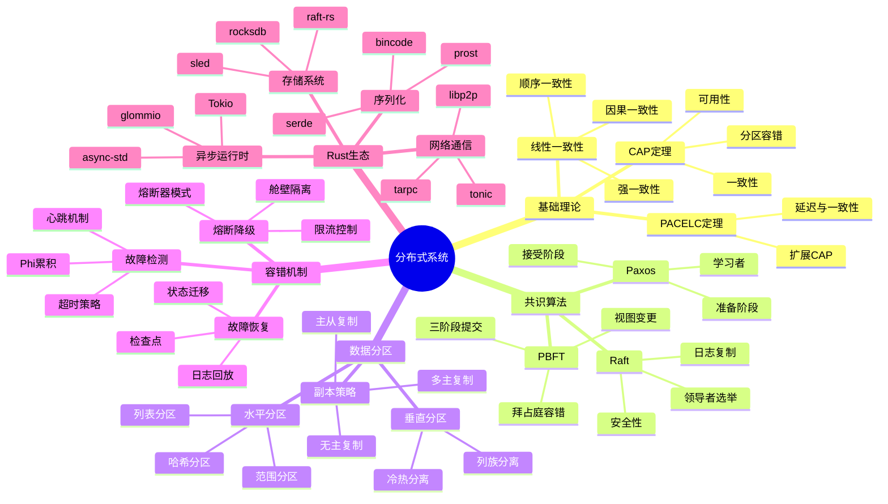
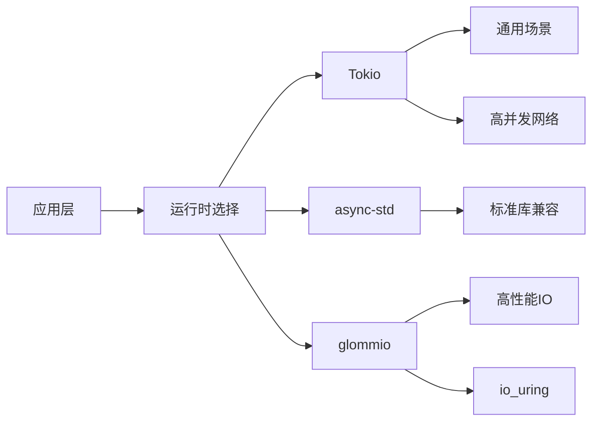

# 分布式系统概念族谱

> **Rust 版本**: 1.94.0+
> **最后更新**: 2026-03-12
> **状态**: ✅ 活跃维护

---

## 概念族谱概览



---

## 核心概念详解

### 1. CAP 定理

**定义**: 分布式系统最多同时满足一致性、可用性、分区容错性中的两项。

```rust
// CAP 权衡示例
enum ConsistencyLevel {
    Strong,    // CP 系统
    Eventual,  // AP 系统
    Causal,    // 折中方案
}

struct DistributedSystem {
    consistency: ConsistencyLevel,
    availability: bool,
    partition_tolerance: bool, // 总是 true
}
```

### 2. 共识算法对比

| 算法 | 容错类型 | 性能 | 复杂度 | Rust 实现 |
|------|----------|------|--------|-----------|
| Paxos | 崩溃容错 | 中 | 高 | - |
| Raft | 崩溃容错 | 高 | 中 | raft-rs |
| PBFT | 拜占庭容错 | 低 | 高 | - |

### 3. 数据分区策略

```rust
// 一致性哈希
struct ConsistentHash {
    ring: BTreeMap<u64, Node>,
    replicas: usize, // 虚拟节点数
}

impl ConsistentHash {
    fn get_node(&self, key: &str) -> Option<&Node> {
        let hash = self.hash(key);
        self.ring.range(hash..).next()
            .or_else(|| self.ring.first_key_value())
            .map(|(_, node)| node)
    }
}
```

---

## Rust 分布式系统工具链

### 异步运行时对比



### 关键库生态系统

| 用途 | 推荐库 | 版本 |
|------|--------|------|
| RPC 框架 | tonic | 0.14+ |
| 序列化 | serde | 1.0+ |
| 分布式追踪 | opentelemetry | 0.31+ |
| 服务发现 | consul | 0.4+ |
| 消息队列 | rdkafka | 0.37+ |

---

## 分布式模式实现

### 1. 熔断器模式

```rust
use std::sync::atomic::{AtomicU32, Ordering};
use std::time::{Duration, Instant};

struct CircuitBreaker {
    failure_count: AtomicU32,
    threshold: u32,
    timeout: Duration,
    last_failure: std::sync::Mutex<Option<Instant>>,
}

enum CircuitState {
    Closed,    // 正常
    Open,      // 熔断
    HalfOpen,  // 半开试探
}
```

### 2. 限流控制

```rust
use std::sync::atomic::{AtomicU64, Ordering};

struct RateLimiter {
    tokens: AtomicU64,
    max_tokens: u64,
    refill_rate: u64, // tokens per second
    last_refill: std::sync::Mutex<Instant>,
}

impl RateLimiter {
    fn allow(&self) -> bool {
        self.refill();
        let tokens = self.tokens.load(Ordering::Relaxed);
        if tokens > 0 {
            self.tokens.fetch_sub(1, Ordering::Relaxed);
            true
        } else {
            false
        }
    }
}
```

---

## 相关文档

- [分布式架构决策树](./DISTRIBUTED_ARCHITECTURE_DECISION_TREE.md)
- [分布式模式矩阵](./DISTRIBUTED_PATTERNS_MATRIX.md)
- [软件设计理论 - 分布式](./software_design_theory/03_execution_models/05_distributed.md)

---

**文档版本**: 1.0
**创建日期**: 2026-03-12
