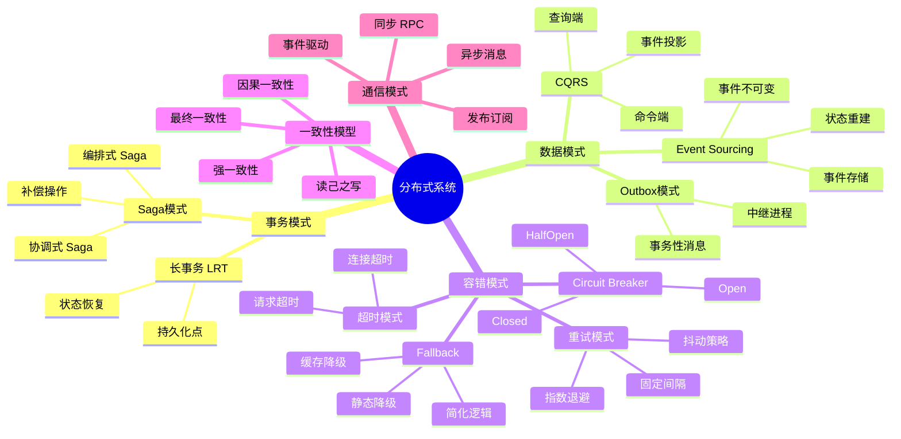

# 分布式系统概念族谱

> **创建日期**: 2026-03-08
> **版本**: v1.0
> **描述**: 分布式系统核心模式与概念的完整族谱

---

## 🧬 核心概念族谱

---

## 📊 概念关系矩阵

| 概念A | 关系 | 概念B | 说明 |
|-------|------|-------|------|
| Saga | uses | Compensation | Saga使用补偿保证一致性 |
| CQRS | combines with | Event Sourcing | 常组合使用 |
| Outbox | ensures | Exactly Once | Outbox保证恰好一次投递 |
| Circuit Breaker | protects | Remote Service | 熔断器保护远程服务 |
| Retry | complements | Timeout | 重试与超时配合 |
| Fallback | triggered by | Circuit Breaker | 熔断触发降级 |

---

## 🎯 核心定理映射

| 定理编号 | 定理名称 | 相关概念 |
|----------|----------|----------|
| T-SG1 | Saga最终一致性定理 | Saga |
| T-CQ1 | CQRS读写分离定理 | CQRS |
| T-CB1 | 熔断故障隔离定理 | Circuit Breaker |
| T-OB1 | Outbox消息不丢失定理 | Outbox |
| T-ES1 | Event Sourcing可重现性定理 | Event Sourcing |

---

## 🌿 概念层次结构

### Level 1: 基础模式

- Saga 事务
- CQRS 读写分离
- Event Sourcing 事件溯源

### Level 2: 容错机制

- Circuit Breaker 熔断
- Retry 重试
- Timeout 超时
- Fallback 降级

### Level 3: 消息可靠性

- Outbox 发件箱
- Idempotency 幂等性
- Deduplication 去重

### Level 4: 一致性模型

- 强一致性
- 最终一致性
- CAP 权衡

---

## 🔗 与Rust示例的映射

| 概念 | 形式化定义 | Rust实现 |
|------|-----------|----------|
| Saga | `05_distributed/01_saga_pattern.md` | 见文档内代码 |
| CQRS | `05_distributed/02_cqrs_pattern.md` | 见文档内代码 |
| Circuit Breaker | `05_distributed/03_circuit_breaker.md` | 见文档内代码 |
| Event Sourcing | `05_distributed/04_event_sourcing.md` | 见文档内代码 |
| Outbox | `05_distributed/05_outbox_pattern.md` | 见文档内代码 |
| Retry | `05_distributed/07_retry_pattern.md` | 见文档内代码 |

---

## 📚 相关文档

- [Saga形式化定义](./software_design_theory/05_distributed/01_saga_pattern.md)
- [CQRS形式化定义](./software_design_theory/05_distributed/02_cqrs_pattern.md)
- [分布式架构决策树](./DISTRIBUTED_ARCHITECTURE_DECISION_TREE.md)
- [分布式模式矩阵](./DISTRIBUTED_PATTERNS_MATRIX.md)
