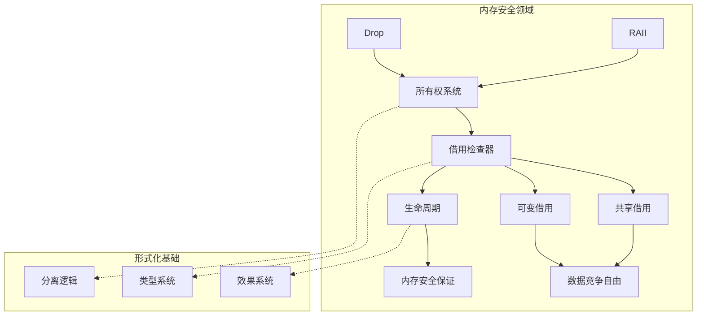
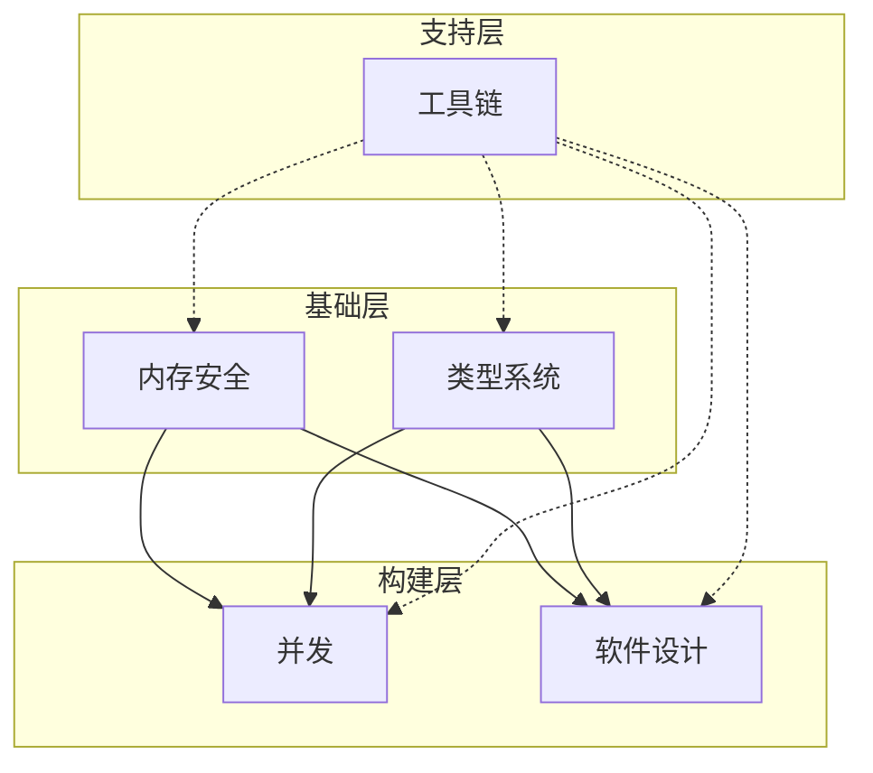

# Rust 领域分析框架

> **创建日期**: 2026-02-20
> **最后更新**: 2026-02-20
> **Rust 版本**: 1.93.0+ (Edition 2024)
> **状态**: 🔄 构建中
> **用途**: 按领域系统分析 Rust，建立领域模型和抽象层次

---

## 📊 目录 {#-目录}

- [Rust 领域分析框架](#rust-领域分析框架)
  - [📊 目录 {#-目录}](#-目录--目录)
  - [🎯 概述 {#-概述}](#-概述--概述)
  - [五大核心领域](#五大核心领域)
    - [领域 1: 内存安全](#领域-1-内存安全)
      - [边界定义](#边界定义)
      - [核心抽象](#核心抽象)
      - [关键定理](#关键定理)
      - [领域模型图](#领域模型图)
    - [领域 2: 类型系统](#领域-2-类型系统)
      - [边界定义 {#边界定义-1}](#边界定义-边界定义-1)
      - [核心抽象 {#核心抽象-1}](#核心抽象-核心抽象-1)
      - [关键定理 {#关键定理-1}](#关键定理-关键定理-1)
      - [类型层次结构](#类型层次结构)
    - [领域 3: 并发与并行](#领域-3-并发与并行)
      - [边界定义 {#边界定义-2}](#边界定义-边界定义-2)
      - [核心抽象 {#核心抽象-2}](#核心抽象-核心抽象-2)
      - [关键定理 {#关键定理-2}](#关键定理-关键定理-2)
      - [并发模型对比](#并发模型对比)
    - [领域 4: 软件设计](#领域-4-软件设计)
      - [边界定义 {#边界定义-3}](#边界定义-边界定义-3)
      - [核心抽象 {#核心抽象-3}](#核心抽象-核心抽象-3)
      - [设计模式矩阵](#设计模式矩阵)
    - [领域 5: 工具链](#领域-5-工具链)
      - [边界定义 {#边界定义-4}](#边界定义-边界定义-4)
      - [编译流程模型](#编译流程模型)
      - [工具链层次](#工具链层次)
  - [领域边界与交叉](#领域边界与交叉)
    - [领域交叉矩阵](#领域交叉矩阵)
    - [领域依赖图](#领域依赖图)
  - [领域抽象模型](#领域抽象模型)
    - [抽象层次对比](#抽象层次对比)

---

## 🎯 概述 {#-概述}

本文档建立 Rust 的**五大核心领域**分析框架：

1. **领域划分** - 按核心关注点划分五大领域
2. **领域边界** - 明确每个领域的范围和边界
3. **领域交叉** - 分析领域间的交叉点和交互
4. **抽象模型** - 为每个领域建立抽象模型

---

## 五大核心领域

### 领域 1: 内存安全

**核心关注点**: 防止内存错误（悬垂指针、双重释放、缓冲区溢出、数据竞争）

#### 边界定义

| 包含 | 排除 | 交叉领域 |
| :--- | :--- | :--- |
| 所有权系统 | 垃圾回收 | 类型系统（所有权类型） |
| 借用检查器 | 手动内存管理 | 并发（Send/Sync） |
| 生命周期 | 智能指针实现细节 | 编译器（MIR borrowck） |
| 内存布局 | 分配器实现 | FFI（unsafe边界） |

#### 核心抽象

**代数模型**:

```text
所有权代数
- Ω: 所有权状态 {Owned, Borrowed, Moved}
- ⊗: 所有权转移
- ⊕: 借用组合

规则:
- x: Owned ⊗ y = x: Moved ∧ y: Owned
- x: Borrowed ⊕ x: Borrowed = Valid
- x: Borrowed ⊕ x: MutBorrowed = Invalid
```

**逻辑模型** (分离逻辑):

```text
{P} C {Q}
其中 P, Q 是所有权断言:
- x ↦ v          (x 拥有值 v)
- x ↦ _          (x 拥有某个值)
- emp            (空堆)
- P * Q          (分离合取)
```

**操作语义**:

```text
Γ, H ⊢ e ⇓ v, H'  (表达式 e 在环境 Γ 和堆 H 下求值为 v，新堆 H')
```

#### 关键定理

| 定理 | 陈述 | 证明 | 重要性 |
| :--- | :--- | :--- | :--- |
| **T-唯一性** | 任何时刻只有一个所有者 | [ownership_model](formal_methods/ownership_model.md) | ⭐⭐⭐⭐⭐ |
| **T-内存安全** | 无悬垂指针、无双重释放 | [ownership_model](formal_methods/ownership_model.md) | ⭐⭐⭐⭐⭐ |
| **T-无泄漏** | 资源最终被释放 | [ownership_model](formal_methods/ownership_model.md) | ⭐⭐⭐⭐ |
| **T-数据竞争自由** | 借用规则保证线程安全 | [borrow_checker_proof](formal_methods/borrow_checker_proof.md) | ⭐⭐⭐⭐⭐ |

#### 领域模型图



---

### 领域 2: 类型系统

**核心关注点**: 类型安全、抽象能力、代码复用

#### 边界定义 {#边界定义-1}

| 包含 | 排除 | 交叉领域 |
| :--- | :--- | :--- |
| 静态类型检查 | 运行时类型信息 | 内存安全（所有权类型） |
| 泛型 | 模板元编程 | 编译器（单态化） |
| Trait | 虚函数表 | 软件设计（接口抽象） |
| 类型推导 | 反射 | 形式化（类型论） |
| 型变 | 协变/逆变实现 | 生命周期（子类型） |

#### 核心抽象 {#核心抽象-1}

**代数模型** (范畴论):

```text
类型范畴 C:
- 对象: Rust 类型 (A, B, C, ...)
- 态射: 函数 f: A → B
- 单位: id_A: A → A

Trait 作为类型类:
- TypeClass Trait { method: Self → A }
- 实例化: impl Trait for Type

泛型作为函子:
- F: C → C, F(A) = Vec<A>
- map: (A → B) → F(A) → F(B)
```

**逻辑模型** (Curry-Howard 对应):

```text
类型 ↔ 命题
函数 ↔ 证明

A → B     : A 蕴含 B
A × B     : A 且 B
A + B     : A 或 B
∀A.F(A)   : 对所有 A, F(A)
∃A.F(A)   : 存在 A 使得 F(A)
```

#### 关键定理 {#关键定理-1}

| 定理 | 陈述 | 证明 | 重要性 |
| :--- | :--- | :--- | :--- |
| **T-进展** | 良类型的程序不会卡住 | [type_system_foundations](type_theory/type_system_foundations.md) | ⭐⭐⭐⭐⭐ |
| **T-保持** | 规约保持类型 | [type_system_foundations](type_theory/type_system_foundations.md) | ⭐⭐⭐⭐⭐ |
| **T-类型安全** | 进展 + 保持 | [type_system_foundations](type_theory/type_system_foundations.md) | ⭐⭐⭐⭐⭐ |
| **T-型变安全** | 协变/逆变/不变正确性 | [variance_theory](type_theory/variance_theory.md) | ⭐⭐⭐⭐ |

#### 类型层次结构

```text
类型系统
├── 基础类型
│   ├── 标量: i32, f64, bool, char
│   ├── 复合: struct, enum, tuple
│   └── 函数: fn(A) -> B
│
├── 泛型系统
│   ├── 参数化: <T>
│   ├── 约束: <T: Trait>
│   └── 关联类型: type Output;
│
├── Trait 系统
│   ├── 基本 Trait: trait T { ... }
│   ├── 泛型 Trait: trait T<A> { ... }
│   ├── 关联类型: trait T { type Output; }
│   └── Trait 对象: dyn Trait
│
└── 生命周期
    ├── 标注: 'a
    ├── 约束: 'a: 'b
    └── 省略规则
```

---

### 领域 3: 并发与并行

**核心关注点**: 多线程执行、异步编程、同步机制

#### 边界定义 {#边界定义-2}

| 包含 | 排除 | 交叉领域 |
| :--- | :--- | :--- |
| 线程并发 | 进程间通信 | 内存安全（Send/Sync） |
| 异步/await | 协程实现 | 类型系统（Future trait） |
| 同步原语 | 无锁算法细节 | 编译器（状态机转换） |
| Send/Sync trait | 线程池实现 | 软件设计（Actor模式） |

#### 核心抽象 {#核心抽象-2}

**代数模型** (进程代数):

```text
CSP (通信顺序进程)
- P, Q: 进程
- P || Q: 并行组合
- P → Q: 顺序组合
- c!v: 通道 c 发送值 v
- c?v: 通道 c 接收值
- P \ c: 隐藏通道 c

Rust 映射:
- spawn(|| { ... })  ≈  P
- join()             ≈  P || Q
- tx.send(v)         ≈  c!v
- rx.recv()          ≈  c?v
```

**操作语义** (Actor 模型):

```text
状态转换:
(Send, m, dest) → (Idle, ε)  (发送消息 m 到 dest)
(Receive, m) → (Process(m), ε)  (接收并处理消息)
```

#### 关键定理 {#关键定理-2}

| 定理 | 陈述 | 证明 | 重要性 |
| :--- | :--- | :--- | :--- |
| **T-Send安全** | Send类型可安全跨线程转移 | [send_sync_formalization](formal_methods/send_sync_formalization.md) | ⭐⭐⭐⭐⭐ |
| **T-Sync安全** | Sync类型可安全跨线程共享 | [send_sync_formalization](formal_methods/send_sync_formalization.md) | ⭐⭐⭐⭐⭐ |
| **T-异步安全** | async/await不引入数据竞争 | [async_state_machine](formal_methods/async_state_machine.md) | ⭐⭐⭐⭐ |
| **T-Pin安全** | Pin保证自引用安全 | [pin_self_referential](formal_methods/pin_self_referential.md) | ⭐⭐⭐⭐ |

#### 并发模型对比

| 模型 | 通信方式 | 同步机制 | Rust实现 | 适用场景 |
| :--- | :--- | :--- | :--- | :--- |
| **线程** | 共享内存 | Mutex/RwLock | std::thread | CPU密集型 |
| **CSP** | 通道 | 阻塞/缓冲 | std::sync::mpsc | 消息传递 |
| **Actor** | 消息 | 异步邮箱 | actix/tokio::sync | 分布式 |
| **异步** | Future组合 | Poll/await | async/await | I/O密集型 |
| **数据并行** | 分块数据 | 归约/扫描 | rayon | 并行计算 |

---

### 领域 4: 软件设计

**核心关注点**: 架构模式、设计模式、代码组织

#### 边界定义 {#边界定义-3}

| 包含 | 排除 | 交叉领域 |
| :--- | :--- | :--- |
| 设计模式 | 架构风格 | 类型系统（Trait抽象） |
| 模块系统 | 包管理 | 编译器（可见性检查） |
| API设计 | 用户界面 | 形式化（接口规范） |
| 错误处理策略 | 日志实现 | 类型系统（Result类型） |

#### 核心抽象 {#核心抽象-3}

**范畴论模型**:

```text
设计模式作为范畴构造:

- 工厂模式: 函子 F: C → D
- 单例模式: 终对象 1 ∈ C
- 组合模式: 递归类型 μX.F(X)
- 访问者模式: 余积上的fold

Rust特有:
- Newtype: 包装函子 W(A) = struct Wrapper(A);
- 类型状态: 泛型参数作为状态标签
```

**类型论模型**:

```text
设计模式作为类型构造:

- Builder: 渐进式类型构建
  Builder<Step1> → Builder<Step2> → Product

- 状态机: 代数数据类型
  enum State { S1(A), S2(B), S3(C) }

- RAII: 线性类型
  type Resource: Linear = { acquire, release }
```

#### 设计模式矩阵

| 模式 | 意图 | Rust实现 | 形式化类型 |
| :--- | :--- | :--- | :--- |
| **Builder** | 复杂对象构建 | 消耗型/非消耗型 | 渐进式类型 |
| **RAII** | 资源管理 | Drop trait | 线性类型 |
| **Newtype** | 类型安全 | struct Wrapper(T); | 同构类型 |
| **类型状态** | 编译时状态 | 泛型参数 | 依赖类型 |
| **策略** | 算法族 | Trait对象/泛型 | 高阶类型 |
| **观察者** | 事件通知 | 通道/回调 | 协程 |

---

### 领域 5: 工具链

**核心关注点**: 编译、构建、测试、代码质量

#### 边界定义 {#边界定义-4}

| 包含 | 排除 | 交叉领域 |
| :--- | :--- | :--- |
| 编译流程 | IDE功能 | 类型系统（类型检查） |
| 构建系统 | 包注册中心 | 软件设计（模块化） |
| 测试框架 | CI/CD | 形式化（验证工具） |
| 代码检查 | 代码格式化 | 内存安全（MIR分析） |

#### 编译流程模型

```text
源代码
  │
  ▼
词法分析 → Token流
  │
  ▼
语法分析 → AST
  │
  ▼
名称解析 → 解析后的AST
  │
  ▼
类型检查 → HIR
  │
  ▼
借用检查 → MIR
  │
  ▼
优化 → 优化后的MIR
  │
  ▼
代码生成 → LLVM IR
  │
  ▼
目标代码
```

#### 工具链层次

```text
工具链生态
├── 编译器 (rustc)
│   ├── 前端: 解析 + 类型检查
│   ├── 中端: MIR + 优化
│   └── 后端: LLVM + 代码生成
│
├── 包管理 (Cargo)
│   ├── 依赖解析
│   ├── 构建脚本
│   └── 工作空间
│
├── 测试 (cargo test)
│   ├── 单元测试
│   ├── 集成测试
│   └── 文档测试
│
└── 代码质量
    ├── clippy (lint)
    ├── rustfmt (格式化)
    ├── rustdoc (文档)
    └── Miri (UB检测)
```

---

## 领域边界与交叉

### 领域交叉矩阵

| 领域 A | 领域 B | 交叉概念 | 交叉文档 |
| :--- | :--- | :--- | :--- |
| 内存安全 | 类型系统 | 所有权类型 | ownership_model.md |
| 内存安全 | 并发 | Send/Sync | send_sync_formalization.md |
| 类型系统 | 软件设计 | Trait抽象 | trait_system_formalization.md |
| 并发 | 工具链 | 异步状态机 | async_state_machine.md |
| 软件设计 | 工具链 | 模块化 | MODULE_KNOWLEDGE_STRUCTURE_GUIDE.md |

### 领域依赖图



---

## 领域抽象模型

### 抽象层次对比

| 领域 | L1 元概念 | L2 核心抽象 | L3 具体实现 | L4 代码实践 |
| :--- | :--- | :--- | :--- | :--- |
| **内存安全** | 资源管理 | 所有权系统 | 借用规则 | RAII模式 |
| **类型系统** | 类型安全 | 类型判断 | 泛型/Trait | 类型标注 |
| **并发** | 并发安全 | Send/Sync | 同步原语 | async/await |
| **软件设计** | 抽象能力 | 设计模式 | 模块系统 | 代码组织 |
| **工具链** | 代码转换 | 编译流程 | MIR优化 | cargo命令 |

---

**维护者**: Rust Formal Methods Research Team
**最后更新**: 2026-02-20
**状态**: 🔄 构建中
