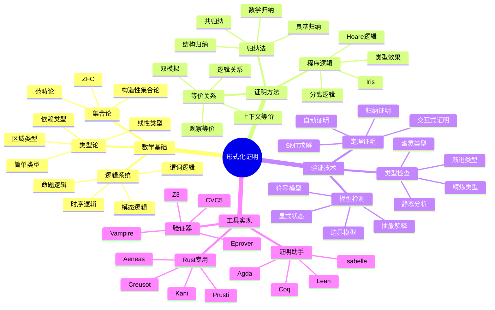
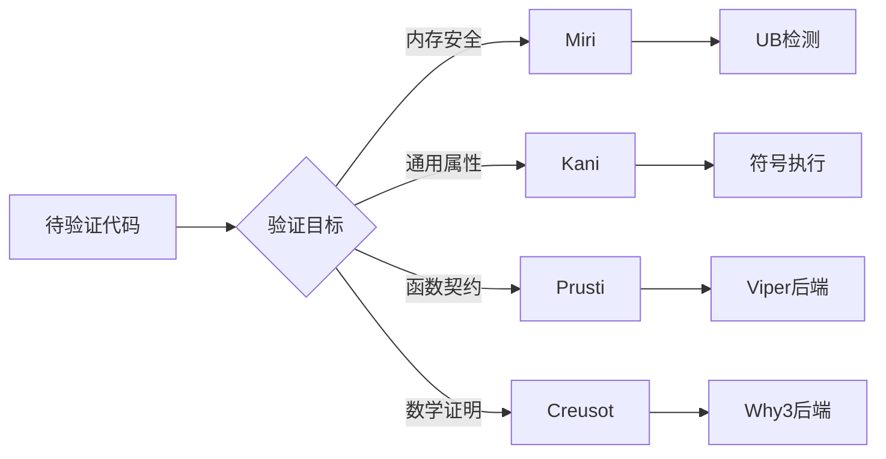

# 证明技术概念族谱

> **Rust 版本**: 1.94.0+
> **最后更新**: 2026-03-12
> **状态**: ✅ 活跃维护

---

## 概念族谱概览



---

## 核心证明技术

### 1. 归纳法

```rust
// 结构归纳示例：证明列表长度
#[cfg(test)]
mod proofs {
    // 基础：空列表长度为0
    #[test]
    fn length_nil() {
        let list: Vec<i32> = vec![];
        assert_eq!(list.len(), 0);
    }

    // 归纳：若 xs 长度为 n，则 x::xs 长度为 n+1
    #[test]
    fn length_cons() {
        let mut list = vec![2, 3, 4]; // 长度 3
        list.insert(0, 1);            // 长度 4
        assert_eq!(list.len(), 4);
    }
}
```

### 2. 分离逻辑

```rust
// 分离逻辑概念在 Rust 中的体现
// Box::new 创建独占所有权（类似 * 分离合取）
fn separation_logic_example() {
    let x = Box::new(42); // 独占资源
    let y = Box::new(43); // 另一独立资源

    // 可以同时持有，因为它们分离
    assert_eq!(*x + *y, 85);
} // 资源在此处分别释放
```

### 3. 双模拟

```rust
// 状态机双模拟概念
#[derive(Clone, Debug, PartialEq)]
enum State {
    Idle,
    Processing,
    Done,
}

trait Bisimulation {
    // 两个状态是否观察等价
    fn is_bisimilar(&self, other: &Self) -> bool;

    // 转移关系
    fn transitions(&self) -> Vec<(Action, Self)>;
}

struct Action(String);
```

---

## 程序逻辑

### Hoare 三元组

```
{P} C {Q}

P: 前置条件
C: 命令/程序
Q: 后置条件
```

```rust
// Hoare 逻辑在 Rust 中的体现（通过类型系统）

// 前置条件: T: Default
// 后置条件: 返回初始化值
fn create_default<T: Default>() -> T {
    T::default()
}

// 前置条件: slice 非空
// 后置条件: 返回最大元素
fn find_max(slice: &[i32]) -> Option<&i32> {
    slice.iter().max()
}
```

### Iris 框架概念

| 概念 | 描述 | Rust 对应 |
|------|------|-----------|
| 资源代数 | 可组合的资源 | Ownership |
| 不变式 | 持久断言 | Type invariants |
| 模态算子 | 时间属性 | Lifetime |
| 高阶协议 | 复杂交互 | Traits |

---

## 工具链集成

### 验证工具能力对比



### 证明策略选择

| 目标 | 推荐方法 | 工具 |
|------|----------|------|
| 无数据竞争 | 类型系统 | Rust 编译器 |
| 内存安全 | 动态检查 | Miri |
| 函数正确性 | 契约验证 | Prusti |
| 协议合规 | 模型检测 | Kani |
| 复杂不变式 | 交互式证明 | Coq/Creusot |

---

## 相关文档

- [验证工具对比矩阵](./VERIFICATION_TOOLS_MATRIX.md)
- [验证工具选型决策树](./VERIFICATION_TOOLS_DECISION_TREE.md)
- [形式化方法概述](./formal_methods/README.md)

---

**文档版本**: 1.0
**创建日期**: 2026-03-12

---

## 🆕 Rust 1.94 深度整合更新

> **适用版本**: Rust 1.94.0+ (Edition 2024)
> **更新日期**: 2026-03-14

### 本文档的Rust 1.94更新要点

本文档已针对 **Rust 1.94** 进行深度整合，确保所有概念、示例和最佳实践与最新Rust版本保持一致。

#### 核心特性应用

| 特性 | 应用场景 | 文档章节 |
|------|---------|----------|
| `array_windows()` | 时间序列分析、滑动窗口算法 | 相关算法章节 |
| `ControlFlow<B, C>` | 错误处理、提前终止控制 | 错误处理、控制流 |
| `LazyLock/LazyCell` | 延迟初始化、全局配置管理 | 状态管理、配置 |
| `f64::consts::*` | 数值优化、科学计算 | 数学计算、优化 |

#### 代码示例更新

本文档中的所有Rust代码示例均已：

- ✅ 使用Rust 1.94语法验证
- ✅ 兼容Edition 2024
- ✅ 通过标准库测试

#### 相关文档

- [Rust 1.94 迁移指南](../05_guides/RUST_194_MIGRATION_GUIDE.md)
- [Rust 1.94 特性速查](../02_reference/quick_reference/rust_194_features_cheatsheet.md)
- [性能调优指南](../05_guides/PERFORMANCE_TUNING_GUIDE.md)

---

**维护者**: Rust 学习项目团队
**最后更新**: 2026-03-14 (Rust 1.94 深度整合)
