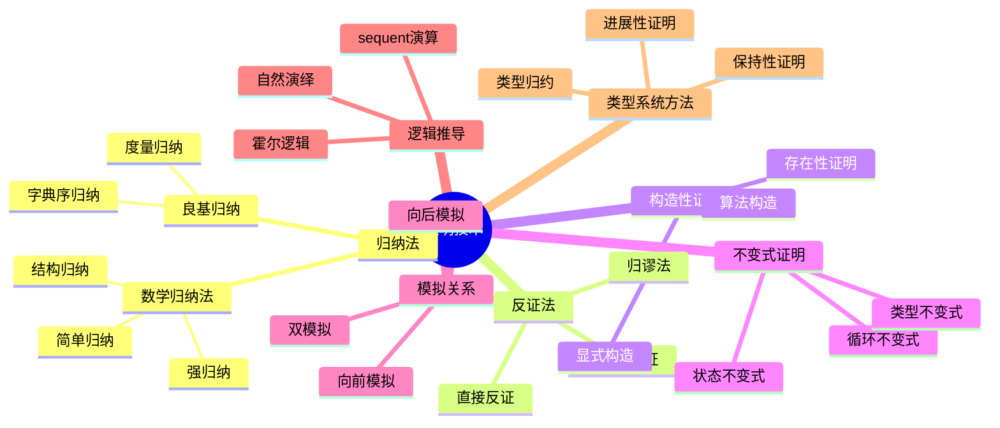

# 证明技术概念族谱

> **创建日期**: 2026-03-10
> **版本**: v1.0
> **描述**: Rust 形式化证明中使用的证明技术完整族谱
> **状态**: ✅ 已完成

---

## 📋 目录

- [证明技术概念族谱](#证明技术概念族谱)
  - [📋 目录](#-目录)
  - [一、概述](#一概述)
  - [二、证明技术族谱](#二证明技术族谱)
  - [三、技术分类详解](#三技术分类详解)
    - [3.1 归纳法家族](#31-归纳法家族)
    - [3.2 反证法家族](#32-反证法家族)
    - [3.3 构造性证明](#33-构造性证明)
    - [3.4 不变式证明](#34-不变式证明)
    - [3.5 模拟关系](#35-模拟关系)
  - [四、Rust 形式化应用](#四rust-形式化应用)
    - [4.1 所有权系统证明技术](#41-所有权系统证明技术)
    - [4.2 借用检查证明技术](#42-借用检查证明技术)
    - [4.3 类型系统证明技术](#43-类型系统证明技术)
  - [五、定理与技术映射](#五定理与技术映射)
    - [5.1 五维矩阵视角](#51-五维矩阵视角)
    - [5.2 技术选择决策树](#52-技术选择决策树)
  - [六、相关资源](#六相关资源)
    - [6.1 内部文档](#61-内部文档)
    - [6.2 证明辅助工具](#62-证明辅助工具)

---

## 一、概述

本文档梳理 Rust 形式化验证中使用的各种证明技术，构建完整的证明技术族谱。
这些技术在证明 Rust 核心定理（所有权唯一性、借用安全性、类型安全等）中发挥关键作用。

---

## 二、证明技术族谱



---

## 三、技术分类详解

### 3.1 归纳法家族

| 技术 | 适用场景 | 复杂度 | Rust应用 |
|------|----------|--------|----------|
| **简单归纳** | 自然数性质 | ⭐ | 递归深度证明 |
| **结构归纳** | 归纳定义类型 | ⭐⭐ | 表达式求值 |
| **强归纳** | 良基关系 | ⭐⭐⭐ | 规约序列终止 |
| **字典序归纳** | 多参数递归 | ⭐⭐⭐ | 借用检查终止 |

**核心原理**：
$$
Frac{P(0)
ightarrow Forall n: P(n)
ightarrow P(n+1)}{Forall n: P(n)}
$$

### 3.2 反证法家族

| 技术 | 适用场景 | 复杂度 | Rust应用 |
|------|----------|--------|----------|
| **直接反证** | 否定结论推导矛盾 | ⭐ | 唯一性证明 |
| **归谬法** | 假设导出荒谬 | ⭐⭐ | 借用规则有效性 |
| **对角线法** | 不可判定性证明 | ⭐⭐⭐ | 类型检查限制 |

**核心原理**：
$$
Frac{
eg P
ightarrow ot}{P}
$$

### 3.3 构造性证明

| 技术 | 适用场景 | 复杂度 | Rust应用 |
|------|----------|--------|----------|
| **显式构造** | 存在量词证明 | ⭐⭐ | 内存分配模型 |
| **算法构造** | 可计算性证明 | ⭐⭐⭐ | 借用检查算法 |

### 3.4 不变式证明

| 不变式类型 | 定义 | Rust应用 |
|------------|------|----------|
| **循环不变式** | 每次迭代保持的性质 | unsafe块分析 |
| **状态不变式** | 程序状态保持的性质 | 所有权转移 |
| **类型不变式** | 类型系统保持的性质 | 子类型关系 |

**不变式模板**：

```text
{I ∧ B} S {I}      // 保持
I ∧ ¬B → Q         // 退出条件
```

### 3.5 模拟关系

| 关系类型 | 定义 | 用途 |
|----------|------|------|
| **向前模拟** | $R(S_1, S_2)ightarrow Forall S_1', S_1  o S_1'ightarrow Forall S_2', S_2  o S_2'ightarrow R(S_1', S_2')$ | 精化关系 |
| **向后模拟** | 反向箭头方向 | 抽象解释 |
| **双模拟** | 向前+向后 | 语义等价 |

---

## 四、Rust 形式化应用

### 4.1 所有权系统证明技术

| 定理 | 主要技术 | 辅助技术 |
|------|----------|----------|
| T-OW1 (唯一性) | 结构归纳 | 反证法 |
| T-OW2 (移动保持) | 状态不变式 | 情况分析 |
| T-OW3 (RAII) | 构造性证明 | 生命周期归纳 |

### 4.2 借用检查证明技术

| 定理 | 主要技术 | 辅助技术 |
|------|----------|----------|
| T-BR1 (借用安全) | 不变式证明 | 反证法 |
| T-BR2 (可变唯一) | 状态机归纳 | 互斥论证 |
| T-BR3 (生命周期包含) | 偏序归纳 | 集合论 |

### 4.3 类型系统证明技术

| 定理 | 主要技术 | 辅助技术 |
|------|----------|----------|
| T-TY1 (进展性) | 结构归纳 | 反证法 |
| T-TY2 (保持性) | 替换引理 | 归纳法 |
| T-TY3 (类型安全) | 进展+保持 | 经典方法 |

---

## 五、定理与技术映射

### 5.1 五维矩阵视角

| 定理 | 归纳法 | 反证法 | 不变式 | 构造性 | 模拟 |
|------|--------|--------|--------|--------|------|
| T-OW1 | ✅ | ✅ | - | - | - |
| T-OW2 | ✅ | - | ✅ | - | - |
| T-BR1 | ✅ | ✅ | ✅ | - | - |
| T-BR2 | - | ✅ | ✅ | - | - |
| T-TY1 | ✅ | - | - | - | - |
| T-TY2 | ✅ | - | - | ✅ | - |
| T-LT1 | ✅ | - | ✅ | - | - |
| T-SS1 | - | ✅ | - | - | ✅ |

### 5.2 技术选择决策树

```text
需要证明什么？
├── 对所有...成立 → 归纳法
│   ├── 自然数 → 简单归纳
│   ├── 数据结构 → 结构归纳
│   └── 复杂递归 → 良基归纳
├── 存在... → 构造性证明
│   ├── 需要算法 → 算法构造
│   └── 纯存在性 → 存在性证明
├── 不可能... → 反证法
│   ├── 直接否定 → 直接反证
│   └── 导出矛盾 → 归谬法
└── 保持某种性质 → 不变式证明
    ├── 循环中 → 循环不变式
    └── 状态转换 → 状态不变式
```

---

## 六、相关资源

### 6.1 内部文档

- [CORE_THEOREMS_FULL_PROOFS](./CORE_THEOREMS_FULL_PROOFS.md) — 完整证明
- [FORMAL_LANGUAGE_AND_PROOFS](./FORMAL_LANGUAGE_AND_PROOFS.md) — 形式语言
- [CONCEPT_AXIOM_THEOREM_MATRIX](./CONCEPT_AXIOM_THEOREM_MATRIX.md) — 概念矩阵

### 6.2 证明辅助工具

| 工具 | 类型 | 适用证明 |
|------|------|----------|
| Coq | 交互式 | 复杂归纳证明 |
| Isabelle | 交互式 | 自动化推理 |
| Aeneas | 自动化 | Rust特定证明 |
| F* | 验证导向 | 效应系统 |

---

**维护者**: Rust Formal Methods Research Team
**最后更新**: 2026-03-10
