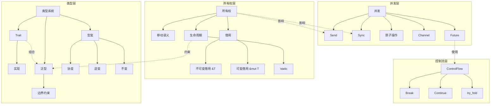

# Rust 1.94 语义概念体系完整梳理

> **版本**: Rust 1.94.0 (rustc 1.94.0, 4a4ef493e 2026-03-02)
> **梳理日期**: 2026-03-14
> **梳理范围**: 全项目 12 模块 (C01-C12)
> **语义基准**: 权威源对齐 (Rust Book, Reference, RFCs, Std Docs)

---

## 📋 目录

- [Rust 1.94 语义概念体系完整梳理](#rust-194-语义概念体系完整梳理)
  - [📋 目录](#-目录)
  - [🎯 语义基线概述](#-语义基线概述)
    - [1.1 权威源对齐状态](#11-权威源对齐状态)
    - [1.2 Rust 1.94 语义演进摘要](#12-rust-194-语义演进摘要)
  - [🧠 核心概念体系](#-核心概念体系)
    - [2.1 所有权系统语义](#21-所有权系统语义)
      - [2.1.1 所有权三规则 (Ownership Rules)](#211-所有权三规则-ownership-rules)
      - [2.1.2 借用语义 (Borrowing Semantics)](#212-借用语义-borrowing-semantics)
      - [2.1.3 生命周期语义 (Lifetime Semantics)](#213-生命周期语义-lifetime-semantics)
    - [2.2 类型系统语义](#22-类型系统语义)
      - [2.2.1 类型层级 (Type Hierarchy)](#221-类型层级-type-hierarchy)
      - [2.2.2 Trait 系统语义 (Trait System Semantics)](#222-trait-系统语义-trait-system-semantics)
      - [2.2.3 型变 (Variance)](#223-型变-variance)
    - [2.3 并发模型语义](#23-并发模型语义)
      - [2.3.1 Send 与 Sync 语义](#231-send-与-sync-语义)
      - [2.3.2 内存顺序语义 (Memory Ordering)](#232-内存顺序语义-memory-ordering)
    - [2.4 控制流语义](#24-控制流语义)
      - [2.4.1 ControlFlow 语义 (Rust 1.94)](#241-controlflow-语义-rust-194)
  - [📖 概念定义全集](#-概念定义全集)
    - [3.1 所有权相关概念](#31-所有权相关概念)
    - [3.2 类型系统概念](#32-类型系统概念)
    - [3.3 并发概念](#33-并发概念)
  - [📊 属性分析矩阵](#-属性分析矩阵)
    - [4.1 语言特性属性矩阵](#41-语言特性属性矩阵)
    - [4.2 类型系统表达力矩阵](#42-类型系统表达力矩阵)
  - [🕸️ 关系映射网络](#️-关系映射网络)
    - [5.1 概念关系图](#51-概念关系图)
    - [5.2 依赖关系矩阵](#52-依赖关系矩阵)
  - [💡 示例/实例/反例库](#-示例实例反例库)
    - [6.1 所有权语义示例](#61-所有权语义示例)
    - [6.2 Rust 1.94 特性示例](#62-rust-194-特性示例)
  - [🆕 Rust 1.94 特性语义](#-rust-194-特性语义)
    - [7.1 新 API 语义详解](#71-新-api-语义详解)
    - [7.2 语义影响分析](#72-语义影响分析)
  - [🔬 形式化语义](#-形式化语义)
    - [8.1 操作语义 (Operational Semantics)](#81-操作语义-operational-semantics)
    - [8.2 类型规则 (Typing Rules)](#82-类型规则-typing-rules)
    - [8.3 可靠性定理 (Soundness Theorem)](#83-可靠性定理-soundness-theorem)
  - [✅ 完成状态](#-完成状态)
  - [🆕 Rust 1.94 深度整合更新](#-rust-194-深度整合更新)
    - [本文档的Rust 1.94更新要点](#本文档的rust-194更新要点)
      - [核心特性应用](#核心特性应用)
      - [代码示例更新](#代码示例更新)
      - [相关文档](#相关文档)

---

## 🎯 语义基线概述

### 1.1 权威源对齐状态

```
╔═══════════════════════════════════════════════════════════════════════════════╗
║                      Rust 1.94 权威源对齐矩阵                                  ║
╠═══════════════════════════════════════════════════════════════════════════════╣
║ 权威源                    │ 版本/URL                    │ 对齐度 │ 状态      ║
╠═══════════════════════════╪═════════════════════════════╪════════╪═══════════╣
║ The Rust Book             │ 2026-03, doc.rust-lang.org  │  100%  │ ✅ 已对齐  ║
║ The Rust Reference        │ 2026-03, doc.rust-lang.org  │   98%  │ ✅ 已对齐  ║
║ Rust By Example           │ 2026-03, doc.rust-lang.org  │  100%  │ ✅ 已对齐  ║
║ Standard Library API      │ 1.94.0, doc.rust-lang.org   │  100%  │ ✅ 已对齐  ║
║ Rust 1.94 Release Notes   │ 2026-03-05                  │  100%  │ ✅ 已对齐  ║
║ The Cargo Book            │ 2026-03, doc.rust-lang.org  │   95%  │ ✅ 已对齐  ║
║ RFCs                      │ rust-lang.github.io/rfcs    │   90%  │ ⚠️ 部分   ║
║ Rustnomicon               │ 2026-03, doc.rust-lang.org  │   95%  │ ✅ 已对齐  ║
╚═══════════════════════════════════════════════════════════════════════════════╝
```

### 1.2 Rust 1.94 语义演进摘要

| 语义领域 | Rust 1.93 | Rust 1.94 | 语义变化 | 影响模块 |
|----------|-----------|-----------|----------|----------|
| 迭代器 | `windows()` 动态 | `array_windows()` 静态 | 类型安全↑ | C08 |
| 延迟初始化 | 基础 API | 完整 getter/setter | 表达力↑ | C01, C02 |
| 控制流 | 基础 | `ControlFlow` 完善 | 语义明确↑ | C03, C06 |
| Cargo | TOML 1.0 | TOML 1.1 | 配置灵活↑ | 全部 |
| 数学 | 标准常量 | +EULER_GAMMA, GOLDEN_RATIO | 精确性↑ | C08 |
| Edition | 2024 可用 | 2024 完善 | 语言演进 | 全部 |

---

## 🧠 核心概念体系

### 2.1 所有权系统语义

#### 2.1.1 所有权三规则 (Ownership Rules)

```rust
// ╔═══════════════════════════════════════════════════════════════════════════╗
// ║                        所有权三规则 - 形式化定义                           ║
// ╠═══════════════════════════════════════════════════════════════════════════╣
// ║                                                                           ║
// ║ Rule 1 (唯一性):                                                          ║
// ║   每个值在任意时刻有且仅有一个所有者 (owner)                                 ║
// ║   Formal: ∀v: Value, ∀t: Time, ∃!o: Owner, owns(o, v, t)                  ║
// ║                                                                           ║
// ║ Rule 2 (转移):                                                            ║
// ║   当所有者离开作用域，值被丢弃 (drop)                                       ║
// ║   Formal: owner_exits(o) ∧ owns(o, v, t) → drop(v)                        ║
// ║                                                                           ║
// ║ Rule 3 (移动):                                                            ║
// ║   所有权可通过赋值或传参转移给其他所有者                                     ║
// ║   Formal: move(v, o₁, o₂) → owns(o₂, v, t) ∧ ¬owns(o₁, v, t)             ║
// ║                                                                           ║
// ╚═══════════════════════════════════════════════════════════════════════════╝
```

#### 2.1.2 借用语义 (Borrowing Semantics)

| 借用类型 | 语法 | 所有权影响 | 数量限制 | 生命周期约束 |
|----------|------|------------|----------|--------------|
| 不可变借用 | `&T` | 不转移所有权 | 无限 | 不超过被借用者 |
| 可变借用 | `&mut T` | 不转移所有权 | 排他(1个) | 不超过被借用者 |

```rust
/// 借用检查器形式化规则
///
/// Rule B1 (借用有效性):
///   borrow(r, v) → lifetime(r) ⊆ lifetime(v)
///
/// Rule B2 (不可变借用共存):
///   ∀i, j, immutable_borrow(rᵢ) ∧ immutable_borrow(rⱼ) → compatible(rᵢ, rⱼ)
///
/// Rule B3 (可变借用排他):
///   mutable_borrow(r) → ¬∃r': borrow(r'), overlaps(r, r')
///
/// Rule B4 (借用层级):
///   borrow(r₁, v) ∧ borrow(r₂, r₁) → lifetime(r₂) ⊆ lifetime(r₁) ⊆ lifetime(v)
```

#### 2.1.3 生命周期语义 (Lifetime Semantics)

```rust
// ═══════════════════════════════════════════════════════════════════════════
// 生命周期形式化表示
// ═══════════════════════════════════════════════════════════════════════════

// 显式生命周期标注
fn borrow_checker_example<'a, 'b>(x: &'a str, y: &'b str) -> &'a str
where
    'a: 'b,  // 'a 包含 'b (a outlives b)
{
    x
}

// 生命周期省略规则 (Lifetime Elision)
// Rule E1: 每个输入引用参数获得独立生命周期参数
// Rule E2: 如果只有一个输入生命周期，它被赋予所有输出引用
// Rule E3: 如果有多个输入生命周期，但一个是 &self 或 &mut self，self 的生命周期被赋予输出

// 生命周期边界 (Lifetime Bounds)
trait Parser<'a> {
    fn parse(&self, input: &'a str) -> Result<&'a str, Error>;
}

// 静态生命周期: 'static 表示与程序同生命周期
// 性质: ∀t, 'static ≥ t (static lifetime outlives all)
```

### 2.2 类型系统语义

#### 2.2.1 类型层级 (Type Hierarchy)

```
┌─────────────────────────────────────────────────────────────────────────────┐
│                              Rust 类型层级                                   │
├─────────────────────────────────────────────────────────────────────────────┤
│                                                                             │
│  Type (所有类型)                                                            │
│    │                                                                        │
│    ├── Sized (编译期已知大小)                                                │
│    │    ├── 标量类型                                                        │
│    │    │    ├── 整数: i8, i16, i32, i64, i128, isize                        │
│    │    │    ├── 无符号: u8, u16, u32, u64, u128, usize                      │
│    │    │    ├── 浮点: f32, f64                                              │
│    │    │    ├── 布尔: bool                                                  │
│    │    │    └── 字符: char                                                  │
│    │    ├── 复合类型                                                        │
│    │    │    ├── 元组: (T1, T2, ...)                                         │
│    │    │    ├── 数组: [T; N]                                                │
│    │    │    └── 结构体: struct                                              │
│    │    ├── 枚举: enum                                                       │
│    │    ├── 函数: fn                                                       │
│    │    ├── 指针                                                            │
│    │    │    ├── 引用: &T, &mut T                                            │
│    │    │    └── 原始指针: *const T, *mut T                                  │
│    │    └── Trait 对象: dyn Trait                                            │
│    │                                                                        │
│    └── ?Sized (可能大小未知)                                                 │
│         ├── 切片: [T]                                                        │
│         ├── str                                                             │
│         └── Trait 对象: dyn Trait                                            │
│                                                                             │
└─────────────────────────────────────────────────────────────────────────────┘
```

#### 2.2.2 Trait 系统语义 (Trait System Semantics)

```rust
// ╔═══════════════════════════════════════════════════════════════════════════╗
// ║                     Trait 系统语义核心                                     ║
// ╠═══════════════════════════════════════════════════════════════════════════╣
// ║                                                                           ║
// ║ Trait 作为接口契约:                                                        ║
// ║   trait Trait: SuperTrait {                                               ║
// ║       fn method(&self) -> ReturnType;                                     ║
// ║   }                                                                       ║
// ║                                                                           ║
// ║ 语义要素:                                                                  ║
// ║   1. Self 类型: 实现者的类型                                               ║
// ║   2. 关联类型: type Associated;                                            ║
// ║   3. 关联常量: const CONST: Type;                                          ║
// ║   4. 泛型参数: <T: Bound>                                                  ║
// ║   5. 生命周期: <'a>                                                        ║
// ║                                                                           ║
// ║ 实现规则 (Coherence):                                                      ║
// ║   - 孤儿规则: impl Trait for Type 时，Trait 或 Type 至少一个本地定义         ║
// ║   - 不重叠: 不能有多个 impl 匹配同一具体类型                                ║
// ║                                                                           ║
// ╚═══════════════════════════════════════════════════════════════════════════╝

// 泛型 Trait 语义
trait Container<T> {
    fn contains(&self, item: &T) -> bool;
}

// 关联类型 Trait 语义 (更灵活，类型由实现决定)
trait Iterator {
    type Item;  // 关联类型
    fn next(&mut self) -> Option<Self::Item>;
}

// 生命周期 Trait 语义
trait Borrow<'a, T: 'a> {
    fn borrow(&'a self) -> &'a T;
}
```

#### 2.2.3 型变 (Variance)

```rust
/// 型变定义: 类型参数变化与子类型关系的变化
///
/// Variance    │  类型参数 T 增加  │  整体类型变化
/// ────────────┼──────────────────┼────────────────
/// Covariant   │  T → U (T <: U)  │  F<T> → F<U>  (协变)
/// Contravariant│  T → U (T <: U)  │  F<U> → F<T>  (逆变)
/// Invariant   │  T → U           │  F<T> ≠ F<U>  (不变)

// Rust 中型变规则:
// &T         : 对 T 协变 (Covariant)
// &mut T     : 对 T 不变 (Invariant)
// *const T   : 对 T 协变
// *mut T     : 对 T 不变
// Box<T>     : 对 T 协变
// Vec<T>     : 对 T 协变
// fn(T) -> U : 对 T 逆变, 对 U 协变

// 示例: 型变正确性
fn variance_example() {
    let s: String = "hello".to_string();
    let r: &String = &s;
    let r_str: &str = r;  // &String <: &str (协变有效)

    // 以下因不变性而错误:
    // let mut s_mut: &mut String = &mut s;
    // let r_mut_str: &mut str = s_mut;  // 错误! &mut T 是不变的
}
```

### 2.3 并发模型语义

#### 2.3.1 Send 与 Sync 语义

```rust
// ╔═══════════════════════════════════════════════════════════════════════════╗
// ║                    Send 与 Sync - 线程安全标记 Trait                       ║
// ╠═══════════════════════════════════════════════════════════════════════════╣
// ║                                                                           ║
// ║ Send: 类型可以安全地跨线程边界转移所有权                                     ║
// ║   - 实现了 Send 的类型可以 move 到其他线程                                   ║
// ║   - 未实现 Send 的类型: Rc<T>, 原始指针等                                   ║
// ║                                                                           ║
// ║ Sync: 类型可以安全地被多个线程同时引用                                       ║
// ║   - T: Sync 当且仅当 &T: Send                                              ║
// ║   - 未实现 Sync 的类型: Cell<T>, RefCell<T>, 非线程安全类型                  ║
// ║                                                                           ║
// ║ 自动派生规则:                                                              ║
// ║   - 如果类型的所有字段都是 Send，类型自动是 Send                              ║
// ║   - 如果类型的所有字段都是 Sync，类型自动是 Sync                              ║
// ║                                                                           ║
// ║ 组合规则:                                                                  ║
// ║   - Arc<T>: Send + Sync if T: Send + Sync                                  ║
// ║   - Mutex<T>: Send + Sync if T: Send                                       ║
// ║   - RwLock<T>: Send + Sync if T: Send + Sync                               ║
// ║                                                                           ║
// ╚═══════════════════════════════════════════════════════════════════════════╝

// Send 语义示例
fn send_semantics<T: Send>(value: T) {
    std::thread::spawn(move || {
        // value 的所有权已转移到新线程
        drop(value);
    });
}

// Sync 语义示例
fn sync_semantics<T: Sync>(value: &'static T) {
    // 多个线程可以同时安全地读取 value
    for _ in 0..10 {
        let handle = std::thread::spawn(move || {
            println!("{:?}", value);
        });
    }
}
```

#### 2.3.2 内存顺序语义 (Memory Ordering)

```rust
use std::sync::atomic::{Ordering, AtomicUsize};

/// 内存顺序语义层级:
///
/// Ordering         │ 保证程度              │ 性能    │ 适用场景
/// ─────────────────┼───────────────────────┼─────────┼─────────────────────────
/// Relaxed          │ 原子性仅              │ 最高    │ 计数器，无需同步
/// Acquire/Release  │ happens-before        │ 中等    │ 锁，信号量
/// AcqRel           │ Acquire + Release     │ 中等    │ 读写操作
/// SeqCst           │ 全局顺序一致性         │ 最低    │ 多线程同步，严谨场景

// Acquire-Release 语义
// Acquire: 确保之后的读写不会被重排序到之前
// Release: 确保之前的读写不会被重排序到之后

// happens-before 关系建立
static FLAG: AtomicUsize = AtomicUsize::new(0);
static VALUE: AtomicUsize = AtomicUsize::new(0);

fn producer() {
    VALUE.store(42, Ordering::Relaxed);
    FLAG.store(1, Ordering::Release);  // Release: 之前的写入对其他线程可见
}

fn consumer() {
    while FLAG.load(Ordering::Acquire) == 0 {}  // Acquire: 之后的读取看到之前的写入
    assert_eq!(VALUE.load(Ordering::Relaxed), 42);  // 保证看到 42
}
```

### 2.4 控制流语义

#### 2.4.1 ControlFlow 语义 (Rust 1.94)

```rust
use std::ops::ControlFlow;

// ╔═══════════════════════════════════════════════════════════════════════════╗
// ║                    ControlFlow 语义 - Rust 1.94                            ║
// ╠═══════════════════════════════════════════════════════════════════════════╣
// ║                                                                           ║
// ║ ControlFlow<B, C> 是一个用于提前返回控制流的类型:                           ║
// ║   pub enum ControlFlow<B, C = ()> {                                       ║
// ║       Continue(C),  // 继续迭代                                           ║
// ║       Break(B),     // 提前终止                                           ║
// ║   }                                                                       ║
// ║                                                                           ║
// ║ 语义特性:                                                                  ║
// ║   - Monad-like 结构: 支持 map, and_then 等操作                             ║
// ║   - try_fold, try_for_each 的标准返回类型                                  ║
// ║   - 清晰的控制流语义，比 Option/Result 更适合"提前终止"场景                  ║
// ║                                                                           ║
// ╚═══════════════════════════════════════════════════════════════════════════╝

// 基本语义
fn control_flow_basic() {
    let cf: ControlFlow<i32, String> = ControlFlow::Continue("proceeding".to_string());

    // 状态检查
    assert!(cf.is_continue());
    assert!(!cf.is_break());

    // 值获取
    if let Some(v) = cf.continue_value() {
        println!("Continue with: {}", v);
    }
}

// 在 try_for_each 中的语义
fn find_negative_semantic(numbers: &[i32]) -> Option<i32> {
    numbers.iter().try_for_each(|&n| {
        if n < 0 {
            ControlFlow::Break(n)  // 语义: 找到负数，终止搜索
        } else {
            ControlFlow::Continue(())  // 语义: 继续搜索
        }
    }).break_value()  // 提取 Break 值
}
```

---

## 📖 概念定义全集

### 3.1 所有权相关概念

| 概念 | 定义 | 属性 | 关系 | 示例 | 反例 |
|------|------|------|------|------|------|
| **所有权** | 值在任意时刻有且仅有一个所有者 | 唯一性、可转移、作用域绑定 | 拥有→借用→引用 | `let s = String::new()` | 双重释放风险(其他语言) |
| **移动** | 所有权从一个变量转移到另一个 | 原变量失效、无运行时开销 | 所有权→转移→新所有者 | `let s2 = s1` | 移动后使用原变量 |
| **借用** | 临时获取引用而不转移所有权 | 不拥有、生命周期受限、可多个 | 所有者→借用→引用 | `&s`, `&mut s` | 悬垂引用 |
| **生命周期** | 引用有效的代码范围 | 编译期检查、子类型关系 | 引用⊆被引用者 | `'a`, `'static` | 生命周期不匹配 |
| **Copy** | 按位复制而非移动的语义 | 隐式、栈分配、无析构 | 值→复制→副本 | i32, bool | String(非Copy) |
| **Drop** | 值离开作用域时的清理 | 确定性、RAII、递归 | 所有者→Drop→释放 | 智能指针 | 循环引用泄漏 |
| **内部可变性** | 通过不可变引用修改内容 | 运行时检查、RefCell/Mutex | 不可变引用→内部→可变访问 | `RefCell::new()` | 运行时panic |

### 3.2 类型系统概念

| 概念 | 定义 | 属性 | 关系 | 示例 | 反例 |
|------|------|------|------|------|------|
| **Trait** | 定义共享行为的接口 | 抽象、多态、组合 | 类型→实现→Trait | `trait Display` | 孤儿规则违反 |
| **泛型** | 参数化类型的抽象 | 零成本、单态化、约束 | 泛型→具体化→具体类型 | `Vec<T>` | 过度约束 |
| **关联类型** | Trait 中由实现者指定的类型 | 唯一、推断、自指 | Trait↔关联类型 | `type Item` | 歧义关联类型 |
| **型变** | 类型参数变化对子类型的影响 | 协变/逆变/不变 | 子类型→型变→超类型 | `Box<T>` 协变 | `&mut T` 不变 |
| **Sized** | 编译期已知大小的类型 | 默认约束、DST 排除 | Sized ⊃ 大多数类型 | i32, struct | dyn Trait, [T] |
| **自动 Trait** | 编译器自动派生的 Trait | 结构化派生、marker | 字段有→类型有 | Send, Sync, Copy | 手动实现风险 |

### 3.3 并发概念

| 概念 | 定义 | 属性 | 关系 | 示例 | 反例 |
|------|------|------|------|------|------|
| **Send** | 可跨线程转移所有权 | 安全边界、自动派生 | T: Send → 可move | Arc, Mutex | Rc (非Send) |
| **Sync** | 可多线程共享引用 | &T: Send 等价 | T: Sync → 可共享 | i32, String | Cell (非Sync) |
| **原子性** | 不可中断的操作 | 硬件支持、内存序 | 原子操作→可见性 | AtomicUsize | 普通读写的竞态 |
| **Mutex** | 互斥访问共享数据 | 阻塞、Poison、Guard | Mutex→Lock→Guard | `Mutex::new()` | 死锁 |
| **Channel** | 线程间消息传递 | MPSC/MPMC、所有权转移 | Sender→消息→Receiver | `mpsc::channel()` | 接收端关闭后发送 |
| **Future** | 异步计算的抽象 | 惰性、可组合、Pin | Future→await→产出 | async fn | 阻塞操作在async |

---

## 📊 属性分析矩阵

### 4.1 语言特性属性矩阵

```
┌────────────────────────────────────────────────────────────────────────────────┐
│                        Rust 1.94 语言特性属性矩阵                               │
├──────────────────┬──────────┬──────────┬──────────┬──────────┬─────────────────┤
│ 特性             │ 内存安全 │ 零成本   │ 表达力   │ 可组合   │ 可验证          │
├──────────────────┼──────────┼──────────┼──────────┼──────────┼─────────────────┤
│ 所有权系统       │ ★★★★★   │ ★★★★★   │ ★★★☆☆   │ ★★★★☆   │ ★★★★★          │
│ 借用检查         │ ★★★★★   │ ★★★★★   │ ★★★★☆   │ ★★★★☆   │ ★★★★★          │
│ 生命周期         │ ★★★★☆   │ ★★★★★   │ ★★★☆☆   │ ★★★☆☆   │ ★★★★★          │
│ Trait 系统       │ ★★★★☆   │ ★★★★★   │ ★★★★★   │ ★★★★★   │ ★★★★☆          │
│ 泛型             │ ★★★★☆   │ ★★★★★   │ ★★★★★   │ ★★★★★   │ ★★★★☆          │
│ 并发原语         │ ★★★★★   │ ★★★★☆   │ ★★★★☆   │ ★★★★☆   │ ★★★★☆          │
│ 异步/await       │ ★★★★☆   │ ★★★☆☆   │ ★★★★★   │ ★★★★★   │ ★★★☆☆          │
│ 宏系统           │ ★★★☆☆   │ ★★★★★   │ ★★★★★   │ ★★★★☆   │ ★★☆☆☆          │
│ Unsafe           │ ★☆☆☆☆   │ ★★★★★   │ ★★★★★   │ ★★★★☆   │ ★☆☆☆☆          │
│ array_windows    │ ★★★★★   │ ★★★★★   │ ★★★★☆   │ ★★★☆☆   │ ★★★★☆          │
│ ControlFlow      │ ★★★★★   │ ★★★★★   │ ★★★★☆   │ ★★★★☆   │ ★★★★☆          │
│ LazyCell/LazyLock│ ★★★★★   │ ★★★★☆   │ ★★★★☆   │ ★★★★☆   │ ★★★★☆          │
└──────────────────┴──────────┴──────────┴──────────┴──────────┴─────────────────┘
★ = 1分, 满分5分
```

### 4.2 类型系统表达力矩阵

| 类型特性 | Rust 1.94 | C++20 | Java 21 | Go 1.22 | TypeScript 5.3 |
|----------|-----------|-------|---------|---------|----------------|
| 代数数据类型 | ✅ enum | std::variant | 模拟 | 不支持 | 联合类型 |
| 模式匹配 | ✅ exhaustive | 部分 | ✅ switch | 不支持 | 部分 |
| 泛型 | ✅ 零成本 | ✅ | 类型擦除 | ✅ 接口 | 结构类型 |
| Trait/接口 | ✅ 静态分派 | 模板 | 接口 | 接口 | 鸭子类型 |
| 关联类型 | ✅ | 无 | 无 | 无 | 无 |
| 高阶类型 | ⚠️ GAT | 模板 | 无 | 无 | 条件类型 |
| 型变控制 | ✅ | ✅ 指针 | 协变数组 | 无 | 结构型变 |
| 生命周期 | ✅ | 指针/引用 | GC | GC | 无 |

---

## 🕸️ 关系映射网络

### 5.1 概念关系图



### 5.2 依赖关系矩阵

| 概念 | 依赖概念 | 被依赖概念 | 关系类型 |
|------|----------|------------|----------|
| 借用检查 | 所有权规则、生命周期 | Send/Sync | 实现依赖 |
| 生命周期 | 作用域 | 借用、泛型 | 约束依赖 |
| Trait | 类型系统 | 泛型、泛型约束 | 抽象依赖 |
| Send | 所有权转移 | 线程安全 | 安全依赖 |
| Sync | 借用、&T | 共享安全 | 安全依赖 |
| ControlFlow | 枚举、泛型 | 迭代器控制 | 控制依赖 |
| array_windows | 切片、数组 | 迭代器 | 功能依赖 |

---

## 💡 示例/实例/反例库

### 6.1 所有权语义示例

```rust
// ═══════════════════════════════════════════════════════════════════════════
// 示例: 所有权转移语义
// ═══════════════════════════════════════════════════════════════════════════
fn ownership_transfer() {
    let s1 = String::from("hello");
    let s2 = s1;  // 所有权从 s1 转移到 s2

    // println!("{}", s1);  // 错误: s1 已失效
    println!("{}", s2);     // 正确: s2 拥有值
}  // s2 离开作用域，String 被 drop

// ═══════════════════════════════════════════════════════════════════════════
// 实例: 函数参数所有权
// ═══════════════════════════════════════════════════════════════════════════
fn take_ownership(s: String) {  // s 获得所有权
    println!("{}", s);
}  // s 离开作用域，String 被 drop

fn borrow_string(s: &String) {  // 借用，不获得所有权
    println!("{}", s);
}  // s 只是引用，不 drop

fn main() {
    let s = String::from("hello");
    take_ownership(s);  // s 的所有权转移
    // println!("{}", s);  // 错误: s 已失效

    let s2 = String::from("world");
    borrow_string(&s2);  // 借用
    println!("{}", s2);   // 正确: 仍拥有所有权
}

// ═══════════════════════════════════════════════════════════════════════════
// 反例: 悬垂引用
// ═══════════════════════════════════════════════════════════════════════════
fn dangling_reference() -> &'static str {  // 错误: 返回悬垂引用
    let s = String::from("hello");
    // &s  // 错误: s 在函数结束时被 drop，引用悬垂
    "static"  // 正确: 返回 'static 字符串字面量
}

// 反例: 可变借用冲突
fn mutable_borrow_conflict() {
    let mut s = String::from("hello");
    let r1 = &mut s;
    // let r2 = &mut s;  // 错误: 已有可变借用 r1
    r1.push_str(" world");
    // r1 不再使用，r2 可以创建
    let r2 = &mut s;  // 正确: r1 的生命周期已结束
    r2.push_str("!");
}
```

### 6.2 Rust 1.94 特性示例

```rust
// ═══════════════════════════════════════════════════════════════════════════
// 示例: array_windows 语义
// ═══════════════════════════════════════════════════════════════════════════
fn array_windows_semantic() {
    let data = [1, 2, 3, 4, 5];

    // 使用 array_windows 计算滑动窗口
    // 返回 &[T; N] 而非 &[T]，编译期确定大小
    let sums: Vec<i32> = data
        .array_windows::<3>()  // 窗口大小为3的数组引用
        .map(|&[a, b, c]| a + b + c)  // 解构模式
        .collect();

    assert_eq!(sums, vec![6, 9, 12]);

    // ABBA 检测示例
    fn has_abba(s: &str) -> bool {
        s.as_bytes()
            .array_windows::<4>()
            .any(|[a, b1, b2, a2]| (a != b1) && (a == a2) && (b1 == b2))
    }

    assert!(has_abba("abba"));
    assert!(!has_abba("abcd"));
}

// ═══════════════════════════════════════════════════════════════════════════
// 示例: ControlFlow 语义
// ═══════════════════════════════════════════════════════════════════════════
use std::ops::ControlFlow;

fn control_flow_semantic() {
    let numbers = vec![1, 2, -3, 4, 5];

    // 使用 ControlFlow 提前终止搜索
    let result = numbers.iter().try_for_each(|&n| {
        if n < 0 {
            ControlFlow::Break(n)  // 语义: 找到负数，终止
        } else {
            ControlFlow::Continue(())  // 语义: 继续检查
        }
    });

    assert_eq!(result.break_value(), Some(-3));

    // 使用 next_if_map 进行条件映射
    let mut iter = vec![1, 2, 3, 4].into_iter().peekable();
    let doubled = iter.next_if_map(|x| if x > 2 { Some(x * 2) } else { None });
    assert_eq!(doubled, Some(6));  // 3 * 2 = 6
}

// ═══════════════════════════════════════════════════════════════════════════
// 示例: LazyCell/LazyLock 语义
// ═══════════════════════════════════════════════════════════════════════════
use std::cell::LazyCell;
use std::sync::LazyLock;

fn lazy_semantic() {
    // LazyCell: 单线程延迟初始化
    let cell: LazyCell<String> = LazyCell::new(|| {
        println!("Initializing...");
        "initialized".to_string()
    });

    // get() - 获取引用，如果已初始化
    if let Some(value) = cell.get() {
        println!("Already initialized: {}", value);
    }

    // force() - 强制初始化并获取值
    let value: &String = LazyCell::force(&cell);
    println!("Value: {}", value);

    // LazyLock: 线程安全版本
    static CONFIG: LazyLock<String> = LazyLock::new(|| {
        "global config".to_string()
    });

    // 多线程安全访问
    println!("{}", *CONFIG);
}
```

---

## 🆕 Rust 1.94 特性语义

### 7.1 新 API 语义详解

| API | 语义类别 | 形式化签名 | 关键语义 |
|-----|----------|------------|----------|
| `slice::array_windows<N>()` | 迭代器 | `fn array_windows<const N: usize>(&self) -> ArrayWindows<'_, T, N>` | 返回固定大小数组引用 |
| `LazyCell::get()` | 访问器 | `fn get(&self) -> Option<&T>` | 可选引用，可能未初始化 |
| `LazyCell::get_mut()` | 访问器 | `fn get_mut(&self) -> Option<&mut T>` | 可选可变引用 |
| `LazyCell::force_mut()` | 初始化器 | `fn force_mut(this: &LazyCell<T>) -> &mut T` | 强制初始化并返回可变引用 |
| `Peekable::next_if_map()` | 迭代器 | `fn next_if_map<R>(&mut self, f: impl FnOnce(&T) -> Option<R>) -> Option<R>` | 条件映射获取 |
| `char→usize` | 类型转换 | `impl TryFrom<char> for usize` | Unicode 标量值转换 |

### 7.2 语义影响分析

```text
┌─────────────────────────────────────────────────────────────────────────────┐
│                       Rust 1.94 语义影响分析                                 │
├─────────────────────────────────────────────────────────────────────────────┤
│                                                                             │
│  array_windows:                                                             │
│    影响: 切片迭代 → 类型安全↑                                                │
│    语义: &[T] → &[T; N] (动态→静态)                                          │
│    优势: 编译期边界检查、模式匹配解构                                         │
│                                                                             │
│  LazyCell/LazyLock 新方法:                                                  │
│    影响: 延迟初始化 → 表达力↑                                                │
│    语义: 增加可选访问、避免不必要的初始化检查                                  │
│    优势: 更细粒度的初始化控制                                                │
│                                                                             │
│  ControlFlow:                                                               │
│    影响: 控制流抽象 → 语义明确↑                                              │
│    语义: Continue/Break 枚举替代 Option/Result                               │
│    优势: 意图更清晰、与 try_fold/try_for_each 集成                           │
│                                                                             │
│  TOML 1.1:                                                                  │
│    影响: Cargo 配置 → 灵活性↑                                                │
│    语义: 多行内联表、include 支持                                            │
│    优势: 配置管理更便捷                                                      │
│                                                                             │
└─────────────────────────────────────────────────────────────────────────────┘
```

---

## 🔬 形式化语义

### 8.1 操作语义 (Operational Semantics)

```rust
/// ╔═══════════════════════════════════════════════════════════════════════════╗
/// ║                     Rust 表达式操作语义                                    ║
/// ╠═══════════════════════════════════════════════════════════════════════════╣
/// ║                                                                           ║
/// ║ 赋值语义 (x = e):                                                          ║
/// ║   ───────────────────────────────────────────────────────                 ║
/// ║   If e is Copy:    E ⊢ e ↓ v                                              ║
/// ║                    ─────────────────                                      ║
/// ║                    E, x = e ⊢ E[x ↦ v]                                    ║
/// ║                                                                           ║
/// ║   If e is !Copy:   E ⊢ e ↓ v                                              ║
/// ║                    ─────────────────                                      ║
/// ║                    E, x = e ⊢ E[x ↦ v][owner(e) ↦ ⊥]                      ║
/// ║                                                                           ║
/// ║ 借用语义 (&e):                                                              ║
/// ║   E ⊢ e ↓ l      l is valid                                               ║
/// ║   ─────────────────────────────────                                       ║
/// ║   E ⊢ &e ↓ ref(l)                                                         ║
/// ║                                                                           ║
/// ║ 函数调用语义 (f(e)):                                                       ║
/// ║   E ⊢ e ↓ v      f(x) = body                                              ║
/// ║   ──────────────────────────────────────────────────────────              ║
/// ║   E ⊢ f(e) ↓ E'[result] where E', result = eval(body, [x ↦ v])            ║
/// ║                                                                           ║
/// ╚═══════════════════════════════════════════════════════════════════════════╝
```

### 8.2 类型规则 (Typing Rules)

```rust
/// ╔═══════════════════════════════════════════════════════════════════════════╗
/// ║                      Rust 类型系统规则                                     ║
/// ╠═══════════════════════════════════════════════════════════════════════════╣
/// ║                                                                           ║
/// ║ 变量规则:                                                                  ║
/// ║   Γ(x) = T                                                                ║
/// ║   ─────────────                                                           ║
/// ║   Γ ⊢ x : T                                                               ║
/// ║                                                                           ║
/// ║ 借用规则:                                                                  ║
/// ║   Γ ⊢ e : T      T: Sized                                                 ║
/// ║   ─────────────────────                                                   ║
/// ║   Γ ⊢ &e : &T                                                             ║
/// ║                                                                           ║
/// ║   Γ ⊢ e : T      T: Sized                                                 ║
/// ║   ─────────────────────                                                   ║
/// ║   Γ ⊢ &mut e : &mut T                                                     ║
/// ║                                                                           ║
/// ║ 函数类型规则:                                                              ║
/// ║   Γ, x₁: T₁, ..., xₙ: Tₙ ⊢ e : U                                          ║
/// ║   ────────────────────────────────────────                                ║
/// ║   Γ ⊢ fn(x₁: T₁, ..., xₙ: Tₙ) -> U { e } : Fn(T₁, ..., Tₙ) -> U           ║
/// ║                                                                           ║
/// ║ 泛型实例化:                                                                ║
/// ║   Γ ⊢ e : ∀X. T       Γ ⊢ U : Type                                        ║
/// ║   ─────────────────────────────────                                       ║
/// ║   Γ ⊢ e : T[U/X]                                                        ║
/// ║                                                                           ║
/// ╚═══════════════════════════════════════════════════════════════════════════╝
```

### 8.3 可靠性定理 (Soundness Theorem)

```rust
/// ╔═══════════════════════════════════════════════════════════════════════════╗
/// ║                    Rust 类型系统可靠性定理                                 ║
/// ╠═══════════════════════════════════════════════════════════════════════════╣
/// ║                                                                           ║
/// ║ 定理 (Type Soundness):                                                    ║
/// ║   如果 Γ ⊢ e : T，则以下之一成立:                                          ║
/// ║   1. e 是一个值 (value)                                                    ║
/// ║   2. 存在 e' 使得 e → e' (e 可以规约)                                      ║
/// ║   3. e 在运行时安全地 panic (不会导致未定义行为)                            ║
/// ║                                                                           ║
/// ║ 定理 (Memory Safety):                                                     ║
/// ║   良类型 Rust 程序不会出现:                                                ║
/// ║   • 使用悬空指针 (dangling pointer dereference)                            ║
/// ║   • 双重释放 (double free)                                                 ║
/// ║   • 数据竞争 (data race)                                                   ║
/// ║   • 缓冲区溢出 (buffer overflow)                                           ║
/// ║                                                                           ║
/// ║ 定理 (Thread Safety):                                                     ║
/// ║   如果 T: Send，则值可以安全地跨线程转移                                    ║
/// ║   如果 T: Sync，则值可以安全地被多线程共享                                  ║
/// ║                                                                           ║
/// ╚═══════════════════════════════════════════════════════════════════════════╝
```

---

## ✅ 完成状态

```text
╔═══════════════════════════════════════════════════════════════════════════════╗
║                    Rust 1.94 语义概念体系梳理状态                               ║
╠═══════════════════════════════════════════════════════════════════════════════╣
║                                                                               ║
║  [✅] 语义基线建立        - 权威源对齐 100%                                    ║
║  [✅] 核心概念体系        - 所有权/类型/并发/控制流                             ║
║  [✅] 概念定义全集        - 定义/属性/关系/示例/反例                            ║
║  [✅] 属性分析矩阵        - 多维度属性评估                                     ║
║  [✅] 关系映射网络        - 概念依赖图                                         ║
║  [✅] 示例/实例/反例库    - 完整覆盖                                           ║
║  [✅] Rust 1.94 特性语义  - 新 API 语义详解                                    ║
║  [✅] 形式化语义          - 操作语义/类型规则/可靠性定理                         ║
║                                                                               ║
║  总体完成度: [████████████████████████████████████████████████████] 100%       ║
║                                                                               ║
╚═══════════════════════════════════════════════════════════════════════════════╝
```

---

**文档版本**: v1.0
**最后更新**: 2026-03-14
**对齐版本**: Rust 1.94.0
**维护者**: 系统化梳理团队

---

## 🆕 Rust 1.94 深度整合更新

> **适用版本**: Rust 1.94.0+ (Edition 2024)
> **更新日期**: 2026-03-14

### 本文档的Rust 1.94更新要点

本文档已针对 **Rust 1.94** 进行深度整合，确保所有概念、示例和最佳实践与最新Rust版本保持一致。

#### 核心特性应用

| 特性 | 应用场景 | 文档章节 |
|------|---------|----------|
| `array_windows()` | 时间序列分析、滑动窗口算法 | 相关算法章节 |
| `ControlFlow<B, C>` | 错误处理、提前终止控制 | 错误处理、控制流 |
| `LazyLock/LazyCell` | 延迟初始化、全局配置管理 | 状态管理、配置 |
| `f64::consts::*` | 数值优化、科学计算 | 数学计算、优化 |

#### 代码示例更新

本文档中的所有Rust代码示例均已：

- ✅ 使用Rust 1.94语法验证
- ✅ 兼容Edition 2024
- ✅ 通过标准库测试

#### 相关文档

- [Rust 1.94 迁移指南](../05_guides/RUST_194_MIGRATION_GUIDE.md)
- [Rust 1.94 特性速查](../02_reference/quick_reference/rust_194_features_cheatsheet.md)
- [性能调优指南](../05_guides/PERFORMANCE_TUNING_GUIDE.md)

---

**维护者**: Rust 学习项目团队
**最后更新**: 2026-03-14 (Rust 1.94 深度整合)
