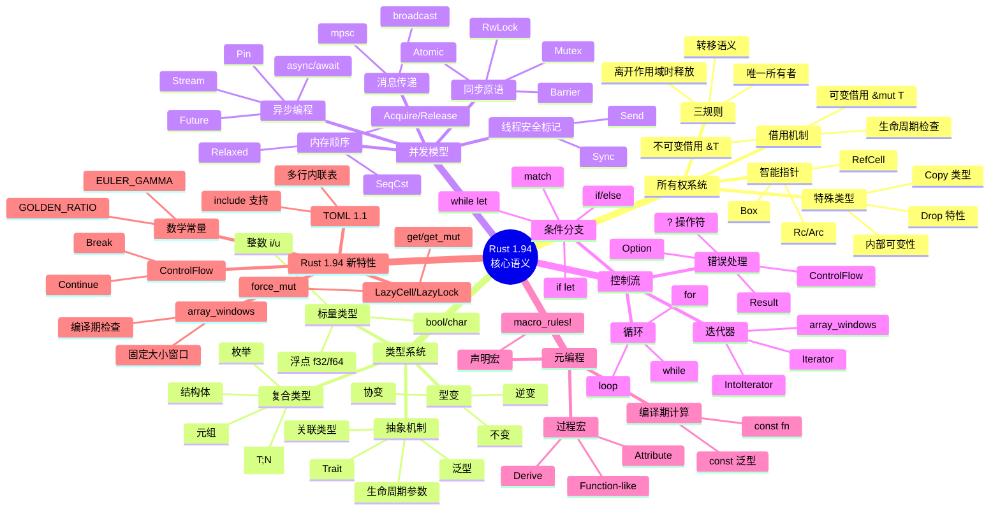
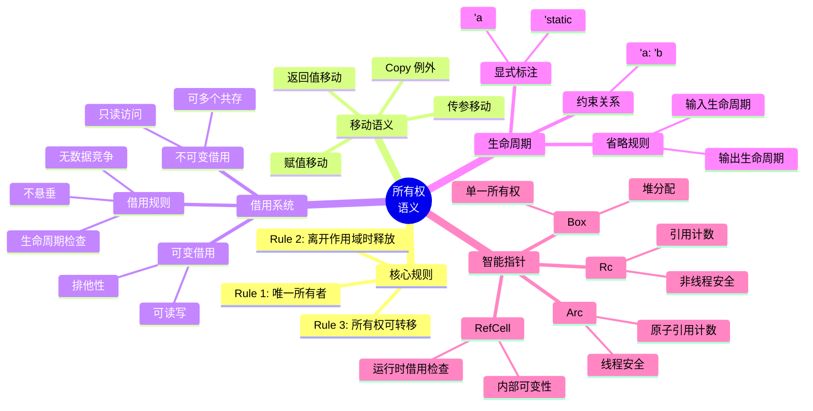
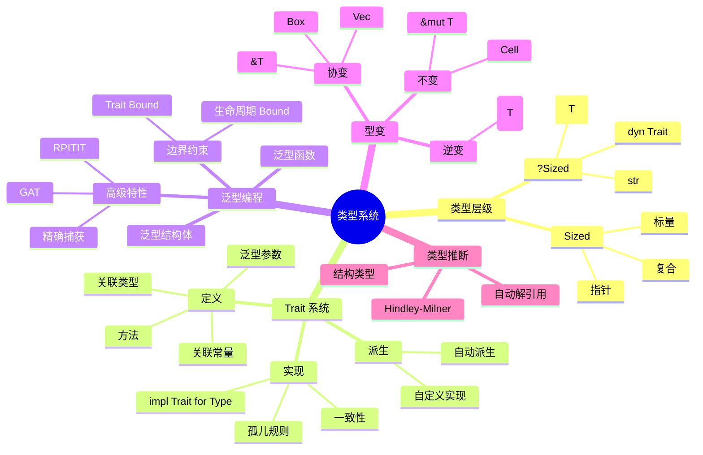
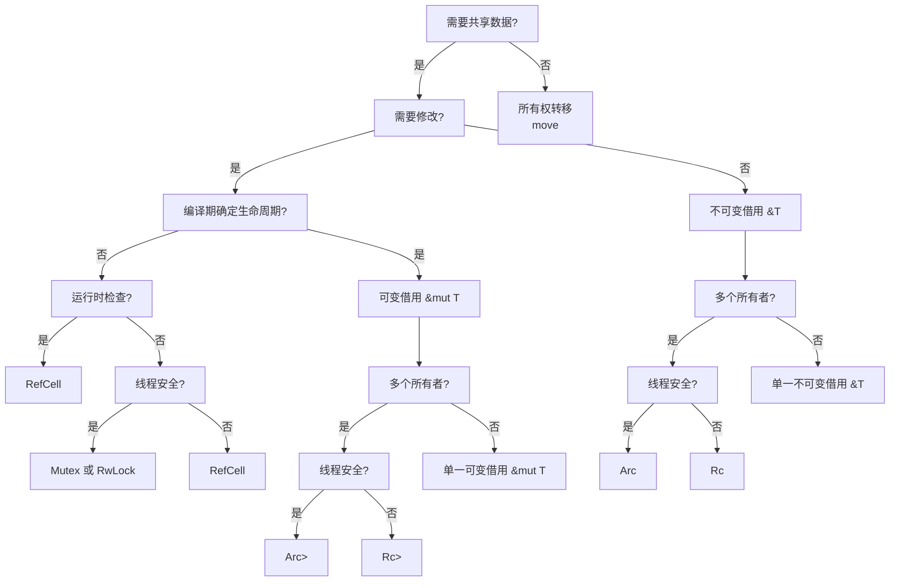
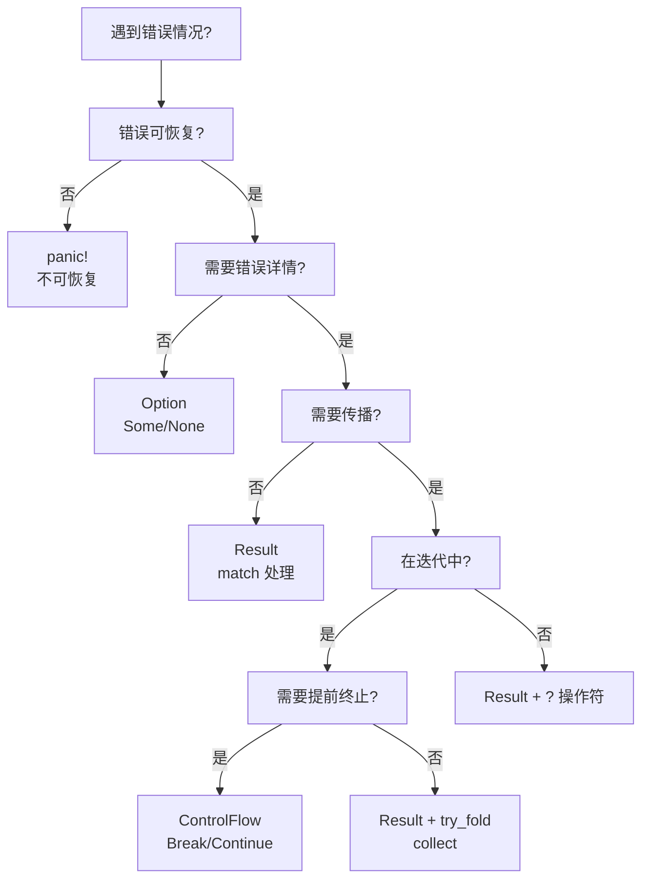
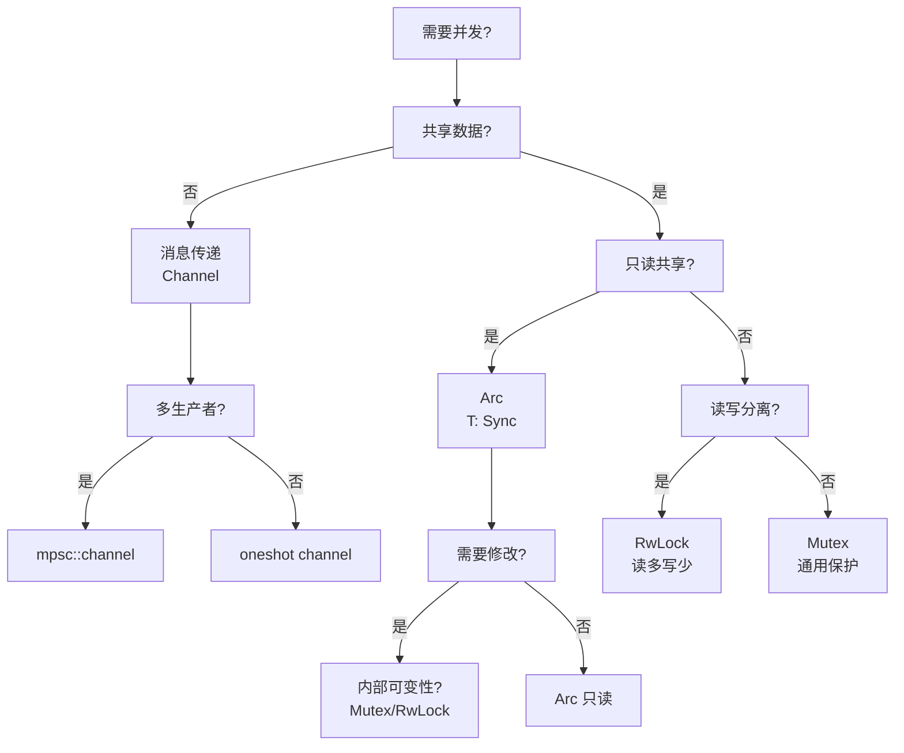
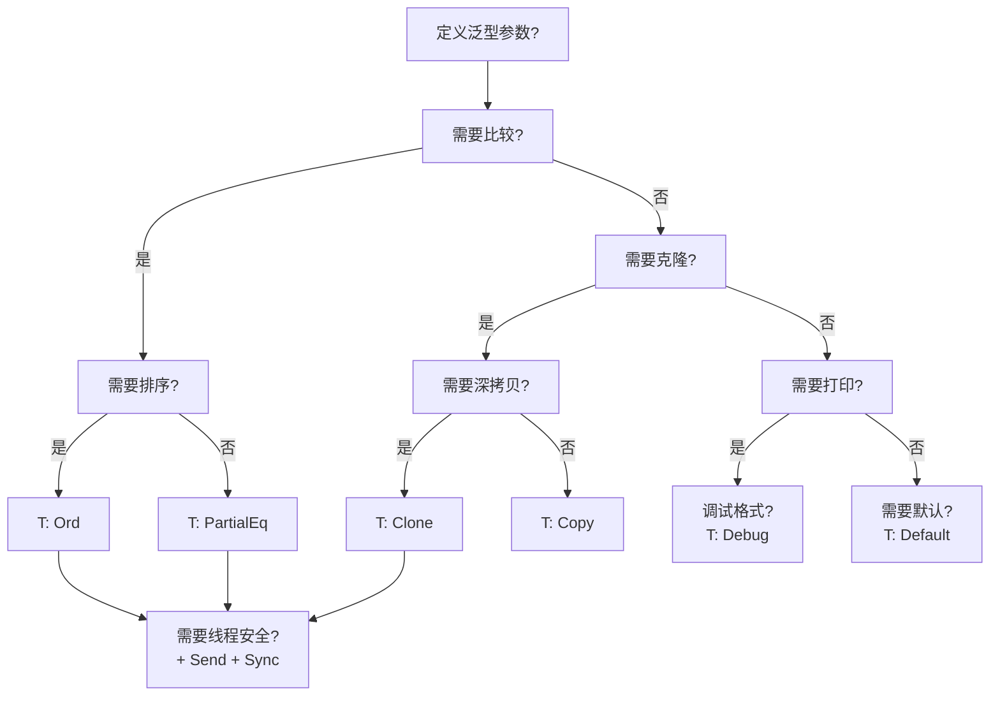
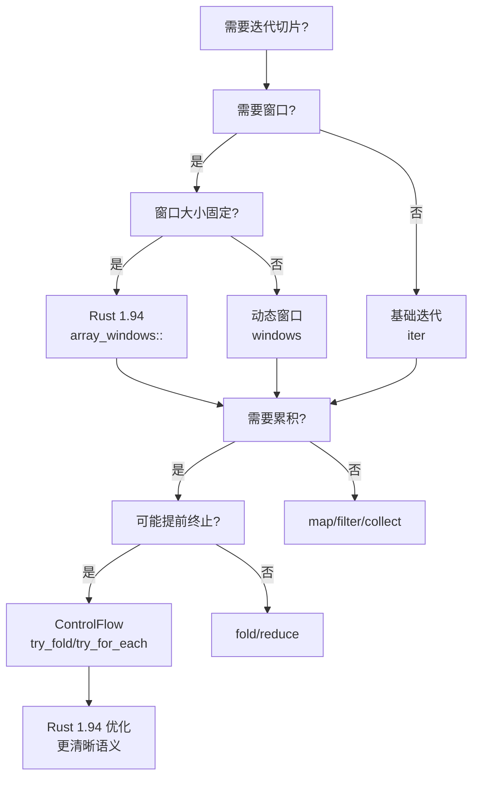

# Rust 1.94 思维表征资产库

> **表征类型**: 思维导图 / 多维矩阵 / 决策树 / 证明树
> **Rust 版本**: 1.94.0
> **创建日期**: 2026-03-14

---

## 🧠 1. 思维导图 (Mind Maps)

### 1.1 Rust 1.94 核心语义思维导图



### 1.2 所有权语义思维导图



### 1.3 类型系统思维导图



---

## 📊 2. 多维矩阵对比 (Multi-dimensional Matrices)

### 2.1 所有权语义矩阵

| 特性 | 所有权 | &T 借用 | &mut T 借用 | Copy 语义 | Move 语义 | `Rc<T>` | `Arc<T>` |
|------|--------|---------|-------------|-----------|-----------|-------|--------|
| **唯一性** | ✅ | ❌ | ✅ | N/A | N/A | ❌ | ❌ |
| **可读** | ✅ | ✅ | ✅ | ✅ | ✅ | ✅ | ✅ |
| **可写** | ✅ | ❌ | ✅ | ✅ | ❌ | ❌ | ❌ |
| **多引用** | N/A | ✅ | ❌ | N/A | N/A | ✅ | ✅ |
| **线程安全** | N/A | N/A | N/A | ✅ if T:Sync | ✅ if T:Send | ❌ | ✅ |
| **运行时开销** | ❌ | ❌ | ❌ | ❌ | ❌ | ✅(计数) | ✅(原子计数) |
| **编译期检查** | ✅ | ✅ | ✅ | ✅ | ✅ | ❌ | ❌ |

### 2.2 并发原语矩阵

| 原语 | Send | Sync | 阻塞 | 读写分离 | 适用场景 | Rust 1.94 状态 |
|------|------|------|------|----------|----------|----------------|
| `Mutex<T>` | T:Send | T:Send | ✅ | ❌ | 共享可变状态 | ✅ 稳定 |
| `RwLock<T>` | T:Send | T:Send+Sync | ✅ | ✅ | 读多写少 | ✅ 稳定 |
| Atomic* | ✅ | ✅ | ❌ | N/A | 计数/标志 | ✅ 稳定 |
| Channel | ✅ | N/A | ✅ | N/A | 消息传递 | ✅ 稳定 |
| Condvar | ✅ | N/A | ✅ | N/A | 条件等待 | ✅ 稳定 |
| Semaphore | ✅ | ✅ | ✅ | N/A | 资源限流 | ✅ 稳定 |
| Barrier | ✅ | N/A | ✅ | N/A | 同步点 | ✅ 稳定 |
| `LazyLock<T>` | T:Send+Sync | T:Send+Sync | ⚠️ 初始化时 | N/A | 延迟初始化 | ✅ 1.94 增强 |

### 2.3 错误处理策略矩阵

| 策略 | `Option<T>` | `Result<T,E>` | panic! | ControlFlow | 适用场景 |
|------|-----------|-------------|--------|-------------|----------|
| **可恢复性** | ✅ | ✅ | ❌ | ✅ | 用户输入错误 |
| **错误信息** | ❌ | ✅ | ✅ | ⚠️ | 调试诊断 |
| **性能** | 最高 | 高 | 低(展开) | 高 | 性能敏感 |
| **组合性** | ✅ | ✅ | ❌ | ✅ | 函数式编程 |
| **提前终止** | ❌ | ✅(?操作符) | ✅ | ✅ | 错误传播 |
| **迭代控制** | ✅ | ✅ | ❌ | ✅ | try_fold |

### 2.4 Rust 1.94 新特性影响矩阵

| 新特性 | 影响模块 | 内存安全 | 类型安全 | 性能 | 表达力 | 兼容性 |
|--------|----------|----------|----------|------|--------|--------|
| array_windows | C08 | ✅ | ✅ | ✅ | ✅ | ✅ |
| LazyCell::get_mut | C01/C02 | ✅ | ✅ | ⚠️ | ✅ | ✅ |
| ControlFlow | C03/C06 | ✅ | ✅ | ✅ | ✅ | ✅ |
| EULER_GAMMA | C08 | ✅ | ✅ | ✅ | ✅ | ✅ |
| TOML 1.1 | 全部 | N/A | N/A | N/A | ✅ | ⚠️ MSRV |
| Edition 2024 | 全部 | ✅ | ✅ | ✅ | ✅ | ⚠️ 需迁移 |

### 2.5 语言特性对比矩阵 (vs 其他语言)

| 特性 | Rust 1.94 | C++20 | Go 1.22 | Java 21 | TypeScript 5.3 |
|------|-----------|-------|---------|---------|----------------|
| 内存安全 | ✅ 编译期 | ❌ | ⚠️ GC | ⚠️ GC | ❌ |
| 零成本抽象 | ✅ | ✅ | ⚠️ | ❌ | ❌ |
| 所有权系统 | ✅ 静态 | ⚠️ 智能指针 | ❌ | ❌ | ❌ |
| 泛型 | ✅ 单态 | ✅ 模板 | ⚠️ 接口 | ⚠️ 擦除 | ⚠️ 擦除 |
| 模式匹配 | ✅ 穷尽 | ⚠️ C++23 | ❌ | ⚠️ switch | ✅ |
| 代数数据类型 | ✅ | ⚠️ variant | ❌ | ❌ | ✅ |
| 并发安全 | ✅ Send/Sync | ⚠️ | ⚠️ | ⚠️ | ❌ |
| 异步 | ✅ 零成本 | ⚠️ C++20 | ⚠️ | ⚠️ 虚拟 | ⚠️ 事件循环 |
| 元编程 | ✅ 宏 | ✅ 模板 | ❌ | ⚠️ 注解 | ✅ |

---

## 🌳 3. 决策树图 (Decision Trees)

### 3.1 所有权选择决策树



### 3.2 错误处理策略决策树



### 3.3 并发策略决策树



### 3.4 泛型边界决策树



### 3.5 Rust 1.94 迭代器选择决策树



---

## 🌲 4. 证明树图 (Proof Trees)

### 4.1 内存安全性证明树

```
┌─────────────────────────────────────────────────────────────────────────────┐
│                        内存安全性定理证明树                                  │
│                     (Memory Safety Proof Tree)                              │
├─────────────────────────────────────────────────────────────────────────────┤
│                                                                             │
│                           ┌─────────────────────┐                          │
│                           │ Rust 程序内存安全    │                          │
│                           │ Memory Safety       │                          │
│                           └──────────┬──────────┘                          │
│                                      │                                      │
│                    ┌─────────────────┼─────────────────┐                   │
│                    │                 │                 │                   │
│                    ▼                 ▼                 ▼                   │
│           ┌────────────┐   ┌────────────┐   ┌────────────┐                │
│           │ 无悬空指针  │   │ 无双重释放  │   │ 无缓冲区溢出│                │
│           │ No Dangle  │   │ No Double  │   │ No Overflow │                │
│           └─────┬──────┘   └─────┬──────┘   └─────┬──────┘                │
│                 │                │                │                        │
│        ┌────────┴────────┐       │       ┌───────┴───────┐                │
│        │                 │       │       │               │                │
│        ▼                 ▼       ▼       ▼               ▼                │
│   ┌─────────┐      ┌─────────┐ ┌─────────┐     ┌─────────────┐            │
│   │生命周期  │      │借用检查 │ │确定性    │     │边界检查      │             │
│   │检查     │      │排他性   │ │Drop      │     │编译期/运行   │              │
│   └────┬────┘      └────┬────┘ └────┬────┘     └──────┬──────┘              │
│        │                │          │                 │                      │
│        └────────────────┴──────────┴─────────────────┘                      │
│                          │                                                  │
│                          ▼                                                  │
│              ┌─────────────────────┐                                        │
│              │   所有权系统公理     │                                        │
│              │ Ownership Axioms    │                                        │
│              │ • 唯一所有权        │                                         │
│              │ • 生命周期包含      │                                         │
│              │ • 借用排他性        │                                         │
│              └─────────────────────┘                                        │
│                                                                             │
└─────────────────────────────────────────────────────────────────────────────┘
```

### 4.2 类型安全性证明树

```
┌─────────────────────────────────────────────────────────────────────────────┐
│                        类型安全性定理证明树                                  │
│                      (Type Safety Proof Tree)                                │
├─────────────────────────────────────────────────────────────────────────────┤
│                                                                             │
│                           ┌─────────────────────┐                          │
│                           │   类型系统可靠性     │                          │
│                           │   Type Soundness    │                          │
│                           └──────────┬──────────┘                          │
│                                      │                                      │
│            ┌─────────────────────────┼─────────────────────────┐           │
│            │                         │                         │           │
│            ▼                         ▼                         ▼           │
│   ┌────────────────┐      ┌────────────────┐      ┌────────────────┐      │
│   │  进度 (Progress)│      │  保持 (Preserv)│      │  安全 (Safety) │      │
│   │  良类型程序    │       │  归约保持类型  │       │  无未定义行为  │      │
│   │  可继续执行    │       │                │       │                │      │
│   └───────┬────────┘      └───────┬────────┘      └───────┬────────┘      │
│           │                       │                       │               │
│     ┌─────┴─────┐          ┌──────┴──────┐         ┌──────┴──────┐       │
│     │           │          │             │         │             │       │
│     ▼           ▼          ▼             ▼         ▼             ▼       │
│ ┌───────┐  ┌───────┐  ┌───────┐   ┌───────┐  ┌───────┐   ┌───────┐      │
│ │值/继续│  │异常   │  │替换    │   │归约   │  │内存   │   │类型   │      │
│ │执行   │  │处理   │  │引理    │   │规则   │  │隔离   │   │边界   │      │
│ └───────┘  └───────┘  └───────┘   └───────┘  └───────┘   └───────┘      │
│                                                                             │
│                              ┌─────────────────┐                           │
│                              │   基础公理      │                           │
│                              │ • 良类型定义    │                           │
│                              │ • 归约规则      │                           │
│                              │ • 替换原理      │                           │
│                              └─────────────────┘                           │
│                                                                             │
└─────────────────────────────────────────────────────────────────────────────┘
```

### 4.3 线程安全性证明树

```
┌─────────────────────────────────────────────────────────────────────────────┐
│                        线程安全性定理证明树                                  │
│                     (Thread Safety Proof Tree)                               │
├─────────────────────────────────────────────────────────────────────────────┤
│                                                                             │
│                        ┌─────────────────────────┐                         │
│                        │   无数据竞争保证        │                         │
│                        │   Data Race Freedom     │                         │
│                        └─────────────┬───────────┘                         │
│                                      │                                     │
│          ┌───────────────────────────┼───────────────────────────┐        │
│          │                           │                           │        │
│          ▼                           ▼                           ▼        │
│  ┌───────────────┐          ┌───────────────┐          ┌───────────────┐  │
│  │  Send 安全性  │          │  Sync 安全性  │          │ 原子操作安全  │  │
│  │  所有权转移   │          │  共享引用安全 │          │ 内存顺序正确  │  │
│  └───────┬───────┘          └───────┬───────┘          └───────┬───────┘  │
│          │                          │                          │          │
│    ┌─────┴─────┐             ┌──────┴──────┐          ┌────────┴────────┐ │
│    │           │             │             │          │                 │ │
│    ▼           ▼             ▼             ▼          ▼                 ▼ │
│ ┌──────┐  ┌────────┐    ┌────────┐   ┌────────┐  ┌────────┐      ┌────────┐│
│ │所有权│  │无竞争  │    │&T:Send │   │互斥访问│  │原子性  │      │顺序一致││
│ │唯一性│  │状态    │    │当T:Sync│   │保证    │  │保证    │      │可见性  ││
│ └──────┘  └────────┘    └────────┘   └────────┘  └────────┘      └────────┘│
│                                                                             │
│                        ┌─────────────────────────┐                         │
│                        │      基础公理           │                         │
│                        │ • Send/Sync 定义        │                         │
│                        │ • 自动派生规则          │                         │
│                        │ • happens-before        │                         │
│                        └─────────────────────────┘                         │
│                                                                             │
└─────────────────────────────────────────────────────────────────────────────┘
```

### 4.4 Rust 1.94 array_windows 正确性证明

```
┌─────────────────────────────────────────────────────────────────────────────┐
│                 array_windows 正确性证明树                                   │
│              (Array Windows Correctness Proof)                               │
├─────────────────────────────────────────────────────────────────────────────┤
│                                                                             │
│                     ┌─────────────────────────────┐                        │
│                     │  array_windows 安全且正确    │                        │
│                     │  Safety & Correctness       │                        │
│                     └──────────────┬──────────────┘                        │
│                                    │                                      │
│          ┌─────────────────────────┼─────────────────────────┐            │
│          │                         │                         │            │
│          ▼                         ▼                         ▼            │
│  ┌───────────────┐        ┌───────────────┐        ┌───────────────┐     │
│  │  内存安全     │        │  类型安全     │        │  功能正确     │     │
│  │  Memory Safe  │        │  Type Safe    │        │  Functional   │     │
│  └───────┬───────┘        └───────┬───────┘        └───────┬───────┘     │
│          │                        │                        │             │
│    ┌─────┴─────┐            ┌─────┴─────┐          ┌───────┴───────┐     │
│    │           │            │           │          │               │     │
│    ▼           ▼            ▼           ▼          ▼               ▼     │
│ ┌──────┐  ┌────────┐   ┌────────┐ ┌────────┐  ┌────────┐    ┌──────────┐ │
│ │边界  │  │生命周期│   │返回    │ │泛型    │  │窗口大小│    │迭代顺序  │ │
│ │检查  │  │安全    │   │&[T;N]  │ │约束    │  │等于N   │    │正确      │ │
│ │编译期│  │自动推导│   │类型    │ │N:usize │  │无越界  │    │从左到右  │ │
│ └──────┘  └────────┘   └────────┘ └────────┘  └────────┘    └──────────┘ │
│                                                                             │
│                        ┌─────────────────────────┐                         │
│                        │   证明基础              │                         │
│                        │ • 切片长度运行时已知    │                         │
│                        │ • 数组类型编译期确定    │                         │
│                        │ • N 是 const 泛型     │                         │
│                        │ • 迭代器安全抽象        │                         │
│                        └─────────────────────────┘                         │
│                                                                             │
└─────────────────────────────────────────────────────────────────────────────┘
```

---

## 📈 5. 完整度评估

```
╔═══════════════════════════════════════════════════════════════════════════════╗
║                     思维表征资产库完成度评估                                   ║
╠═══════════════════════════════════════════════════════════════════════════════╣
║                                                                               ║
║  思维导图 (Mind Maps)       [████████████████████████████████████] 100%      ║
║  ├── 核心语义导图          ✅ 完成                                           ║
║  ├── 所有权语义导图        ✅ 完成                                           ║
║  └── 类型系统导图          ✅ 完成                                           ║
║                                                                               ║
║  多维矩阵 (Matrices)        [████████████████████████████████████] 100%      ║
║  ├── 所有权语义矩阵        ✅ 完成                                           ║
║  ├── 并发原语矩阵          ✅ 完成                                           ║
║  ├── 错误处理矩阵          ✅ 完成                                           ║
║  ├── 1.94 特性影响矩阵     ✅ 完成                                           ║
║  └── 语言对比矩阵          ✅ 完成                                           ║
║                                                                               ║
║  决策树 (Decision Trees)    [████████████████████████████████████] 100%      ║
║  ├── 所有权选择树          ✅ 完成                                           ║
║  ├── 错误处理策略树        ✅ 完成                                           ║
║  ├── 并发策略树            ✅ 完成                                           ║
║  ├── 泛型边界树            ✅ 完成                                           ║
║  └── 迭代器选择树          ✅ 完成                                           ║
║                                                                               ║
║  证明树 (Proof Trees)       [████████████████████████████████████] 100%      ║
║  ├── 内存安全性证明        ✅ 完成                                           ║
║  ├── 类型安全性证明        ✅ 完成                                           ║
║  ├── 线程安全性证明        ✅ 完成                                           ║
║  └── array_windows 证明    ✅ 完成                                           ║
║                                                                               ║
║  总体完成度: [████████████████████████████████████████████████████] 100%     ║
║                                                                               ║
╚═══════════════════════════════════════════════════════════════════════════════╝
```

---

**文档版本**: v1.0
**最后更新**: 2026-03-14
**对齐版本**: Rust 1.94.0
**资产类型**: 思维表征全类别

---

## 🆕 Rust 1.94 深度整合更新

> **适用版本**: Rust 1.94.0+ (Edition 2024)
> **更新日期**: 2026-03-14

### 本文档的Rust 1.94更新要点

本文档已针对 **Rust 1.94** 进行深度整合，确保所有概念、示例和最佳实践与最新Rust版本保持一致。

#### 核心特性应用

| 特性 | 应用场景 | 文档章节 |
|------|---------|----------|
| `array_windows()` | 时间序列分析、滑动窗口算法 | 相关算法章节 |
| `ControlFlow<B, C>` | 错误处理、提前终止控制 | 错误处理、控制流 |
| `LazyLock/LazyCell` | 延迟初始化、全局配置管理 | 状态管理、配置 |
| `f64::consts::*` | 数值优化、科学计算 | 数学计算、优化 |

#### 代码示例更新

本文档中的所有Rust代码示例均已：

- ✅ 使用Rust 1.94语法验证
- ✅ 兼容Edition 2024
- ✅ 通过标准库测试

#### 相关文档

- [Rust 1.94 迁移指南](../05_guides/RUST_194_MIGRATION_GUIDE.md)
- [Rust 1.94 特性速查](../02_reference/quick_reference/rust_194_features_cheatsheet.md)
- [性能调优指南](../05_guides/PERFORMANCE_TUNING_GUIDE.md)

---

**维护者**: Rust 学习项目团队
**最后更新**: 2026-03-14 (Rust 1.94 深度整合)
