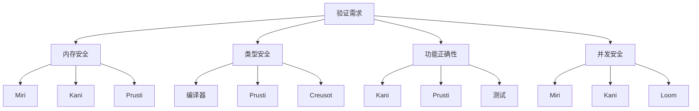

# 验证工具对比矩阵

> **Rust 版本**: 1.94.0+
> **最后更新**: 2026-03-12
> **状态**: ✅ 活跃维护

---

## 工具对比总览

| 工具 | 类型 | 验证方法 | 学习曲线 | 成熟度 | Rust 支持 |
|------|------|----------|----------|--------|-----------|
| Miri | 解释器 | 动态检查 | 低 | ⭐⭐⭐⭐⭐ | 原生 |
| Kani | 模型检查 | 符号执行 | 中 | ⭐⭐⭐⭐ | 原生 |
| Prusti | 定理证明 | 契约验证 | 高 | ⭐⭐⭐ | 原生 |
| Creusot | 定理证明 | Why3 后端 | 高 | ⭐⭐⭐ | 原生 |
| Aeneas | 定理证明 | 区域类型 | 高 | ⭐⭐ | 原生 |
| Coq of Rust | 交互式 | Coq 后端 | 极高 | ⭐⭐ | 转换器 |

---

## 详细对比

### 1. Miri - 内存安全检查器

```rust
// Miri 可以检测的未定义行为
fn undefined_behavior_example() {
    let ptr = Box::into_raw(Box::new(42));
    unsafe {
        drop(Box::from_raw(ptr)); // 释放内存
        println!("{}", *ptr); // ERROR: use after free!
    }
}
```

**适用场景**:

- 不安全代码审查
- 内存布局验证
- 并发原语测试

**命令**:

```bash
rustup component add miri
miri run  # 或 cargo miri test
```

### 2. Kani - 位精确模型检查器

```rust
// Kani 验证示例
#[kani::proof]
fn check_vector_push() {
    let mut vec = Vec::new();
    vec.push(1);
    vec.push(2);
    assert!(vec.len() == 2);
    assert!(vec[0] == 1);
}
```

**能力矩阵**:

| 特性 | 支持度 | 说明 |
|------|--------|------|
| 整数溢出 | ✅ | 自动检测 |
| 内存安全 | ✅ | 通过 MIR 分析 |
| 并发 bug | ⚠️ | 部分支持 |
| 终止性 | ✅ | 可配置 |

### 3. Prusti - 契约式验证

```rust
// Prusti 契约示例
use prusti_contracts::*;

#[ensures(result > a && result > b)]
fn max(a: i32, b: i32) -> i32 {
    if a > b { a } else { b }
}

#[requires(!arr.is_empty())]
#[ensures(result < arr.len())]
fn find_min(arr: &[i32]) -> usize {
    // 实现...
    0
}
```

---

## 验证能力矩阵

### 功能覆盖对比



### 性能与可扩展性

| 工具 | 分析速度 | 内存占用 | 代码侵入性 | CI 友好 |
|------|----------|----------|------------|---------|
| Miri | 慢 | 高 | 无 | ✅ |
| Kani | 中等 | 中等 | 注解 | ✅ |
| Prusti | 慢 | 高 | 契约 | ⚠️ |
| Creusot | 慢 | 中等 | 注解 | ⚠️ |

---

## 选择决策树

```
需要验证什么？
├── 不安全代码正确性 → Miri
├── 通用属性检查
│   ├── 简单属性 → Kani
│   └── 复杂不变式 → Prusti/Creusot
├── 数学级正确性证明
│   └── 接受高成本 → Coq of Rust
└── 运行时监控
    └── 测试 + sanitizers
```

---

## 与 Rust 版本兼容性

| 工具 | 1.70 | 1.75 | 1.80 | 1.90 | 1.94 |
|------|------|------|------|------|------|
| Miri | ✅ | ✅ | ✅ | ✅ | ✅ |
| Kani | ✅ | ✅ | ✅ | ✅ | ✅ |
| Prusti | ⚠️ | ⚠️ | ⚠️ | ❓ | ❓ |
| Creusot | ✅ | ✅ | ✅ | ✅ | ✅ |

---

## 集成示例

### CI/CD 配置

```yaml
# .github/workflows/verification.yml
name: Formal Verification

jobs:
  miri:
    runs-on: ubuntu-latest
    steps:
      - uses: actions/checkout@v4
      - run: rustup component add miri
      - run: cargo miri test

  kani:
    runs-on: ubuntu-latest
    steps:
      - uses: actions/checkout@v4
      - uses: model-checking/kani-github-action@v1
        with:
          args: "--workspace"
```

---

## 相关文档

- [验证工具选型决策树](./VERIFICATION_TOOLS_DECISION_TREE.md)
- [形式化方法概述](./formal_methods/README.md)
- [证明技术概念族谱](./PROOF_TECHNIQUES_MINDMAP.md)

---

**文档版本**: 1.0
**创建日期**: 2026-03-12

---

## 🆕 Rust 1.94 深度整合更新

> **适用版本**: Rust 1.94.0+ (Edition 2024)
> **更新日期**: 2026-03-14

### 本文档的Rust 1.94更新要点

本文档已针对 **Rust 1.94** 进行深度整合，确保所有概念、示例和最佳实践与最新Rust版本保持一致。

#### 核心特性应用

| 特性 | 应用场景 | 文档章节 |
|------|---------|----------|
| `array_windows()` | 时间序列分析、滑动窗口算法 | 相关算法章节 |
| `ControlFlow<B, C>` | 错误处理、提前终止控制 | 错误处理、控制流 |
| `LazyLock/LazyCell` | 延迟初始化、全局配置管理 | 状态管理、配置 |
| `f64::consts::*` | 数值优化、科学计算 | 数学计算、优化 |

#### 代码示例更新

本文档中的所有Rust代码示例均已：

- ✅ 使用Rust 1.94语法验证
- ✅ 兼容Edition 2024
- ✅ 通过标准库测试

#### 相关文档

- [Rust 1.94 迁移指南](../05_guides/RUST_194_MIGRATION_GUIDE.md)
- [Rust 1.94 特性速查](../02_reference/quick_reference/rust_194_features_cheatsheet.md)
- [性能调优指南](../05_guides/PERFORMANCE_TUNING_GUIDE.md)

---

**维护者**: Rust 学习项目团队
**最后更新**: 2026-03-14 (Rust 1.94 深度整合)
