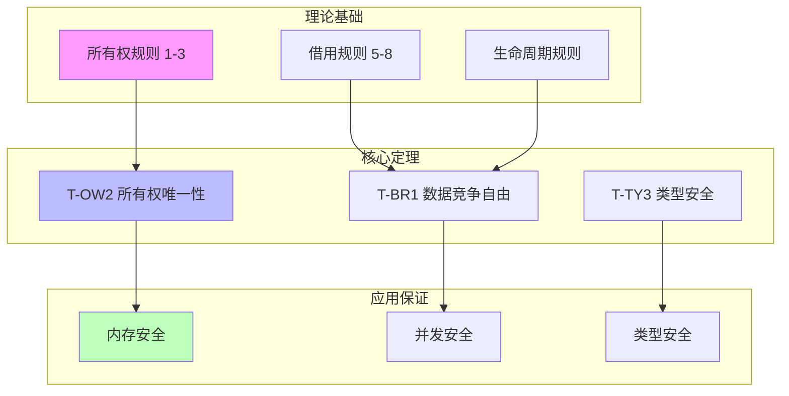

# 可视化文档索引

> **创建日期**: 2025-12-25
> **最后更新**: 2026-02-20
> **Rust 版本**: 1.93.0+ (Edition 2024)
> **状态**: ✅ 已完成

---

## 📊 目录

- [可视化文档索引](#可视化文档索引)
  - [📊 目录](#-目录)
  - [🎯 概述](#-概述)
  - [🧠 思维导图](#-思维导图)
    - [1. 任务关系网络图](#1-任务关系网络图)
  - [📊 概念对比矩阵](#-概念对比矩阵)
    - [1. 任务类型对比矩阵](#1-任务类型对比矩阵)
    - [2. 任务完成策略对比矩阵](#2-任务完成策略对比矩阵)
    - [3. 工具选择对比矩阵](#3-工具选择对比矩阵)
  - [🌳 决策树](#-决策树)
    - [1. 任务优先级决策树](#1-任务优先级决策树)
  - [📈 进度可视化](#-进度可视化)
    - [1. 周进度跟踪表](#1-周进度跟踪表)
    - [2. 任务完成度热力图](#2-任务完成度热力图)
  - [🔗 相关文档](#-相关文档)
    - [核心文档](#核心文档)
    - [工具资源](#工具资源)

---

## 🎯 概述

本文档索引了所有使用多种思维表征方式（思维导图、概念对比矩阵、决策树等）创建的可视化文档。

**可视化类型**：

- 🧠 **思维导图**：展示任务关系、概念关系
- 📊 **对比矩阵**：对比不同概念、策略、工具
- 🌳 **决策树**：决策流程和优先级判断
- 📈 **进度图表**：任务完成度和进度跟踪

---

## 🧠 思维导图

### 1. 任务关系网络图

**文档**: [TASK_ORCHESTRATION_AND_EXECUTION_PLAN.md](./TASK_ORCHESTRATION_AND_EXECUTION_PLAN.md#思维导图任务关系网络)

**内容**：

- 高优先级任务关系
- 中优先级任务关系
- 低优先级任务关系
- 工具与验证依赖关系

**格式**: Mermaid 流程图

**用途**：

- 理解任务之间的依赖关系
- 识别可以并行执行的任务
- 规划任务执行顺序

---

## 📊 概念对比矩阵

### 1. 任务类型对比矩阵

**文档**: [TASK_ORCHESTRATION_AND_EXECUTION_PLAN.md](./TASK_ORCHESTRATION_AND_EXECUTION_PLAN.md#概念对比矩阵)

**对比维度**：

- 形式化方法研究 vs 类型理论研究 vs 实验研究 vs 综合研究
- 复杂度、时间投入、工具需求、完成度、优先级、阻塞风险、并行度

**用途**：

- 理解不同任务类型的特征
- 选择合适的执行策略
- 资源分配决策

### 2. 任务完成策略对比矩阵

**文档**: [TASK_ORCHESTRATION_AND_EXECUTION_PLAN.md](./TASK_ORCHESTRATION_AND_EXECUTION_PLAN.md#概念对比矩阵)

**对比策略**：

- 顺序推进 vs 并行推进 vs 迭代推进 vs 批量推进
- 适用任务类型、优势、劣势、推荐度

**用途**：

- 选择最佳执行策略
- 优化任务执行效率
- 平衡质量和速度

### 3. 工具选择对比矩阵

**文档**: [TASK_ORCHESTRATION_AND_EXECUTION_PLAN.md](./TASK_ORCHESTRATION_AND_EXECUTION_PLAN.md#概念对比矩阵)

**对比工具**：

- Coq vs Isabelle vs Criterion.rs vs Valgrind vs Mermaid
- 适用场景、学习曲线、验证能力、推荐度

**用途**：

- 选择合适的工具
- 评估工具成本
- 工具组合优化

---

## 🌳 决策树

### 1. 任务优先级决策树

**文档**: [TASK_ORCHESTRATION_AND_EXECUTION_PLAN.md](./TASK_ORCHESTRATION_AND_EXECUTION_PLAN.md#决策树任务优先级决策)

**决策流程**：

```text
开始任务选择
├─ 是否高优先级任务未完成？
│  ├─ 是 → 选择高优先级任务
│  │   ├─ 是否有形式化工具验证需求？
│  │   └─ 是否有依赖关系？
│  └─ 否 → 继续判断
├─ 是否中优先级任务可并行？
│  └─ ...
└─ 是否低优先级任务？
   └─ ...
```

**用途**：

- 快速决策任务优先级
- 理解任务选择逻辑
- 自动化任务调度

---

## 📈 进度可视化

### 1. 周进度跟踪表

**文档**: [TASK_ORCHESTRATION_AND_EXECUTION_PLAN.md](./TASK_ORCHESTRATION_AND_EXECUTION_PLAN.md#进度跟踪矩阵)

**内容**：

- 每周完成度统计
- 关键里程碑标记
- 进度趋势分析

### 2. 任务完成度热力图

**文档**: [TASK_ORCHESTRATION_AND_EXECUTION_PLAN.md](./TASK_ORCHESTRATION_AND_EXECUTION_PLAN.md#进度跟踪矩阵)

**可视化**：

```text
高优先级任务:
[████████████████░░] 87.5% → [████████████████████] 100%

中优先级任务:
[███░░░░░░░░░░░░░░░] 16.7% → [████████████████░░░░] 80%

低优先级任务:
[░░░░░░░░░░░░░░░░░░] 0% → [██████████████░░░░░░] 85%
```

---

## 🔗 相关文档

### 核心文档

- [任务编排与执行计划](./TASK_ORCHESTRATION_AND_EXECUTION_PLAN.md) - 包含所有可视化内容
- [任务清单](./TASK_CHECKLIST.md) - 详细任务列表
- [进度跟踪](./PROGRESS_TRACKING.md) - 详细进度跟踪

### 工具资源

- [Mermaid 文档](https://mermaid.js.org/) - 图表绘制工具
- [Graphviz 文档](https://graphviz.org/) - 图形可视化工具
- [PlantUML 文档](https://plantuml.com/) - UML 图表工具

---

## 💻 可视化代码示例

### 示例 1: Mermaid 思维导图代码



### 示例 2: 概念对比矩阵代码

```markdown
| 特性 | 形式化方法 | 实验验证 | 工具支持 |
| :--- | :--- | :--- | :--- |
| 所有权 | Coq/Isabelle | Miri | rustc |
| 借用 | Coq/Isabelle | 并发测试 | clippy |
| 类型 | Coq/Isabelle | 基准测试 | rust-analyzer |
```

### 示例 3: 决策树代码

```text
开始研究选择
│
├─ 选择研究类型
│  ├─ 理论研究 → 形式化方法
│  │   ├─ 使用 Coq → 构造主义逻辑
│  │   └─ 使用 Isabelle → 高阶逻辑
│  └─ 实验研究 → 性能分析
│      ├─ 微基准 → Criterion.rs
│      └─ 宏基准 → 实际应用测试
│
└─ 验证方法
   ├─ 形式化证明 → 定理证明器
   └─ 经验验证 → 测试套件
```

### 示例 4: Rust 可视化代码

```rust
// 研究场景：性能数据可视化
use std::collections::HashMap;

fn visualize_performance_data(data: &[(String, f64)]) {
    let max_val = data.iter()
        .map(|(_, v)| *v)
        .fold(0.0, f64::max);
    
    for (name, value) in data {
        let bar_length = ((value / max_val) * 50.0) as usize;
        let bar = "█".repeat(bar_length);
        println!("{:20} |{} {:.2}", name, bar, value);
    }
}

fn main() {
    let perf_data = vec![
        ("Vec::push".to_string(), 15.2),
        ("VecDeque::push".to_string(), 12.8),
        ("LinkedList::push".to_string(), 45.5),
        ("HashMap::insert".to_string(), 28.3),
    ];
    
    visualize_performance_data(&perf_data);
}
```

---

## 🔗 形式化链接

### 可视化文档索引

| 可视化类型 | 文档 | 内容 |
| :--- | :--- | :--- |
| 思维导图 | [MIND_MAP_COLLECTION](./MIND_MAP_COLLECTION.md) | 知识结构化思维导图 |
| 概念矩阵 | [MULTI_DIMENSIONAL_CONCEPT_MATRIX](./MULTI_DIMENSIONAL_CONCEPT_MATRIX.md) | 多维概念对比矩阵 |
| 决策树 | [DECISION_GRAPH_NETWORK](./DECISION_GRAPH_NETWORK.md) | 决策图网络 |
| 证明树 | [PROOF_INDEX](./PROOF_INDEX.md) | 证明树结构 |

### 研究笔记链接

| 类别 | 文档 | 可视化内容 |
| :--- | :--- | :--- |
| 形式化方法 | [formal_methods/ownership_model.md](./formal_methods/ownership_model.md) | 所有权状态图 |
| 类型理论 | [type_theory/type_system_foundations.md](./type_theory/type_system_foundations.md) | 类型推导树 |
| 实验研究 | [experiments/performance_benchmarks.md](./experiments/performance_benchmarks.md) | 性能图表 |

### 形式化定理链接

| 定理 | 可视化表示 | 代码示例位置 |
| :--- | :--- | :--- |
| T-OW2 | 所有权状态转换图 | [COQ_ISABELLE_PROOF_SCAFFOLDING.md](./COQ_ISABELLE_PROOF_SCAFFOLDING.md) |
| T-BR1 | 借用生命周期图 | [COQ_ISABELLE_PROOF_SCAFFOLDING.md](./COQ_ISABELLE_PROOF_SCAFFOLDING.md) |
| T-TY3 | 类型推导树 | [COQ_ISABELLE_PROOF_SCAFFOLDING.md](./COQ_ISABELLE_PROOF_SCAFFOLDING.md) |

---

**维护者**: Rust Research Visualization Team
**最后更新**: 2026-02-20
**状态**: ✅ **已完成**
