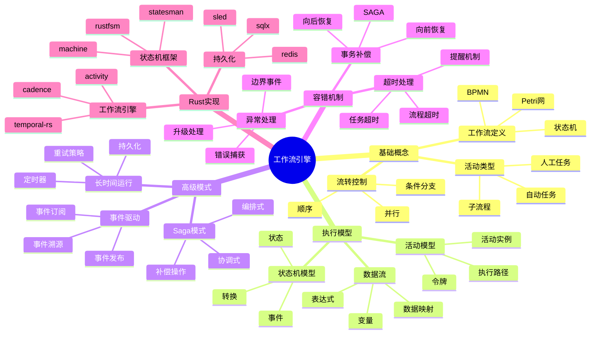

# 工作流引擎概念族谱

> **Rust 版本**: 1.94.0+
> **最后更新**: 2026-03-12
> **状态**: ✅ 活跃维护

---

## 概念族谱概览



---

## 核心概念详解

### 1. 工作流定义语言

| 标准 | 特点 | 适用场景 |
|------|------|----------|
| BPMN 2.0 | 图形化、标准化 | 业务流程 |
| DMN | 决策表 | 业务规则 |
| CMMN | 案例管理 | 知识工作 |

### 2. 状态机实现

```rust
// Rust 状态机 DSL 示例
use state_machine_procmacro::fsm;

fsm! {
    enum OrderWorkflow {
        InitialState = Created,
        Created {
            submit -> Submitted,
            cancel -> Cancelled,
        },
        Submitted {
            approve -> Approved,
            reject -> Rejected,
        },
        Approved {
            ship -> Shipped,
        },
        Shipped {
            deliver -> Completed,
        },
        Rejected, Completed, Cancelled: Terminal,
    }
}
```

### 3. Saga 模式实现

```rust
// Saga 编排器
trait SagaActivity {
    type Input;
    type Output;
    type Error;

    async fn execute(&self, input: Self::Input) -> Result<Self::Output, Self::Error>;
    async fn compensate(&self, output: Self::Output) -> Result<(), Self::Error>;
}

struct SagaOrchestrator {
    activities: Vec<Box<dyn SagaActivity>>,
    executed: Vec<Box<dyn Any>>, // 记录执行结果用于补偿
}

impl SagaOrchestrator {
    async fn execute(&mut self) -> Result<(), SagaError> {
        for activity in &self.activities {
            match activity.execute(()).await {
                Ok(output) => self.executed.push(Box::new(output)),
                Err(e) => {
                    self.compensate().await;
                    return Err(SagaError::ActivityFailed(e));
                }
            }
        }
        Ok(())
    }

    async fn compensate(&mut self) {
        for (activity, output) in self.activities.iter().zip(&self.executed).rev() {
            let _ = activity.compensate(()).await;
        }
    }
}
```

---

## Rust 工作流工具链

### 框架对比

| 框架 | 类型 | 持久化 | 适用场景 |
|------|------|--------|----------|
| temporal-rs | 完整引擎 | 内置 | 长时间运行 |
| activity | 轻量级 | 可选 | 简单工作流 |
| rustfsm | 状态机 | 无 | 嵌入式逻辑 |

### 与 Tokio 集成

```rust
use tokio::time::{sleep, Duration};
use tokio::sync::mpsc;

struct WorkflowEngine {
    task_queue: mpsc::Receiver<Task>,
    state_store: sled::Db,
}

impl WorkflowEngine {
    async fn run(&mut self) {
        while let Some(task) = self.task_queue.recv().await {
            tokio::spawn(async move {
                execute_task(task).await
            });
        }
    }
}
```

---

## 工作流模式实现

### 1. 并行分支

```rust
use futures::future::join_all;

async fn parallel_branch(activities: Vec<Activity>) -> Vec<Result<Output, Error>> {
    let handles: Vec<_> = activities
        .into_iter()
        .map(|act| tokio::spawn(async move { act.execute().await }))
        .collect();

    join_all(handles).await
        .into_iter()
        .map(|r| r.unwrap_or_else(|e| Err(Error::Join(e))))
        .collect()
}
```

### 2. 定时器与延迟

```rust
use tokio::time::{sleep_until, Instant};

struct TimerActivity {
    deadline: Instant,
}

impl TimerActivity {
    async fn execute(&self) -> TimerResult {
        sleep_until(self.deadline).await;
        TimerResult::Expired
    }
}
```

### 3. 事件驱动工作流

```rust
use tokio::sync::broadcast;

struct EventDrivenWorkflow {
    event_bus: broadcast::Sender<WorkflowEvent>,
    state: WorkflowState,
}

impl EventDrivenWorkflow {
    async fn run(mut self) {
        let mut rx = self.event_bus.subscribe();

        loop {
            match rx.recv().await {
                Ok(event) => self.handle_event(event).await,
                Err(_) => break,
            }
        }
    }
}
```

---

## 相关文档

- [工作流引擎决策树](./formal_methods/WORKFLOW_ENGINE_DECISION_TREE.md)
- [工作流引擎矩阵](./formal_methods/WORKFLOW_ENGINES_MATRIX.md)
- [软件设计理论 - 工作流](./software_design_theory/02_workflow_safe_complete_models/README.md)

---

**文档版本**: 1.0
**创建日期**: 2026-03-12
