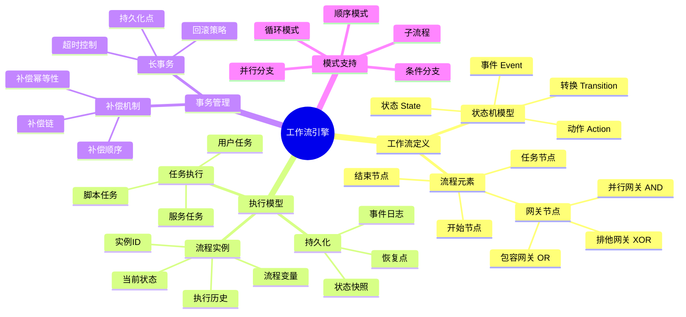

# 工作流引擎概念族谱

> **创建日期**: 2026-03-08
> **版本**: v1.0
> **描述**: 工作流引擎核心概念的完整族谱

---

## 🧬 核心概念族谱

---

## 📊 概念关系矩阵

| 概念A | 关系 | 概念B | 说明 |
|-------|------|-------|------|
| State Machine | models | Workflow | 状态机模型建模工作流 |
| Compensation | reverses | Task | 补偿撤销任务效果 |
| Gateway | controls | Flow | 网关控制流程分支 |
| Persistence Point | saves | State | 持久化点保存状态 |
| Instance | instantiates | Definition | 实例化定义 |

---

## 🎯 核心定理映射

| 定理编号 | 定理名称 | 相关概念 |
|----------|----------|----------|
| T-WF1 | 工作流活性定理 | State Machine |
| T-WF2 | 状态一致性定理 | Instance, State |
| T-CC1 | 补偿一致性定理 | Compensation Chain |
| T-CC2 | 部分补偿安全性定理 | Compensation |
| T-LT1 | 故障可恢复性定理 | Persistence Point |
| T-LT2 | 最终一致性定理 | Long Running Transaction |

---

## 🌿 概念层次结构

### Level 1: 基础模型

- 状态机 (State Machine)
- 流程定义 (Workflow Definition)
- 流程实例 (Instance)

### Level 2: 控制结构

- 任务 (Task)
- 网关 (Gateway)
- 事件 (Event)

### Level 3: 事务管理

- 补偿 (Compensation)
- 长事务 (LRT)
- 持久化 (Persistence)

### Level 4: 高级特性

- 子流程 (Sub-process)
- 动态流程
- 分布式工作流

---

## 🔗 与Rust示例的映射

| 概念 | 形式化定义 | Rust实现 |
|------|-----------|----------|
| 工作流状态机 | `02_workflow/01_workflow_state_machine.md` | 见文档内代码 |
| 补偿链 | `02_workflow/02_compensation_chain.md` | 见文档内代码 |
| 长事务 | `02_workflow/03_long_running_transaction.md` | 见文档内代码 |

---

## 📚 相关文档

- [工作流状态机形式化](./software_design_theory/02_workflow/01_workflow_state_machine.md)
- [补偿链形式化](./software_design_theory/02_workflow/02_compensation_chain.md)
- [长事务形式化](./software_design_theory/02_workflow/03_long_running_transaction.md)
- [工作流引擎决策树](./WORKFLOW_ENGINE_DECISION_TREE.md)
- [工作流引擎矩阵](./WORKFLOW_ENGINES_MATRIX.md)
