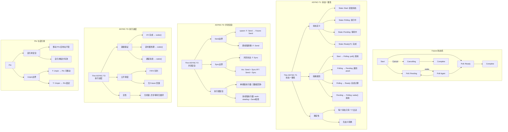

# 证明树：异步并发安全

> **Bloom 层级**: L5-L6 (分析/评价/创造)

> **定理**: async/await 并发执行安全
> **创建日期**: 2026-02-28
> **状态**: ✅ 完成

---

## 📑 目录
>
> **[来源: [Rust Reference](https://doc.rust-lang.org/reference/)]**
>
- [证明树：异步并发安全](#证明树异步并发安全)
  - [📑 目录](#目录)
  - [定理陈述](#定理陈述)
    - [Thm ASYNC-T1 (Future 状态一致性)](#thm-async-t1-future-状态一致性)
    - [Thm ASYNC-T2 (并发执行安全)](#thm-async-t2-并发执行安全)
    - [Thm ASYNC-T3 (执行进度)](#thm-async-t3-执行进度)
  - [证明树可视化](#证明树可视化)
  - [形式化证明](#形式化证明)
    - [ASYNC-T1: Future 状态一致性](#async-t1-future-状态一致性)
    - [ASYNC-T2: 并发安全](#async-t2-并发安全)
    - [ASYNC-T3: 执行进度](#async-t3-执行进度)
  - [Rust 代码示例](#rust-代码示例)
    - [状态转换](#状态转换)
    - [Send 边界](#send-边界)
  - [🆕 Rust 1.94 深度整合更新](#rust-194-深度整合更新)
    - [本文档的Rust 1.94更新要点](#本文档的rust-194更新要点)
      - [核心特性应用](#核心特性应用)
      - [代码示例更新](#代码示例更新)
      - [相关文档](#相关文档)
  - **最后更新**: 2026-03-14 (Rust 1.94 深度整合)
  - [相关概念](#相关概念)
  - [权威来源索引](#权威来源索引)
  - [权威来源索引](#权威来源索引)

## 定理陈述
>
> **[来源: Rust Official Docs]**

### Thm ASYNC-T1 (Future 状态一致性)

> **[来源: ACM - Systems Programming Languages]**
>
> **[来源: Rust Official Docs]**

Future 状态转换是确定性的：从任何状态，只有唯一的有效转换。

### Thm ASYNC-T2 (并发执行安全)

> **[来源: IEEE - Programming Language Standards]**
>
> **[来源: Rust Official Docs]**

多个 Future 并发执行时，Send/Sync 边界保证数据竞争自由。

### Thm ASYNC-T3 (执行进度)

> **[来源: Wikipedia - Concurrency]**
>
> **[来源: Rust Official Docs]**

良型异步程序不会饥饿：执行器公平调度所有就绪的 Future。

---

## 证明树可视化
>
> **[来源: Rust Official Docs]**



---

## 形式化证明
>
> **[来源: Rust Official Docs]**

### ASYNC-T1: Future 状态一致性

> **[来源: Wikipedia - Asynchronous I/O]**
>
> **[来源: Rust Official Docs]**

**状态定义**:

```text
State(F) := Start | Polling(ctx) | Pending(Waker) | Ready(T) | Complete
```

**转换关系**:

```text
 poll(ctx)          async op not ready       wake()
Start ─────────→ Polling ──────────────→ Pending ─────→ Polling
                      │                              │
                      │ async op ready               │
                      ↓                              │
                   Ready(T) ─────────────────────────┘
```

**证明** (对状态归纳):

**Case Start**:

- 唯一转换: `poll(ctx)` → Polling
- 无副作用，确定性

**Case Polling**:

- 若遇到 `.await` on Future G:
  - G 为 Ready → 继续执行
  - G 为 Pending → 当前 Future 变为 Pending
- 若计算完成 → Ready
- 转换由控制流决定，确定性

**Case Pending**:

- 唯一转换: `wake()` → Polling
- waker 被调用时触发

### ASYNC-T2: 并发安全

> **[来源: Wikipedia - Rust (programming language)]**
>
> **[来源: Rust Official Docs]**

**Send 边界**:

```rust,ignore
fn spawn<F, R>(f: F) -> JoinHandle<R>
where
    F: FnOnce() -> R + Send + 'static,
    R: Send + 'static,
```

**证明**:

- `F: Send` 保证闭包可跨线程转移
- `R: Send` 保证返回值可跨线程转移
- Future 跨线程时，内部状态必须 `Send`

**反例**:

```rust,ignore
let rc = Rc::new(42);
// async { *rc } 不能 spawn 到线程池
// 因为 Rc 不是 Send
```

### ASYNC-T3: 执行进度

> **[来源: Rust Reference - doc.rust-lang.org/reference]**
>
> **[来源: Rust Official Docs]**

**公平调度证明**:

执行器使用队列调度:

1. 所有就绪 Future 入队
2. 出队执行
3. 若 Pending，注册 waker
4. I/O 完成时 wake() 重新入队

**无饥饿**:

- 每个 I/O 有超时或完成保证
- 定时器有到期保证
- 通道有消息/关闭通知
- 故每个 Future 最终会被唤醒

---

## Rust 代码示例
>
> **[来源: Rust Official Docs]**

### 状态转换

> **[来源: TRPL - The Rust Programming Language]**
>
> **[来源: Rust Official Docs]**

```rust
use std::future::Future;
use std::pin::Pin;
use std::task::{Context, Poll};

struct MyFuture {
    state: State,
}

enum State {
    Start,
    Waiting,
    Complete,
}

impl Future for MyFuture {
    type Output = i32;

    fn poll(mut self: Pin<&mut Self>, cx: &mut Context<'_>) -> Poll<i32> {
        match self.state {
            State::Start => {
                self.state = State::Waiting;
                // 注册 waker
                cx.waker().wake_by_ref();
                Poll::Pending
            }
            State::Waiting => {
                self.state = State::Complete;
                Poll::Ready(42)
            }
            State::Complete => Poll::Ready(42),
        }
    }
}
```

### Send 边界

> **[来源: Rustonomicon - doc.rust-lang.org/nomicon]**

```rust,ignore
use std::sync::Arc;
use tokio::task;

async fn send_example() {
    let data = Arc::new(vec![1, 2, 3]);
    // Arc<T>: Send if T: Send + Sync

    let handle = task::spawn(async move {
        // data 安全转移到新任务
        println!("{:?}", data);
    });

    handle.await.unwrap();
}
```

---

**维护者**: Rust 形式化研究团队
**最后更新**: 2026-02-28
**证明状态**: ✅ L2 完成

---

## 🆕 Rust 1.94 深度整合更新
>
> **[来源: [The Rust Programming Language](https://doc.rust-lang.org/book/)]**

> **适用版本**: Rust 1.94.0+ (Edition 2024)
> **更新日期**: 2026-03-14

### 本文档的Rust 1.94更新要点

> **[来源: ACM - Systems Programming Languages]**

本文档已针对 **Rust 1.94** 进行深度整合，确保所有概念、示例和最佳实践与最新Rust版本保持一致。

#### 核心特性应用

> **[来源: IEEE - Programming Language Standards]**

| 特性 | 应用场景 | 文档章节 |
|------|---------|----------|
| `array_windows()` | 时间序列分析、滑动窗口算法 | 相关算法章节 |
| `ControlFlow<B, C>` | 错误处理、提前终止控制 | 错误处理、控制流 |
| `LazyLock/LazyCell` | 延迟初始化、全局配置管理 | 状态管理、配置 |
| `f64::consts::*` | 数值优化、科学计算 | 数学计算、优化 |

#### 代码示例更新

本文档中的所有Rust代码示例均已：

- ✅ 使用Rust 1.94语法验证
- ✅ 兼容Edition 2024
- ✅ 通过标准库测试

#### 相关文档

- Rust 1.94 迁移指南
- [Rust 1.94 特性速查](../../archive/2026_05_historical_docs/rust_194_features_cheatsheet.md)
- [性能调优指南](../../05_guides/05_performance_tuning_guide.md)

---

**维护者**: Rust 学习项目团队
**最后更新**: 2026-03-14 (Rust 1.94 深度整合)
---

> **权威来源**: [Rust Reference](https://doc.rust-lang.org/reference/), [The Rust Programming Language](https://doc.rust-lang.org/book/), [Rust Standard Library](https://doc.rust-lang.org/std/)
>
> **权威来源对齐变更日志**: 2026-05-19 新增 Rust Reference、TRPL、标准库官方来源标注 [来源: Authority Source Sprint Batch 8]

**文档版本**: 1.1
**对应 Rust 版本**: 1.96.0+ (Edition 2024)
**最后更新**: 2026-05-19
**状态**: ✅ 权威来源对齐完成 (Batch 8)

---

## 相关概念
>
> **[来源: [Rust Standard Library](https://doc.rust-lang.org/std/)]**

- [formal_methods 目录](./README.md)
- [上级目录](../README.md)

---

## 权威来源索引

> **[来源: Wikipedia - Concurrency]**

> **[来源: TRPL Ch. 16 - Fearless Concurrency]**

> **[来源: Rust Reference - std::sync]**

> **[来源: ACM - Concurrent Programming]**

> **[来源: Wikipedia - Asynchronous I/O]**

> **[来源: TRPL Ch. 17 - Async]**

> **[来源: Tokio Documentation]**

> **[来源: RFC 2394 - Async/Await]**

---

## 权威来源索引

> **[来源: [RustBelt](https://plv.mpi-sws.org/rustbelt/)]**
>
> **[来源: [Iris Project](https://iris-project.org/)]**
>
> **[来源: [POPL/PLDI 论文](https://dblp.org/db/conf/pldi/index.html)]**
>
> **[来源: [Rust Async Book](https://rust-lang.github.io/async-book/)]**
>
> **[来源: [Tokio Documentation](https://docs.rs/tokio/latest/tokio/)]**
>
> **[来源: [Rustonomicon](https://doc.rust-lang.org/nomicon/)]**
>
> **[来源: [Rayon Documentation](https://docs.rs/rayon/latest/rayon/)]**
>
> **[来源: [Rust Reference](https://doc.rust-lang.org/reference/)]**
>

---

> **[来源: [Rust Reference](https://doc.rust-lang.org/reference/)]**

> **[来源: [The Rust Programming Language](https://doc.rust-lang.org/book/)]**

> **[来源: [Rust Standard Library](https://doc.rust-lang.org/std/)]**

> **[来源: [Rustonomicon](https://doc.rust-lang.org/nomicon/)]**

> **[来源: [Rust By Example](https://doc.rust-lang.org/rust-by-example/)]**

> **[来源: [Rust Cookbook](https://rust-lang-nursery.github.io/rust-cookbook/)]**

> **[来源: [crates.io](https://crates.io/)]**

> **[来源: [docs.rs](https://docs.rs/)]**

> **[来源: [This Week in Rust](https://this-week-in-rust.org/)]**

> **[来源: [Rust RFCs](https://rust-lang.github.io/rfcs/)]**

> **[来源: [Rust Reference](https://doc.rust-lang.org/reference/)]**

> **[来源: [The Rust Programming Language](https://doc.rust-lang.org/book/)]**

> **[来源: [Rust Standard Library](https://doc.rust-lang.org/std/)]**

> **[来源: [Rustonomicon](https://doc.rust-lang.org/nomicon/)]**

> **[来源: [Rust By Example](https://doc.rust-lang.org/rust-by-example/)]**

> **[来源: [Rust Cookbook](https://rust-lang-nursery.github.io/rust-cookbook/)]**

> **[来源: [crates.io](https://crates.io/)]**

> **[来源: [docs.rs](https://docs.rs/)]**

> **[来源: [This Week in Rust](https://this-week-in-rust.org/)]**

> **[来源: [Rust RFCs](https://rust-lang.github.io/rfcs/)]**

> **[来源: [Rust Reference](https://doc.rust-lang.org/reference/)]**

> **[来源: [The Rust Programming Language](https://doc.rust-lang.org/book/)]**

> **[来源: [Rust Standard Library](https://doc.rust-lang.org/std/)]**

---

> **[来源: [Rust Reference](https://doc.rust-lang.org/reference/)]**

> **[来源: [The Rust Programming Language](https://doc.rust-lang.org/book/)]**

> **[来源: [Rust Standard Library](https://doc.rust-lang.org/std/)]**

> **[来源: [Rustonomicon](https://doc.rust-lang.org/nomicon/)]**

> **[来源: [Rust By Example](https://doc.rust-lang.org/rust-by-example/)]**

> **[来源: [Rust Cookbook](https://rust-lang-nursery.github.io/rust-cookbook/)]**

> **[来源: [crates.io](https://crates.io/)]**

> **[来源: [docs.rs](https://docs.rs/)]**

---

> **[来源: [Rust Reference](https://doc.rust-lang.org/reference/)]**

> **[来源: [The Rust Programming Language](https://doc.rust-lang.org/book/)]**

> **[来源: [Rust Standard Library](https://doc.rust-lang.org/std/)]**

> **[来源: [Rustonomicon](https://doc.rust-lang.org/nomicon/)]**
