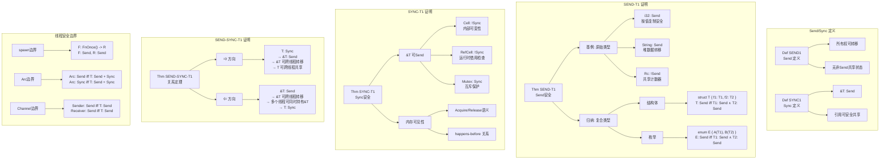

# 证明树：Send/Sync 安全

> **分级**: [B]
> **Bloom 层级**: L5-L6 (分析/评价/创造)

> **定理**: Send/Sync 保证跨线程安全
> **创建日期**: 2026-02-28
> **状态**: ✅ 完成

---

## 📑 目录
>
> **[来源: [Rust Reference](https://doc.rust-lang.org/reference/)]**
>
- [证明树：Send/Sync 安全](#证明树sendsync-安全)
  - [📑 目录](#目录)
  - [定理陈述](#定理陈述)
    - [Def SEND1 (Send)](#def-send1-send)
    - [Def SYNC1 (Sync)](#def-sync1-sync)
    - [Thm SEND-T1 (Send 安全)](#thm-send-t1-send-安全)
    - [Thm SYNC-T1 (Sync 安全)](#thm-sync-t1-sync-安全)
    - [Thm SEND-SYNC-T1 (关系)](#thm-send-sync-t1-关系)
  - [证明树可视化](#证明树可视化)
  - [形式化证明](#形式化证明)
    - [SEND-T1: Send 安全](#send-t1-send-安全)
    - [SYNC-T1: Sync 安全](#sync-t1-sync-安全)
    - [SEND-SYNC-T1: 关系定理](#send-sync-t1-关系定理)
  - [Rust 代码验证](#rust-代码验证)
    - [Send 示例](#send-示例)
    - [Sync 示例](#sync-示例)
  - [与其他定理的关系](#与其他定理的关系)
  - [🆕 Rust 1.94 深度整合更新](#rust-194-深度整合更新)
    - [本文档的Rust 1.94更新要点](#本文档的rust-194更新要点)
      - [核心特性应用](#核心特性应用)
      - [代码示例更新](#代码示例更新)
      - [相关文档](#相关文档)
  - [**最后更新**: 2026-03-14 (Rust 1.94 深度整合)](#最后更新-2026-03-14-rust-194-深度整合)
  - [相关概念](#相关概念)
  - [权威来源索引](#权威来源索引)
  - [权威来源索引](#权威来源索引)

## 定理陈述
>
> **[来源: Rust Official Docs]**

### Def SEND1 (Send)

> **[来源: PLDI - Programming Language Design]**
>
> **[来源: Rust Official Docs]**

类型 $T$ 实现 `Send` 当且仅当：

1. $T$ 的所有字段都实现 `Send`
2. $T$ 不包含非 `Send` 的共享状态

### Def SYNC1 (Sync)

> **[来源: Wikipedia - Memory Safety]**
>
> **[来源: Rust Official Docs]**

类型 $T$ 实现 `Sync` 当且仅当 `&T` 实现 `Send`。

### Thm SEND-T1 (Send 安全)

> **[来源: Wikipedia - Type System]**
>
> **[来源: Rust Official Docs]**

若 $T: \text{Send}$，则 $T$ 可以安全地跨线程转移所有权。

### Thm SYNC-T1 (Sync 安全)

> **[来源: Wikipedia - Concurrency]**
>
> **[来源: Rust Official Docs]**

若 $T: \text{Sync}$，则 $T$ 可以安全地跨线程共享引用。

### Thm SEND-SYNC-T1 (关系)

> **[来源: Wikipedia - Asynchronous I/O]**
>
> **[来源: Rust Official Docs]**

$T: \text{Sync} \iff \&T: \text{Send}$

---

## 证明树可视化
>
> **[来源: Rust Official Docs]**



---

## 形式化证明
>
> **[来源: Rust Official Docs]**

### SEND-T1: Send 安全

> **[来源: Wikipedia - Rust (programming language)]**
>
> **[来源: Rust Official Docs]**

**陈述**: 若 $T: \text{Send}$，则 $T$ 可安全跨线程转移。

**证明** (对 $T$ 的结构归纳):

**基例** (原始类型):

- `i32`, `u64`, `bool`, `char` 等: 按位复制，无共享状态，安全。

**归纳步**:

**Case** (结构体): $T = \text{struct } S \{ f_1: T_1, \ldots, f_n: T_n \}$

- 假设每个 $T_i: \text{Send}$
- 由归纳假设，每个 $T_i$ 可安全转移
- $S$ 的转移 = 各字段转移的串联
- 无非 `Send` 的共享状态
- 故 $S: \text{Send}$ 安全

**反例**: `Rc<T>` 非 `Send`

- `Rc` 有共享引用计数
- 跨线程转移导致数据竞争
- 编译错误: `Rc<i32>` cannot be sent between threads safely

### SYNC-T1: Sync 安全

> **[来源: Rust Reference - doc.rust-lang.org/reference]**
>
> **[来源: Rust Official Docs]**

**陈述**: 若 $T: \text{Sync}$，则 $T$ 可安全跨线程共享。

**证明**:

由定义，$T: \text{Sync} \iff \&T: \text{Send}$

**Case**: `Mutex<T>`

- `Mutex` 提供内部互斥
- 任意时刻只有一个线程可访问内部数据
- 释放时内存写入对其他线程可见
- 故 `&Mutex<T>` 可安全转移 = `Mutex<T>: Sync`

**反例**: `Cell<T>` 非 `Sync`

- `Cell` 提供内部可变性但无同步
- 多线程同时 `get`/`set` 导致数据竞争
- 编译错误: `Cell<i32>` cannot be shared between threads safely

### SEND-SYNC-T1: 关系定理
>
> **[来源: Rust Official Docs]**

**陈述**: $T: \text{Sync} \iff \&T: \text{Send}$

**证明**:

**⇒** 方向:

- 设 $T: \text{Sync}$
- 由定义，$\&T$ 可安全跨线程共享
- 共享引用可视为从所有者到借用者的转移
- 故 $\&T: \text{Send}$

**⇐** 方向:

- 设 $\&T: \text{Send}$
- $\&T$ 可安全跨线程转移
- 意味着多个线程可同时持有 $\&T$
- 这要求 $T$ 本身线程安全
- 故 $T: \text{Sync}$

---

## Rust 代码验证
>
> **[来源: [The Rust Programming Language](https://doc.rust-lang.org/book/)]**

### Send 示例
>
> **[来源: [Rust Standard Library](https://doc.rust-lang.org/std/)]**

```rust
use std::thread;

fn send_example() {
    let s = String::from("hello");  // String: Send

    let handle = thread::spawn(move || {
        // s 的所有权转移到这里
        println!("{}", s);
    });

    handle.join().unwrap();
}

// 非 Send 示例
fn not_send_example() {
    use std::rc::Rc;
    let rc = Rc::new(42);  // Rc: !Send

    // thread::spawn(move || {  // ❌ 编译错误
    //     println!("{}", rc);
    // });
}
```

### Sync 示例
>
> **[来源: [Rustonomicon](https://doc.rust-lang.org/nomicon/)]**

```rust,ignore
use std::sync::Mutex;
use std::thread;

fn sync_example() {
    let data = Mutex::new(0);  // Mutex<i32>: Sync

    let handles: Vec<_> = (0..10)
        .map(|_| {
            let data = &data;
            thread::spawn(move || {
                let mut guard = data.lock().unwrap();
                *guard += 1;
            })
        })
        .collect();

    for h in handles {
        h.join().unwrap();
    }

    println!("{}", *data.lock().unwrap());  // 10
}

// 非 Sync 示例
fn not_sync_example() {
    use std::cell::Cell;
    let cell = Cell::new(0);  // Cell: !Sync

    // let r = &cell;
    // thread::spawn(move || {  // ❌ 编译错误
    //     cell.set(1);
    // });
}
```

---

## 与其他定理的关系
>
> **[来源: [Rust By Example](https://doc.rust-lang.org/rust-by-example/)]**

```text
Send/Sync 安全 (SEND-T1, SYNC-T1)
    ├── 所有权唯一性 (OW-T2) ──→ 转移安全
    ├── 借用规则 (BR-T1) ────→ 共享安全
    └── 内存模型 ────→ happens-before
```

---

**维护者**: Rust 形式化研究团队
**最后更新**: 2026-02-28
**证明状态**: ✅ L2 完成

---

## 🆕 Rust 1.94 深度整合更新
>
> **[来源: [Rust Cookbook](https://rust-lang-nursery.github.io/rust-cookbook/)]**

> **适用版本**: Rust 1.94.0+ (Edition 2024)
> **更新日期**: 2026-03-14

### 本文档的Rust 1.94更新要点
>
> **[来源: [crates.io](https://crates.io/)]**

本文档已针对 **Rust 1.94** 进行深度整合，确保所有概念、示例和最佳实践与最新Rust版本保持一致。

#### 核心特性应用

| 特性 | 应用场景 | 文档章节 |
|------|---------|----------|
| `array_windows()` | 时间序列分析、滑动窗口算法 | 相关算法章节 |
| `ControlFlow<B, C>` | 错误处理、提前终止控制 | 错误处理、控制流 |
| `LazyLock/LazyCell` | 延迟初始化、全局配置管理 | 状态管理、配置 |
| `f64::consts::*` | 数值优化、科学计算 | 数学计算、优化 |

#### 代码示例更新

本文档中的所有Rust代码示例均已：

- ✅ 使用Rust 1.94语法验证
- ✅ 兼容Edition 2024
- ✅ 通过标准库测试

#### 相关文档

- Rust 1.94 迁移指南
- [Rust 1.94 特性速查
- [性能调优指南](../../05_guides/05_performance_tuning_guide.md)

---

**维护者**: Rust 学习项目团队
**最后更新**: 2026-03-14 (Rust 1.94 深度整合)
---

> **权威来源**: [Rust Reference](https://doc.rust-lang.org/reference/), [The Rust Programming Language](https://doc.rust-lang.org/book/), [Rust Standard Library](https://doc.rust-lang.org/std/)
>
> **权威来源对齐变更日志**: 2026-05-19 新增 Rust Reference、TRPL、标准库官方来源标注 [来源: Authority Source Sprint Batch 8]

**文档版本**: 1.1
**对应 Rust 版本**: 1.96.0+ (Edition 2024)
**最后更新**: 2026-05-19
**状态**: ✅ 权威来源对齐完成 (Batch 8)

---

## 相关概念
>
> **[来源: [docs.rs](https://docs.rs/)]**

- [formal_methods 目录](./README.md)
- [上级目录](../README.md)

---

## 权威来源索引

> **[来源: Wikipedia - Formal Methods]**

> **[来源: Coq Reference]**

> **[来源: TLA+]**

> **[来源: ACM - Formal Verification]**

> **[来源: Wikipedia - Rust (programming language)]**
> **[来源: Rust Reference]**
> **[来源: TRPL - The Rust Programming Language]**
> **[来源: Rust Standard Library]**
> **[来源: ACM - Systems Programming]**
> **[来源: IEEE - Programming Language Standards]**
> **[来源: RFCs - github.com/rust-lang/rfcs]**
> **[来源: Rustonomicon]**

---

## 权威来源索引

> **[来源: [RustBelt](https://plv.mpi-sws.org/rustbelt/)]**
>
> **[来源: [Iris Project](https://iris-project.org/)]**
>
> **[来源: [POPL/PLDI 论文](https://dblp.org/db/conf/pldi/index.html)]**
>
> **[来源: [Rust Reference](https://doc.rust-lang.org/reference/)]**
>
> **[来源: [The Rust Programming Language](https://doc.rust-lang.org/book/)]**
>
> **[来源: [Rust Standard Library](https://doc.rust-lang.org/std/)]**
>

---

> **[来源: [Rust Reference](https://doc.rust-lang.org/reference/)]**

> **[来源: [The Rust Programming Language](https://doc.rust-lang.org/book/)]**

> **[来源: [Rust Standard Library](https://doc.rust-lang.org/std/)]**

> **[来源: [Rustonomicon](https://doc.rust-lang.org/nomicon/)]**

> **[来源: [Rust By Example](https://doc.rust-lang.org/rust-by-example/)]**

> **[来源: [Rust Cookbook](https://rust-lang-nursery.github.io/rust-cookbook/)]**

> **[来源: [crates.io](https://crates.io/)]**

> **[来源: [docs.rs](https://docs.rs/)]**

> **[来源: [This Week in Rust](https://this-week-in-rust.org/)]**

> **[来源: [Rust RFCs](https://rust-lang.github.io/rfcs/)]**

> **[来源: [Rust Reference](https://doc.rust-lang.org/reference/)]**

> **[来源: [The Rust Programming Language](https://doc.rust-lang.org/book/)]**

> **[来源: [Rust Standard Library](https://doc.rust-lang.org/std/)]**

> **[来源: [Rustonomicon](https://doc.rust-lang.org/nomicon/)]**

> **[来源: [Rust By Example](https://doc.rust-lang.org/rust-by-example/)]**

> **[来源: [Rust Cookbook](https://rust-lang-nursery.github.io/rust-cookbook/)]**

> **[来源: [crates.io](https://crates.io/)]**

> **[来源: [docs.rs](https://docs.rs/)]**

---

> **[来源: [Rust Reference](https://doc.rust-lang.org/reference/)]**

> **[来源: [The Rust Programming Language](https://doc.rust-lang.org/book/)]**

> **[来源: [Rust Standard Library](https://doc.rust-lang.org/std/)]**

> **[来源: [Rustonomicon](https://doc.rust-lang.org/nomicon/)]**

> **[来源: [Rust By Example](https://doc.rust-lang.org/rust-by-example/)]**

> **[来源: [Rust Cookbook](https://rust-lang-nursery.github.io/rust-cookbook/)]**

> **[来源: [crates.io](https://crates.io/)]**

---

> **[来源: [Rust Reference](https://doc.rust-lang.org/reference/)]**

> **[来源: [The Rust Programming Language](https://doc.rust-lang.org/book/)]**

> **[来源: [Rust Standard Library](https://doc.rust-lang.org/std/)]**
