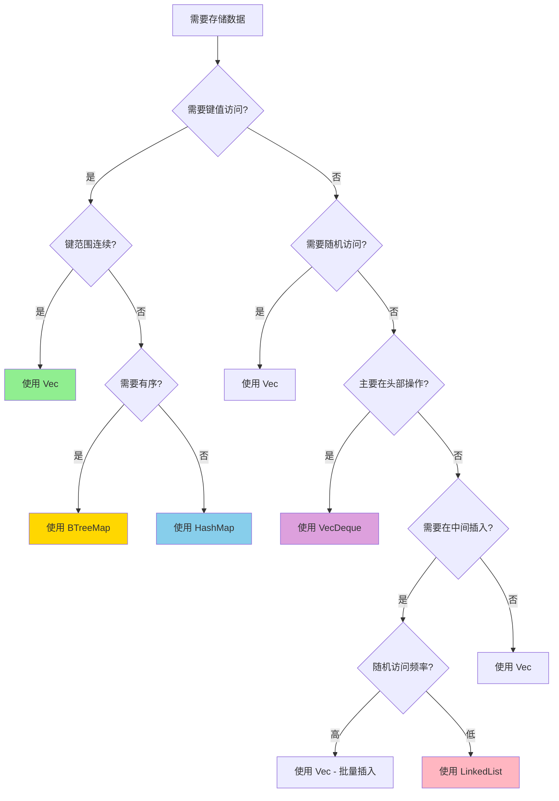
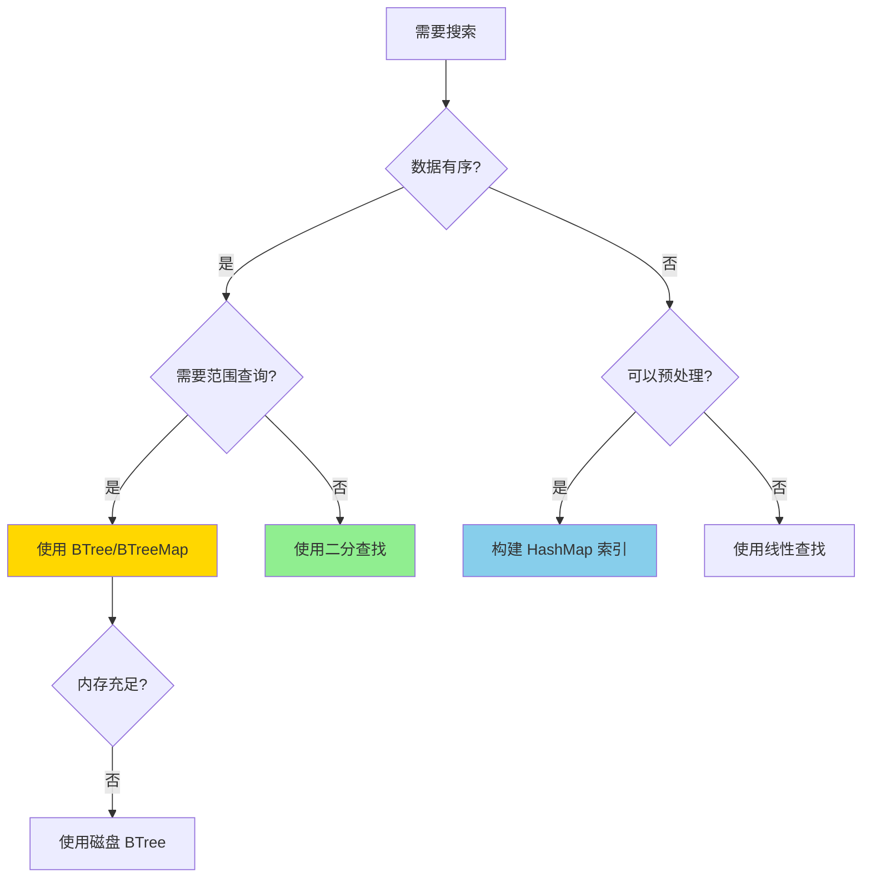
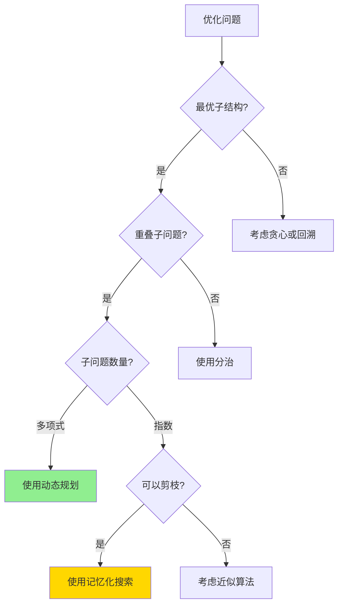

# 算法选择决策树

> **模块**: C08 算法与数据结构
> **用途**: 算法和数据结构选型
> **完备度**: 100%

---

## 📊 数据结构选择决策树



---

## 🔀 排序算法选择

### 决策矩阵

| 场景 | 推荐算法 | 复杂度 | 稳定性 | 内存 |
|------|----------|--------|--------|------|
| 小数组 (< 50) | 插入排序 | O(n²) | ✅ | O(1) |
| 基本有序 | 插入排序 | O(n) | ✅ | O(1) |
| 通用场景 | Timsort (Rust默认) | O(n log n) | ✅ | O(n) |
| 内存受限 | 堆排序 | O(n log n) | ❌ | O(1) |
| 需要稳定 | 归并排序 | O(n log n) | ✅ | O(n) |
| 大数据 | 快速排序 | O(n log n) | ❌ | O(log n) |

### 代码示例

```rust
// 标准库排序 - 使用 Timsort
let mut data = vec![3, 1, 4, 1, 5, 9, 2, 6];
data.sort();  // 不稳定排序
data.sort_by(|a, b| a.cmp(b));  // 自定义比较
data.sort_by_key(|k| *k);  // 按 key 排序

// 稳定排序
data.sort_by(|a, b| a.partial_cmp(b).unwrap());

// 并行排序 (使用 rayon)
use rayon::prelude::*;
data.par_sort();
```

---

## 🔄 搜索算法选择

### 搜索算法决策树



### 搜索算法对比

| 算法 | 前提条件 | 时间复杂度 | 空间复杂度 |
|------|----------|------------|------------|
| 线性搜索 | 无 | O(n) | O(1) |
| 二分搜索 | 有序 | O(log n) | O(1) |
| 哈希查找 | 可哈希 | O(1) | O(n) |
| B树搜索 | 有序 | O(log n) | O(n) |
| 插值搜索 | 均匀分布 | O(log log n)* | O(1) |
| 指数搜索 | 有序 | O(log n) | O(1) |

* 平均情况

```rust
// 二分查找
use std::collections::BinaryHeap;

fn binary_search(arr: &[i32], target: i32) -> Option<usize> {
    arr.binary_search(&target).ok()
}

// BTreeMap - 有序键值存储
use std::collections::BTreeMap;

fn range_query() {
    let mut map = BTreeMap::new();
    map.insert(1, "a");
    map.insert(5, "b");
    map.insert(10, "c");

    // 范围查询
    for (k, v) in map.range(3..8) {
        println!("{}: {}", k, v);
    }
}
```

---

## 🎯 图算法选择

### 问题类型决策

| 问题 | 算法 | 时间复杂度 | 适用场景 |
|------|------|------------|----------|
| 最短路径 (无权) | BFS | O(V + E) | 迷宫、社交网络 |
| 最短路径 (正权) | Dijkstra | O((V + E) log V) | 路由、地图 |
| 最短路径 (负权) | Bellman-Ford | O(V * E) | 金融套利 |
| 所有点对最短路径 | Floyd-Warshall | O(V³) | 小规模密集图 |
| 最小生成树 | Kruskal/Prim | O(E log E) | 网络设计 |
| 拓扑排序 | Kahn/DFS | O(V + E) | 任务调度 |
| 强连通分量 | Tarjan/Kosaraju | O(V + E) | 社区发现 |

```rust
use petgraph::graph::Graph;
use petgraph::algo::{dijkstra, floyd_warshall};

// Dijkstra 最短路径
fn shortest_path() {
    let mut graph = Graph::new();
    let a = graph.add_node("A");
    let b = graph.add_node("B");
    let c = graph.add_node("C");

    graph.add_edge(a, b, 1.0);
    graph.add_edge(b, c, 2.0);
    graph.add_edge(a, c, 10.0);

    let path = dijkstra(&graph, a, Some(c), |e| *e.weight());
    println!("最短距离: {:?}", path.get(&c));
}
```

---

## 📊 动态规划决策

### DP 适用性判断



### 经典 DP 问题模式

| 问题类型 | 状态定义 | 转移方程 | 复杂度 |
|----------|----------|----------|--------|
| 背包问题 | `dp[i][w]` | `max(dp[i-1][w], dp[i-1][w-wi] + vi)` | O(n*W) |
| 最长公共子序列 | `dp[i][j]` | 匹配则+1，否则max | O(n*m) |
| 最长递增子序列 | `dp[i]` | `max(dp[j]) + 1, j < i | O(n²)` |
| 编辑距离 | `dp[i][j]` | 插入/删除/替换取min | O(n*m) |
| 区间 DP | `dp[i][j]` | 枚举分割点 | O(n³) |
| 状态压缩 DP | `dp[mask]` | 枚举子集 | O(2^n * n) |

```rust
// 0/1 背包问题
fn knapsack(weights: &[i32], values: &[i32], capacity: i32) -> i32 {
    let n = weights.len();
    let mut dp = vec![0; (capacity + 1) as usize];

    for i in 0..n {
        for w in (weights[i]..=capacity).rev() {
            dp[w as usize] = dp[w as usize].max(
                dp[(w - weights[i]) as usize] + values[i]
            );
        }
    }

    dp[capacity as usize]
}

// 最长递增子序列 (O(n log n))
fn longest_increasing_subsequence(nums: &[i32]) -> i32 {
    let mut tails = Vec::new();

    for &num in nums {
        match tails.binary_search(&num) {
            Ok(_) => {}
            Err(pos) => {
                if pos == tails.len() {
                    tails.push(num);
                } else {
                    tails[pos] = num;
                }
            }
        }
    }

    tails.len() as i32
}
```

---

## 🔗 相关文档

* [C08 主索引](../../../crates/c08_algorithms/docs/tier_01_foundations/02_主索引导航.md)
* [算法速查卡](../../02_reference/quick_reference/algorithms_cheatsheet.md)

---

**维护者**: Rust 学习项目团队
**最后更新**: 2026-03-15
**状态**: ✅ 100% 完成
