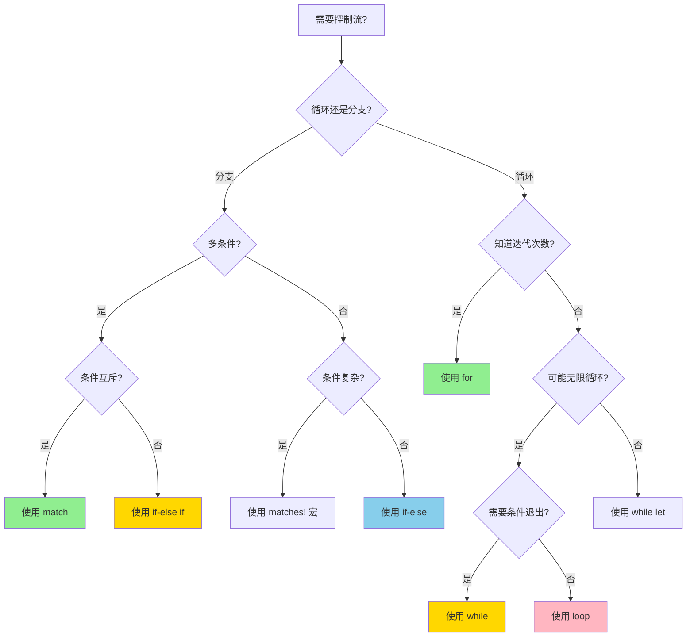
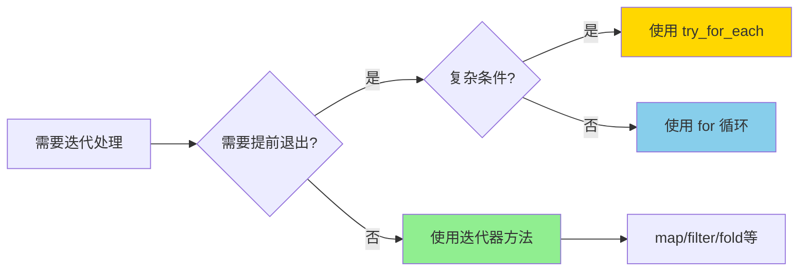
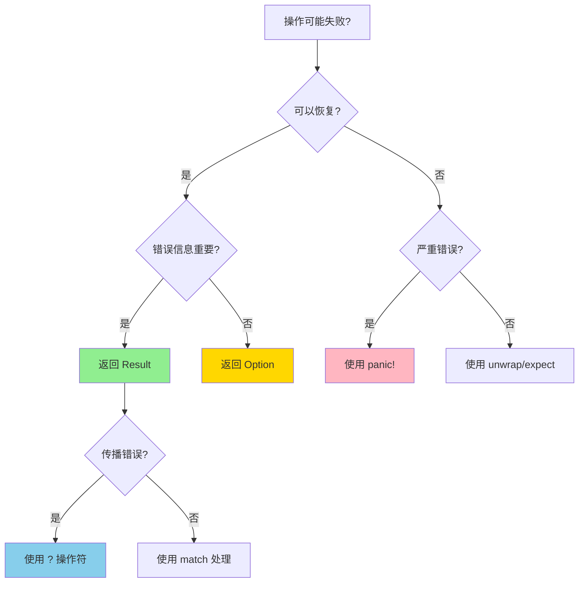

# 控制流决策树

> **模块**: C03 控制流与函数
> **用途**: 选择适当的控制流结构
> **完备度**: 100%

---

## 📊 控制流选择决策树



---

## 🔀 分支结构决策

### match vs if-let

| 场景 | 推荐 | 示例 |
|------|------|------|
| 单模式匹配 | `if let` | `if let Some(v) = opt {}` |
| 多模式匹配 | `match` | `match res { Ok(v) => ..., Err(e) => ... }` |
| 需要绑定多个值 | `match` | `match pair { (a, b) => ... }` |
| 条件守卫 | `match` | `match x { v if v > 0 => ... }` |

```rust
// ❌ 不推荐: 对 Option 使用 match
match option {
    Some(v) => println!("{}", v),
    None => {}
}

// ✅ 推荐: 使用 if let
if let Some(v) = option {
    println!("{}", v);
}

// ✅ 复杂匹配使用 match
match result {
    Ok(v) if v > 0 => println!("正数: {}", v),
    Ok(v) => println!("其他: {}", v),
    Err(e) => eprintln!("错误: {}", e),
}
```

---

## 🔄 循环结构决策

### 循环类型选择矩阵

| 场景 | 推荐 | 说明 |
|------|------|------|
| 遍历集合 | `for` | 最简洁，所有权处理友好 |
| 需要索引 | `for (i, item) in iter.enumerate()` | 同时获取索引和元素 |
| 条件循环 | `while` | 前置条件检查 |
| 至少执行一次 | `loop` | 配合 break 条件 |
| 可能不执行 | `while let` | 模式匹配条件 |
| 无限循环 | `loop` | 服务器、事件循环 |

```rust
// 1. 遍历集合
for item in collection {
    println!("{}", item);
}

// 2. 需要索引
for (idx, item) in collection.iter().enumerate() {
    println!("{}: {}", idx, item);
}

// 3. 条件循环
while condition {
    // 条件为真时执行
}

// 4. while let - 模式匹配循环
while let Some(item) = stack.pop() {
    println!("弹出: {}", item);
}

// 5. 无限循环
loop {
    let event = receive_event();
    if should_exit(event) {
        break;
    }
    process(event);
}
```

---

## ⚡ 迭代器 vs 循环

### 决策流程



### 对比示例

```rust
// 场景: 找第一个满足条件的元素

// ❌ 不推荐: 手动循环
let mut found = None;
for item in &collection {
    if item.is_valid() {
        found = Some(item);
        break;
    }
}

// ✅ 推荐: 使用迭代器
let found = collection.iter().find(|item| item.is_valid());

// 场景: 提前返回错误

// ✅ 使用 try_for_each
let result: Result<(), Error> = collection.iter().try_for_each(|item| {
    if item.is_valid() {
        Ok(())
    } else {
        Err(Error::InvalidItem)
    }
});

// Rust 1.94+: 使用 ControlFlow
let result = collection.iter().try_for_each(|item| {
    if item.should_stop() {
        ControlFlow::Break(item)
    } else {
        ControlFlow::Continue(())
    }
});
```

---

## 🎯 错误处理控制流

### 错误处理决策树



---

## 📋 快速参考表

| 需求 | 控制流结构 | 代码示例 |
|------|-----------|----------|
| 遍历范围 | `for i in 0..10` | `for i in 0..10 { ... }` |
| 遍历数组 | `for item in &arr` | `for item in &arr { ... }` |
| 可变遍历 | `for item in &mut arr` | `for item in &mut arr { *item += 1; }` |
| 消耗遍历 | `for item in vec` | `for item in vec { ... }` |
| 无限循环 | `loop` | `loop { ... }` |
| 条件循环 | `while` | `while condition { ... }` |
| 模式循环 | `while let` | `while let Some(v) = opt { ... }` |
| 提前退出 | `break` | `if done { break; }` |
| 跳过当前 | `continue` | `if skip { continue; }` |
| 返回标签 | `'label: loop` | `'outer: for i in 0..10 { break 'outer; }` |

---

## 🔗 相关文档

- [C03 主索引](../../../crates/c03_control_fn/docs/tier_01_foundations/02_主索引导航.md)
- [MIND_MAP_COLLECTION](../../04_thinking/MIND_MAP_COLLECTION.md)
- [ControlFlow 示例](../../../../examples/rust_194_control_flow_demo.rs)

---

**维护者**: Rust 学习项目团队
**最后更新**: 2026-03-15
**状态**: ✅ 100% 完成
