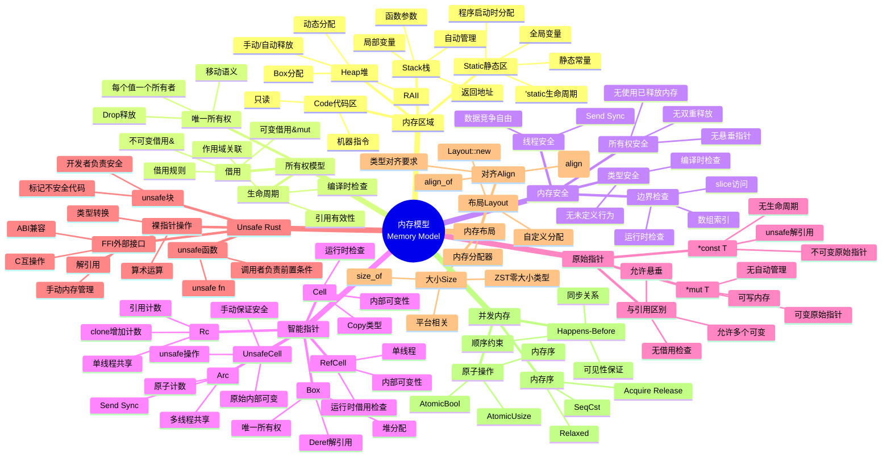

# 内存模型概念思维导图

> **创建日期**: 2026-02-24
> **最后更新**: 2026-02-28
> **状态**: ✅ 已扩展
> **版本**: Rust 1.93.1+ (Edition 2024)

---

## 内存模型全景



---

## 内存区域详解

### 栈 vs 堆

| 特性 | Stack | Heap |
| :--- | :--- | :--- |
| 分配速度 | ⚡ 极快 | 🐢 较慢 |
| 访问速度 | ⚡ 快 | 🐢 稍慢(可能缓存不友好) |
| 大小限制 | 有限(通常MB级) | 大(通常GB级) |
| 生命周期 | 作用域结束自动释放 | 需显式/智能指针管理 |
| 碎片 | 无 | 可能有 |
| 适用 | 小对象、已知大小 | 大对象、动态大小、长生命周期 |

### 内存布局示例

```rust
// 栈分配
let x: i32 = 5;           // 4字节栈空间
let arr: [i8; 100] = [0; 100]; // 100字节栈空间

// 堆分配
let boxed = Box::new(5i32);  // 栈:指针(8字节) + 堆:4字节
let vec = vec![0; 1000];     // 栈:3*usize + 堆:4000字节

// 静态分配
static GLOBAL: i32 = 42;     // 静态区:4字节
```

---

## 所有权与内存管理

### 所有权转移的内存视角

```rust
let s1 = String::from("hello");  // 堆分配 "hello"
let s2 = s1;                      // 所有权转移
// s1 不可用，内存未复制，只有指针转移

let n1 = 5i32;
let n2 = n1;    // Copy类型，栈值复制
// n1 仍然可用
```

### Drop trait与资源释放

```rust
trait Drop {
    fn drop(&mut self);
}

// 自动调用顺序: 与声明顺序相反
struct Resource {
    file: File,
    buffer: Vec<u8>,
}
// drop顺序: buffer -> file
```

---

## 借用规则形式化

```text
在给定作用域内:
1. 要么只有一个可变借用 &mut T
2. 要么有多个不可变借用 &T
3. 不能同时存在可变和不可变借用

形式化:
∀ r ∈ References(scope):
    (mutable(r) → ¬∃ r' ≠ r: valid(r'))
    ∧ (¬mutable(r) → ∀ r' ≠ r: ¬mutable(r'))
```

---

## 智能指针详解

### 使用场景决策

| 需求 | 选择 | 原因 |
| :--- | :--- | :--- |
| 堆分配唯一所有权 | `Box<T>` | 简单高效 |
| 单线程共享 | `Rc<T>` | 轻量级引用计数 |
| 多线程共享 | `Arc<T>` | 原子引用计数 |
| 单线程内部可变 | `RefCell<T>` | 运行时借用检查 |
| 多线程内部可变 | `Arc<Mutex<T>>` | 线程安全 |
| 延迟初始化 | `LazyCell<T>` | 首次访问初始化 |

### 性能对比

| 智能指针 | 分配开销 | 访问开销 | 释放开销 |
| :--- | :--- | :--- | :--- |
| `Box<T>` | 堆分配 | 直接 | 直接free |
| `Rc<T>` | 堆分配+计数器 | 直接 | 减计数 |
| `Arc<T>` | 堆分配+原子计数 | 直接 | 原子减计数 |
| `RefCell<T>` | 堆分配+借用状态 | 运行时检查 | 直接 |
| `Mutex<T>` | 堆分配+锁 | 锁获取/释放 | 直接 |

---

## Unsafe内存操作

### 安全抽象边界

```rust
// 安全封装unsafe内部实现
pub fn safe_interface() {
    unsafe {
        // 内部使用裸指针
        // 但外部接口保证安全
    }
}

// 不变式责任
// 1. 调用者保证: 输入满足前置条件
// 2. 实现者保证: 输出满足后置条件
```

### 常见unsafe模式

| 场景 | unsafe使用 | 安全保证 |
| :--- | :--- | :--- |
| FFI调用 | `extern "C"` | 检查C函数契约 |
| 裸指针 | `*const/mut T` | 有效性、生命周期 |
| Union访问 | `union` | 正确变体 |
| 静态可变 | `static mut` | 同步访问 |
| 类型转换 | `transmute` | 布局兼容 |

---

## 内存序与原子操作

### 内存序对比

| 内存序 | 保证 | 使用场景 | 性能 |
| :--- | :--- | :--- | :--- |
| `Relaxed` | 无 | 计数器 | 最高 |
| `Acquire` | 之后的读写不会重排到之前 | 锁获取 | 高 |
| `Release` | 之前的读写不会重排到之后 | 锁释放 | 高 |
| `AcqRel` | Acquire+Release | CAS | 高 |
| `SeqCst` | 全局顺序一致 | 严格同步 | 较低 |

### Happens-Before关系

```rust
use std::sync::atomic::{AtomicBool, Ordering};

static FLAG: AtomicBool = AtomicBool::new(false);
static mut DATA: i32 = 0;

// 线程1
unsafe { DATA = 123; }
FLAG.store(true, Ordering::Release);  // Release: 之前操作对其他线程可见

// 线程2
if FLAG.load(Ordering::Acquire) {     // Acquire: 能看到Release前的操作
    assert_eq!(unsafe { DATA }, 123); // 保证能看到123
}
```

---

## 内存泄漏与避免

### 泄漏场景

| 场景 | 原因 | 解决 |
| :--- | :--- | :--- |
| `Rc`循环引用 | 计数永不为0 | 使用`Weak` |
| `forget`值 | 跳过Drop | 避免使用 |
| 全局缓存 | 永不清理 | 使用LRU |
| Channel未关闭 | 发送者阻塞 | 正确关闭 |

### Weak引用

```rust
use std::rc::{Rc, Weak};

struct Node {
    value: i32,
    parent: Option<Weak<Node>>,  // 避免循环
    children: Vec<Rc<Node>>,
}

// parent弱引用不增加计数
// 树结构不会循环引用
```

---

## 形式化关联

| 概念 | 形式化定义 | 定理 |
| :--- | :--- | :--- |
| 所有权 | `own(x) = o` | T-OW2: 唯一性 |
| 借用 | `borrow(x, mode)` | T-BR1: 数据竞争自由 |
| 生命周期 | `'a: 'b` | LF-T1: 有效性 |
| Send | `T: Send` | 线程安全转移 |
| Sync | `T: Sync` | 线程安全共享 |

## 内存模型层次

```text
                            Rust内存模型
                                 │
            ┌────────────────────┼────────────────────┐
            │                    │                    │
       【所有权模型】          【借用模型】          【内存布局】
            │                    │                    │
    ┌───────┴───────┐    ┌───────┴───────┐    ┌───────┴───────┐
    │               │    │               │    │               │
  唯一所有权      RAII   共享借用       可变借用  栈内存         堆内存
    │               │      │               │      │               │
  Move语义      Drop trait &T            &mut T  局部变量       Box/Vec
```

---

## Stacked Borrows

```text
借用栈模型
│
├── 核心思想
│   └── 借用按顺序入栈
│
├── 规则
│   ├── 共享借用可重复
│   ├── 可变借用独占
│   └── 父借用被冻结
│
└── 状态转换
    ├── Active → Frozen
    └── Disabled
```

| 操作 | 借用栈变化 |
| :--- | :--- |
| `&x` | 推入共享借用 |
| `&mut x` | 清空并推入可变借用 |
| 使用父借用 | 检查有效性 |

---

## 内存区域

```text
内存区域
│
├── 栈 (Stack)
│   ├── 固定大小数据
│   ├── 自动分配释放
│   └── LIFO顺序
│
├── 堆 (Heap)
│   ├── 动态大小数据
│   ├── 手动/智能指针管理
│   └── 通过Box/Rc/Arc访问
│
└── 静态区
    ├── 静态变量
    └── 常量数据
```

---

## 指针类型

```text
指针分类
│
├── 安全指针
│   ├── &T (共享引用)
│   ├── &mut T (可变引用)
│   └── Box<T> (拥有指针)
│
└── 原始指针
    ├── *const T
    └── *mut T
```

---

## 内存安全保证

```text
安全保证机制
│
├── 编译时
│   ├── 所有权检查
│   ├── 借用检查
│   └── 生命周期验证
│
└── 运行时
    └── 边界检查 (可选)
```

---

## 与形式化验证的关系

```text
内存模型 ↔ 形式化
│
├── RustBelt
│   └── 所有权逻辑关系
│
├── Stacked Borrows
│   └── 操作语义
│
└── Miri
    └── 模型检测
```

---

**维护者**: Rust Formal Methods Research Team
**最后更新**: 2026-02-28
**状态**: ✅ 已扩展 - 内存模型概念思维导图完整版
