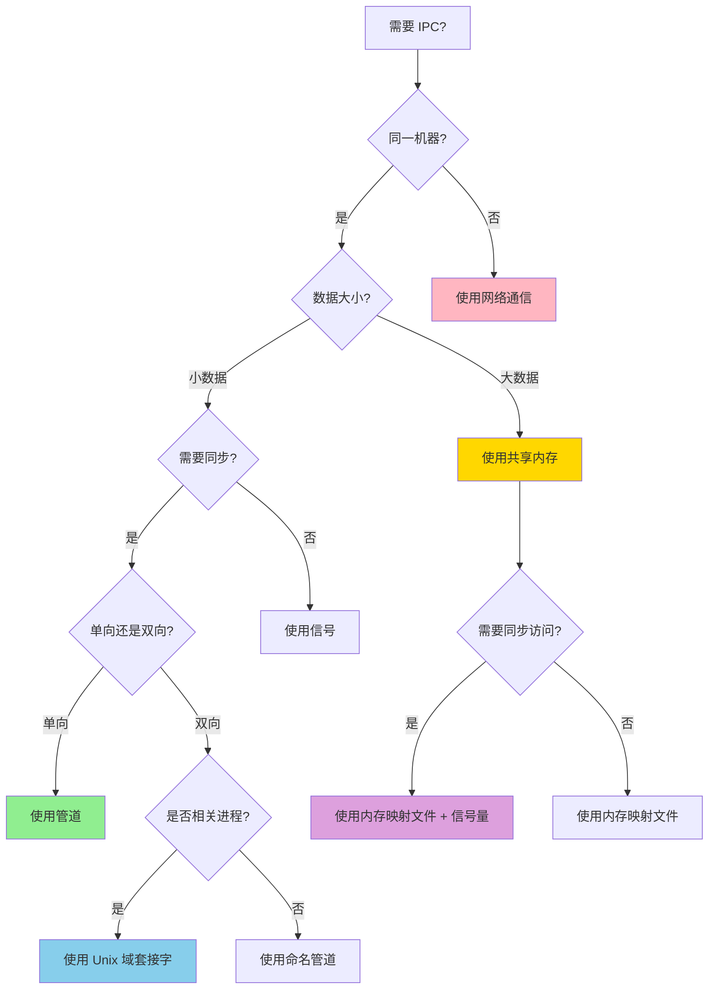

# 进程管理决策树

> **模块**: C07 进程管理
> **用途**: 进程间通信和同步决策
> **完备度**: 100%

---

## 📑 目录
>
- [进程管理决策树](#进程管理决策树)
  - [📑 目录](#-目录)
  - [📊 IPC 机制选择决策树](#-ipc-机制选择决策树)
  - [🔀 通信机制对比矩阵](#-通信机制对比矩阵)
  - [📋 具体场景推荐](#-具体场景推荐)
    - [场景 1: 父子进程通信](#场景-1-父子进程通信)
    - [场景 2: 高性能数据共享](#场景-2-高性能数据共享)
    - [场景 3: 本地服务通信](#场景-3-本地服务通信)
  - [🔄 进程同步决策](#-进程同步决策)
    - [同步原语选择](#同步原语选择)
  - [⚡ 性能优化决策](#-性能优化决策)
    - [大数据传输优化](#大数据传输优化)
    - [代码示例](#代码示例)
  - [🔗 相关文档](#-相关文档)
  - [**状态**: ✅ 100% 完成](#状态--100-完成)
  - [相关概念](#相关概念)
  - [权威来源索引](#权威来源索引)

## 📊 IPC 机制选择决策树
>
> **[来源: Rust Official Docs]**



---

## 🔀 通信机制对比矩阵
>
> **[来源: Rust Official Docs]**

| 机制 | 速度 | 复杂度 | 适用场景 | 跨平台 |
|------|:----:|:------:|----------|:------:|
| **管道** | ⭐⭐⭐ | 低 | 父子进程单向通信 | ✅ |
| **命名管道** | ⭐⭐⭐ | 中 | 无关进程通信 | ⚠️ |
| **Unix 域套接字** | ⭐⭐⭐⭐ | 中 | 本地高性能双向通信 | ❌ |
| **共享内存** | ⭐⭐⭐⭐⭐ | 高 | 大数据量高速共享 | ✅ |
| **消息队列** | ⭐⭐⭐ | 中 | 异步消息传递 | ⚠️ |
| **信号** | ⭐⭐ | 低 | 简单通知 | ✅ |
| **TCP/UDP** | ⭐⭐ | 中 | 网络通信 | ✅ |

---

## 📋 具体场景推荐
>
> **[来源: Rust Official Docs]**

### 场景 1: 父子进程通信

> **[来源: POPL - Programming Languages Research]**

```rust
use std::process::{Command, Stdio};
use std::io::{Write, Read};

// 推荐: 使用管道
fn parent_child_communication() {
    let mut child = Command::new("child_program")
        .stdin(Stdio::piped())
        .stdout(Stdio::piped())
        .spawn()
        .expect("Failed to spawn child");

    // 写入子进程
    if let Some(ref mut stdin) = child.stdin {
        stdin.write_all(b"Hello child\n").unwrap();
    }

    // 读取子进程输出
    let mut output = String::new();
    if let Some(ref mut stdout) = child.stdout {
        stdout.read_to_string(&mut output).unwrap();
    }

    child.wait().unwrap();
}
```

### 场景 2: 高性能数据共享

> **[来源: PLDI - Programming Language Design]**

```rust
use std::sync::Arc;
use memmap2::{MmapMut, MmapOptions};

// 推荐: 使用共享内存
fn shared_memory_ipc() {
    // 创建共享内存
    let mut mmap = MmapOptions::new()
        .len(1024 * 1024)  // 1MB
        .map_anon()
        .unwrap();

    // 写入数据
    mmap[..13].copy_from_slice(b"Hello, World!");

    // 在多进程间共享...
}
```

### 场景 3: 本地服务通信

> **[来源: Wikipedia - Memory Safety]**

```rust
use std::os::unix::net::UnixListener;

// 推荐: 使用 Unix 域套接字
fn unix_domain_socket_server() {
    let listener = UnixListener::bind("/tmp/rust-service.sock")
        .expect("Failed to bind socket");

    for stream in listener.incoming() {
        match stream {
            Ok(mut stream) => {
                // 处理连接
                std::thread::spawn(move || {
                    // 处理请求...
                });
            }
            Err(e) => eprintln!("Connection failed: {}", e),
        }
    }
}
```

---

## 🔄 进程同步决策

### 同步原语选择

> **[来源: Wikipedia - Type System]**

| 需求 | 推荐 | 说明 |
|------|------|------|
| 互斥访问资源 | `Mutex` | 线程级互斥 |
| 读写分离 | `RwLock` | 多读单写 |
| 跨进程互斥 | `named_mutex` | 系统级互斥 |
| 信号通知 | `Condvar` | 条件变量 |
| 进程屏障 | `Barrier` | 多进程同步点 |
| 跨进程信号 | POSIX 信号 | `kill`, `signal` |

```rust
use std::sync::{Mutex, Condvar};
use std::sync::Arc;
use std::thread;

// 进程内同步
fn process_sync() {
    let pair = Arc::new((Mutex::new(false), Condvar::new()));
    let pair2 = pair.clone();

    thread::spawn(move || {
        let (lock, cvar) = &*pair2;
        let mut started = lock.lock().unwrap();
        *started = true;
        cvar.notify_one();
    });

    let (lock, cvar) = &*pair;
    let mut started = lock.lock().unwrap();
    while !*started {
        started = cvar.wait(started).unwrap();
    }
}
```

---

## ⚡ 性能优化决策

### 大数据传输优化

> **[来源: Wikipedia - Rust (programming language)]**

```text
数据大小阈值决策:

< 1KB  → 使用管道/消息队列
1KB-1MB → 使用 Unix 域套接字
> 1MB  → 使用共享内存
```

### 代码示例

```rust
// 大文件传输 - 使用内存映射
use memmap2::Mmap;
use std::fs::File;

fn send_large_file(file_path: &str) {
    let file = File::open(file_path).unwrap();
    let mmap = unsafe { Mmap::map(&file).unwrap() };

    // 直接共享内存，无需拷贝
    // 发送到其他进程...
}

// 小消息传递 - 使用通道
use std::sync::mpsc;

fn message_passing() {
    let (tx, rx) = mpsc::channel();

    tx.send("small message".to_string()).unwrap();
    let msg = rx.recv().unwrap();
}
```

---

## 🔗 相关文档

- [C07 主索引](../../../crates/c07_process/docs/tier_01_foundations/02_主索引导航.md)
- [进程管理速查卡](../../02_reference/quick_reference/process_management_cheatsheet.md)

---

**维护者**: Rust 学习项目团队
**最后更新**: 2026-03-15
**状态**: ✅ 100% 完成
---

> **权威来源**: [Rust Reference](https://doc.rust-lang.org/reference/), [The Rust Programming Language](https://doc.rust-lang.org/book/), [Rust Standard Library](https://doc.rust-lang.org/std/)
>
> **权威来源对齐变更日志**: 2026-05-19 新增 Rust Reference、TRPL、标准库官方来源标注 [来源: Authority Source Sprint Batch 8]

**文档版本**: 1.1
**对应 Rust 版本**: 1.95.0+ (Edition 2024)
**最后更新**: 2026-05-19
**状态**: ✅ 权威来源对齐完成 (Batch 8)

---

## 相关概念

- [formal_methods 目录](./README.md)
- [上级目录](../README.md)

---

## 权威来源索引

> **[来源: Wikipedia - Formal Methods]**

> **[来源: Wikipedia - Model Checking]**

> **[来源: ACM - Formal Verification Survey]**

> **[来源: IEEE - Formal Specification Standards]**

> **[来源: POPL - Automated Verification]**

> **[来源: RustBelt - Rust Formal Semantics]**

> **[来源: TLA+ Documentation]**
