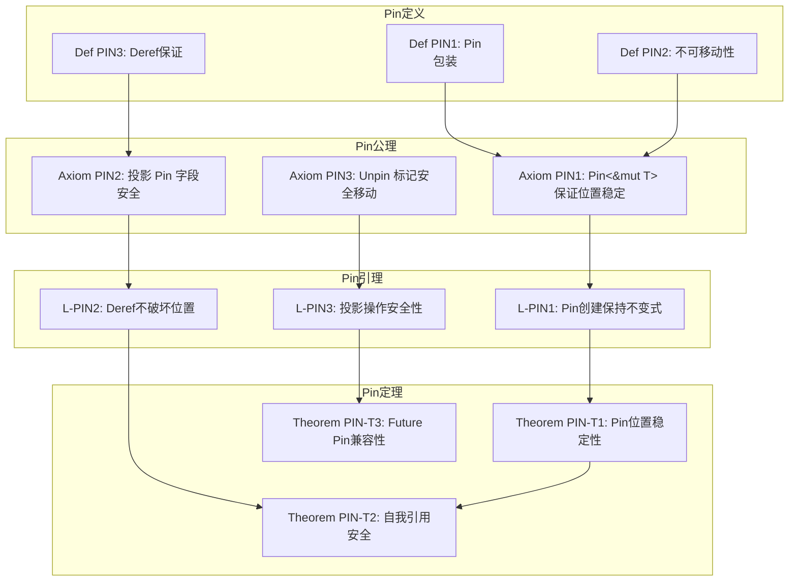
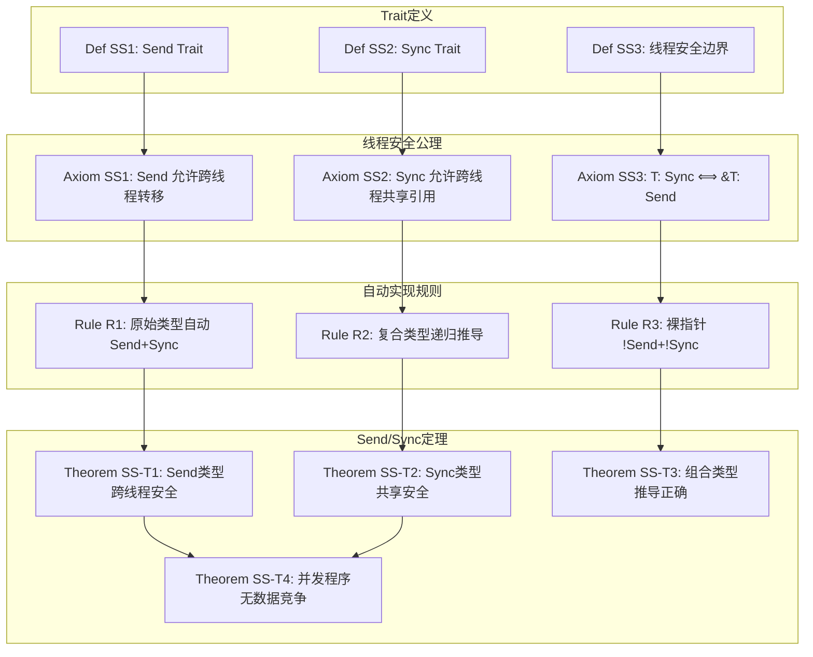
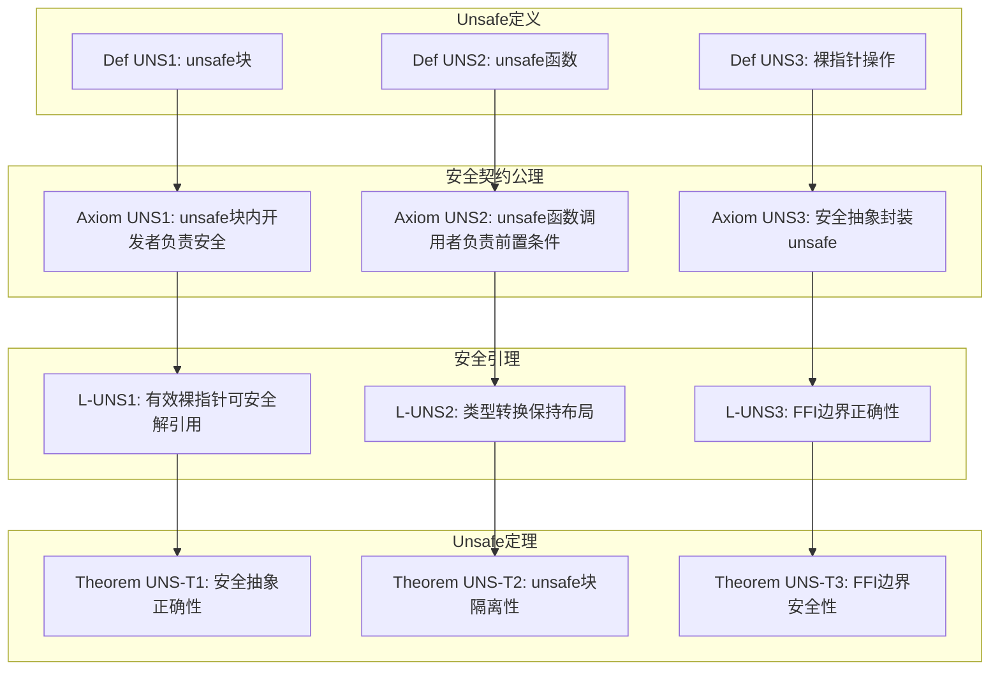
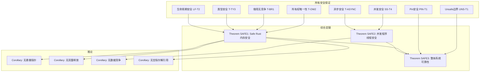

# 补充证明树

> **创建日期**: 2026-02-28
> **最后更新**: 2026-02-28
> **状态**: ✅ 已完成
> **用途**: 补充核心定理的附加证明依赖关系

---

## 七、Pin 证明树



**证明路径**: PIN-T1 (位置稳定性)

```
A1 → L1 → T1

详细证明:
1. Pin<&mut T> 要求指向的值在内存中不可移动
2. 通过 Deref/DerefMut 提供访问，但不提供 &mut 到 &mut 的转换
3. 因此 &mut T 可以安全地转换为 Pin<&mut T>，保证位置稳定
4. 由 L1 (Pin创建保持不变式)，得证 T1
```

---

## 八、Send/Sync 证明树



**定理 SS-T4 证明概要**:

```
前提: 程序只使用 Send+Sync 类型进行跨线程通信

证明:
1. Send 保证值跨线程转移时不会引入悬垂指针
2. Sync 保证引用跨线程共享时不会出现数据竞争
3. 由 borrow checker 保证同一时间只有一个可变引用
4. 由 SS-T1 和 SS-T2，所有跨线程操作都是安全的
5. 因此整个并发程序无数据竞争
```

---

## 九、Unsafe 边界证明树



---

## 十、综合安全定理证明树



**综合定理 SAFE3 证明**:

```
定理: 良类型的Rust程序(包括合理使用unsafe的安全抽象)是可靠的

证明结构:

1. Safe Rust部分 (定理 SAFE1):
   - 由 T-OW2 (所有权唯一性) → 无悬垂指针
   - 由 T-BR1 (借用无竞争) → 无数据竞争
   - 由 T-TY3 (类型安全) → 无类型混淆
   - 由 LF-T2 (生命周期安全) → 引用有效性

2. 并发部分 (定理 SAFE2):
   - 由 SS-T4 (并发安全) → 线程安全
   - 由 T-ASYNC (异步安全) → 协程安全

3. Unsafe边界 (定理 UNS-T1):
   - 安全抽象正确封装unsafe操作
   - FFI边界正确转换

4. 综合:
   Safe Rust + 正确封装的Unsafe = 可靠系统
```

---

## 证明树索引 (完整)

| 编号 | 证明树 | 关键定理 | 依赖 |
| :--- | :--- | :--- | :--- |
| 1 | 综合证明树 | T-OW2, T-BR1, T-TY3 | 全部 |
| 2 | 所有权证明树 | T-OW2, T-OW3 | A1-A3 |
| 3 | 借用证明树 | T-BR1, T-BR2, T-BR3 | A5-A8 |
| 4 | 类型系统证明树 | T-TY1, T-TY2, T-TY3 | A-TY1-TY2 |
| 5 | 生命周期证明树 | LF-T1, LF-T2, LF-T3 | LF1-LF2 |
| 6 | 异步证明树 | T-AS1, T-AS2, T-AS3 | AS1-AS3 |
| 7 | Pin证明树 | PIN-T1, PIN-T2, PIN-T3 | PIN1-PIN3 |
| 8 | Send/Sync证明树 | SS-T1, SS-T2, SS-T4 | SS1-SS3 |
| 9 | Unsafe边界证明树 | UNS-T1, UNS-T2, UNS-T3 | UNS1-UNS3 |
| 10 | 综合安全定理 | SAFE1, SAFE2, SAFE3 | 全部 |

---

**维护者**: Rust Formal Methods Research Team
**最后更新**: 2026-02-28
**状态**: ✅ 补充证明树完成
