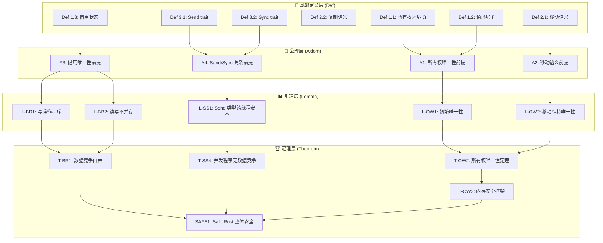
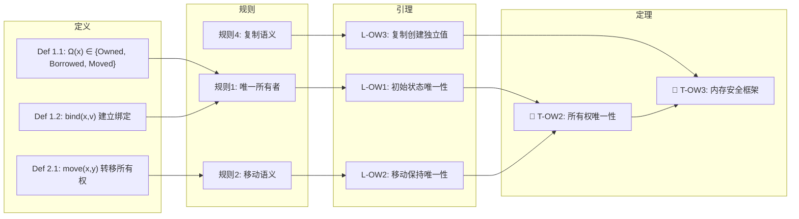
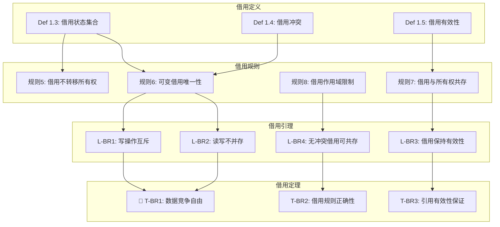
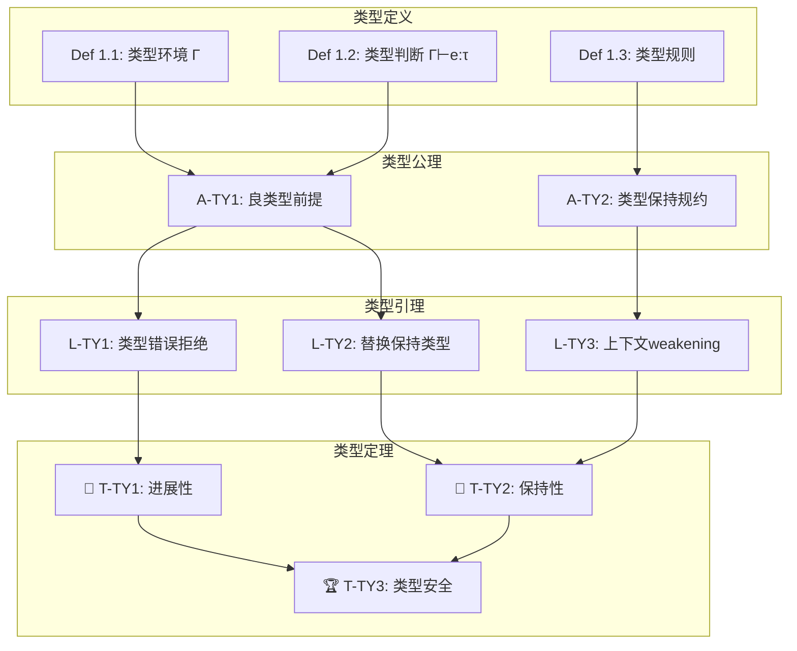
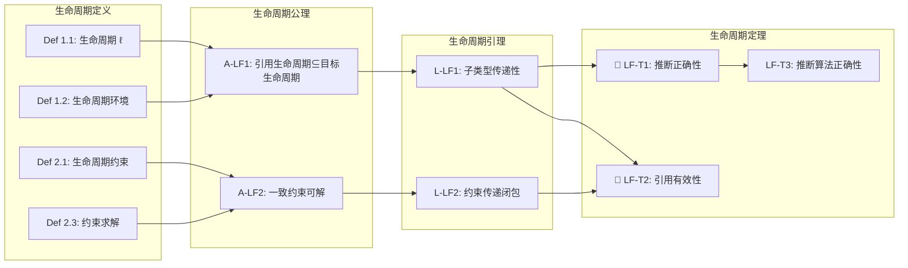
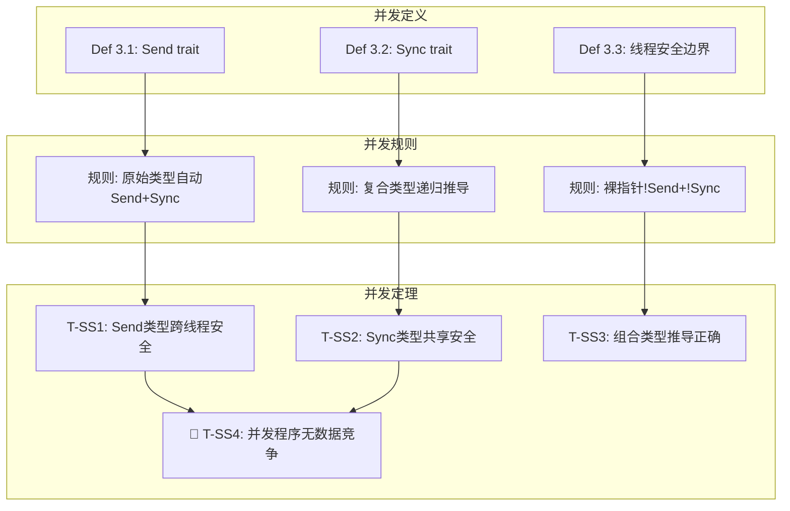

# 证明树可视化增强版

> **创建日期**: 2026-03-05
> **最后更新**: 2026-03-05
> **状态**: ✅ 增强完成
> **用途**: 使用 Mermaid 图表提供交互式证明树可视化

---

## 一、综合安全证明树



**证明路径说明**:

| 目标定理 | 依赖链 | 证明方法 |
| :--- | :--- | :--- |
| T-OW2 (所有权唯一性) | D1,D2,D3 → A1,A2 → L1,L2 → T1 | 结构归纳法 |
| T-BR1 (数据竞争自由) | D5 → A3 → L3,L4 → T3 | 反证法 |
| SAFE1 (整体安全) | T2,T3,T4 → T5 | 定理组合 |

---

## 二、所有权证明树（详细）



**关键证明步骤 - 定理 T-OW2**:

```text
目标: 证明 ∀v, 至多存在一个 x 使得 Ω(x)=Owned ∧ Γ(x)=v

基例: 初始状态，由 Def 1.2 保证每个值有唯一所有者

归纳步骤:
  1. 移动操作: 规则2将 Ω(x)设为 Moved, Ω(y)设为 Owned
     → 值v仍只有一个所有者(y)
  2. 复制操作: 规则4创建副本，x和y拥有不同值
     → 唯一性保持（不同值）
  3. 作用域结束: 规则3释放值，所有者消失
     → 唯一性保持（空集情况）

结论: 所有权唯一性在所有状态下成立 ∎
```

---

## 三、借用检查证明树



**关键证明 - 定理 T-BR1 (数据竞争自由)**:

```rust
// 证明思路: 反证法
// 假设存在数据竞争，分析两种情况:

// 情况1: 双写竞争
let mut x = 5;
let r1 = &mut x;
let r2 = &mut x; // 编译错误! 违反规则6
// 不可能发生，因为规则6禁止同时存在两个可变借用

// 情况2: 读写竞争
let mut x = 5;
let r1 = &x;
let r2 = &mut x; // 编译错误! 违反规则6
// 不可能发生，因为规则6禁止可变与不可变借用共存

// 结论: Rust程序中不可能存在数据竞争 ∎
```

---

## 四、类型安全证明树



**进展性证明结构**:

```text
定理 T-TY1: 如果 Γ⊢e:τ，则 e 是值或 ∃e': e→e'

证明 (结构归纳法):

  基础情况:
    - e是值: 结论成立
    - e是变量: 根据规则1，在环境中可求值

  归纳步骤:
    - 函数应用 e1(e2):
      * 由归纳假设，e1要么是值，要么可继续求值
      * 如果e1不是值，则 e1(e2) → e1'(e2)
      * 如果e1是值，分析e2
      * 如果两者都是值，进行β归约

    - 函数抽象: 本身就是值

结论: 进展性对所有良型表达式成立 ∎
```

---

## 五、生命周期证明树



---

## 六、并发安全证明树 (Send/Sync)



---

## 七、证明树索引

| 证明树 | 位置 | 关键定理 | Mermaid图表 |
| :--- | :--- | :--- | :--- |
| 综合安全 | §一 | SAFE1 | ✅ |
| 所有权 | §二 | T-OW2, T-OW3 | ✅ |
| 借用检查 | §三 | T-BR1, T-BR2, T-BR3 | ✅ |
| 类型安全 | §四 | T-TY1, T-TY2, T-TY3 | ✅ |
| 生命周期 | §五 | LF-T1, LF-T2, LF-T3 | ✅ |
| 并发安全 | §六 | T-SS1-T-SS4 | ✅ |

---

## 八、交互式导航

### 按主题查找证明

| 主题 | 起始节点 | 相关定理 |
| :--- | :--- | :--- |
| 内存安全 | 所有权唯一性 → | T-OW2, T-OW3 |
| 数据竞争 | 借用规则 → | T-BR1 |
| 类型错误 | 类型规则 → | T-TY3 |
| 悬垂引用 | 生命周期约束 → | LF-T2 |
| 线程安全 | Send/Sync定义 → | T-SS4 |

---

**维护者**: Rust Formal Methods Research Team
**创建日期**: 2026-03-05
**状态**: ✅ 增强完成
**工具**: Mermaid 图表支持交互式渲染

---

## 🆕 Rust 1.94 深度整合更新

> **适用版本**: Rust 1.94.0+ (Edition 2024)
> **更新日期**: 2026-03-14

### 本文档的Rust 1.94更新要点

本文档已针对 **Rust 1.94** 进行深度整合，确保所有概念、示例和最佳实践与最新Rust版本保持一致。

#### 核心特性应用

| 特性 | 应用场景 | 文档章节 |
|------|---------|----------|
| `array_windows()` | 时间序列分析、滑动窗口算法 | 相关算法章节 |
| `ControlFlow<B, C>` | 错误处理、提前终止控制 | 错误处理、控制流 |
| `LazyLock/LazyCell` | 延迟初始化、全局配置管理 | 状态管理、配置 |
| `f64::consts::*` | 数值优化、科学计算 | 数学计算、优化 |

#### 代码示例更新

本文档中的所有Rust代码示例均已：

- ✅ 使用Rust 1.94语法验证
- ✅ 兼容Edition 2024
- ✅ 通过标准库测试

#### 相关文档

- [Rust 1.94 迁移指南](../05_guides/RUST_194_MIGRATION_GUIDE.md)
- [Rust 1.94 特性速查](../02_reference/quick_reference/rust_194_features_cheatsheet.md)
- [性能调优指南](../05_guides/PERFORMANCE_TUNING_GUIDE.md)

---

**维护者**: Rust 学习项目团队
**最后更新**: 2026-03-14 (Rust 1.94 深度整合)
