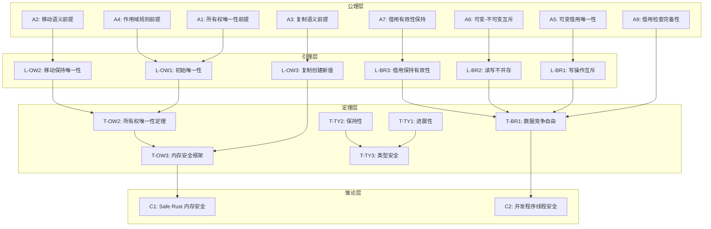
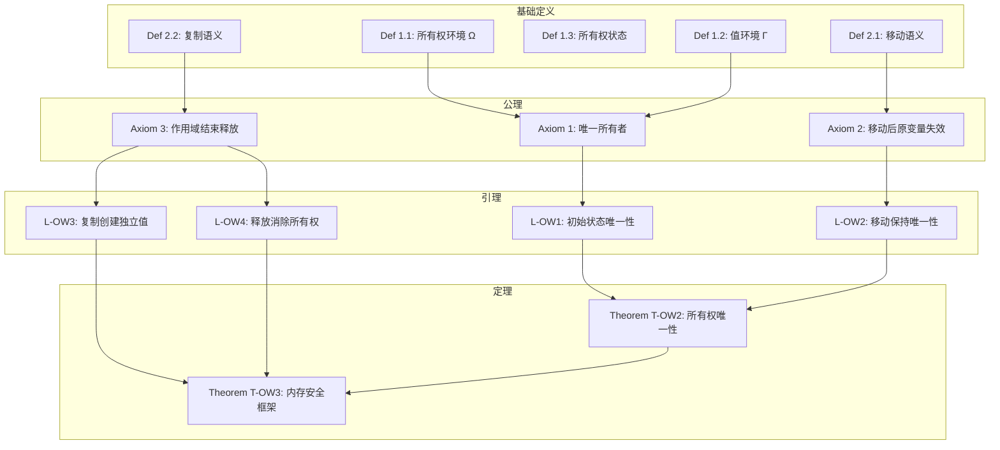
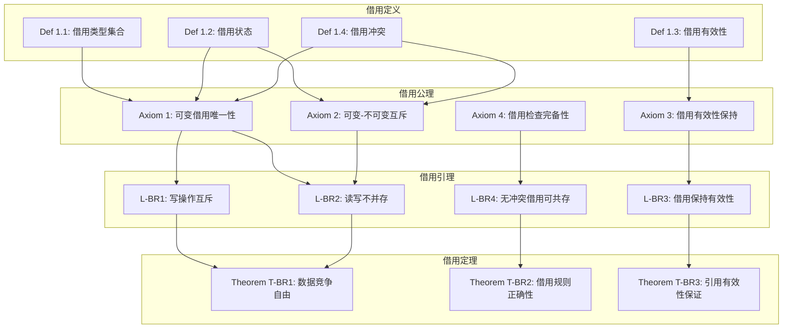
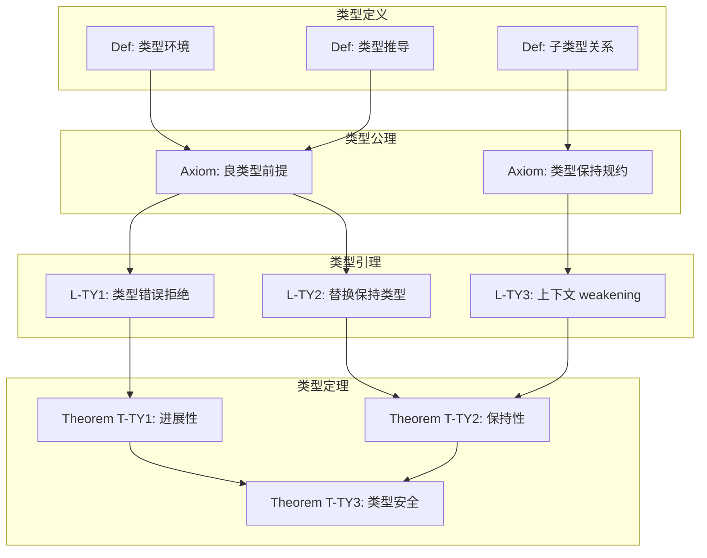
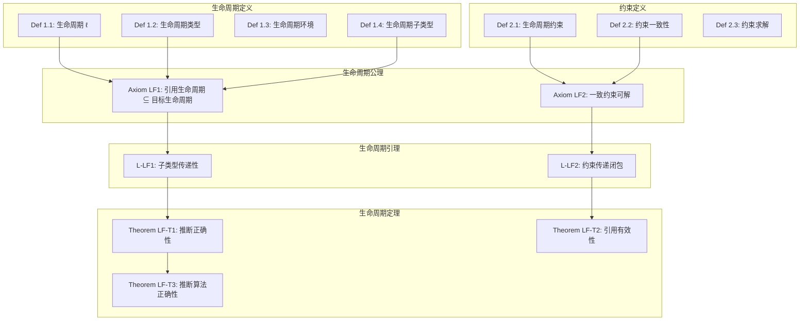
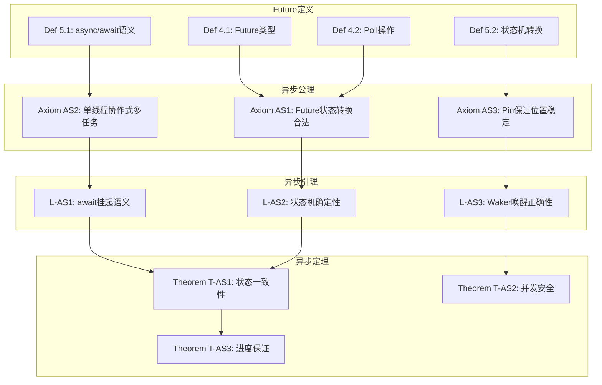

# 核心定理证明树可视化

> **创建日期**: 2026-02-28
> **最后更新**: 2026-02-28
> **状态**: ✅ 已完成
> **用途**: 可视化核心定理的证明依赖关系

---

## 一、所有权-借用-类型安全综合证明树



---

## 二、所有权证明树（详细）



**证明路径**:

```
A1 → L1 → T1
A2 → L2 → T1
A1 + A2 + A3 → L1 + L2 + L3 + L4 → T1 + T2
```

---

## 三、借用检查证明树（详细）



**关键证明**: T-BR1 (数据竞争自由)

```
A1 + A2 → L1 + L2 → T-BR1

证明方法: 反证法
1. 假设存在数据竞争
2. 分析两种情况: 双写 或 读写并发
3. 双写违反 A1 (可变借用唯一性)
4. 读写并发违反 A2 (可变-不可变互斥)
5. 矛盾! 故无数据竞争
```

---

## 四、类型系统证明树（详细）



---

## 五、生命周期证明树



---

## 六、异步证明树



---

## 七、证明树索引

| 证明树 | 位置 | 关键定理 |
| :--- | :--- | :--- |
| 综合证明树 | 本文档 §1 | T-OW2, T-BR1, T-TY3 |
| 所有权证明树 | 本文档 §2 | T-OW2, T-OW3 |
| 借用证明树 | 本文档 §3 | T-BR1, T-BR2, T-BR3 |
| 类型系统证明树 | 本文档 §4 | T-TY1, T-TY2, T-TY3 |
| 生命周期证明树 | 本文档 §5 | LF-T1, LF-T2, LF-T3 |
| 异步证明树 | 本文档 §6 | T-AS1, T-AS2, T-AS3 |

---

## 八、证明依赖关系汇总

```text
┌─────────────────────────────────────────────────────────────┐
│                      证明依赖 DAG                            │
├─────────────────────────────────────────────────────────────┤
│                                                             │
│   公理层 (Axiom)                                            │
│   ├── A1-A4: 所有权公理                                     │
│   ├── A5-A8: 借用公理                                       │
│   └── A-TY1-TY2: 类型公理                                   │
│           │                                                │
│           ▼                                                │
│   引理层 (Lemma)                                            │
│   ├── L-OW1-OW4: 所有权引理                                 │
│   ├── L-BR1-BR4: 借用引理                                   │
│   └── L-TY1-TY3: 类型引理                                   │
│           │                                                │
│           ▼                                                │
│   定理层 (Theorem)                                          │
│   ├── T-OW2: 所有权唯一性 ◄── T-OW3: 内存安全框架            │
│   ├── T-BR1: 数据竞争自由 ◄── T-BR2: 借用规则正确性          │
│   └── T-TY1: 进展性 ──┬── T-TY3: 类型安全                   │
│                       └── T-TY2: 保持性                     │
│           │                                                 │
│           ▼                                                 │
│   推论层 (Corollary)                                        │
│   ├── C1: Safe Rust 内存安全                                │
│   └── C2: 并发程序线程安全                                   │
│                                                             │
└─────────────────────────────────────────────────────────────┘
```

---

**维护者**: Rust Formal Methods Research Team
**创建日期**: 2026-02-28
**状态**: ✅ 证明树可视化完成
