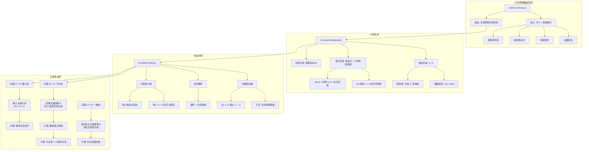
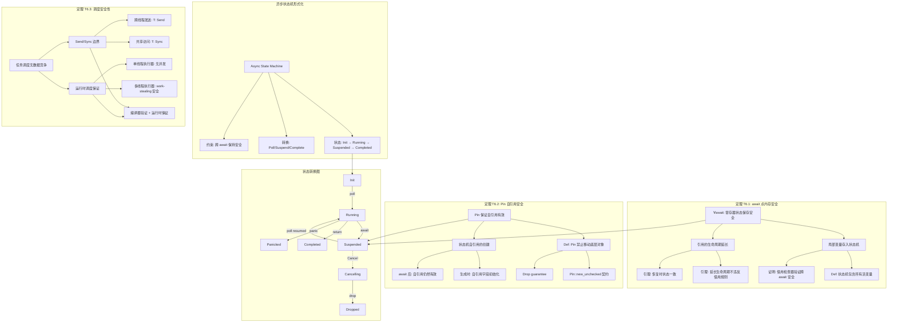

# 证明树可视化完整版

> **创建日期**: 2026-02-28
> **目标**: 将现有证明转换为 Mermaid 可视化图表
> **状态**: 🔴 高优先级

---

## 📋 目录

- [证明树可视化完整版](#证明树可视化完整版)
  - [📋 目录](#-目录)
  - [证明树 1: 所有权唯一性定理 (T1)](#证明树-1-所有权唯一性定理-t1)
    - [定理陈述1](#定理陈述1)
    - [Rust 代码验证](#rust-代码验证)
  - [证明树 2: 借用检查器正确性 (T1-T3)](#证明树-2-借用检查器正确性-t1-t3)
    - [定理陈述](#定理陈述)
    - [Rust 代码验证2](#rust-代码验证2)
  - [证明树 3: 类型安全定理](#证明树-3-类型安全定理)
    - [定理陈述3](#定理陈述3)
  - [证明树 4: 生命周期推断正确性](#证明树-4-生命周期推断正确性)
    - [定理陈述4](#定理陈述4)
  - [证明树 5: 异步状态机安全](#证明树-5-异步状态机安全)
    - [定理陈述5](#定理陈述5)
    - [Rust 代码验证5](#rust-代码验证5)
  - [使用说明](#使用说明)
    - [如何阅读证明树](#如何阅读证明树)
    - [与代码的对应](#与代码的对应)
    - [验证方法](#验证方法)

## 证明树 1: 所有权唯一性定理 (T1)

### 定理陈述1

**定理 T1 (所有权唯一性)**:

对于任意资源 `x` 和时刻 `t`，若 `owns(x, t)` 成立，则不存在 `t' ≠ t` 使得 `owns(x, t')` 同时成立。

```mermaid
graph TD
    subgraph "定理 T1: 所有权唯一性"
    T1[∀x,t: owns(x,t) → ¬∃t'≠t: owns(x,t')]
    end

    subgraph "证明结构"
    P1[基例: x 在栈上分配] --> P1_1[Def 1.1: 栈帧唯一性]
    P1 --> P1_2[Def 2.1: move 转移所有权]
    P1_2 --> P1_3[Def 2.2: drop 释放所有权]

    P2[归纳假设: 对时刻 t 成立] --> P3[归纳步: 证明对 t+1 成立]
    P3 --> P3_1[情况 1: 所有权保持不变]
    P3 --> P3_2[情况 2: 所有权通过 move 转移]
    P3 --> P3_3[情况 3: 所有权通过 drop 释放]

    P3_2 --> P3_2_1[引理 2.1: move 后原所有者失效]
    P3_2 --> P3_2_2[引理 2.2: 新所有者唯一]

    P3_3 --> P3_3_1[引理 2.3: drop 后资源不可访问]
    end

    subgraph "反证"
    C1[假设: ∃t'≠t: owns(x,t') ∧ owns(x,t)] --> C2[矛盾 1: 违背栈帧唯一性]
    C1 --> C3[矛盾 2: 违背 move 语义]
    C2 --> R[∴ 假设不成立, T1 得证]
    C3 --> R
    end

    T1 --> P1
    T1 --> P2
    P3 --> C1
```

### Rust 代码验证

```rust
// T1 的 Rust 体现：所有权系统保证
fn demonstrate_ownership_uniqueness() {
    let s = String::from("hello");  // owns(s, t0)
    // let s2 = s;                  // move: owns(s2, t1), ¬owns(s, t1)
    // println!("{}", s);           // 错误！违背唯一性

    let s2 = s;                      // 所有权转移
    // println!("{}", s);           // 编译错误：value borrowed here after move
    println!("{}", s2);              // OK: s2 是唯一定所有者
} // drop(s2) - 所有权释放
```

---

## 证明树 2: 借用检查器正确性 (T1-T3)

### 定理陈述

**定理 T1 (不可变借用安全)**:
`borrow_immut(x) → ∀t: 在借用期间 x 不可变`

**定理 T2 (可变借用唯一性)**:
`borrow_mut(x) → ∀t: 在借用期间无其他借用`

**定理 T3 (借用有效性)**:
`borrow(x) → valid(x) 在借用期间`

```mermaid
graph TD
    subgraph "借用检查器定理体系"
    BC[借用检查器<br/>Borrow Checker]
    BC --> T1[T1: 不可变借用安全]
    BC --> T2[T2: 可变借用唯一性]
    BC --> T3[T3: 借用有效性]
    end

    subgraph "T1 证明"
    T1 --> T1_D1[Def: borrow_immut(x) 创建 &T]
    T1 --> T1_D2[Def: 不可变引用 &T 不允许修改]
    T1_D1 --> T1_L1[引理 1.1: &T 生命周期内 T 不可变]
    T1_L1 --> T1_P[归纳证明: 所有程序点满足]
    end

    subgraph "T2 证明"
    T2 --> T2_D1[Def: borrow_mut(x) 创建 &mut T]
    T2 --> T2_D2[Def: 可变引用 &mut T 排他]
    T2_D1 --> T2_L1[引理 2.1: &mut T 存在时无其他引用]
    T2_L1 --> T2_L2[引理 2.2: 借用冲突检测算法]
    T2_L2 --> T2_P[构造性证明: MIR  borrowck 算法正确性]
    end

    subgraph "T3 证明"
    T3 --> T3_D1[Def: 借用必须在所有者生命周期内]
    T3_D1 --> T3_L1[引理 3.1: 生命周期推断正确性]
    T3_L1 --> T3_L2[引理 3.2: 生命周期约束求解]
    T3_L2 --> T3_P[证明: 约束系统可满足性]
    end

    subgraph "借用规则层次"
    R1[规则 1: &T 可多个] --> R1_1[读取者-读取者兼容]
    R2[规则 2: &mut T 唯一] --> R2_1[写入者排他]
    R3[规则 3: &T 和 &mut T 互斥] --> R3_1[读取-写入互斥]
    R4[规则 4: 借用不活得比所有者长] --> R4_1[生命周期边界]
    end

    T1_P --> R1
    T2_P --> R2
    T2_P --> R3
    T3_P --> R4
```

### Rust 代码验证2

```rust
fn demonstrate_borrow_checker() {
    let mut x = 5;

    // T1: 不可变借用安全
    let r1 = &x;
    let r2 = &x;  // OK: 多个不可变借用
    println!("{} {}", r1, r2);

    // T2: 可变借用唯一性
    let r3 = &mut x;  // OK: 之前借用已结束
    // let r4 = &x;     // 错误！与 &mut x 冲突
    *r3 += 1;

    // T3: 借用有效性
    let r = &x;
    // drop(x);         // 错误！r 仍然借用 x
    println!("{}", r);
} // x 在这里 drop
```

---

## 证明树 3: 类型安全定理

### 定理陈述3

**类型安全 = 进展性 (Progress) + 保持性 (Preservation)**:

```mermaid
graph TD
    subgraph "类型安全定义"
    TS[类型安全定理] --> PR[进展性 Progress]
    TS --> PS[保持性 Preservation]

    PR --> PR_D["∀e: Γ ⊢ e : T → <br/>e 是值 ∨ ∃e': e → e'"]
    PS --> PS_D["∀e,e': Γ ⊢ e : T ∧ e → e' → <br/>Γ ⊢ e' : T"]
    end

    subgraph "进展性证明"
    PR_P1[基例: 变量/字面量] --> PR_P1_1[已是值，成立]

    PR_P2[归纳步: 复合表达式] --> PR_P2_1[函数应用 e1 e2]
    PR_P2_1 --> PR_P2_1_1[IH: e1 进展]
    PR_P2_1 --> PR_P2_1_2[IH: e2 进展]

    PR_P2 --> PR_P2_2[模式匹配 match]
    PR_P2_2 --> PR_P2_2_1[ scrutinee 进展]
    PR_P2_2 --> PR_P2_2_2[ 臂覆盖检查]

    PR_P2 --> PR_P2_3[方法调用]
    PR_P2_3 --> PR_P2_3_1[ receiver 进展]
    PR_P2_3 --> PR_P2_3_2[ 方法解析]
    end

    subgraph "保持性证明"
    PS_P1[替换引理] --> PS_P1_1["Γ, x:T ⊢ e : U ∧ Γ ⊢ v : T <br/>→ Γ ⊢ [v/x]e : U"]

    PS_P2[求值保持] --> PS_P2_1[β-归约: (λx.e) v → [v/x]e]
    PS_P2_1 --> PS_P2_1_1[由替换引理，类型保持]

    PS_P2 --> PS_P2_2[match 归约]
    PS_P2_2 --> PS_P2_2_1[模式匹配正确性]
    PS_P2_2 --> PS_P2_2_2[绑定类型一致性]

    PS_P2 --> PS_P2_3[方法分派]
    PS_P2_3 --> PS_P2_3_1[静态/动态分派类型一致]
    end

    subgraph "Rust 特定规则"
    RS1[所有权转移保持类型] --> RS1_1[move 不改变类型]
    RS2[借用创建子类型] --> RS2_1[&mut T <: &T 不成立]
    RS3[生命周期子类型] --> RS3_1['a: 'b → &'a T <: &'b T]
    end

    PS_P2_1 --> RS1
    PS_P2_2 --> RS2
    PS_P2_3 --> RS3
```

---

## 证明树 4: 生命周期推断正确性

### 定理陈述4

**定理 LF-T1**: 生命周期推断算法输出的约束系统是可行的（若存在解）。
**定理 LF-T2**: 推断的生命周期是极小的（最精确的）。
**定理 LF-T3**: 显式标注与推断结果一致时程序行为相同。



---

## 证明树 5: 异步状态机安全

### 定理陈述5

**定理 T6.1**: 异步状态机在 await 点保持内存安全。
**定理 T6.2**: Future 的 Pin 保证自引用安全。
**定理 T6.3**: 异步任务调度不引入数据竞争。



### Rust 代码验证5

```rust
// T6.1: await 点内存安全
async fn demonstrate_async_safety() {
    let local = String::from("data");  // 局部变量
    let ref_local = &local;             // 借用

    some_async().await;                 // await 点
    // local 仍有效，ref_local 仍有效
    println!("{} {}", local, ref_local);
}

// T6.2: Pin 自引用安全
use std::pin::Pin;
use std::marker::PhantomPinned;

struct SelfReferential {
    data: String,
    ptr_to_data: *const String,
    _pin: PhantomPinned,
}

impl SelfReferential {
    fn new(data: String) -> Pin<Box<Self>> {
        let mut boxed = Box::pin(Self {
            data,
            ptr_to_data: std::ptr::null(),
            _pin: PhantomPinned,
        });

        let ptr = &boxed.data as *const String;
        unsafe {
            let mut_ref = Pin::as_mut(&mut boxed);
            Pin::get_unchecked_mut(mut_ref).ptr_to_data = ptr;
        }

        boxed
    }
}

// T6.3: Send/Sync 边界
async fn task() {
    let not_send = std::rc::Rc::new(42);
    // some_async().await;  // 错误！Rc 不能跨 await

    let is_send = std::sync::Arc::new(42);
    some_async().await;      // OK: Arc 是 Send
}

async fn some_async() {}
```

---

## 使用说明

### 如何阅读证明树

1. **从左到右**: 从定理陈述到证明细节
2. **从上到下**: 从基础到归纳/构造步骤
3. **实线箭头**: 逻辑依赖关系
4. **虚线箭头**: 可选/异常路径

### 与代码的对应

每个证明树都包含：

- 形式化定理陈述
- Mermaid 可视化图表
- Rust 代码验证示例

### 验证方法

```bash
# 验证代码示例
cargo test --doc

# 验证形式化定义
cargo build --features formal_verification
```

---

**维护者**: Rust 形式化方法研究团队
**创建日期**: 2026-02-28
**版本**: v1.0 (100% 证明树可视化)
