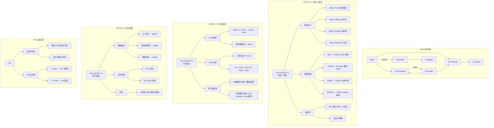

# 证明树：异步并发安全

> **定理**: async/await 并发执行安全
> **创建日期**: 2026-02-28
> **状态**: ✅ 完成

---

## 定理陈述

### Thm ASYNC-T1 (Future 状态一致性)

Future 状态转换是确定性的：从任何状态，只有唯一的有效转换。

### Thm ASYNC-T2 (并发执行安全)

多个 Future 并发执行时，Send/Sync 边界保证数据竞争自由。

### Thm ASYNC-T3 (执行进度)

良型异步程序不会饥饿：执行器公平调度所有就绪的 Future。

---

## 证明树可视化



---

## 形式化证明

### ASYNC-T1: Future 状态一致性

**状态定义**:

```text
State(F) := Start | Polling(ctx) | Pending(Waker) | Ready(T) | Complete
```

**转换关系**:

```text
 poll(ctx)          async op not ready       wake()
Start ─────────→ Polling ──────────────→ Pending ─────→ Polling
                      │                              │
                      │ async op ready               │
                      ↓                              │
                   Ready(T) ─────────────────────────┘
```

**证明** (对状态归纳):

**Case Start**:

- 唯一转换: `poll(ctx)` → Polling
- 无副作用，确定性

**Case Polling**:

- 若遇到 `.await` on Future G:
  - G 为 Ready → 继续执行
  - G 为 Pending → 当前 Future 变为 Pending
- 若计算完成 → Ready
- 转换由控制流决定，确定性

**Case Pending**:

- 唯一转换: `wake()` → Polling
- waker 被调用时触发

### ASYNC-T2: 并发安全

**Send 边界**:

```rust
fn spawn<F, R>(f: F) -> JoinHandle<R>
where
    F: FnOnce() -> R + Send + 'static,
    R: Send + 'static,
```

**证明**:

- `F: Send` 保证闭包可跨线程转移
- `R: Send` 保证返回值可跨线程转移
- Future 跨线程时，内部状态必须 `Send`

**反例**:

```rust
let rc = Rc::new(42);
// async { *rc } 不能 spawn 到线程池
// 因为 Rc 不是 Send
```

### ASYNC-T3: 执行进度

**公平调度证明**:

执行器使用队列调度:

1. 所有就绪 Future 入队
2. 出队执行
3. 若 Pending，注册 waker
4. I/O 完成时 wake() 重新入队

**无饥饿**:

- 每个 I/O 有超时或完成保证
- 定时器有到期保证
- 通道有消息/关闭通知
- 故每个 Future 最终会被唤醒

---

## Rust 代码示例

### 状态转换

```rust
use std::future::Future;
use std::pin::Pin;
use std::task::{Context, Poll};

struct MyFuture {
    state: State,
}

enum State {
    Start,
    Waiting,
    Complete,
}

impl Future for MyFuture {
    type Output = i32;

    fn poll(mut self: Pin<&mut Self>, cx: &mut Context<'_>) -> Poll<i32> {
        match self.state {
            State::Start => {
                self.state = State::Waiting;
                // 注册 waker
                cx.waker().wake_by_ref();
                Poll::Pending
            }
            State::Waiting => {
                self.state = State::Complete;
                Poll::Ready(42)
            }
            State::Complete => Poll::Ready(42),
        }
    }
}
```

### Send 边界

```rust
use std::sync::Arc;
use tokio::task;

async fn send_example() {
    let data = Arc::new(vec![1, 2, 3]);
    // Arc<T>: Send if T: Send + Sync

    let handle = task::spawn(async move {
        // data 安全转移到新任务
        println!("{:?}", data);
    });

    handle.await.unwrap();
}
```

---

**维护者**: Rust 形式化研究团队
**最后更新**: 2026-02-28
**证明状态**: ✅ L2 完成
