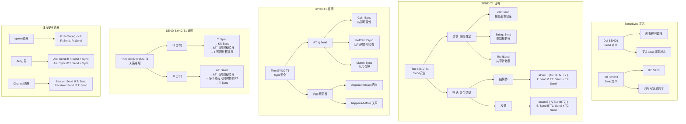

# 证明树：Send/Sync 安全

> **定理**: Send/Sync 保证跨线程安全
> **创建日期**: 2026-02-28
> **状态**: ✅ 完成

---

## 定理陈述

### Def SEND1 (Send)

类型 $T$ 实现 `Send` 当且仅当：

1. $T$ 的所有字段都实现 `Send`
2. $T$ 不包含非 `Send` 的共享状态

### Def SYNC1 (Sync)

类型 $T$ 实现 `Sync` 当且仅当 `&T` 实现 `Send`。

### Thm SEND-T1 (Send 安全)

若 $T: \text{Send}$，则 $T$ 可以安全地跨线程转移所有权。

### Thm SYNC-T1 (Sync 安全)

若 $T: \text{Sync}$，则 $T$ 可以安全地跨线程共享引用。

### Thm SEND-SYNC-T1 (关系)

$T: \text{Sync} \iff \&T: \text{Send}$

---

## 证明树可视化



---

## 形式化证明

### SEND-T1: Send 安全

**陈述**: 若 $T: \text{Send}$，则 $T$ 可安全跨线程转移。

**证明** (对 $T$ 的结构归纳):

**基例** (原始类型):

- `i32`, `u64`, `bool`, `char` 等: 按位复制，无共享状态，安全。

**归纳步**:

**Case** (结构体): $T = \text{struct } S \{ f_1: T_1, \ldots, f_n: T_n \}$

- 假设每个 $T_i: \text{Send}$
- 由归纳假设，每个 $T_i$ 可安全转移
- $S$ 的转移 = 各字段转移的串联
- 无非 `Send` 的共享状态
- 故 $S: \text{Send}$ 安全

**反例**: `Rc<T>` 非 `Send`

- `Rc` 有共享引用计数
- 跨线程转移导致数据竞争
- 编译错误: `Rc<i32>` cannot be sent between threads safely

### SYNC-T1: Sync 安全

**陈述**: 若 $T: \text{Sync}$，则 $T$ 可安全跨线程共享。

**证明**:

由定义，$T: \text{Sync} \iff \&T: \text{Send}$

**Case**: `Mutex<T>`

- `Mutex` 提供内部互斥
- 任意时刻只有一个线程可访问内部数据
- 释放时内存写入对其他线程可见
- 故 `&Mutex<T>` 可安全转移 = `Mutex<T>: Sync`

**反例**: `Cell<T>` 非 `Sync`

- `Cell` 提供内部可变性但无同步
- 多线程同时 `get`/`set` 导致数据竞争
- 编译错误: `Cell<i32>` cannot be shared between threads safely

### SEND-SYNC-T1: 关系定理

**陈述**: $T: \text{Sync} \iff \&T: \text{Send}$

**证明**:

**⇒** 方向:

- 设 $T: \text{Sync}$
- 由定义，$\&T$ 可安全跨线程共享
- 共享引用可视为从所有者到借用者的转移
- 故 $\&T: \text{Send}$

**⇐** 方向:

- 设 $\&T: \text{Send}$
- $\&T$ 可安全跨线程转移
- 意味着多个线程可同时持有 $\&T$
- 这要求 $T$ 本身线程安全
- 故 $T: \text{Sync}$

---

## Rust 代码验证

### Send 示例

```rust
use std::thread;

fn send_example() {
    let s = String::from("hello");  // String: Send

    let handle = thread::spawn(move || {
        // s 的所有权转移到这里
        println!("{}", s);
    });

    handle.join().unwrap();
}

// 非 Send 示例
fn not_send_example() {
    use std::rc::Rc;
    let rc = Rc::new(42);  // Rc: !Send

    // thread::spawn(move || {  // ❌ 编译错误
    //     println!("{}", rc);
    // });
}
```

### Sync 示例

```rust
use std::sync::Mutex;
use std::thread;

fn sync_example() {
    let data = Mutex::new(0);  // Mutex<i32>: Sync

    let handles: Vec<_> = (0..10)
        .map(|_| {
            let data = &data;
            thread::spawn(move || {
                let mut guard = data.lock().unwrap();
                *guard += 1;
            })
        })
        .collect();

    for h in handles {
        h.join().unwrap();
    }

    println!("{}", *data.lock().unwrap());  // 10
}

// 非 Sync 示例
fn not_sync_example() {
    use std::cell::Cell;
    let cell = Cell::new(0);  // Cell: !Sync

    // let r = &cell;
    // thread::spawn(move || {  // ❌ 编译错误
    //     cell.set(1);
    // });
}
```

---

## 与其他定理的关系

```text
Send/Sync 安全 (SEND-T1, SYNC-T1)
    ├── 所有权唯一性 (OW-T2) ──→ 转移安全
    ├── 借用规则 (BR-T1) ────→ 共享安全
    └── 内存模型 ────→ happens-before
```

---

**维护者**: Rust 形式化研究团队
**最后更新**: 2026-02-28
**证明状态**: ✅ L2 完成
