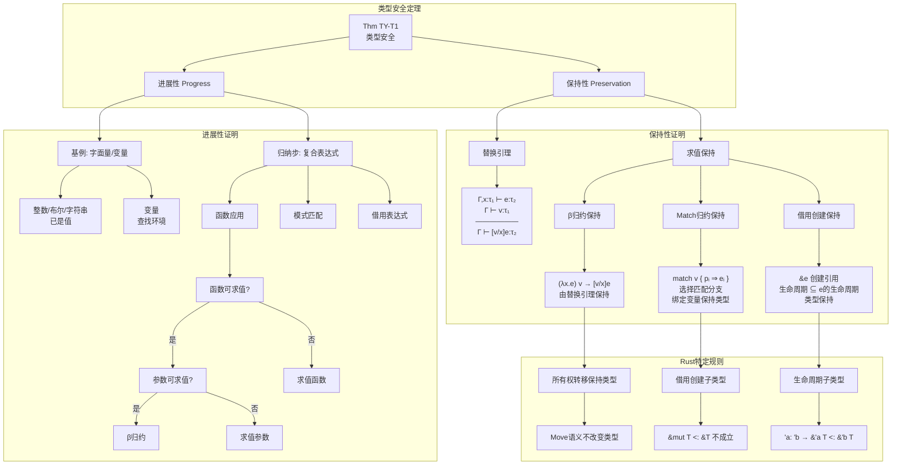

# 证明树：类型安全定理

> **定理**: 类型安全 = 进展性 (Progress) + 保持性 (Preservation)
> **创建日期**: 2026-02-28
> **状态**: ✅ 完成

---

## 定理陈述

### Thm TY-T1 (类型安全)

对于良型程序 $e$，满足：

1. **进展性**: $e$ 是值，或存在 $e'$ 使得 $e \to e'$
2. **保持性**: 若 $e \to e'$，则 $e'$ 也是良型的

```text
Γ ⊢ e : τ  ⟹  (Value(e) ∨ ∃e'. e → e') ∧ (e → e' ⟹ Γ ⊢ e' : τ)
```

---

## 证明树可视化



---

## 形式化证明

### 进展性 (Progress)

**定理**: 若 $\Gamma \vdash e : \tau$，则 $e$ 是值或存在 $e'$ 使 $e \to e'$。

**证明** (对推导树结构归纳):

**基例**:

- $e = n$ (整数): 已是值
- $e = b$ (布尔): 已是值
- $e = x$ (变量): 由Γ(x)=τ，运行时查找值

**归纳步**:

**Case**: $e = e_1 \ e_2$ (函数应用)

- 由IH，$e_1$ 是值或可求值
- 若 $e_1$ 可求值，则 $e \to e_1' \ e_2$
- 若 $e_1 = \lambda x.e_3$ 是值:
  - 由IH，$e_2$ 是值或可求值
  - 若 $e_2$ 可求值，则 $e \to (\lambda x.e_3) \ e_2'$
  - 若 $e_2$ 是值，则 $e \to [e_2/x]e_3$ (β归约)

**Case**: $e = \&e_1$ (借用)

- 由IH，$e_1$ 是值或可求值
- 若可求值，则 $e \to \&e_1'$
- 若是值，则 $e$ 是值 (引用值)

### 保持性 (Preservation)

**定理**: 若 $\Gamma \vdash e : \tau$ 且 $e \to e'$，则 $\Gamma \vdash e' : \tau$。

**关键引理** (替换引理):

$$
\frac{\Gamma, x:\tau_1 \vdash e : \tau_2 \quad \Gamma \vdash v : \tau_1}{\Gamma \vdash [v/x]e : \tau_2}
$$

**证明** (对求值关系归纳):

**Case**: β归约 $(\lambda x.e) \ v \to [v/x]e$

- 假设 $\Gamma \vdash (\lambda x.e) \ v : \tau_2$
- 则 $\Gamma \vdash \lambda x.e : \tau_1 \to \tau_2$ 且 $\Gamma \vdash v : \tau_1$
- 由函数类型，$\Gamma, x:\tau_1 \vdash e : \tau_2$
- 由替换引理，$\Gamma \vdash [v/x]e : \tau_2$

**Case**: 借用创建 $\&e \to \&e'$ (其中 $e \to e'$)

- 假设 $\Gamma \vdash \&e : \&'a \tau$
- 则 $\Gamma \vdash e : \tau$ 且 $\text{lft}(e) \subseteq 'a$
- 由IH，$\Gamma \vdash e' : \tau$
- 且 $\text{lft}(e') \subseteq \text{lft}(e) \subseteq 'a$
- 故 $\Gamma \vdash \&e' : \&'a \tau$

---

## Rust特定考虑

### 所有权与类型安全

```rust
// 所有权转移保持类型
let s = String::from("hello");  // s: String
let s2 = s;                      // s2: String, s 失效
// s 的类型仍然是 String，只是不能访问
```

### 借用与类型安全

```rust
// 借用创建子类型关系
let x: i32 = 42;
let r: &i32 = &x;        // &'a i32
let r2: &&i32 = &r;      // &'b &'a i32
// 满足: 'a: 'b 时，&&'a i32 <: &'b &'a i32
```

---

## 与其他定理的关系

```text
类型安全 (TY-T1)
    ├── 所有权唯一性 (OW-T2) ──→ 内存安全
    ├── 借用规则 (BR-T1) ────→ 数据竞争自由
    └── 生命周期有效 (LF-T2) ──→ 引用有效性
```

---

**维护者**: Rust 形式化研究团队
**最后更新**: 2026-02-28
**证明状态**: ✅ L2 完成
