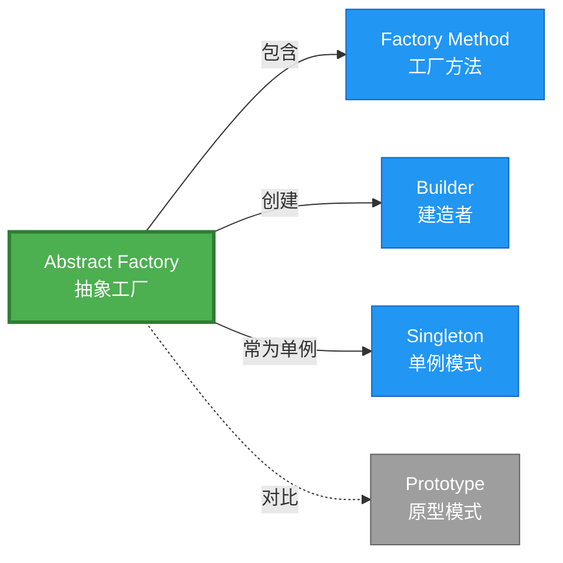

# Abstract Factory 形式化分析

> **创建日期**: 2026-02-12
> **最后更新**: 2026-02-20
> **Rust 版本**: 1.93.0+ (Edition 2024)
> **状态**: ✅ 已完成
> **分类**: 创建型
> **安全边界**: 纯 Safe
> **23 模式矩阵**: [README §23 模式多维对比矩阵](../README.md#23-模式多维对比矩阵) 第 2 行（Abstract Factory）
> **证明深度**: L3（完整证明）

---

## 📊 目录

- [Abstract Factory 形式化分析](#abstract-factory-形式化分析)
  - [📊 目录](#-目录)
  - [形式化定义](#形式化定义)
    - [Def 1.1（Abstract Factory 结构）](#def-11abstract-factory-结构)
    - [Axiom AF1（产品族一致性公理）](#axiom-af1产品族一致性公理)
    - [Axiom AF2（所有权转移公理）](#axiom-af2所有权转移公理)
    - [定理 AF-T1（关联类型安全定理）](#定理-af-t1关联类型安全定理)
    - [定理 AF-T2（产品族完整性定理）](#定理-af-t2产品族完整性定理)
    - [推论 AF-C1（纯 Safe 抽象工厂）](#推论-af-c1纯-safe-抽象工厂)
    - [概念定义-属性关系-解释论证 层次汇总](#概念定义-属性关系-解释论证-层次汇总)
  - [Rust 实现与代码示例](#rust-实现与代码示例)
  - [完整证明](#完整证明)
    - [形式化论证链](#形式化论证链)
    - [与 Rust 类型系统的联系](#与-rust-类型系统的联系)
    - [内存安全保证](#内存安全保证)
  - [典型场景](#典型场景)
  - [相关模式](#相关模式)
  - [实现变体](#实现变体)
  - [反例：混用不同族产品](#反例混用不同族产品)
  - [选型决策树](#选型决策树)
  - [与 GoF 对比](#与-gof-对比)
  - [边界](#边界)
  - [与 Rust 1.93 的对应](#与-rust-193-的对应)
  - [思维导图](#思维导图)
  - [与其他模式的关系图](#与其他模式的关系图)
  - [实质内容五维自检](#实质内容五维自检)

---

## 形式化定义

### Def 1.1（Abstract Factory 结构）

设 $\mathcal{F}$ 为抽象工厂族，$T_1, \ldots, T_n$ 为产品类型族。Abstract Factory 是一个多元组 $\mathcal{AF} = (\mathcal{F}, \{T_i\}_{i=1}^n, \{\mathit{create}_i\}_{i=1}^n)$，满足：

- $\exists \mathit{create}_i : \mathcal{F} \to T_i$，$i \in \{1,\ldots,n\}$
- $\Gamma \vdash \mathit{create}_i(f) : T_i$
- **产品族一致性**：同一工厂实例 $f$ 创建的产品族风格一致（如暗色主题、亮色主题）
- **关联类型约束**：$T_i$ 之间可能存在约束关系（如 $T_1$ 与 $T_2$ 必须兼容）

**形式化表示**：
$$\mathcal{AF} = \langle \mathcal{F}, \{T_i\}_{i=1}^n, \{\mathit{create}_i: \mathcal{F} \rightarrow T_i\}_{i=1}^n \rangle$$

---

### Axiom AF1（产品族一致性公理）

$$\forall f: \mathcal{F},\, \mathit{create}_1(f) : T_1 \land \mathit{create}_2(f) : T_2 \implies \mathit{Compatible}(T_1, T_2)$$

同一工厂创建的产品族类型一致；不同工厂可产生不同实现族。

### Axiom AF2（所有权转移公理）

$$\Omega(\mathit{create}_i(f)) \cap \Omega(f) = \emptyset$$

工厂可被拥有或借用；产品所有权转移至调用者。

---

### 定理 AF-T1（关联类型安全定理）

由 [trait_system_formalization](../../../type_theory/trait_system_formalization.md)，trait 解析保证多态工厂调用类型安全。

**证明**：

1. **trait 定义**：

   ```rust
   trait GuiFactory {
       type B: Button;
       type D: Dialog;
       fn create_button(&self) -> Self::B;
       fn create_dialog(&self) -> Self::D;
   }
   ```

2. **关联类型约束**：`type B: Button` 要求 `B` 实现 `Button` trait
   - 对于 `impl GuiFactory for WinFactory`，`type B = WinButton`
   - 编译期检查：`WinButton: Button` 必须成立

3. **类型一致性**：同一 impl 中，`B` 和 `D` 固定为具体类型
   - `WinFactory` 总是产生 `WinButton` 和 `WinDialog`
   - 运行时类型一致性由编译期保证

4. **解析正确性**：根据 trait_system 解析定理，对于任何满足约束的 `f: impl GuiFactory`，
   $f.\mathit{create\_button}()$ 返回类型为 `Self::B`，且该类型实现 `Button`。

由 trait_system_formalization 解析正确性，得证。$\square$

---

### 定理 AF-T2（产品族完整性定理）

由 [ownership_model](../../../formal_methods/ownership_model.md) T2，同一工厂创建的产品族所有权独立且兼容。

**证明**：

1. **所有权独立**：设 $f: \mathcal{F}$，调用 $\mathit{create}_1(f) \rightarrow p_1$，$\mathit{create}_2(f) \rightarrow p_2$
   - 根据 Axiom AF2：$\Omega(p_1) \cap \Omega(f) = \emptyset$，$\Omega(p_2) \cap \Omega(f) = \emptyset$
   - 根据 ownership T2：$p_1$ 和 $p_2$ 有独立的所有权

2. **产品族兼容**：根据 Axiom AF1，$\mathit{Compatible}(T_1, T_2)$
   - 在 Rust 中表现为：`p1.render()` 与 `p2.render()` 使用相同渲染后端
   - 例如：`WinButton` 和 `WinDialog` 都使用 Windows API

3. **无混合风险**：关联类型保证编译期无法混用不同族产品
   - `WinFactory` 无法产生 `MacButton`（类型不匹配）

由 Axiom AF1、AF2 及 ownership_model，得证。$\square$

---

### 推论 AF-C1（纯 Safe 抽象工厂）

Abstract Factory 为纯 Safe；trait 多态工厂、产品所有权转移，无 `unsafe`。

**证明**：

1. trait 定义：纯 Safe Rust
2. 关联类型：编译期类型检查
3. 工厂方法：返回拥有值，`Box` 分配为标准库 Safe API
4. 无 `unsafe` 块：整个抽象工厂实现无需 unsafe

由 AF-T1、AF-T2 及 [safe_unsafe_matrix](../../05_boundary_system/safe_unsafe_matrix.md) SBM-T1，得证。$\square$

---

### 概念定义-属性关系-解释论证 层次汇总

| 层次 | 内容 | 本页对应 |
| :--- | :--- | :--- |
| **概念定义层** | Def 1.1（Abstract Factory 结构）、Axiom AF1/AF2（产品族一致、所有权） | 上 |
| **属性关系层** | Axiom AF1/AF2 $\rightarrow$ 定理 AF-T1/AF-T2 $\rightarrow$ 推论 AF-C1；依赖 trait、ownership | 上 |
| **解释论证层** | AF-T1/AF-T2 完整证明；反例：混用不同族产品 | §完整证明、§反例 |

---

## Rust 实现与代码示例

```rust
trait Button { fn render(&self); }
trait Dialog { fn render(&self); }

struct WinDialog;
impl Dialog for WinDialog { fn render(&self) { println!("WinDialog"); } }

struct WinButton;
impl Button for WinButton { fn render(&self) { println!("WinButton"); } }

struct MacButton;
impl Button for MacButton { fn render(&self) { println!("MacButton"); } }}

trait GuiFactory {
    type B: Button;
    type D: Dialog;
    fn create_button(&self) -> Self::B;
    fn create_dialog(&self) -> Self::D;
}

struct WinFactory;
impl GuiFactory for WinFactory {
    type B = WinButton;
    type D = WinDialog;
    fn create_button(&self) -> WinButton { WinButton }
    fn create_dialog(&self) -> WinDialog { WinDialog }
}
```

**形式化对应**：`GuiFactory` 为 $\mathcal{F}$；`create_button`、`create_dialog` 为 $\mathit{create}_i$；关联类型 `B`、`D` 保证产品族一致。

---

## 完整证明

### 形式化论证链

```text
Axiom AF1 (产品族一致性)
    ↓ 依赖
trait_system 关联类型
    ↓ 保证
定理 AF-T1 (关联类型安全)
    ↓ 组合
Axiom AF2 (所有权转移)
    ↓ 依赖
ownership_model T2
    ↓ 保证
定理 AF-T2 (产品族完整性)
    ↓ 结论
推论 AF-C1 (纯 Safe 抽象工厂)
```

### 与 Rust 类型系统的联系

| Rust 特性 | Abstract Factory 实现 | 类型安全保证 |
| :--- | :--- | :--- |
| `trait` | 抽象工厂接口 | 多态调用类型检查 |
| 关联类型 `type B` | 产品族约束 | 编译期族一致性 |
| `impl Trait` | 具体工厂 | 实现完整性检查 |
| 所有权系统 | 产品转移 | 无悬垂/重复释放 |

### 内存安全保证

1. **产品族一致性**：关联类型保证编译期族匹配
2. **所有权清晰**：各产品独立拥有，无共享所有权问题
3. **无空指针**：工厂总是返回有效产品实例
4. **类型安全**：trait 约束保证产品实现必要方法

---

## 典型场景

| 场景 | 说明 |
| :--- | :--- |
| 跨平台 UI | Win/Mac/Linux 各自 Button、Dialog 族 |
| 主题/皮肤 | 暗色/亮色控件族 |
| 数据库抽象 | 不同驱动产生的 Connection、Statement 族 |
| 序列化格式 | JSON/MessagePack 各自的 Reader/Writer 族 |

---

## 相关模式

| 模式 | 关系 |
| :--- | :--- |
| [Factory Method](factory_method.md) | 抽象工厂由多个工厂方法组成 |
| [Builder](builder.md) | 可组合：Builder 由 Factory 创建 |
| [Singleton](singleton.md) | 工厂可为单例 |

---

## 实现变体

| 变体 | 说明 | 适用 |
| :--- | :--- | :--- |
| 关联类型 | `type B: Button; type D: Dialog` | 类型族编译期 |
| 枚举 | `enum Theme { Dark, Light }` + match | 有限主题 |
| trait 对象 | `Box<dyn GuiFactory>` | 运行时选择 |

---

## 反例：混用不同族产品

**错误**：从不同工厂取产品组合，风格不一致。

```rust
let win_factory = WinFactory;
let mac_factory = MacFactory;
// 混用：WinButton + MacDialog → 风格不一致
let ui = (win_factory.create_button(), mac_factory.create_dialog());
```

**结论**：Axiom AF1 要求同一工厂创建族；客户端应仅持有一个工厂实例。

---

## 选型决策树

```text
需要创建产品族（风格一致）？
├── 是 → 跨平台/主题/格式族？ → Abstract Factory（关联类型或枚举）
├── 否 → 仅单产品？ → Factory Method
└── 需多步骤构建？ → Builder
```

---

## 与 GoF 对比

| GoF | Rust 对应 | 差异 |
| :--- | :--- | :--- |
| 抽象工厂接口 | trait + 关联类型 | 等价 |
| 具体工厂 | impl for XxxFactory | 等价 |
| 产品族一致 | 关联类型 type B, type D | 编译期保证 |

---

## 边界

| 维度 | 分类 |
| :--- | :--- |
| 安全 | 纯 Safe |
| 支持 | 原生 |
| 表达 | 等价 |

---

## 与 Rust 1.93 的对应

| 1.93 特性 | 与本模式 | 说明 |
| :--- | :--- | :--- |
| 无新增影响 | — | 1.93 无影响 Abstract Factory 语义的变更 |
| 92 项落点 | 无 | 本模式未涉及 [RUST_193_COUNTEREXAMPLES_INDEX](../../../RUST_193_COUNTEREXAMPLES_INDEX.md) 特定项 |

---

## 思维导图

```mermaid
mindmap
  root((Abstract Factory<br/>抽象工厂模式))
    结构
      AbstractFactory trait
      ProductA trait
      ProductB trait
      create_product_a()
      create_product_b()
    行为
      创建产品族
      保证族一致性
      隐藏实现类
    实现方式
      关联类型
      枚举工厂
      trait 对象
    应用场景
      跨平台UI
      主题/皮肤
      数据库驱动
      序列化格式
```

---

## 与其他模式的关系图



---

## 实质内容五维自检

| 自检项 | 状态 | 说明 |
| :--- | :--- | :--- |
| 形式化 | ✅ | Def 1.1、Axiom AF1/AF2、定理 AF-T1/T2（L3 完整证明）、推论 AF-C1 |
| 代码 | ✅ | 可运行示例 |
| 场景 | ✅ | 典型场景表 |
| 反例 | ✅ | 混用不同族产品 |
| 衔接 | ✅ | ownership、CE-PAT1、04_boundary_matrix、trait_system |
| 权威对应 | ✅ | [GoF](../README.md#与-gof-原书对应)、[formal_methods](../../../formal_methods/README.md)、[INTERNATIONAL_FORMAL_VERIFICATION_INDEX](../../../INTERNATIONAL_FORMAL_VERIFICATION_INDEX.md) |
