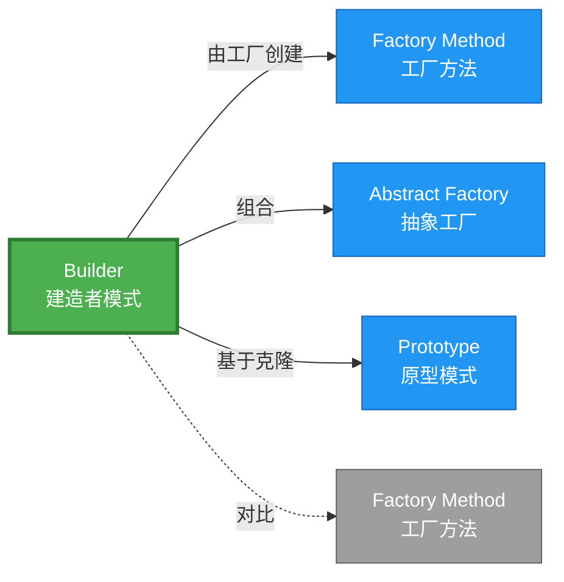

# Builder 形式化分析

> **创建日期**: 2026-02-12
> **最后更新**: 2026-02-20
> **Rust 版本**: 1.93.0+ (Edition 2024)
> **状态**: ✅ 已完成
> **分类**: 创建型
> **安全边界**: 纯 Safe
> **23 模式矩阵**: [README §23 模式多维对比矩阵](../README.md#23-模式多维对比矩阵) 第 3 行（Builder）
> **证明深度**: L3（完整证明）

---

## 📊 目录

- [Builder 形式化分析](#builder-形式化分析)
  - [📊 目录](#-目录)
  - [形式化定义](#形式化定义)
    - [Def 1.1（Builder 结构）](#def-11builder-结构)
    - [Axiom B1（必填字段公理）](#axiom-b1必填字段公理)
    - [Axiom B2（单次构建公理）](#axiom-b2单次构建公理)
    - [定理 B-T1（所有权消费定理）](#定理-b-t1所有权消费定理)
    - [定理 B-T2（类型状态安全定理）](#定理-b-t2类型状态安全定理)
    - [推论 B-C1（纯 Safe Builder）](#推论-b-c1纯-safe-builder)
    - [概念定义-属性关系-解释论证 层次汇总](#概念定义-属性关系-解释论证-层次汇总)
  - [Rust 实现与代码示例](#rust-实现与代码示例)
  - [完整证明](#完整证明)
    - [形式化论证链](#形式化论证链)
    - [与 Rust 类型系统的联系](#与-rust-类型系统的联系)
    - [内存安全保证](#内存安全保证)
  - [典型场景](#典型场景)
  - [完整场景示例：HTTP 请求构建器](#完整场景示例http-请求构建器)
  - [相关模式](#相关模式)
  - [实现变体](#实现变体)
  - [反例](#反例)
  - [错误处理](#错误处理)
  - [选型决策树](#选型决策树)
  - [与 GoF 对比](#与-gof-对比)
  - [边界](#边界)
  - [与 Rust 1.93 的对应](#与-rust-193-的对应)
  - [思维导图](#思维导图)
  - [与其他模式的关系图](#与其他模式的关系图)
  - [实质内容五维自检](#实质内容五维自检)

---

## 形式化定义

### Def 1.1（Builder 结构）

设 $B$ 为 Builder 类型，$T$ 为目标类型。Builder 是一个四元组 $\mathcal{B} = (B, T, \{\mathit{set}_i\}, \mathit{build})$，满足：

- $\exists \mathit{build} : B \to \mathrm{Result}\langle T, E \rangle$ 或 $B \to T$
- $\mathit{build}$ 消费 $B$（所有权转移：$\Omega(B) \mapsto \emptyset$）
- 可选：$\mathit{set}_i : B \times V_i \to B$ 链式构建，返回 `Self` 实现流式 API
- **必填校验**：`build` 调用时必填字段已设置，否则返回 `Err`

**形式化表示**：
$$\mathcal{B} = \langle B, T, \{\mathit{set}_i: B \times V_i \rightarrow B\}, \mathit{build}: B \rightarrow \mathrm{Result}\langle T, E \rangle \rangle$$

---

### Axiom B1（必填字段公理）

$$\mathit{build}(b) = \mathrm{Ok}(t) \implies \forall i \in \mathrm{Required},\, \mathit{field}_i(b) \neq \mathrm{None}$$

`build` 调用时必填字段已设置；否则返回 `Err` 或 panic。

### Axiom B2（单次构建公理）

$$\mathit{build}(b) = t \implies \nexists b': B,\, b' = b \land \mathit{build}(b') \text{ 可调用}$$

`build` 消费 `self`；调用后 $B$ 无效，保证单次构建。

---

### 定理 B-T1（所有权消费定理）

由 [ownership_model](../../../formal_methods/ownership_model.md) T2，`build(self)` 消费 $B$ 后 $B$ 无效，无双重使用。

**证明**：

1. **所有权转移**：`fn build(self) -> Result<T, E>` 获取 $B$ 的所有权
   - 调用前：调用者拥有 $b: B$
   - 调用后：$b$ 所有权转移至 `build`，调用者不可再使用 $b$

2. **单次使用保证**：

   ```rust
   let builder = ConfigBuilder::new();
   let config = builder.build()?;  // builder 所有权转移
   // builder.build()?;  // 编译错误：builder 已移动
   ```

3. **无悬垂**：根据 ownership T2，值被消费后不可再访问
   - 编译期检查：借用检查器拒绝后续使用

由 ownership_model T2，得证。$\square$

---

### 定理 B-T2（类型状态安全定理）

类型状态模式可强制编译期必填：`ConfigBuilder<SetHost>` 与 `ConfigBuilder<SetPort>` 等相位类型，仅当所有相位完成时 `build` 可用。

**证明**：

1. **类型状态定义**：

   ```rust
   struct ConfigBuilder<State> { host: Option<String>, port: Option<u16>, _state: PhantomData<State> }
   struct SetHost;
   struct SetPort;
   struct Complete;
   ```

2. **状态转换**：

   ```rust
   impl ConfigBuilder<SetHost> {
       fn host(self, h: String) -> ConfigBuilder<SetPort> { ... }
   }
   impl ConfigBuilder<SetPort> {
       fn port(self, p: u16) -> ConfigBuilder<Complete> { ... }
   }
   impl ConfigBuilder<Complete> {
       fn build(self) -> Config { ... }  // 仅在 Complete 状态可用
   }
   ```

3. **编译期保证**：
   - `ConfigBuilder<SetHost>::build()` 不存在 → 编译错误
   - 必须按顺序调用 `host()` → `port()` → `build()`
   - 非法状态转换在编译期被拒绝

由 Rust 类型系统，得证。$\square$

---

### 推论 B-C1（纯 Safe Builder）

Builder 为纯 Safe；链式 `set` + `build(self)` 消费所有权，无 `unsafe`。

**证明**：

1. `set` 方法：接收 `self`，返回 `Self`，纯 Safe
2. `build` 方法：消费 `self`，返回 `Result`，纯 Safe
3. 类型状态：PhantomData 标记，零运行时开销
4. 无 `unsafe` 块：整个 Builder 实现无需 unsafe

由 B-T1、B-T2 及 [safe_unsafe_matrix](../../05_boundary_system/safe_unsafe_matrix.md) SBM-T1，得证。$\square$

---

### 概念定义-属性关系-解释论证 层次汇总

| 层次 | 内容 | 本页对应 |
| :--- | :--- | :--- |
| **概念定义层** | Def 1.1（Builder 结构）、Axiom B1/B2（必填、消费 self） | 上 |
| **属性关系层** | Axiom B1/B2 $\rightarrow$ 定理 B-T1/B-T2 $\rightarrow$ 推论 B-C1；依赖 ownership、safe_unsafe_matrix | 上 |
| **解释论证层** | B-T1/B-T2 完整证明；反例：缺必填、双重 build | §完整证明、§反例 |

---

## Rust 实现与代码示例

```rust
struct Config {
    host: String,
    port: u16,
    timeout: u64,
}

struct ConfigBuilder {
    host: Option<String>,
    port: Option<u16>,
    timeout: Option<u64>,
}

impl ConfigBuilder {
    fn new() -> Self {
        Self { host: None, port: None, timeout: None }
    }

    fn host(mut self, host: String) -> Self {
        self.host = Some(host);
        self
    }

    fn port(mut self, port: u16) -> Self {
        self.port = Some(port);
        self
    }

    fn build(self) -> Result<Config, String> {
        Ok(Config {
            host: self.host.ok_or("host required")?,
            port: self.port.ok_or("port required")?,
            timeout: self.timeout.unwrap_or(30),
        })
    }
}

// 使用：链式调用，build 消费 self
let config = ConfigBuilder::new()
    .host("localhost".to_string())
    .port(8080)
    .build()?;
```

**形式化对应**：`build(self)` 即 $\mathit{build} : B \to \mathrm{Result}(T)$；`self` 被消费，符合 Axiom B2。

---

## 完整证明

### 形式化论证链

```
Axiom B1 (必填字段)
    ↓ 实现
ok_or 校验 / 类型状态
    ↓ 保证
定理 B-T2 (类型状态安全)
    ↓ 组合
Axiom B2 (单次构建)
    ↓ 依赖
ownership_model T2
    ↓ 保证
定理 B-T1 (所有权消费)
    ↓ 结论
推论 B-C1 (纯 Safe Builder)
```

### 与 Rust 类型系统的联系

| Rust 特性 | Builder 实现 | 类型安全保证 |
| :--- | :--- | :--- |
| `self` 消费 | `build(self)` | 单次构建 |
| `Option<T>` | 可选字段 | 显式处理缺失 |
| `PhantomData<State>` | 类型状态 | 编译期状态机 |
| `Result<T, E>` | 必填校验 | 错误处理 |

### 内存安全保证

1. **单次构建**：所有权消费保证 `build` 只调用一次
2. **无未初始化**：`Option` 强制处理字段存在性
3. **类型状态**：非法状态不可构造
4. **错误传播**：`Result` 强制调用者处理错误

---

## 典型场景

| 场景 | 说明 |
| :--- | :--- |
| 复杂配置 | 多可选参数、默认值 |
| SQL/查询构建 | 链式添加条件 |
| 请求构建 | HTTP 请求头、体、参数 |
| 类型状态 Builder | 强制顺序：必填 → 可选 → build |

---

## 完整场景示例：HTTP 请求构建器

**场景**：构建 HTTP 请求；URL 必填，headers/body 可选；链式调用 + `ok_or` 校验。

```rust
struct HttpRequest { url: String, headers: Vec<(String, String)>, body: Option<String> }

struct HttpRequestBuilder {
    url: Option<String>,
    headers: Vec<(String, String)>,
    body: Option<String>,
}

impl HttpRequestBuilder {
    fn new() -> Self {
        Self { url: None, headers: vec![], body: None }
    }
    fn url(mut self, u: &str) -> Self {
        self.url = Some(u.into());
        self
    }
    fn header(mut self, k: &str, v: &str) -> Self {
        self.headers.push((k.into(), v.into()));
        self
    }
    fn body(mut self, b: &str) -> Self {
        self.body = Some(b.into());
        self
    }
    fn build(self) -> Result<HttpRequest, String> {
        Ok(HttpRequest {
            url: self.url.ok_or("url required")?,
            headers: self.headers,
            body: self.body,
        })
    }
}

// 使用：链式构建，缺必填则 Err
let req = HttpRequestBuilder::new()
    .url("https://api.example.com")
    .header("Content-Type", "application/json")
    .body(r#"{"key":"value"}"#)
    .build()?;
```

**形式化对应**：`build(self)` 消费 $B$；`ok_or` 保证必填；由 Axiom B1、B2。

---

## 相关模式

| 模式 | 关系 |
| :--- | :--- |
| [Factory Method](factory_method.md) | Builder 可由 Factory 创建 |
| [Abstract Factory](abstract_factory.md) | 可组合：Factory 返回 Builder |
| [Prototype](prototype.md) | 可组合：Builder 基于 Prototype 克隆 |

---

## 实现变体

| 变体 | 说明 | 适用 |
| :--- | :--- | :--- |
| Option + ok_or | 运行时校验；缺省返回 Err | 简单构建 |
| 类型状态 Builder | 相位类型；编译期强制顺序 | 必填→可选→build |
| derive_builder | 宏生成；减少样板代码 | 结构体多字段 |

---

## 反例

**反例**：`build()` 在必填字段未设置时调用 → 返回 `Err` 或 panic。类型状态模式可强制编译期检查。

```rust
// 运行时错误
let config = ConfigBuilder::new()
    // .host(...)  // 遗漏
    .port(8080)
    .build()?;  // Err("host required")
```

---

## 错误处理

`build()` 返回 `Result<Config, String>` 时，缺必填字段用 `ok_or("host required")?` 传播 Err；调用方用 `?` 或 `match` 处理。避免 `unwrap()` 导致不可恢复 panic。

---

## 选型决策树

```text
需要多步骤、可选参数构建？
├── 是 → 需编译期必填？ → 类型状态 Builder
│       └── 运行时校验即可？ → Option + ok_or
├── 否 → 单产品、简单？ → Factory Method
└── 需克隆已有对象？ → Prototype
```

---

## 与 GoF 对比

| GoF | Rust 对应 | 差异 |
| :--- | :--- | :--- |
| Director + Builder | 可选；Rust 常直接链式 | 等价 |
| 链式 set | `fn set(self, v) -> Self` | 消费 self 更安全 |
| build 消费 | `fn build(self) -> T` | 单次构建，等价 |

---

## 边界

| 维度 | 分类 |
| :--- | :--- |
| 安全 | 纯 Safe |
| 支持 | 原生 |
| 表达 | 等价 |

---

## 与 Rust 1.93 的对应

| 1.93 特性 | 与本模式 | 说明 |
| :--- | :--- | :--- |
| 无新增影响 | — | 1.93 无影响 Builder 语义的变更 |
| 92 项落点 | 无 | 本模式未涉及 [RUST_193_COUNTEREXAMPLES_INDEX](../../../RUST_193_COUNTEREXAMPLES_INDEX.md) 特定项 |

---

## 思维导图

```mermaid
mindmap
  root((Builder<br/>建造者模式))
    结构
      Builder struct
      Target struct
      set_xxx() → Self
      build(self) → Result
    行为
      链式配置
      必填校验
      消费构建
    实现方式
      Option + ok_or
      类型状态模式
      derive_builder 宏
    应用场景
      复杂配置
      HTTP请求构建
      SQL查询构建
      对象初始化
```

---

## 与其他模式的关系图



---

## 实质内容五维自检

| 自检项 | 状态 | 说明 |
| :--- | :--- | :--- |
| 形式化 | ✅ | Def 1.1、Axiom B1/B2、定理 B-T1/T2（L3 完整证明）、推论 B-C1 |
| 代码 | ✅ | 可运行示例、类型状态 Builder |
| 场景 | ✅ | 典型场景、错误处理 |
| 反例 | ✅ | 缺必填字段、双重 build |
| 衔接 | ✅ | ownership、CE-T1、CE-PAT1 |
| 权威对应 | ✅ | [GoF](../README.md#与-gof-原书对应)、[Fowler EAA](https://martinfowler.com/eaaCatalog/)、[formal_methods](../../../formal_methods/README.md) |
