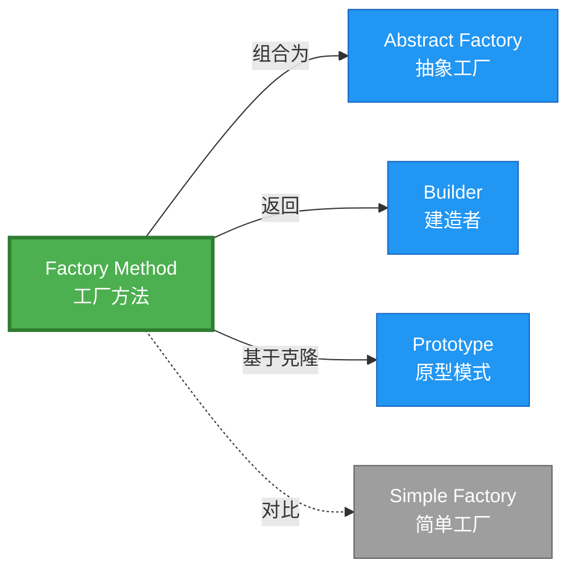

# Factory Method 形式化分析

> **创建日期**: 2026-02-12
> **最后更新**: 2026-02-28
> **Rust 版本**: 1.93.1+ (Edition 2024)
> **状态**: ✅ 已完成
> **分类**: 创建型
> **安全边界**: 纯 Safe
> **23 模式矩阵**: [README §23 模式多维对比矩阵](../README.md#23-模式多维对比矩阵) 第 1 行（Factory Method）
> **证明深度**: L3（完整证明）

---

## 📊 目录 {#-目录}

- [Factory Method 形式化分析](#factory-method-形式化分析)
  - [📊 目录 {#-目录}](#-目录--目录)
  - [形式化定义](#形式化定义)
    - [Def 1.1（Factory Method 结构）](#def-11factory-method-结构)
    - [Axiom FM1（返回类型一致性公理）](#axiom-fm1返回类型一致性公理)
    - [Axiom FM2（所有权独立公理）](#axiom-fm2所有权独立公理)
    - [定理 FM-T1（类型保持定理）](#定理-fm-t1类型保持定理)
    - [定理 FM-T2（所有权安全定理）](#定理-fm-t2所有权安全定理)
    - [推论 FM-C1（纯 Safe Factory）](#推论-fm-c1纯-safe-factory)
    - [概念定义-属性关系-解释论证 层次汇总](#概念定义-属性关系-解释论证-层次汇总)
  - [Rust 实现与代码示例](#rust-实现与代码示例)
  - [完整证明](#完整证明)
    - [形式化论证链](#形式化论证链)
    - [与 Rust 类型系统的联系](#与-rust-类型系统的联系)
    - [内存安全保证](#内存安全保证)
  - [典型场景](#典型场景)
  - [相关模式](#相关模式)
  - [实现变体](#实现变体)
  - [反例：工厂返回空或无效](#反例工厂返回空或无效)
  - [与理论衔接](#与理论衔接)
  - [选型决策树](#选型决策树)
  - [与 GoF 对比](#与-gof-对比)
  - [边界](#边界)
  - [与 Rust 1.93 的对应](#与-rust-193-的对应)
  - [思维导图](#思维导图)
  - [与其他模式的关系图](#与其他模式的关系图)
  - [实质内容五维自检](#实质内容五维自检)

---

## 形式化定义

### Def 1.1（Factory Method 结构）

设 $T$ 为产品类型，$C$ 为创建者类型。Factory Method 是一个三元组 $\mathcal{F} = (C, T, \mathit{factory})$，满足：

- $\exists \mathit{factory} : C \to T$，由 $C$ 创建 $T$
- $\Gamma \vdash \mathit{factory}(c) : T$，类型规则保证
- **所有权转移**：$\mathit{factory}(c)$ 调用时 $c$ 可被借用（$\&C$）或拥有（$C$）；返回值 $T$ 由调用者拥有
- **类型一致性**：所有产品实现同一接口/trait

**形式化表示**：
$$\mathcal{F} = \langle C, T, \mathit{factory}: C \rightarrow T \rangle$$

---

### Axiom FM1（返回类型一致性公理）

$$\forall c: C,\, \mathit{factory}(c) : T \land \neg(\mathit{factory}(c) = \mathrm{null})$$

工厂方法返回类型与产品类型一致；无空指针或无效值。

### Axiom FM2（所有权独立公理）

$$\Omega(\mathit{factory}(c)) \cap \Omega(c) = \emptyset \land \Omega(\mathit{factory}(c)) \neq \emptyset$$

每次调用产生新值；产品与创建者所有权独立。

---

### 定理 FM-T1（类型保持定理）

由 [type_system_foundations](../../../type_theory/type_system_foundations.md) 保持性，$\mathit{factory}(c)$ 良型则求值结果类型为 $T$。

**证明**：

1. **前提**：$\Gamma \vdash c : C$（创建者类型有效）
2. **类型规则**：$\mathsf{FactoryMethod}$ 规则定义为：
   $$
   \frac{\Gamma \vdash c : C \quad \mathit{factory} : C \rightarrow T}{\Gamma \vdash \mathit{factory}(c) : T}
   $$
3. **保持性**：根据 type_system 保持性定理，若表达式 $e$ 良型且 $e \rightarrow e'$，则 $\Gamma \vdash e' : T$。
4. **应用**：$\mathit{factory}(c)$ 求值过程中，各分支（`match` 等）均返回 $T$ 类型值。
5. **结论**：由 Axiom FM1，返回值类型恒为 $T$。$\square$

---

### 定理 FM-T2（所有权安全定理）

由 [ownership_model](../../../formal_methods/ownership_model.md) T2，返回值所有权转移至调用者；无悬垂。

**证明**：

1. **所有权转移**：设 $\mathit{factory}(c)$ 内部创建产品 $p: T$
   - 若 $T$ 为值类型：`factory` 返回 $p$，所有权转移至调用者
   - 若 $T$ 为 `Box<dyn Trait>`：堆分配，指针所有权转移

2. **唯一所有者**：根据 ownership T2，任一时刻 $p$ 有且仅有一个所有者。
   - 创建时：`factory` 内部拥有 $p$
   - 返回后：调用者拥有 $p$
   - 无双重释放：所有权唯一性保证

3. **借用安全**：若 `factory(&c)` 借用创建者，根据借用规则：
   - $c$ 不可变借用期间，$c$ 不可被修改
   - 借用生命周期不超过 $c$ 的生命周期

由 Axiom FM2 及 ownership 唯一性，得证。$\square$

---

### 推论 FM-C1（纯 Safe Factory）

Factory Method 为纯 Safe；仅用 trait、impl、`Box`，无 unsafe。

**证明**：

1. trait 定义：`trait Creator { fn create(&self) -> Product; }` 纯 Safe
2. impl 实现：`impl Creator for ConcreteCreator` 纯 Safe
3. `Box::new` 分配：标准库 Safe API
4. 无 `unsafe` 块：整个工厂方法实现无需 unsafe

由 FM-T1、FM-T2 及 [safe_unsafe_matrix](../../05_boundary_system/safe_unsafe_matrix.md) SBM-T1，得证。$\square$

---

### 概念定义-属性关系-解释论证 层次汇总

| 层次 | 内容 | 本页对应 |
| :--- | :--- | :--- |
| **概念定义层** | Def 1.1（Factory Method 结构）、Axiom FM1/FM2（返回一致、所有权独立） | 上 |
| **属性关系层** | Axiom FM1/FM2 $\rightarrow$ 定理 FM-T1/FM-T2 $\rightarrow$ 推论 FM-C1；依赖 type_system、ownership | 上 |
| **解释论证层** | FM-T1/FM-T2 完整证明；反例：工厂返回空或无效 | §完整证明、§反例 |

---

## Rust 实现与代码示例

```rust
trait Product {
    fn operation(&self) -> String;
}

struct ConcreteProductA;
impl Product for ConcreteProductA {
    fn operation(&self) -> String { "Product A".to_string() }
}

struct ConcreteProductB;
impl Product for ConcreteProductB {
    fn operation(&self) -> String { "Product B".to_string() }
}

#[derive(Clone, Copy)]
enum ProductType { A, B }

// 工厂方法：C → T，C 为 ProductType（或 Creator），T 为 dyn Product
fn create_product(t: ProductType) -> Box<dyn Product> {
    match t {
        ProductType::A => Box::new(ConcreteProductA),
        ProductType::B => Box::new(ConcreteProductB),
    }
}

// 使用
let product = create_product(ProductType::A);
assert_eq!(product.operation(), "Product A");
```

**形式化对应**：`create_product` 即 $\mathit{factory}$；`ProductType` 为 $C$ 的变体；`Box<dyn Product>` 为 $T$。所有权：`Box::new` 产生拥有权，返回时转移。

---

## 完整证明

### 形式化论证链

```text
Axiom FM1 (返回一致性)
    ↓ 依赖
type_system 保持性定理
    ↓ 保证
定理 FM-T1 (类型保持)
    ↓ 组合
Axiom FM2 (所有权独立)
    ↓ 依赖
ownership_model T2
    ↓ 保证
定理 FM-T2 (所有权安全)
    ↓ 结论
推论 FM-C1 (纯 Safe Factory)
```

### 与 Rust 类型系统的联系

| Rust 特性 | Factory Method 实现 | 类型安全保证 |
| :--- | :--- | :--- |
| `trait Product` | 产品接口 | 编译期检查实现完整性 |
| `Box<dyn Product>` | 运行时多态 | 虚表派发类型安全 |
| `match` 穷尽 | 工厂分支 | 编译期检查所有分支 |
| 所有权转移 | 返回 `Box` | 无悬垂指针 |

### 内存安全保证

1. **无空指针**：Rust 无 `null`，`Option` 显式处理缺失
2. **类型安全**：trait 对象类型检查在编译期完成
3. **所有权明确**：每次调用产生新实例，无共享所有权问题
4. **无悬垂引用**：返回值为拥有类型，生命周期独立

---

## 典型场景

| 场景 | 说明 |
| :--- | :--- |
| 多态创建 | 根据配置/运行类型创建不同产品 |
| 子类定制 | 子类重写工厂方法返回特定产品 |
| 依赖注入 | 注入工厂以解耦创建逻辑 |

---

## 相关模式

| 模式 | 关系 |
| :--- | :--- |
| [Abstract Factory](abstract_factory.md) | 多个工厂方法组成抽象工厂 |
| [Builder](builder.md) | 工厂可返回 Builder |
| [Prototype](prototype.md) | 工厂可基于 Prototype 克隆 |

---

## 实现变体

| 变体 | 说明 | 适用 |
| :--- | :--- | :--- |
| `fn create(&self) -> T` | trait 方法 | 多态工厂 |
| `match` + `Box<dyn Product>` | 返回 trait 对象 | 运行时选择 |
| 关联类型 | `type Product; fn create(&self) -> Self::Product` | 类型族 |

---

## 反例：工厂返回空或无效

**错误**：`match` 未穷尽或返回 `Option` 却不处理 `None`。

```rust
fn create_product(t: ProductType) -> Box<dyn Product> {
    match t {
        ProductType::A => Box::new(ConcreteProductA),
        // 遗漏 ProductType::B → 编译错误（好）
    }
}
```

**结论**：Rust `match` 穷尽检查避免遗漏；但 `Option` 需显式处理。

---

## 与理论衔接

| 机制 | 引用 |
| :--- | :--- |
| 所有权转移 | ownership_model T2、T3 |
| 类型保持 | type_system_foundations T2 |
| Trait 对象 | trait_system_formalization |

---

## 选型决策树

```text
需要创建对象但类型由运行时/上下文决定？
├── 是 → 单产品？ → Factory Method（trait create）
│       └── 产品族？ → Abstract Factory
├── 需多步骤构建？ → Builder
└── 需克隆已有？ → Prototype
```

---

## 与 GoF 对比

| GoF | Rust 对应 | 差异 |
| :--- | :--- | :--- |
| 虚工厂方法 | trait fn create | 等价 |
| Creator 持有 Product | 可选 | 等价 |
| 多态创建 | impl Trait | 等价 |

---

## 边界

| 维度 | 分类 |
| :--- | :--- |
| 安全 | 纯 Safe |
| 支持 | 原生 |
| 表达 | 等价 |

---

## 与 Rust 1.93 的对应

| 1.93 特性 | 与本模式 | 说明 |
| :--- | :--- | :--- |
| 无新增影响 | — | 1.93 无影响 Factory Method 语义的变更 |
| 92 项落点 | 无 | 本模式未涉及 [RUST_193_COUNTEREXAMPLES_INDEX](../../../RUST_193_COUNTEREXAMPLES_INDEX.md) 特定项 |

---

## 思维导图

```mermaid
mindmap
  root((Factory Method<br/>工厂方法模式))
    结构
      Creator trait
      Product trait
      factory() → Product
    行为
      延迟实例化
      子类决定产品类型
      解耦创建与使用
    实现方式
      简单工厂 match
      trait 方法
      关联类型
    应用场景
      多态创建
      依赖注入
      框架扩展点
```

---

## 与其他模式的关系图



---

## 实质内容五维自检

| 自检项 | 状态 | 说明 |
| :--- | :--- | :--- |
| 形式化 | ✅ | Def 1.1、Axiom FM1/FM2、定理 FM-T1/T2（L3 完整证明）、推论 FM-C1 |
| 代码 | ✅ | 可运行示例 |
| 场景 | ✅ | 典型场景表 |
| 反例 | ✅ | 违反抽象边界 |
| 衔接 | ✅ | ownership、borrow、CE-PAT1、type_system |
| 权威对应 | ✅ | [GoF](../README.md#与-gof-原书对应)、[formal_methods](../../../formal_methods/README.md)、[INTERNATIONAL_FORMAL_VERIFICATION_INDEX](../../../INTERNATIONAL_FORMAL_VERIFICATION_INDEX.md) |
