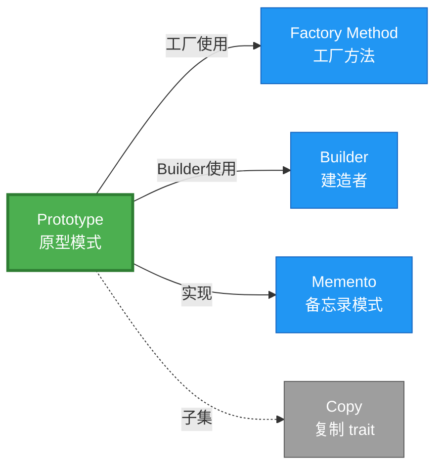

# Prototype 形式化分析

> **创建日期**: 2026-02-12
> **最后更新**: 2026-02-20
> **Rust 版本**: 1.93.0+ (Edition 2024)
> **状态**: ✅ 已完成
> **分类**: 创建型
> **安全边界**: 纯 Safe
> **23 模式矩阵**: [README §23 模式多维对比矩阵](../README.md#23-模式多维对比矩阵) 第 4 行（Prototype）
> **证明深度**: L3（完整证明）

---

## 📊 目录 {#-目录}

- [Prototype 形式化分析](#prototype-形式化分析)
  - [📊 目录 {#-目录}](#-目录--目录)
  - [形式化定义](#形式化定义)
    - [Def 1.1（Prototype 结构）](#def-11prototype-结构)
    - [Axiom P1（独立副本公理）](#axiom-p1独立副本公理)
    - [Axiom P2（引用语义公理）](#axiom-p2引用语义公理)
    - [定理 P-T1（Clone 类型安全定理）](#定理-p-t1clone-类型安全定理)
    - [定理 P-T2（借用安全定理）](#定理-p-t2借用安全定理)
    - [推论 P-C1（Clone 安全使用）](#推论-p-c1clone-安全使用)
    - [概念定义-属性关系-解释论证 层次汇总](#概念定义-属性关系-解释论证-层次汇总)
  - [Rust 实现与代码示例](#rust-实现与代码示例)
  - [完整证明](#完整证明)
    - [形式化论证链](#形式化论证链)
    - [与 Rust 类型系统的联系](#与-rust-类型系统的联系)
    - [内存安全保证](#内存安全保证)
  - [典型场景](#典型场景)
  - [相关模式](#相关模式)
  - [实现变体](#实现变体)
  - [反例：Clone 含浅拷贝引用](#反例clone-含浅拷贝引用)
  - [与 Copy 的关系](#与-copy-的关系)
  - [选型决策树](#选型决策树)
  - [与 GoF 对比](#与-gof-对比)
  - [边界](#边界)
  - [与 Rust 1.93 的对应](#与-rust-193-的对应)
  - [思维导图](#思维导图)
  - [与其他模式的关系图](#与其他模式的关系图)
  - [实质内容五维自检](#实质内容五维自检)

---

## 形式化定义

### Def 1.1（Prototype 结构）

设 $T$ 为原型类型。Prototype 是一个二元组 $\mathcal{P} = (T, \mathit{clone})$，满足：

- $\exists \mathit{clone} : T \to T$，$\mathit{clone}(t)$ 返回 $t$ 的副本
- $\Omega(\mathit{clone}(t)) \neq \Omega(t)$（不同所有者，独立副本）
- **语义保持**：副本与原对象在逻辑上等价，但物理上独立
- **引用语义**：若 $T$ 含引用，Clone 需决定浅拷贝或深拷贝

**形式化表示**：
$$\mathcal{P} = \langle T, \mathit{clone}: T \rightarrow T \rangle$$

---

### Axiom P1（独立副本公理）

$$\forall t: T,\, \mathit{clone}(t) = t' \implies \Omega(t') \cap \Omega(t) = \emptyset \land t' \equiv_{\mathrm{obs}} t$$

Clone 不改变原对象，产生独立副本；观察等价但所有权分离。

### Axiom P2（引用语义公理）

$$\forall t: T,\, \mathit{clone}(t)\text{ 的引用字段行为由实现决定}$$

若 $T$ 含引用，Clone 需复制引用目标或产生新副本；由实现决定（浅拷贝 vs 深拷贝）。

---

### 定理 P-T1（Clone 类型安全定理）

若 $T$ 实现 `Clone`，则 $\mathit{clone}(t)$ 类型为 $T$，所有权独立。

**证明**：

1. **类型签名**：`Clone::clone(&self) -> Self`
   - 输入：`&self`（不可变借用）
   - 输出：`Self`（拥有值）

2. **类型保持**：根据 [type_system_foundations](../../../type_theory/type_system_foundations.md)，
   - $\Gamma \vdash t : T$
   - $\Gamma \vdash \mathit{clone} : \&T \rightarrow T$
   - $\Gamma \vdash \mathit{clone}(&t) : T$

3. **所有权独立**：输出为新拥有值，与原 $t$ 所有权独立
   - $\Omega(\mathit{clone}(t))$ 为新分配
   - $\Omega(t)$ 不变（仅被借用）

由 type_system 类型保持性，得证。$\square$

---

### 定理 P-T2（借用安全定理）

`&self` 借用，返回值拥有所有权；原对象仍有效。

**证明**：

1. **借用规则**：`clone(&self)` 获取不可变借用
   - 借用期间：`self` 不可被修改
   - 借用后：`self` 仍然有效

2. **所有权转移**：返回值为新拥有值

   ```rust
   let a = Config { ... };
   let b = a.clone();  // a 被借用，b 获得新所有权
   // a 仍可使用
   ```

3. **无悬垂**：根据 [ownership_model](../../../formal_methods/ownership_model.md) T2，
   - 借用生命周期不超过原对象
   - 返回值所有权独立

由 ownership T2 及借用规则，得证。$\square$

---

### 推论 P-C1（Clone 安全使用）

若 $T : \text{Clone}$，则 $\mathit{clone}(t)$ 产生的副本可安全传递、存储；与原对象生命周期独立。

**证明**：

1. 由定理 P-T1，返回值类型为 $T$，所有权独立
2. 由定理 P-T2，原对象仍有效
3. 副本可：
   - 存储到不同作用域
   - 发送到其他线程（若 $T: \mathrm{Send}$）
   - 独立修改（若 $T$ 可变）

由 P-T1、P-T2 及 ownership 唯一性，得证。$\square$

---

### 概念定义-属性关系-解释论证 层次汇总

| 层次 | 内容 | 本页对应 |
| :--- | :--- | :--- |
| **概念定义层** | Def 1.1（Prototype 结构）、Axiom P1/P2（独立副本、引用语义） | 上 |
| **属性关系层** | Axiom P1/P2 $\rightarrow$ 定理 P-T1/P-T2 $\rightarrow$ 推论 P-C1；依赖 type、ownership | 上 |
| **解释论证层** | P-T1/P-T2 完整证明；反例：Clone 含浅拷贝引用 | §完整证明、§反例 |

---

## Rust 实现与代码示例

```rust
#[derive(Clone)]
struct Config {
    host: String,
    port: u16,
}

// 使用
let a = Config { host: "localhost".into(), port: 8080 };
let b = a.clone();  // a 仍有效，b 为独立副本
assert_eq!(a.host, b.host);
```

**深拷贝（含嵌套）**：

```rust
#[derive(Clone)]
struct Node {
    value: i32,
    children: Vec<Node>,
}

let tree = Node { value: 1, children: vec![] };
let copy = tree.clone();  // 递归 clone
```

**形式化对应**：`clone(&self) -> Self` 即 $\mathit{clone}$；`#[derive(Clone)]` 自动生成实现。

---

## 完整证明

### 形式化论证链

```text
Axiom P1 (独立副本)
    ↓ 依赖
type_system 类型保持
    ↓ 保证
定理 P-T1 (Clone 类型安全)
    ↓ 组合
Axiom P2 (引用语义)
    ↓ 依赖
ownership_model T2
    ↓ 保证
定理 P-T2 (借用安全)
    ↓ 结论
推论 P-C1 (Clone 安全使用)
```

### 与 Rust 类型系统的联系

| Rust 特性 | Prototype 实现 | 类型安全保证 |
| :--- | :--- | :--- |
| `Clone` trait | 原型复制 | 编译期检查实现 |
| `#[derive(Clone)]` | 自动实现 | 字段级递归 Clone |
| `&self` 借用 | clone 方法 | 原对象仍有效 |
| 所有权返回 | 新实例 | 独立生命周期 |

### 内存安全保证

1. **无悬垂**：`clone` 返回新分配，与原对象无关
2. **借用安全**：`&self` 保证原对象不被修改
3. **递归安全**：`#[derive(Clone)]` 递归检查字段 Clone
4. **深拷贝可控**：手动实现可控制拷贝深度

---

## 典型场景

| 场景 | 说明 |
| :--- | :--- |
| 对象复制 | 配置、文档、游戏实体 |
| 缓存模板 | 以原型为基础做小修改 |
| 深拷贝结构 | 树、图等嵌套结构 |

---

## 相关模式

| 模式 | 关系 |
| :--- | :--- |
| [Factory Method](factory_method.md) | 工厂可基于 Prototype 克隆 |
| [Builder](builder.md) | Builder 可基于 Prototype 克隆 |
| [Memento](../03_behavioral/memento.md) | Clone 可作 Memento 实现 |

---

## 实现变体

| 变体 | 说明 | 适用 |
| :--- | :--- | :--- |
| `#[derive(Clone)]` | 自动实现；浅拷贝 | 无嵌套引用 |
| 手动 Clone | 自定义深拷贝 | 含 Rc、引用等 |
| `Copy` | 隐式复制；无堆 | 小值类型 |

---

## 反例：Clone 含浅拷贝引用

**错误**：`Clone` 仅复制指针，未克隆指向内容；多副本共享同一可变状态。

```rust
struct BadNode { data: Rc<RefCell<i32>> }
impl Clone for BadNode {
    fn clone(&self) -> Self {
        Self { data: Rc::clone(&self.data) }  // 浅拷贝：共享同一 RefCell
    }
}
// 两个 clone 副本修改 data → 互相影响
```

**结论**：若需独立副本，应深拷贝 `RefCell` 内容；或显式文档说明共享语义。

---

## 与 Copy 的关系

`Copy` 为 `Clone` 的子集：隐式复制，无显式 `clone()` 调用。`Clone` 可显式、可含堆分配。

| 特性 | Copy | Clone |
| :--- | :--- | :--- |
| 调用方式 | 隐式 | 显式 `.clone()` |
| 语义 | 位复制 | 逻辑复制 |
| 堆分配 | 无 | 可有 |
| trait 关系 | `Copy: Clone` | 基 trait |

---

## 选型决策树

```text
需要基于已有对象创建副本？
├── 是 → 浅拷贝即可？ → Clone / Copy
│       └── 深拷贝？ → 手动 Clone impl
├── 需多步骤构建？ → Builder
└── 需工厂创建？ → Factory Method
```

---

## 与 GoF 对比

| GoF | Rust 对应 | 差异 |
| :--- | :--- | :--- |
| clone() | Clone::clone | 等价 |
| 原型注册 | HashMap + Clone | 等价 |
| 深拷贝 | 手动 Clone | 等价 |

---

## 边界

| 维度 | 分类 |
| :--- | :--- |
| 安全 | 纯 Safe |
| 支持 | 原生 |
| 表达 | 等价 |

---

## 与 Rust 1.93 的对应

| 1.93 特性 | 与本模式 | 说明 |
| :--- | :--- | :--- |
| 无新增影响 | — | 1.93 无影响 Prototype 语义的变更 |
| 92 项落点 | 无 | 本模式未涉及 [RUST_193_COUNTEREXAMPLES_INDEX](../../../RUST_193_COUNTEREXAMPLES_INDEX.md) 特定项 |

---

## 思维导图

```mermaid
mindmap
  root((Prototype<br/>原型模式))
    结构
      Prototype trait
      clone(&self) → Self
      原对象保留
    行为
      位复制或逻辑复制
      所有权转移给副本
      原对象仍有效
    实现方式
      #[derive(Clone)]
      手动 Clone impl
      Copy trait
    应用场景
      配置复制
      模板缓存
      深拷贝结构
      对象快照
```

---

## 与其他模式的关系图



---

## 实质内容五维自检

| 自检项 | 状态 | 说明 |
| :--- | :--- | :--- |
| 形式化 | ✅ | Def 1.1、Axiom P1/P2、定理 P-T1/T2（L3 完整证明）、推论 P-C1 |
| 代码 | ✅ | Clone impl 示例 |
| 场景 | ✅ | 典型场景、与 Copy 关系 |
| 反例 | ✅ | Clone 含浅拷贝引用 |
| 衔接 | ✅ | ownership、borrow、04_boundary_matrix |
| 权威对应 | ✅ | [GoF](../README.md#与-gof-原书对应)、[formal_methods](../../../formal_methods/README.md)、[INTERNATIONAL_FORMAL_VERIFICATION_INDEX](../../../INTERNATIONAL_FORMAL_VERIFICATION_INDEX.md) |
