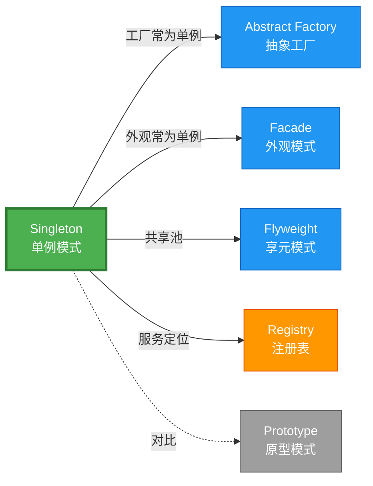

# Singleton 形式化分析

> **创建日期**: 2026-02-12
> **最后更新**: 2026-02-28
> **Rust 版本**: 1.93.1+ (Edition 2024)
> **状态**: ✅ 已完成
> **分类**: 创建型
> **安全边界**: 纯 Safe 或 需 unsafe
> **23 模式矩阵**: [README §23 模式多维对比矩阵](../README.md#23-模式多维对比矩阵) 第 5 行（Singleton）
> **证明深度**: L3（完整证明）

---

## 📊 目录 {#-目录}

- [Singleton 形式化分析](#singleton-形式化分析)
  - [📊 目录 {#-目录}](#-目录--目录)
  - [形式化定义](#形式化定义)
    - [Def 1.1（Singleton 结构）](#def-11singleton-结构)
    - [Axiom S1（实例唯一性公理）](#axiom-s1实例唯一性公理)
    - [Axiom S2（惰性初始化公理）](#axiom-s2惰性初始化公理)
    - [Axiom S3（线程安全公理）](#axiom-s3线程安全公理)
    - [定理 S-T1（OnceLock 线程安全定理）](#定理-s-t1oncelock-线程安全定理)
    - [定理 S-T2（全局可变单例安全性定理）](#定理-s-t2全局可变单例安全性定理)
    - [引理 S-L1（OnceLock 单次执行引理）](#引理-s-l1oncelock-单次执行引理)
    - [推论 S-C1（纯 Safe Singleton）](#推论-s-c1纯-safe-singleton)
    - [概念定义-属性关系-解释论证 层次汇总](#概念定义-属性关系-解释论证-层次汇总)
  - [Rust 实现与代码示例](#rust-实现与代码示例)
    - [方式一：OnceLock（纯 Safe，推荐）](#方式一oncelock纯-safe推荐)
    - [方式二：LazyLock（纯 Safe）](#方式二lazylock纯-safe)
    - [方式三：带内部可变（Safe）](#方式三带内部可变safe)
  - [完整证明](#完整证明)
    - [形式化论证链](#形式化论证链)
    - [与 Rust 类型系统的联系](#与-rust-类型系统的联系)
    - [内存安全保证](#内存安全保证)
  - [典型场景](#典型场景)
  - [相关模式](#相关模式)
  - [实现变体](#实现变体)
  - [反例](#反例)
  - [边界](#边界)
  - [与 Rust 1.93 的对应](#与-rust-193-的对应)
  - [思维导图](#思维导图)
  - [与其他模式的关系图](#与其他模式的关系图)
  - [实质内容五维自检](#实质内容五维自检)

---

## 形式化定义

### Def 1.1（Singleton 结构）

设 $T$ 为单例类型。Singleton 是一个三元组 $\mathcal{S} = (T, \mathit{instance}, \mathit{init})$，满足：

- $\exists \mathit{instance} : () \to \mathrm{Arc}\langle T \rangle$ 或 $\mathit{instance} : () \to \&'\mathrm{static}\, T$
- **全局唯一性**：$\forall t_1, t_2 \in \mathit{instances},\, t_1 = t_2$（同一引用或 Arc 克隆）
- **惰性初始化**：$\mathit{init}$ 仅在首次访问时执行
- **线程安全**：多线程并发首次访问时，$\mathit{init}$ 仅执行一次

**形式化表示**：
$$\mathcal{S} = \langle T, \mathit{instance}, \mathit{init} \rangle$$

其中：

- $\mathit{instance}: () \rightarrow \&'\mathrm{static}\, T$（获取实例函数）
- $\mathit{init}: () \rightarrow T$（初始化函数，惰性执行）
- $\mathit{once}: \mathrm{AtomicBool}$（初始化标志）

---

### Axiom S1（实例唯一性公理）

$$\forall t_1, t_2 : T,\, \mathit{instance}() = t_1 \land \mathit{instance}() = t_2 \implies t_1 = t_2$$

### Axiom S2（惰性初始化公理）

$$\mathit{init}\text{ 仅在 }\mathit{once} = \mathrm{false} \text{ 时执行，且执行后 }\mathit{once} \leftarrow \mathrm{true}$$

### Axiom S3（线程安全公理）

$$\forall \tau_1, \tau_2 \in \mathrm{Threads},\, \mathit{init}\text{ 的原子性保证仅执行一次}$$

---

### 定理 S-T1（OnceLock 线程安全定理）

`OnceLock<T>` 提供线程安全的惰性初始化，无需 unsafe。

**证明**：

1. **唯一性**：`OnceLock` 内部使用原子状态机（`AtomicUsize`），`get_or_init` 闭包至多执行一次
   - 初始状态：$\mathit{state} = 0$（未初始化）
   - 进行中状态：$\mathit{state} = 1$（初始化中）
   - 完成状态：$\mathit{state} = 2$（已初始化）

   原子 CAS 操作保证状态转换的唯一性：
   $$
   \mathrm{CAS}(\mathit{state}, 0, 1) = \mathrm{true} \implies \text{当前线程执行 } \mathit{init}
   $$

2. **线程安全**：后续 `get` 仅读已初始化值，无写操作
   - 内存顺序：`Acquire`/`Release` 保证可见性
   - $\forall \tau \in \mathrm{Threads},\, \mathit{get}()$ 返回同一实例

3. **Safe API**：标准库将内部 `unsafe` 封装为安全抽象
   - 内部实现使用 `UnsafeCell` 和原子操作
   - 对外暴露的 API 为纯 Safe Rust

由 Axiom S1、S2、S3 及 [safe_unsafe_matrix](../../05_boundary_system/safe_unsafe_matrix.md) SBM-T1，得证。$\square$

---

### 定理 S-T2（全局可变单例安全性定理）

传统全局可变需 `unsafe` 或 `Mutex`；`Mutex` 为 Safe 抽象。

**证明**：

1. **`static mut` 的危险性**：
   - 多线程访问 `static mut` 无同步 $\implies$ 数据竞争 $\implies$ UB
   - Rust 1.0+ 已废弃 `static mut` 推荐用法

2. **`Mutex` 的安全性**：
   - `Mutex<T>` 封装内部 `UnsafeCell<T>`
   - 运行时借用检查：$\mathit{lock}() \rightarrow \mathrm{Guard}$，$\mathrm{Guard}\text{ 释放时 }\mathit{unlock}()$
   - 所有权不变：$\Omega(\mathrm{Mutex}) = \Omega(T)$，仅提供互斥访问

3. **类型安全保证**：
   - `Arc<Mutex<T>>: Send + Sync` 当 $T: Send$
   - 跨线程共享时，编译器检查 `Send`/`Sync` 实现

由 [safe_unsafe_matrix](../../05_boundary_system/safe_unsafe_matrix.md) SBM-T2 及 ownership_model，得证。$\square$

---

### 引理 S-L1（OnceLock 单次执行引理）

若用 `OnceLock<T>` 且 $T: \mathrm{Send}$，则 `get_or_init` 闭包仅执行一次；多线程并发调用时由内部同步序列化。

**证明**：

设两线程 $\tau_1, \tau_2$ 同时调用 `get_or_init(f)`：

1. $\tau_1$ 执行 $\mathrm{CAS}(\mathit{state}, 0, 1)$，成功，进入初始化
2. $\tau_2$ 执行 $\mathrm{CAS}(\mathit{state}, 0, 1)$，失败（$\mathit{state} = 1$），自旋等待
3. $\tau_1$ 完成初始化，设置 $\mathit{state} = 2$（Release）
4. $\tau_2$ 检测到 $\mathit{state} = 2$，返回已初始化值（Acquire）

由原子操作顺序一致性，$f$ 仅执行一次。$\square$

---

### 推论 S-C1（纯 Safe Singleton）

`OnceLock`/`LazyLock` 实现的 Singleton 为纯 Safe；标准库封装内部 `unsafe`，对外无暴露。

**证明**：由定理 S-T1、引理 S-L1 及 SBM-T1，标准库内部使用 `unsafe` 实现原子操作和内存屏障，但对外 API 完全在 Safe Rust 范围内。$\square$

---

### 概念定义-属性关系-解释论证 层次汇总

| 层次 | 内容 | 本页对应 |
| :--- | :--- | :--- |
| **概念定义层** | Def 1.1（Singleton 结构）、Axiom S1/S2/S3（唯一性、惰性、线程安全） | 上 |
| **属性关系层** | Axiom S1/S2/S3 $\rightarrow$ 定理 S-T1/S-T2、引理 S-L1 $\rightarrow$ 推论 S-C1；依赖 safe_unsafe_matrix | 上 |
| **解释论证层** | S-T1/S-T2 完整证明；反例：`static mut` 多线程 UB | §完整证明、§反例 |

---

## Rust 实现与代码示例

### 方式一：OnceLock（纯 Safe，推荐）

```rust
use std::sync::OnceLock;

static INSTANCE: OnceLock<String> = OnceLock::new();

fn get_instance() -> &'static String {
    INSTANCE.get_or_init(|| "singleton".to_string())
}
```

### 方式二：LazyLock（纯 Safe）

```rust
use std::sync::LazyLock;

static INSTANCE: LazyLock<String> = LazyLock::new(|| "singleton".to_string());

fn get_instance() -> &'static String {
    &INSTANCE
}
```

### 方式三：带内部可变（Safe）

```rust
use std::sync::{Arc, Mutex, OnceLock};

static INSTANCE: OnceLock<Arc<Mutex<i32>>> = OnceLock::new();

fn get_instance() -> Arc<Mutex<i32>> {
    INSTANCE.get_or_init(|| Arc::new(Mutex::new(0))).clone()
}
```

**形式化对应**：`get_or_init` 保证仅初始化一次；`OnceLock` 内部同步，无数据竞争。

---

## 完整证明

### 形式化论证链

```text
Axiom S1 (唯一性)
    ↓ 依赖
Axiom S2 (惰性)
    ↓ 依赖
Axiom S3 (线程安全)
    ↓ 实现
OnceLock 原子状态机 (0→1→2)
    ↓ 保证
定理 S-T1 (线程安全惰性初始化)
    ↓ 组合
Mutex/RwLock (内部可变)
    ↓ 保证
定理 S-T2 (全局可变安全性)
    ↓ 推导
引理 S-L1 (单次执行)
    ↓ 结论
推论 S-C1 (纯 Safe Singleton)
```

### 与 Rust 类型系统的联系

| Rust 特性 | Singleton 实现 | 类型安全保证 |
| :--- | :--- | :--- |
| `&'static T` | 全局访问 | 生命周期 'static 保证永不过期 |
| `OnceLock<T>` | 惰性初始化 | `T: Send` 约束保证线程安全 |
| `Arc<Mutex<T>>` | 可变共享 | `MutexGuard` 保证独占访问 |
| `LazyLock<T>` | 声明式惰性 | `Deref` 自动解引用 |

### 内存安全保证

1. **无悬垂指针**：`'static` 生命周期保证实例永不过期
2. **无数据竞争**：`OnceLock` 原子操作保证初始化串行化
3. **无双重释放**：`Arc` 引用计数管理内存
4. **无使用未初始化**：`OnceLock::get()` 返回 `Option`，强制处理未初始化情况

---

## 典型场景

| 场景 | 说明 |
| :--- | :--- |
| 配置/全局设置 | 应用配置、环境变量 |
| 连接池 | 数据库、HTTP 客户端 |
| 日志/追踪 | 全局 logger、tracer |
| 服务定位 | Registry、依赖注入根 |

---

## 相关模式

| 模式 | 关系 |
| :--- | :--- |
| [Abstract Factory](abstract_factory.md) | 工厂常为单例 |
| [Facade](../02_structural/facade.md) | 外观常为单例 |
| Registry（43 完全） | 服务定位即单例；[02_complete_43_catalog](../../02_workflow_safe_complete_models/02_complete_43_catalog.md) |

---

## 实现变体

| 变体 | 说明 | 适用 |
| :--- | :--- | :--- |
| `OnceLock<T>` | 惰性、线程安全；首次 get_or_init | 简单单例 |
| `LazyLock<T>` | 声明时指定初始化；线程安全 | 初始化逻辑简单 |
| `Arc<Mutex<T>>` + OnceLock | 内部可变单例 | 需修改状态 |
| 依赖注入 | 构造时传入；无全局 | 可测试、灵活 |

---

## 反例

**反例**：使用 `static mut` 且多线程访问未同步 $\rightarrow$ 数据竞争、UB。应使用 `OnceLock`/`LazyLock` 或 `Mutex`。

```rust
// 错误：UB！
static mut COUNTER: i32 = 0;

unsafe {
    // 多线程同时执行此代码 → 数据竞争
    COUNTER += 1;
}
```

**正确**：

```rust
static COUNTER: OnceLock<Mutex<i32>> = OnceLock::new();

let counter = COUNTER.get_or_init(|| Mutex::new(0));
*counter.lock().unwrap() += 1;
```

---

## 边界

| 维度 | 分类 |
| :--- | :--- |
| 安全 | Safe（OnceLock/LazyLock）或 需 unsafe（static mut） |
| 支持 | 原生 |
| 表达 | 近似（无全局可变） |

---

## 与 Rust 1.93 的对应

| 1.93 特性 | 与本模式 | 说明 |
| :--- | :--- | :--- |
| `LazyLock` 稳定 | 方式二 | 1.80+ 稳定；与 `OnceLock` 同为推荐实现 |
| `OnceLock` | 方式一 | 1.70+ 稳定，惰性初始化首选 |
| 无新增影响 | — | 1.93 无影响 Singleton 语义的变更 |
| 92 项落点 | 无 | 本模式未涉及 [RUST_193_COUNTEREXAMPLES_INDEX](../../../RUST_193_COUNTEREXAMPLES_INDEX.md) 特定项 |

---

## 思维导图

```mermaid
mindmap
  root((Singleton<br/>单例模式))
    结构
      instance() → &'static T
      init() 惰性执行
      once 原子标志
    行为
      首次访问初始化
      后续访问返回同一实例
      线程安全保证
    实现方式
      OnceLock&lt;T&gt;
      LazyLock&lt;T&gt;
      Arc&lt;Mutex&lt;T&gt;&gt;
    应用场景
      全局配置
      连接池
      日志系统
      服务注册表
```

---

## 与其他模式的关系图



---

## 实质内容五维自检

| 自检项 | 状态 | 说明 |
| :--- | :--- | :--- |
| 形式化 | ✅ | Def 1.1、Axiom S1/S2/S3、定理 S-T1/T2（L3 完整证明）、引理 S-L1、推论 S-C1 |
| 代码 | ✅ | 三方式可运行示例 |
| 场景 | ✅ | 典型场景表（配置、连接池、日志等） |
| 反例 | ✅ | `static mut` 多线程 UB |
| 衔接 | ✅ | safe_unsafe_matrix、ownership_model、02_complete_43 |
| 权威对应 | ✅ | [GoF](../README.md#与-gof-原书对应)、[formal_methods](../../../formal_methods/README.md)、[INTERNATIONAL_FORMAL_VERIFICATION_INDEX](../../../INTERNATIONAL_FORMAL_VERIFICATION_INDEX.md) |
