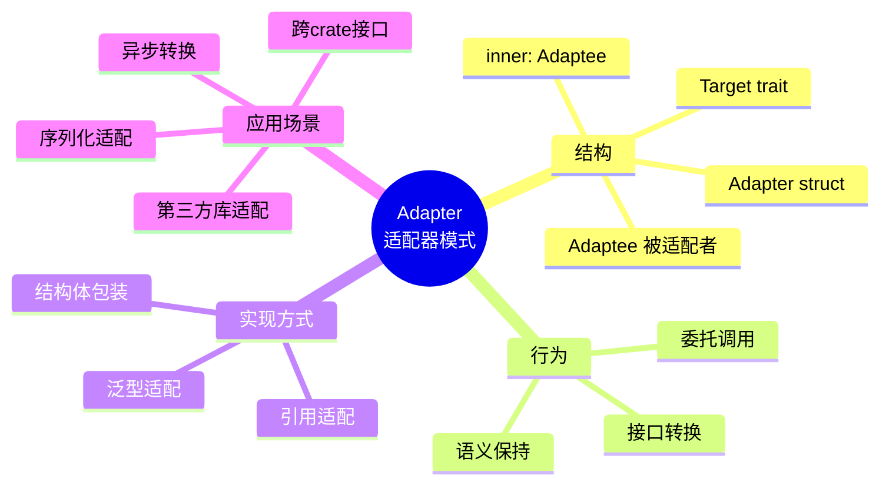
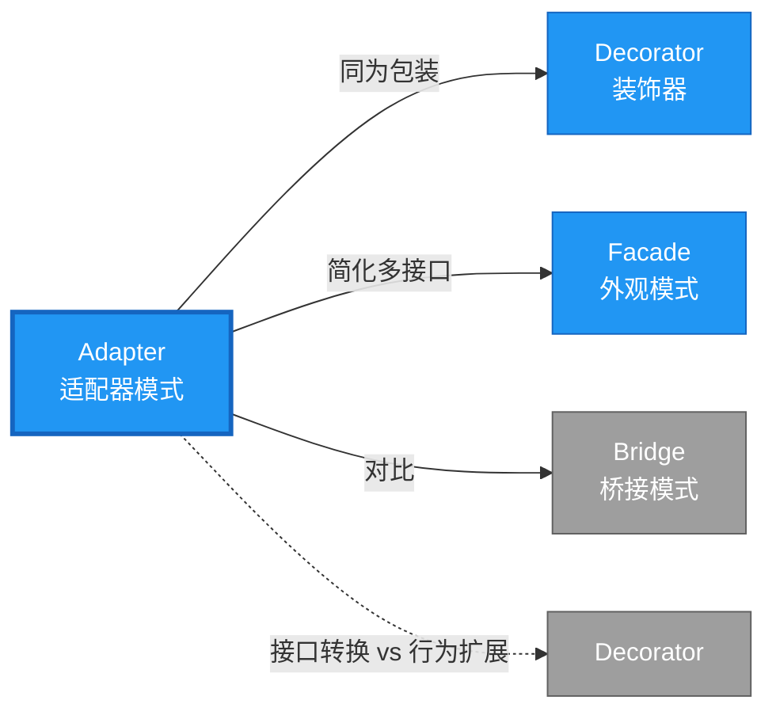

# Adapter 形式化分析

> **创建日期**: 2026-02-12
> **最后更新**: 2026-02-28
> **Rust 版本**: 1.93.1+ (Edition 2024)
> **状态**: ✅ 已完成
> **分类**: 结构型
> **安全边界**: 纯 Safe
> **23 模式矩阵**: [README §23 模式多维对比矩阵](../README.md#23-模式多维对比矩阵) 第 6 行（Adapter）
> **证明深度**: L3（完整证明）

---

## 📊 目录 {#-目录}

- [Adapter 形式化分析](#adapter-形式化分析)
  - [📊 目录 {#-目录}](#-目录--目录)
  - [形式化定义](#形式化定义)
    - [Def 1.1（Adapter 结构）](#def-11adapter-结构)
    - [Axiom AD1（语义保持公理）](#axiom-ad1语义保持公理)
    - [Axiom AD2（委托借用公理）](#axiom-ad2委托借用公理)
    - [定理 AD-T1（所有权安全定理）](#定理-ad-t1所有权安全定理)
    - [定理 AD-T2（借用冲突避免定理）](#定理-ad-t2借用冲突避免定理)
    - [推论 AD-C1（纯 Safe Adapter）](#推论-ad-c1纯-safe-adapter)
    - [概念定义-属性关系-解释论证 层次汇总](#概念定义-属性关系-解释论证-层次汇总)
  - [Rust 实现与代码示例](#rust-实现与代码示例)
  - [完整证明](#完整证明)
    - [形式化论证链](#形式化论证链)
    - [与 Rust 类型系统的联系](#与-rust-类型系统的联系)
    - [内存安全保证](#内存安全保证)
  - [典型场景](#典型场景)
  - [完整场景示例：第三方 HTTP 客户端适配](#完整场景示例第三方-http-客户端适配)
  - [相关模式](#相关模式)
  - [实现变体](#实现变体)
  - [反例：适配器修改被适配者语义](#反例适配器修改被适配者语义)
  - [选型决策树](#选型决策树)
  - [与 GoF 对比](#与-gof-对比)
  - [边界](#边界)
  - [与 Rust 1.93 的对应](#与-rust-193-的对应)
  - [思维导图](#思维导图)
  - [与其他模式的关系图](#与其他模式的关系图)
  - [实质内容五维自检](#实质内容五维自检)

---

## 形式化定义

### Def 1.1（Adapter 结构）

设 $A$ 为适配器类型，$T$ 为目标接口类型，$S$ 为被适配类型。Adapter 是一个四元组 $\mathcal{AD} = (A, T, S, \mathit{adapt})$，满足：

- $A$ 持有 $S$：$\Omega(A) \supset S$（$A$ 拥有 $S$）
- $A$ 实现 $T$：$\mathit{impl}\, T \, \mathit{for}\, A$
- $\mathit{op}_T(a)$ 委托给 $a.\mathit{inner}.\mathit{op}_S()$，即委托给 $S$ 的接口
- **语义保持**：适配器不改变被适配对象语义，仅转换接口形式

**形式化表示**：
$$\mathcal{AD} = \langle A, T, S, \mathit{adapt}: A \times S \rightarrow \mathrm{impl}\,T \rangle$$

---

### Axiom AD1（语义保持公理）

$$\forall a: A,\, \mathit{op}_T(a) \equiv_{\mathrm{sem}} \mathit{op}_S(a.\mathit{inner})$$

适配器不改变被适配对象语义，仅转换接口形式。

### Axiom AD2（委托借用公理）

$$\mathit{op}_T(\&a) \text{ 内调用 } \&a.\mathit{inner} \text{，满足借用规则}$$

委托时借用满足 Rust 借用规则。

---

### 定理 AD-T1（所有权安全定理）

由 [ownership_model](../../../formal_methods/ownership_model.md)，$A$ 拥有 $S$，委托调用时 `&self.inner` 借用有效，无悬垂。

**证明**：

1. **持有关系**：$\Omega(A) \supset S$ 表示 $A$ 拥有 $S$

   ```rust
   struct Adapter { inner: S }  // A 拥有 S
   ```

2. **借用链**：`op_T(&self)` 中：
   - `&self` 借用 $A$
   - `&self.inner` 借用 $S$（子借用）
   - 根据借用规则，子借用的生命周期不超过父借用

3. **无悬垂**：
   - $S$ 的生命周期与 $A$ 绑定
   - $A$ 存活期间，$S$ 有效
   - `&self.inner` 不会悬垂

由 ownership_model 及借用规则，得证。$\square$

---

### 定理 AD-T2（借用冲突避免定理）

由 [borrow_checker_proof](../../../formal_methods/borrow_checker_proof.md)，委托链上无双重可变借用。

**证明**：

1. **委托模式**：`op_T(&self)` → `self.inner.op_S()`
   - `op_T` 接收 `&self`（不可变借用）
   - `op_S` 可能接收 `&self` 或 `&mut self`

2. **冲突检查**：
   - 若 `op_S` 需 `&mut self`，则 `op_T` 需 `&mut self`
   - 借用检查器验证同一作用域内无冲突借用

3. **委托链**：

   ```rust
   impl Target for Adapter {
       fn op(&self) {  // &self
           self.inner.source_op();  // &self 借用 inner
       }
   }
   ```

   - 单层委托：无冲突
   - 多层委托：递归检查

由 borrow_checker_proof 互斥规则，得证。$\square$

---

### 推论 AD-C1（纯 Safe Adapter）

Adapter 为纯 Safe；仅用结构体包装、委托、`impl Trait`，无 `unsafe`。

**证明**：

1. 结构体定义：`struct Adapter { inner: S }` 纯 Safe
2. trait 实现：`impl Target for Adapter` 纯 Safe
3. 委托调用：`self.inner.method()` 纯 Safe
4. 无裸指针、无 FFI、无 `unsafe` 块

由 AD-T1、AD-T2 及 [safe_unsafe_matrix](../../05_boundary_system/safe_unsafe_matrix.md) SBM-T1，得证。$\square$

---

### 概念定义-属性关系-解释论证 层次汇总

| 层次 | 内容 | 本页对应 |
| :--- | :--- | :--- |
| **概念定义层** | Def 1.1（Adapter 结构）、Axiom AD1/AD2（语义保持、委托借用） | 上 |
| **属性关系层** | Axiom AD1/AD2 $\rightarrow$ 定理 AD-T1/AD-T2 $\rightarrow$ 推论 AD-C1；依赖 ownership、borrow | 上 |
| **解释论证层** | AD-T1/AD-T2 完整证明；反例：适配器修改被适配者语义 | §完整证明、§反例 |

---

## Rust 实现与代码示例

```rust
// 被适配者：第三方库接口
struct LegacyLogger;
impl LegacyLogger {
    fn log_to_stdout(&self, msg: &str) {
        println!("[ legacy ] {}", msg);
    }
}

// 目标接口
trait Logger {
    fn log(&self, msg: &str);
}

// 适配器
struct Adapter { inner: LegacyLogger }

impl Logger for Adapter {
    fn log(&self, msg: &str) {
        self.inner.log_to_stdout(msg);  // 委托
    }
}

// 使用
let a = Adapter { inner: LegacyLogger };
a.log("hello");
```

**形式化对应**：`Adapter` 即 $A$；`Logger` 即 $T$；`LegacyLogger` 即 $S$。`inner` 为 $A \supset S$。

---

## 完整证明

### 形式化论证链

```text
Axiom AD1 (语义保持)
    ↓ 约束
Axiom AD2 (委托借用)
    ↓ 依赖
ownership_model
    ↓ 保证
定理 AD-T1 (所有权安全)
    ↓ 组合
borrow_checker_proof
    ↓ 保证
定理 AD-T2 (借用冲突避免)
    ↓ 结论
推论 AD-C1 (纯 Safe Adapter)
```

### 与 Rust 类型系统的联系

| Rust 特性 | Adapter 实现 | 类型安全保证 |
| :--- | :--- | :--- |
| 结构体组合 | `inner: S` | 持有被适配者 |
| `impl Trait` | 目标接口实现 | 编译期检查方法 |
| 借用检查 | `&self` 委托 | 无悬垂/冲突借用 |
| 所有权 | 拥有 $S$ | $S$ 生命周期绑定 |

### 内存安全保证

1. **无悬垂**：`Adapter` 拥有 `S`，生命周期绑定
2. **借用安全**：委托链符合借用规则
3. **类型安全**：trait 实现编译期检查
4. **无泄漏**：`Adapter` 释放时 `S` 一同释放

---

## 典型场景

| 场景 | 说明 |
| :--- | :--- |
| 第三方库适配 | 旧版 API 适配新 trait |
| 跨 crate 接口 | 外部类型实现本 crate trait |
| 序列化适配 | 外部格式 → 内部类型 |
| 异步适配 | 同步接口包装为 async |

---

## 完整场景示例：第三方 HTTP 客户端适配

**场景**：现有 `reqwest` 返回 `Result<Response, reqwest::Error>`；需适配为统一 `trait HttpClient` 返回 `Result<String, Box<dyn std::error::Error>>`。

```rust
trait HttpClient {
    fn get(&self, url: &str) -> Result<String, Box<dyn std::error::Error>>;
}

// 被适配者（假设外部 crate）
struct ReqwestClient;
impl ReqwestClient {
    fn fetch(&self, url: &str) -> Result<String, reqwest::Error> {
        // 实际 reqwest::blocking::get(url)?.text()
        Ok(String::new())
    }
}

// 适配器
struct ReqwestAdapter { inner: ReqwestClient }

impl HttpClient for ReqwestAdapter {
    fn get(&self, url: &str) -> Result<String, Box<dyn std::error::Error>> {
        self.inner.fetch(url).map_err(|e| e.into())
    }
}

// 客户端仅依赖 HttpClient trait
fn fetch_data<H: HttpClient>(client: &H, url: &str) -> Result<String, Box<dyn std::error::Error>> {
    client.get(url)
}
```

**形式化对应**：`ReqwestAdapter` 即 $A$；`HttpClient` 即 $T$；`ReqwestClient` 即 $S$；`map_err` 转换错误类型，满足 Axiom AD1。

---

## 相关模式

| 模式 | 关系 |
| :--- | :--- |
| [Decorator](decorator.md) | 同为包装；Adapter 转换接口，Decorator 同接口延伸 |
| [Facade](facade.md) | Facade 简化多接口；Adapter 转换单接口 |
| [Bridge](bridge.md) | Bridge 解耦抽象与实现；Adapter 适配已有接口 |

---

## 实现变体

| 变体 | 说明 | 适用 |
| :--- | :--- | :--- |
| 结构体包装 | `struct Adapter { inner: S }` + `impl Trait` | 所有权适配 |
| 引用适配 | `impl Trait for &Legacy` | 不拥有被适配者 |
| 泛型适配 | `impl<T: Legacy> Trait for Adapter<T>` | 多类型适配 |

---

## 反例：适配器修改被适配者语义

**错误**：Adapter 在委托时静默丢弃、篡改或反转语义。

```rust
impl Logger for BadAdapter {
    fn log(&self, msg: &str) {
        if msg.contains("secret") { return; }  // 静默丢弃，违反 Axiom AD1
        self.inner.log_to_stdout(&msg.to_uppercase());  // 篡改内容
    }
}
```

**后果**：客户端期望与目标接口一致；语义偏移导致难以推理。

---

## 选型决策树

```text
需要让类型 S 满足接口 T？
├── S 已拥有类似功能，仅接口不同 → Adapter（包装 + 委托）
├── S 需扩展行为（同接口） → Decorator
├── S 需简化多接口调用 → Facade
└── S 为抽象，需解耦实现 → Bridge
```

---

## 与 GoF 对比

| GoF | Rust 对应 | 差异 |
| :--- | :--- | :--- |
| 类继承适配 | 结构体包装 + impl Trait | 无继承；组合 |
| 对象适配器 | `struct Adapter { inner: S }` | 完全等价 |
| 类适配器（多重继承） | 无直接对应 | Rust 无类继承 |

---

## 边界

| 维度 | 分类 |
| :--- | :--- |
| 安全 | 纯 Safe |
| 支持 | 原生 |
| 表达 | 等价 |

---

## 与 Rust 1.93 的对应

| 1.93 特性 | 与本模式 | 说明 |
| :--- | :--- | :--- |
| 无新增影响 | — | 1.93 无影响 Adapter 语义的变更 |
| 92 项落点 | 无 | 本模式未涉及 [RUST_193_COUNTEREXAMPLES_INDEX](../../../RUST_193_COUNTEREXAMPLES_INDEX.md) 特定项 |

---

## 思维导图



---

## 与其他模式的关系图



---

## 实质内容五维自检

| 自检项 | 状态 | 说明 |
| :--- | :--- | :--- |
| 形式化 | ✅ | Def 1.1、Axiom AD1/AD2、定理 AD-T1/T2（L3 完整证明）、推论 AD-C1 |
| 代码 | ✅ | 可运行示例、完整场景 |
| 场景 | ✅ | 典型场景、第三方 HTTP 适配 |
| 反例 | ✅ | 适配器修改被适配者语义 |
| 衔接 | ✅ | ownership、borrow、CE-T1 |
| 权威对应 | ✅ | [GoF](../README.md#与-gof-原书对应)、[formal_methods](../../../formal_methods/README.md)、[INTERNATIONAL_FORMAL_VERIFICATION_INDEX](../../../INTERNATIONAL_FORMAL_VERIFICATION_INDEX.md) |
