# Bridge 形式化分析

> **创建日期**: 2026-02-12
> **最后更新**: 2026-02-20
> **Rust 版本**: 1.93.0+ (Edition 2024)
> **状态**: ✅ 已完成
> **分类**: 结构型
> **安全边界**: 纯 Safe
> **23 模式矩阵**: [README §23 模式多维对比矩阵](../README.md#23-模式多维对比矩阵) 第 7 行（Bridge）
> **证明深度**: L3（完整证明）

---

## 📊 目录

- [Bridge 形式化分析](#bridge-形式化分析)
  - [📊 目录](#-目录)
  - [形式化定义](#形式化定义)
    - [Def 1.1（Bridge 结构）](#def-11bridge-结构)
    - [Axiom BR1（解耦公理）](#axiom-br1解耦公理)
    - [Axiom BR2（委托借用公理）](#axiom-br2委托借用公理)
    - [定理 BR-T1（trait 类型安全定理）](#定理-br-t1trait-类型安全定理)
    - [定理 BR-T2（组合优于继承定理）](#定理-br-t2组合优于继承定理)
    - [推论 BR-C1（纯 Safe Bridge）](#推论-br-c1纯-safe-bridge)
    - [概念定义-属性关系-解释论证 层次汇总](#概念定义-属性关系-解释论证-层次汇总)
  - [Rust 实现与代码示例](#rust-实现与代码示例)
  - [完整证明](#完整证明)
    - [形式化论证链](#形式化论证链)
    - [与 Rust 类型系统的联系](#与-rust-类型系统的联系)
    - [内存安全保证](#内存安全保证)
  - [典型场景](#典型场景)
  - [相关模式](#相关模式)
  - [实现变体](#实现变体)
  - [反例：抽象与实现紧耦合](#反例抽象与实现紧耦合)
  - [选型决策树](#选型决策树)
  - [与 GoF 对比](#与-gof-对比)
  - [边界](#边界)
  - [与 Rust 1.93 的对应](#与-rust-193-的对应)
  - [思维导图](#思维导图)
  - [与其他模式的关系图](#与其他模式的关系图)
  - [实质内容五维自检](#实质内容五维自检)

---

## 形式化定义

### Def 1.1（Bridge 结构）

设 $\mathcal{A}$ 为抽象类型，$\mathcal{I}$ 为实现类型。Bridge 是一个三元组 $\mathcal{BR} = (\mathcal{A}, \mathcal{I}, \mathit{bridge})$，满足：

- $\mathcal{A}$ 持有 $\mathcal{I}$：$\mathcal{A} \supset \mathcal{I}$
- 抽象与实现可独立变化；二者通过 trait 解耦
- trait 定义 $\mathcal{I}$，$\mathcal{A}$ 通过泛型 `T: Impl` 或 `Box<dyn Impl>` 使用
- **双向扩展**：抽象和实现可独立添加新变体

**形式化表示**：
$$\mathcal{BR} = \langle \mathcal{A}, \mathcal{I}, \mathit{bridge}: \mathcal{A} \times \mathcal{I} \rightarrow \mathrm{Behavior} \rangle$$

---

### Axiom BR1（解耦公理）

$$\forall \mathcal{A}, \mathcal{I},\, \mathcal{A}\text{ 与 }\mathcal{I}\text{ 无编译期依赖，仅通过 trait 约束关联}$$

抽象与实现解耦，二者可独立扩展。

### Axiom BR2（委托借用公理）

$$\mathcal{A}.\mathit{op} \text{ 调用 } \mathcal{I}.\mathit{impl\_op} \text{，满足借用规则}$$

委托时借用满足 Rust 借用规则。

---

### 定理 BR-T1（trait 类型安全定理）

由 [trait_system_formalization](../../../type_theory/trait_system_formalization.md)，trait 对象或泛型保证类型安全。

**证明**：

1. **泛型版本**：

   ```rust
   struct Circle<R: Renderer> { renderer: R }
   impl<R: Renderer> Circle<R> { fn draw(&self) { self.renderer.render_circle(...); } }
   ```

   - 编译期单态化：为每个 `R` 生成特定代码
   - 类型约束：`R: Renderer` 保证 `render_circle` 存在
   - 零运行时开销

2. **trait 对象版本**：

   ```rust
   struct Circle { renderer: Box<dyn Renderer> }
   ```

   - 运行时虚表派发
   - 类型安全：虚表在构造时确定

3. **独立性**：
   - 添加新 `Renderer`：实现 trait，无需修改 `Circle`
   - 添加新形状：定义新结构体，使用现有 `Renderer`

由 trait_system_formalization 解析正确性，得证。$\square$

---

### 定理 BR-T2（组合优于继承定理）

Bridge 模式使用组合而非继承，避免继承层次爆炸。

**证明**：

1. **继承方式**（GoF）：
   - $N$ 个抽象变体 × $M$ 个实现变体 = $N \times M$ 个类
   - 类爆炸：$O(N \times M)$

2. **组合方式**（Rust Bridge）：
   - $N$ 个抽象变体 + $M$ 个实现变体 = $N + M$ 个类型
   - 线性增长：$O(N + M)$

3. **独立扩展**：
   - 新增抽象：添加新结构体，复用现有 `Renderer`
   - 新增实现：实现 `Renderer`，所有形状自动支持

由组合数学及 Rust trait 系统，得证。$\square$

---

### 推论 BR-C1（纯 Safe Bridge）

Bridge 为纯 Safe；trait 解耦抽象与实现，无 `unsafe`。

**证明**：

1. trait 定义：`trait Renderer { ... }` 纯 Safe
2. 泛型约束：`R: Renderer` 纯 Safe
3. 组合持有：`struct Circle<R> { renderer: R }` 纯 Safe
4. 委托调用：`self.renderer.render()` 纯 Safe
5. 无 `unsafe` 块：整个 Bridge 实现无需 unsafe

由 BR-T1、BR-T2 及 [safe_unsafe_matrix](../../05_boundary_system/safe_unsafe_matrix.md) SBM-T1，得证。$\square$

---

### 概念定义-属性关系-解释论证 层次汇总

| 层次 | 内容 | 本页对应 |
| :--- | :--- | :--- |
| **概念定义层** | Def 1.1（Bridge 结构）、Axiom BR1/BR2（解耦、委托借用） | 上 |
| **属性关系层** | Axiom BR1/BR2 $\rightarrow$ 定理 BR-T1/BR-T2 $\rightarrow$ 推论 BR-C1；依赖 trait、safe_unsafe_matrix | 上 |
| **解释论证层** | BR-T1/BR-T2 完整证明；反例：抽象与实现紧耦合 | §完整证明、§反例 |

---

## Rust 实现与代码示例

```rust
trait Renderer {
    fn render_circle(&self, radius: f32);
}

struct VectorRenderer;
impl Renderer for VectorRenderer {
    fn render_circle(&self, radius: f32) {
        println!("Drawing circle (vector) r={}", radius);
    }
}

struct RasterRenderer;
impl Renderer for RasterRenderer {
    fn render_circle(&self, radius: f32) {
        println!("Drawing circle (raster) r={}", radius);
    }
}

struct Circle<R: Renderer> {
    radius: f32,
    renderer: R,
}

impl<R: Renderer> Circle<R> {
    fn new(radius: f32, renderer: R) -> Self {
        Self { radius, renderer }
    }
    fn draw(&self) {
        self.renderer.render_circle(self.radius);
    }
}

// 使用：抽象（Circle）与实现（Renderer）独立
let c = Circle::new(5.0, VectorRenderer);
c.draw();
```

**形式化对应**：`Circle` 即 $\mathcal{A}$；`Renderer` 即 $\mathcal{I}$；`draw` 委托 `renderer.render_circle`。

---

## 完整证明

### 形式化论证链

```
Axiom BR1 (解耦)
    ↓ 实现
trait 定义实现接口
    ↓ 保证
定理 BR-T1 (trait 类型安全)
    ↓ 组合
Axiom BR2 (委托借用)
    ↓ 优势
定理 BR-T2 (组合优于继承)
    ↓ 结论
推论 BR-C1 (纯 Safe Bridge)
```

### 与 Rust 类型系统的联系

| Rust 特性 | Bridge 实现 | 类型安全保证 |
| :--- | :--- | :--- |
| `trait` | 实现接口 | 方法签名约束 |
| 泛型 `<R: Renderer>` | 抽象持有实现 | 编译期类型检查 |
| `Box<dyn Trait>` | 运行时多态 | 虚表派发安全 |
| 组合 | 字段持有 | 所有权清晰 |

### 内存安全保证

1. **无悬垂**：泛型或 trait 对象保证实现有效
2. **借用安全**：委托调用符合借用规则
3. **所有权清晰**：抽象拥有实现实例
4. **类型安全**：trait 约束保证方法存在

---

## 典型场景

| 场景 | 说明 |
| :--- | :--- |
| 渲染后端 | 向量/光栅、OpenGL/Vulkan |
| 存储抽象 | 内存/文件/网络 |
| 序列化 | JSON/MessagePack/Binary |
| 平台抽象 | Win/Mac/Linux 实现 |

---

## 相关模式

| 模式 | 关系 |
| :--- | :--- |
| [Adapter](adapter.md) | Bridge 解耦；Adapter 适配已有接口 |
| [Strategy](../03_behavioral/strategy.md) | 实现可视为策略 |
| [Abstract Factory](../01_creational/abstract_factory.md) | 工厂可创建抽象+实现组合 |

---

## 实现变体

| 变体 | 说明 | 适用 |
| :--- | :--- | :--- |
| 泛型 `A<R: Impl>` | 编译期；零成本 | 实现类型已知 |
| `Box<dyn Impl>` | 运行时多态 | 动态选择实现 |
| 枚举实现 | `enum Impl { A, B }` | 有限实现集 |

---

## 反例：抽象与实现紧耦合

**错误**：抽象类型直接依赖具体实现类型，无法替换。

```rust
struct BadCircle {
    renderer: VectorRenderer,  // 写死，无法换成 RasterRenderer
}
```

**后果**：违反 Axiom BR1；扩展需修改抽象类型。

---

## 选型决策树

```text
抽象与实现需独立变化？
├── 是 → 实现类型有限？ → 泛型 `A<R: Impl>`（零成本）
│       └── 实现类型运行时决定？ → `Box<dyn Impl>`
├── 否 → 直接依赖具体类型
└── 仅适配已有接口？ → Adapter
```

---

## 与 GoF 对比

| GoF | Rust 对应 | 差异 |
| :--- | :--- | :--- |
| 抽象类 + 实现类 | trait + impl | trait 无状态 |
| 继承层次 | 组合 + trait | 无继承 |
| 运行时绑定 | `Box<dyn Impl>` | 等价 |

---

## 边界

| 维度 | 分类 |
| :--- | :--- |
| 安全 | 纯 Safe |
| 支持 | 原生 |
| 表达 | 等价 |

---

## 与 Rust 1.93 的对应

| 1.93 特性 | 与本模式 | 说明 |
| :--- | :--- | :--- |
| 无新增影响 | — | 1.93 无影响 Bridge 语义的变更 |
| 92 项落点 | 无 | 本模式未涉及 [RUST_193_COUNTEREXAMPLES_INDEX](../../../RUST_193_COUNTEREXAMPLES_INDEX.md) 特定项 |

---

## 思维导图

```mermaid
mindmap
  root((Bridge<br/>桥接模式))
    结构
      Abstraction
      Implementation trait
      impl: Impl
    行为
      抽象委托实现
      独立扩展
      组合优于继承
    实现方式
      泛型零成本
      trait 对象
      枚举实现
    应用场景
      渲染后端
      存储抽象
      序列化
      平台抽象
```



---

## 与其他模式的关系图

```mermaid
graph LR
    B[Bridge<br/>桥接模式] -->|解耦| A[Adapter<br/>适配器]
    B -->|实现即策略| S[Strategy<br/>策略模式]
    B -->|组合创建| AF[Abstract Factory<br/>抽象工厂]
    B -.->|对比| I[Inheritance<br/>继承]
    style B fill:#2196F3,stroke:#1565C0,stroke-width:3px,color:#fff
    style A fill:#2196F3,stroke:#1565C0,color:#fff
    style S fill:#2196F3,stroke:#1565C0,color:#fff
    style AF fill:#2196F3,stroke:#1565C0,color:#fff
    style I fill:#9E9E9E,stroke:#616161,color:#fff
```



---

## 实质内容五维自检

| 自检项 | 状态 | 说明 |
| :--- | :--- | :--- |
| 形式化 | ✅ | Def 1.1、Axiom BR1/BR2、定理 BR-T1/T2（L3 完整证明）、推论 BR-C1 |
| 代码 | ✅ | 可运行示例 |
| 场景 | ✅ | 典型场景表 |
| 反例 | ✅ | 抽象与实现紧耦合 |
| 衔接 | ✅ | trait、ownership、CE-T2 |
| 权威对应 | ✅ | [GoF](../README.md#与-gof-原书对应)、[formal_methods](../../../formal_methods/README.md)、[INTERNATIONAL_FORMAL_VERIFICATION_INDEX](../../../INTERNATIONAL_FORMAL_VERIFICATION_INDEX.md) |
