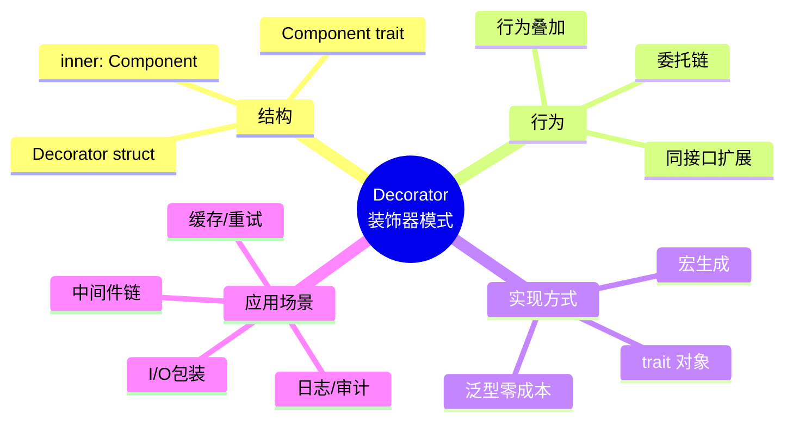
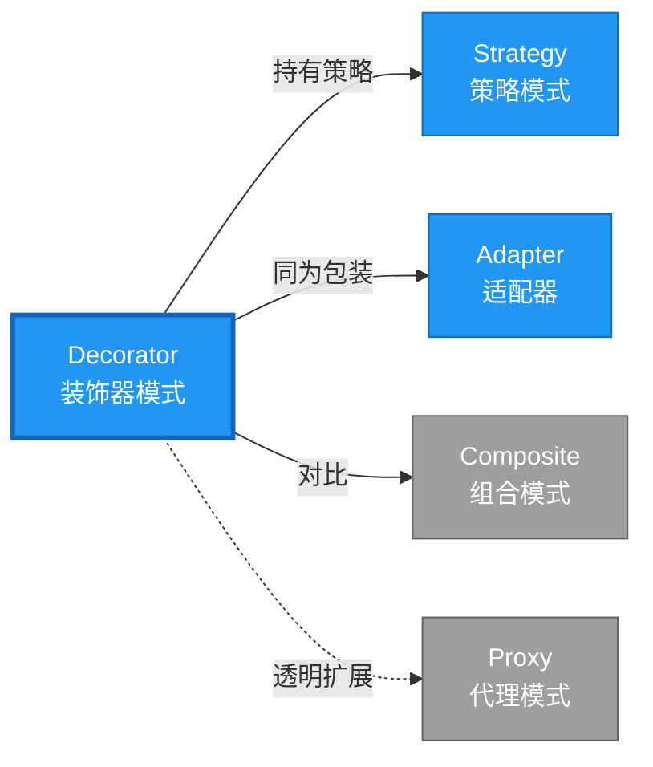

# Decorator 形式化分析

> **创建日期**: 2026-02-12
> **最后更新**: 2026-02-28
> **Rust 版本**: 1.93.1+ (Edition 2024)
> **状态**: ✅ 已完成
> **分类**: 结构型
> **安全边界**: 纯 Safe
> **23 模式矩阵**: [README §23 模式多维对比矩阵](../README.md#23-模式多维对比矩阵) 第 9 行（Decorator）
> **证明深度**: L3（完整证明）

---

## 📊 目录 {#-目录}

- [Decorator 形式化分析](#decorator-形式化分析)
  - [📊 目录 {#-目录}](#-目录--目录)
  - [形式化定义](#形式化定义)
    - [Def 1.1（Decorator 结构）](#def-11decorator-结构)
    - [Axiom DE1（同接口可叠加公理）](#axiom-de1同接口可叠加公理)
    - [Axiom DE2（委托链公理）](#axiom-de2委托链公理)
    - [定理 DE-T1（委托借用安全定理）](#定理-de-t1委托借用安全定理)
    - [定理 DE-T2（透明性定理）](#定理-de-t2透明性定理)
    - [推论 DE-C1（纯 Safe Decorator）](#推论-de-c1纯-safe-decorator)
    - [概念定义-属性关系-解释论证 层次汇总](#概念定义-属性关系-解释论证-层次汇总)
  - [Rust 实现与代码示例](#rust-实现与代码示例)
  - [完整证明](#完整证明)
    - [形式化论证链](#形式化论证链)
    - [与 Rust 类型系统的联系](#与-rust-类型系统的联系)
    - [内存安全保证](#内存安全保证)
  - [典型场景](#典型场景)
  - [完整场景示例：HTTP 客户端装饰链（日志 + 重试）](#完整场景示例http-客户端装饰链日志--重试)
  - [相关模式](#相关模式)
  - [实现变体](#实现变体)
  - [反例：违反委托链](#反例违反委托链)
  - [选型决策树](#选型决策树)
  - [与 GoF 对比](#与-gof-对比)
  - [边界](#边界)
  - [与 Rust 1.93 的对应](#与-rust-193-的对应)
  - [思维导图](#思维导图)
  - [与其他模式的关系图](#与其他模式的关系图)
  - [实质内容五维自检](#实质内容五维自检)

---

## 形式化定义

### Def 1.1（Decorator 结构）

设 $D$ 为装饰器类型，$T$ 为被装饰类型。Decorator 是一个四元组 $\mathcal{DE} = (D, T, \mathit{inner}, \mathit{extend})$，满足：

- $D$ 持有 $T$：$\Omega(D) \supset T$
- $D$ 实现与 $T$ 相同的接口（同一 trait）
- $\mathit{op}(d)$ 可先调用 $\mathit{op}(d.\mathit{inner})$ 再执行额外逻辑，或反之
- **可叠加性**：装饰器可嵌套，形成装饰链

**形式化表示**：
$$\mathcal{DE} = \langle D, T, \mathit{inner}: T, \mathit{extend}: D \times T \rightarrow \mathrm{Behavior} \rangle$$

---

### Axiom DE1（同接口可叠加公理）

$$\forall d: D,\, d: \mathrm{impl}\,T \land d.\mathit{inner}: T$$

装饰器与组件实现同一接口，可叠加。

### Axiom DE2（委托链公理）

$$D_1(D_2(D_3(\cdots))) \text{ 形成有效委托链}$$

委托链：$D_1(D_2(D_3(\cdots)))$，递归委托至最内层。

---

### 定理 DE-T1（委托借用安全定理）

由 [borrow_checker_proof](../../../formal_methods/borrow_checker_proof.md)，委托时 `&self.inner` 借用有效，无数据竞争。

**证明**：

1. **装饰器结构**：

   ```rust
   struct Decorator<C: Component> { inner: C }
   impl<C: Component> Component for Decorator<C> { ... }
   ```

2. **借用链**：
   - `op(&self)` 借用装饰器
   - `self.inner.op()` 借用内部组件
   - 子借用的生命周期不超过父借用

3. **可叠加性**：

   ```rust
   let d1 = Decorator1 { inner: Decorator2 { inner: ConcreteComponent } };
   ```

   - 类型检查：`Decorator2` 实现 `Component`
   - 借用链：`d1.op()` → `d1.inner.op()` → `d2.inner.op()`

4. **无数据竞争**：
   - 所有借用为不可变（`&self`）或互斥可变（`&mut self`）
   - 借用检查器验证无冲突

由 borrow_checker_proof 借用规则，得证。$\square$

---

### 定理 DE-T2（透明性定理）

装饰器对被装饰者透明；客户端无法区分原始对象与装饰对象。

**证明**：

1. **接口一致**：
   - $D: T$（装饰器实现被装饰者的 trait）
   - 方法签名完全一致

2. **行为兼容**：
   - 装饰器方法内部调用 `self.inner.method()`
   - 对外表现与被装饰者相同（加额外行为）

3. **里氏替换**：
   - 任何接受 `T` 的上下文可接受 `D`
   - 类型系统保证兼容性

由 trait 实现规则及里氏替换原则，得证。$\square$

---

### 推论 DE-C1（纯 Safe Decorator）

Decorator 为纯 Safe；仅用泛型包装、委托、trait impl，无 `unsafe`。

**证明**：

1. 泛型结构体：`struct Decorator<C: Component> { inner: C }` 纯 Safe
2. trait 实现：`impl<C: Component> Component for Decorator<C>` 纯 Safe
3. 委托调用：`self.inner.method()` 纯 Safe
4. 无 `unsafe` 块

由 DE-T1、DE-T2 及 [safe_unsafe_matrix](../../05_boundary_system/safe_unsafe_matrix.md) SBM-T1，得证。$\square$

---

### 概念定义-属性关系-解释论证 层次汇总

| 层次 | 内容 | 本页对应 |
| :--- | :--- | :--- |
| **概念定义层** | Def 1.1（Decorator 结构）、Axiom DE1/DE2（同接口可叠加、委托链） | 上 |
| **属性关系层** | Axiom DE1/DE2 $\rightarrow$ 定理 DE-T1/DE-T2 $\rightarrow$ 推论 DE-C1；依赖 borrow、safe_unsafe_matrix | 上 |
| **解释论证层** | DE-T1/DE-T2 完整证明；反例：违反委托链 | §完整证明、§反例 |

---

## Rust 实现与代码示例

```rust
trait Coffee {
    fn cost(&self) -> f32;
    fn description(&self) -> &str;
}

struct PlainCoffee;
impl Coffee for PlainCoffee {
    fn cost(&self) -> f32 { 2.0 }
    fn description(&self) -> &str { "plain" }
}

struct MilkDecorator<C: Coffee> {
    inner: C,
}

impl<C: Coffee> Coffee for MilkDecorator<C> {
    fn cost(&self) -> f32 {
        self.inner.cost() + 0.5
    }
    fn description(&self) -> &str {
        "milk + "
    }
}

// 使用：叠加装饰
let coffee = MilkDecorator { inner: PlainCoffee };
assert_eq!(coffee.cost(), 2.5);
```

**形式化对应**：`MilkDecorator` 即 $D$；`PlainCoffee` 即 $T$；`cost` 先调用 `inner.cost()` 再加价。

---

## 完整证明

### 形式化论证链

```text
Axiom DE1 (同接口可叠加)
    ↓ 依赖
trait 实现
    ↓ 保证
定理 DE-T2 (透明性)
    ↓ 组合
Axiom DE2 (委托链)
    ↓ 依赖
borrow_checker_proof
    ↓ 保证
定理 DE-T1 (委托借用安全)
    ↓ 结论
推论 DE-C1 (纯 Safe Decorator)
```

### 与 Rust 类型系统的联系

| Rust 特性 | Decorator 实现 | 类型安全保证 |
| :--- | :--- | :--- |
| 泛型 `<C: Component>` | 持有被装饰者 | 编译期类型约束 |
| `impl Trait` | 同接口实现 | 透明替换 |
| 借用检查 | 委托链借用 | 无冲突借用 |
| 组合 | `inner: C` | 所有权清晰 |

### 内存安全保证

1. **无悬垂**：装饰器拥有被装饰者
2. **借用安全**：委托链符合借用规则
3. **类型安全**：trait 约束保证接口一致
4. **可叠加**：泛型类型检查保证嵌套安全

---

## 典型场景

| 场景 | 说明 |
| :--- | :--- |
| 中间件/装饰 | 日志、度量、缓存、重试 |
| I/O 装饰 | 压缩、加密、缓冲 |
| 权限/审计 | 装饰器增加检查逻辑 |

---

## 完整场景示例：HTTP 客户端装饰链（日志 + 重试）

**场景**：底层 client 发请求；LogDecorator 记录请求；RetryDecorator 失败重试；同接口叠加。

```rust
trait HttpClient {
    fn get(&self, url: &str) -> Result<String, String>;
}

struct ReqwestClient;
impl HttpClient for ReqwestClient {
    fn get(&self, url: &str) -> Result<String, String> {
        Ok(format!("body of {}", url))
    }
}

struct LogDecorator<C: HttpClient> { inner: C }
impl<C: HttpClient> HttpClient for LogDecorator<C> {
    fn get(&self, url: &str) -> Result<String, String> {
        println!("[log] GET {}", url);
        self.inner.get(url)
    }
}

struct RetryDecorator<C: HttpClient> { inner: C, max_retries: u32 }
impl<C: HttpClient> HttpClient for RetryDecorator<C> {
    fn get(&self, url: &str) -> Result<String, String> {
        let mut last_err = String::new();
        for _ in 0..=self.max_retries {
            match self.inner.get(url) {
                Ok(s) => return Ok(s),
                Err(e) => last_err = e,
            }
        }
        Err(last_err)
    }
}

// 使用：LogDecorator { inner: RetryDecorator { inner: ReqwestClient, max_retries: 2 } }
```

**形式化对应**：`LogDecorator`/`RetryDecorator` 即 $D$；委托链满足 Axiom DE1、DE2。

---

## 相关模式

| 模式 | 关系 |
| :--- | :--- |
| [Strategy](../03_behavioral/strategy.md) | 装饰器可持有多态策略 |
| [Adapter](adapter.md) | 同为包装；Decorator 同接口，Adapter 转换接口 |
| [Composite](composite.md) | Decorator 为链式，Composite 为树 |

---

## 实现变体

| 变体 | 说明 | 适用 |
| :--- | :--- | :--- |
| 泛型 `Decorator<C: Component>` | 编译期单态化，零成本 | 装饰链固定 |
| `Box<dyn Component>` | 运行时多态 | 装饰链动态 |
| 宏/派生 | 减少样板；如 `#[derive(Decor)]` | 简单装饰 |

---

## 反例：违反委托链

**错误**：装饰器不委托 inner，直接返回固定值，破坏透明性。

```rust
impl<C: Coffee> Coffee for BadDecorator<C> {
    fn cost(&self) -> f32 { 1.0 }  // 忽略 inner，违反 Axiom DE2
}
```

**后果**：叠加装饰失去意义；与 GoF 语义不一致。

---

## 选型决策树

```text
需要动态扩展行为且保持同接口？
├── 是 → 装饰链可叠加？ → Decorator（泛型或 Box<dyn>）
├── 否 → 需转换接口？ → Adapter
└── 需解耦实现？ → Bridge
```

---

## 与 GoF 对比

| GoF | Rust 对应 | 差异 |
| :--- | :--- | :--- |
| 抽象类 + 具体装饰 | trait + impl | 无继承 |
| 装饰器链 | 泛型嵌套 | 完全等价 |
| 透明性 | 同 trait 接口 | 等价 |

---

## 边界

| 维度 | 分类 |
| :--- | :--- |
| 安全 | 纯 Safe |
| 支持 | 原生 |
| 表达 | 等价 |

---

## 与 Rust 1.93 的对应

| 1.93 特性 | 与本模式 | 说明 |
| :--- | :--- | :--- |
| 无新增影响 | — | 1.93 无影响 Decorator 语义的变更 |
| 92 项落点 | 无 | 本模式未涉及 [RUST_193_COUNTEREXAMPLES_INDEX](../../../RUST_193_COUNTEREXAMPLES_INDEX.md) 特定项 |

---

## 思维导图



---

## 与其他模式的关系图



---

## 实质内容五维自检

| 自检项 | 状态 | 说明 |
| :--- | :--- | :--- |
| 形式化 | ✅ | Def 1.1、Axiom DE1/DE2、定理 DE-T1/T2（L3 完整证明）、推论 DE-C1 |
| 代码 | ✅ | 可运行示例、HTTP 装饰链 |
| 场景 | ✅ | 典型场景、完整示例 |
| 反例 | ✅ | 违反委托链 |
| 衔接 | ✅ | borrow、CE-T2 |
| 权威对应 | ✅ | [GoF](../README.md#与-gof-原书对应)、[formal_methods](../../../formal_methods/README.md)、[INTERNATIONAL_FORMAL_VERIFICATION_INDEX](../../../INTERNATIONAL_FORMAL_VERIFICATION_INDEX.md) |
