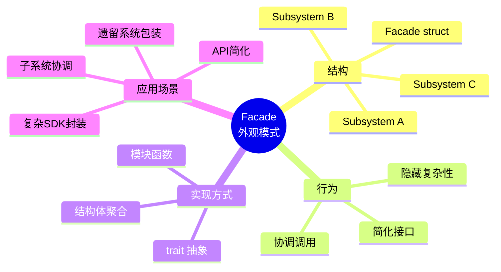
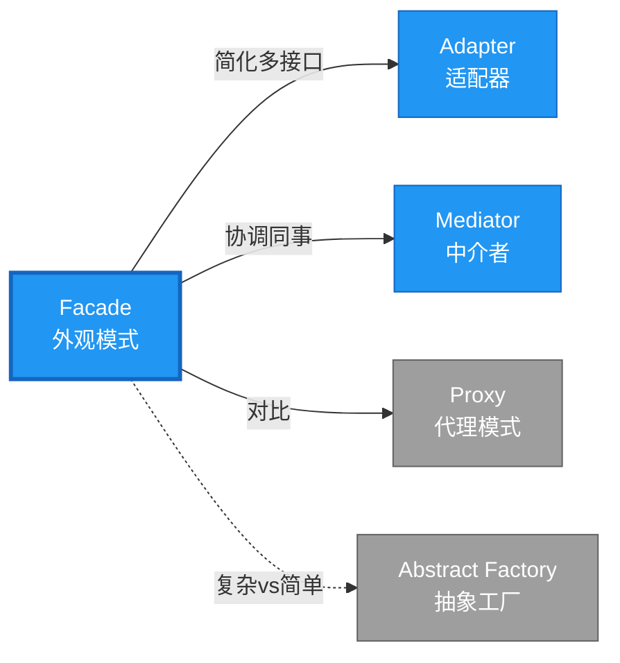

# Facade 形式化分析

> **创建日期**: 2026-02-12
> **最后更新**: 2026-02-20
> **Rust 版本**: 1.93.0+ (Edition 2024)
> **状态**: ✅ 已完成
> **分类**: 结构型
> **安全边界**: 纯 Safe
> **23 模式矩阵**: [README §23 模式多维对比矩阵](../README.md#23-模式多维对比矩阵) 第 10 行（Facade）
> **证明深度**: L3（完整证明）

---

## 📊 目录 {#-目录}

- [Facade 形式化分析](#facade-形式化分析)
  - [📊 目录 {#-目录}](#-目录--目录)
  - [形式化定义](#形式化定义)
    - [Def 1.1（Facade 结构）](#def-11facade-结构)
    - [Axiom FA1（简化接口公理）](#axiom-fa1简化接口公理)
    - [Axiom FA2（协调调用公理）](#axiom-fa2协调调用公理)
    - [定理 FA-T1（封装边界定理）](#定理-fa-t1封装边界定理)
    - [定理 FA-T2（所有权协调定理）](#定理-fa-t2所有权协调定理)
    - [推论 FA-C1（纯 Safe Facade）](#推论-fa-c1纯-safe-facade)
    - [概念定义-属性关系-解释论证 层次汇总](#概念定义-属性关系-解释论证-层次汇总)
  - [Rust 实现与代码示例](#rust-实现与代码示例)
  - [完整证明](#完整证明)
    - [形式化论证链](#形式化论证链)
    - [与 Rust 类型系统的联系](#与-rust-类型系统的联系)
    - [内存安全保证](#内存安全保证)
  - [典型场景](#典型场景)
  - [完整场景示例：日志系统外观](#完整场景示例日志系统外观)
  - [相关模式](#相关模式)
  - [实现变体](#实现变体)
  - [反例：外观暴露子系统细节](#反例外观暴露子系统细节)
  - [选型决策树](#选型决策树)
  - [与 GoF 对比](#与-gof-对比)
  - [边界](#边界)
  - [与 Rust 1.93 的对应](#与-rust-193-的对应)
  - [思维导图](#思维导图)
  - [与其他模式的关系图](#与其他模式的关系图)
  - [实质内容五维自检](#实质内容五维自检)

---

## 形式化定义

### Def 1.1（Facade 结构）

设 $F$ 为外观类型，$S_1, \ldots, S_n$ 为子系统类型。Facade 是一个多元组 $\mathcal{FA} = (F, \{S_i\}_{i=1}^n, \mathit{simplified\_ops})$，满足：

- $F$ 持有或可访问 $S_1, \ldots, S_n$
- $\exists \mathit{simplified\_op} : F \to R$，封装对子系统的调用序列
- 客户端仅通过 $F$ 的 `pub` 方法访问；子系统可私有
- **封装边界**：隐藏子系统复杂性，提供简化接口

**形式化表示**：
$$\mathcal{FA} = \langle F, \{S_i\}_{i=1}^n, \{\mathit{simplified\_op}_j: F \rightarrow R_j\} \rangle$$

---

### Axiom FA1（简化接口公理）

$$\forall f: F,\, \mathit{simplified\_op}(f) \text{ 隐藏 } \{S_i\} \text{ 的调用复杂性}$$

外观简化接口，隐藏子系统复杂性。

### Axiom FA2（协调调用公理）

$$\mathit{simplified\_op}(f) \text{ 协调 } S_1, \ldots, S_n \text{ 的调用顺序}$$

外观协调调用顺序；子系统间依赖由 $F$ 管理。

---

### 定理 FA-T1（封装边界定理）

模块系统与 `pub` 可见性保证封装边界。由 Rust 模块语义。

**证明**：

1. **模块系统**：

   ```rust
   mod subsystem { pub(crate) fn op() {} }  // 子系统私有

   pub struct Facade;  // 外观公开
   impl Facade {
       pub fn simple_op(&self) { subsystem::op(); }  // 公开方法
   }
   ```

2. **可见性层次**：
   - `pub`：完全公开
   - `pub(crate)`：crate 内可见
   - `pub(super)`：父模块可见
   - 默认：私有

3. **封装保证**：
   - 客户端只能访问 `Facade` 的 `pub` 方法
   - 子系统实现细节对外不可见
   - 修改子系统不影响客户端（只要外观接口不变）

由 Rust 模块系统语义，得证。$\square$

---

### 定理 FA-T2（所有权协调定理）

外观协调子系统所有权；客户端仅持有外观引用。

**证明**：

1. **所有权模式**：

   ```rust
   pub struct Facade {
       a: SubsystemA,  // 拥有
       b: SubsystemB,  // 拥有
   }
   ```

2. **借用协调**：
   - `Facade` 方法按需借用子系统
   - 借用规则保证无冲突

3. **客户端视图**：
   - 客户端：`let f = Facade::new(); f.simple_op();`
   - 不直接操作子系统
   - 所有权由 `Facade` 管理

由 ownership_model 及模块封装，得证。$\square$

---

### 推论 FA-C1（纯 Safe Facade）

Facade 为纯 Safe；仅用结构体聚合、私有字段、`pub fn` 委托，无 `unsafe`。

**证明**：

1. 结构体聚合：`struct Facade { a: A, b: B }` 纯 Safe
2. 私有字段：默认私有，封装实现
3. `pub fn` 委托：公开方法调用子系统，纯 Safe
4. 无 `unsafe` 块

由 FA-T1、FA-T2 及 [safe_unsafe_matrix](../../05_boundary_system/safe_unsafe_matrix.md) SBM-T1，得证。$\square$

---

### 概念定义-属性关系-解释论证 层次汇总

| 层次 | 内容 | 本页对应 |
| :--- | :--- | :--- |
| **概念定义层** | Def 1.1（Facade 结构）、Axiom FA1/FA2（简化接口、协调调用） | 上 |
| **属性关系层** | Axiom FA1/FA2 $\rightarrow$ 定理 FA-T1/FA-T2 $\rightarrow$ 推论 FA-C1；依赖模块语义、safe_unsafe_matrix | 上 |
| **解释论证层** | FA-T1/FA-T2 完整证明；反例：外观暴露子系统细节 | §完整证明、§反例 |

---

## Rust 实现与代码示例

```rust
// 子系统（通常为私有模块）
struct SubsystemA;
impl SubsystemA {
    fn operation_a(&self) -> String { "A".into() }
}

struct SubsystemB;
impl SubsystemB {
    fn operation_b(&self, s: &str) -> String {
        format!("B({})", s)
    }
}

// 外观
pub struct Facade {
    a: SubsystemA,
    b: SubsystemB,
}

impl Facade {
    pub fn new() -> Self {
        Self {
            a: SubsystemA,
            b: SubsystemB,
        }
    }
    pub fn simplified_op(&self) -> String {
        let x = self.a.operation_a();
        self.b.operation_b(&x)
    }
}

// 客户端仅使用 Facade
let f = Facade::new();
assert_eq!(f.simplified_op(), "B(A)");
```

**形式化对应**：`Facade` 即 $F$；`SubsystemA`、`SubsystemB` 即 $S_1$、$S_2$；`simplified_op` 即 $\mathit{simplified\_op}$。

---

## 完整证明

### 形式化论证链

```text
Axiom FA1 (简化接口)
    ↓ 依赖
Rust 模块系统
    ↓ 保证
定理 FA-T1 (封装边界)
    ↓ 组合
Axiom FA2 (协调调用)
    ↓ 依赖
ownership_model
    ↓ 保证
定理 FA-T2 (所有权协调)
    ↓ 结论
推论 FA-C1 (纯 Safe Facade)
```

### 与 Rust 类型系统的联系

| Rust 特性 | Facade 实现 | 类型安全保证 |
| :--- | :--- | :--- |
| `mod` 系统 | 子系统隔离 | 可见性控制 |
| `pub`/`priv` | 接口封装 | 访问控制 |
| 结构体聚合 | 持有子系统 | 所有权管理 |
| 方法委托 | 简化接口 | 类型检查 |

### 内存安全保证

1. **封装安全**：子系统细节对外不可见
2. **所有权清晰**：外观管理子系统生命周期
3. **借用协调**：外观方法内部协调借用
4. **接口稳定**：外观接口变化最小化

---

## 典型场景

| 场景 | 说明 |
| :--- | :--- |
| 库/API 简化 | 复杂 SDK 封装为简单入口 |
| 子系统协调 | 编排多个模块的调用顺序 |
| 遗留系统 | 封装旧接口为新接口 |

---

## 完整场景示例：日志系统外观

**场景**：日志需经由格式化、写入、轮转三个子系统；客户端仅需 `log(level, message)`。

```rust
mod formatter {
    pub(super) fn format(level: &str, msg: &str) -> String {
        format!("[{}] {}", level, msg)
    }
}

mod writer {
    pub(super) fn write(s: &str) { println!("{}", s); }
}

mod rotator {
    pub(super) fn maybe_rotate() { /* 按大小/时间轮转 */ }
}

pub struct LogFacade;

impl LogFacade {
    pub fn log(level: &str, msg: &str) {
        rotator::maybe_rotate();
        let formatted = formatter::format(level, msg);
        writer::write(&formatted);
    }
}

// 客户端：LogFacade::log("INFO", "started");
```

**形式化对应**：`LogFacade` 为 $F$；formatter、writer、rotator 为私有子系统；`log` 为 $\mathit{simplified\_op}$；Axiom FA1 由 `pub(super)` 隐藏实现保证。

---

## 相关模式

| 模式 | 关系 |
| :--- | :--- |
| [Adapter](adapter.md) | Facade 简化多接口；Adapter 转换单接口 |
| [Mediator](../03_behavioral/mediator.md) | Facade 协调子系统；Mediator 协调同事 |
| [Proxy](proxy.md) | Proxy 委托单对象；Facade 聚合多对象 |

---

## 实现变体

| 变体 | 说明 | 适用 |
| :--- | :--- | :--- |
| 结构体聚合 | `struct Facade { a: A, b: B }` | 持有子系统 |
| 模块 | `mod facade { pub fn op() }` | 函数级简化 |
| trait | `trait Facade { fn op(&self); }` | 多实现 |

---

## 反例：外观暴露子系统细节

**错误**：外观将子系统类型作为 `pub` 字段或方法参数暴露，破坏封装。

```rust
pub struct BadFacade {
    pub a: SubsystemA,  // 暴露内部，客户端可直接操作
}
```

**后果**：客户端依赖子系统，外观失去简化接口的意义；违反 Axiom FA1。

---

## 选型决策树

```text
需要简化多子系统调用？
├── 是 → 仅协调调用顺序？ → Facade（结构体聚合）
│       └── 需调解对象间通信？ → Mediator
├── 转换单接口？ → Adapter
└── 委托单对象？ → Proxy
```

---

## 与 GoF 对比

| GoF | Rust 对应 | 差异 |
| :--- | :--- | :--- |
| 外观类 | 结构体或模块 | 等价 |
| 子系统 | 私有字段 | 完全等价 |
| 简化接口 | pub fn | 等价 |

---

## 边界

| 维度 | 分类 |
| :--- | :--- |
| 安全 | 纯 Safe |
| 支持 | 原生 |
| 表达 | 等价 |

---

## 与 Rust 1.93 的对应

| 1.93 特性 | 与本模式 | 说明 |
| :--- | :--- | :--- |
| 无新增影响 | — | 1.93 无影响 Facade 语义的变更 |
| 92 项落点 | 无 | 本模式未涉及 [RUST_193_COUNTEREXAMPLES_INDEX](../../../RUST_193_COUNTEREXAMPLES_INDEX.md) 特定项 |

---

## 思维导图



---

## 与其他模式的关系图



---

## 实质内容五维自检

| 自检项 | 状态 | 说明 |
| :--- | :--- | :--- |
| 形式化 | ✅ | Def 1.1、Axiom FA1/FA2、定理 FA-T1/T2（L3 完整证明）、推论 FA-C1 |
| 代码 | ✅ | 可运行示例、日志外观 |
| 场景 | ✅ | 典型场景、完整示例 |
| 反例 | ✅ | 外观暴露子系统细节 |
| 衔接 | ✅ | ownership、CE-T1 |
| 权威对应 | ✅ | [GoF](../README.md#与-gof-原书对应)、[Fowler EAA](https://martinfowler.com/eaaCatalog/)、[formal_methods](../../../formal_methods/README.md) |
