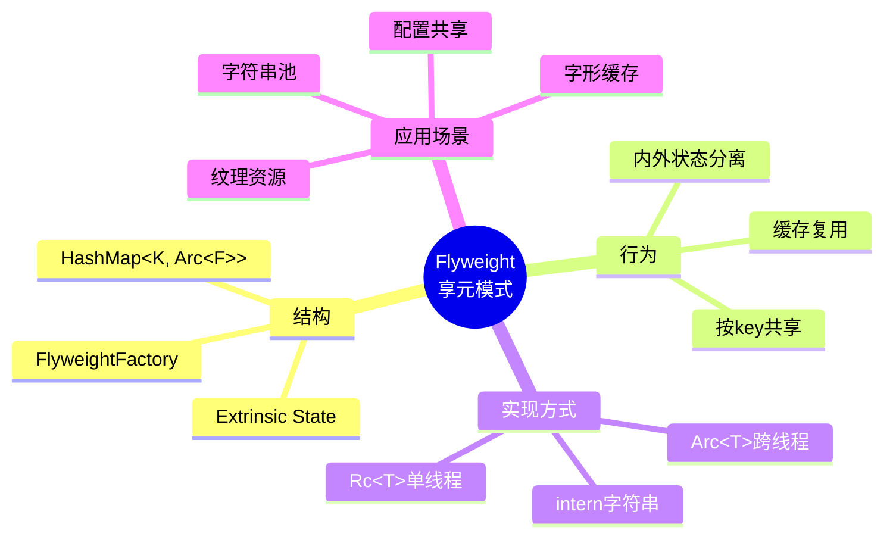
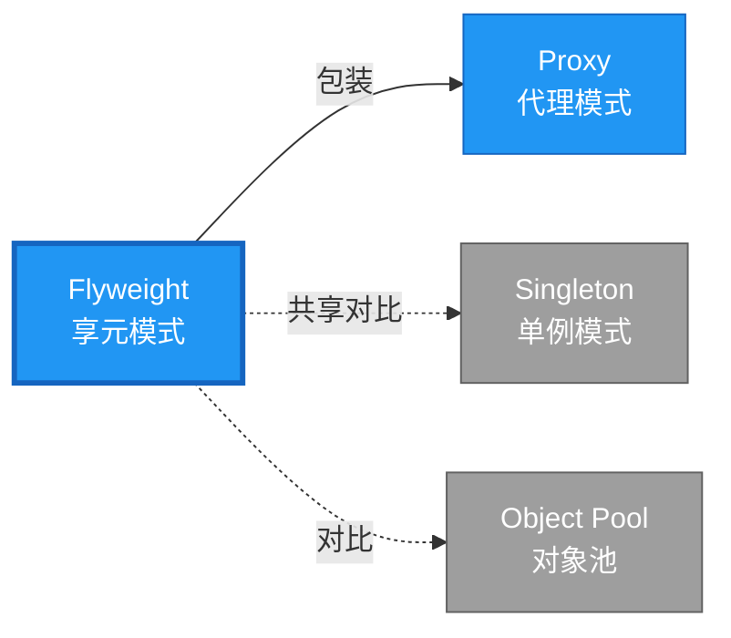

# Flyweight 形式化分析

> **创建日期**: 2026-02-12
> **最后更新**: 2026-02-20
> **Rust 版本**: 1.93.0+ (Edition 2024)
> **状态**: ✅ 已完成
> **分类**: 结构型
> **安全边界**: 纯 Safe
> **23 模式矩阵**: [README §23 模式多维对比矩阵](../README.md#23-模式多维对比矩阵) 第 11 行（Flyweight）
> **证明深度**: L3（完整证明）

---

## 📊 目录

- [Flyweight 形式化分析](#flyweight-形式化分析)
  - [📊 目录](#-目录)
  - [形式化定义](#形式化定义)
    - [Def 1.1（Flyweight 结构）](#def-11flyweight-结构)
    - [Axiom FL1（共享不可变公理）](#axiom-fl1共享不可变公理)
    - [Axiom FL2（缓存单射公理）](#axiom-fl2缓存单射公理)
    - [定理 FL-T1（共享安全定理）](#定理-fl-t1共享安全定理)
    - [定理 FL-T2（线程安全共享定理）](#定理-fl-t2线程安全共享定理)
    - [推论 FL-C1（纯 Safe Flyweight）](#推论-fl-c1纯-safe-flyweight)
    - [概念定义-属性关系-解释论证 层次汇总](#概念定义-属性关系-解释论证-层次汇总)
  - [Rust 实现与代码示例](#rust-实现与代码示例)
  - [完整证明](#完整证明)
    - [形式化论证链](#形式化论证链)
    - [与 Rust 类型系统的联系](#与-rust-类型系统的联系)
    - [内存安全保证](#内存安全保证)
  - [典型场景](#典型场景)
  - [完整场景示例：字形缓存（层次推进）](#完整场景示例字形缓存层次推进)
  - [相关模式](#相关模式)
  - [实现变体](#实现变体)
  - [反例：共享可变状态](#反例共享可变状态)
  - [选型决策树](#选型决策树)
  - [与 GoF 对比](#与-gof-对比)
  - [边界](#边界)
  - [与 Rust 1.93 的对应](#与-rust-193-的对应)
  - [思维导图](#思维导图)
  - [与其他模式的关系图](#与其他模式的关系图)
  - [实质内容五维自检](#实质内容五维自检)

---

## 形式化定义

### Def 1.1（Flyweight 结构）

设 $F$ 为享元类型，$K$ 为键类型。Flyweight 是一个四元组 $\mathcal{FW} = (F, K, \mathit{cache}, \mathit{get})$，满足：

- $\exists \mathit{get} : K \to \mathrm{Arc}\langle F \rangle$ 或 $\&F$
- 相同 $k$ 返回共享实例；缓存避免重复创建
- 不可变共享：$\mathit{get}(k)$ 为只读引用或 `Arc`；可变状态外置
- **缓存单射**：$k_1 \neq k_2 \implies \mathit{cache}[k_1] \neq \mathit{cache}[k_2]$ 或共享等价实例

**形式化表示**：
$$\mathcal{FW} = \langle F, K, \mathit{cache}: K \rightharpoonup \mathrm{Arc}\langle F \rangle, \mathit{get}: K \rightarrow \mathrm{Arc}\langle F \rangle \rangle$$

---

### Axiom FL1（共享不可变公理）

$$\forall f: \mathit{get}(k),\, f \text{ 不可变；可变状态外置为 }(F, \mathit{Extrinsic})$$

共享状态不可变；可变状态外置（如组合为 `(F, Extrinsic)`）。

### Axiom FL2（缓存单射公理）

$$\mathit{cache}: K \rightarrow \mathrm{Arc}\langle F \rangle \text{ 为单射（等价键映射到同一实例）}$$

缓存键唯一；`HashMap` 保证 $k \mapsto f$ 单射。

---

### 定理 FL-T1（共享安全定理）

`Arc` 引用计数保证共享安全；由 [ownership_model](../../../formal_methods/ownership_model.md) 无悬垂。

**证明**：

1. **Arc 语义**：
   - `Arc::new(value)` 创建引用计数指针
   - `Arc::clone(&arc)` 增加引用计数
   - 引用计数归零时释放内存

2. **共享安全**：
   - 多个 `Arc<F>` 指向同一堆内存
   - 原子引用计数保证线程安全
   - 无悬垂：引用计数保证至少有一个持有者时内存有效

3. **不可变保证**：
   - `Arc<T>` 默认不可变
   - 符合 Axiom FL1

由 ownership_model 及 `Arc` 实现，得证。$\square$

---

### 定理 FL-T2（线程安全共享定理）

跨线程共享需 `Arc` + `Sync`；单线程可用 `Rc`。

**证明**：

1. **Send/Sync 约束**：
   - `Arc<T>: Send` 当 `T: Send + Sync`
   - `Arc<T>: Sync` 当 `T: Send + Sync`

2. **线程安全**：
   - 原子引用计数（`AtomicUsize`）
   - `Acquire`/`Release` 内存顺序保证可见性

3. **单线程优化**：
   - `Rc<T>`：非原子引用计数，更快
   - 仅单线程使用

由 Rust 类型系统 Send/Sync 约束，得证。$\square$

---

### 推论 FL-C1（纯 Safe Flyweight）

Flyweight 为纯 Safe；`Arc`/`Rc` 共享不可变，无 `unsafe`；可变状态外置时用 `Mutex` 等 Safe 抽象。

**证明**：

1. `HashMap<K, Arc<F>>`：标准库 Safe API
2. `Arc::clone`：Safe 引用计数增加
3. 不可变共享：无数据竞争
4. 可变外置状态：`Mutex`、`RwLock` 为 Safe 抽象
5. 无 `unsafe` 块

由 FL-T1、FL-T2 及 [safe_unsafe_matrix](../../05_boundary_system/safe_unsafe_matrix.md) SBM-T1，得证。$\square$

---

### 概念定义-属性关系-解释论证 层次汇总

| 层次 | 内容 | 本页对应 |
| :--- | :--- | :--- |
| **概念定义层** | Def 1.1（Flyweight 结构）、Axiom FL1/FL2（共享不可变、缓存单射） | 上 |
| **属性关系层** | Axiom FL1/FL2 $\rightarrow$ 定理 FL-T1/FL-T2 $\rightarrow$ 推论 FL-C1；依赖 ownership、Send/Sync | 上 |
| **解释论证层** | FL-T1/FL-T2 完整证明；反例：共享可变状态 | §完整证明、§反例 |

---

## Rust 实现与代码示例

```rust
use std::collections::HashMap;
use std::sync::Arc;

struct FlyweightFactory {
    cache: HashMap<String, Arc<str>>,
}

impl FlyweightFactory {
    fn new() -> Self {
        Self { cache: HashMap::new() }
    }
    fn get(&mut self, key: &str) -> Arc<str> {
        if let Some(v) = self.cache.get(key) {
            return Arc::clone(v);
        }
        let v = Arc::from(key.to_string().into_boxed_str());
        self.cache.insert(key.to_string(), Arc::clone(&v));
        v
    }
}

// 使用：相同 key 共享
let mut f = FlyweightFactory::new();
let a = f.get("hello");
let b = f.get("hello");
assert!(Arc::ptr_eq(&a, &b));  // 同一实例
```

**形式化对应**：`FlyweightFactory` 为缓存；`get` 即 $\mathit{get}$；`Arc<str>` 为共享不可变。

---

## 完整证明

### 形式化论证链

```
Axiom FL1 (共享不可变)
    ↓ 依赖
Arc 实现
    ↓ 保证
定理 FL-T1 (共享安全)
    ↓ 组合
Axiom FL2 (缓存单射)
    ↓ 依赖
Send/Sync 约束
    ↓ 保证
定理 FL-T2 (线程安全共享)
    ↓ 结论
推论 FL-C1 (纯 Safe Flyweight)
```

### 与 Rust 类型系统的联系

| Rust 特性 | Flyweight 实现 | 类型安全保证 |
| :--- | :--- | :--- |
| `Arc<T>` | 共享所有权 | 引用计数安全 |
| `HashMap` | 缓存存储 | 键值映射 |
| `Sync` | 线程共享 | 编译期检查 |
| 不可变默认 | 共享安全 | 无数据竞争 |

### 内存安全保证

1. **无悬垂**：`Arc` 引用计数保证内存有效
2. **无泄漏**：`Arc` 循环引用需 `Weak` 打破
3. **线程安全**：`Send`/`Sync` 编译期检查
4. **共享安全**：不可变共享无数据竞争

---

## 典型场景

| 场景 | 说明 |
| :--- | :--- |
| 字符/字符串池 | 相同字符串共享 |
| 配置/主题 | 共享只读配置 |
| 图元/纹理 | 游戏、图形共享资源 |
| 类型对象 | 共享元数据 |

---

## 完整场景示例：字形缓存（层次推进）

**场景**：文本渲染需大量重复字形（glyph）；相同字符+字体共享位图，避免重复加载。

```rust
use std::collections::HashMap;
use std::sync::{Arc, RwLock};

#[derive(Clone, Hash, Eq, PartialEq)]
struct GlyphKey {
    char: char,
    font_id: u32,
    size_px: u16,
}

struct GlyphData {
    width: u32,
    height: u32,
    pixels: Vec<u8>,  // 不可变位图
}

struct GlyphCache {
    cache: RwLock<HashMap<GlyphKey, Arc<GlyphData>>>,
}

impl GlyphCache {
    fn get(&self, key: GlyphKey) -> Arc<GlyphData> {
        if let Ok(guard) = self.cache.read() {
            if let Some(g) = guard.get(&key) {
                return Arc::clone(g);
            }
        }
        let glyph = Arc::new(self.rasterize(&key));
        self.cache.write().unwrap().insert(key.clone(), Arc::clone(&glyph));
        glyph
    }
    fn rasterize(&self, _key: &GlyphKey) -> GlyphData {
        GlyphData { width: 8, height: 16, pixels: vec![0; 128] }
    }
}

// 外置可变状态
struct GlyphInstance {
    glyph: Arc<GlyphData>,  // 共享、不可变
    x: i32, y: i32,        // 外置
    color: [u8; 4],        // 外置
}
```

**形式化对应**：`GlyphKey` 即 $K$；`Arc<GlyphData>` 即 $F$；`get` 即 $\mathit{get}$；Axiom FL1 由 `GlyphData` 不可变保证。

---

## 相关模式

| 模式 | 关系 |
| :--- | :--- |
| [Proxy](proxy.md) | Proxy 可包装 Flyweight 做延迟/缓存 |
| [Singleton](../01_creational/singleton.md) | 同为共享；Flyweight 按 key 共享，Singleton 全局唯一 |
| 对象池（扩展） | 共享池；Flyweight 不可变，Pool 可回收 |

---

## 实现变体

| 变体 | 说明 | 适用 |
| :--- | :--- | :--- |
| `HashMap<K, Arc<T>>` | 缓存；跨线程用 Arc | 通用 |
| `Rc` | 单线程共享 | 无 Send 需求 |
| `intern` 字符串 | 相同字符串共享 | 解析器、编译器 |

---

## 反例：共享可变状态

**错误**：享元内部含 `Cell`/`RefCell` 等可变状态，多持有者共享时产生数据竞争或逻辑错误。

```rust
struct BadFlyweight {
    count: std::cell::Cell<u32>,  // 共享可变
}
// 多线程用 Arc<BadFlyweight> → 数据竞争（若单线程则为逻辑错误）
```

**Axiom FL1**：共享状态必须不可变；可变状态外置。

---

## 选型决策树

```text
需要共享不可变实例？
├── 是 → 按 key 共享？ → Flyweight（HashMap + Arc）
│       └── 全局唯一？ → Singleton
├── 需可变共享？ → 非 Flyweight
└── 仅单次使用？ → 普通创建
```

---

## 与 GoF 对比

| GoF | Rust 对应 | 差异 |
| :--- | :--- | :--- |
| 享元工厂 | struct + HashMap | 等价 |
| 共享状态 | Arc<T> | 引用计数 |
| extrinsic | 方法参数 | 等价 |

---

## 边界

| 维度 | 分类 |
| :--- | :--- |
| 安全 | 纯 Safe |
| 支持 | 原生 |
| 表达 | 等价 |

---

## 与 Rust 1.93 的对应

| 1.93 特性 | 与本模式 | 说明 |
| :--- | :--- | :--- |
| 无新增影响 | — | 1.93 无影响 Flyweight 语义的变更 |
| 92 项落点 | 无 | 本模式未涉及 [RUST_193_COUNTEREXAMPLES_INDEX](../../../RUST_193_COUNTEREXAMPLES_INDEX.md) 特定项 |

---

## 思维导图



---

## 与其他模式的关系图



---

## 实质内容五维自检

| 自检项 | 状态 | 说明 |
| :--- | :--- | :--- |
| 形式化 | ✅ | Def 1.1、Axiom FL1/FL2、定理 FL-T1/T2（L3 完整证明）、推论 FL-C1 |
| 代码 | ✅ | 可运行示例、字形缓存 |
| 场景 | ✅ | 典型场景、完整示例 |
| 反例 | ✅ | 共享可变状态 |
| 衔接 | ✅ | Arc、ownership、Send/Sync |
| 权威对应 | ✅ | [GoF](../README.md#与-gof-原书对应)、[formal_methods](../../../formal_methods/README.md)、[INTERNATIONAL_FORMAL_VERIFICATION_INDEX](../../../INTERNATIONAL_FORMAL_VERIFICATION_INDEX.md) |
