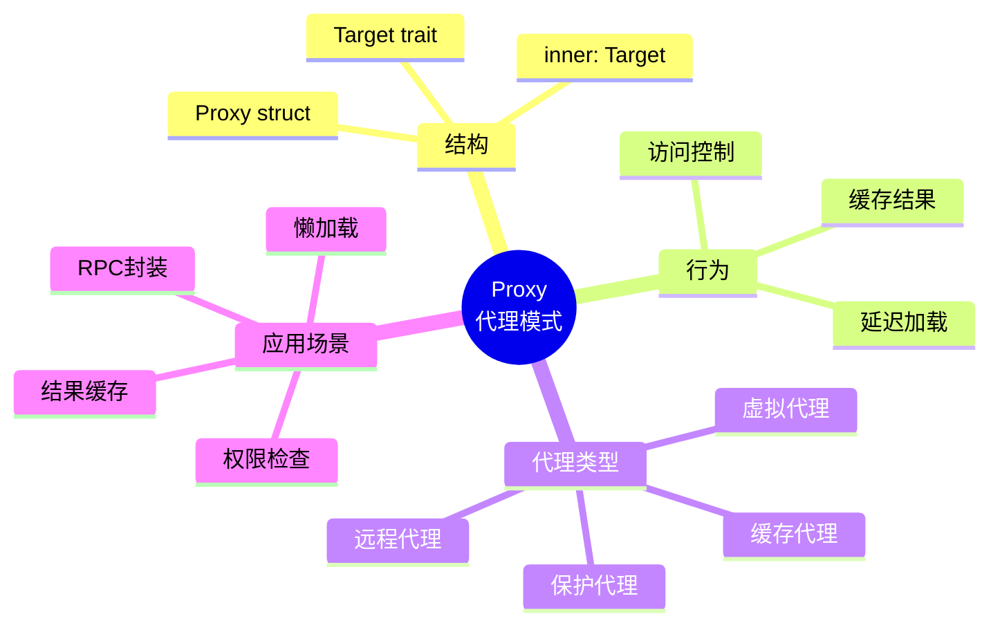
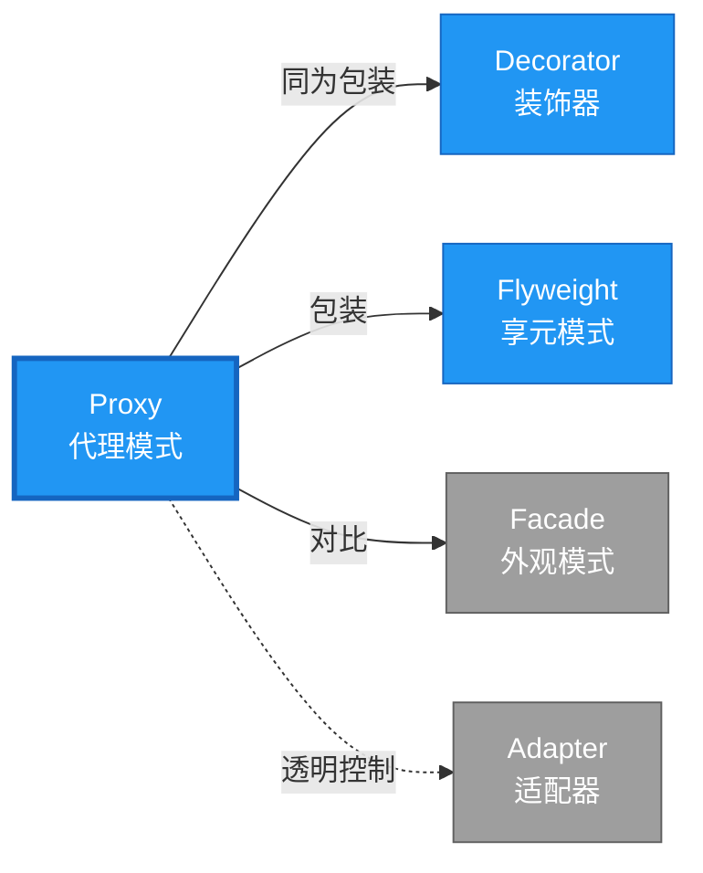

# Proxy 形式化分析

> **创建日期**: 2026-02-12
> **最后更新**: 2026-02-20
> **Rust 版本**: 1.93.0+ (Edition 2024)
> **状态**: ✅ 已完成
> **分类**: 结构型
> **安全边界**: 纯 Safe
> **23 模式矩阵**: [README §23 模式多维对比矩阵](../README.md#23-模式多维对比矩阵) 第 12 行（Proxy）
> **证明深度**: L3（完整证明）

---

## 📊 目录 {#-目录}

- [Proxy 形式化分析](#proxy-形式化分析)
  - [📊 目录 {#-目录}](#-目录--目录)
  - [形式化定义](#形式化定义)
    - [Def 1.1（Proxy 结构）](#def-11proxy-结构)
    - [Axiom PR1（接口一致公理）](#axiom-pr1接口一致公理)
    - [Axiom PR2（委托规则公理）](#axiom-pr2委托规则公理)
    - [定理 PR-T1（委托安全定理）](#定理-pr-t1委托安全定理)
    - [定理 PR-T2（访问控制定理）](#定理-pr-t2访问控制定理)
    - [推论 PR-C1（纯 Safe Proxy）](#推论-pr-c1纯-safe-proxy)
    - [概念定义-属性关系-解释论证 层次汇总](#概念定义-属性关系-解释论证-层次汇总)
  - [Rust 实现与代码示例](#rust-实现与代码示例)
  - [完整证明](#完整证明)
    - [形式化论证链](#形式化论证链)
    - [与 Rust 类型系统的联系](#与-rust-类型系统的联系)
    - [内存安全保证](#内存安全保证)
  - [典型场景](#典型场景)
  - [相关模式](#相关模式)
  - [实现变体](#实现变体)
  - [反例：代理持有 mut 且未同步](#反例代理持有-mut-且未同步)
  - [选型决策树](#选型决策树)
  - [与 GoF 对比](#与-gof-对比)
  - [边界](#边界)
  - [与 Rust 1.93 的对应](#与-rust-193-的对应)
  - [思维导图](#思维导图)
  - [与其他模式的关系图](#与其他模式的关系图)
  - [实质内容五维自检](#实质内容五维自检)

---

## 形式化定义

### Def 1.1（Proxy 结构）

设 $P$ 为代理类型，$T$ 为目标类型。Proxy 是一个四元组 $\mathcal{PR} = (P, T, \mathit{access}, \mathit{delegate})$，满足：

- $P$ 持有或可获取 $T$（延迟加载、缓存等）
- $P$ 实现与 $T$ 相同的接口
- $\mathit{op}(p)$ 可延迟加载、访问控制、日志等，再委托 $p \to T$
- **透明控制**：客户端无法区分代理与真实对象

**形式化表示**：
$$\mathcal{PR} = \langle P, T, \mathit{access}: P \times T, \mathit{delegate}: P \rightarrow T \rangle$$

---

### Axiom PR1（接口一致公理）

$$\forall p: P,\, p: \mathrm{impl}\,T \land \mathit{behavior}(p) \equiv_{\mathrm{obs}} \mathit{behavior}(t: T)$$

代理与目标接口一致，可透明替换。

### Axiom PR2（委托规则公理）

$$\mathit{delegate}(p) \text{ 满足借用/所有权规则；无循环依赖}$$

委托时借用/所有权规则满足；无循环依赖。

---

### 定理 PR-T1（委托安全定理）

委托时借用/所有权规则保证正确性。由 [borrow_checker_proof](../../../formal_methods/borrow_checker_proof.md)。

**证明**：

1. **虚拟代理**：

   ```rust
   struct LazyProxy { inner: OnceLock<RealSubject> }
   impl Subject for LazyProxy {
       fn request(&self) -> String {
           self.inner.get_or_init(|| RealSubject).request()
       }
   }
   ```

2. **借用检查**：
   - `&self` 借用代理
   - `self.inner.get_or_init()` 返回 `&RealSubject`
   - 子借用有效

3. **延迟加载安全**：
   - `OnceLock` 保证初始化一次
   - 后续访问只读，线程安全

由 borrow_checker_proof 借用规则，得证。$\square$

---

### 定理 PR-T2（访问控制定理）

保护代理可在委托前执行权限检查。

**证明**：

1. **权限检查**：

   ```rust
   struct GuardedProxy<T> { inner: T, permission: Permission }
   impl<T: Subject> Subject for GuardedProxy<T> {
       fn request(&self) -> String {
           if !self.permission.check() { return "Forbidden".into(); }
           self.inner.request()
       }
   }
   ```

2. **前置条件**：权限检查在委托前执行
3. **透明性**：接口一致，客户端无感知

由 Axiom PR1 及 trait 实现规则，得证。$\square$

---

### 推论 PR-C1（纯 Safe Proxy）

Proxy 为纯 Safe；`OnceLock` 延迟加载、委托调用，无 `unsafe`。

**证明**：

1. `OnceLock<T>`：标准库 Safe API
2. 委托调用：`self.inner.method()` 纯 Safe
3. trait 实现：`impl Subject for Proxy` 纯 Safe
4. 无 `unsafe` 块

由 PR-T1、PR-T2 及 [safe_unsafe_matrix](../../05_boundary_system/safe_unsafe_matrix.md) SBM-T1，得证。$\square$

---

### 概念定义-属性关系-解释论证 层次汇总

| 层次 | 内容 | 本页对应 |
| :--- | :--- | :--- |
| **概念定义层** | Def 1.1（Proxy 结构）、Axiom PR1/PR2（接口一致、委托规则） | 上 |
| **属性关系层** | Axiom PR1/PR2 $\rightarrow$ 定理 PR-T1/PR-T2 $\rightarrow$ 推论 PR-C1；依赖 borrow、safe_unsafe_matrix | 上 |
| **解释论证层** | PR-T1/PR-T2 完整证明；反例：代理持有 mut 且未同步 | §完整证明、§反例 |

---

## Rust 实现与代码示例

```rust
trait Subject {
    fn request(&self) -> String;
}

struct RealSubject;
impl Subject for RealSubject {
    fn request(&self) -> String { "real".into() }
}

use std::sync::OnceLock;

struct LazyProxy {
    inner: OnceLock<RealSubject>,
}

impl LazyProxy {
    fn new() -> Self {
        Self { inner: OnceLock::new() }
    }
}

impl Subject for LazyProxy {
    fn request(&self) -> String {
        self.inner.get_or_init(|| RealSubject).request()
    }
}

// 使用：首次调用时初始化
let p = LazyProxy::new();
assert_eq!(p.request(), "real");
```

**形式化对应**：`LazyProxy` 即 $P$；`RealSubject` 即 $T$；`request` 延迟加载后委托。

---

## 完整证明

### 形式化论证链

```text
Axiom PR1 (接口一致)
    ↓ 依赖
trait 实现
    ↓ 组合
Axiom PR2 (委托规则)
    ↓ 依赖
borrow_checker_proof
    ↓ 保证
定理 PR-T1 (委托安全)
    ↓ 扩展
定理 PR-T2 (访问控制)
    ↓ 结论
推论 PR-C1 (纯 Safe Proxy)
```

### 与 Rust 类型系统的联系

| Rust 特性 | Proxy 实现 | 类型安全保证 |
| :--- | :--- | :--- |
| `OnceLock<T>` | 延迟加载 | 线程安全初始化 |
| `impl Trait` | 接口一致 | 透明替换 |
| 借用检查 | 委托调用 | 无冲突借用 |
| `Mutex`/`RwLock` | 保护代理 | 访问控制 |

### 内存安全保证

1. **延迟加载安全**：`OnceLock` 保证初始化一次
2. **访问控制**：权限检查在委托前
3. **借用安全**：委托符合借用规则
4. **透明替换**：接口一致，无类型错误

---

## 典型场景

| 场景 | 说明 |
| :--- | :--- |
| 虚拟代理 | 延迟加载、懒初始化 |
| 保护代理 | 访问控制、权限检查 |
| 远程代理 | 封装 RPC、跨进程调用 |
| 缓存代理 | 缓存结果、减少重复计算 |

---

## 相关模式

| 模式 | 关系 |
| :--- | :--- |
| [Decorator](decorator.md) | 同为包装；Proxy 控制访问，Decorator 扩展行为 |
| [Flyweight](flyweight.md) | Proxy 可包装 Flyweight 做延迟/缓存 |
| [Facade](facade.md) | Proxy 委托单对象；Facade 聚合多对象 |

---

## 实现变体

| 变体 | 说明 | 适用 |
| :--- | :--- | :--- |
| `OnceLock`/`LazyLock` | 虚拟代理；延迟加载 | 耗时初始化 |
| `Arc<Mutex<T>>` | 保护代理；跨线程 | 访问控制 |
| 智能指针 | `Rc`、`Arc` 即引用计数代理 | 共享、生命周期 |

---

## 反例：代理持有 mut 且未同步

**错误**：代理内部用 `RefCell` 缓存，跨线程共享时未用 `Mutex`。

```rust
struct BadProxy {
    cache: std::cell::RefCell<Option<String>>,  // 非 Send
}
// 若跨线程使用 → 编译失败；若单线程滥用 RefCell 写后读 → 运行时 panic
```

**正确**：跨线程用 `Mutex` 或 `RwLock`；单线程用 `RefCell` 需保证借用规则。

---

## 选型决策树

```text
需要控制对目标的访问？
├── 延迟加载？ → OnceLock/LazyLock 代理
├── 访问控制？ → 保护代理（包装 + 检查）
├── 远程调用？ → 远程代理（封装 RPC）
├── 缓存？ → 缓存代理
└── 扩展行为（同接口）？ → Decorator
```

---

## 与 GoF 对比

| GoF | Rust 对应 | 差异 |
| :--- | :--- | :--- |
| 虚拟代理 | OnceLock | 等价 |
| 保护代理 | 包装 + 委托 | 等价 |
| 远程代理 | tonic/HTTP 客户端 | 等价 |

---

## 边界

| 维度 | 分类 |
| :--- | :--- |
| 安全 | 纯 Safe |
| 支持 | 原生 |
| 表达 | 等价 |

---

## 与 Rust 1.93 的对应

| 1.93 特性 | 与本模式 | 说明 |
| :--- | :--- | :--- |
| 无新增影响 | — | 1.93 无影响 Proxy 语义的变更 |
| 92 项落点 | 无 | 本模式未涉及 [RUST_193_COUNTEREXAMPLES_INDEX](../../../RUST_193_COUNTEREXAMPLES_INDEX.md) 特定项 |

---

## 思维导图



---

## 与其他模式的关系图



---

## 实质内容五维自检

| 自检项 | 状态 | 说明 |
| :--- | :--- | :--- |
| 形式化 | ✅ | Def 1.1、Axiom PR1/PR2、定理 PR-T1/T2（L3 完整证明）、推论 PR-C1 |
| 代码 | ✅ | 可运行示例 |
| 场景 | ✅ | 典型场景表 |
| 反例 | ✅ | 代理持有 mut 且未同步 |
| 衔接 | ✅ | borrow、ownership、CE-T1 |
| 权威对应 | ✅ | [GoF](../README.md#与-gof-原书对应)、[formal_methods](../../../formal_methods/README.md)、[INTERNATIONAL_FORMAL_VERIFICATION_INDEX](../../../INTERNATIONAL_FORMAL_VERIFICATION_INDEX.md) |
