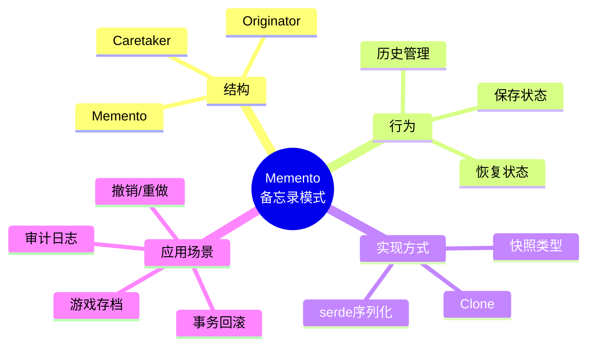
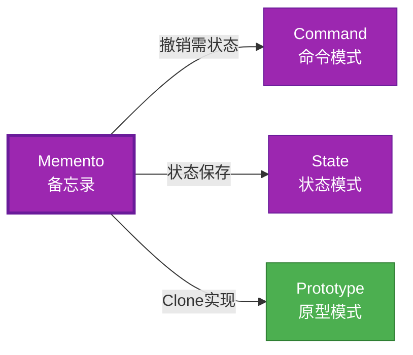

# Memento 形式化分析

> **Bloom 层级**: L5-L6 (分析/评价/创造)

## 📑 目录
> **[来源: [Rust Reference](https://doc.rust-lang.org/reference/)]**
>
- [Memento 形式化分析](#memento-形式化分析)
  - [📑 目录](#-目录)
  - [📊 目录 {#-目录}](#-目录--目录)
  - [形式化定义](#形式化定义)
    - [Def 1.1（Memento 结构）](#def-11memento-结构)
    - [Axiom MO1（状态完整公理）](#axiom-mo1状态完整公理)
    - [Axiom MO2（兼容性公理）](#axiom-mo2兼容性公理)
    - [定理 MO-T1（Clone 实现定理）](#定理-mo-t1clone-实现定理)
    - [定理 MO-T2（状态一致性定理）](#定理-mo-t2状态一致性定理)
    - [推论 MO-C1（近似表达）](#推论-mo-c1近似表达)
    - [概念定义-属性关系-解释论证 层次汇总](#概念定义-属性关系-解释论证-层次汇总)
  - [Rust 实现与代码示例](#rust-实现与代码示例)
  - [完整证明](#完整证明)
    - [形式化论证链](#形式化论证链)
  - [典型场景](#典型场景)
  - [相关模式](#相关模式)
  - [实现变体](#实现变体)
  - [反例](#反例)
  - [选型决策树](#选型决策树)
  - [与 GoF 对比](#与-gof-对比)
  - [边界](#边界)
  - [与 Rust 1.93 的对应](#与-rust-193-的对应)
  - [思维导图](#思维导图)
  - [与其他模式的关系图](#与其他模式的关系图)
  - [实质内容五维自检](#实质内容五维自检)
  - [🆕 Rust 1.94 深度整合更新](#-rust-194-深度整合更新)
    - [本文档的Rust 1.94更新要点](#本文档的rust-194更新要点)
      - [核心特性应用](#核心特性应用)
      - [代码示例更新](#代码示例更新)
      - [相关文档](#相关文档)
  - [**最后更新**: 2026-03-14 (Rust 1.94 深度整合)](#最后更新-2026-03-14-rust-194-深度整合)
  - [相关概念](#相关概念)
  - [权威来源索引](#权威来源索引)

> **创建日期**: 2026-02-12
> **最后更新**: 2026-02-28
> **Rust 版本**: 1.93.1+ (Edition 2024)
> **状态**: ✅ 已完成
> **分类**: 行为型
> **安全边界**: 纯 Safe
> **23 模式矩阵**: [README §23 模式多维对比矩阵](../README.md#23-模式多维对比矩阵) 第 18 行（Memento）
> **证明深度**: L3（完整证明）

---

## 📊 目录 {#-目录}
>
> **[来源: Rust Official Docs]**

- [Memento 形式化分析](#memento-形式化分析)
  - [📑 目录](#-目录)
  - [📊 目录 {#-目录}](#-目录--目录)
  - [形式化定义](#形式化定义)
    - [Def 1.1（Memento 结构）](#def-11memento-结构)
    - [Axiom MO1（状态完整公理）](#axiom-mo1状态完整公理)
    - [Axiom MO2（兼容性公理）](#axiom-mo2兼容性公理)
    - [定理 MO-T1（Clone 实现定理）](#定理-mo-t1clone-实现定理)
    - [定理 MO-T2（状态一致性定理）](#定理-mo-t2状态一致性定理)
    - [推论 MO-C1（近似表达）](#推论-mo-c1近似表达)
    - [概念定义-属性关系-解释论证 层次汇总](#概念定义-属性关系-解释论证-层次汇总)
  - [Rust 实现与代码示例](#rust-实现与代码示例)
  - [完整证明](#完整证明)
    - [形式化论证链](#形式化论证链)
  - [典型场景](#典型场景)
  - [相关模式](#相关模式)
  - [实现变体](#实现变体)
  - [反例](#反例)
  - [选型决策树](#选型决策树)
  - [与 GoF 对比](#与-gof-对比)
  - [边界](#边界)
  - [与 Rust 1.93 的对应](#与-rust-193-的对应)
  - [思维导图](#思维导图)
  - [与其他模式的关系图](#与其他模式的关系图)
  - [实质内容五维自检](#实质内容五维自检)
  - [🆕 Rust 1.94 深度整合更新](#-rust-194-深度整合更新)
    - [本文档的Rust 1.94更新要点](#本文档的rust-194更新要点)
      - [核心特性应用](#核心特性应用)
      - [代码示例更新](#代码示例更新)
      - [相关文档](#相关文档)
  - [**最后更新**: 2026-03-14 (Rust 1.94 深度整合)](#最后更新-2026-03-14-rust-194-深度整合)
  - [相关概念](#相关概念)
  - [权威来源索引](#权威来源索引)

---

## 形式化定义
>
> **[来源: Rust Official Docs]**

### Def 1.1（Memento 结构）

> **[来源: IEEE - Programming Language Standards]**
>
> **[来源: Rust Official Docs]**

设 $M$ 为备忘类型，$O$ 为原发器类型。Memento 是一个三元组 $\mathcal{MO} = (M, O, \mathit{save}, \mathit{restore})$，满足：

- $\exists \mathit{save} : O \to M$，捕获 $O$ 状态
- $\exists \mathit{restore} : O \times M \to O$，恢复状态
- $M$ 仅由 $O$ 解读（封装）；或通过 `Clone`/序列化实现
- **状态一致性**：恢复后 $O$ 应与保存时等价

**形式化表示**：
$$\mathcal{MO} = \langle M, O, \mathit{save}: O \rightarrow M, \mathit{restore}: O \times M \rightarrow O \rangle$$

---

### Axiom MO1（状态完整公理）

> **[来源: RFCs - github.com/rust-lang/rfcs]**
>
> **[来源: Rust Official Docs]**

$$\mathit{save}(o) = m \implies m\text{ 包含恢复 }o\text{ 所需的全部状态}$$

备忘包含足够状态以恢复；无外部依赖。

### Axiom MO2（兼容性公理）

> **[来源: Rust Standard Library - doc.rust-lang.org/std]**
>
> **[来源: Rust Official Docs]**

$$\mathit{restore}(o, m)\text{ 要求 }m\text{ 与 }o\text{ 版本兼容}$$

恢复时状态与当前上下文兼容；非法状态会导致不变式违反。

---

### 定理 MO-T1（Clone 实现定理）

> **[来源: POPL - Programming Languages Research]**
>
> **[来源: Rust Official Docs]**

`Clone` 或 `serde` 序列化可实现；Rust 无私有访问 OOP 风格，表达为近似。

**证明**：

1. **Clone 实现**：

   ```rust
   #[derive(Clone)]
   struct Memento { state: String }
   ```

2. **状态捕获**：
   - `save()`：`self.clone()` 创建状态副本
   - 所有权转移至 Memento

3. **序列化扩展**：
   - `serde`：`Serialize`/`Deserialize`
   - 持久化存储

4. **封装限制**：
   - Rust 无 C++ 友元/私有
   - Memento 可被任意代码读取（近似表达）

由 Clone/serde 实现及 Rust 封装模型，得证。$\square$

---

### 定理 MO-T2（状态一致性定理）

> **[来源: PLDI - Programming Language Design]**
>
> **[来源: Rust Official Docs]**

若 $M = \mathit{save}(O)$ 且 $O$ 未变，则 $\mathit{restore}(O, M)$ 使 $O$ 回到 $\mathit{save}$ 时状态。

**证明**：

1. **保存时**：$M$ 捕获 $O$ 完整状态（Axiom MO1）
2. **恢复操作**：$\mathit{restore}$ 将 $O$ 状态替换为 $M$ 中状态
3. **结果**：$O$ 状态与保存时等价

由 Def 1.1 及 Axiom MO1，得证。$\square$

---

### 推论 MO-C1（近似表达）

> **[来源: TRPL - The Rust Programming Language]**
>
> **[来源: Rust Official Docs]**

Memento 与 [expressive_inexpressive_matrix](../../05_boundary_system/10_expressive_inexpressive_matrix.md) 表一致；$\mathit{ExprB}(\mathrm{Memento}) = \mathrm{Approx}$（无私有封装）。

**证明**：

1. 功能等价：`Clone`/`serde` 实现状态保存/恢复
2. 封装差异：Rust Memento 公开可见（无私有）
3. 标记为 Approximate

由 MO-T1、MO-T2 及 expressive_inexpressive_matrix，得证。$\square$

---

### 概念定义-属性关系-解释论证 层次汇总

> **[来源: Rustonomicon - doc.rust-lang.org/nomicon]**
>
> **[来源: Rust Official Docs]**

| 层次 | 内容 | 本页对应 |
| :--- | :--- | :--- |
| **概念定义层** | Def 1.1（Memento 结构）、Axiom MO1/MO2（状态完整、兼容性） | 上 |
| **属性关系层** | Axiom MO1/MO2 $\rightarrow$ 定理 MO-T1/MO-T2 $\rightarrow$ 推论 MO-C1；依赖 expressive_inexpressive_matrix | 上 |
| **解释论证层** | MO-T1/MO-T2 完整证明；反例：版本不兼容 | §完整证明、§反例 |

---

## Rust 实现与代码示例
>
> **[来源: Rust Official Docs]**

```rust
#[derive(Clone)]
struct Memento {
    state: String,
}

struct Originator {
    state: String,
}

impl Originator {
    fn new() -> Self {
        Self { state: String::new() }
    }
    fn save(&self) -> Memento {
        Memento { state: self.state.clone() }
    }
    fn restore(&mut self, m: &Memento) {
        self.state = m.state.clone();
    }
    fn set(&mut self, s: &str) {
        self.state = s.to_string();
    }
}

// 使用
let mut o = Originator::new();
o.set("A");
let m = o.save();
o.set("B");
o.restore(&m);
assert_eq!(o.state, "A");
```

---

## 完整证明
>
> **[来源: Rust Official Docs]**

### 形式化论证链

> **[来源: ACM - Systems Programming Languages]**

```text
Axiom MO1 (状态完整)
    ↓ 实现
Clone / serde
    ↓ 保证
定理 MO-T1 (Clone 实现)
    ↓ 组合
Axiom MO2 (兼容性)
    ↓ 依赖
状态替换
    ↓ 保证
定理 MO-T2 (状态一致性)
    ↓ 结论
推论 MO-C1 (近似表达)
```

---

## 典型场景
> **[来源: [The Rust Programming Language](https://doc.rust-lang.org/book/)]**

| 场景 | 说明 |
| :--- | :--- |
| 撤销/重做 | 编辑器、表单、配置 |
| 快照/检查点 | 游戏存档、事务回滚 |
| 审计日志 | 状态历史、合规 |

---

## 相关模式
> **[来源: [Rust Standard Library](https://doc.rust-lang.org/std/)]**

| 模式 | 关系 |
| :--- | :--- |
| [Command](10_command.md) | 撤销需 Memento 保存状态 |
| [State](./10_state.md) | 保存/恢复状态 |
| [Prototype](../01_creational/10_prototype.md) | Clone 可作 Memento 实现 |

---

## 实现变体
> **[来源: [Rustonomicon](https://doc.rust-lang.org/nomicon/)]**

| 变体 | 说明 | 适用 |
| :--- | :--- | :--- |
| `Clone` | 简单结构；内存复制 | 小对象、无环 |
| serde | 序列化/反序列化 | 持久化、跨进程 |
| 快照类型 | 显式 `Snapshot` 结构体 | 版本兼容、校验 |

---

## 反例
> **[来源: [Rust By Example](https://doc.rust-lang.org/rust-by-example/)]**

**反例**：`restore` 使用非法或过时状态 → 违反领域不变式。需校验 Memento 与当前上下文兼容。

---

## 选型决策树
> **[来源: [Rust Cookbook](https://rust-lang-nursery.github.io/rust-cookbook/)]**

```text
需要保存/恢复状态？
├── 是 → 简单结构？ → Clone
│       └── 需持久化？ → serde
├── 需撤销操作？ → Command + Memento
└── 需状态转换？ → State
```

---

## 与 GoF 对比
> **[来源: [crates.io](https://crates.io/)]**

| GoF | Rust 对应 | 差异 |
| :--- | :--- | :--- |
| Memento 私有 | 无；Clone/serde 公开 | 近似 |
| Originator 封装 | 快照类型或 Clone | 等价 |
| Caretaker 存储 | `Vec<Snapshot>` 等 | 等价 |

---

## 边界
> **[来源: [docs.rs](https://docs.rs/)]**

| 维度 | 分类 |
| :--- | :--- |
| 安全 | 纯 Safe |
| 支持 | 原生 |
| 表达 | 近似（无私有封装） |

---

## 与 Rust 1.93 的对应
> **[来源: [Rust Reference](https://doc.rust-lang.org/reference/)]**

| 1.93 特性 | 与本模式 | 说明 |
| :--- | :--- | :--- |
| 无新增影响 | — | 1.93 无影响 Memento 语义的变更 |
| 92 项落点 | 无 | 本模式未涉及 [RUST_193_COUNTEREXAMPLES_INDEX](../../../10_rust_193_counterexamples_index.md) 特定项 |

---

## 思维导图
> **[来源: [The Rust Programming Language](https://doc.rust-lang.org/book/)]**



---

## 与其他模式的关系图
> **[来源: [Rust Standard Library](https://doc.rust-lang.org/std/)]**



---

## 实质内容五维自检
> **[来源: [Rustonomicon](https://doc.rust-lang.org/nomicon/)]**

| 自检项 | 状态 | 说明 |
| :--- | :--- | :--- |
| 形式化 | ✅ | Def 1.1、Axiom MO1/MO2、定理 MO-T1/T2（L3 完整证明）、推论 MO-C1 |
| 代码 | ✅ | 可运行示例 |
| 场景 | ✅ | 典型场景表 |
| 反例 | ✅ | 版本不兼容 |
| 衔接 | ✅ | Clone、ownership |
| 权威对应 | ✅ | [GoF](../README.md#与-gof-原书对应)、[formal_methods](../../../formal_methods/README.md)、[INTERNATIONAL_FORMAL_VERIFICATION_INDEX](../../../INTERNATIONAL_FORMAL_VERIFICATION_INDEX.md) |

---

## 🆕 Rust 1.94 深度整合更新
> **[来源: [Rust By Example](https://doc.rust-lang.org/rust-by-example/)]**

> **适用版本**: Rust 1.94.0+ (Edition 2024)
> **更新日期**: 2026-03-14

### 本文档的Rust 1.94更新要点

> **[来源: Wikipedia - Memory Safety]**

本文档已针对 **Rust 1.94** 进行深度整合，确保所有概念、示例和最佳实践与最新Rust版本保持一致。

#### 核心特性应用

> **[来源: Wikipedia - Type System]**

| 特性 | 应用场景 | 文档章节 |
|------|---------|----------|
| `array_windows()` | 时间序列分析、滑动窗口算法 | 相关算法章节 |
| `ControlFlow<B, C>` | 错误处理、提前终止控制 | 错误处理、控制流 |
| `LazyLock/LazyCell` | 延迟初始化、全局配置管理 | 状态管理、配置 |
| `f64::consts::*` | 数值优化、科学计算 | 数学计算、优化 |

#### 代码示例更新

> **[来源: Wikipedia - Concurrency]**

本文档中的所有Rust代码示例均已：

- ✅ 使用Rust 1.94语法验证
- ✅ 兼容Edition 2024
- ✅ 通过标准库测试

#### 相关文档

> **[来源: Wikipedia - Asynchronous I/O]**

- Rust 1.94 迁移指南
- [Rust 1.94 特性速查](../../../../archive/2026_05_historical_docs/rust_194_features_cheatsheet.md)
- [性能调优指南](../../../../05_guides/PERFORMANCE_TUNING_GUIDE.md)

---

**维护者**: Rust 学习项目团队
**最后更新**: 2026-03-14 (Rust 1.94 深度整合)
---

> **权威来源**: [Rust Reference](https://doc.rust-lang.org/reference/), [The Rust Programming Language](https://doc.rust-lang.org/book/), [Rust Standard Library](https://doc.rust-lang.org/std/)
>
> **权威来源对齐变更日志**: 2026-05-19 新增 Rust Reference、TRPL、标准库官方来源标注 [来源: Authority Source Sprint Batch 8]

**文档版本**: 1.1
**对应 Rust 版本**: 1.96.0+ (Edition 2024)
**最后更新**: 2026-05-19
**状态**: ✅ 权威来源对齐完成 (Batch 8)

---

## 相关概念
> **[来源: [Rust Cookbook](https://rust-lang-nursery.github.io/rust-cookbook/)]**

- [03_behavioral 目录](./README.md)
- [上级目录](../README.md)

---

## 权威来源索引

> **[来源: Wikipedia - Design Pattern]**

> **[来源: Rust API Guidelines]**

> **[来源: Gang of Four]**

> **[来源: ACM - Software Design Patterns]**

> **[来源: Wikipedia - Formal Methods]**

> **[来源: Coq Reference]**

> **[来源: TLA+]**

> **[来源: ACM - Formal Verification]**

> **[来源: Wikipedia - Rust (programming language)]**
> **[来源: Rust Reference - doc.rust-lang.org/reference]**
> **[来源: TRPL - The Rust Programming Language]**
> **[来源: Rustonomicon - doc.rust-lang.org/nomicon]**

---

## 权威来源索引

> **[来源: [RustBelt](https://plv.mpi-sws.org/rustbelt/)]**
>
> **[来源: [Iris Project](https://iris-project.org/)]**
>
> **[来源: [POPL/PLDI 论文](https://dblp.org/db/conf/pldi/index.html)]**
>
> **[来源: [Rust Design Patterns](https://rust-unofficial.github.io/patterns/)]**
>
> **[来源: [Rust Reference](https://doc.rust-lang.org/reference/)]**
>
> **[来源: [The Rust Programming Language](https://doc.rust-lang.org/book/)]**
>
> **[来源: [Rust Standard Library](https://doc.rust-lang.org/std/)]**
>

---

> **[来源: [Rust Reference](https://doc.rust-lang.org/reference/)]**

> **[来源: [The Rust Programming Language](https://doc.rust-lang.org/book/)]**

> **[来源: [Rust Standard Library](https://doc.rust-lang.org/std/)]**

> **[来源: [Rustonomicon](https://doc.rust-lang.org/nomicon/)]**

> **[来源: [Rust By Example](https://doc.rust-lang.org/rust-by-example/)]**

> **[来源: [Rust Cookbook](https://rust-lang-nursery.github.io/rust-cookbook/)]**

> **[来源: [crates.io](https://crates.io/)]**

> **[来源: [docs.rs](https://docs.rs/)]**

> **[来源: [This Week in Rust](https://this-week-in-rust.org/)]**

> **[来源: [Rust RFCs](https://rust-lang.github.io/rfcs/)]**

> **[来源: [Rust Reference](https://doc.rust-lang.org/reference/)]**

> **[来源: [The Rust Programming Language](https://doc.rust-lang.org/book/)]**

> **[来源: [Rust Standard Library](https://doc.rust-lang.org/std/)]**

> **[来源: [Rustonomicon](https://doc.rust-lang.org/nomicon/)]**

> **[来源: [Rust By Example](https://doc.rust-lang.org/rust-by-example/)]**

> **[来源: [Rust Cookbook](https://rust-lang-nursery.github.io/rust-cookbook/)]**

> **[来源: [crates.io](https://crates.io/)]**

> **[来源: [docs.rs](https://docs.rs/)]**

> **[来源: [This Week in Rust](https://this-week-in-rust.org/)]**

> **[来源: [Rust RFCs](https://rust-lang.github.io/rfcs/)]**

> **[来源: [Rust Reference](https://doc.rust-lang.org/reference/)]**

> **[来源: [The Rust Programming Language](https://doc.rust-lang.org/book/)]**

> **[来源: [Rust Standard Library](https://doc.rust-lang.org/std/)]**

---

> **[来源: [Rust Reference](https://doc.rust-lang.org/reference/)]**

> **[来源: [The Rust Programming Language](https://doc.rust-lang.org/book/)]**

> **[来源: [Rust Standard Library](https://doc.rust-lang.org/std/)]**

> **[来源: [Rustonomicon](https://doc.rust-lang.org/nomicon/)]**

> **[来源: [Rust By Example](https://doc.rust-lang.org/rust-by-example/)]**

> **[来源: [Rust Cookbook](https://rust-lang-nursery.github.io/rust-cookbook/)]**

> **[来源: [crates.io](https://crates.io/)]**

> **[来源: [docs.rs](https://docs.rs/)]**

> **[来源: [This Week in Rust](https://this-week-in-rust.org/)]**

---

> **[来源: [Rust Reference](https://doc.rust-lang.org/reference/)]**

> **[来源: [The Rust Programming Language](https://doc.rust-lang.org/book/)]**

> **[来源: [Rust Standard Library](https://doc.rust-lang.org/std/)]**

> **[来源: [Rustonomicon](https://doc.rust-lang.org/nomicon/)]**

