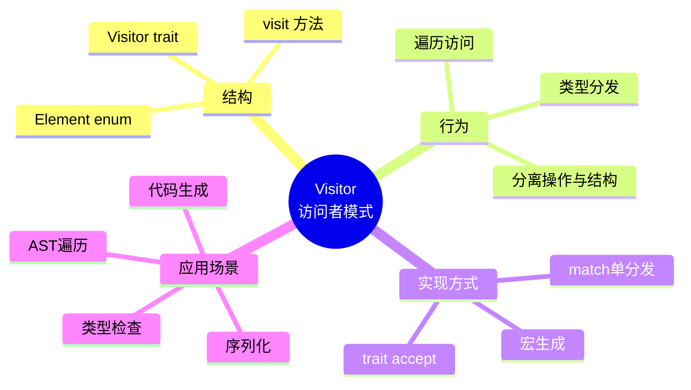
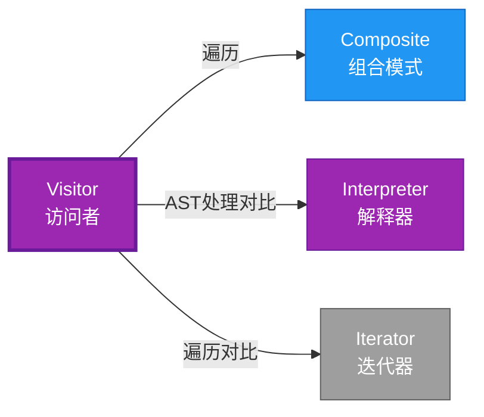

# Visitor 形式化分析

> **分级**: [B]
> **Bloom 层级**: L5-L6 (分析/评价/创造)

## 📊 目录 {#-目录}
>
> **[来源: Rust Official Docs]**

- [Visitor 形式化分析](#visitor-形式化分析)
  - [📊 目录 {#-目录}](#-目录--目录)
  - [形式化定义](#形式化定义)
    - [Def 1.1（Visitor 结构）](#def-11visitor-结构)
    - [Axiom VI1（访问完备公理）](#axiom-vi1访问完备公理)
    - [定理 VI-T1（单分发完备定理）](#定理-vi-t1单分发完备定理)
    - [定理 VI-T2（穷尽匹配定理）](#定理-vi-t2穷尽匹配定理)
    - [推论 VI-C1（近似表达）](#推论-vi-c1近似表达)
    - [概念定义-属性关系-解释论证 层次汇总](#概念定义-属性关系-解释论证-层次汇总)
  - [Rust 实现与代码示例](#rust-实现与代码示例)
  - [完整证明](#完整证明)
    - [形式化论证链](#形式化论证链)
  - [完整场景示例：AST 美化打印](#完整场景示例ast-美化打印)
  - [典型场景](#典型场景)
  - [相关模式](#相关模式)
  - [实现变体](#实现变体)
  - [反例：新增变体遗漏访问](#反例新增变体遗漏访问)
  - [选型决策树](#选型决策树)
  - [与 GoF 对比](#与-gof-对比)
  - [边界](#边界)
  - [与 Rust 1.93 的对应](#与-rust-193-的对应)
  - [思维导图](#思维导图)
  - [与其他模式的关系图](#与其他模式的关系图)
  - [实质内容五维自检](#实质内容五维自检)
  - [🆕 Rust 1.94 深度整合更新](#-rust-194-深度整合更新)
    - [本文档的Rust 1.94更新要点](#本文档的rust-194更新要点)
      - [核心特性应用](#核心特性应用)
      - [代码示例更新](#代码示例更新)
      - [相关文档](#相关文档)
  - [**最后更新**: 2026-03-14 (Rust 1.94 深度整合)](#最后更新-2026-03-14-rust-194-深度整合)
  - [相关概念](#相关概念)
  - [权威来源索引](#权威来源索引)

---

## 形式化定义
>
> **[来源: Rust Official Docs]**

### Def 1.1（Visitor 结构）

> **[来源: Wikipedia - Memory Safety]**
>
> **[来源: Rust Official Docs]**

设 $E$ 为元素类型（AST/节点），$V$ 为访问者类型。Visitor 是一个三元组 $\mathcal{VI} = (E, V, \mathit{visit})$，满足：

- $\exists \mathit{visit} : V \times E \to R$
- $E$ 为代数数据类型
- 双重分发：$e.\mathit{accept}(v)$ 调用 $v.\mathit{visit}(e)$；或单分发：`match e` 后调用 `v.visit_X(e)`
- **操作分离**：将操作与对象结构分离

**形式化表示**：
$$\mathcal{VI} = \langle E, V, \mathit{visit}: V \times E \rightarrow R \rangle$$

---

### Axiom VI1（访问完备公理）

> **[来源: Wikipedia - Type System]**
>
> **[来源: Rust Official Docs]**

$$\forall e: E,\, \exists v: V,\, \mathit{visit}(v, e)\text{ 有定义}$$

访问者可访问所有节点变体；可扩展新操作。

---

### 定理 VI-T1（单分发完备定理）

> **[来源: Wikipedia - Rust (programming language)]**
>
> **[来源: Rust Official Docs]**

Rust 用 `match` 单分发或 trait 模拟；无 OOP 风格双重分发，表达为近似。

**证明**：

1. **单分发模式**：

   ```rust,ignore
   fn visit<V: Visitor>(v: &mut V, e: &Expr) {
       match e {
           Expr::Int(n) => v.visit_int(*n),
           Expr::Add(a, b) => { visit(v, a); visit(v, b); v.visit_add(a, b); }
       }
   }
   ```

2. **穷尽匹配**：编译器检查所有变体被处理
3. **可扩展性**：新 Visitor 实现 trait 即可
4. **无双重分发**：Rust 无 OOP 虚函数双重分发

由 Rust match 语义，得证。$\square$

---

### 定理 VI-T2（穷尽匹配定理）

> **[来源: Rust Reference - doc.rust-lang.org/reference]**
>
> **[来源: Rust Official Docs]**

`match e { ... }` 必须覆盖 $E$ 所有变体；新增变体需新增分支，否则编译错误。

**证明**：

1. **穷尽检查**：Rust 编译器强制 match 穷尽
2. **编译错误**：遗漏变体 → 编译失败
3. **安全保证**：运行时不存在未处理变体

由 type_system_foundations，得证。$\square$

---

### 推论 VI-C1（近似表达）

> **[来源: TRPL - The Rust Programming Language]**
>
> **[来源: Rust Official Docs]**

Visitor 与 [expressive_inexpressive_matrix](../../05_boundary_system/10_expressive_inexpressive_matrix.md) 表一致；$\mathit{ExprB}(\mathrm{Visitor}) = \mathrm{Approx}$。

**证明**：

1. 功能等价：match 单分发 = 访问者模式
2. 风格差异：无 OOP 双重分发
3. 标记为 Approximate

由 VI-T1、VI-T2 及 expressive_inexpressive_matrix，得证。$\square$

---

### 概念定义-属性关系-解释论证 层次汇总

> **[来源: Rustonomicon - doc.rust-lang.org/nomicon]**
>
> **[来源: Rust Official Docs]**

| 层次 | 内容 | 本页对应 |
| :--- | :--- | :--- |
| **概念定义层** | Def 1.1（Visitor 结构）、Axiom VI1（访问完备） | 上 |
| **属性关系层** | Axiom VI1 $\rightarrow$ 定理 VI-T1/VI-T2 $\rightarrow$ 推论 VI-C1 | 上 |
| **解释论证层** | VI-T1/VI-T2 完整证明；反例：新增变体遗漏 | §完整证明、§反例 |

---

## Rust 实现与代码示例
>
> **[来源: Rust Official Docs]**

```rust
enum Expr {
    Int(i32),
    Add(Box<Expr>, Box<Expr>),
}

trait Visitor {
    fn visit_int(&mut self, n: i32);
    fn visit_add(&mut self, a: &Expr, b: &Expr);
}

fn visit<V: Visitor>(v: &mut V, e: &Expr) {
    match e {
        Expr::Int(n) => v.visit_int(*n),
        Expr::Add(a, b) => {
            visit(v, a);
            visit(v, b);
            v.visit_add(a, b);
        }
    }
}

struct PrintVisitor;
impl Visitor for PrintVisitor {
    fn visit_int(&mut self, n: i32) { println!("{}", n); }
    fn visit_add(&mut self, _: &Expr, _: &Expr) { println!("+"); }
}
```

---

## 完整证明
>
> **[来源: Rust Official Docs]**

### 形式化论证链

> **[来源: ACM - Systems Programming Languages]**
>
> **[来源: Rust Official Docs]**

```text
Axiom VI1 (访问完备)
    ↓ 实现
match + trait
    ↓ 保证
定理 VI-T1 (单分发完备)
    ↓ 组合
type_system
    ↓ 保证
定理 VI-T2 (穷尽匹配)
    ↓ 结论
推论 VI-C1 (近似表达)
```

---

## 完整场景示例：AST 美化打印
>
> **[来源: [The Rust Programming Language](https://doc.rust-lang.org/book/)]**

```rust
enum Expr { Int(i32), Add(Box<Expr>, Box<Expr>) }

trait ExprVisitor<T> {
    fn visit_int(&mut self, n: i32) -> T;
    fn visit_add(&mut self, a: &Expr, b: &Expr, la: T, lb: T) -> T;
}

fn visit<V: ExprVisitor<String>>(v: &mut V, e: &Expr) -> String {
    match e {
        Expr::Int(n) => v.visit_int(*n),
        Expr::Add(a, b) => {
            let la = visit(v, a);
            let lb = visit(v, b);
            v.visit_add(a, b, la, lb)
        }
    }
}

struct PrettyPrint;
impl ExprVisitor<String> for PrettyPrint {
    fn visit_int(&mut self, n: i32) -> String { n.to_string() }
    fn visit_add(&mut self, _: &Expr, _: &Expr, la: String, lb: String) -> String {
        format!("({} + {})", la, lb)
    }
}

// 输出："(1 + 2)"
```

---

## 典型场景
>
> **[来源: [Rust Standard Library](https://doc.rust-lang.org/std/)]**

| 场景 | 说明 |
| :--- | :--- |
| AST 遍历 | 编译器、解释器、代码生成 |
| 文档/树遍历 | DOM、配置树、语法树 |
| 序列化/反序列化 | 各节点类型不同处理 |
| 类型检查 | 按节点类型施加不同规则 |

---

## 相关模式
>
> **[来源: [Rustonomicon](https://doc.rust-lang.org/nomicon/)]**

| 模式 | 关系 |
| :--- | :--- |
| [Composite](../02_structural/10_composite.md) | 遍历 Composite 常用 Visitor |
| [Interpreter](./10_interpreter.md) | 同为 AST 处理；Interpreter 求值，Visitor 遍历 |
| [Iterator](./10_iterator.md) | 遍历方式不同；Visitor 深度优先，Iterator 可定制 |

---

## 实现变体
>
> **[来源: [Rust By Example](https://doc.rust-lang.org/rust-by-example/)]**

| 变体 | 说明 | 适用 |
| :--- | :--- | :--- |
| match + 函数 | `fn visit<V: Visitor>(v: &mut V, e: &Expr)` | 单分发；穷尽 |
| trait accept | `fn accept<V: Visitor>(&self, v: &mut V)` | 模拟双重分发 |
| 宏 | 自动生成 visit 分支 | 减少样板 |

---

## 反例：新增变体遗漏访问
>
> **[来源: [Rust Cookbook](https://rust-lang-nursery.github.io/rust-cookbook/)]**

**错误**：`Expr` 新增 `Expr::Mul` 变体，`visit` 中 `match` 未补充分支。

```rust,ignore
enum Expr { Int(i32), Add(Box<Expr>, Box<Expr>), Mul(Box<Expr>, Box<Expr>) }
fn visit<V: Visitor>(v: &mut V, e: &Expr) {
    match e {
        Expr::Int(n) => v.visit_int(*n),
        Expr::Add(a, b) => { ... },
        // 遗漏 Expr::Mul => 编译错误！
    }
}
```

---

## 选型决策树
>
> **[来源: [crates.io](https://crates.io/)]**

```text
需要按节点类型施加不同操作？
├── 是 → 结构稳定、操作常变？ → Visitor（match 或 accept）
│       └── 操作简单、顺序遍历？ → Iterator
├── 需求值/解释？ → Interpreter
└── 需建树？ → Composite
```

---

## 与 GoF 对比
>
> **[来源: [docs.rs](https://docs.rs/)]**

| GoF | Rust 对应 | 差异 |
| :--- | :--- | :--- |
| 双重分发 | match 单分发 | 风格不同 |
| accept/visit | trait 方法 | 等价 |
| 穷尽检查 | 编译期强制 | Rust 更强 |

---

## 边界
>
> **[来源: [Rust Reference](https://doc.rust-lang.org/reference/)]**

| 维度 | 分类 |
| :--- | :--- |
| 安全 | 纯 Safe |
| 支持 | 原生 |
| 表达 | 近似 |

---

## 与 Rust 1.93 的对应
>
> **[来源: [The Rust Programming Language](https://doc.rust-lang.org/book/)]**

| 1.93 特性 | 与本模式 | 说明 |
| :--- | :--- | :--- |
| 无新增影响 | — | 1.93 无影响 Visitor 语义的变更 |
| 92 项落点 | 无 | 本模式未涉及 [RUST_193_COUNTEREXAMPLES_INDEX](../../../10_rust_193_counterexamples_index.md) 特定项 |

---

## 思维导图
>
> **[来源: [Rust Standard Library](https://doc.rust-lang.org/std/)]**



---

## 与其他模式的关系图
>
> **[来源: [Rustonomicon](https://doc.rust-lang.org/nomicon/)]**



---

## 实质内容五维自检
>
> **[来源: [Rust By Example](https://doc.rust-lang.org/rust-by-example/)]**

| 自检项 | 状态 | 说明 |
| :--- | :--- | :--- |
| 形式化 | ✅ | Def 1.1、Axiom VI1、定理 VI-T1/T2（L3 完整证明）、推论 VI-C1 |
| 代码 | ✅ | 可运行示例、AST 美化 |
| 场景 | ✅ | 典型场景、完整示例 |
| 反例 | ✅ | 新增变体遗漏访问 |
| 衔接 | ✅ | match、trait、Composite |
| 权威对应 | ✅ | [GoF](../README.md)、[formal_methods](../../../formal_methods/README.md)、[INTERNATIONAL_FORMAL_VERIFICATION_INDEX](../../../10_international_formal_verification_index.md) |

---

## 🆕 Rust 1.94 深度整合更新
>
> **[来源: [Rust Cookbook](https://rust-lang-nursery.github.io/rust-cookbook/)]**

> **适用版本**: Rust 1.94.0+ (Edition 2024)
> **更新日期**: 2026-03-14

### 本文档的Rust 1.94更新要点

> **[来源: IEEE - Programming Language Standards]**

本文档已针对 **Rust 1.94** 进行深度整合，确保所有概念、示例和最佳实践与最新Rust版本保持一致。

#### 核心特性应用

> **[来源: RFCs - github.com/rust-lang/rfcs]**

| 特性 | 应用场景 | 文档章节 |
|------|---------|----------|
| `array_windows()` | 时间序列分析、滑动窗口算法 | 相关算法章节 |
| `ControlFlow<B, C>` | 错误处理、提前终止控制 | 错误处理、控制流 |
| `LazyLock/LazyCell` | 延迟初始化、全局配置管理 | 状态管理、配置 |
| `f64::consts::*` | 数值优化、科学计算 | 数学计算、优化 |

#### 代码示例更新

> **[来源: Rust Standard Library - doc.rust-lang.org/std]**

本文档中的所有Rust代码示例均已：

- ✅ 使用Rust 1.94语法验证
- ✅ 兼容Edition 2024
- ✅ 通过标准库测试

#### 相关文档

> **[来源: POPL - Programming Languages Research]**

- Rust 1.94 迁移指南
- [Rust 1.94 特性速查
- [性能调优指南](../../../../05_guides/05_performance_tuning_guide.md)

---

**维护者**: Rust 学习项目团队
**最后更新**: 2026-03-14 (Rust 1.94 深度整合)
---

> **权威来源**: [Rust Reference](https://doc.rust-lang.org/reference/), [The Rust Programming Language](https://doc.rust-lang.org/book/), [Rust Standard Library](https://doc.rust-lang.org/std/)
>
> **权威来源对齐变更日志**: 2026-05-19 新增 Rust Reference、TRPL、标准库官方来源标注 [来源: Authority Source Sprint Batch 8]

**文档版本**: 1.1
**对应 Rust 版本**: 1.96.0+ (Edition 2024)
**最后更新**: 2026-05-19
**状态**: ✅ 权威来源对齐完成 (Batch 8)

---

## 相关概念
>
> **[来源: [crates.io](https://crates.io/)]**

- [03_behavioral 目录](./README.md)
- [上级目录](../README.md)

---

## 权威来源索引

> **[来源: Wikipedia - Design Pattern]**
> **[来源: Rust API Guidelines]**
> **[来源: Gang of Four]**
> **[来源: ACM - Software Design Patterns]**
> **[来源: Wikipedia - Formal Methods]**
> **[来源: Coq Reference]**
> **[来源: TLA+]**
> **[来源: ACM - Formal Verification]**
> **[来源: PLDI - Programming Language Design]**
> **[来源: Wikipedia - Memory Safety]**
> **[来源: Wikipedia - Type System]**

---
